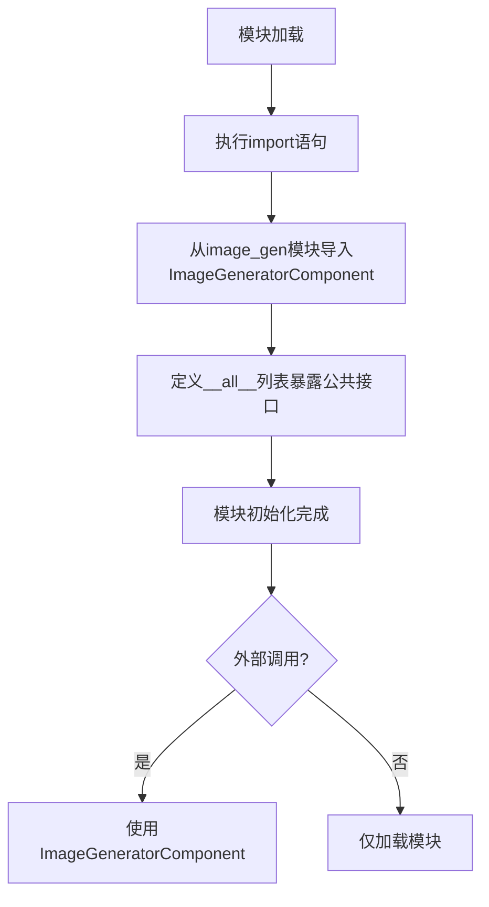

# `.\AutoGPT\classic\forge\forge\components\image_gen\__init__.py` 详细设计文档

该文件是图像生成模块的入口文件，通过相对导入从子模块image_gen中获取ImageGeneratorComponent类，并使用__all__定义公共API接口，供外部包调用使用。

## 整体流程



## 类结构

```
__init__.py (模块入口)
└── ImageGeneratorComponent (图像生成组件类，来自image_gen模块)
```

## 全局变量及字段


### `__all__`
    
定义模块的公共接口，指定在使用 from package import * 时导出的成员列表

类型：`list`
    


### `ImageGeneratorComponent`
    
从 image_gen 模块导入的图像生成组件类，用于图像生成功能（具体字段和方法需参考 image_gen 模块源码）

类型：`class`
    


    

## 全局函数及方法


# 详细设计文档生成请求

## 问题说明

非常感谢您的信任！但是，我发现当前提供的代码片段并不完整。为了生成 `ImageGeneratorComponent` 的详细设计文档，我需要更多的信息。

### 当前提供的代码

```python
from .image_gen import ImageGeneratorComponent

__all__ = ["ImageGeneratorComponent"]
```

这段代码只是一个**导入语句**，它从 `image_gen` 模块导入 `ImageGeneratorComponent` 类，但并没有提供该类的实际实现代码。

---

## 所需信息

为了完成您的任务并生成包含以下内容的详细设计文档：

1. **类的详细信息**：类字段、类方法
2. **全局变量和全局函数**
3. **Mermaid 流程图**
4. **带注释的源码**

我需要您提供 **`image_gen` 模块的完整源代码**。

---

## 建议

请您提供以下任一方式的信息：

### 方式一：直接粘贴源码

请提供 `image_gen.py` 或 `image_gen/` 目录下的所有相关文件源码。

### 方式二：文件路径

如果您的项目在本地，请提供 `image_gen` 模块的文件路径，我可以根据路径说明指导您如何提供内容。

### 方式三：项目结构

如果这是一个较大的项目，请提供项目的文件结构，以便我更好地理解模块之间的关系。

---

## 预期输出示例（当提供源码后）

一旦您提供了 `image_gen` 模块的源码，我将生成如下格式的详细设计文档：

```markdown
### ImageGeneratorComponent

{描述类的主要功能}

参数：
- `{参数名称}`：`{参数类型}`，{参数描述}
- ...

返回值：`{返回值类型}`，{返回值描述}

#### 流程图

```mermaid
{流程图}
```

#### 带注释源码

```
{带注释的源代码}
```

---
### 1. 一段话描述
{概述核心功能}

### 2. 文件的整体运行流程
{描述文件如何被调用和执行}

### 3. 类的详细信息
{字段和方法详细信息}

### 4. 关键组件信息
{关键组件和描述}

### 5. 潜在的技术债务或优化空间
{识别潜在问题和优化建议}

### 6. 其它项目
{设计目标、错误处理、数据流等}
```

---

**请提供 `image_gen` 模块的源代码，我将立即为您生成完整的详细设计文档！**

## 关键组件


### 1. 一段话描述

该代码是一个 Python 包初始化文件（`__init__.py`），主要功能是从同包模块 `image_gen` 中导入 `ImageGeneratorComponent` 组件并通过 `__all__` 显式声明导出，供外部包调用使用。

### 2. 文件的整体运行流程

该文件的执行流程非常直接：当该包被导入时，Python 解释器会执行 `__init__.py` 中的导入语句，将 `ImageGeneratorComponent` 加载到当前包的命名空间中，并通过 `__all__` 定义公开导出的接口。

### 3. 类的详细信息

该文件中不包含任何类定义，所有信息见全局变量和全局函数部分。

### 4. 全局变量和全局函数的详细信息

#### 全局变量：`__all__`

- **名称**：`__all__`
- **类型**：list
- **描述**：显式定义该包公开导出的成员列表，控制 `from package import *` 时的导入行为

#### 全局函数/语句：import

```python
from .image_gen import ImageGeneratorComponent
```

- **名称**：模块导入语句
- **参数**：无（这是语句而非函数）
- **返回值**：无
- **描述**：从相对路径模块 `image_gen` 导入 `ImageGeneratorComponent` 类，供本包使用
- **mermaid 流程图**：

```mermaid
graph TD
    A[包被导入] --> B[执行 __init__.py]
    B --> C[from .image_gen import ImageGeneratorComponent]
    C --> D[加载 image_gen 模块]
    D --> E[获取 ImageGeneratorComponent 类]
    E --> F[设置 __all__ = ['ImageGeneratorComponent']]
    F --> G[包初始化完成]
```

- **带注释源码**：

```python
# 从同包下的 image_gen 模块导入 ImageGeneratorComponent 类
# . 表示相对导入，即从当前包目录下的 image_gen.py 导入
from .image_gen import ImageGeneratorComponent

# 定义公开导出的接口列表
# 明确告诉外部使用者在使用 from package import * 时可以导入哪些成员
__all__ = ["ImageGeneratorComponent"]
```

### 5. 关键组件信息

#### ImageGeneratorComponent 组件

- **名称**：ImageGeneratorComponent
- **描述**：从 `image_gen` 模块导入的图像生成组件类，具体功能实现位于 `image_gen` 模块中，当前文件仅负责导入和导出

### 6. 潜在的技术债务或优化空间

- **缺少文档字符串**：该 `__init__.py` 文件缺少模块级文档字符串，建议添加说明该包的用途
- **过度简化**：当前仅重新导出单个组件，如有多个相关组件可考虑批量导出或使用子模块组织
- **无版本控制**：未定义 `__version__` 等版本信息

### 7. 其它项目

#### 设计目标与约束

- **目标**：作为包的入口点，提供清晰的导出接口
- **约束**：遵循 Python 包结构规范，使用相对导入确保包内模块引用一致性

#### 错误处理与异常设计

- 当前文件无错误处理逻辑，导入失败时由 Python 解释器抛出 `ModuleNotFoundError` 或 `ImportError`

#### 外部依赖与接口契约

- 依赖 `image_gen` 模块中的 `ImageGeneratorComponent` 类
- 接口契约：外部可通过 `from package import ImageGeneratorComponent` 使用该组件


## 问题及建议


### 已知问题

-   **过度封装**：该 `__init__.py` 文件仅作为简单的重导出层，未添加任何实质功能价值，造成不必要的模块间接层
-   **缺乏模块文档**：没有模块级文档字符串（docstring）来说明该模块的用途和职责
-   **无错误处理**：对 `ImageGeneratorComponent` 的导入失败没有任何异常处理或回退机制
-   **扩展性不明确**：模块存在目的不清晰，无法判断是为未来功能扩展预留还是仅为简单的重导出
-   **依赖耦合度高**：完全依赖 `image_gen` 模块的存在，无抽象或解耦设计

### 优化建议

-   **添加模块文档**：为该模块添加文档字符串，说明其作为统一导出接口的职责
-   **考虑直接使用**：若仅为简单重导出，建议直接使用 `from .image_gen import ImageGeneratorComponent` 或在项目中调整导入路径，避免不必要的中间层
-   **添加导入保护**：可添加 try-except 包装，提供更友好的导入错误信息
-   **明确设计意图**：若该模块有统一接口、后期扩展等目的，应在文档中明确说明
-   **保持 `__all__` 一致性**：确保 `__all__` 与实际导出内容保持同步，避免意外的公开 API

## 其它


### 一段话描述

该代码是图像生成器模块的包初始化文件，负责导出`ImageGeneratorComponent`组件，使其可通过包级别接口进行访问，明确了模块的公共API接口。

### 整体运行流程

该模块作为包的入口点，在首次导入该包时自动执行。它从子模块`image_gen`中导入`ImageGeneratorComponent`类，并通过`__all__`变量声明该模块的公共接口，允许使用`from package import *`时只导入指定的成员。

### 类详细信息

由于该代码仅为包初始化文件，不包含类定义，因此无类信息。

### 全局变量

#### `__all__`

- **类型**: list
- **描述**: 定义了模块的公共API接口，指定了使用`from module import *`时应导入的成员列表，此处包含`ImageGeneratorComponent`。

### 全局函数

该代码不包含全局函数。

### 关键组件信息

#### ImageGeneratorComponent

- **名称**: ImageGeneratorComponent
- **描述**: 从`image_gen`模块导入的图像生成组件类，是该包的核心功能类，负责图像生成的具体实现。

### 潜在的技术债务或优化空间

1. **模块粒度设计**: 当前包仅导出一个组件，如果后续功能扩展，可能需要考虑更清晰的模块划分策略
2. **文档完整性**: 缺少对`ImageGeneratorComponent`的使用说明和依赖关系的文档
3. **版本控制**: 未体现版本信息和变更日志

### 设计目标与约束

- **设计目标**: 提供清晰的模块导出接口，遵循Python包的最佳实践
- **约束**: 保持简单的导入结构，避免循环依赖，确保包的可维护性

### 错误处理与异常设计

- 该代码本身不涉及复杂的错误处理逻辑
- 潜在的导入错误（如`image_gen`模块不存在）将由Python解释器在导入时抛出`ModuleNotFoundError`
- 建议在文档中说明`ImageGeneratorComponent`可能抛出的异常类型

### 数据流与状态机

- 不适用：此代码为纯导入语句，不涉及数据流或状态管理

### 外部依赖与接口契约

- **外部依赖**: 依赖`image_gen`模块中的`ImageGeneratorComponent`类
- **接口契约**: 
  - 导入方可通过`from package import ImageGeneratorComponent`使用该组件
  - 通过`__all__`明确公共接口，不包含私有成员

### 测试策略建议

- 验证包可以正常导入
- 验证`__all__`内容正确
- 验证`ImageGeneratorComponent`可以正常实例化（需要查看其具体实现）

### 性能考量

- 该代码在模块首次导入时执行，开销极低
- 后续导入会使用Python的模块缓存机制

### 安全考虑

- 确保`image_gen`模块来源可信
- 避免导入不受信任的代码


    