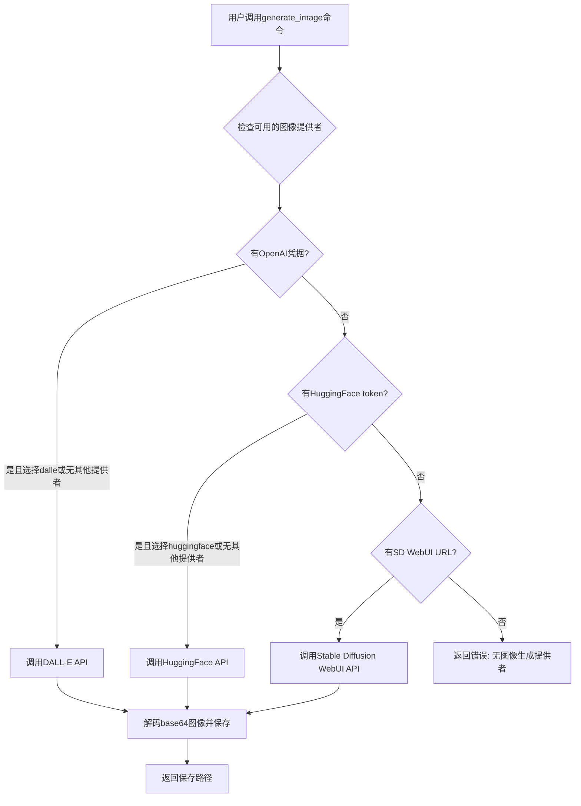
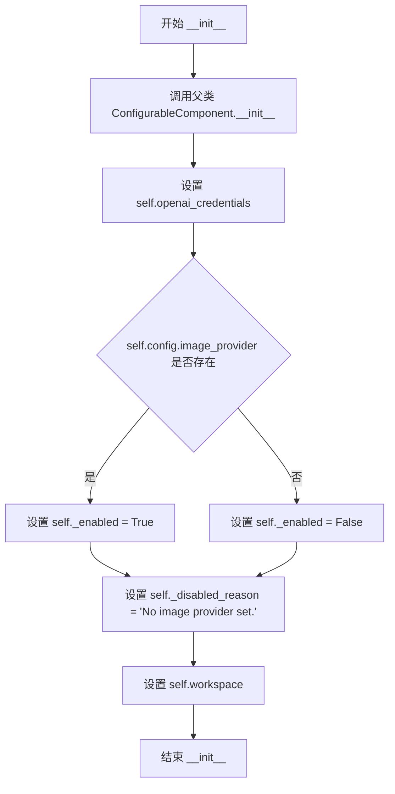
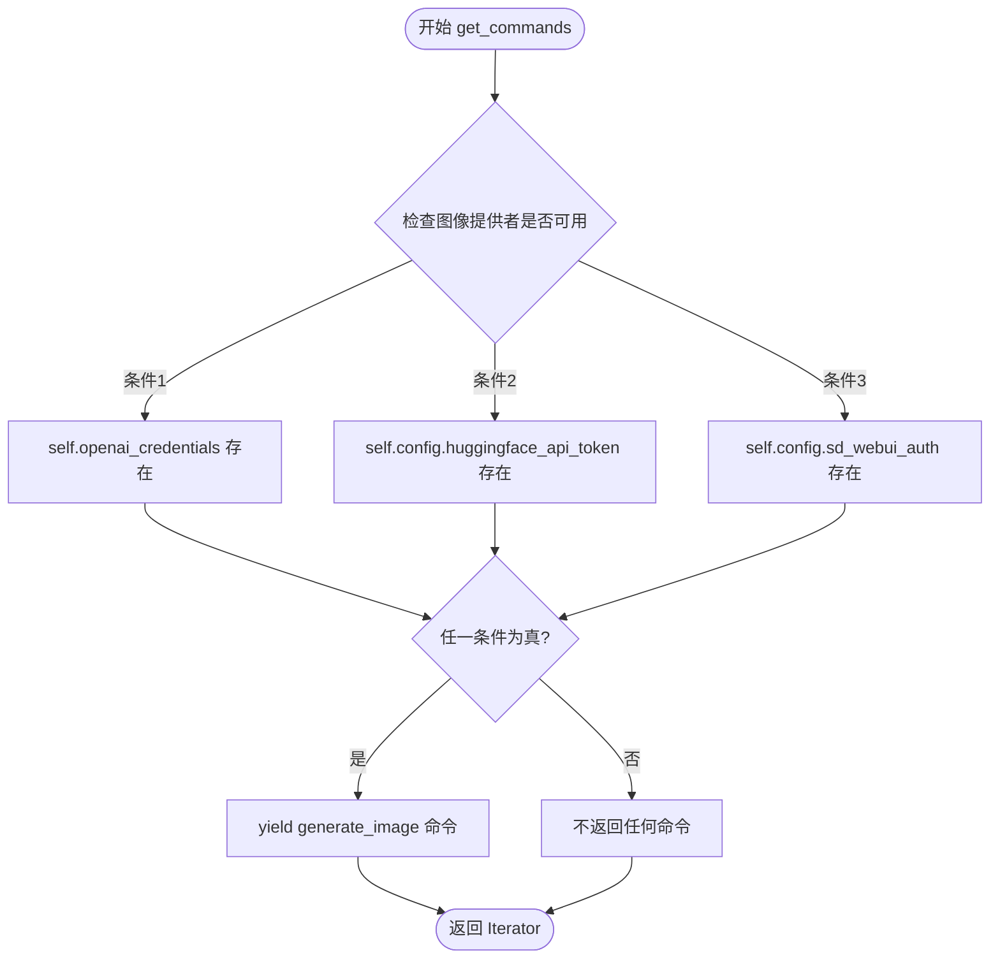
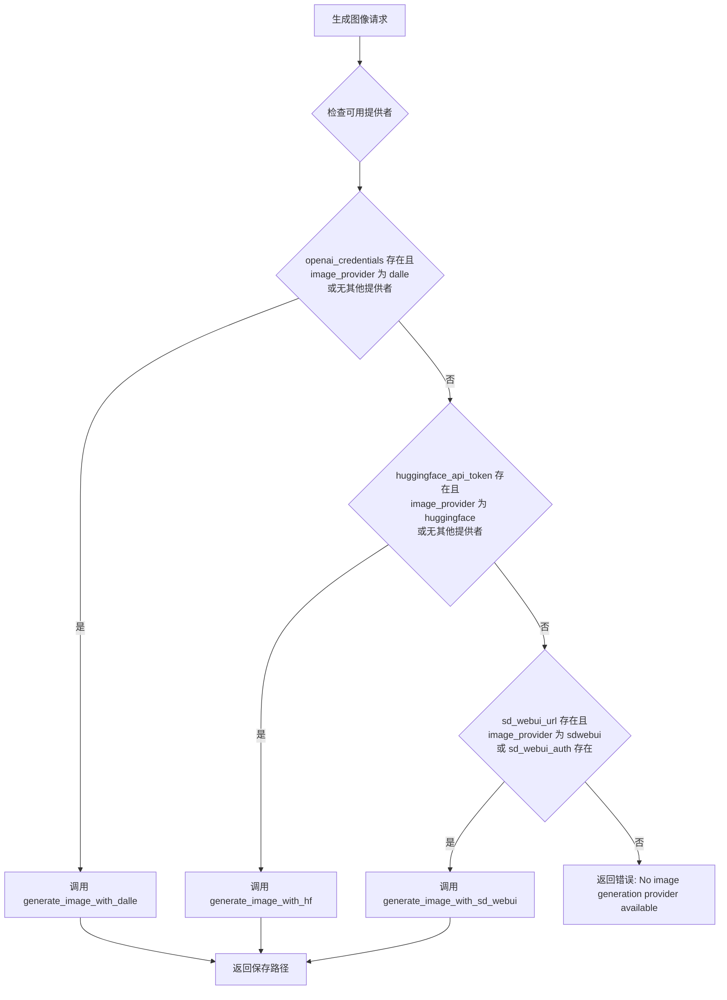
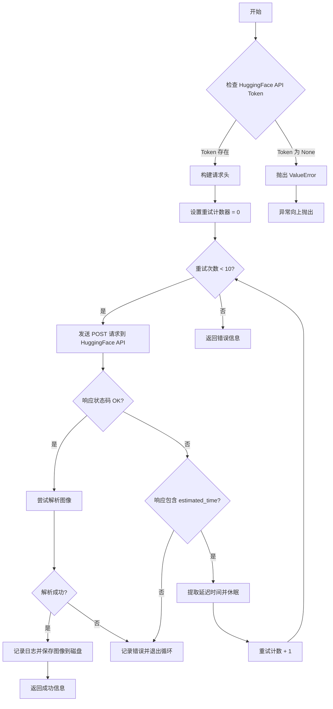
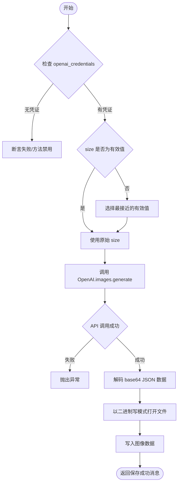

# `.\AutoGPT\classic\forge\forge\components\image_gen\image_gen.py` 详细设计文档

一个图像生成组件，支持多种图像生成提供者（DALL-E、HuggingFace、Stable Diffusion WebUI），通过命令接口将文本提示转换为图像并保存到工作区。

## 整体流程



## 类结构

```
ImageGeneratorConfiguration (Pydantic BaseModel)
└── ImageGeneratorComponent (CommandProvider, ConfigurableComponent)
    └── ImageGeneratorComponent:generate_image()
    └── ImageGeneratorComponent:generate_image_with_hf()
    └── ImageGeneratorComponent:generate_image_with_dalle()
    └── ImageGeneratorComponent:generate_image_with_sd_webui()
```

## 全局变量及字段


### `image_provider`
    
The image generation provider to use (dalle, huggingface, or sdwebui)

类型：`Literal['dalle', 'huggingface', 'sdwebui']`
    


### `huggingface_image_model`
    
The HuggingFace model identifier for image generation

类型：`str`
    


### `huggingface_api_token`
    
API token for authenticating with HuggingFace services

类型：`Optional[SecretStr]`
    


### `sd_webui_url`
    
The base URL for Stable Diffusion WebUI API endpoint

类型：`str`
    


### `sd_webui_auth`
    
Authentication credentials for Stable Diffusion WebUI in format username:password

类型：`Optional[SecretStr]`
    


### `ImageGeneratorComponent.config_class`
    
The configuration class type used by the configurable component

类型：`type[ImageGeneratorConfiguration]`
    


### `ImageGeneratorComponent.openai_credentials`
    
Credentials for authenticating with OpenAI API, required for DALL-E provider

类型：`Optional[OpenAICredentials]`
    


### `ImageGeneratorComponent._enabled`
    
Flag indicating whether the image generation component is enabled

类型：`bool`
    


### `ImageGeneratorComponent._disabled_reason`
    
Reason message explaining why the component is disabled

类型：`str`
    


### `ImageGeneratorComponent.workspace`
    
File storage instance for managing generated image files in the workspace

类型：`FileStorage`
    
    

## 全局函数及方法


### `ImageGeneratorComponent.__init__`

初始化 `ImageGeneratorComponent` 实例，设置工作空间、配置和 OpenAI 凭证，并确定组件的启用状态。

参数：

- `workspace`：`FileStorage`，用于存储生成图像的工作空间文件系统
- `config`：`Optional[ImageGeneratorConfiguration]`，图像生成器的配置对象，包含提供商类型、API 令牌等配置
- `openai_credentials`：`Optional[OpenAICredentials]`，OpenAI 凭证，仅在使用 `dalle` 提供商时需要

返回值：`None`，构造函数不返回任何值

#### 流程图



#### 带注释源码

```python
def __init__(
    self,
    workspace: FileStorage,
    config: Optional[ImageGeneratorConfiguration] = None,
    openai_credentials: Optional[OpenAICredentials] = None,
):
    """openai_credentials only needed for `dalle` provider."""
    # 调用父类 ConfigurableComponent 的初始化方法，传入配置
    ConfigurableComponent.__init__(self, config)
    
    # 设置 OpenAI 凭证，用于 DALL-E 图像生成
    self.openai_credentials = openai_credentials
    
    # 根据是否有图像提供商设置启用状态
    self._enabled = bool(self.config.image_provider)
    
    # 设置禁用原因，当没有提供商时说明原因
    self._disabled_reason = "No image provider set."
    
    # 保存工作空间引用，用于存储生成的图像文件
    self.workspace = workspace
```


### `ImageGeneratorComponent.get_commands`

该方法是 `ImageGeneratorComponent` 类的核心方法之一，负责检查并返回可用的图像生成命令。它通过检查是否配置了任何图像生成提供者（OpenAI DALL-E、HuggingFace 或 Stable Diffusion WebUI），如果有可用的提供者，则返回 `generate_image` 命令供外部调用。

参数：无（仅包含 self 隐式参数）

返回值：`Iterator[Command]` ，返回一个命令迭代器，当有可用的图像生成提供者时，包含 `generate_image` 命令；否则不返回任何命令。

#### 流程图



#### 带注释源码

```python
def get_commands(self) -> Iterator[Command]:
    """获取可用的图像生成命令。
    
    该方法检查是否配置了任何图像生成提供者（OpenAI DALL-E、HuggingFace 或 
    Stable Diffusion WebUI）。如果至少有一个提供者可用，则返回 generate_image 
    命令供外部调用系统使用。
    
    Returns:
        Iterator[Command]: 一个命令迭代器，包含可用的图像生成命令
    """
    # 检查是否存在任何可用的图像生成凭据或配置
    # 条件包括：OpenAI凭据、HuggingFace API Token、Stable Diffusion WebUI认证
    if (
        self.openai_credentials
        or self.config.huggingface_api_token
        or self.config.sd_webui_auth
    ):
        # 当有可用提供者时，yield生成图像的命令
        yield self.generate_image
    # 如果没有任何提供者，则不产生任何命令（返回空迭代器）
```


### `ImageGeneratorComponent.generate_image`

根据配置选择合适的图像生成提供者（DALL-E、HuggingFace、Stable Diffusion WebUI），生成符合文本提示的图像并保存到工作区，返回保存路径或错误信息。

参数：

- `prompt`：`str`，用于生成图像的文本提示词
- `size`：`int`，图像尺寸（仅 DALL-E 和 SD WebUI 支持），默认为 256

返回值：`str`，成功时返回 `"Saved to disk: {output_file}"`，失败时返回错误信息字符串

#### 流程图



#### 带注释源码

```python
@command(
    parameters={
        "prompt": JSONSchema(
            type=JSONSchema.Type.STRING,
            description="The prompt used to generate the image",
            required=True,
        ),
        "size": JSONSchema(
            type=JSONSchema.Type.INTEGER,
            description="The size of the image [256, 512, 1024]",
            required=False,
        ),
    },
)
def generate_image(self, prompt: str, size: int) -> str:
    """Generate an image from a prompt.

    Args:
        prompt (str): The prompt to use
        size (int, optional): The size of the image. Defaults to 256.
            Not supported by HuggingFace.

    Returns:
        str: The filename of the image
    """
    # 生成唯一的文件名，使用 UUID 避免冲突
    filename = self.workspace.root / f"{str(uuid.uuid4())}.jpg"

    # 优先级判断：按顺序检查各提供者的可用性
    # 1. DALL-E: 需要 openai_credentials，且 provider 为 dalle 或无其他配置
    if self.openai_credentials and (
        self.config.image_provider == "dalle"
        or not (self.config.huggingface_api_token or self.config.sd_webui_url)
    ):
        return self.generate_image_with_dalle(prompt, filename, size)

    # 2. HuggingFace: 需要 huggingface_api_token，且 provider 为 huggingface 或无其他配置
    elif self.config.huggingface_api_token and (
        self.config.image_provider == "huggingface"
        or not (self.openai_credentials or self.config.sd_webui_url)
    ):
        return self.generate_image_with_hf(prompt, filename)

    # 3. Stable Diffusion WebUI: 需要 sd_webui_url，且 provider 为 sdwebui 或配置了 auth
    elif self.config.sd_webui_url and (
        self.config.image_provider == "sdwebui" or self.config.sd_webui_auth
    ):
        return self.generate_image_with_sd_webui(prompt, filename, size)

    # 无可用提供者时返回错误信息
    return "Error: No image generation provider available"
```


### `ImageGeneratorComponent.generate_image_with_hf`

该方法通过调用 HuggingFace 的推理 API 生成图像，支持自动重试机制，处理可能的延迟响应，并将生成的图像保存到指定路径。

参数：

- `prompt`：`str`，用于生成图像的文本提示词
- `output_file`：`Path`，保存生成图像的文件路径

返回值：`str`，表示操作结果的字符串，成功时返回 "Saved to disk: {output_file}"，失败时返回 "Error creating image."

#### 流程图



#### 带注释源码

```python
def generate_image_with_hf(self, prompt: str, output_file: Path) -> str:
    """Generate an image with HuggingFace's API.

    Args:
        prompt (str): The prompt to use
        filename (Path): The filename to save the image to

    Returns:
        str: The filename of the image
    """
    # 构建 HuggingFace API 端点 URL，使用配置中的模型名称
    API_URL = f"https://api-inference.huggingface.co/models/{self.config.huggingface_image_model}"  # noqa: E501
    
    # 验证 API Token 是否已配置，若未配置则抛出异常
    if self.config.huggingface_api_token is None:
        raise ValueError(
            "You need to set your Hugging Face API token in the config file."
        )
    
    # 构造 HTTP 请求头，包含认证信息和缓存控制
    headers = {
        "Authorization": (
            f"Bearer {self.config.huggingface_api_token.get_secret_value()}"
        ),
        "X-Use-Cache": "false",
    }

    # 初始化重试计数器
    retry_count = 0
    
    # 最多重试 10 次以处理服务延迟
    while retry_count < 10:
        # 发送推理请求到 HuggingFace API
        response = requests.post(
            API_URL,
            headers=headers,
            json={
                "inputs": prompt,
            },
        )

        # 检查 HTTP 响应是否成功
        if response.ok:
            try:
                # 从响应内容创建 PIL Image 对象
                image = Image.open(io.BytesIO(response.content))
                logger.info(f"Image Generated for prompt:{prompt}")
                # 保存图像到指定文件路径
                image.save(output_file)
                return f"Saved to disk: {output_file}"
            except Exception as e:
                # 图像处理失败时记录错误并退出
                logger.error(e)
                break
        else:
            try:
                # 尝试解析错误响应 JSON
                error = json.loads(response.text)
                # 检查是否包含预计等待时间（模型正在加载）
                if "estimated_time" in error:
                    delay = error["estimated_time"]
                    logger.debug(response.text)
                    logger.info("Retrying in", delay)
                    # 等待指定时间后重试
                    time.sleep(delay)
                else:
                    # 其他错误直接退出循环
                    break
            except Exception as e:
                logger.error(e)
                break

        # 重试次数递增
        retry_count += 1

    # 达到最大重试次数或发生错误，返回错误信息
    return "Error creating image."
```


### `ImageGeneratorComponent.generate_image_with_dalle`

该方法使用 DALL-E API 生成图像，接受文本提示符和期望的图像尺寸，通过 OpenAI API 调用生成图像，并将生成的图像以 Base64 编码形式解码后保存到指定路径，返回保存成功的文件路径字符串。

参数：

- `prompt`：`str`，用于生成图像的文本提示词
- `output_file`：`Path`，保存图像的目标文件路径
- `size`：`int`，生成的图像尺寸（仅支持 256、512、1024）

返回值：`str`，返回图像保存成功的信息，格式为 `"Saved to disk: {output_file}"`

#### 流程图



#### 带注释源码

```python
def generate_image_with_dalle(
    self, prompt: str, output_file: Path, size: int
) -> str:
    """Generate an image with DALL-E.

    Args:
        prompt (str): The prompt to use
        filename (Path): The filename to save the image to
        size (int): The size of the image

    Returns:
        str: The filename of the image
    """
    # 断言确保 openai_credentials 存在，否则该工具处于禁用状态
    assert self.openai_credentials  # otherwise this tool is disabled

    # 检查支持的图像尺寸，DALL-E 仅支持 256x256, 512x512, 1024x1024
    if size not in [256, 512, 1024]:
        # 找到最接近的有效尺寸
        closest = min([256, 512, 1024], key=lambda x: abs(x - size))
        logger.info(
            "DALL-E only supports image sizes of 256x256, 512x512, or 1024x1024. "
            f"Setting to {closest}, was {size}."
        )
        size = closest

    # 创建 OpenAI 客户端并调用 DALL-E 生成图像
    # TODO: integrate in `forge.llm.providers`(?)
    response = OpenAI(
        api_key=self.openai_credentials.api_key.get_secret_value(),
        organization=self.openai_credentials.organization.get_secret_value()
        if self.openai_credentials.organization
        else None,
    ).images.generate(
        prompt=prompt,
        n=1,
        # TODO: improve typing of size config item(s)
        size=f"{size}x{size}",  # type: ignore
        response_format="b64_json",  # 请求返回 Base64 编码的 JSON 格式
    )
    # 断言确保返回的 b64_json 不为空
    assert response.data[0].b64_json is not None  # response_format = "b64_json"

    logger.info(f"Image Generated for prompt: {prompt}")

    # 将 Base64 编码的图像数据解码为二进制
    image_data = b64decode(response.data[0].b64_json)

    # 以二进制写模式打开文件并写入图像数据
    with open(output_file, mode="wb") as png:
        png.write(image_data)

    # 返回保存成功的信息
    return f"Saved to disk: {output_file}"
```


### `ImageGeneratorComponent.generate_image_with_sd_webui`

该方法通过调用 Stable Diffusion WebUI 的 txt2img API，根据文本提示词生成图像，并将生成的图像保存到指定的文件路径中。

参数：

- `prompt`：`str`，用于生成图像的文本提示词
- `output_file`：`Path`，保存图像的目标文件路径
- `size`：`int`，生成图像的尺寸，默认为 512
- `negative_prompt`：`str`，负面提示词，用于指定不希望出现的元素，默认为空字符串
- `extra`：`dict`，额外的 API 参数，默认为空字典

返回值：`str`，返回保存成功的文件路径字符串，格式为 "Saved to disk: {output_file}"

#### 流程图

```mermaid
flowchart TD
    A[开始 generate_image_with_sd_webui] --> B[创建 requests Session]
    B --> C{检查是否需要认证}
    C -->|是| D[解析 sd_webui_auth 获取用户名和密码]
    D --> E[设置 Session 的基本认证]
    C -->|否| F[跳过认证设置]
    E --> G[发送 POST 请求到 sd_webui txt2img API]
    F --> G
    G --> H[构建 JSON 请求体]
    H --> I[包含 prompt, negative_prompt, sampler_index, steps, config_scale, width, height, n_iter 和 extra]
    I --> J[发送请求并获取响应]
    J --> K[记录日志: Image Generated for prompt]
    K --> L[解析响应 JSON]
    L --> M[提取 base64 编码的图像数据]
    M --> N[使用 b64decode 解码图像]
    N --> O[使用 PIL Image.open 打开解码后的图像]
    O --> P[保存图像到 output_file]
    P --> Q[返回 'Saved to disk: {output_file}']
```

#### 带注释源码

```python
def generate_image_with_sd_webui(
    self,
    prompt: str,
    output_file: Path,
    size: int = 512,
    negative_prompt: str = "",
    extra: dict = {},
) -> str:
    """Generate an image with Stable Diffusion webui.
    Args:
        prompt (str): The prompt to use
        filename (str): The filename to save the image to
        size (int, optional): The size of the image. Defaults to 256.
        negative_prompt (str, optional): The negative prompt to use. Defaults to "".
        extra (dict, optional): Extra parameters to pass to the API. Defaults to {}.
    Returns:
        str: The filename of the image
    """
    # 创建 HTTP 会话对象，用于管理连接
    s = requests.Session()
    
    # 检查是否配置了 WebUI 认证信息
    if self.config.sd_webui_auth:
        # 从配置中获取认证凭据，格式为 "username:password"
        username, password = self.config.sd_webui_auth.get_secret_value().split(":")
        # 设置会话的基本认证信息
        s.auth = (username, password or "")

    # 向 Stable Diffusion WebUI 的 txt2img API 发送 POST 请求
    response = requests.post(
        # 构建 API 端点 URL
        f"{self.config.sd_webui_url}/sdapi/v1/txt2img",
        # 构建请求 JSON 数据
        json={
            "prompt": prompt,  # 正向提示词
            "negative_prompt": negative_prompt,  # 负向提示词
            "sampler_index": "DDIM",  # 采样器类型
            "steps": 20,  # 采样步数
            "config_scale": 7.0,  # 配置比例
            "width": size,  # 图像宽度
            "height": size,  # 图像高度
            "n_iter": 1,  # 生成图像数量
            **extra,  # 合并额外的自定义参数
        },
    )

    # 记录图像生成成功的日志
    logger.info(f"Image Generated for prompt: '{prompt}'")

    # 解析响应 JSON 数据
    response = response.json()
    # 提取第一个图像的 base64 数据（可能包含前缀，需要split处理）
    b64 = b64decode(response["images"][0].split(",", 1)[0])
    # 使用 PIL 库从解码后的字节数据打开图像
    image = Image.open(io.BytesIO(b64))
    # 将图像保存到指定文件路径
    image.save(output_file)

    # 返回保存成功的消息
    return f"Saved to disk: {output_file}"
```

## 关键组件


### ImageGeneratorConfiguration

配置类，定义图像生成器的配置参数，支持三种图像提供者（DALL-E、HuggingFace、Stable Diffusion WebUI），包含提供者选择、模型名称、API令牌和认证信息等配置项。

### ImageGeneratorComponent

核心组件类，实现CommandProvider和ConfigurableComponent接口，提供图像生成命令。根据配置自动选择合适的图像生成服务（DALL-E、HuggingFace或Stable Diffusion WebUI），并协调生成流程。

### 图像提供者选择逻辑

generate_image方法中的条件判断逻辑，根据openai_credentials、huggingface_api_token和sd_webui_auth的可用性，结合image_provider配置，决定使用哪个图像生成服务。

### generate_image_with_dalle

使用OpenAI DALL-E API生成图像的方法，支持256x256、512x512或1024x1024尺寸，将返回的Base64编码图像解码并保存到磁盘。

### generate_image_with_hf

使用HuggingFace Inference API生成图像的方法，包含重试机制（最多10次），处理API返回的估计等待时间，实现图像下载和保存。

### generate_image_with_sd_webui

使用Stable Diffusion WebUI API生成图像的方法，支持自定义负向提示和额外参数，处理Base64图像数据并保存到文件。

### Credentials管理

对OpenAI API密钥、HuggingFace API令牌和Stable Diffusion认证信息的安全管理，使用SecretStr类型保护敏感信息，支持从环境变量读取。

### 工作区文件管理

使用FileStorage的workspace.root生成唯一UUID文件名，将生成的图像保存到工作区目录。

### 错误处理与重试机制

HuggingFace生成方法包含详细的错误处理和重试逻辑，解析API响应中的estimated_time字段实现等待后重试，处理JSON解析异常和网络错误。

### 日志记录

使用Python logging模块记录图像生成过程，包括成功生成提示、错误信息和调试信息，便于问题排查和监控。


## 问题及建议


### 已知问题

-   **HTTP请求缺少超时设置**：所有外部API调用（requests.post）均未设置timeout参数，可能导致请求无限期等待
-   **重试逻辑存在缺陷**：在`generate_image_with_hf`方法中，成功响应后未break而是直接break，且retry_count逻辑位置导致实际重试次数可能不足10次
-   **错误处理方式不统一**：失败时返回字符串错误信息而非抛出异常，上游调用者难以进行有效的错误处理
-   **硬编码的API URL和模型**：`huggingface_image_model`默认值`"CompVis/stable-diffusion-v1-4"`已过时，且API URL硬编码无法灵活配置
-   **断言用于运行时检查**：使用`assert`检查`openai_credentials`存在性，在Python优化模式下（-O）会被跳过
-   **类型注解不完整**：`extra: dict = {}`应使用`Dict[str, Any]`，且`generate_image`的`size`参数缺少默认值类型描述
-   **资源未正确释放**：`requests.Session()`创建后未显式关闭，虽有上下文管理器但未使用
-   **Magic Number散布**：重试次数10、SD WebUI的steps=20、config_scale=7.0等硬编码值应提取为常量或配置项

### 优化建议

-   为所有HTTP请求添加合理的timeout参数（如`timeout=30`），防止无限等待
-   统一错误处理策略：使用自定义异常类或返回Result类型，替代字符串错误信息
-   将硬编码配置（API URL、模型名称、重试次数、默认参数等）移至`ImageGeneratorConfiguration`类中
-   将`assert`替换为显式的条件检查和`ValueError`异常抛出
-   使用`typing.Dict`和`typing.Any`替代`dict`进行类型注解
-   为`requests.Session()`使用上下文管理器或确保在finally块中关闭连接
-   提取常量（如`MAX_RETRIES`、`DEFAULT_SIZE`等）到模块顶部或配置类中，提高可维护性
-   考虑添加异步支持（aiohttp）或线程池执行，避免阻塞主线程

## 其它


### 设计目标与约束

本组件的设计目标是为 AI Agent 框架提供一个可扩展的图像生成能力，支持多种图像生成 Provider（DALL-E、HuggingFace、Stable Diffusion WebUI），通过统一的命令接口暴露图像生成功能。设计约束包括：1）配置驱动的 Provider 选择机制，默认优先使用 DALL-E；2）所有生成的图像必须保存到 workspace 指定的文件存储中；3）Provider 的选择逻辑基于配置和凭据的可用性动态决定；4）HuggingFace API 具备重试机制以应对排队延迟。

### 错误处理与异常设计

错误处理采用分层设计：1）在配置阶段，`generate_image_with_hf` 方法会在 API Token 未设置时抛出 `ValueError`；2）在 HTTP 请求层面，HuggingFace Provider 实现了重试机制（最多 10 次），根据响应中的 `estimated_time` 字段自动延迟重试；3）图像保存阶段使用 try-except 捕获 `Exception` 并记录日志；4）所有 Provider 调用失败时返回错误字符串 `"Error: No image generation provider available"` 或 `"Error creating image."`，而非抛出异常以保证命令调用的稳定性。DALL-E 方法使用 `assert` 进行关键前置条件校验（如凭据存在、响应数据完整）。

### 数据流与状态机

组件的核心状态转换如下：初始化时处于 `DISABLED` 状态（当无任何 Provider 凭据时），否则处于 `IDLE` 状态。当 `generate_image` 命令被调用时，状态转换为 `SELECTING_PROVIDER`，根据配置和凭据可用性选择目标 Provider，随后进入 `GENERATING` 状态调用对应 API。API 成功返回后进入 `SAVING` 状态将图像写入 workspace，最后返回结果字符串并回到 `IDLE` 状态。若在任何阶段发生错误，状态转为 `ERROR` 并返回错误信息。

### 外部依赖与接口契约

本组件依赖以下外部服务接口：1）**OpenAI Images API**：用于 DALL-E 图像生成，接口为 `OpenAI.images.generate()`，接受 prompt、size、response_format 等参数，返回 Base64 编码的 JSON 数据；2）**HuggingFace Inference API**：端点为 `https://api-inference.huggingface.co/models/{model}`，支持 POST 请求并返回图像二进制数据；3）**Stable Diffusion WebUI API**：本地服务接口，端点为 `{sd_webui_url}/sdapi/v1/txt2img`，接受 JSON 格式的生成参数并返回 Base64 编码的图像列表。内部依赖包括：`forge.agent.components.ConfigurableComponent`（配置组件）、`forge.command.command`（命令装饰器）、`forge.file_storage.FileStorage`（文件存储）、`forge.llm.providers.openai.OpenAICredentials`（OpenAI 凭据）等。

### 安全性考虑

敏感信息通过 `pydantic.SecretStr` 类型保护，包括 HuggingFace API Token 和 Stable Diffusion WebUI 认证信息。在配置中设置 `exclude=True` 防止敏感值被序列化或日志输出。SD WebUI 认证采用 HTTP Basic Auth 机制，密码可为空字符串。

### 配置管理

`ImageGeneratorConfiguration` 模型定义了所有可配置项：`image_provider` 指定使用的 Provider（dalle/huggingface/sdwebui）；`huggingface_image_model` 指定 HuggingFace 模型名称；`huggingface_api_token`、`sd_webui_url`、`sd_webui_auth` 分别为各 Provider 的认证和连接信息。支持从环境变量 `HUGGINGFACE_API_TOKEN` 和 `SD_WEBUI_AUTH` 自动加载配置。

### 扩展性分析

当前设计具备良好的扩展性：1）新增 Provider 只需在 `generate_image` 方法中添加新的条件分支，调用对应的私有方法；2）Provider 选择逻辑可通过策略模式进一步抽象；3）SD WebUI 的 `extra` 参数允许传入自定义生成参数而无需修改核心逻辑。潜在扩展点包括：支持图像变体、图像编辑功能、批量生成等。


    