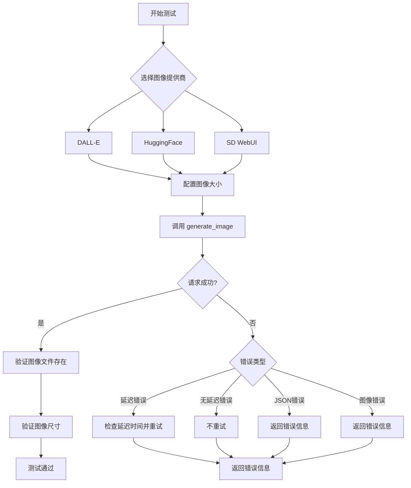

# `.\AutoGPT\classic\forge\forge\components\image_gen\test_image_gen.py` 详细设计文档

这是一个图像生成组件的集成测试文件，测试了多种图像生成提供商（包括DALL-E、HuggingFace Stable Diffusion、SD WebUI）的功能，验证了图像生成、尺寸验证、错误处理、重试机制以及负面提示等核心功能。

## 整体流程



## 类结构

```
测试文件 (test_image_gen.py)
├── Fixtures
│   ├── image_gen_component
│   ├── huggingface_image_gen_component
│   └── image_size
├── 辅助函数
│   ├── lst()
│   └── generate_and_validate()
└── 测试函数
    ├── test_dalle()
    ├── test_huggingface()
    ├── test_sd_webui()
    ├── test_sd_webui_negative_prompt()
    ├── test_huggingface_fail_request_with_delay()
    ├── test_huggingface_fail_request_no_delay()
    ├── test_huggingface_fail_request_bad_json()
    └── test_huggingface_fail_request_bad_image()
```

## 全局变量及字段


### `cred`
    
OpenAI凭证对象，用于提供API认证信息

类型：`OpenAICredentials`
    


### `config`
    
图像生成器配置对象，包含提供商和模型参数

类型：`ImageGeneratorConfiguration`
    


### `image_size`
    
图像尺寸参数，支持256、512、1024像素

类型：`int`
    


### `image_provider`
    
图像提供商名称，如dalle、huggingface、sd_webui

类型：`str`
    


### `hugging_face_image_model`
    
HuggingFace模型名称，如CompVis/stable-diffusion-v1-4

类型：`str`
    


### `prompt`
    
图像生成提示词，描述期望生成的图像内容

类型：`str`
    


### `negative_prompt`
    
负面提示词，用于指定不希望出现的图像元素

类型：`str`
    


### `image_path`
    
生成的图像文件路径，指向本地文件系统

类型：`Path`
    


### `return_text`
    
模拟的API返回文本，用于测试错误处理场景

类型：`str`
    


### `delay`
    
延迟时间（秒），用于模拟模型加载等待

类型：`int`
    


### `image_hash`
    
图像的MD5哈希值，用于比较图像差异

类型：`str`
    


### `neg_image_hash`
    
带负面提示的图像MD5哈希值，用于验证负面提示效果

类型：`str`
    


    

## 全局函数及方法


### `lst`

从 `generate_image()` 方法的输出字符串中提取文件路径。

参数：

-  `txt`：`str`，包含文件路径信息的字符串，通常格式为 "Image saved to: /path/to/file.jpg"

返回值：`Path`，提取出的文件路径对象

#### 流程图

```mermaid
flowchart TD
    A[开始: 输入字符串 txt] --> B[使用 ': ' 作为分隔符分割字符串, 最多分割1次]
    B --> C[取分割结果的第二个部分即索引1]
    C --> D[去除首尾空白字符 strip()]
    D --> E[转换为 Path 对象]
    E --> F[返回 Path 对象]
```

#### 带注释源码

```python
def lst(txt):
    """Extract the file path from the output of `generate_image()`"""
    # 使用 ": " 作为分隔符分割字符串，maxsplit=1 表示最多分割成2部分
    # 例如: "Image saved to: /path/to/image.jpg" -> ["Image saved to", "/path/to/image.jpg"]
    # 取第二部分（索引1），即文件路径部分
    # 使用 strip() 去除首尾空白字符
    # 最后将字符串转换为 Path 对象并返回
    return Path(txt.split(": ", maxsplit=1)[1].strip())
```


### `generate_and_validate`

该函数是图像生成测试的核心辅助函数，用于配置图像生成组件、生成指定尺寸的图像，并验证输出文件的存在性以及图像尺寸的正确性。

参数：

- `image_gen_component`：`ImageGeneratorComponent`，图像生成组件实例，用于执行实际的图像生成操作
- `image_size`：`int`，期望生成的图像尺寸（宽度和高度），支持 256、512、1024 等值
- `image_provider`：`str`，图像生成服务提供商，枚举值包括 "dalle"、"huggingface"、"sd_webui"
- `hugging_face_image_model`：`Optional[str]`，可选参数，指定 HuggingFace 的图像生成模型名称，如 "CompVis/stable-diffusion-v1-4"
- `**kwargs`：`Any`，其他关键字参数，会透传到 `generate_image` 方法

返回值：`None`，该函数不返回任何值，通过断言验证图像生成结果，如果验证失败会抛出 `AssertionError`

#### 流程图

```mermaid
flowchart TD
    A[开始 generate_and_validate] --> B[设置 image_provider 配置]
    B --> C{判断 hugging_face_image_model 是否存在}
    C -->|是| D[设置 huggingface_image_model 配置]
    C -->|否| E[跳过模型配置]
    D --> F[定义提示词 prompt]
    E --> F
    F --> G[调用 generate_image 方法生成图像]
    G --> H[使用 lst 函数解析输出路径]
    H --> I{验证 image_path.exists}
    I -->|是| J[打开图像文件]
    I -->|否| K[抛出 AssertionError]
    J --> L{验证 img.size == (image_size, image_size)}
    L -->|是| M[验证通过，函数结束]
    L -->|否| K
```

#### 带注释源码

```python
def generate_and_validate(
    image_gen_component: ImageGeneratorComponent,  # 图像生成组件实例
    image_size,                                     # 期望的图像尺寸（整数）
    image_provider,                                 # 图像提供者名称（字符串）
    hugging_face_image_model=None,                  # 可选的 HuggingFace 模型名称
    **kwargs,                                       # 透传的其他关键字参数
):
    """
    生成图像并验证输出。
    
    该函数执行以下步骤：
    1. 配置图像生成组件的 provider 和 model
    2. 使用固定提示词生成图像
    3. 验证图像文件存在且尺寸正确
    """
    # 设置图像生成服务提供商
    image_gen_component.config.image_provider = image_provider
    
    # 如果提供了 HuggingFace 模型，则配置模型名称
    if hugging_face_image_model:
        image_gen_component.config.huggingface_image_model = hugging_face_image_model
    
    # 定义固定的提示词用于图像生成测试
    prompt = "astronaut riding a horse"

    # 调用图像生成组件的 generate_image 方法生成图像
    # 返回值格式为 "Path: /path/to/image.jpg"
    # 使用 lst 函数解析提取实际的图像路径
    image_path = lst(image_gen_component.generate_image(prompt, image_size, **kwargs))
    
    # 断言验证：确保生成的图像文件确实存在
    assert image_path.exists()
    
    # 使用 PIL 打开图像文件进行验证
    with Image.open(image_path) as img:
        # 断言验证：确保生成的图像尺寸与请求的尺寸一致
        assert img.size == (image_size, image_size)
```

## 关键组件


### ImageGeneratorComponent

图像生成核心组件，支持多种图像生成服务（DALL-E、HuggingFace、Stable Diffusion WebUI）的统一接口

### ImageGeneratorConfiguration

图像生成配置类，用于配置图像生成提供者和相关参数（如API令牌、模型名称等）

### generate_and_validate

通用图像生成和验证函数，支持参数化测试不同图像提供者、尺寸和模型

### test_dalle

DALL-E 图像生成功能测试，验证不同尺寸（256、512、1024）下的图像生成能力

### test_huggingface

HuggingFace Stable Diffusion 图像生成功能测试，验证多个模型版本的图像生成

### test_sd_webui

Stable Diffusion WebUI 图像生成功能测试

### test_sd_webui_negative_prompt

支持负面提示词（negative prompt）的 SD WebUI 图像生成测试，验证负面提示对生成结果的影响

### test_huggingface_fail_request_with_delay

HuggingFace API 延迟加载场景测试，验证模型加载延迟时的重试机制和错误处理

### test_huggingface_fail_request_no_delay

HuggingFace API 无延迟错误场景测试，验证API返回错误但无延迟信息时的处理

### test_huggingface_fail_request_bad_json

HuggingFace API 响应JSON解析失败场景测试

### test_huggingface_fail_request_bad_image

HuggingFace API 返回无效图像数据场景测试


## 问题及建议


### 已知问题

-   **`lst()` 函数设计脆弱**：使用字符串分割解析输出格式，依赖特定的日志格式 `"xxx: yyy"`，如果日志格式变化测试会断裂，缺乏健壮性
-   **测试状态污染**：`generate_and_validate()` 函数直接修改 `image_gen_component.config` 的属性，在同一测试会话中运行多个测试时可能产生状态残留
-   **测试代码重复**：`test_huggingface_fail_request_no_delay` 和 `test_huggingface_fail_request_bad_json` 几乎完全相同，仅返回文本不同，可合并或参数化
-   **参数化测试矩阵过大**：`test_huggingface_fail_request_with_delay` 使用了 4×2×2=16 种参数组合，测试维护成本高且运行时间长
-   **资源泄漏**：测试生成的实际图像文件（如 `negative.jpg`、`positive.jpg`）未在测试后清理，可能污染测试环境
-   **不完整的测试逻辑**：`test_sd_webui_negative_prompt` 生成了两张图片但未验证负向提示是否真正生效，仅比较了哈希值不同
-   **硬编码凭证和配置**：API token 使用 `SecretStr("1")` 和 `"test"` 硬编码，模型名称在多处重复定义
-   **缺少适当的断言消息**：关键断言缺少自定义错误消息，测试失败时难以快速定位问题

### 优化建议

-   **重构字符串解析逻辑**：将 `lst()` 改为返回 `Path` 对象的正式方法，或让 `generate_image` 直接返回路径而非日志字符串
-   **使用 fixture 管理配置**：通过 pytest fixture 创建独立配置的组件实例，避免测试间状态共享
-   **提取公共测试逻辑**：将重复的 mock 设置抽取为 fixture 或辅助函数
-   **拆分参数化测试**：将大矩阵测试拆分为多个独立测试函数，按测试目标分组
-   **添加测试清理机制**：使用 pytest 的 `tmp_path` fixture 存储临时文件，或实现 teardown 清理逻辑
-   **补充断言消息**：为关键断言添加描述性消息，如 `assert img.size == (image_size, image_size), f"Expected {image_size}x{image_size}"`
-   **统一管理测试常量**：创建共享的常量或配置类管理模型名称、错误消息等重复字符串

## 其它


### 设计目标与约束

支持多种图像生成提供者（DALL-E、HuggingFace、Stable Diffusion WebUI），通过统一的接口实现图像生成功能。设计约束包括：依赖OpenAI凭证进行认证，支持可配置的图像尺寸（256x256、512x512、1024x1024），HuggingFace提供者支持模型加载延迟的重试机制。

### 错误处理与异常设计

采用统一的错误处理策略：对于HuggingFace提供者，当模型正在加载时返回特定错误JSON，包含estimated_time字段时会进行对应时长的重试；对于无效JSON响应、图像生成失败、网络错误等情况统一返回"Error creating image."字符串。使用pytest的xfail标记处理预期失败场景（如SD WebUI调用失败）。

### 数据流与状态机

主数据流：测试用例调用image_gen_component.generate_image()方法，触发对应提供者（image_provider配置）的图像生成逻辑。对于HuggingFace提供者，数据流经过：发送POST请求 → 检查响应状态码 → 解析JSON响应 → 若包含loading错误则等待重试 → 验证生成的图像数据有效性 → 返回文件路径或错误信息。

### 外部依赖与接口契约

核心依赖包括：PIL用于图像验证，pytest用于测试框架，requests库用于HuggingFace API调用，unittest.mock用于模拟HTTP请求。接口契约：ImageGeneratorComponent.generate_image(prompt, size, **kwargs)接受文本提示和尺寸参数，返回图像文件路径字符串；generate_image_with_sd_webui方法支持negative_prompt和extra参数用于更细粒度的控制。

### 性能考虑

测试中的参数化设计支持多尺寸图像生成验证，但需要注意：HuggingFace的模型加载延迟测试通过mock避免实际等待；大型图像（如1024x1024）不会存储在VCR cassette中以保持CI管道性能。

### 安全性考虑

使用SecretStr包装API密钥（如OpenAICredentials和huggingface_api_token），避免在日志或错误信息中泄露敏感凭证。测试中使用mock凭证而非真实凭证。

### 测试策略

采用多层测试策略：功能测试验证正常流程（test_dalle、test_huggingface），参数化测试覆盖多种尺寸和模型组合；异常场景测试覆盖延迟重试、无延迟失败、JSON解析失败、图像损坏等边界情况；使用VCR录制和回放HTTP交互以实现可重复的集成测试。

### 配置管理

通过ImageGeneratorConfiguration类集中管理配置项：image_provider指定使用的生成服务，huggingface_api_token和huggingface_image_model分别配置HuggingFace认证和模型选择。配置可在运行时动态修改（如测试中image_gen_component.config.image_provider = image_provider）。

    