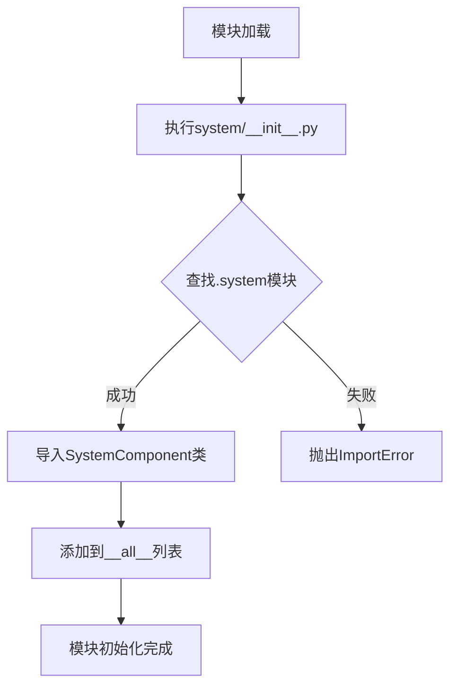

# `.\AutoGPT\classic\forge\forge\components\system\__init__.py` 详细设计文档

该代码是一个Python模块的入口文件，通过相对导入从.system子模块中导入SystemComponent类，并将其添加到__all__列表中以控制模块的公开接口，实现模块化设计中的组件导出功能。

## 整体流程



## 类结构

```
SystemComponent (具体组件类)
└── (详细信息需要查看system.py源码)
```

## 全局变量及字段


### `__all__`
    
定义模块的公开接口，指定当使用from module import *时允许导入的符号

类型：`list`
    


    

## 全局函数及方法


# 分析结果

## 问题说明

您提供的代码片段仅包含对 `SystemComponent` 的导入语句，并未包含 `SystemComponent` 类的实际实现代码。

```python
from .system import SystemComponent

__all__ = ["SystemComponent"]
```

## 缺失信息

要生成完整的详细设计文档，需要提供 `system.py` 文件的完整源代码，特别是：

1. **`SystemComponent` 类的完整实现** - 包括所有类字段、类方法
2. **相关的全局变量和全局函数**（如有）
3. **类的继承关系和依赖模块**

## 请求

请提供 `system.py` 的完整源代码，以便我能够：

- 提取类字段和类方法的详细信息
- 生成准确的 Mermaid 流程图
- 提供带注释的源码
- 识别潜在的技术债务和优化空间
- 分析数据流与状态机

请将 `system.py` 的内容粘贴到对话中，我将为您生成符合要求的详细设计文档。

## 关键组件


### SystemComponent

从 system 模块导入的系统组件，具体功能未知，需要查看 system 模块的实现以获取详细信息。


## 问题及建议


```markdown
### 已知问题

-   **模块缺乏文档**: 该 `__init__.py` 文件缺少模块级文档字符串（docstring），无法直接了解该包的业务意图和职责，增加了后续维护的理解成本。
-   **高耦合度**: 代码直接 `from .system import SystemComponent`，导致包的使用者与内部实现模块 `system` 产生了强耦合。若 `SystemComponent` 的位置或名称发生变更，外部代码可能需要修改。
-   **缺乏扩展性**: 当前仅导出了 `SystemComponent`，如果后续需要在导出前对其进行处理（如添加装饰器、封装）或者导出更多组件，需要直接修改此文件，违反了开闭原则。
-   **潜在的循环依赖风险**: 虽然当前代码简单，但若 `SystemComponent` 依赖同包下的其他模块，或有其他模块尝试从该包导入内容，可能会触发循环导入问题。

### 优化建议

-   **添加文档**: 建议在该文件顶部添加简短的 docstring，描述包的核心功能（例如：`提供系统组件的入口`）。
-   **降低耦合**: 可以考虑使用 `importlib` 进行延迟加载，或者定义一个抽象的接口类，将具体实现隐藏起来，减少对 `system` 模块具体实现的直接依赖。
-   **封装导出逻辑**: 如果将来需要导出多个类或函数，建议将导入逻辑提取到专门的函数或配置中，统一管理导出列表，便于扩展和维护。
-   **显式声明**: 保持 `__all__` 的定义，并添加注释说明仅导出 `SystemComponent` 的原因，以及是否需要同时导出其子类或相关辅助函数。
```

## 其它


### 设计目标与约束

本模块作为system包的入口文件，负责导出SystemComponent类供外部使用。设计目标明确：提供一个清晰的模块接口，遵循Python的模块导入规范。约束条件包括：仅支持Python 3.x版本，需要system模块中存在SystemComponent类。

### 错误处理与异常设计

本模块本身不涉及复杂的业务逻辑，错误处理主要依赖于system模块的导入。若SystemComponent类不存在或导入失败，会抛出ImportError或ModuleNotFoundError。建议在调用方进行异常捕获处理。

### 数据流与状态机

本模块不涉及数据流处理或状态机设计，仅作为模块接口导出点。数据流依赖于使用SystemComponent的调用方业务逻辑。

### 外部依赖与接口契约

本模块依赖system包中的SystemComponent类。接口契约要求：SystemComponent必须是一个可导入的类定义。调用方通过from . import SystemComponent方式导入使用。

### 安全性考虑

本模块无敏感数据处理，不涉及权限控制或加密操作。安全性取决于SystemComponent类的实现。

### 性能考虑

本模块在导入时会触发system模块的加载，性能开销主要来自于SystemComponent类的初始化。属于Python模块导入的常规开销，无特殊性能优化需求。

### 测试策略

由于模块功能简单，无需编写针对性单元测试。测试重点应放在SystemComponent类本身的功能验证上。可通过导入测试验证模块可正常加载。

### 版本兼容性

本模块遵循Python 3的模块规范，使用相对导入语法（from .system import ...），要求Python 3.x版本。不支持Python 2.x。

### 模块化设计

本模块采用典型的Python包入口文件设计模式，将内部实现（system模块）与外部接口分离，符合Python包结构最佳实践。

### 命名规范

遵循PEP 8命名规范，使用PascalCase命名类（SystemComponent），使用snake_case命名文件和函数。__all__列表明确指定公开API。

### 配置管理

本模块无配置项，所有配置由SystemComponent类自行管理。

### 日志与监控

本模块不涉及日志记录或监控功能，相关需求应看向SystemComponent类的实现。

    