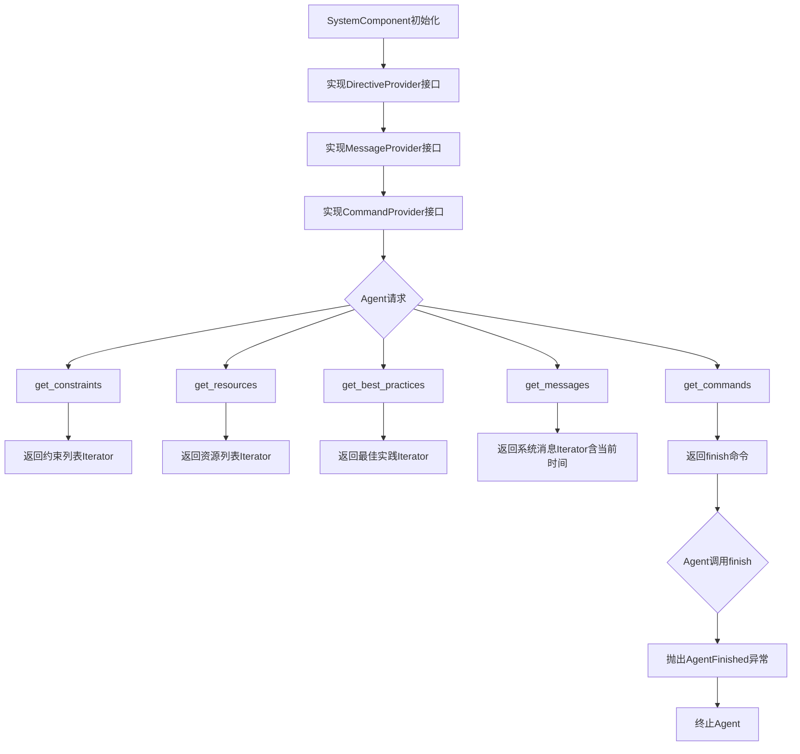
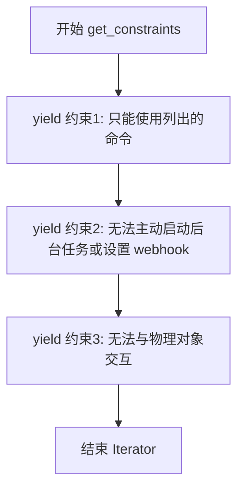
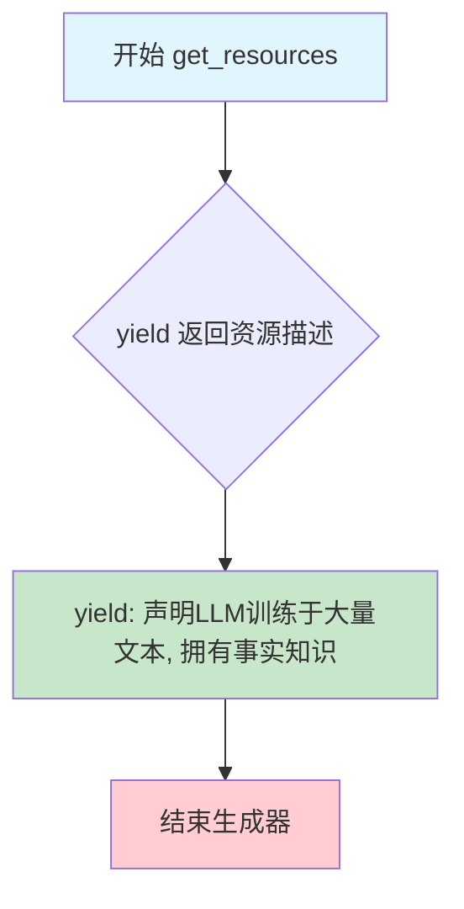
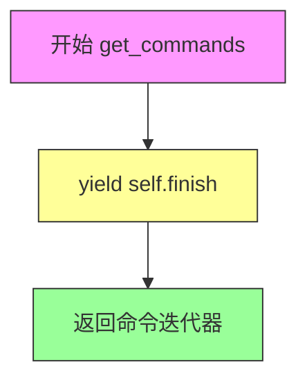
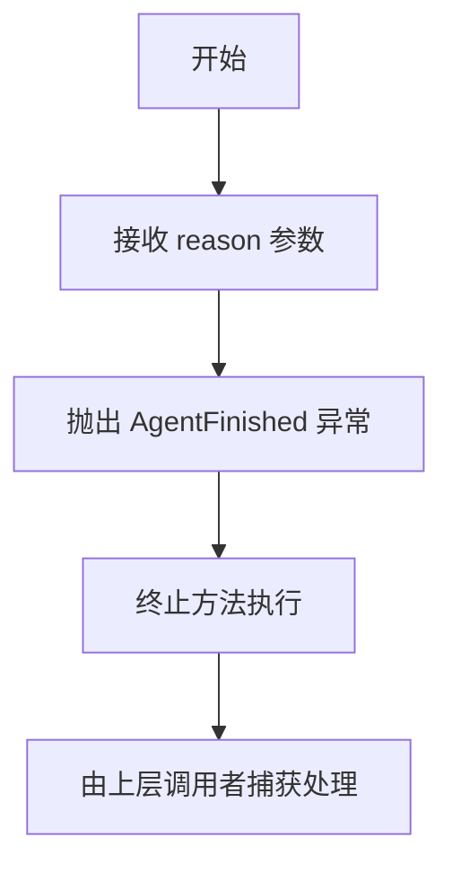

# `.\AutoGPT\classic\forge\forge\components\system\system.py` 详细设计文档

这是一个系统组件类，继承自DirectiveProvider、MessageProvider和CommandProvider协议，用于为AI代理提供系统级指令、约束条件、最佳实践、系统消息和完成命令。该组件确保代理在执行任务时遵循特定的行为准则，包括只能使用指定命令、无法启动后台任务或设置webhook、无法物理交互等限制，同时提供时钟信息和一个用于正常终止任务的finish命令。

## 整体流程



## 类结构

```
SystemComponent (实现DirectiveProvider, MessageProvider, CommandProvider)
├── get_constraints() - 返回约束迭代器
├── get_resources() - 返回资源迭代器
├── get_best_practices() - 返回最佳实践迭代器
├── get_messages() - 返回系统消息迭代器
├── get_commands() - 返回命令迭代器
└── finish() - 完成任务命令
```

## 全局变量及字段


### `logger`
    
用于记录模块日志的Logger实例，通过logging.getLogger(__name__)创建

类型：`logging.Logger`
    


    

## 全局函数及方法


### `SystemComponent.get_constraints`

该方法用于向代理提供行为约束条件，通过迭代器返回三条关键约束规则，限制代理只能使用指定的命令、无法主动启动后台任务或设置 webhook，以及禁止直接与物理对象交互。

参数：
- 无

返回值：`Iterator[str]`，返回一组约束字符串迭代器，用于定义代理的行为边界

#### 流程图



#### 带注释源码

```python
def get_constraints(self) -> Iterator[str]:
    """获取代理的行为约束条件。
    
    该方法通过迭代器返回一系列约束规则，用于限制代理的行为边界，
    确保代理在安全的范围内执行任务。
    
    Returns:
        Iterator[str]: 包含约束规则的字符串迭代器
    """
    # 约束1：限制代理只能使用系统提供的命令
    yield "Exclusively use the commands listed below."
    
    # 约束2：禁止代理主动创建后台任务或 webhook
    yield (
        "You can only act proactively, and are unable to start background jobs or "
        "set up webhooks for yourself. "
        "Take this into account when planning your actions."
    )
    
    # 约束3：禁止代理直接与物理世界交互，必要时需请求用户协助
    yield (
        "You are unable to interact with physical objects. "
        "If this is absolutely necessary to fulfill a task or objective or "
        "to complete a step, you must ask the user to do it for you. "
        "If the user refuses this, and there is no other way to achieve your "
        "goals, you must terminate to avoid wasting time and energy."
    )
```


### `SystemComponent.get_resources`

该方法是一个生成器方法，用于向大型语言模型提供系统可用资源的描述，告知其作为LLM所具备的事实知识能力，以便在任务执行过程中避免不必要的重复信息收集。

参数：

- （无参数）

返回值：`Iterator[str]`，一个生成器，产出描述系统资源（大型语言模型的知识）的字符串迭代器。

#### 流程图



#### 带注释源码

```python
def get_resources(self) -> Iterator[str]:
    """提供系统可用资源的描述信息。
    
    这是一个生成器方法（使用yield），用于向LLM说明
    它作为大型语言模型所具备的知识资源能力。
    
    Returns:
        Iterator[str]: 包含资源描述的字符串生成器
    """
    yield (
        "You are a Large Language Model, trained on millions of pages of text, "
        "including a lot of factual knowledge. Make use of this factual knowledge "
        "to avoid unnecessary gathering of information."
    )
```


### `SystemComponent.get_best_practices`

该方法是一个生成器函数，用于向 AI 代理提供一系列最佳实践指导原则，帮助其在执行任务时保持高效、反思和自我优化的行为模式。

参数：

- （无参数）

返回值：`Iterator[str]`返回一个字符串迭代器，包含多条最佳实践指导原则，用于约束和引导 AI 代理的行为方式。

#### 流程图

```mermaid
flowchart TD
    A[开始 get_best_practices] --> B[yield 持续审查和分析行为]
    B --> C[yield 建设性自我批评]
    C --> D[yield 反思过去的决策和策略]
    D --> E[yield 聪明高效地完成任务]
    E --> F[yield 仅在必要时使用信息收集能力]
    F --> G[结束 - 返回 Iterator[str]]
```

#### 带注释源码

```python
def get_best_practices(self) -> Iterator[str]:
    """生成一系列最佳实践指导原则，用于引导 AI 代理的行为。
    
    Args:
        无参数
        
    Yields:
        Iterator[str]: 包含最佳实践建议的字符串迭代器
    """
    # 持续审查和分析自身行为，确保以最佳能力执行
    yield (
        "Continuously review and analyze your actions to ensure "
        "you are performing to the best of your abilities."
    )
    # 建设性地对自身整体行为进行自我批评
    yield "Constructively self-criticize your big-picture behavior constantly."
    # 反思过去的决策和策略，以改进方法
    yield "Reflect on past decisions and strategies to refine your approach."
    # 强调每个命令都有成本，应以最少的步骤完成任务
    yield (
        "Every command has a cost, so be smart and efficient. "
        "Aim to complete tasks in the least number of steps."
    )
    # 仅在真正缺少某些信息时才使用信息收集能力
    yield (
        "Only make use of your information gathering abilities to find "
        "information that you don't yet have knowledge of."
    )
```


### `SystemComponent.get_messages`

该方法用于生成系统级别的消息，提供当前时钟信息给 AI 代理。它通过 `yield` 返回一个包含当前日期和时间的 `ChatMessage` 系统消息，使代理能够感知当前时间以便进行时间相关的推理和决策。

参数：

- `self`：`SystemComponent`，方法的隐含参数，表示类的实例本身

返回值：`Iterator[ChatMessage]`，返回一个包含当前时间信息的系统消息迭代器

#### 流程图

```mermaid
flowchart TD
    A[开始 get_messages] --> B[获取当前时间]
    B --> C[使用 time.strftime 格式化时间]
    C --> D[构建 Markdown 格式的时钟消息]
    D --> E[创建 ChatMessage.system 消息对象]
    E --> F[通过 yield 返回消息]
    F --> G[结束, 返回 Iterator[ChatMessage]]
```

#### 带注释源码

```python
def get_messages(self) -> Iterator[ChatMessage]:
    """
    生成系统消息，包含当前时钟信息。
    
    Returns:
        Iterator[ChatMessage]: 包含当前日期和时间的系统消息迭代器
    """
    # Clock - 生成包含当前时间的系统消息
    # 使用 time.strftime('%c') 格式化本地时间的可读格式
    yield ChatMessage.system(
        f"## Clock\nThe current time and date is {time.strftime('%c')}"
    )
```


### `SystemComponent.get_commands`

该方法实现了 `CommandProvider` 协议，提供系统可用的命令列表。当前实现仅返回 `finish` 命令，用于在任务完成后关闭 Agent。

参数：

- 该方法无参数（实例方法隐式接收 `self`）

返回值：`Iterator[Command]`，返回一个命令迭代器，其中包含 `finish` 命令

#### 流程图



#### 带注释源码

```python
def get_commands(self) -> Iterator[Command]:
    """提供系统可用的命令列表.
    
    实现 CommandProvider 协议的方法,
    返回一个包含 finish 命令的迭代器,
    允许 Agent 在任务完成后正常终止.
    
    Returns:
        Iterator[Command]: 包含 finish 命令的迭代器
    """
    # yield finish 命令，使 Agent 能够在任务完成后调用此命令终止运行
    yield self.finish
```


### `SystemComponent.finish`

使用此方法在完成任务后关闭代理，或当遇到无法克服的问题导致无法完成任务时终止执行。

参数：

- `reason`：`str`，向用户总结目标完成情况的描述

返回值：`None`，该方法通过抛出 `AgentFinished` 异常来终止代理的执行，不会正常返回

#### 流程图



#### 带注释源码

```python
@command(
    names=[FINISH_COMMAND],  # 命令名称常量
    parameters={
        "reason": JSONSchema(
            type=JSONSchema.Type.STRING,
            description="A summary to the user of how the goals were accomplished",
            required=True,  # 参数为必填项
        ),
    },
)
def finish(self, reason: str):
    """Use this to shut down once you have completed your task,
    or when there are insurmountable problems that make it impossible
    for you to finish your task."""
    raise AgentFinished(reason)  # 抛出自定义异常，携带完成原因，终止代理执行
```

## 关键组件


### SystemComponent 类

核心组件，负责为 AI Agent 提供系统级指令、消息和命令的集成实现，遵循 DirectiveProvider、MessageProvider 和 CommandProvider 协议。

### get_constraints 方法

提供 Agent 的行为约束，包括仅使用指定命令、无法主动启动后台任务或设置 webhook、无法与物理对象交互等限制。

### get_resources 方法

声明 Agent 作为大语言模型的知识储备能力，提示其可利用训练获得的事实知识来避免不必要的信息收集。

### get_best_practices 方法

提供 Agent 的最佳实践指南，包括持续自我审查与分析、构建性自我批评、反思过往决策、以及追求最高效的任务完成方式。

### get_messages 方法

生成系统消息，目前主要提供当前时间戳的时钟信息，使用 time.strftime 格式化。

### get_commands 方法

暴露 Agent 可用的命令集合，目前仅包含 finish 命令用于终止 Agent 运行。

### finish 命令

Agent 完成任务或遇到无法克服的问题时的终止命令，接受 reason 参数作为任务完成情况的摘要，并抛出 AgentFinished 异常。


## 问题及建议


### 已知问题

-   **时间显示时区不明确**：`time.strftime('%c')` 使用本地时间，未明确标注时区，可能导致跨时区使用时的混淆
-   **硬编码字符串缺乏可维护性**：约束、资源、最佳实践等字符串全部硬编码在方法中，无法动态配置，缺乏国际化支持
-   **日志模块未使用**：`import logging` 导入但未使用任何日志功能
-   **缺少参数验证**：`finish` 方法的 `reason` 参数无长度或格式验证，可能接受过长或无效输入
-   **异常处理不完善**：`AgentFinished` 异常未在类或调用层捕获处理，可能导致调用方无法优雅地处理任务终止
-   **重复代码模式**：多个 `get_*` 方法使用相同的 `yield` 生成器模式返回静态字符串，可抽象为配置驱动
-   **缺乏方法级文档**：除 `finish` 方法外，其他方法缺少详细的文档字符串说明其用途

### 优化建议

-   考虑使用 `datetime` 配合 `timezone` 明确获取当前时间并标注时区信息，或提供配置选项
-   将静态字符串资源抽取为配置文件或常量类，支持外部化和国际化
-   移除未使用的 `logging` 导入，或添加适当的日志记录
-   为 `finish` 方法添加参数验证逻辑，如最大长度限制
-   在类文档或协议定义中明确 `AgentFinished` 异常的预期处理方式
-   提取通用生成器模式为基类方法或工具函数，减少重复代码
-   为关键方法添加详细的文档字符串，说明返回值语义和调用时机


## 其它


### 设计目标与约束

该组件的设计目标是为AI Agent系统提供统一的系统级指令、约束条件、最佳实践和命令接口，确保Agent行为符合预期框架规范。约束包括：仅能通过预定义命令与系统交互、无法主动启动后台任务或设置webhook、无法直接物理交互。

### 错误处理与异常设计

当Agent完成任务或遇到无法克服的困难时，通过抛出`AgentFinished`异常并携带完成原因来终止执行。该异常是故意设计的控制流机制，用于优雅退出。日志记录使用Python标准`logging`模块，遵循项目统一的日志规范。

### 数据流与状态机

组件实现三个协议接口形成数据流：`DirectiveProvider`提供约束和最佳实践、`MessageProvider`提供系统消息、`CommandProvider`提供可用命令。数据流方向为：框架调用get_constraints/get_resources/get_best_practices获取指令文本，调用get_messages获取聊天消息，调用get_commands获取可执行命令。状态机表现为单例模式的状态转换：从初始化→就绪→执行命令→完成/终止。

### 外部依赖与接口契约

核心依赖包括：`forge.agent.protocols`中的三个Provider协议类、`forge.command`中的Command和command装饰器、`forge.llm.providers`中的ChatMessage、`forge.models.json_schema`中的JSONSchema、`forge.utils.const`中的FINISH_COMMAND常量、`forge.utils.exceptions`中的AgentFinished异常类。接口契约要求实现者提供Iterator类型的返回值，命令参数必须符合JSONSchema规范。

### 性能考虑

使用Iterator而非列表存储指令和消息，实现惰性加载，避免内存预分配。所有方法均为轻量级调用，无复杂计算或IO操作，性能开销可忽略。

### 安全性考虑

finish命令的reason参数为用户可控输入，建议在框架层进行长度限制和内容过滤，防止通过reason字段注入恶意内容。系统约束明确限制Agent的物理交互能力，这是一种安全边界设计。

### 测试策略

应覆盖：三个Provider协议接口的所有方法返回值验证、finish命令的参数校验、FINISH_COMMAND常量值正确性、AgentFinished异常抛出行为、time.strftime格式化输出格式。

### 配置说明

无显式配置项，系统时间格式依赖Python的`time.strftime`默认行为，命令名称由`FINISH_COMMAND`常量定义。

### 版本兼容性

依赖Python类型提示（typing.Iterator），需Python 3.7+。与LLM Provider的接口契约依赖ChatMessage类，应使用兼容Forge框架版本的依赖。


    