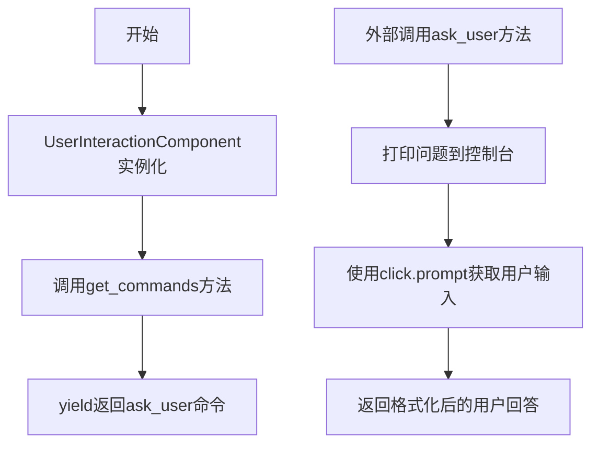
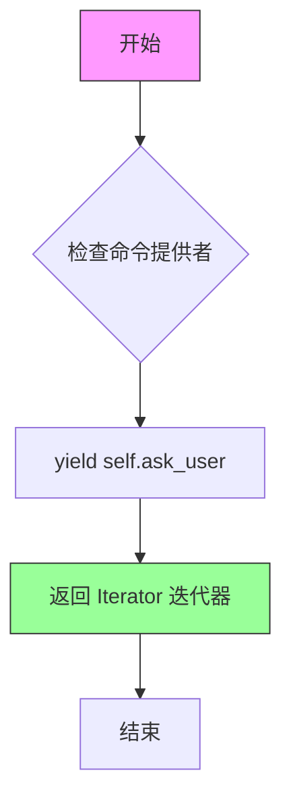
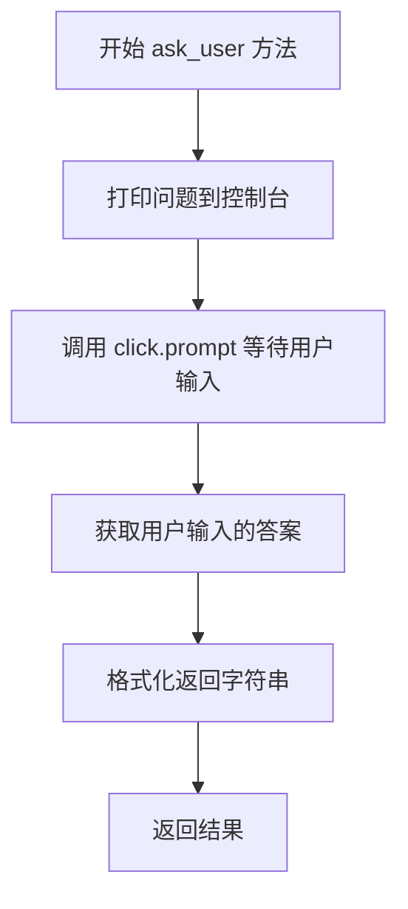
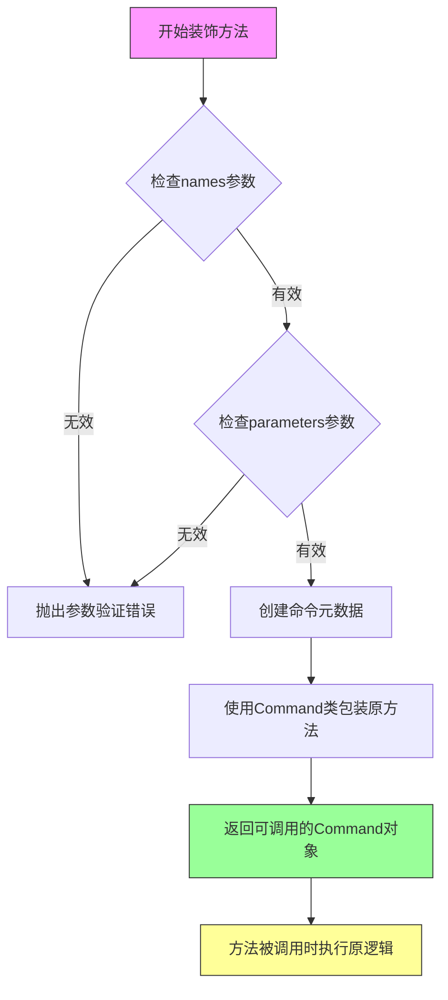
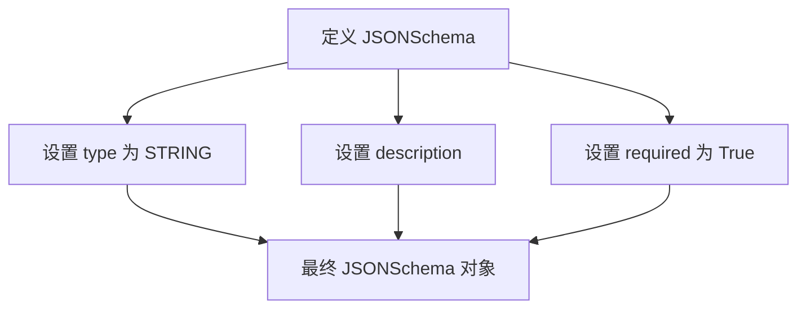
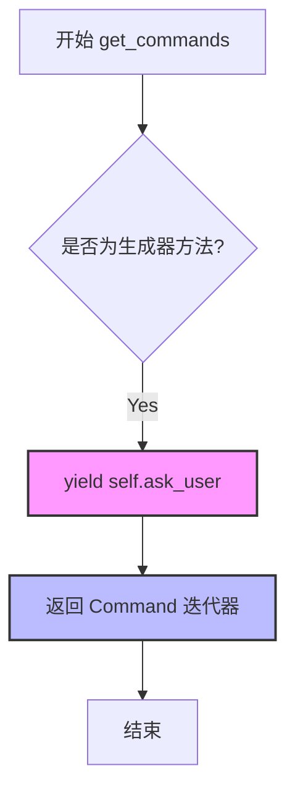

# `.\AutoGPT\classic\forge\forge\components\user_interaction\user_interaction.py` 详细设计文档

这是一个用户交互组件，提供命令接口允许AI代理向用户提问并获取回答，实现了一个ask_user命令，通过命令行界面使用click库实现交互式问答功能。

## 整体流程



## 类结构

```
CommandProvider (抽象基类/协议)
└── UserInteractionComponent (实现类)
```

## 全局变量及字段


### `ASK_COMMAND`
    
用于标识'ask'命令的名称常量

类型：`str (从forge.utils.const导入的常量)`
    


### `UserInteractionComponent.self`
    
类的实例自身引用（隐式参数）

类型：`UserInteractionComponent`
    
    

## 全局函数及方法


### `UserInteractionComponent.get_commands`

获取该组件提供的命令迭代器，用于向系统注册可用的命令。

参数：

- 无参数（`self` 为实例本身）

返回值：`Iterator[Command]` ，返回一个迭代器，每次迭代产生一个可用的命令对象。

#### 流程图



#### 带注释源码

```python
def get_commands(self) -> Iterator[Command]:
    """获取该组件提供的命令迭代器。
    
    该方法实现了 CommandProvider 协议接口，
    用于向系统注册当前组件所提供的所有命令。
    返回的迭代器会在命令注册阶段被遍历，
    将命令添加到系统的命令集合中。
    
    Returns:
        Iterator[Command]: 命令对象的迭代器，
                          每次迭代返回一个可用的 Command 实例
    """
    yield self.ask_user
```


### `UserInteractionComponent.ask_user`

该方法是一个用户交互命令，通过 `click.prompt` 获取用户输入，并返回格式化的用户答案。主要用于 AI Agent 在需要更多细节或信息时向用户提问。

参数：

- `question`：`str`，要向用户提问的问题或提示文本

返回值：`str`，格式为 "The user's answer: '{用户输入的答案}'"

#### 流程图



#### 带注释源码

```python
@command(
    names=[ASK_COMMAND],
    parameters={
        "question": JSONSchema(
            type=JSONSchema.Type.STRING,
            description="The question or prompt to the user",
            required=True,
        )
    },
)
def ask_user(self, question: str) -> str:
    """If you need more details or information regarding the given goals,
    you can ask the user for input."""
    # 打印问题到控制台，以\n开头可能为了更好的视觉分隔
    print(f"\nQ: {question}")
    # 使用 click.prompt 等待用户输入并获取答案
    resp = click.prompt("A")
    # 返回格式化的用户答案字符串
    return f"The user's answer: '{resp}'"
```

#### 关键技术点说明

该方法使用了 `click` 库的 `prompt` 函数来实现交互式命令行提示。`click.prompt` 会阻塞程序执行，等待用户在终端输入内容后按回车确认，然后返回用户输入的字符串。这是一个典型的同步阻塞式用户交互实现。


### `command` (from `forge.command`)

`command` 是一个装饰器函数，用于将类方法转换为 `Command` 对象，使其可以作为命令被命令处理器注册和使用。它接收命令名称和参数模式作为元数据。

参数：

- `names`：`List[str]`，命令名称列表，用于标识命令
- `parameters`：`Dict[str, JSONSchema]`，命令参数的模式定义，描述每个参数的名称、类型、描述和是否必需

返回值：`Callable`，装饰器返回可调用对象，最终将方法转换为 `Command` 实例

#### 流程图



#### 带注释源码

```python
# 这是一个装饰器工厂，用于将方法转换为Command对象
# 使用方式如下面的示例所示：

@command(
    names=[ASK_COMMAND],           # 命令名称列表，对应 forge.utils.const.ASK_COMMAND
    parameters={
        "question": JSONSchema(   # 定义名为 question 的参数
            type=JSONSchema.Type.STRING,  # 参数类型为字符串
            description="The question or prompt to the user",  # 参数描述
            required=True,          # 该参数为必需参数
        )
    },
)
def ask_user(self, question: str) -> str:
    """
    如果需要更多关于目标细节或信息，可以向用户请求输入。
    
    参数:
        question: str - 要询问用户的问题
    
    返回值:
        str - 格式为 "The user's answer: '{用户回答}'" 的字符串
    """
    print(f"\nQ: {question}")
    resp = click.prompt("A")
    return f"The user's answer: '{resp}'"


# command 装饰器内部执行流程（伪代码）:
# 1. 接收 names 和 parameters 参数
# 2. 验证参数有效性
# 3. 创建 Command 对象，包含：
#    - 命令名称 (names)
#    - 参数模式 (parameters) 
#    - 原始方法引用 (ask_user)
# 4. 返回的 Command 对象实现 __call__ 方法
#    当被调用时，会：
#    a. 验证传入参数是否符合 schema
#    b. 调用原始 ask_user 方法
#    c. 返回结果
```

#### 附加说明

| 项目 | 说明 |
|------|------|
| **Command 类** | 来自 `forge.command` 模块的 `Command` 类，用于封装可执行的命令 |
| **JSONSchema** | 参数验证模式，来自 `forge.models.json_schema`，定义参数的类型、描述和必需性 |
| **ASK_COMMAND** | 命令常量，来自 `forge.utils.const`，用于标识"询问用户"命令 |
| **CommandProvider 协议** | 实现 `get_commands` 方法的类需遵守的协议，返回 `Iterator[Command]` |


### `UserInteractionComponent.ask_user`

提供交互式用户问答命令，允许AI代理在需要额外信息时向用户提问并获取回答。当AI在执行任务过程中遇到不明确或需要用户确认的事项时，可通过此命令请求用户输入。

参数：

- `question`：`str`，通过JSONSchema定义为必需参数，表示要向用户提出的问题或提示，描述为"The question or prompt to the user"

返回值：`str`，返回格式化的用户回答，格式为"The user's answer: '{resp}'"

#### 流程图

```mermaid
flowchart TD
    A[开始] --> B{接收question参数}
    B --> C[打印问题到控制台<br/>print Q: {question}]
    C --> D[调用click.prompt等待用户输入<br/>获取用户响应]
    D --> E[格式化响应字符串<br/>The user's answer: '{resp}']
    E --> F[返回格式化后的响应]
    F --> G[结束]
```

#### 带注释源码

```python
from typing import Iterator  # 引入类型提示的Iterator

import click  # 引入click库用于交互式命令行输入

from forge.agent.protocols import CommandProvider  # 引入CommandProvider协议
from forge.command import Command, command  # 引入Command类和command装饰器
from forge.models.json_schema import JSONSchema  # 引入JSONSchema模型
from forge.utils.const import ASK_COMMAND  # 引入ASK_COMMAND常量


class UserInteractionComponent(CommandProvider):
    """Provides commands to interact with the user."""
    # 用户交互组件类，实现CommandProvider协议
    
    def get_commands(self) -> Iterator[Command]:
        """实现CommandProvider协议的方法，返回命令迭代器"""
        yield self.ask_user  # yield生成ask_user命令

    @command(
        names=[ASK_COMMAND],  # 命令名称为ASK_COMMAND常量
        parameters={
            # 定义命令参数schema
            "question": JSONSchema(
                type=JSONSchema.Type.STRING,  # 参数类型为字符串
                description="The question or prompt to the user",  # 参数描述
                required=True,  # 参数为必需
            )
        },
    )
    def ask_user(self, question: str) -> str:
        """If you need more details or information regarding the given goals,
        you can ask the user for input."""
        # 方法文档：用于在需要更多细节时向用户请求输入
        
        # 打印问题到控制台，供用户查看
        print(f"\nQ: {question}")
        
        # 使用click.prompt获取用户交互式输入
        resp = click.prompt("A")
        
        # 返回格式化的用户回答
        return f"The user's answer: '{resp}'"
```


### `UserInteractionComponent.ask_user.question` (JSONSchema)

该 JSONSchema 定义了 `ask_user` 命令的 `question` 参数的模式规范，用于描述向用户提问的问题内容。

参数：

- `question`：`JSONSchema`，定义命令参数的模式
  - `type`: `JSONSchema.Type.STRING`，参数类型为字符串
  - `description`: `"The question or prompt to the user"`，参数的描述信息
  - `required`: `True`，表示该参数为必需参数

返回值：`JSONSchema`，返回的是 JSONSchema 对象本身，用于描述命令参数结构

#### 流程图



#### 带注释源码

```python
# 在 @command 装饰器中定义命令参数
parameters={
    "question": JSONSchema(  # 参数名称为 "question"，值为 JSONSchema 实例
        type=JSONSchema.Type.STRING,  # 声明参数类型为字符串
        description="The question or prompt to the user",  # 参数描述：向用户的问题或提示
        required=True,  # 标记该参数为必需参数
    )
}
```


### `UserInteractionComponent.get_commands`

该方法是一个生成器函数，用于提供与用户交互的命令。它实现了 `CommandProvider` 接口的 `get_commands` 方法，通过 yield 返回一个迭代器，其中包含一个用于向用户提问的命令 `ask_user`。

参数：

- 无

返回值：`Iterator[Command]` ，返回一个命令迭代器，包含一个 `ask_user` 命令实例

#### 流程图



#### 带注释源码

```python
def get_commands(self) -> Iterator[Command]:
    """提供命令迭代器，用于与用户交互。
    
    Returns:
        Iterator[Command]: 包含 ask_user 命令的迭代器
    """
    # yield 会创建一个生成器，每次迭代时返回一个 Command 对象
    # 这里返回 self.ask_user 方法对应的命令对象
    yield self.ask_user
```


### `UserInteractionComponent.ask_user`

如果需要更多关于给定目标的细节或信息，可以向用户请求输入。

参数：

- `question`：`str`，向用户提问的问题或提示

返回值：`str`，用户的回答，格式为 "The user's answer: '{resp}'"

#### 流程图

```mermaid
flowchart TD
    A[开始] --> B[打印问题: Q: {question}]
    B --> C[调用 click.prompt 等待用户输入]
    C --> D[获取用户响应 resp]
    D --> E[格式化响应为 "The user's answer: '{resp}'"]
    E --> F[返回响应字符串]
```

#### 带注释源码

```python
@command(
    names=[ASK_COMMAND],
    parameters={
        "question": JSONSchema(
            type=JSONSchema.Type.STRING,
            description="The question or prompt to the user",
            required=True,
        )
    },
)
def ask_user(self, question: str) -> str:
    """If you need more details or information regarding the given goals,
    you can ask the user for input."""
    # 打印问题提示到控制台，格式为 "Q: {question}"
    print(f"\nQ: {question}")
    # 使用 click.prompt 阻塞等待用户输入答案
    resp = click.prompt("A")
    # 将用户输入格式化为标准返回格式并返回
    return f"The user's answer: '{resp}'"
```

## 关键组件


### UserInteractionComponent 类

提供命令以与用户交互的组件，实现了CommandProvider协议，用于在AI代理需要更多信息时向用户提问并获取回答。

### CommandProvider 协议

命令提供者接口，定义了get_commands方法用于返回可用的命令迭代器。

### ask_user 命令方法

提供ASK_COMMAND命令，允许代理向用户提出问题并获取答案，使用click.prompt实现交互式输入。

### JSONSchema 参数定义

使用JSONSchema定义命令参数结构，声明question参数为必需的字符串类型，用于描述要询问用户的问题。

### Click 库集成

集成click框架的prompt功能，实现命令行交互式输入获取用户回答。

### 潜在的技术债务或优化空间

1. **缺乏输入验证**：question参数没有长度限制或内容验证，用户可能输入空字符串
2. **错误处理缺失**：没有处理click.prompt可能的异常情况（如Ctrl+C中断）
3. **国际化支持缺失**：提示信息"Q:"和"A"硬编码，不支持多语言
4. **返回值格式单一**：返回格式固定，缺乏错误状态或用户取消的区分
5. **测试性考虑**：print和click.prompt直接调用，难以进行单元测试

### 设计目标与约束

- 目标：为AI代理提供向用户请求额外信息的机制
- 约束：必须实现CommandProvider协议，返回Iterator[Command]

### 错误处理与异常设计

- 未显式处理异常，click.prompt的KeyboardInterrupt和EOFError会直接传播
- 建议添加异常处理以提供更友好的退出体验

### 外部依赖与接口契约

- 依赖forge.agent.protocols中的CommandProvider接口
- 依赖forge.command中的Command和command装饰器
- 依赖forge.models.json_schema中的JSONSchema类
- 依赖forge.utils.const中的ASK_COMMAND常量
- 依赖click库的prompt函数


## 问题及建议


### 已知问题

-   **硬编码的输入输出依赖**：直接使用 `click.prompt` 和 `print` 进行用户交互，导致组件无法在非交互环境或测试环境中使用，也无法通过 mock 替换实现单元测试。
-   **缺乏异常处理**：未捕获用户中断（如 `Ctrl+C`）或其他输入异常，可能导致程序直接崩溃。
-   **返回值格式耦合**：返回的字符串包含 `"The user's answer: "` 前缀，将数据与格式化逻辑耦合在一起，调用方无法直接获取原始用户输入。
-   **缺少日志记录**：使用 `print` 而非标准日志框架，导致交互过程无法追踪、过滤或重定向。
-   **单一职责偏离**：类同时承担命令定义、参数校验和用户交互逻辑，职责不够清晰。

### 优化建议

-   **引入依赖注入**：将用户输入/输出抽象为接口（如 `InputProvider` / `OutputHandler`），通过构造函数注入，便于单元测试和替换实现（如自动化测试场景）。
-   **添加异常处理**：捕获 `click.Abort` 或 `KeyboardInterrupt`，返回有意义的错误信息或让调用方决定如何处理。
-   **分离数据与展示**：方法直接返回用户原始输入，格式化逻辑交给调用方处理，增强灵活性。
-   **使用日志替代 print**：采用标准日志模块记录交互过程，支持配置日志级别和输出目标。
-   **提取交互逻辑**：将 `ask_user` 的核心逻辑与命令装饰器解耦，创建独立的 `UserInteractionService`，专注于交互逻辑，命令定义仅作为薄封装。

## 其它


### 设计目标与约束

本组件的核心设计目标是提供一个标准化的用户交互接口，使得AI Agent能够通过统一的Command机制与用户进行问答交互。约束条件包括：必须实现CommandProvider协议、命令名称必须使用预定义的ASK_COMMAND常量、参数必须符合JSONSchema规范、返回值必须为字符串格式。

### 错误处理与异常设计

组件本身不包含复杂的异常处理逻辑，主要依赖外部调用方处理。在ask_user方法中，如果click.prompt发生异常（如终端中断），异常将向上传播。JSONSchema验证失败时由forge框架处理。错误场景包括：用户强制中断输入（Ctrl+C）会抛出KeyboardInterrupt、终端不可用时click.prompt会失败、question参数为空时的处理。

### 数据流与状态机

数据流为：调用方通过get_commands()获取命令列表 → 用户触发ASK_COMMAND → ask_user方法接收question参数 → 通过click.prompt获取用户输入 → 返回格式化的回答字符串。状态机相对简单，组件本身无状态，仅在方法调用时创建临时状态。

### 外部依赖与接口契约

主要依赖包括：click库用于命令行提示交互、forge.agent.protocols.CommandProvider接口、forge.command.Command和command装饰器、forge.models.json_schema.JSONSchema、forge.utils.const.ASK_COMMAND常量。接口契约要求get_commands()返回Iterator[Command]、ask_user(question: str)返回str类型。

### 性能考虑

组件性能开销主要在click.prompt的阻塞等待阶段。由于是同步交互设计，不适合高并发场景。如需优化可考虑添加超时机制、异步支持等。

### 安全性考虑

当前实现存在安全风险：print输出未经转义处理，可能存在命令注入风险；用户输入未做过滤直接返回。建议添加输入验证和输出编码处理。

### 使用示例

```python
component = UserInteractionComponent()
commands = list(component.get_commands())
result = commands[0].execute(question="请输入您的姓名")
```

### 单元测试建议

应测试：get_commands返回正确的命令迭代器、ask_user方法参数验证、命令元数据正确性（names、parameters）、与click.prompt的交互模拟。建议使用unittest.mock模拟click.prompt。

### 版本兼容性

代码使用Python类型注解，需要Python 3.7+。click版本应兼容8.x系列。依赖forge框架的版本需要与框架API保持一致。

### 部署注意事项

此为内部组件，无需独立部署。部署时需确保终端环境支持click库的交互功能。容器环境需配置stdin支持。

    