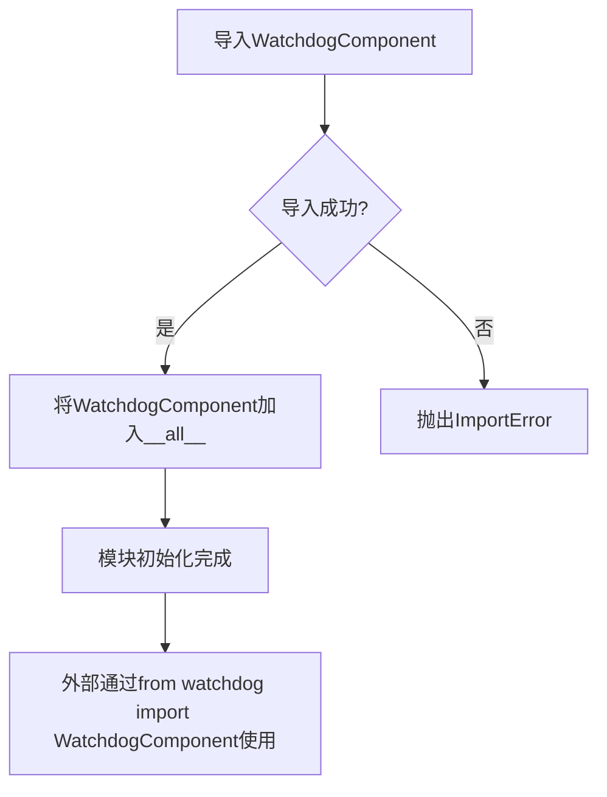

# `.\AutoGPT\classic\forge\forge\components\watchdog\__init__.py` 详细设计文档

该模块是一个看门狗（Watchdog）组件的包入口文件，主要负责导入并暴露WatchdogComponent类，供外部项目使用。它通过定义__all__来明确公共API接口，实现模块的封装和版本兼容性管理。

## 整体流程



## 类结构

```
WatchdogComponent (监控组件基类)
└── 可能包含多个继承子类或内部组件类
```

## 全局变量及字段


### `__all__`
    
定义模块公开导出的符号列表，控制from module import *时的导出内容

类型：`list[str]`
    


    

## 全局函数及方法


## 关键组件


### WatchdogComponent

从 watchdog 模块导入的核心组件，负责实现看门狗功能。该组件的具体实现细节位于 watchdog.py 模块中，当前文件作为模块入口进行重新导出。

### 模块导出机制

通过 `__all__` 显式定义公共接口，控制模块的公开 API 表面。这种做法符合 Python 最佳实践，明确指定允许外部访问的成员。

### 技术债务与优化空间

当前代码存在以下潜在问题：
- **缺少类型标注** - 未使用类型提示（Type Hints），降低代码可读性和静态分析能力
- **文档缺失** - 没有模块级文档字符串（module docstring），建议添加模块功能说明
- **功能单一** - 仅作为重新导出层，如果后续有其他组件需要导出，可考虑更结构化的组织方式

### 设计约束

- 该模块采用相对导入（relative import），要求作为包的一部分运行
- 必须存在 watchdog.py 同名模块，否则导入将失败
- 通过 `__all__` 控制导出，遵循显式优于隐式的 Python 哲学


## 问题及建议


### 已知问题

-   **模块缺少文档字符串**：当前 `__init__.py` 没有模块级文档字符串（docstring），无法说明该包的用途、功能和版本信息。
-   **版本信息缺失**：未定义 `__version__` 变量，无法追踪包版本。
-   **导出内容单一**：仅导出 `WatchdogComponent` 一个类，若 `watchdog` 模块中存在其他可复用的组件、函数或常量，也无法被外部访问。
-   **无导入错误处理**：若 `WatchdogComponent` 导入失败，程序将直接抛出异常，缺乏友好的错误提示或降级机制。

### 优化建议

-   **添加模块文档字符串**：在文件开头添加 `"""... """` 格式的文档说明，描述该包的核心功能（例如：提供看门狗组件的封装与接口）。
-   **添加版本信息**：定义 `__version__ = "x.x.x"` 或从 `__version__` 模块导入版本信息，以便外部调用。
-   **扩展导出内容**：根据实际需求，考虑将 `watchdog` 模块中的其他公开 API（如配置类、异常类、工具函数等）一并导出，或使用 `from .watchdog import *` 配合适当的 `__all__` 控制导出范围。
-   **增强健壮性**：可添加 `try/except` 捕获导入异常，抛出更明确的自定义异常或提供降级方案。


## 其它


### 设计目标与约束
- **目标**：通过 `__init__.py` 提供统一的公共接口，仅暴露 `WatchdogComponent` 类，隐藏内部实现细节，保证模块的封装性和 API 的稳定性。
- **约束**：
  - 仅支持 Python 3.x（推荐 3.6+）。
  - 不得在当前层级引入除 `.watchdog` 外的第三方依赖，以保持轻量化。
  - 必须通过 `__all__` 明确定义公共导出，避免意外泄露内部模块。

### 错误处理与异常设计
- **导入错误**：若 `.watchdog` 子模块不存在或加载失败，Python 会抛出 `ModuleNotFoundError` 或 `ImportError`，并向上层传播。调用方应在使用前做好异常捕获。
- **未定义导出**：若 `WatchdogComponent` 类不存在，同样会导致 `ImportError`，并在导入时立即暴露，便于快速定位问题。
- **异常传播策略**：本模块本身不捕获异常，保持“_fail-fast”原则，使错误在最早阶段显现。

### 数据流与状态机
- **数据流**：
  1. 用户 `import` 本模块（`from <package> import WatchdogComponent`）。
  2. `__init__.py` 执行 `from .watchdog import WatchdogComponent`，将类加载到当前命名空间。
  3. 通过 `__all__` 将 `WatchdogComponent` 暴露给外部。
- **状态机**：本模块为无状态模块，仅提供静态类导出，不涉及运行时状态转换。

### 外部依赖与接口契约
- **依赖**：
  - `.watchdog` 子模块：实现 `WatchdogComponent` 类。
  - Python 标准库（`import` 机制）。
- **接口契约**：
  - 导出项：仅 `WatchdogComponent`（在 `__all__` 中声明）。
  - 兼容性：外部代码应依赖抽象的 `WatchdogComponent` 接口，而非内部实现。
  - 版本约定：若 `WatchdogComponent` 的签名或行为发生不兼容变更，需要大幅升级包版本（如 2.0.0）。

### 版本控制与兼容性
- **版本号**：采用语义化版本（Semantic Versioning），如 `1.0.0`。
- **兼容性**：
  - 主版本号（MAJOR）变更表示 API 不兼容。
  - 次版本号（MINOR）表示向后兼容的功能新增。
  - 补丁号（PATCH）仅用于 bug 修复，不影响 API。
- **迁移策略**：在新版本发布前，提供迁移文档，说明 `WatchdogComponent` 的新增或弃用特性。

### 测试策略
- **单元测试**：
  - 验证 `import` 成功且 `WatchdogComponent` 可访问。
  - 检查 `__all__` 内容是否仅为 `["WatchdogComponent"]`。
  - 确保子模块 `watchdog` 正确实现 `WatchdogComponent` 类。
- **集成测试**：在实际硬件或模拟环境中实例化 `WatchdogComponent`，验证其基本功能（如看门狗计时、回调触发）。
- **持续集成**：每次提交后自动运行测试套件，确保无回归。

### 安全性考虑
- **最小暴露原则**：通过 `__all__` 仅暴露必要的公共类，防止内部实现（如其他子模块）被意外使用。
- **依赖审查**：定期检查 `.watchdog` 是否引入不安全的第三方代码或系统调用。
- **异常信息**：避免在异常信息中泄露敏感路径或配置细节。

### 性能考虑
- **导入开销**：模块仅执行一次导入，后续使用无额外开销。
- **运行时性能**：本模块不涉及业务逻辑，性能完全取决于 `WatchdogComponent` 本身的实现。

### 日志与诊断
- **日志需求**：当前模块不产生日志，所有日志由 `WatchdogComponent` 内部负责。
- **诊断建议**：若需调试导入过程，可在 `__init__.py` 中加入 `import logging; logging.debug("Loading WatchdogComponent...")`，但上线时应移除或设为 DEBUG 级别。

### 可维护性与文档
- **文档**：本模块的 docstring 应简明说明“提供 `WatchdogComponent` 的公共入口”，并指出子模块 `watchdog` 为实现细节。
- **代码风格**：遵循 PEP 8，使用 Black 或 Flake8 自动化格式化。
- **注释**：在 `__all__` 上方添加简短注释，解释为何仅导出此类。

### 扩展性考虑
- **新增导出**：若后续需要在同一层级提供其他组件，可直接在 `__all__` 中追加，并在 `__init__.py` 中 import 对应的子模块。
- **子模块拆分**：可将 `watchdog` 进一步拆分为多个子模块（如 `watchdog/timer.py`、`watchdog/platform.py`），通过同一入口统一导出，保持向后兼容。
- **插件化**：未来可考虑实现插件机制，让用户通过配置加载自定义的看门狗实现，但需在主版本升级前评估兼容性影响。

    