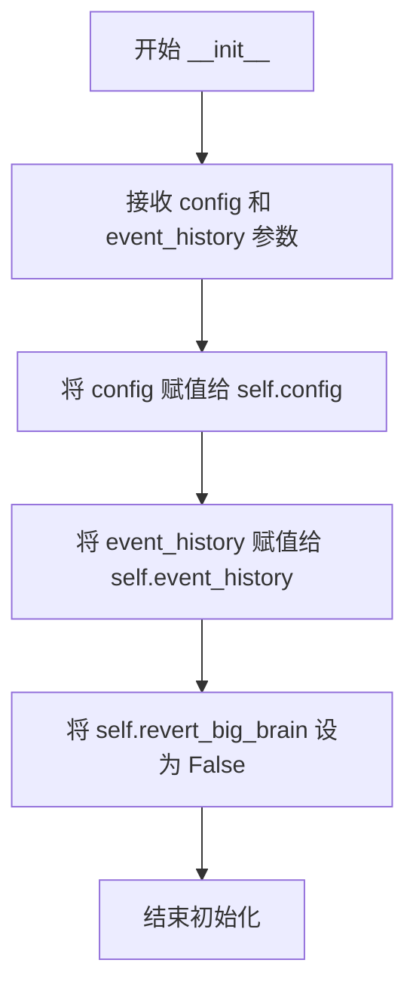

# `.\AutoGPT\classic\forge\forge\components\watchdog\watchdog.py` 详细设计文档

一个代理看门狗组件，通过监控代理行为检测循环模式，当发现代理重复执行相同命令时，自动切换从FAST_LLM到SMART_LLM并重新执行思考流程，以打破循环并提高任务完成率。

## 整体流程

```mermaid
graph TD
A[after_parse调用] --> B{revert_big_brain?}
B -- 是 --> C[设置big_brain=False, 重置revert_big_brain]
B -- 否 --> D{big_brain=False 且 fast_llm != smart_llm?}
D -- 否 --> E[直接返回，不做处理]
D -- 是 --> F{事件历史长度>1?}
F -- 否 --> G[previous_command=None]
F -- 是 --> H[获取前一循环的命令和参数]
H --> I{结果是否指定工具?}
I -- 否 --> J[设置rethink_reason='AI did not specify a command']
I -- 是 --> K{当前命令==前一命令 且 参数相同?}
K -- 否 --> L[无需重新思考]
K -- 是 --> M[设置rethink_reason='Repititive command detected (命令名)']
J --> N{rethink_reason存在?}
M --> N
N -- 否 --> O[返回]
N -- 是 --> P[记录日志]
P --> Q[事件历史回退]
Q --> R[设置big_brain=True]
R --> S[设置revert_big_brain=True]
S --> T[抛出ComponentSystemError]
```

## 类结构

```
AfterParse (协议接口)
└── WatchdogComponent (实现类)
```

## 全局变量及字段


### `logger`
    
模块级日志记录器，用于记录看门狗的决策过程

类型：`logging.Logger`
    


### `WatchdogComponent.config`
    
代理配置对象，包含big_brain、fast_llm、smart_llm等设置

类型：`BaseAgentConfiguration`
    


### `WatchdogComponent.event_history`
    
事件历史记录，用于检测循环

类型：`EpisodicActionHistory[AnyProposal]`
    


### `WatchdogComponent.revert_big_brain`
    
标志位，标记是否需要在下一次after_parse时恢复big_brain为False

类型：`bool`
    
    

## 全局函数及方法


### `WatchdogComponent.__init__`

初始化看门狗组件，接收代理配置和事件历史记录，初始化配置引用、事件历史引用，并将 revert_big_brain 标志设置为 False，用于后续检测代理是否陷入循环并决定是否切换到更智能的 LLM。

参数：

- `self`：`WatchdogComponent`，WatchdogComponent 实例本身
- `config`：`BaseAgentConfiguration`，代理的基础配置对象，包含 big_brain、fast_llm、smart_llm 等配置项
- `event_history`：`EpisodicActionHistory[AnyProposal]`，代理的行动历史记录，用于追踪和回溯历史行为

返回值：`None`，无返回值（Python 初始化方法默认返回 None）

#### 流程图



#### 带注释源码

```python
def __init__(
    self,
    config: BaseAgentConfiguration,
    event_history: EpisodicActionHistory[AnyProposal],
):
    """
    初始化看门狗组件
    
    参数:
        config: 代理的配置文件，包含 LLM 配置和标志位
        event_history: 事件历史记录，用于检测重复行为
    """
    # 保存配置对象的引用，后续在 after_parse 中使用
    self.config = config
    
    # 保存事件历史的引用，用于检测循环和回溯
    self.event_history = event_history
    
    # 初始化回退标志为 False，表示尚未需要回退到小模型
    # 当 big_brain 被激活后，下一个周期需要重置回 False
    self.revert_big_brain = False
```


### `WatchdogComponent.after_parse`

该方法是 `WatchdogComponent` 类实现 `AfterParse` 协议的核心回调函数，在代理解析完成后自动触发。它通过比较当前执行的工具调用与历史记录中的前一次调用来检测代理是否陷入循环（重复执行相同命令），若检测到循环或无有效命令输出，则将 LLM 从 FAST_LLM 切换至 SMART_LLM（"big_brain"模式），触发事件历史回溯并抛出异常以重新执行整个处理管道。

参数：

- `self`：`WatchdogComponent`，WatchdogComponent 实例本身，包含配置、事件历史和状态标志
- `result`：`AnyProposal`，代理解析后的提案结果，包含要执行的工具调用信息

返回值：`None`，该方法通过抛出异常来中断流程而非正常返回

#### 流程图

```mermaid
flowchart TD
    A([开始 after_parse]) --> B{revert_big_brain?}
    B -->|Yes| C[设置 config.big_brain = False]
    C --> D[重置 revert_big_brain = False]
    B -->|No| D
    D --> E{not config.big_brain<br/>and fast_llm != smart_llm?}
    E -->|No| Z([结束])
    E -->|Yes| F[获取前一次命令信息]
    F --> G[初始化 rethink_reason = ""]
    G --> H{result.use_tool exists?}
    H -->|No| I[设置 rethink_reason<br/>= "AI did not specify a command"]
    H -->|Yes| J{current tool == previous tool<br/>and arguments equal?}
    J -->|Yes| K[设置 rethink_reason<br/>= "Repititive command detected<br/>(tool_name)"]
    J -->|No| L{rethink_reason<br/>is set?}
    I --> L
    K --> L
    L -->|Yes| M[记录日志: rethink_reason]
    M --> N[调用 event_history.rewind()]
    N --> O[设置 self.big_brain = True]
    O --> P[设置 self.revert_big_brain = True]
    P --> Q[抛出 ComponentSystemError]
    L -->|No| Z
```

#### 带注释源码

```python
def after_parse(self, result: AnyProposal) -> None:
    """
    在代理解析完成后执行的回调方法，检测循环并触发重新思考。
    
    参数:
        result: 代理解析后的提案结果，包含要执行的工具调用信息
    """
    # 如果之前标记了需要恢复big_brain状态，先恢复为False
    if self.revert_big_brain:
        self.config.big_brain = False
        self.revert_big_brain = False

    # 检查是否需要启用循环检测：当前不在big_brain模式且两种LLM不同
    if not self.config.big_brain and self.config.fast_llm != self.config.smart_llm:
        previous_command, previous_command_args = None, None
        
        # 如果事件历史有多条记录，获取前一次执行的命令信息
        if len(self.event_history) > 1:
            # 获取前一个周期的动作
            previous_cycle = self.event_history.episodes[
                self.event_history.cursor - 1
            ]
            previous_command = previous_cycle.action.use_tool.name
            previous_command_args = previous_cycle.action.use_tool.arguments

        rethink_reason = ""

        # 检查AI是否指定了要执行的工具
        if not result.use_tool:
            # 未指定工具，记录需要重新思考的原因
            rethink_reason = "AI did not specify a command"
        # 检查当前命令是否与前一次命令完全重复（名称和参数都相同）
        elif (
            result.use_tool.name == previous_command
            and result.use_tool.arguments == previous_command_args
        ):
            # 检测到重复命令，记录需要重新思考的原因
            rethink_reason = f"Repititive command detected ({result.use_tool.name})"

        # 如果存在需要重新思考的原因
        if rethink_reason:
            # 记录日志告知开发者触发了重新思考
            logger.info(f"{rethink_reason}, re-thinking with SMART_LLM...")
            
            # 回溯事件历史，使前一次执行无效
            self.event_history.rewind()
            
            # 启用big_brain模式，切换到更智能的LLM
            self.big_brain = True
            # 标记在后续需要恢复big_brain状态
            self.revert_big_brain = True
            
            # 抛出组件系统错误，触发所有前序管道组件重试
            raise ComponentSystemError(rethink_reason, self)
```

## 关键组件


### WatchdogComponent 类

核心组件，负责检测智能体的循环行为并触发重新思考机制。该类实现 AfterParse 协议，在解析结果后检查是否需要切换到 SMART_LLM 以打破循环。

### after_parse 方法

核心逻辑方法，在每次解析完成后执行。检测重复命令和无效命令，若检测到循环则回滚事件历史并切换到智能模型，同时抛出异常触发管道重试。

### 事件历史回滚机制

通过 `event_history.rewind()` 实现事件历史的回滚，使智能体能够"忘记"之前的循环行为并重新做出决策。

### big_brain 状态切换机制

管理 `big_brain` 配置的动态切换。使用 `revert_big_brain` 标志确保在下一轮自动恢复到 FAST_LLM，实现临时的智能模型升级。

### 重复命令检测逻辑

通过对比当前命令与上一轮命令的名称和参数来检测重复操作，是触发看门狗的关键条件之一。

### ComponentSystemError 异常抛出

通过抛出自定义异常 `ComponentSystemError` 来中断当前流程并触发所有前置管道的重新执行，实现"重新思考"的核心机制。


## 问题及建议


### 已知问题

-   **属性赋值错误**: 在 `after_parse` 方法中，代码使用 `self.big_brain = True`，但类中没有定义 `big_brain` 属性。根据上下文判断，应该使用 `self.config.big_brain = True`，这是一个潜在的bug。
-   **拼写错误**: 日志消息中的 "Repititive" 应改为 "Repetitive"。
-   **索引越界风险**: 当 `self.event_history.cursor` 为 0 时，访问 `self.event_history.episodes[self.event_history.cursor - 1]` 会导致 `IndexError: -1`。
-   **类型注解缺失**: 方法内部的局部变量 `previous_command`、`previous_command_args`、`rethink_reason` 缺少类型注解。
-   **空历史检查不足**: 虽然检查了 `len(self.event_history) > 1`，但未验证 `self.event_history.episodes` 是否非空以及 `cursor` 值是否在有效范围内。
-   **配置未验证**: 构造函数中未验证 `config.fast_llm != config.smart_llm`，假设在调用 `after_parse` 时此条件满足，但缺乏防御性检查。

### 优化建议

-   将 `self.big_brain = True` 修改为 `self.config.big_brain = True`，确保正确修改配置对象。
-   修正拼写错误，将 "Repititive" 改为 "Repetitive"。
-   添加对 `self.event_history.cursor` 的边界检查，确保 `cursor > 0` 且 `cursor <= len(self.event_history.episodes)`，防止索引越界。
-   为局部变量添加适当的类型注解，如 `previous_command: str | None = None`。
-   在 `__init__` 中添加配置验证，确保 `fast_llm` 和 `smart_llm` 不同，或者在 `after_parse` 开头添加早期返回逻辑。
-   考虑将 `revert_big_brain` 的状态管理封装为更清晰的方法，提升可读性和可维护性。
-   添加单元测试覆盖边界条件，如空历史记录、cursor 为 0、仅有一个事件等情况。


## 其它


### 设计目标与约束

设计目标：为 Agent 提供循环检测机制，当检测到重复行为时自动切换到更智能的 LLM（SMART_LLM）进行重新思考，避免陷入无限循环。设计约束：依赖 `BaseAgentConfiguration` 和 `EpisodicActionHistory`，需要 `fast_llm` 和 `smart_llm` 配置不同才能生效，且只能触发一次 BIG_BRAIN 模式回退。

### 错误处理与异常设计

使用 `ComponentSystemError` 异常来中断当前执行流程并触发管道重试。当检测到需要重新思考时，抛出异常并将 `rethink_reason` 作为错误消息传递给上层系统。该组件本身不处理异常，由上游组件系统捕获并处理。

### 数据流与状态机

组件通过 `after_parse` 方法作为数据流节点工作。状态转换如下：1) 初始状态（normal）：使用 FAST_LLM；2) 检测到重复命令或无命令时，触发 rewind 并切换到 big_brain 状态；3) 下一轮执行时检测 `revert_big_brain` 标志，切换回 normal 状态。`rewind()` 操作会将事件历史回退一个周期。

### 外部依赖与接口契约

依赖项：`BaseAgentConfiguration`（配置对象）、`EpisodicActionHistory`（事件历史记录）、`AfterParse` 协议（组件接口）、`ComponentSystemError`（系统异常）。接口契约：必须实现 `after_parse(result: AnyProposal) -> None` 方法，接受 `AnyProposal` 类型参数，无返回值（通过异常控制流程）。

### 配置参数说明

`config: BaseAgentConfiguration` - 代理配置对象，包含 `big_brain`、`fast_llm`、`smart_llm` 属性。`event_history: EpisodicActionHistory` - 周期性的动作历史记录，用于存储和回退历史动作。`revert_big_brain: bool` - 内部状态标志，用于标记下一次需要恢复 BIG_BRAIN 模式。

### 使用场景与限制

适用于需要防止 Agent 陷入重复动作循环的场景。限制：1) 仅当 `fast_llm` 和 `smart_llm` 不同时生效；2) 每次循环只能触发一次 BIG_BRAIN 模式；3) 依赖事件历史至少包含两个周期才能进行对比；4) 不支持并行执行的场景。

### 性能考虑

主要性能开销来自 `event_history.episodes` 访问和 `rewind()` 操作。由于只检查最近一个周期的历史记录，时间复杂度为 O(1)。日志记录使用标准的 `logging` 模块，在高频场景下可能需要考虑日志级别调整。

### 并发与线程安全性

该组件不包含线程锁机制，假设在单线程事件循环中运行。如果在多线程环境使用，需要对 `event_history` 的访问添加同步保护。

### 日志与监控

使用 `logging.getLogger(__name__)` 记录关键决策点，包括：检测到重复命令、无命令执行、BIG_BRAIN 模式切换等。建议在生产环境监控 `ComponentSystemError` 异常频率以评估 watchdog 触发情况。

    