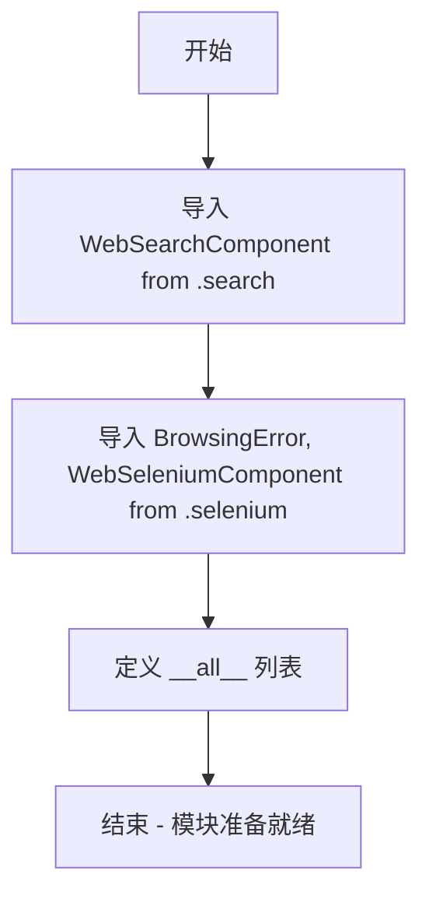

# `.\AutoGPT\classic\forge\forge\components\web\__init__.py` 详细设计文档

这是一个Python包的初始化文件，主要功能是导入并重新导出Web搜索组件和Selenium浏览器相关的公共API，提供统一的模块入口。

## 整体流程



## 类结构

```
当前为包初始化文件，无类层次结构
├── WebSearchComponent (在 search 模块中定义)
├── BrowsingError (在 selenium 模块中定义，异常类)
└── WebSeleniumComponent (在 selenium 模块中定义)
```

## 全局变量及字段


### `__all__`
    
定义模块的公共API接口，指定使用from...import *时允许导入的符号列表

类型：`list[str]`
    


    

## 全局函数及方法


## 关键组件


### WebSearchComponent

网络搜索组件，用于执行网页搜索功能

### BrowsingError

浏览错误异常，用于处理浏览器操作过程中的错误

### WebSeleniumComponent

Selenium网页浏览组件，提供基于Selenium的自动化网页交互功能


## 问题及建议


### 已知问题

-   **缺少模块文档字符串**：该 `__init__.py` 文件没有模块级别的文档字符串，开发者无法快速了解该包的用途和设计意图
-   **`__all__` 定义不完整**：当前仅导出了组件类，未包含 `selenium` 子模块本身，可能影响 `from . import selenium` 这类导入方式的使用
-   **缺乏版本控制**：没有定义 `__version__` 变量，无法追溯包版本信息
-   **类型注解缺失**：导入语句中未使用类型注解，影响静态分析和IDE支持
-   **子模块未直接导出**：`selenium` 和 `search` 子模块未在 `__all__` 中声明，限制了 `import web_search.selenium` 这类导入方式的可发现性
-   **BrowsingError 导出但缺乏说明**：虽然导出了异常类，但未在包级别提供该异常的使用指南或继承关系说明

### 优化建议

-   **添加模块文档字符串**：在文件开头添加模块级docstring，描述该包的功能（如"提供基于Web的搜索和浏览组件"）
-   **完善 `__all__` 定义**：考虑将子模块也纳入导出列表，或明确注释仅导出公共API的设计决策
-   **添加版本信息**：定义 `__version__` 变量，遵循语义化版本规范
-   **使用类型注解**：虽然 `__init__.py` 中直接导入不需要类型注解，但可在子模块中增强类型提示
-   **提供异常导出说明**：在文档中明确 `BrowsingError` 的用途和可能的触发场景
-   **考虑添加便捷导入**：如 `from .search import *` 以简化子模块的访问（需配合子模块的 `__all__`）


## 其它


### 设计目标与约束

本模块作为Web搜索与浏览功能的统一入口模块，旨在提供清晰的API导出和模块化架构。设计约束包括：遵循Python包管理规范，使用__all__明确公开接口；保持子模块（search、selenium）的独立性；支持类型提示和IDE自动补全。

### 错误处理与异常设计

BrowsingError异常类定义在selenium子模块中，作为浏览操作的核心异常类型。模块设计遵循"显式优于隐式"原则，通过__all__明确导出 BrowsingError，使用户能够直接导入并捕获该异常进行错误处理。

### 外部依赖与接口契约

本模块的外部依赖包括：search子模块提供的WebSearchComponent类；selenium子模块提供的WebSeleniumComponent类和BrowsingError异常类。接口契约规定：导入本模块后可直接使用WebSearchComponent、BrowsingError和WebSeleniumComponent三个公开API，其他内部实现细节不对外暴露。

### 模块化架构设计

本模块采用分层导出模式，通过__init__.py集中管理模块公共接口，实现子模块（search、selenium）与外部调用者的解耦。这种设计允许在不修改外部调用代码的情况下，更新或替换子模块的实现细节。

### 类型注解与IDE支持

建议在子模块中提供完整的类型注解（Type Hints），确保在使用from web_module import *或显式导入时，IDE能够正确识别WebSearchComponent、BrowsingError和WebSeleniumComponent的类型信息，从而提供准确的代码补全和类型检查功能。

### 版本兼容性考虑

本模块设计需考虑Python版本兼容性，建议支持Python 3.8及以上版本，以确保能够使用typing模块的现代特性和类型注解功能。

### 性能与内存优化

由于本模块仅为接口导出层，不涉及运行时性能开销。性能优化主要体现在子模块（search、selenium）的实现中，本模块的职责是确保导入效率，避免循环依赖和冗余导入。


    