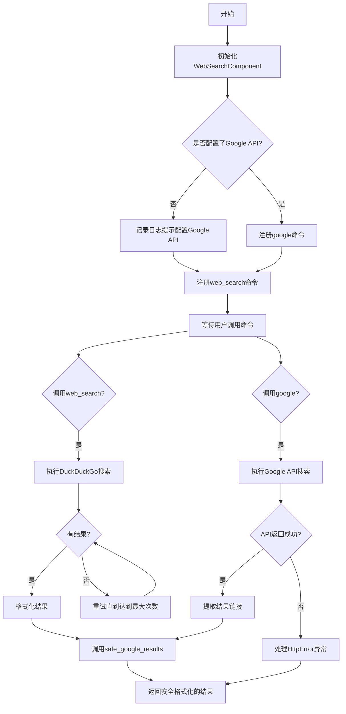
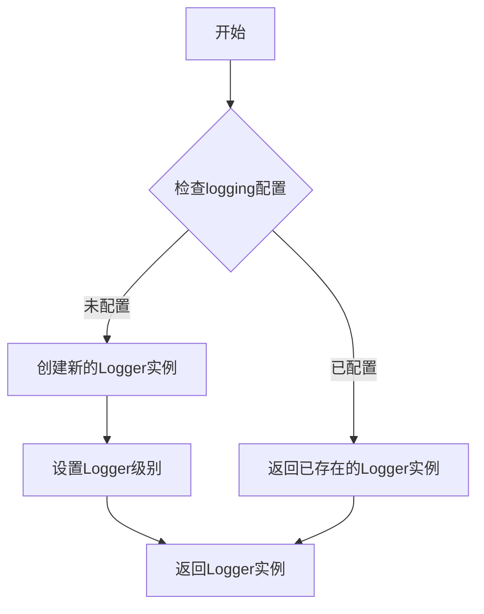
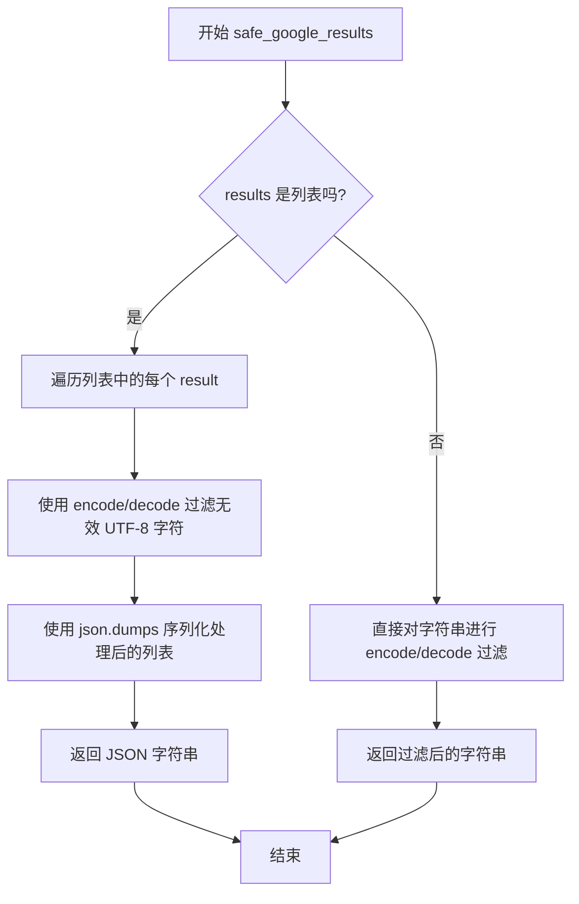
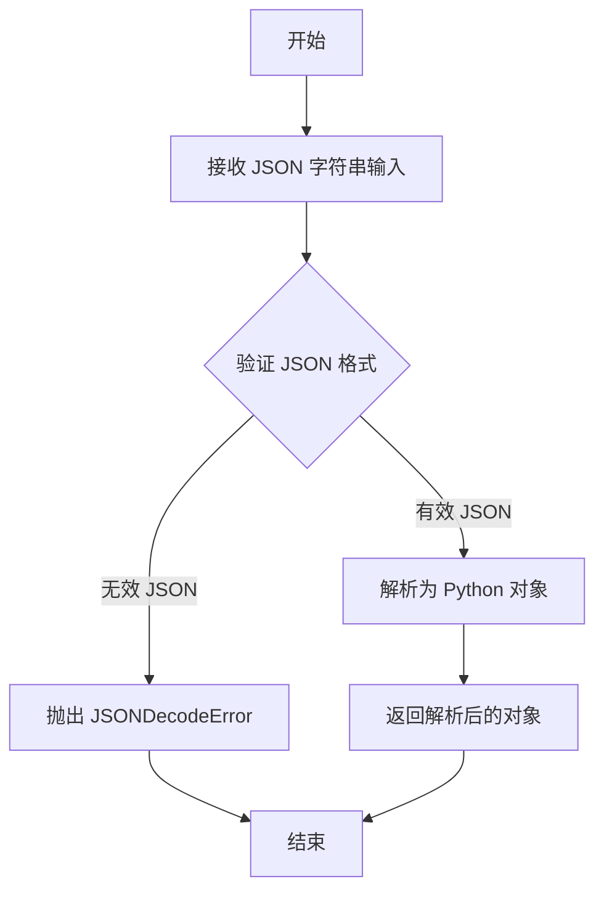
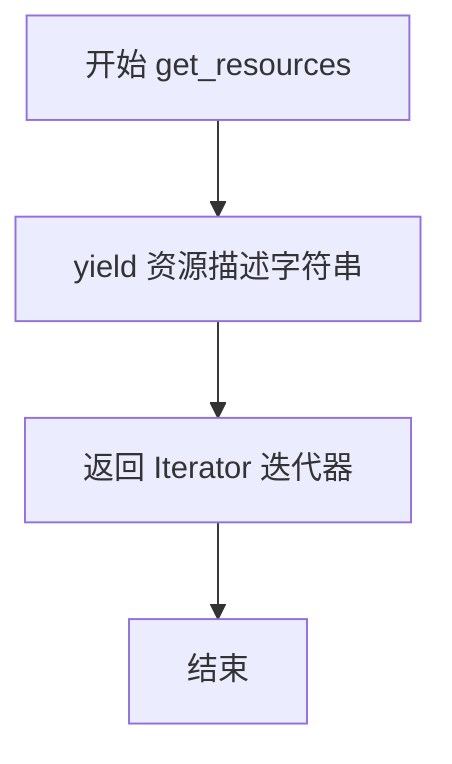
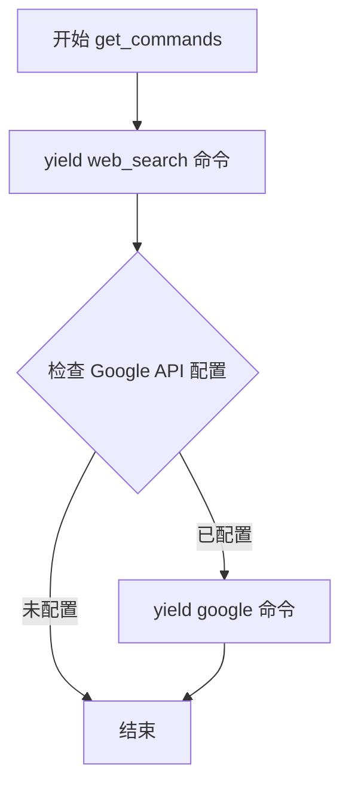
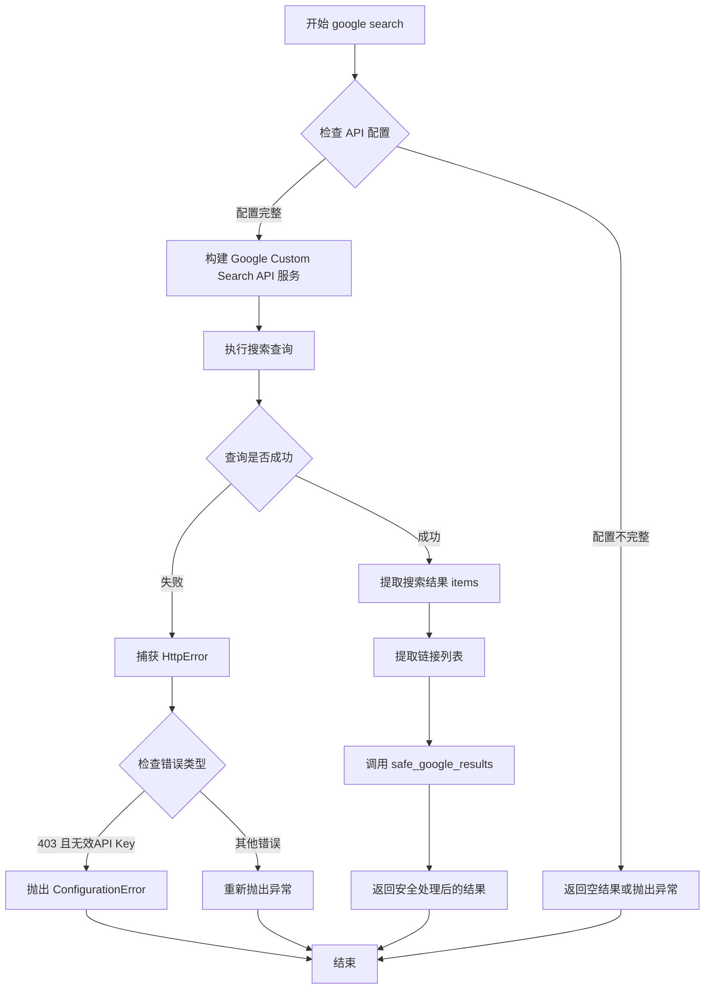
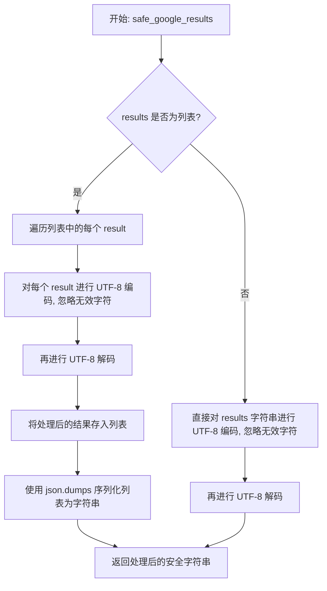

```mermaid
flowchart TD
    A[开始重试循环] --> B{查询为空?}
    B -->|是| C[返回空结果]
    B -->|否| D[执行DuckDuckGo搜索]
    D --> E{搜索结果存在?}
    E -->|是| F[跳出循环]
    E -->|否| G[调用 time.sleep&#40;1&#41;]
    G --> H[重试次数加1]
    H --> B
```

# `.\AutoGPT\classic\forge\forge\components\web\search.py` 详细设计文档

该代码实现了一个WebSearchComponent组件，提供网络搜索功能。支持两种搜索后端：DuckDuckGo（默认）和Google Custom Search API。该组件实现了CommandProvider和DirectiveProvider协议，可被集成到Agent框架中，通过配置化的方式提供web_search和google两条搜索命令，支持配置重试次数、搜索后端类型等参数。

## 整体流程



## 类结构

```
WebSearchConfiguration (Pydantic BaseModel)
└── WebSearchComponent (DirectiveProvider, CommandProvider, ConfigurableComponent)
    ├── config_class: WebSearchConfiguration
    ├── get_resources()
    ├── get_commands()
    ├── web_search()
    ├── google()
    └── safe_google_results()
```

## 全局变量及字段


### `logger`
    
Logger instance for the module to record runtime information and errors.

类型：`logging.Logger`
    


### `DDGS`
    
DuckDuckGo search client class from duckduckgo_search library for performing web searches.

类型：`class`
    


### `BaseModel`
    
Pydantic base model class for data validation and settings management.

类型：`class`
    


### `SecretStr`
    
Pydantic type for handling sensitive string data that should be masked in output.

类型：`class`
    


### `JSONSchema`
    
Forge model class for defining JSON schema specifications for command parameters.

类型：`class`
    


### `Command`
    
Forge command class representing executable commands with metadata.

类型：`class`
    


### `command`
    
Forge decorator function for registering and configuring command handlers.

类型：`function`
    


### `ConfigurableComponent`
    
Forge base class for components that require configuration management.

类型：`class`
    


### `CommandProvider`
    
Forge protocol interface for components that provide executable commands.

类型：`class`
    


### `DirectiveProvider`
    
Forge protocol interface for components that provide directives or resources.

类型：`class`
    


### `UserConfigurable`
    
Forge configuration attribute class for user-adjustable settings with env variable support.

类型：`class`
    


### `ConfigurationError`
    
Forge exception class for configuration-related errors and validation failures.

类型：`class`
    


### `WebSearchConfiguration.google_api_key`
    
Optional Google API key for authenticated Google search functionality.

类型：`Optional[SecretStr]`
    


### `WebSearchConfiguration.google_custom_search_engine_id`
    
Optional custom search engine ID for Google programmatic search.

类型：`Optional[SecretStr]`
    


### `WebSearchConfiguration.duckduckgo_max_attempts`
    
Maximum number of retry attempts for DuckDuckGo search queries.

类型：`int`
    


### `WebSearchConfiguration.duckduckgo_backend`
    
Backend type selection for DuckDuckGo search engine (api, html, or lite).

类型：`Literal['api', 'html', 'lite']`
    


### `WebSearchComponent.config_class`
    
Class type reference to the configuration model (WebSearchConfiguration).

类型：`type`
    


### `WebSearchComponent.config`
    
Instance of WebSearchConfiguration containing search provider settings and parameters.

类型：`WebSearchConfiguration`
    
    

## 全局函数及方法


### `logger`

这是一个模块级别的全局变量，用于获取当前模块的日志记录器实例。通过 `logging.getLogger(__name__)` 创建，并以 `__name__` 变量作为日志记录器的名称，便于在日志输出中识别日志来源。

参数：无

返回值：`logging.Logger`，返回当前模块的日志记录器实例

#### 流程图



#### 带注释源码

```python
# 导入标准库logging模块
import logging

# 使用当前模块的__name__作为logger名称
# __name__在模块被导入时会自动替换为模块的完整路径
# 例如: 如果这个文件是forge/components/web_search.py，则__name__为forge.components.web_search
# 这样可以在日志中清晰识别日志来源
logger = logging.getLogger(__name__)
```


### `time.sleep`

`time.sleep` 是 Python 标准库 `time` 模块中的全局函数，用于暂停当前线程的执行指定秒数。在代码中，该函数被用于实现 DuckDuckGo 搜索的重试机制，当搜索结果为空时，暂停 1 秒后再重试，以避免频繁请求 API。

参数：

- `seconds`：`int` 或 `float`，暂停执行的秒数。在代码中传入的是整数 `1`，表示暂停 1 秒。

返回值：`None`，该函数不返回任何值。

#### 流程图



#### 带注释源码

```python
# 在 WebSearchComponent.web_search 方法中
while attempts < self.config.duckduckgo_max_attempts:
    if not query:
        return json.dumps(search_results)

    # 执行 DuckDuckGo 搜索
    search_results = DDGS().text(
        query, max_results=num_results, backend=self.config.duckduckgo_backend
    )

    # 检查搜索结果是否为空
    if search_results:
        break

    # 搜索失败，暂停 1 秒后重试
    # 目的：避免频繁请求 API，给服务器缓冲时间
    time.sleep(1)
    attempts += 1
```


### `WebSearchComponent.safe_google_results`

该方法将搜索结果（列表或字符串）转换为安全的 UTF-8 编码字符串，用于防止编码问题导致的输出错误。

参数：

-  `results`：`str | list`，搜索结果，可以是字符串或 URL 列表

返回值：`str`，经过 UTF-8 安全处理后的字符串

#### 流程图



#### 带注释源码

```python
def safe_google_results(self, results: str | list) -> str:
    """
    Return the results of a Google search in a safe format.

    Args:
        results (str | list): The search results.

    Returns:
        str: The results of the search.
    """
    # 检查结果是否为列表类型
    if isinstance(results, list):
        # 对列表中的每个元素进行 UTF-8 安全处理
        # encode("utf-8", "ignore") 忽略无法编码的字符
        # decode("utf-8") 将字节转回字符串
        safe_message = json.dumps(
            [result.encode("utf-8", "ignore").decode("utf-8") for result in results]
        )
    else:
        # 对字符串直接进行 UTF-8 安全处理
        safe_message = results.encode("utf-8", "ignore").decode("utf-8")
    return safe_message
```


### `json.loads`

从代码中提取的 `json.loads()` 函数使用信息

参数：

- `s`：`str`，要解析的 JSON 字符串（代码中传入的是 `e.content.decode()`，即 HTTP 错误响应内容的解码结果）

返回值：`Any`，解析后的 Python 对象（字典或列表，代码中用于提取错误详情）

#### 流程图



#### 带注释源码

```python
# 从 HTTP 错误响应中提取详细信息
# e.content 是 HTTP 错误响应的字节内容
# .decode() 将字节转换为 UTF-8 字符串
# json.loads() 将 JSON 字符串解析为 Python 字典
error_details = json.loads(e.content.decode())

# 提取错误代码和消息
if error_details.get("error", {}).get(
    "code"
) == 403 and "invalid API key" in error_details.get("error", {}).get(
    "message", ""
):
    raise ConfigurationError(
        "The provided Google API key is invalid or missing."
    )
```


### DDGS().text()

描述外部 DuckDuckGo 搜索库的核心方法，用于执行基于文本的网络搜索并返回结构化的搜索结果列表。

参数：

- `query`：`str`，搜索查询字符串
- `max_results`：`int`，可选参数，要返回的最大结果数量（代码中默认值为 8）
- `backend`：`Literal["api", "html", "lite"]`，可选参数，搜索后端类型（代码中默认为 "api"）

返回值：`list[dict]`，返回搜索结果列表，每个字典包含搜索结果的标题（title）、链接（href）和正文摘要（body，可能不存在）

#### 流程图

```mermaid
flowchart TD
    A[调用 DDGS().text] --> B{检查 query 是否为空}
    B -->|是| C[返回空列表]
    B -->|否| D[根据 backend 参数选择搜索后端]
    D --> E[执行 DuckDuckGo 搜索请求]
    E --> F{搜索是否成功}
    F -->|失败| G[返回空列表或抛出异常]
    F -->|成功| H[解析搜索响应]
    H --> I[返回结构化结果列表]
    
    subgraph 返回结果格式
    I --> I1["title: 标题"]
    I --> I2["href: URL 链接"]
    I --> I3["body: 摘要内容"]
    end
```

#### 带注释源码

```python
# 从 duckduckgo_search 库导入 DDGS 类
from duckduckgo_search import DDGS

# ... 在 WebSearchComponent.web_search 方法中 ...

# 初始化 DuckDuckGo 搜索实例并调用 text 方法
search_results = DDGS().text(
    query,                      # str: 用户输入的搜索查询字符串
    max_results=num_results,    # int: 最多返回的结果数量（默认8）
    backend=self.config.duckduckgo_backend  # str: 搜索后端类型（api/html/lite）
)

# 返回值 search_results 是一个列表，每个元素是包含以下字段的字典：
# - title: 搜索结果的标题
# - href: 搜索结果的 URL 链接
# - body: 搜索结果的摘要正文（可能不存在）

# 后续代码对结果进行处理和格式化
search_results = [
    {
        "title": r["title"],      # 提取标题
        "url": r["href"],         # 提取 URL
        **({"exerpt": r["body"]} if r.get("body") else {}),  # 条件添加摘要
    }
    for r in search_results  # 遍历搜索结果列表
]
```


### `WebSearchComponent.get_resources`

该方法是一个资源提供方法，属于 `WebSearchComponent` 组件，实现了 `DirectiveProvider` 协议中的接口。它通过生成器（yield）返回一个迭代器，提供组件所管理的资源描述信息。

参数：

- `self`：`WebSearchComponent`，隐式参数，指向类的实例本身，用于访问实例属性和方法

返回值：`Iterator[str]`，返回一个字符串迭代器，包含组件提供的资源描述信息

#### 流程图



#### 带注释源码

```python
def get_resources(self) -> Iterator[str]:
    """提供组件的资源描述信息
    
    该方法实现了 DirectiveProvider 协议中的 get_resources 方法，
    用于向系统声明组件可以提供的资源能力。
    
    Args:
        self: WebSearchComponent 实例，隐式参数
        
    Returns:
        Iterator[str]: 返回一个生成器迭代器，包含资源描述字符串
    """
    # 通过 yield 关键字返回资源描述字符串
    # 描述该组件提供的互联网访问能力，用于搜索和信息收集
    yield "Internet access for searches and information gathering."
```

---

### 补充说明

#### 设计目标与约束

- **协议实现**：该方法实现了 `DirectiveProvider` 协议中的 `get_resources` 接口，这是框架中定义的资源声明机制
- **简单实现**：该方法的实现非常简洁，仅返回静态描述信息，未动态检查配置状态
- **资源声明**：通过该方法，系统可以了解到 WebSearchComponent 组件提供互联网搜索能力

#### 技术债务与优化空间

- **静态描述问题**：当前实现返回硬编码的静态字符串，无法反映实际配置状态。例如，当未配置任何搜索后端时，组件实际上无法提供搜索功能，但仍声明具有"互联网访问"能力
- **动态能力检测**：建议该方法可根据配置状态动态返回资源能力描述，例如在未配置任何 API 时返回更准确的提示信息


### `WebSearchComponent.get_commands`

获取该组件提供的所有命令迭代器。该方法是一个生成器函数，首先返回基础的 Web 搜索命令，当配置了 Google API 密钥和自定义搜索引擎 ID 时，额外返回 Google 搜索命令。

参数：无

返回值：`Iterator[Command]`，返回命令对象的迭代器，可用于注册到指令系统中。

#### 流程图



#### 带注释源码

```python
def get_commands(self) -> Iterator[Command]:
    """获取组件提供的所有命令迭代器

    生成该组件可用的命令。根据配置情况，
    可能返回单个或多个命令。

    Returns:
        Iterator[Command]: 命令对象的迭代器
    """
    # 先返回基础的 DuckDuckGo 搜索命令
    yield self.web_search

    # 检查是否配置了 Google API 密钥和搜索引擎 ID
    if self.config.google_api_key and self.config.google_custom_search_engine_id:
        # 只有配置了 Google 搜索凭据时才返回 Google 搜索命令
        yield self.google
```


### `WebSearchComponent.web_search`

该方法是 WebSearchComponent 类的核心搜索方法，通过 DuckDuckGo 搜索引擎执行网络搜索，将搜索结果格式化为 Markdown 文本并返回。

参数：

- `query`：`str`，搜索查询字符串，不能为空
- `num_results`：`int`，返回结果的数量，默认为 8

返回值：`str`，格式化后的搜索结果，包含标题、URL 和摘要

#### 流程图

```mermaid
flowchart TD
    A[开始 web_search] --> B[初始化 search_results = [], attempts = 0]
    B --> C{attempts < duckduckgo_max_attempts}
    C -->|是| D{query 是否为空}
    D -->|是| E[返回 json.dumpssearch_results]
    D -->|否| F[调用 DDGS.text query, max_results, backend]
    F --> G{search_results 是否存在}
    G -->|是| H[跳出循环]
    G -->|否| I[time.sleep1]
    I --> J[attempts += 1]
    J --> C
    C -->|否| K[格式化结果: title, url, excerpt]
    K --> L[生成 Markdown 字符串]
    L --> M[safe_google_results处理]
    M --> N[返回 str 结果]
    E --> N
```

#### 带注释源码

```python
@command(
    ["web_search", "search"],  # 命令别名，支持 web_search 和 search 两种调用方式
    "Searches the web",         # 命令描述
    {
        # query 参数定义
        "query": JSONSchema(
            type=JSONSchema.Type.STRING,
            description="The search query",
            required=True,  # 必填参数
        ),
        # num_results 参数定义
        "num_results": JSONSchema(
            type=JSONSchema.Type.INTEGER,
            description="The number of results to return",
            minimum=1,      # 最小返回结果数
            maximum=10,    # 最大返回结果数
            required=False, # 可选参数，默认值为 8
        ),
    },
)
def web_search(self, query: str, num_results: int = 8) -> str:
    """Return the results of a Google search

    Args:
        query (str): The search query.
        num_results (int): The number of results to return.

    Returns:
        str: The results of the search.
    """
    # 初始化搜索结果列表和重试计数器
    search_results = []
    attempts = 0

    # 重试机制：最多尝试 duckduckgo_max_attempts 次
    while attempts < self.config.duckduckgo_max_attempts:
        # 空查询直接返回空结果
        if not query:
            return json.dumps(search_results)

        # 调用 DuckDuckGo 搜索引擎
        # 使用 text 方法进行文本搜索，backend 可配置为 api/html/lite
        search_results = DDGS().text(
            query, max_results=num_results, backend=self.config.duckduckgo_backend
        )

        # 搜索成功则跳出循环
        if search_results:
            break

        # 搜索失败则等待 1 秒后重试
        time.sleep(1)
        attempts += 1

    # 格式化搜索结果：提取 title、url，可选提取 body 作为 excerpt
    search_results = [
        {
            "title": r["title"],
            "url": r["href"],
            **({"exerpt": r["body"]} if r.get("body") else {}),  # 注意：此处有拼写错误，应为 excerpt
        }
        for r in search_results
    ]

    # 生成 Markdown 格式的搜索结果
    # 格式：## Search results\n\n### "标题"\n**URL:** url  \n**Excerpt:** "摘要" 或 N/A
    results = ("## Search results\n") + "\n\n".join(
        f"### \"{r['title']}\"\n"
        f"**URL:** {r['url']}  \n"
        "**Excerpt:** " + (f'"{exerpt}"' if (exerpt := r.get("exerpt")) else "N/A")
        for r in search_results
    )
    # 调用安全处理方法返回结果（处理编码问题）
    return self.safe_google_results(results)
```


### `WebSearchComponent.google`

执行 Google 搜索，使用官方 Google Custom Search API 返回搜索结果。

参数：

- `query`：`str`，搜索查询字符串
- `num_results`：`int`，返回结果的数量（默认值为 8）

返回值：`str | list[str]`，搜索结果的 URL 列表或安全格式化的结果字符串

#### 流程图



#### 带注释源码

```python
@command(
    ["google"],
    "Google Search",
    {
        "query": JSONSchema(
            type=JSONSchema.Type.STRING,
            description="The search query",
            required=True,
        ),
        "num_results": JSONSchema(
            type=JSONSchema.Type.INTEGER,
            description="The number of results to return",
            minimum=1,
            maximum=10,
            required=False,
        ),
    },
)
def google(self, query: str, num_results: int = 8) -> str | list[str]:
    """Return the results of a Google search using the official Google API

    Args:
        query (str): The search query.
        num_results (int): The number of results to return.

    Returns:
        str: The results of the search.
    """

    # 延迟导入 Google API 客户端库，仅在需要时加载
    from googleapiclient.discovery import build
    from googleapiclient.errors import HttpError

    try:
        # 断言检查：确保 API Key 和 Custom Search Engine ID 已配置
        # 这些配置在 get_commands() 方法中已验证才会yield该命令
        assert self.config.google_api_key
        assert self.config.google_custom_search_engine_id

        # 使用 Google API Key 初始化 Custom Search API 服务
        # 构建 v1 版本的 customsearch 服务
        service = build(
            "customsearch",
            "v1",
            developerKey=self.config.google_api_key.get_secret_value(),
        )

        # 发送搜索查询并获取结果
        # cx: Custom Search Engine ID
        # num: 返回结果数量
        result = (
            service.cse()
            .list(
                q=query,
                cx=self.config.google_custom_search_engine_id.get_secret_value(),
                num=num_results,
            )
            .execute()
        )

        # 从响应中提取搜索结果项
        # 返回格式: [{"title": ..., "link": ..., "snippet": ...}, ...]
        search_results = result.get("items", [])

        # 从搜索结果中提取仅包含 URL 的列表
        # 用于返回简洁的链接列表
        search_results_links = [item["link"] for item in search_results]  # type: ignore

    except HttpError as e:
        # 处理 API 调用中的错误
        # 解析错误响应内容
        error_details = json.loads(e.content.decode())

        # 检查是否是无效或缺失 API 键相关的错误
        # 错误代码 403 且包含 "invalid API key" 消息
        if error_details.get("error", {}).get(
            "code"
        ) == 403 and "invalid API key" in error_details.get("error", {}).get(
            "message", ""
        ):
            # 抛出配置错误异常，提供清晰的错误信息
            raise ConfigurationError(
                "The provided Google API key is invalid or missing."
            )
        # 其他 HTTP 错误重新抛出
        raise

    # 调用安全结果处理方法
    # 将结果转换为安全的 UTF-8 编码格式，防止编码问题
    return self.safe_google_results(search_results_links)
```


### `WebSearchComponent.safe_google_results`

该方法用于对搜索结果进行 UTF-8 安全处理，将可能包含无效字符的数据转换为安全的字符串格式，防止编码问题导致的异常。

参数：

- `results`：`str | list`，搜索结果，可以是字符串或字符串列表

返回值：`str`，经过 UTF-8 安全处理后的字符串结果

#### 流程图



#### 带注释源码

```python
def safe_google_results(self, results: str | list) -> str:
    """
    Return the results of a Google search in a safe format.

    Args:
        results (str | list): The search results.

    Returns:
        str: The results of the search.
    """
    # 检查 results 是否为列表类型
    if isinstance(results, list):
        # 如果是列表，遍历每个结果进行 UTF-8 安全处理
        safe_message = json.dumps(
            # 对每个 result 编码为 UTF-8，忽略无法编码的字符，然后解码回字符串
            [result.encode("utf-8", "ignore").decode("utf-8") for result in results]
        )
    else:
        # 如果是字符串，直接进行 UTF-8 编码/解码处理
        # "ignore" 参数会忽略无法编码的字符，避免抛出异常
        safe_message = results.encode("utf-8", "ignore").decode("utf-8")
    # 返回处理后的安全字符串
    return safe_message
```

## 关键组件


### WebSearchConfiguration

配置类，定义WebSearchComponent的配置模型，包含Google API密钥、自定义搜索引擎ID、DuckDuckGo最大重试次数和后端类型等配置项。

### WebSearchComponent

核心搜索组件，提供Web搜索功能的实现，实现了DirectiveProvider、CommandProvider和ConfigurableComponent接口，支持DuckDuckGo和Google两种搜索引擎。

### 配置管理模块

使用Pydantic BaseModel进行配置验证，通过UserConfigurable支持从环境变量加载敏感配置，实现配置的声明式管理。

### DuckDuckGo搜索功能

基于DDGS库实现的网页搜索功能，支持可配置的最大重试次数和多种后端类型（api/html/lite），返回结构化的搜索结果。

### Google Custom Search功能

使用Google API Client库调用Google Custom Search API，需要有效的API密钥和自定义搜索引擎ID，返回搜索结果链接列表。

### 搜索结果格式化

将原始搜索结果转换为带有标题、URL和摘要的Markdown格式，提供统一的输出结构。

### 安全结果处理

safe_google_results方法对搜索结果进行UTF-8编码处理，确保特殊字符的安全处理，支持字符串和列表两种输入类型。

### 命令注册机制

通过@command装饰器注册web_search和google命令，定义命令名称、描述和JSON Schema参数规范，供上层框架调用。

### 资源声明

get_resources方法声明该组件需要互联网访问权限，用于信息获取场景。

## 问题及建议


### 已知问题

-   **拼写错误**：代码中存在拼写错误，`exerpt` 应为 `excerpt`，出现在列表推导式和 f-string 中。
-   **代码重复**：两个搜索命令（`web_search` 和 `google`）的 JSON Schema 定义几乎完全相同，但未进行复用。
-   **不一致的返回类型**：`google` 方法的返回类型注解为 `str | list[str]`，但实际调用 `safe_google_results` 后，根据输入类型可能返回 JSON 字符串或原始字符串，语义不清晰。
-   **缺失的错误处理**：`web_search` 方法仅处理空查询情况，未对 `DDGS().text()` 可能抛出的异常（如网络错误、API 限制等）进行捕获和处理。
-   **重复调用 `get_secret_value()`**：每次调用 `google` 方法时都会重复调用 `get_secret_value()` 获取密钥值，未对解密后的值进行缓存。
-   **配置验证不足**：`WebSearchConfiguration` 未验证 Google API Key 和 Custom Search Engine ID 必须同时存在或同时缺失，导致配置不完整时可能产生难以追踪的错误。
-   **魔法数字**：`num_results` 的默认值 8 在两个方法中硬编码，未在配置类中统一管理。

### 优化建议

-   **修复拼写错误**：将所有 `exerpt` 修正为 `excerpt`。
-   **提取公共 Schema**：将搜索命令的公共参数定义为一个常量或辅助方法，避免重复定义。
-   **统一返回类型**：明确 `safe_google_results` 的返回类型，确保所有搜索方法返回格式一致的结果。
-   **增加异常处理**：为 `web_search` 方法添加 try-except 块，捕获并处理 DDGS 相关异常。
-   **缓存解密值**：在配置初始化时解密并缓存密钥值，避免重复解密操作。
-   **增强配置验证**：在 `WebSearchConfiguration` 的 `__init__` 或 `model_validator` 中添加验证逻辑，确保 Google 相关配置完整性。
-   **配置化默认值**：将 `num_results` 的默认值移至配置类中统一管理。

## 其它


### 设计目标与约束

本组件的设计目标是为Agent提供互联网搜索能力，支持DuckDuckGo和Google两种搜索引擎。约束条件包括：1) Google搜索需要有效的API Key和Custom Search Engine ID；2) DuckDuckGo搜索作为默认备选方案；3) 搜索结果数量限制在1-10之间；4) 需遵循外部API的速率限制和错误处理规范。

### 错误处理与异常设计

本组件涉及多种错误处理场景：1) DuckDuckGo搜索失败时最多重试3次，每次间隔1秒；2) Google API调用失败时捕获HttpError，解析错误码；3) 403错误且包含"invalid API key"时抛出ConfigurationError；4) 空查询返回空JSON数组；5) 结果编码使用UTF-8并忽略无效字符(safe_google_results方法)。

### 数据流与状态机

数据流如下：用户调用web_search/google命令 → 验证配置参数 → 调用外部搜索API(DDGS或Google Custom Search) → 解析响应结果 → 格式化输出(标题、URL、摘要) → 返回安全字符串。状态机包含：初始化状态(检查API配置) → 就绪状态(可执行搜索) → 搜索中状态(调用外部服务) → 返回结果状态。

### 外部依赖与接口契约

主要依赖包括：1) duckduckgo_search包提供DDGS类用于DuckDuckGo搜索；2) googleapiclient.discovery提供build函数用于Google API调用；3) pydantic的BaseModel用于配置验证；4) forge框架的Command、ConfigurableComponent等基础组件。接口契约：get_resources()返回互联网访问能力描述；get_commands()返回可用的命令迭代器；web_search和google方法接收查询参数并返回格式化字符串。

### 配置参数详解

WebSearchConfiguration包含4个配置项：google_api_key(Optional[SecretStr]) - Google API密钥，从环境变量GOOGLE_API_KEY获取；google_custom_search_engine_id(Optional[SecretStr]) - Google自定义搜索引擎ID，从环境变量GOOGLE_CUSTOM_SEARCH_ENGINE_ID获取；duckduckgo_max_attempts(int，默认3) - DuckDuckGo搜索重试次数；duckduckgo_backend(str，默认"api") - DuckDuckGo后端类型，可选"api"、"html"、"lite"。

### 已知问题与改进建议

发现的问题包括：1) 拼写错误"exerpt"应为"excerpt"(第85、92行)；2) web_search方法docstring声称"Google search"实际使用DuckDuckGo；3) duckduckgo_max_attempts配置项存在但未在UserConfigurable中暴露给用户；4) 缺少搜索结果缓存机制；5) 无请求超时配置；6) Google搜索未实现与DuckDuckGo相同的重试逻辑。优化建议：修复拼写错误、更新docstring、暴露更多配置项、添加缓存和超时控制、统一重试策略。

    