# `.\AutoGPT\classic\forge\forge\components\web\selenium.py` 详细设计文档

WebSeleniumComponent是一个基于Selenium的Web浏览器组件,支持多种浏览器(Chrome、Firefox、Safari、Edge)进行网页浏览、内容抓取和信息提取,并集成了LLM用于网页内容的智能摘要和信息抽取。

## 整体流程

```mermaid
graph TD
A[开始] --> B[read_webpage调用]
B --> C{验证URL}
C --> D[open_page_in_browser]
D --> E[选择浏览器类型]
E --> F{Chrome|Firefox|Edge|Safari}
F --> G[Chrome: 配置选项]
F --> H[Firefox: 配置选项]
F --> I[Edge: 配置选项]
F --> J[Safari: 配置选项]
G --> K[下载CRX扩展]
K --> L[创建WebDriver]
H --> L
I --> L
J --> L
L --> M[driver.get加载URL]
M --> N[等待页面加载]
N --> O[scrape_text_with_selenium]
O --> P[scrape_links_with_selenium]
P --> Q{get_raw_content?}
Q -- 是 --> R[检查token限制]
R --> S{超限?}
S -- 是 --> T[抛出TooMuchOutputError]
S -- 否 --> U[返回原始内容]
Q -- 否 --> V[summarize_webpage]
V --> W{topics_of_interest?}
W -- 是 --> X[extract_information]
W -- 否 --> Y[summarize_text]
X --> Z[格式化输出]
Y --> Z
Z --> AA[关闭driver]
AA --> AB[返回结果]
```

## 类结构

```
ConfigurableComponent (泛型基类)
└── WebSeleniumComponent
    ├── DirectiveProvider (协议)
    ├── CommandProvider (协议)
    └── WebSeleniumConfiguration (Pydantic模型)
```

## 全局变量及字段


### `FILE_DIR`
    
项目文件所在目录的路径对象

类型：`Path`
    


### `MAX_RAW_CONTENT_LENGTH`
    
允许返回的最大原始内容字符数

类型：`int`
    


### `LINKS_TO_RETURN`
    
从网页提取并返回的最大链接数量

类型：`int`
    


### `BrowserOptions`
    
浏览器选项的类型别名，支持四种主流浏览器

类型：`ChromeOptions | EdgeOptions | FirefoxOptions | SafariOptions`
    


### `BrowsingError.BrowsingError`
    
浏览网页时发生的错误异常类

类型：`CommandExecutionError`
    


### `WebSeleniumConfiguration.llm_name`
    
用于读取网页的LLM模型名称

类型：`ModelName`
    


### `WebSeleniumConfiguration.web_browser`
    
Selenium使用的Web浏览器类型

类型：`Literal['chrome', 'firefox', 'safari', 'edge']`
    


### `WebSeleniumConfiguration.headless`
    
是否以无头模式运行浏览器

类型：`bool`
    


### `WebSeleniumConfiguration.user_agent`
    
浏览器使用的用户代理字符串

类型：`str`
    


### `WebSeleniumConfiguration.browse_spacy_language_model`
    
用于文本分块的Spacy语言模型名称

类型：`str`
    


### `WebSeleniumConfiguration.selenium_proxy`
    
Selenium使用的HTTP代理服务器地址

类型：`Optional[str]`
    


### `WebSeleniumComponent.config_class`
    
组件配置类的类型引用

类型：`Type[WebSeleniumConfiguration]`
    


### `WebSeleniumComponent.llm_provider`
    
用于LLM调用的多提供者实例

类型：`MultiProvider`
    


### `WebSeleniumComponent.data_dir`
    
用于存储数据的目录路径

类型：`Path`
    
    

## 全局函数及方法


### `validate_url`

这是一个 URL 验证装饰器，用于在执行被装饰的函数之前验证 URL 的有效性。如果 URL 无效，该装饰器会抛出相应的异常。

参数：
- `func`：`Callable`，被装饰的函数

返回值：`Callable`，返回包装后的函数，该函数在执行前会先验证 URL 参数

#### 流程图

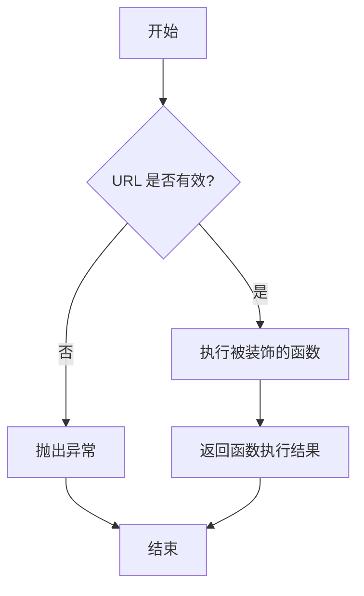

#### 带注释源码

```
# 注：由于 validate_url 函数定义在外部模块 forge.utils.url_validator 中
# 当前代码文件仅导入了该装饰器，未包含其实现源码
# 以下为基于其用途的合理推断：

from functools import wraps

def validate_url(func):
    """
    URL 验证装饰器
    
    在执行被装饰的函数之前验证 URL 参数的有效性，
    确保传入的 URL 符合标准格式。
    """
    @wraps(func)
    async def wrapper(*args, **kwargs):
        # 获取 url 参数（可能是位置参数或关键字参数）
        url = args[0] if args else kwargs.get('url')
        
        # 验证 URL 格式和有效性
        if not url or not isinstance(url, str):
            raise ValueError("URL must be a non-empty string")
            
        # 检查 URL 协议
        if not url.startswith(('http://', 'https://')):
            raise ValueError("URL must start with http:// or https://")
            
        # 执行原函数
        return await func(*args, **kwargs)
    
    return wrapper

# 使用方式（在 WebSeleniumComponent 类中）
@validate_url
async def read_webpage(
    self,
    url: str,
    *,
    topics_of_interest: list[str] = [],
    get_raw_content: bool = False,
    question: str = "",
) -> str:
    # 函数体...
```


### `WebSeleniumComponent.read_webpage`

该方法是一个使用 Selenium 框架浏览网页并从中提取信息的命令，通过 LLM 处理网页内容，支持原始内容返回、问题回答和主题信息提取三种模式。

参数：

- `url`：`str`，要访问的网页 URL
- `topics_of_interest`：`list[str] = []`，要从中提取信息的主题列表，默认为空列表
- `get_raw_content`：`bool = False`，是否返回未处理的原始网页内容，默认为 False
- `question`：`str = ""`，要使用网页内容回答的问题，默认为空字符串

返回值：`str`，返回给用户的答案、链接以及 webdriver

#### 流程图

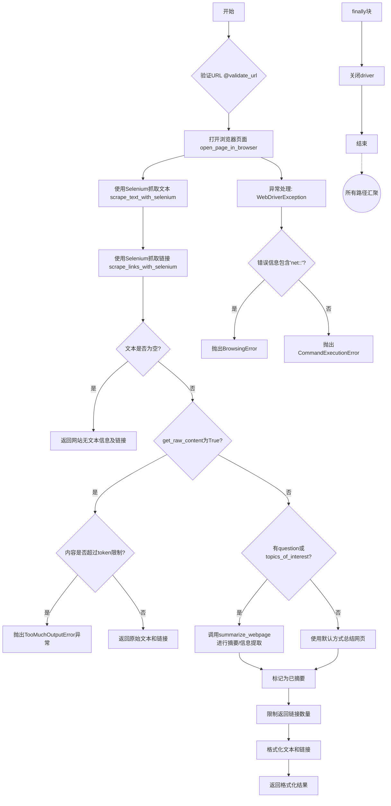

#### 带注释源码

```python
@command(
    ["read_webpage"],  # 命令名称列表
    (
        "Read a webpage, and extract specific information from it."
        " You must specify either topics_of_interest,"
        " a question, or get_raw_content."  # 命令描述
    ),
    {  # JSON Schema 定义参数
        "url": JSONSchema(
            type=JSONSchema.Type.STRING,
            description="The URL to visit",
            required=True,  # URL 为必需参数
        ),
        "topics_of_interest": JSONSchema(
            type=JSONSchema.Type.ARRAY,
            items=JSONSchema(type=JSONSchema.Type.STRING),
            description=(
                "A list of topics about which you want to extract information "
                "from the page."
            ),
            required=False,
        ),
        "question": JSONSchema(
            type=JSONSchema.Type.STRING,
            description=(
                "A question you want to answer using the content of the webpage."
            ),
            required=False,
        ),
        "get_raw_content": JSONSchema(
            type=JSONSchema.Type.BOOLEAN,
            description=(
                "If true, the unprocessed content of the webpage will be returned. "
                "This consumes a lot of tokens, so use it with caution."
            ),
            required=False,
        ),
    },
)
@validate_url  # URL验证装饰器
async def read_webpage(
    self,
    url: str,
    *,
    topics_of_interest: list[str] = [],
    get_raw_content: bool = False,
    question: str = "",
) -> str:
    """Browse a website and return the answer and links to the user

    Args:
        url (str): The url of the website to browse
        question (str): The question to answer using the content of the webpage

    Returns:
        str: The answer and links to the user and the webdriver
    """
    driver = None
    try:
        # Step 1: 使用Selenium打开浏览器并加载页面
        driver = await self.open_page_in_browser(url)

        # Step 2: 抓取网页文本内容
        text = self.scrape_text_with_selenium(driver)
        
        # Step 3: 抓取网页链接
        links = self.scrape_links_with_selenium(driver, url)

        return_literal_content = True
        summarized = False
        
        # Step 4: 处理空内容情况
        if not text:
            return f"Website did not contain any text.\n\nLinks: {links}"
        
        # Step 5: 处理获取原始内容请求
        elif get_raw_content:
            # 检查内容是否超过token限制
            if (
                output_tokens := self.llm_provider.count_tokens(
                    text, self.config.llm_name
                )
            ) > MAX_RAW_CONTENT_LENGTH:
                oversize_factor = round(output_tokens / MAX_RAW_CONTENT_LENGTH, 1)
                raise TooMuchOutputError(
                    f"Page content is {oversize_factor}x the allowed length "
                    "for `get_raw_content=true`"
                )
            return text + (f"\n\nLinks: {links}" if links else "")
        
        # Step 6: 使用LLM进行摘要或信息提取
        else:
            text = await self.summarize_webpage(
                text, question or None, topics_of_interest
            )
            return_literal_content = bool(question)
            summarized = True

        # Step 7: 限制返回链接数量
        if len(links) > LINKS_TO_RETURN:
            links = links[:LINKS_TO_RETURN]

        # Step 8: 格式化输出结果
        text_fmt = f"'''{text}'''" if "\n" in text else f"'{text}'"
        links_fmt = "\n".join(f"- {link}" for link in links)
        return (
            f"Page content{' (summary)' if summarized else ''}:"
            if return_literal_content
            else "Answer gathered from webpage:"
        ) + f" {text_fmt}\n\nLinks:\n{links_fmt}"

    except WebDriverException as e:
        # 异常处理：处理Selenium WebDriver异常
        # 这些错误通常很长且包含很多上下文，只取第一行
        msg = e.msg.split("\n")[0] if e.msg else str(e)
        if "net::" in msg:
            raise BrowsingError(
                "A networking error occurred while trying to load the page: %s"
                % re.sub(r"^unknown error: ", "", msg)
            )
        raise CommandExecutionError(msg)
    finally:
        # 确保driver被正确关闭
        if driver:
            driver.close()
```


### `extract_hyperlinks`

从HTML页面中提取超链接信息的函数，根据base_url解析相对链接并返回结构化的链接数据。

参数：

- `soup`：`BeautifulSoup`，网页HTML解析后的BeautifulSoup对象
- `base_url`：`str`，用于解析相对链接的基础URL

返回值：`List[Dict[str, str]]`（推断），包含提取的链接信息列表，每个元素包含链接文本和URL

#### 流程图

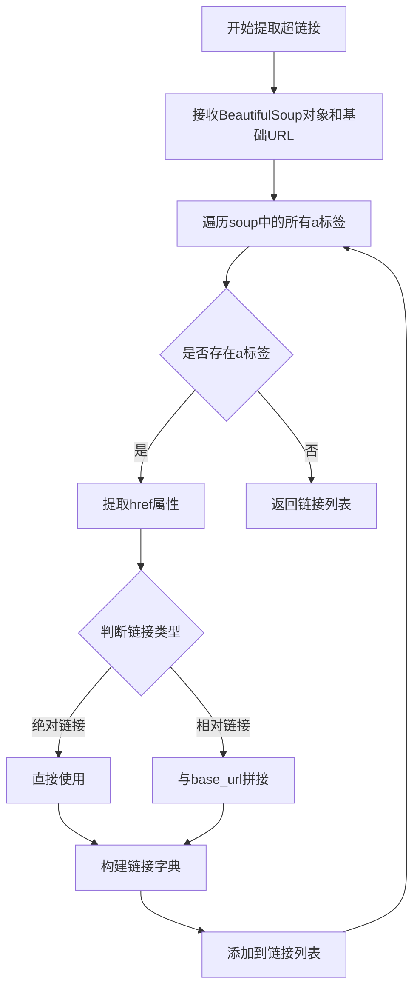

#### 带注释源码

> **注意**：以下源码为基于函数调用约定的推断，并非实际源代码。该函数的实际实现在 `forge.content_processing.html` 模块中，在提供的代码片段中仅有导入和调用语句。

```python
def extract_hyperlinks(soup: BeautifulSoup, base_url: str) -> list[dict]:
    """
    从BeautifulSoup对象中提取超链接信息
    
    参数:
        soup: BeautifulSoup对象，表示解析后的HTML文档
        base_url: 基础URL，用于解析相对链接
    
    返回:
        包含链接信息的字典列表，每个字典包含:
        - text: 链接显示文本
        - url: 解析后的完整URL
    """
    hyperlinks = []
    
    # 查找所有a标签
    for a_tag in soup.find_all('a', href=True):
        href = a_tag['href']
        text = a_tag.get_text(strip=True)
        
        # 处理相对链接
        if not href.startswith(('http://', 'https://', '//')):
            # 与base_url拼接形成绝对链接
            from urllib.parse import urljoin
            href = urljoin(base_url, href)
        
        # 添加到结果列表
        hyperlinks.append({
            'text': text,
            'url': href
        })
    
    return hyperlinks
```

---

> **备注**：该函数的具体实现需要在 `forge/content_processing/html.py` 文件中查看。


### `format_hyperlinks`

此函数用于将从网页中提取的 hyperlinks 列表格式化为字符串列表，供浏览器组件返回给用户。

参数：

-  `hyperlinks`：`list[Any]`，从 `extract_hyperlinks` 提取的原始超链接数据列表

返回值：`list[str]`，格式化后的超链接字符串列表

#### 流程图

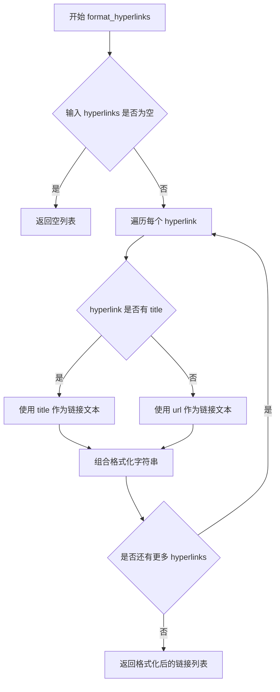

#### 带注释源码

```
# 注意：此函数在代码中未定义，仅通过导入使用
# 来源：forge.content_processing.html.format_hyperlinks
# 以下为基于用法的推断实现

def format_hyperlinks(hyperlinks: list[Any]) -> list[str]:
    """
    Format hyperlinks into a list of readable strings.
    
    Args:
        hyperlinks: List of hyperlink dictionaries from extract_hyperlinks
        
    Returns:
        List of formatted hyperlink strings
    """
    formatted = []
    for link in hyperlinks:
        # 提取URL和标题
        url = link.get('url', '')
        title = link.get('title', '')
        
        # 如果有标题则使用标题，否则使用URL
        text = title if title else url
        
        # 格式化为 "- {text}: {url}" 或类似格式
        formatted.append(f"- {text}: {url}")
    
    return formatted
```

---

**备注**：该函数定义在 `forge.content_processing.html` 模块中，当前代码文件仅通过 `from forge.content_processing.html import extract_hyperlinks, format_hyperlinks` 导入使用。其具体实现需要查看源文件 `forge/content_processing/html.py`。上述源码为基于调用方式的合理推断。


### `extract_information`

这是一个外部导入的函数，定义在 `forge.content_processing.text` 模块中。该函数用于从给定文本中提取与指定主题相关的信息。

参数：

- `text`：`str`，需要提取信息的原始文本
- `topics_of_interest`：`list[str]`，需要提取信息的主题列表
- `llm_provider`：`MultiProvider`，LLM 提供商实例
- `model_name`：`ModelName`，使用的模型名称
- `spacy_model`：`str`，Spacy 语言模型名称

返回值：`list[str]` 或 `Iterator[str]`，提取的信息列表

#### 流程图

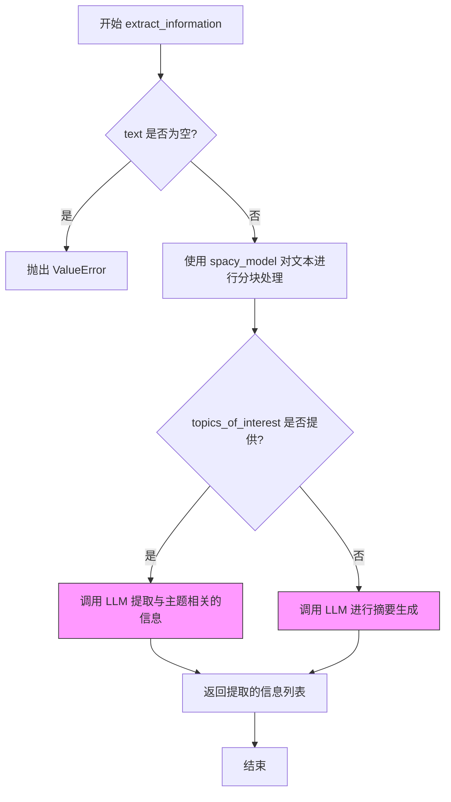

#### 带注释源码

```python
# 该函数定义在 forge.content_processing.text 模块中
# 以下是其在当前文件中的调用方式

# 调用 extract_information 的代码位于 summarize_webpage 方法中：
information = await extract_information(
    text,                                    # 需要处理的原始文本
    topics_of_interest=topics_of_interest,   # 感兴趣的主题列表
    llm_provider=self.llm_provider,          # LLM 提供商
    model_name=self.config.llm_name,        # 使用的模型名称
    spacy_model=self.config.browse_spacy_language_model,  # Spacy 语言模型
)
return "\n".join(f"* {i}" for i in information)
```

---

**注意**：`extract_information` 函数本身不在上述代码文件中定义，而是从外部模块 `forge.content_processing.text` 导入的。上述内容是基于代码中的调用方式推断出的函数签名和行为。


### `summarize_text`

`summarize_text` 是从外部模块 `forge.content_processing.text` 导入的函数，在当前代码文件中被 `WebSeleniumComponent.summarize_webpage` 方法调用用于对网页文本进行摘要处理。该函数接受文本、问题、LLM提供者和模型名称等参数，返回摘要结果。

参数：

-  `text`：`str`，需要摘要的文本内容
-  `question`：`str | None`，可选的问题，用于指导摘要方向
-  `llm_provider`：`MultiProvider`，LLM提供者实例
-  `model_name`：`ModelName`，使用的模型名称
-  `spacy_model`：`str`，使用的Spacy语言模型

返回值：`(str, Any)`，返回摘要文本和可能的额外信息

#### 流程图

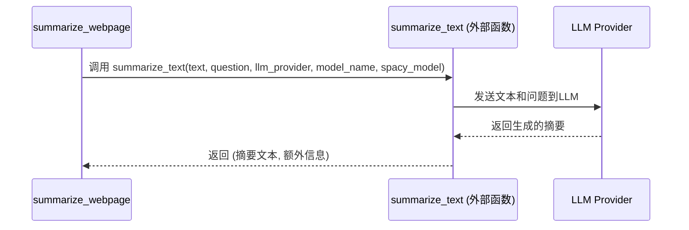

#### 带注释源码

```python
# summarize_text 函数定义在 forge.content_processing.text 模块中
# 以下是其在当前文件中的调用方式：

# 在 summarize_webpage 方法中调用：
result, _ = await summarize_text(
    text,                          # 需要摘要的网页文本
    question=question,             # 可选的问题，用于引导摘要方向
    llm_provider=self.llm_provider, # LLM提供者实例
    model_name=self.config.llm_name, # 配置的模型名称
    spacy_model=self.config.browse_spacy_language_model, # Spacy语言模型
)
return result

# 该函数外部定义在: forge/content_processing/text.py
# 接收文本内容，通过LLM生成摘要或回答问题
```


### `WebSeleniumComponent.__init__`

这是 `WebSeleniumComponent` 类的构造函数，用于初始化 Web 自动化浏览组件的实例，设置 LLM 提供者和数据目录，并继承配置组件的初始化逻辑。

参数：

- `llm_provider`：`MultiProvider`，用于处理 LLM 调用的提供者实例
- `data_dir`：`Path`，用于存储组件相关数据的目录路径
- `config`：`Optional[WebSeleniumConfiguration]`，可选的 WebSelenium 配置对象，若为 None 则使用默认配置

返回值：`None`，构造函数不返回任何值

#### 流程图

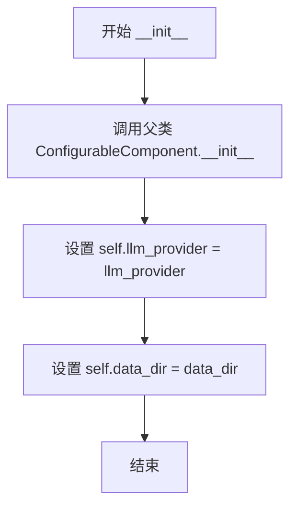

#### 带注释源码

```python
def __init__(
    self,
    llm_provider: MultiProvider,
    data_dir: Path,
    config: Optional[WebSeleniumConfiguration] = None,
):
    """初始化 WebSeleniumComponent 实例

    Args:
        llm_provider: MultiProvider 实例，用于 LLM 调用
        data_dir: Path 对象，指定数据存储目录
        config: Optional[WebSeleniumConfiguration]，可选的配置对象
    """
    # 调用父类 ConfigurableComponent 的初始化方法
    ConfigurableComponent.__init__(self, config)
    # 存储 LLM 提供者实例，供后续方法使用
    self.llm_provider = llm_provider
    # 存储数据目录路径，用于访问本地资源（如 Chrome 扩展）
    self.data_dir = data_dir
```


### `WebSeleniumComponent.get_resources`

该方法是 `DirectiveProvider` 协议的实现，用于向系统声明当前组件所具有的资源能力。通过 yield 关键字返回一个迭代器，提供组件可以访问的资源描述信息。

参数：
- （无，仅包含 self 参数）

返回值：`Iterator[str]`，返回包含资源能力描述的字符串迭代器，当前值为 "Ability to read websites."

#### 流程图

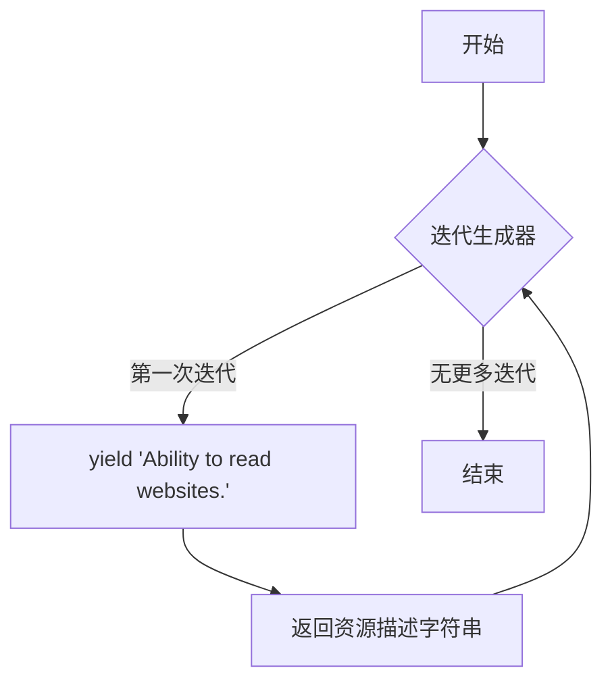

#### 带注释源码

```python
def get_resources(self) -> Iterator[str]:
    """向系统提供组件所具有的资源能力描述
    
    该方法实现了 DirectiveProvider 协议中的 get_resources 方法，
    用于声明当前 WebSeleniumComponent 组件能够读取网站内容。
    
    Yields:
        Iterator[str]: 包含资源能力描述的字符串迭代器
    """
    yield "Ability to read websites."
```


### `WebSeleniumComponent.get_commands`

该方法是WebSeleniumComponent类的命令提供者接口实现，用于向系统注册可用的Web浏览命令，目前仅暴露`read_webpage`命令供外部调用。

参数：无（除隐式参数`self`）

返回值：`Iterator[Command]`，返回一个命令迭代器，包含系统支持的命令列表（当前仅为`read_webpage`命令）

#### 流程图

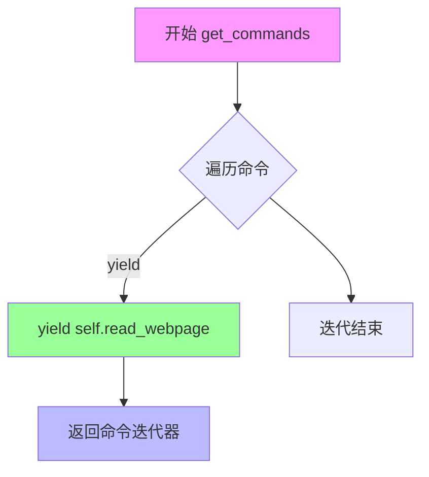

#### 带注释源码

```python
def get_commands(self) -> Iterator[Command]:
    """获取该组件提供的命令列表
    
    这是CommandProvider协议的实现方法，用于向系统注册
    当前组件支持的所有命令。
    
    Returns:
        Iterator[Command]: 命令迭代器，包含组件支持的所有命令
    """
    # yield语法使该方法成为一个生成器，返回一个迭代器
    # 每次迭代返回一个Command对象
    # 当前仅注册read_webpage命令，用于读取网页内容
    yield self.read_webpage
```


### `WebSeleniumComponent.read_webpage`

该方法是 WebSeleniumComponent 类的核心异步方法，用于浏览指定 URL 的网页并根据用户需求提取信息。它支持三种模式：获取原始网页内容、基于主题列表提取信息、或基于问题回答内容。通过 Selenium 打开浏览器、爬取文本和链接，然后利用 LLM 进行摘要或信息提取，最后返回格式化的结果给用户。

参数：

- `self`：`WebSeleniumComponent`，方法所属的类实例
- `url`：`str`，要访问的网页 URL
- `topics_of_interest`：`list[str] = []`，可选参数，用于指定需要从页面中提取的兴趣主题列表
- `get_raw_content`：`bool = False`，可选参数，设置为 True 时返回未经处理的网页原始内容
- `question`：`str = ""`，可选参数，用于指定需要用网页内容回答的问题

返回值：`str`，返回包含提取的信息、摘要或原始内容，以及相关链接的字符串

#### 流程图

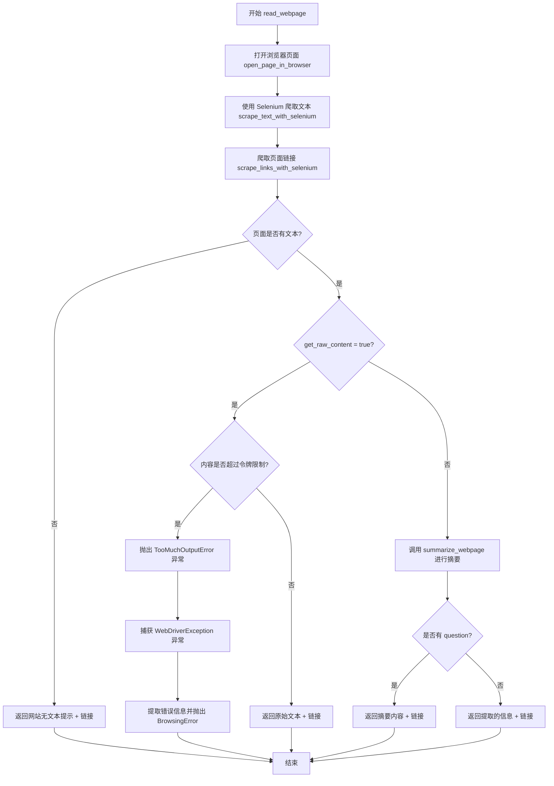

#### 带注释源码

```python
@command(
    ["read_webpage"],
    (
        "Read a webpage, and extract specific information from it."
        " You must specify either topics_of_interest,"
        " a question, or get_raw_content."
    ),
    {
        "url": JSONSchema(
            type=JSONSchema.Type.STRING,
            description="The URL to visit",
            required=True,
        ),
        "topics_of_interest": JSONSchema(
            type=JSONSchema.Type.ARRAY,
            items=JSONSchema(type=JSONSchema.Type.STRING),
            description=(
                "A list of topics about which you want to extract information "
                "from the page."
            ),
            required=False,
        ),
        "question": JSONSchema(
            type=JSONSchema.Type.STRING,
            description=(
                "A question you want to answer using the content of the webpage."
            ),
            required=False,
        ),
        "get_raw_content": JSONSchema(
            type=JSONSchema.Type.BOOLEAN,
            description=(
                "If true, the unprocessed content of the webpage will be returned. "
                "This consumes a lot of tokens, so use it with caution."
            ),
            required=False,
        ),
    },
)
@validate_url  # URL 验证装饰器
async def read_webpage(
    self,
    url: str,
    *,
    topics_of_interest: list[str] = [],
    get_raw_content: bool = False,
    question: str = "",
) -> str:
    """Browse a website and return the answer and links to the user

    Args:
        url (str): The url of the website to browse
        question (str): The question to answer using the content of the webpage

    Returns:
        str: The answer and links to the user and the webdriver
    """
    driver = None
    try:
        # 步骤1: 使用 Selenium 打开浏览器并加载页面
        driver = await self.open_page_in_browser(url)

        # 步骤2: 从页面中爬取文本内容
        text = self.scrape_text_with_selenium(driver)
        
        # 步骤3: 从页面中爬取链接
        links = self.scrape_links_with_selenium(driver, url)

        return_literal_content = True
        summarized = False
        
        # 步骤4: 检查页面是否有文本内容
        if not text:
            return f"Website did not contain any text.\n\nLinks: {links}"
        
        # 步骤5: 如果请求原始内容
        elif get_raw_content:
            # 检查内容长度是否超过限制
            if (
                output_tokens := self.llm_provider.count_tokens(
                    text, self.config.llm_name
                )
            ) > MAX_RAW_CONTENT_LENGTH:
                oversize_factor = round(output_tokens / MAX_RAW_CONTENT_LENGTH, 1)
                raise TooMuchOutputError(
                    f"Page content is {oversize_factor}x the allowed length "
                    "for `get_raw_content=true`"
                )
            # 返回原始文本和链接
            return text + (f"\n\nLinks: {links}" if links else "")
        else:
            # 步骤6: 使用 LLM 进行摘要或信息提取
            text = await self.summarize_webpage(
                text, question or None, topics_of_interest
            )
            return_literal_content = bool(question)
            summarized = True

        # 步骤7: 限制返回的链接数量
        if len(links) > LINKS_TO_RETURN:
            links = links[:LINKS_TO_RETURN]

        # 步骤8: 格式化返回内容
        text_fmt = f"'''{text}'''" if "\n" in text else f"'{text}'"
        links_fmt = "\n".join(f"- {link}" for link in links)
        return (
            f"Page content{' (summary)' if summarized else ''}:"
            if return_literal_content
            else "Answer gathered from webpage:"
        ) + f" {text_fmt}\n\nLinks:\n{links_fmt}"

    # 步骤9: 异常处理 - 捕获 Selenium WebDriver 异常
    except WebDriverException as e:
        # 这些错误通常很长且包含大量上下文，只取第一行
        msg = e.msg.split("\n")[0] if e.msg else str(e)
        if "net::" in msg:
            raise BrowsingError(
                "A networking error occurred while trying to load the page: %s"
                % re.sub(r"^unknown error: ", "", msg)
            )
        raise CommandExecutionError(msg)
    finally:
        # 步骤10: 确保关闭浏览器驱动
        if driver:
            driver.close()
```

#### 关键组件信息

| 组件名称 | 一句话描述 |
|---------|-----------|
| `WebSeleniumComponent` | 提供使用 Selenium 浏览网页和提取信息的命令组件 |
| `open_page_in_browser` | 使用 Selenium 打开浏览器并加载指定 URL 的方法 |
| `scrape_text_with_selenium` | 从浏览器 DOM 中提取文本内容的方法 |
| `scrape_links_with_selenium` | 从页面中提取并格式化超链接的方法 |
| `summarize_webpage` | 使用 LLM 对网页内容进行摘要或信息提取的异步方法 |
| `WebSeleniumConfiguration` | Web 浏览组件的配置模型类 |
| `BrowsingError` | 浏览网页时发生的自定义错误类型 |

#### 潜在的技术债务或优化空间

1. **异常处理不完整**: 仅捕获 `WebDriverException`，其他可能的异常（如网络超时、解析错误）未明确处理
2. **硬编码的等待时间**: 使用固定的 `await asyncio.sleep(2)` 等待页面加载，可考虑使用更智能的等待策略
3. **链接数量限制**: 简单截断链接列表而非智能筛选最重要的链接
4. **重复代码**: `scrape_text_with_selenium` 和 `scrape_links_with_selenium` 中都有移除 script 和 style 标签的逻辑，可提取为公共方法
5. **浏览器资源未完全释放**: 仅调用 `driver.close()` 而未调用 `driver.quit()`，可能导致浏览器进程残留

#### 其它项目

- **设计目标**: 提供一个通用的网页浏览和内容提取接口，支持多种浏览器和灵活的信息提取模式
- **约束**: 
  - 原始内容有 500 token 的输出限制
  - 最多返回 20 个链接
  - 必须指定 topics_of_interest、question 或 get_raw_content 之一
- **错误处理**: 
  - `BrowsingError`: 网络相关错误
  - `TooMuchOutputError`: 内容超过令牌限制
  - `CommandExecutionError`: 其他命令执行错误
- **数据流**: URL 输入 → Selenium 浏览器 → HTML 解析 → 文本/链接提取 → LLM 处理 → 格式化输出


### `WebSeleniumComponent.scrape_text_with_selenium`

该方法通过 Selenium WebDriver 获取浏览器当前页面的完整 HTML 内容，使用 BeautifulSoup 解析并清除脚本和样式标签，最后对文本进行清洗（去除空行和多余空格）后返回纯文本内容。

参数：

- `self`：`WebSeleniumComponent`，调用该方法的类实例本身
- `driver`：`WebDriver`，Selenium WebDriver 对象，代表要抓取的浏览器窗口

返回值：`str`，从网页中提取的纯文本内容

#### 流程图

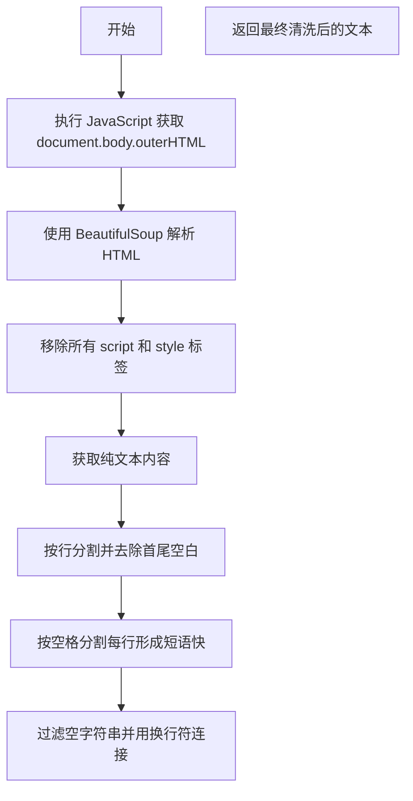

#### 带注释源码

```python
def scrape_text_with_selenium(self, driver: WebDriver) -> str:
    """Scrape text from a browser window using selenium

    Args:
        driver (WebDriver): A driver object representing
        the browser window to scrape

    Returns:
        str: the text scraped from the website
    """

    # 使用 JavaScript 获取浏览器 DOM 的完整 HTML 内容
    # document.body.outerHTML 会返回包含 <body> 标签及其所有子元素的完整 HTML
    page_source = driver.execute_script("return document.body.outerHTML;")
    
    # 使用 html.parser 解析器创建 BeautifulSoup 对象
    soup = BeautifulSoup(page_source, "html.parser")

    # 遍历所有 script 和 style 标签并从 DOM 中移除
    # 这些标签通常包含动态脚本或样式信息，对文本抓取无意义且可能干扰
    for script in soup(["script", "style"]):
        script.extract()

    # 获取处理后的所有纯文本内容
    text = soup.get_text()
    
    # 将文本按行分割，去除每行首尾的空白字符
    lines = (line.strip() for line in text.splitlines())
    
    # 对每行按两个空格分割成更小的短语块，进一步去除多余空白
    chunks = (phrase.strip() for line in lines for phrase in line.split("  "))
    
    # 过滤掉空字符串，用换行符连接所有有效文本块
    text = "\n".join(chunk for chunk in chunks if chunk)
    
    # 返回清洗后的纯文本
    return text
```


### `WebSeleniumComponent.scrape_links_with_selenium`

该方法用于从网页中提取所有超链接。它通过Selenium获取当前页面的HTML源码，使用BeautifulSoup解析并移除脚本和样式标签，然后调用专门的超链接提取和格式化函数来处理相对URL并返回格式化的链接列表。

参数：

- `driver`：`WebDriver`，Selenium WebDriver实例，表示要从中抓取链接的浏览器窗口
- `base_url`：`str`，用于解析相对链接的基础URL

返回值：`list[str]`，从网页中抓取并格式化后的链接列表

#### 流程图

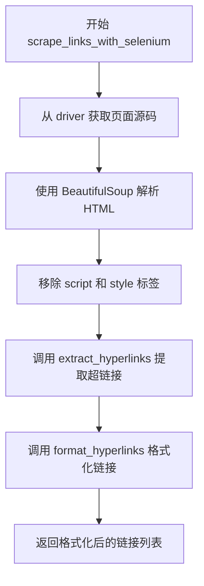

#### 带注释源码

```python
def scrape_links_with_selenium(self, driver: WebDriver, base_url: str) -> list[str]:
    """Scrape links from a website using selenium

    Args:
        driver (WebDriver): A driver object representing
        the browser window to scrape
        base_url (str): The base URL to use for resolving relative links

    Returns:
        List[str]: The links scraped from the website
    """
    # 从 Selenium WebDriver 获取当前页面的 HTML 源码
    page_source = driver.page_source
    
    # 使用 BeautifulSoup 解析 HTML，html.parser 是 Python 内置的解析器
    soup = BeautifulSoup(page_source, "html.parser")

    # 遍历移除所有 script 和 style 标签及其内容
    # 这些标签通常不包含有用的链接，且可能影响解析结果
    for script in soup(["script", "style"]):
        script.extract()

    # 使用专门的函数从 soup 对象中提取超链接
    # 该函数会根据 base_url 将相对路径转换为绝对路径
    hyperlinks = extract_hyperlinks(soup, base_url)

    # 格式化超链接列表并返回
    return format_hyperlinks(hyperlinks)
```


### `WebSeleniumComponent.open_page_in_browser`

打开一个浏览器窗口并使用 Selenium 加载指定的网页，根据配置选择合适的浏览器类型（Chrome、Firefox、Edge 或 Safari），设置用户代理、代理服务器、无头模式等选项，加载 Chrome 扩展（Cookie Wall Squasher 和 Adblocker），并等待页面完全加载后返回 WebDriver 对象。

参数：

- `self`：`WebSeleniumComponent`，隐式的类实例参数
- `url`：`str`，要加载的网页 URL

返回值：`WebDriver`，表示浏览器窗口的驱动程序对象，用于后续的网页操作

#### 流程图

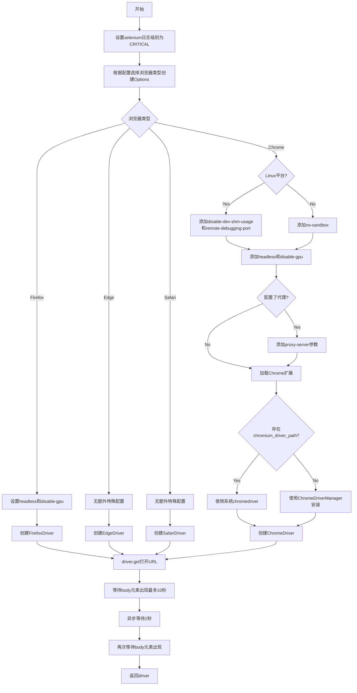

#### 带注释源码

```python
async def open_page_in_browser(self, url: str) -> WebDriver:
    """Open a browser window and load a web page using Selenium

    Params:
        url (str): The URL of the page to load
        config (Config): The applicable application configuration

    Returns:
        driver (WebDriver): A driver object representing
        the browser window to scrape
    """
    # 设置selenium日志级别为CRITICAL，减少日志输出
    logging.getLogger("selenium").setLevel(logging.CRITICAL)

    # 定义支持的浏览器选项类型映射
    options_available: dict[str, Type[BrowserOptions]] = {
        "chrome": ChromeOptions,
        "edge": EdgeOptions,
        "firefox": FirefoxOptions,
        "safari": SafariOptions,
    }

    # 根据配置创建对应浏览器的Options对象
    options: BrowserOptions = options_available[self.config.web_browser]()
    # 添加用户代理配置
    options.add_argument(f"user-agent={self.config.user_agent}")

    # 根据不同浏览器类型创建对应的WebDriver
    if isinstance(options, FirefoxOptions):
        # Firefox特殊处理：设置headless模式
        if self.config.headless:
            options.headless = True  # type: ignore
            options.add_argument("--disable-gpu")
        # 使用GeckoDriverManager自动管理驱动
        driver = FirefoxDriver(
            service=GeckoDriverService(GeckoDriverManager().install()),
            options=options,
        )
    elif isinstance(options, EdgeOptions):
        # Edge浏览器使用EdgeDriverManager
        driver = EdgeDriver(
            service=EdgeDriverService(EdgeDriverManager().install()),
            options=options,
        )
    elif isinstance(options, SafariOptions):
        # Safari需要用户在系统中进行额外配置
        # See https://developer.apple.com/documentation/webkit/testing_with_webdriver_in_safari
        driver = SafariDriver(options=options)
    elif isinstance(options, ChromeOptions):
        # Chrome浏览器特殊处理
        # Linux平台需要额外的参数来处理容器环境
        if platform == "linux" or platform == "linux2":
            options.add_argument("--disable-dev-shm-usage")
            options.add_argument("--remote-debugging-port=9222")

        # 添加no-sandbox参数（Docker环境需要）
        options.add_argument("--no-sandbox")
        
        # 如果配置了无头模式
        if self.config.headless:
            options.add_argument("--headless=new")
            options.add_argument("--disable-gpu")

        # 如果配置了代理服务器
        if self.config.selenium_proxy:
            options.add_argument(f"--proxy-server={self.config.selenium_proxy}")

        # 加载Chrome扩展（Cookie Wall Squasher和Adblocker）
        self._sideload_chrome_extensions(options, self.data_dir / "assets" / "crx")

        # 检查是否存在系统的chromedriver
        if (chromium_driver_path := Path("/usr/bin/chromedriver")).exists():
            chrome_service = ChromeDriverService(str(chromium_driver_path))
        else:
            try:
                # 尝试自动下载安装chromedriver
                chrome_driver = ChromeDriverManager().install()
            except AttributeError as e:
                if "'NoneType' object has no attribute 'split'" in str(e):
                    # ChromeDriverManager的已知问题：未安装Chrome浏览器
                    logger.critical(
                        "Connecting to browser failed:"
                        " is Chrome or Chromium installed?"
                    )
                raise
            chrome_service = ChromeDriverService(chrome_driver)
        
        # 创建ChromeDriver
        driver = ChromeDriver(service=chrome_service, options=options)

    # 使用driver打开指定URL
    driver.get(url)

    # 等待页面加载完成（等待body元素出现）
    # 先等待一次，让cookiewall有时间消失
    WebDriverWait(driver, 10).until(
        EC.presence_of_element_located((By.TAG_NAME, "body"))
    )
    # 等待2秒
    await asyncio.sleep(2)
    # 再次等待确保页面完全加载
    WebDriverWait(driver, 10).until(
        EC.presence_of_element_located((By.TAG_NAME, "body"))
    )

    return driver
```


### `WebSeleniumComponent._sideload_chrome_extensions`

该方法负责下载并加载 Chrome 浏览器扩展（Cookie Wall Squasher 和 AdBlocker），确保在浏览网页时自动应用这些扩展以提升用户体验。

参数：

- `self`：`WebSeleniumComponent`，类的实例本身
- `options`：`ChromeOptions`，Chrome 浏览器选项对象，用于添加扩展
- `dl_folder`：`Path`，下载 CRX 扩展文件的目标文件夹路径

返回值：`None`，无返回值（直接修改 `options` 对象，添加扩展路径）

#### 流程图

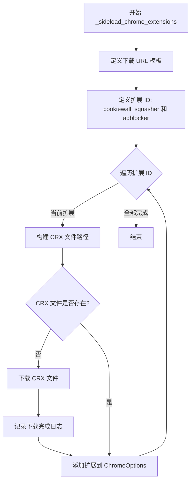

#### 带注释源码

```python
def _sideload_chrome_extensions(
    self, options: ChromeOptions, dl_folder: Path
) -> None:
    """下载并加载 Chrome 扩展（Cookie Wall Squasher 和 AdBlocker）

    该方法确保在启动 Chrome 浏览器时自动加载指定的扩展程序，
    用于去除 Cookie 许可墙和广告拦截。

    Args:
        options: ChromeOptions 实例，用于添加扩展
        dl_folder: 存放 CRX 扩展文件的目录路径

    Returns:
        None: 无返回值，扩展直接添加到 options 对象中
    """
    # Google Chrome 扩展下载 URL 模板
    crx_download_url_template = "https://clients2.google.com/service/update2/crx?response=redirect&prodversion=99.0&acceptformat=crx3&x=id%3D{crx_id}%26installsource%3Dondemand%26uc"  # noqa
    # Cookie Wall Squasher 扩展 ID - 用于自动关闭 Cookie 许可弹窗
    cookiewall_squasher_crx_id = "edibdbjcniadpccecjdfdjjppcpchdlm"
    # AdBlocker 扩展 ID - 用于拦截网页广告
    adblocker_crx_id = "cjpalhdlnbpafiamejdnhcphjbkeiagm"

    # 确保下载目录存在，如不存在则创建（包含父目录）
    dl_folder.mkdir(parents=True, exist_ok=True)

    # 遍历两个扩展 ID，依次下载并添加
    for crx_id in (cookiewall_squasher_crx_id, adblocker_crx_id):
        # 构建 CRX 文件的完整路径
        crx_path = dl_folder / f"{crx_id}.crx"
        # 检查 CRX 文件是否已存在，避免重复下载
        if not crx_path.exists():
            # 记录下载日志
            logger.debug(f"Downloading CRX {crx_id}...")
            # 使用 URL 模板格式化完整的下载链接
            crx_download_url = crx_download_url_template.format(crx_id=crx_id)
            # 使用 urlretrieve 下载 CRX 文件到本地
            urlretrieve(crx_download_url, crx_path)
            # 记录下载完成日志
            logger.debug(f"Downloaded {crx_path.name}")
        # 将 CRX 扩展路径添加到 Chrome 选项中
        options.add_extension(str(crx_path))
```


### `WebSeleniumComponent.summarize_webpage`

该方法是一个异步函数，用于使用 LLM（语言模型）对网页文本内容进行摘要或信息提取。它根据是否提供了感兴趣的主题（topics_of_interest）来选择不同的处理方式：如果有主题，则从文本中提取与这些主题相关的信息；否则，根据问题（question）对文本进行摘要。

参数：

- `text`：`str`，需要摘要或提取信息的原始网页文本内容
- `question`：`str | None`，一个可选的问题，用于指导 LLM 从文本中提取答案
- `topics_of_interest`：`list[str]`，一个可选的兴趣主题列表，用于从文本中提取与这些主题相关的信息

返回值：`str`，根据请求返回提取的信息（以项目符号格式）或文本摘要

#### 流程图

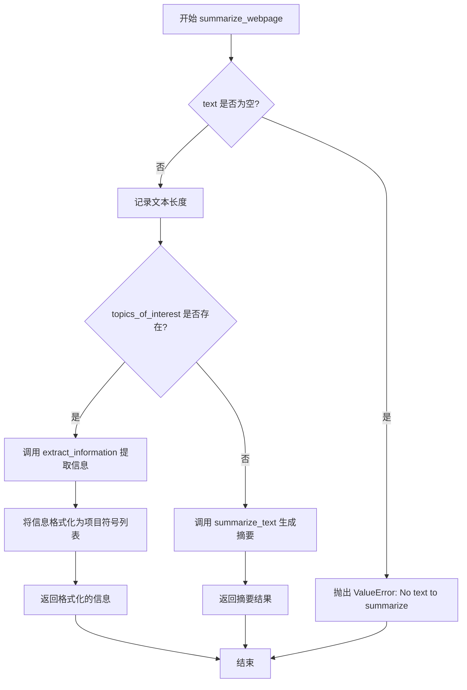

#### 带注释源码

```python
async def summarize_webpage(
    self,
    text: str,
    question: str | None,
    topics_of_interest: list[str],
) -> str:
    """Summarize text using the OpenAI API

    Args:
        url (str): The url of the text
        text (str): The text to summarize
        question (str): The question to ask the model
        driver (WebDriver): The webdriver to use to scroll the page

    Returns:
        str: The summary of the text
    """
    # 检查文本是否为空，如果为空则抛出 ValueError 异常
    if not text:
        raise ValueError("No text to summarize")

    # 获取并记录文本长度，用于调试目的
    text_length = len(text)
    logger.debug(f"Web page content length: {text_length} characters")

    # 初始化结果变量
    result = None
    information = None
    
    # 根据是否有感兴趣的主题来决定处理方式
    if topics_of_interest:
        # 如果有指定主题，调用 extract_information 提取相关信息
        information = await extract_information(
            text,
            topics_of_interest=topics_of_interest,
            llm_provider=self.llm_provider,
            model_name=self.config.llm_name,
            spacy_model=self.config.browse_spacy_language_model,
        )
        # 将提取的信息格式化为项目符号列表并返回
        return "\n".join(f"* {i}" for i in information)
    else:
        # 如果没有指定主题，调用 summarize_text 生成摘要
        result, _ = await summarize_text(
            text,
            question=question,
            llm_provider=self.llm_provider,
            model_name=self.config.llm_name,
            spacy_model=self.config.browse_spacy_language_model,
        )
        # 返回生成的摘要
        return result
```

## 关键组件


### WebSeleniumConfiguration

Pydantic配置模型，定义WebSeleniumComponent的所有可配置参数，包括LLM模型名称、浏览器类型、是否无头模式、用户代理、Spacy语言模型和代理设置。

### WebSeleniumComponent

核心组件类，继承DirectiveProvider、CommandProvider和ConfigurableComponent，提供使用Selenium浏览网页的命令能力，管理LLM Provider和数据目录的注入。

### read_webpage

异步命令方法，作为主要入口点，接收URL和查询参数，调用浏览器打开页面，抓取文本和链接，根据参数决定返回原始内容还是摘要内容，并处理各种异常情况。

### scrape_text_with_selenium

使用Selenium执行JavaScript获取DOM的outerHTML，通过BeautifulSoup解析并提取文本内容，同时移除script和style标签，最后清理空白字符返回纯文本。

### scrape_links_with_selenium

使用BeautifulSoup解析页面源码，提取超链接并使用format_hyperlinks格式化，支持相对链接转换为绝对链接，返回链接列表。

### open_page_in_browser

异步方法，负责根据配置创建不同浏览器的WebDriver实例（Chrome、Firefox、Edge、Safari），设置用户代理、无头模式、代理等参数，下载并加载Chrome扩展（Cookie墙压制和广告拦截），等待页面加载完成。

### _sideload_chrome_extensions

私有方法，从Google服务器下载CRX格式的Chrome扩展（Cookie Wall Squasher和AdBlocker），检查本地是否存在，不存在则下载到指定目录，然后添加到Chrome选项中。

### summarize_webpage

异步方法，使用LLM Provider和Spacy模型对网页文本进行 summarization 或信息提取，支持按主题兴趣提取信息或回答具体问题。

### BrowsingError

自定义异常类，继承CommandExecutionError，用于标识浏览网页过程中发生的错误。


## 问题及建议


### 已知问题

- **可变默认参数**：方法参数中使用可变默认参数 `topics_of_interest: list[str] = []`，这会导致列表在多次调用间共享，容易引发意外的副作用
- **资源未完全释放**：`finally` 块中仅调用 `driver.close()`，未调用 `driver.quit()`，可能导致浏览器进程未能完全终止
- **重复解析HTML**：`scrape_text_with_selenium` 和 `scrape_links_with_selenium` 方法分别独立解析页面，各自创建 BeautifulSoup 对象，导致重复计算
- **硬编码配置**：CRX扩展下载URL、cookie墙压缩器ID、广告拦截器ID等均硬编码，且扩展版本无更新检查机制
- **异常处理不完整**：`open_page_in_browser` 方法中捕获 `AttributeError` 时仅处理特定错误消息，其他 `AttributeError` 仍会直接抛出
- **页面加载无超时**：使用 Selenium 打开页面时未设置页面加载超时时间，可能导致长时间阻塞
- **无重试机制**：网络请求或页面加载失败时缺乏重试逻辑
- **使用过时解析器**：`html.parser` 解析速度较 `lxml` 慢，且容错性较差
- **配置默认值过时**：默认User Agent为2020年版本（Chrome/83），可能导致现代网站行为异常

### 优化建议

- 将可变默认参数改为 `None` 并在函数内创建新列表，如 `topics_of_interest: Optional[list[str]] = None` 后 `if topics_of_interest is None: topics_of_interest = []`
- 将 `driver.close()` 改为 `driver.quit()` 或使用 `try-finally` 确保 `quit()` 被调用
- 合并 `scrape_text_with_selenium` 和 `scrape_links_with_selenium` 为单一方法，一次解析同时返回文本和链接
- 将 CRX ID、下载URL模板等提取为配置常量，并添加扩展版本检查或定期更新机制
- 为 `driver.get(url)` 添加显式超时：`driver.set_page_load_timeout(30)`
- 添加重试装饰器或逻辑处理临时性网络故障
- 考虑使用 `lxml` 作为 BeautifulSoup 的解析器以提升性能
- 更新默认 User Agent 为当前版本，或从配置文件动态读取

## 其它


### 设计目标与约束

该组件的核心设计目标是提供一个通用的网页浏览和内容提取能力，使Agent能够访问互联网并从中获取信息。主要约束包括：1）支持多浏览器（Chrome、Firefox、Safari、Edge）但优先Chrome；2）必须通过LLM处理和总结内容以控制token消耗；3）需要处理各种网页结构（动态加载、Cookie墙等）；4）必须在无头模式下运行以支持服务器环境。

### 错误处理与异常设计

定义了`BrowsingError`异常类继承自`CommandExecutionError`，专门用于浏览相关错误。错误处理策略包括：1）网络错误提取并简化错误信息，移除冗长的上下文；2）WebDriver异常处理，区分不同错误类型（网络错误、浏览器错误等）；3）内容过长时抛出`TooMuchOutputError`；4）所有资源（driver）必须在finally块中正确关闭。异常消息遵循用户友好的描述，避免暴露内部实现细节。

### 数据流与状态机

数据流遵循以下路径：用户调用`read_webpage`命令 → URL验证 → 打开浏览器（`open_page_in_browser`）→ 抓取文本和链接（`scrape_text_with_selenium`、`scrape_links_with_selenium`）→ 内容处理（根据参数选择原始内容返回或LLM总结）→ 格式化输出并返回。状态转换包括：初始状态 → 浏览器打开 → 页面加载 → 内容抓取 → 内容处理 → 浏览器关闭 → 返回结果。

### 外部依赖与接口契约

主要依赖包括：1）Selenium WebDriver（多种浏览器支持）；2）webdriver_manager（自动管理驱动下载）；3）BeautifulSoup（HTML解析）；4）LLM Provider（OpenAI等多模型支持）；5）内容处理模块（extract_hyperlinks、format_hyperlinks、extract_information、summarize_text）。接口契约：`read_webpage`接受url、topics_of_interest、question、get_raw_content参数，返回格式化的文本和链接列表；配置通过`WebSeleniumConfiguration` Pydantic模型定义。

### 安全性考虑

1）URL验证：使用`@validate_url`装饰器确保输入URL合法性；2）代理支持：配置项`selenium_proxy`允许通过代理访问；3）用户代理伪装：可配置User-Agent避免被检测；4）扩展加载：Cookiewall Squasher和Adblocker扩展用于处理Cookie墙；5）敏感信息：配置文件不包含硬编码凭据。

### 性能考虑

1）内容长度限制：MAX_RAW_CONTENT_LENGTH=500 tokens，超过则要求使用总结模式；2）链接数量限制：LINKS_TO_RETURN=20条；3）页面加载优化：双重等待机制（10秒超时+2秒延迟）确保动态内容加载完成；4）浏览器资源：确保driver正确关闭避免资源泄漏；5）Linux特殊处理：禁用dev-shm使用以避免容器环境问题。

### 配置文件格式

配置通过`WebSeleniumConfiguration` Pydantic模型定义，支持以下配置项：llm_name（默认GPT-3）、web_browser（默认chrome）、headless（默认true）、user_agent（默认Chrome 83）、browse_spacy_language_model（默认en_core_web_sm）、selenium_proxy（可选）。配置可通过构造函数注入或使用默认值。

### 测试策略建议

1）单元测试：测试配置验证、URL验证、文本抓取逻辑；2）集成测试：测试各浏览器启动和页面加载；3）Mock测试：Mock WebDriver和LLM Provider；4）错误场景测试：网络错误、无内容页面、超大内容等；5）跨平台测试：Linux、Windows、macOS环境差异处理。

### 部署注意事项

1）Chrome/Chromium安装：Linux环境需确保Chrome或Chromium已安装；2）驱动兼容性：webdriver_manager自动处理但可能失败需提供fallback；3）权限问题：Linux可能需要--no-sandbox选项；4）资源限制：容器环境需配置足够内存和CPU；5）扩展路径：crx文件夹路径需正确配置。

### 版本兼容性与依赖

1）Python版本：建议3.9+；2）Selenium版本：4.x系列；3）浏览器版本：Chrome 83+、Firefox 78+、Edge 79+、Safari 14+；4）webdriver_manager：处理驱动版本匹配；5）LLM Provider：支持OpenAI、Anthropic等多provider；6）spacy：用于文本分块处理。


    