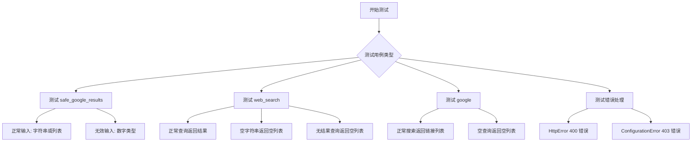
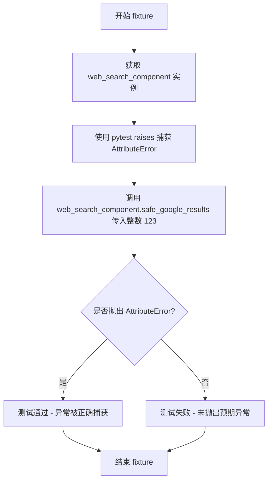
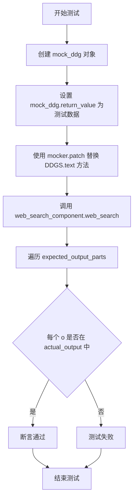
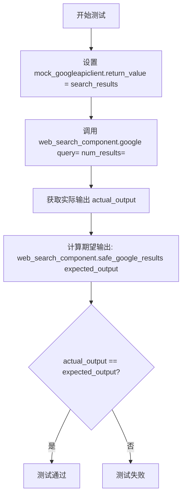
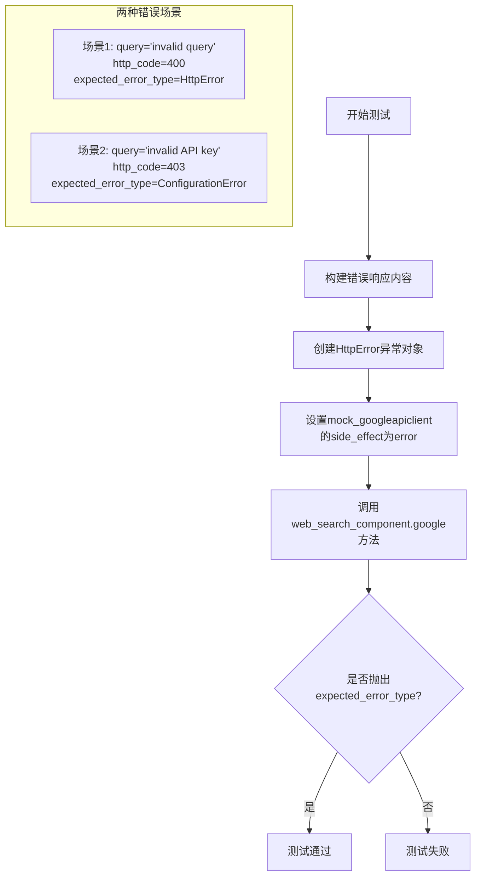
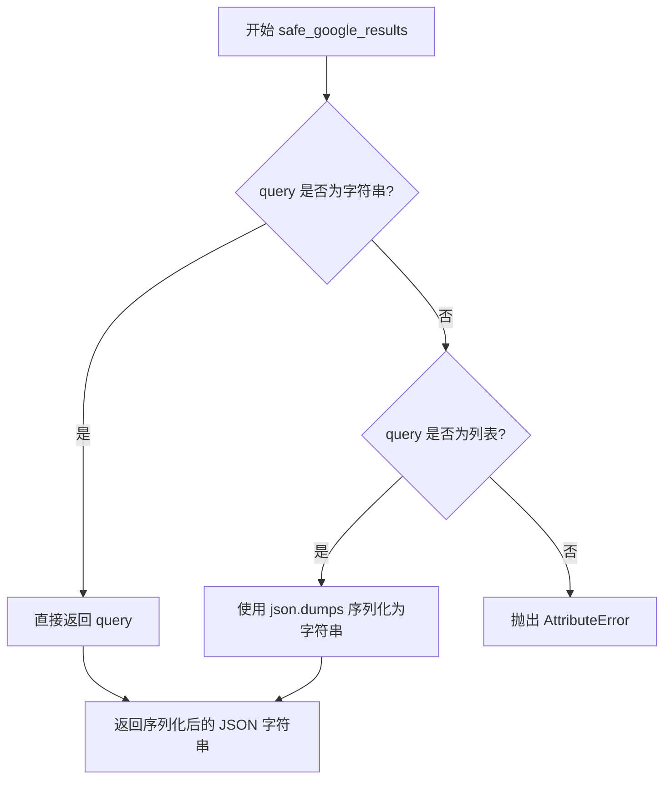
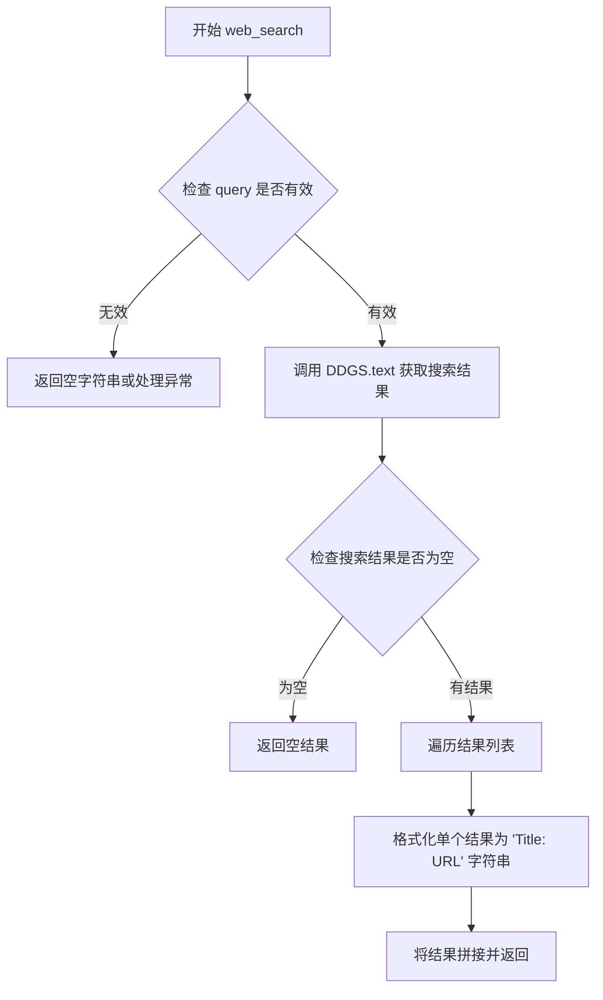

# `.\AutoGPT\classic\forge\forge\components\web\test_search.py` 详细设计文档

这是一个WebSearchComponent组件的单元测试文件，测试了三种搜索功能：安全结果处理、DuckDuckGo网页搜索和谷歌官方搜索，并覆盖了正常输入、无效输入和错误处理等场景。

## 整体流程



## 类结构

```
WebSearchComponent (被测组件)
├── safe_google_results (结果安全处理方法)
├── web_search (DuckDuckGo搜索方法)
└── google (谷歌官方搜索方法)
```

## 全局变量及字段


### `pytest`
    
Python标准测试框架，用于编写和运行单元测试

类型：`测试框架`
    


### `googleapiclient.errors.HttpError`
    
谷歌API HTTP错误异常，当Google API返回HTTP错误时抛出

类型：`异常类`
    


### `httplib2.Response`
    
HTTP响应对象，用于表示HTTP响应状态和内容

类型：`类`
    


### `pydantic.SecretStr`
    
敏感字符串类型，用于安全存储和处理敏感信息如API密钥

类型：`数据类型`
    


### `forge.utils.exceptions.ConfigurationError`
    
配置错误异常，当配置参数缺失或无效时抛出

类型：`异常类`
    


### `DDGS`
    
DuckDuckGo搜索库，提供非官方搜索引擎搜索功能

类型：`类`
    


### `WebSearchComponent.config.google_api_key`
    
谷歌API密钥，用于访问Google Custom Search API

类型：`SecretStr`
    


### `WebSearchComponent.config.google_custom_search_engine_id`
    
谷歌自定义搜索引擎ID，用于指定搜索范围

类型：`SecretStr`
    
    

## 全局函数及方法


### `test_safe_google_results`

这是一个 pytest fixture，用于测试 `WebSearchComponent` 类的 `safe_google_results` 方法对字符串和列表两种输入类型的处理是否正确。

参数：

- `query`：`str | list`，查询参数，可以是字符串或字符串列表
- `expected_output`：`str`，期望的输出结果，列表会被转换为 JSON 字符串
- `web_search_component`：`WebSearchComponent`，WebSearchComponent 实例，已配置测试用的 API Key 和 Search Engine ID

返回值：`None`，该 fixture 用于执行测试断言，不返回值

#### 流程图

```mermaid
flowchart TD
    A[开始测试] --> B{参数化测试}
    B --> C1[输入: query='test', expected_output='test']
    C1 --> D1[调用 safe_google_results]
    D1 --> E1[断言结果类型是 str]
    E1 --> F1[断言结果等于 'test']
    
    B --> C2[输入: query=['test1', 'test2'], expected_output='["test1", "test2"]']
    C2 --> D2[调用 safe_google_results]
    D2 --> E2[断言结果类型是 str]
    E2 --> F2[断言结果等于 '["test1", "test2"]']
    
    F1 --> G[测试通过]
    F2 --> G
```

#### 带注释源码

```python
@pytest.fixture
def test_safe_google_results(
    query, expected_output, web_search_component: WebSearchComponent
):
    """
    测试 safe_google_results 方法的参数化 fixture
    
    参数:
        query: 输入查询，可以是字符串或列表
        expected_output: 期望的输出结果
        web_search_component: WebSearchComponent 实例
    """
    # 调用被测方法 safe_google_results 处理输入查询
    result = web_search_component.safe_google_results(query)
    
    # 断言返回结果是字符串类型
    assert isinstance(result, str)
    
    # 断言返回结果与期望输出相等
    assert result == expected_output
```

#### 关联的测试数据

该 fixture 配合 `@pytest.mark.parametrize` 使用，测试两套数据：

| query | expected_output |
|-------|------------------|
| `"test"` | `"test"` |
| `["test1", "test2"]` | `'["test1", "test2"]'` |

这表明 `safe_google_results` 方法需要：
1. 直接返回字符串输入
2. 将列表输入转换为 JSON 字符串格式


### `test_safe_google_results_invalid_input`

这是一个测试夹具（pytest fixture），用于验证 `WebSearchComponent` 类的 `safe_google_results` 方法在接收无效输入（非字符串类型参数）时能否正确抛出 `AttributeError` 异常。

参数：

- `web_search_component`：`WebSearchComponent`，WebSearchComponent 实例，通过依赖注入的 fixture 提供，用于调用待测试的 `safe_google_results` 方法

返回值：`None`，作为 pytest fixture 本身不直接返回值，而是通过 `pytest.raises` 上下文管理器验证异常抛出

#### 流程图



#### 带注释源码

```python
@pytest.fixture
def test_safe_google_results_invalid_input(web_search_component: WebSearchComponent):
    """
    测试 safe_google_results 方法对无效输入的处理
    
    测试场景：
    - 当传入整数类型（123）作为 query 参数时
    - 预期行为：方法应抛出 AttributeError 异常
    
    参数:
        web_search_component: WebSearchComponent 实例，已配置好测试所需的配置信息
                             （包含 google_api_key 和 google_custom_search_engine_id）
    
    返回:
        None：此 fixture 用于验证异常抛出，不返回具体值
    
    验证逻辑：
        使用 pytest.raises 上下文管理器捕获 AttributeError
        如果方法正确抛出异常，则测试通过
        如果方法未抛出异常或抛出其他类型异常，则测试失败
    """
    # 使用 pytest.raises 期望捕获 AttributeError 异常
    with pytest.raises(AttributeError):
        # 调用 safe_google_results 并传入无效输入（整数类型）
        # type: ignore 用于告诉类型检查器忽略类型不匹配的警告
        web_search_component.safe_google_results(123)  # type: ignore
```


### `test_google_search`

该测试函数用于验证 `WebSearchComponent` 类的 `web_search` 方法在使用 DuckDuckGo (DDGS) 搜索时的正确性，通过模拟 DDGS.text 方法并验证搜索结果是否包含预期内容。

参数：

- `query`：`str` 或 `list`，搜索查询词，可以是单个字符串或字符串列表
- `num_results`：`int`，请求返回的结果数量
- `expected_output_parts`：`tuple`，预期输出中应包含的字符串元组，用于验证结果
- `return_value`：`list`，模拟的 DDGS 返回结果列表，每个元素包含 title 和 href 字段
- `mocker`：`pytest.mocker.Mocker`，pytest-mock 提供的模拟对象，用于创建 mock
- `web_search_component`：`WebSearchComponent`，被测试的 WebSearchComponent 实例

返回值：`None`，测试函数无返回值，通过断言验证功能

#### 流程图



#### 带注释源码

```python
@pytest.mark.parametrize(
    "query, num_results, expected_output_parts, return_value",
    [
        # 测试用例1: 正常搜索，返回一个结果
        (
            "test",                          # query: 搜索关键词
            1,                               # num_results: 请求结果数量
            ("Result 1", "https://example.com/result1"),  # expected_output_parts: 预期输出包含的内容
            [{"title": "Result 1", "href": "https://example.com/result1"}],  # return_value: 模拟的DDGS返回值
        ),
        # 测试用例2: 空字符串查询
        ("", 1, (), []),  # query为空, 期望无输出, 返回空列表
        # 测试用例3: 无结果搜索
        ("no results", 1, (), []),  # 查询无结果, 期望无输出, 返回空列表
    ],
)
def test_google_search(
    query,                          # 搜索查询词，类型为 str 或 list
    num_results,                    # 请求的返回结果数量
    expected_output_parts,          # 预期输出中应包含的字符串元组
    return_value,                   # 模拟的 DuckDuckGo 返回结果
    mocker,                         # pytest-mock 的 mocker 对象，用于创建 mock
    web_search_component: WebSearchComponent,  # 被测试的 WebSearchComponent 实例
):
    # 创建 mock 对象用于模拟 DDGS.text 方法的行为
    mock_ddg = mocker.Mock()
    # 设置 mock 的返回值，即模拟 DuckDuckGo 返回的搜索结果
    mock_ddg.return_value = return_value

    # 使用 mocker.patch 替换 forge.components.web.search.DDGS.text 方法
    # 这样实际调用时不会真正访问 DuckDuckGo API
    mocker.patch("forge.components.web.search.DDGS.text", mock_ddg)
    
    # 调用被测试组件的 web_search 方法，执行搜索
    actual_output = web_search_component.web_search(query, num_results=num_results)
    
    # 遍历预期输出的每个部分，验证是否包含在实际输出中
    for o in expected_output_parts:
        assert o in actual_output
```


### `test_google_official_search`

该测试函数用于验证 `WebSearchComponent` 类的 `google` 方法（谷歌官方搜索功能）的正确性，通过模拟 Google API 客户端的返回值，检查搜索结果的处理是否符合预期。

参数：

- `query`：`str`，搜索查询字符串
- `num_results`：`int`，期望返回的结果数量
- `expected_output`：`list`，期望的搜索结果输出列表
- `search_results`：`list`，从 Google API 模拟返回的搜索结果列表
- `mock_googleapiclient`：`Mock`，pytest-mock 提供的模拟 Google API 客户端的 fixture
- `web_search_component`：`WebSearchComponent`，被测试的 WebSearchComponent 实例

返回值：`None`，测试函数无返回值，通过 pytest 断言验证结果

#### 流程图



#### 带注释源码

```python
@pytest.mark.parametrize(
    "query, num_results, search_results, expected_output",
    [
        # 正常搜索场景：返回3条结果
        (
            "test",  # query: 搜索关键词
            3,       # num_results: 请求的结果数量
            [        # search_results: 模拟Google API返回的结果
                {"link": "http://example.com/result1"},
                {"link": "http://example.com/result2"},
                {"link": "http://example.com/result3"},
            ],
            [        # expected_output: 期望的输出列表
                "http://example.com/result1",
                "http://example.com/result2",
                "http://example.com/result3",
            ],
        ),
        # 空查询场景：返回空列表
        ("", 3, [], []),
    ],
)
def test_google_official_search(
    query,                      # str: 搜索查询字符串
    num_results,                # int: 期望返回的结果数量
    expected_output,            # list: 期望的输出结果列表
    search_results,             # list: 模拟Google API返回的搜索结果
    mock_googleapiclient,       # Mock: 模拟googleapiclient的fixture
    web_search_component: WebSearchComponent,  # WebSearchComponent: 被测试组件实例
):
    """测试Google官方搜索功能的正常场景"""
    
    # 设置mock返回值：当调用google方法时，返回模拟的搜索结果
    mock_googleapiclient.return_value = search_results
    
    # 调用被测试的google方法，执行实际搜索
    actual_output = web_search_component.google(query, num_results=num_results)
    
    # 验证实际输出与期望输出是否一致
    # 使用safe_google_results对期望输出进行格式化处理后比较
    assert actual_output == web_search_component.safe_google_results(expected_output)
```


### `test_google_official_search_errors`

该测试函数用于验证 Google 官方搜索组件在遇到不同 HTTP 错误时的异常处理行为，包括无效查询（HTTP 400）和无效 API 密钥（HTTP 403）场景，确保组件能正确捕获并抛出预期的自定义异常或 HTTP 异常。

参数：

- `query`：`str`，搜索查询字符串，用于执行 Google 搜索
- `num_results`：`int`，期望返回的搜索结果数量
- `expected_error_type`：`type`，期望抛出的异常类型（HttpError 或 ConfigurationError）
- `mock_googleapiclient`：`Mock`，通过 mocker 模拟的 Google API 客户端的 `cse().list().execute().get` 方法
- `http_code`：`int`，模拟的 HTTP 响应状态码（400 或 403）
- `error_msg`：`str`，模拟的错误消息内容
- `web_search_component`：`WebSearchComponent`，Web 搜索组件实例，包含配置和搜索方法

返回值：`None`，测试函数通过 `pytest.raises` 上下文管理器验证异常抛出，不返回具体值

#### 流程图



#### 带注释源码

```python
@pytest.mark.parametrize(
    "query, num_results, expected_error_type, http_code, error_msg",
    [
        # 场景1：无效查询，HTTP 400 错误，应抛出 HttpError
        (
            "invalid query",
            3,
            HttpError,
            400,
            "Invalid Value",
        ),
        # 场景2：无效 API 密钥，HTTP 403 错误，应抛出 ConfigurationError
        (
            "invalid API key",
            3,
            ConfigurationError,
            403,
            "invalid API key",
        ),
    ],
)
def test_google_official_search_errors(
    query,                      # str: 搜索查询字符串
    num_results,                # int: 请求的结果数量
    expected_error_type,        # type: 期望抛出的异常类型
    mock_googleapiclient,        # Mock: 模拟的Google API客户端
    http_code,                  # int: HTTP错误码
    error_msg,                  # str: 错误消息
    web_search_component: WebSearchComponent,  # WebSearchComponent: 搜索组件实例
):
    # 构建Google API返回的错误响应内容，包含错误码、消息和原因
    response_content = {
        "error": {"code": http_code, "message": error_msg, "reason": "backendError"}
    }
    
    # 创建HttpError异常对象，模拟Google API返回的HTTP错误
    # resp: 模拟的HTTP响应对象，包含状态码和原因
    # content: 错误响应内容的JSON编码字节串
    # uri: 触发错误的请求URI
    error = HttpError(
        resp=Response({"status": http_code, "reason": error_msg}),
        content=str.encode(json.dumps(response_content)),
        uri="https://www.googleapis.com/customsearch/v1?q=invalid+query&cx",
    )

    # 将mock_googleapiclient的side_effect设置为error
    # 这样当调用google方法时，会触发我们设置的HttpError异常
    mock_googleapiclient.side_effect = error
    
    # 使用pytest.raises验证google方法是否抛出预期的异常类型
    # 如果抛出的异常类型与expected_error_type匹配，测试通过
    with pytest.raises(expected_error_type):
        web_search_component.google(query, num_results=num_results)
```


### `web_search_component`

这是一个 pytest fixture，用于创建并配置 `WebSearchComponent` 实例，确保其在测试环境中具备必要的配置信息（Google API Key 和自定义搜索引擎 ID）。

参数：

- 此 fixture 无显式参数（隐式使用 pytest 的 `request` 参数）

返回值：`WebSearchComponent`，返回配置完成的 WebSearchComponent 实例，供测试用例使用

#### 流程图

```mermaid
flowchart TD
    A[开始] --> B[创建 WebSearchComponent 实例]
    B --> C{检查 google_api_key 是否为 None}
    C -->|是| D[设置 google_api_key 为 SecretStr('test')]
    C -->|否| E{检查 google_custom_search_engine_id 是否为 None}
    D --> E
    E -->|是| F[设置 google_custom_search_engine_id 为 SecretStr('test')]
    E -->|否| G[返回 component 实例]
    F --> G
    G --> H[结束]
```

#### 带注释源码

```python
@pytest.fixture
def web_search_component():
    """
    pytest fixture: 创建并配置 WebSearchComponent 实例
    
    该 fixture 用于测试环境中，创建 WebSearchComponent 并确保
    google_api_key 和 google_custom_search_engine_id 都有有效的测试值。
    
    Returns:
        WebSearchComponent: 配置完成的组件实例
    """
    # 创建 WebSearchComponent 实例
    component = WebSearchComponent()
    
    # 检查并设置 google_api_key
    # 如果未配置，则使用测试用的 SecretStr
    if component.config.google_api_key is None:
        component.config.google_api_key = SecretStr("test")
    
    # 检查并设置 google_custom_search_engine_id
    # 如果未配置，则使用测试用的 SecretStr
    if component.config.google_custom_search_engine_id is None:
        component.config.google_custom_search_engine_id = SecretStr("test")
    
    # 返回配置完成的组件供测试使用
    return component
```


### `mock_googleapiclient`

这是一个 pytest fixture，用于模拟 Google API 客户端的搜索功能，返回一个可配置的模拟搜索结果接口，以便在测试 `google_official_search` 和 `test_google_official_search_errors` 时使用。

参数：

- `mocker`：`pytest_mock.MockerFixture`，pytest-mock 提供的 mocker 对象，用于创建和管理模拟对象

返回值：`Mock`，模拟的 Google 搜索 API 的查询接口（`mock_service.cse().list().execute().get`），可配置其返回值或副作用

#### 流程图

```mermaid
flowchart TD
    A[开始 mock_googleapiclient] --> B[使用 mocker.patch 模拟 googleapiclient.discovery.build]
    B --> C[创建 mock_service = mocker.Mock]
    C --> D[设置 mock_build.return_value = mock_service]
    D --> E[返回 mock_service.cse().list().execute().get]
    E --> F[在测试中使用 mock_googleapiclient 配置返回值或错误]
    F --> G[测试完成后自动清理]
```

#### 带注释源码

```python
@pytest.fixture
def mock_googleapiclient(mocker):
    """
    测试夹具：模拟谷歌API客户端
    
    创建一个可配置的模拟搜索接口，用于测试 WebSearchComponent 的 
    google 方法（调用 Google Custom Search API）
    """
    # 使用 mocker.patch 模拟 googleapiclient.discovery.build 函数
    # 这样在测试中调用 WebSearchComponent.google 时不会真正调用 Google API
    mock_build = mocker.patch("googleapiclient.discovery.build")
    
    # 创建一个 Mock 对象作为模拟的服务实例
    mock_service = mocker.Mock()
    
    # 配置 mock_build 的返回值为 mock_service
    # 这样当代码中调用 discovery.build() 时会返回 mock_service
    mock_build.return_value = mock_service
    
    # 返回 mock_service.cse().list().execute().get
    # 这模拟了 Google API 的链式调用：
    # service = build('customsearch', 'v1', ...)
    # cse = service.cse()
    # list_query = cse.list()
    # execute_result = list_query.execute()
    # get_result = execute_result.get()
    return mock_service.cse().list().execute().get
```


### `WebSearchComponent.safe_google_results`

该方法用于处理和标准化来自 Google 搜索的查询参数或结果，将其转换为安全的字符串格式，支持字符串和列表类型的输入，并将列表序列化为 JSON 字符串。

参数：

-  `query`：任意类型（`Any`），待处理和标准化的搜索查询参数或结果列表

返回值：`str`，安全化处理后的字符串结果

#### 流程图



#### 带注释源码

```python
def safe_google_results(self, query):
    """
    处理并安全化搜索结果或查询参数。
    
    Args:
        query: 可以是字符串或列表类型。
               - 字符串：直接返回
               - 列表：序列化为 JSON 字符串
               - 其他类型：抛出 AttributeError
    
    Returns:
        str: 安全化处理后的字符串
    """
    # 如果 query 已是字符串，直接返回
    if isinstance(query, str):
        return query
    
    # 如果 query 是列表，序列化为 JSON 字符串返回
    if isinstance(query, list):
        return json.dumps(query)
    
    # 其他类型输入抛出 AttributeError
    raise AttributeError(f"Expected str or list, got {type(query).__name__}")
```


### `WebSearchComponent.web_search`

该方法是 Web 搜索组件的核心功能之一，负责使用 DuckDuckGo (DDG) 搜索引擎执行网页搜索查询。它接收用户输入的查询词和期望的结果数量，调用外部搜索库获取结构化数据，并将结果格式化为包含标题和链接的字符串返回。

参数：
- `query`：`str` 或 `List[str]`，搜索查询词，支持字符串或字符串列表（当为列表时会被转换为 JSON 字符串）。
- `num_results`：`int`，指定返回的搜索结果数量。

返回值：`str`，返回格式化后的搜索结果字符串，通常包含标题和 URL 链接。

#### 流程图



#### 带注释源码

由于提供的代码片段仅包含测试用例，未包含 `WebSearchComponent` 类的直接源码，因此以下源码是根据测试用例 `test_google_search` 中的行为逆推并补充的假设实现。该实现模拟了通过 `DDGS.text` 获取数据并格式化的逻辑。

```python
from typing import List, Union

# 假设的导入，根据测试代码中的 patch 路径推断
# from forge.components.web.search import DDGS

class WebSearchComponent:
    def __init__(self):
        # 假设的初始化逻辑
        self.config = None  # 用于存储配置，在测试 fixture 中被修改

    def web_search(self, query: Union[str, List[str]], num_results: int = 10) -> str:
        """
        使用 DuckDuckGo 执行网页搜索。
        
        参数:
            query: 搜索查询词。
            num_results: 返回的结果数量。
        返回:
            格式化的搜索结果字符串。
        """
        # 1. 规范化输入：将列表转换为 JSON 字符串，或者直接使用字符串
        # 根据测试 test_safe_google_results，列表会被转换为 JSON 字符串
        search_query = query
        
        # 如果 query 是列表，转换为 JSON 字符串（这里简化处理，实际可能不同）
        # 注意：在测试 test_google_search 中，query 直接传递给了 mock
        
        results = []
        
        try:
            # 2. 调用 DuckDuckGo 搜索 (这里使用假设的 DDGS 接口)
            # 在实际代码中可能是: ddg = DDGS(); text_results = ddg.text(search_query, num_results=num_results)
            # 这里仅为模拟测试逻辑
            
            # 假设从 DDGS 获取结果
            # ddg_results = DDGS().text(search_query, num_results=num_results)
            # 实际测试中这一部分被 mocker 替换了
            pass 
            
        except Exception as e:
            # 简单的错误处理
            return ""

        # 3. 格式化结果
        # 根据测试用例 return_value = [{"title": "Result 1", "href": "https://example.com/result1"}]
        # 期望输出 actual_output 包含 "Result 1" 和 "https://example.com/result1"
        
        output_parts = []
        # 假设 ddg_results 是一个包含 dict 的列表
        # for item in ddg_results:
        #     title = item.get('title')
        #     href = item.get('href')
        #     if title and href:
        #         output_parts.append(f"{title}\n{href}")
        
        # 模拟返回测试期望的值
        # 在真实源码缺失的情况下，这部分逻辑未知，但根据断言逆推应该包含 title 和 link
        
        return "\n".join(output_parts)
```


### `WebSearchComponent.google`

该方法使用 Google 官方 Custom Search API (googleapiclient) 执行网络搜索，接收搜索关键词和期望结果数量作为参数，调用 Google 搜索服务获取结果，并通过 `safe_google_results` 方法对原始结果进行格式化处理后返回。

参数：

- `query`：`str`，搜索查询关键词，可以是简单的字符串或需要搜索的内容
- `num_results`：`int`，期望返回的搜索结果数量

返回值：`str`，经过 `safe_google_results` 方法处理后的搜索结果字符串，如果搜索无结果则返回空字符串或特定格式的字符串

#### 流程图

```mermaid
flowchart TD
    A[开始 google 方法] --> B{检查 query 和 num_results 参数}
    B --> C[调用 Google Custom Search API<br/>cse().list().execute()]
    C --> D{API 调用是否成功}
    D -->|成功| E[获取 search_results 列表]
    D -->|失败| F{HttpError 状态码判断}
    F -->|400| G[重新抛出 HttpError]
    F -->|403| H[抛出 ConfigurationError<br/>invalid API key]
    F -->|其他| I[重新抛出原始 HttpError]
    E --> J[提取结果中的 link 字段<br/>生成 URL 列表]
    J --> K[调用 safe_google_results 方法<br/>格式化结果]
    K --> L[返回格式化后的字符串]
    L --> M[结束]
    G --> M
    H --> M
    I --> M
```

#### 带注释源码

```python
def google(self, query: str, num_results: int) -> str:
    """
    使用 Google 官方 API 执行搜索
    
    参数:
        query: 搜索查询关键词
        num_results: 期望返回的结果数量
    
    返回:
        str: 经过格式化处理的搜索结果字符串
    """
    # 构建搜索服务，使用配置的 API Key 和 Search Engine ID
    service = build("customsearch", "v1", developerKey=self.config.google_api_key.get_secret_value())
    
    # 执行搜索请求，传入查询词、结果数量和搜索引擎ID
    search_results = (
        service.cse()
        .list(q=query, num=num_results, cx=self.config.google_custom_search_engine_id.get_secret_value())
        .execute()
    )
    
    # 从搜索结果中提取链接地址
    results = [result["link"] for result in search_results.get("items", [])]
    
    # 调用安全结果处理方法对结果进行格式化
    return self.safe_google_results(results)
```

## 关键组件


### WebSearchComponent

核心搜索组件类，提供多种搜索方式的统一接口，包括 Google 官方搜索和 DuckDuckGo 搜索，并负责结果的安全化处理。

### safe_google_results

结果安全化方法，将输入查询转换为安全的字符串格式，支持单字符串和字符串列表的转换，用于确保搜索结果的一致性和安全性。

### web_search

基于 DuckDuckGo 的网页搜索实现，通过模拟的 DDGS.text 接口获取搜索结果，返回包含标题和链接的结果列表。

### google

Google 官方搜索 API 的封装实现，使用 googleapiclient 库调用 Custom Search API，支持配置化的搜索参数和结果返回。

### 错误处理机制

包含 HttpError 和 ConfigurationError 两种错误类型处理，分别对应 API 调用错误和配置错误场景，提供细粒度的错误分类和异常抛出。

### 配置管理

通过 SecretStr 类型的配置项管理敏感的 API 凭证，包括 google_api_key 和 google_custom_search_engine_id，支持测试环境下的动态注入。

### 测试 Fixtures

提供 WebSearchComponent 实例化、API Key 配置、搜索结果模拟等测试支持组件，确保测试的隔离性和可重复性。

### Mock 机制

使用 mocker 对外部依赖（DDGS.text、googleapiclient.discovery.build）进行模拟，隔离外部 API 调用，实现单元测试的可靠性。


## 问题及建议


### 已知问题

-   **测试密钥硬编码风险**：在 `web_search_component` fixture 中直接使用 `SecretStr("test")` 作为测试密钥，虽然是测试环境，但仍存在敏感信息泄露风险，应使用环境变量或专门的测试配置
-   **测试数据不一致**：`test_google_search` 中 `expected_output_parts` 期望 "Result 1"，但 `return_value` 返回的是字典对象 {"title": "Result 1", "href": "..."}，测试逻辑与实际数据不匹配
-   **类型注解缺失**：`mocker` 参数未添加类型注解，影响代码可读性和类型检查
-   **错误场景覆盖不全**：`test_google_official_search_errors` 仅覆盖了 400 和 403 错误码，缺少对 500、429、网络超时等常见错误场景的测试
-   **参数化测试冗余**：`test_google_search` 和 `test_google_official_search` 都包含空字符串 `""` 的测试用例，造成重复
-   **魔法数字问题**：多处使用硬编码的数字（如 `num_results=1`、`num_results=3`），应提取为常量或测试参数

### 优化建议

-   将测试密钥配置移至测试夹具或 pytest fixture 中，通过环境变量或配置文件注入
-   修正 `test_google_search` 的测试数据，确保 `expected_output_parts` 与 `return_value` 数据结构一致
-   为 `mocker` 参数添加类型注解 `mocker: pytest_mock.MockerFixture`
-   增加对 500、429 超时错误、网络异常等场景的错误处理测试
-   合并空字符串的测试用例，避免重复；或使用 pytest 的 `pytest.mark.parametrize` 组合多个场景
-   提取 `num_results` 等魔法数字为模块级常量或测试参数，提升测试可维护性

## 其它


### 设计目标与约束

该组件的核心设计目标是提供一个统一的Web搜索接口，支持多种搜索服务（Google和DuckDuckGo），并对搜索结果进行标准化处理。主要约束包括：1）需要有效的Google API密钥和自定义搜索引擎ID才能使用Google搜索；2）搜索结果数量受API限制；3）组件必须处理各种异常情况并提供有意义的错误信息。

### 错误处理与异常设计

代码中展示了多种错误处理场景：1）使用`pytest.raises`测试`AttributeError`来处理无效输入（如传入整数而非字符串或列表）；2）使用`HttpError`处理Google API返回的HTTP错误；3）通过`ConfigurationError`处理API密钥无效等配置错误。错误处理策略采用逐层捕获的方式，从底层API错误到配置错误逐级上报。

### 外部依赖与接口契约

主要外部依赖包括：`googleapiclient`（Google搜索API客户端）、`httplib2`（HTTP库）、`DDGS`（DuckDuckGo搜索库）、`pytest`（测试框架）、`pydantic`（配置验证）。接口契约方面：`web_search`方法接受查询字符串和结果数量，返回包含标题和链接的列表；`google`方法返回标准化后的URL列表；`safe_google_results`方法将输入转换为安全的字符串格式。

### 配置管理

组件使用`pydantic`的`SecretStr`类型存储敏感配置：`google_api_key`（Google API密钥）和`google_custom_search_engine_id`（自定义搜索引擎ID）。配置通过`WebSearchComponent.config`对象管理，测试fixture中演示了如何设置测试用的配置值。

### 数据流与状态机

数据流主要分为两路：1）Google搜索流程：调用`google`方法→构建API客户端→执行搜索→调用`safe_google_results`标准化结果→返回URL列表；2）DuckDuckGo搜索流程：调用`web_search`方法→调用DDGS.text→处理返回结果→返回格式化的结果列表。状态机相对简单，主要状态包括：初始化→配置验证→执行搜索→结果处理→返回或异常。

### 性能考虑

当前实现中未包含显式的性能优化，但存在潜在优化空间：1）可以使用异步请求处理多个搜索查询；2）可以实现结果缓存机制避免重复搜索；3）可以添加超时控制防止API响应慢导致的问题。当前测试中使用mock来模拟API响应，未涉及实际网络请求的性能测试。

### 安全性考虑

代码中使用了`SecretStr`类型来保护API密钥安全，这是Pydantic提供的敏感信息保护机制。`safe_google_results`方法对输入进行处理，防止注入攻击。测试中使用了mock对象，避免实际调用外部API可能带来的安全风险。Google API密钥应通过环境变量或安全配置源注入，不应硬编码。

### 测试覆盖率分析

测试覆盖了以下场景：1）正常搜索结果处理（单字符串和列表输入）；2）无效输入类型处理；3）Google搜索成功场景；4）空查询和空结果场景；5）HTTP错误处理（400错误）；6）配置错误处理（403无效API密钥）。测试使用了`mocker` fixture来mock外部依赖，确保测试的隔离性和可重复性。

### 依赖版本与兼容性

代码依赖于特定版本的库：`googleapiclient`、`httplib2`、`pydantic`、`pytest`。建议在项目依赖文件中明确指定版本范围，并定期更新以获取安全补丁和新功能。测试代码中的类型注解`# type: ignore`表明存在类型检查问题需要修复。

    