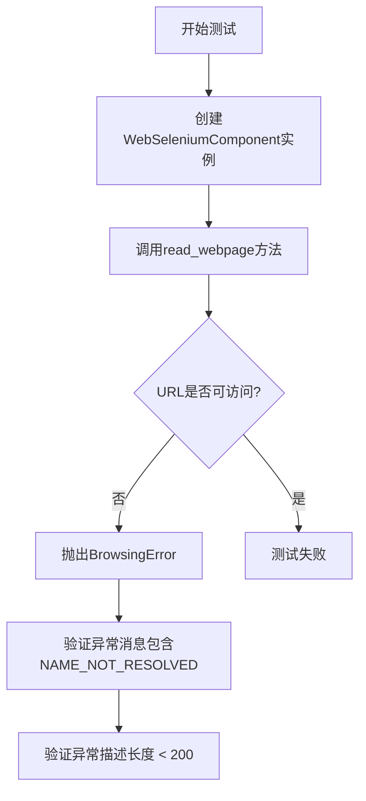
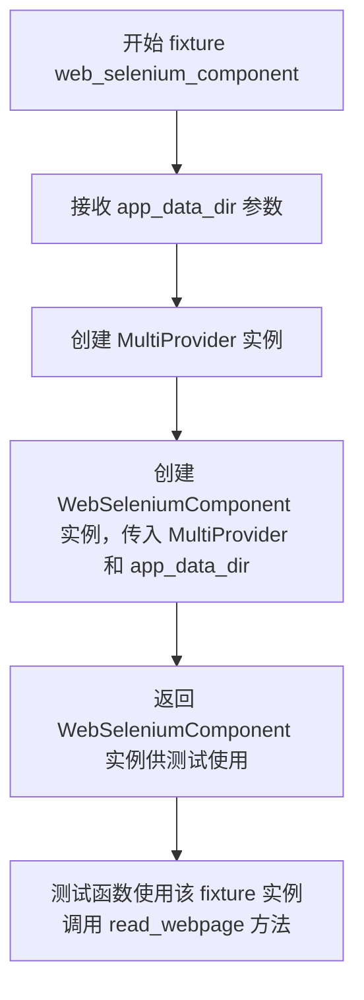
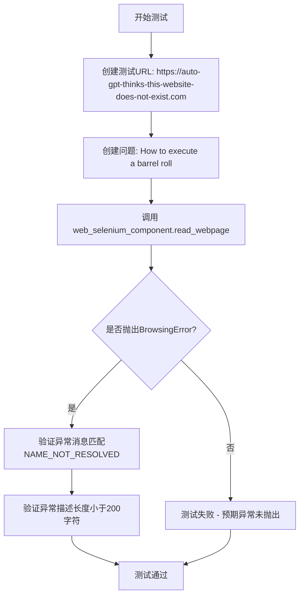
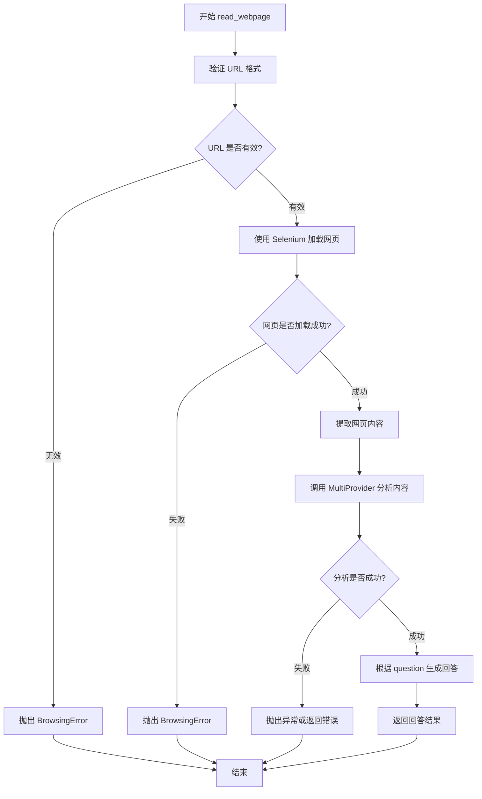

# `.\AutoGPT\classic\forge\forge\components\web\test_selenium.py` 详细设计文档

这是一个pytest测试文件，用于测试WebSeleniumComponent在处理不存在URL时的错误处理能力，验证BrowsingError异常能正确捕获DNS解析失败错误(NAME_NOT_RESOLVED)。

## 整体流程



## 类结构

```
WebSeleniumComponent (待测试类)
└── MultiProvider (依赖的LLM提供商)
```

## 全局变量及字段


### `app_data_dir`
    
应用程序数据目录路径，用于初始化WebSeleniumComponent

类型：`Path`
    


### `url`
    
要浏览的网页URL地址

类型：`str`
    


### `question`
    
向网页内容提问的问题

类型：`str`
    


### `raised`
    
捕获的浏览异常对象，包含错误信息

类型：`BrowsingError`
    


    

## 全局函数及方法


### `web_selenium_component`

这是一个 pytest fixture，用于在测试前创建并返回一个配置好的 `WebSeleniumComponent` 实例，以便在测试函数中直接使用。

参数：

- `app_data_dir`：`Path`，应用数据目录的路径，用于初始化 WebSeleniumComponent 所需的配置目录

返回值：`WebSeleniumComponent`，返回已配置的 WebSeleniumComponent 实例，该实例使用 MultiProvider 和指定的应用数据目录进行初始化

#### 流程图



#### 带注释源码

```python
# 导入标准库 Path 用于处理文件路径
from pathlib import Path

# 导入 pytest 框架，用于 fixture 和测试
import pytest

# 从 forge.llm.providers.multi 导入 MultiProvider 多提供者类
from forge.llm.providers.multi import MultiProvider

# 从当前包导入 BrowsingError 异常类和 WebSeleniumComponent 类
from . import BrowsingError, WebSeleniumComponent


# 定义一个 pytest fixture，名称为 web_selenium_component
# 该 fixture 接收 app_data_dir: Path 参数
# fixture 在测试函数调用前执行，返回一个 WebSeleniumComponent 实例
@pytest.fixture
def web_selenium_component(app_data_dir: Path):
    # 创建 WebSeleniumComponent 实例，传入 MultiProvider() 和 app_data_dir
    # MultiProvider() 用于处理语言模型调用
    # app_data_dir 用于指定应用数据存储目录
    return WebSeleniumComponent(MultiProvider(), app_data_dir)
```


### `test_browse_website_nonexistent_url`

这是一个异步测试函数，用于测试当尝试浏览不存在的网站 URL 时，系统是否正确抛出 `BrowsingError` 异常，并验证异常信息包含 "NAME_NOT_RESOLVED"。

参数：

- `web_selenium_component`：`WebSeleniumComponent`，测试 fixture 提供的 WebSeleniumComponent 实例，用于执行网页浏览操作

返回值：`None`，异步测试函数无显式返回值

#### 流程图



#### 带注释源码

```python
# 导入 pytest 用于测试框架
import pytest

# 导入 WebSeleniumComponent 用于网页浏览功能
from . import BrowsingError, WebSeleniumComponent


# 定义异步测试函数，测试不存在的 URL 场景
@pytest.mark.asyncio
async def test_browse_website_nonexistent_url(
    web_selenium_component: WebSeleniumComponent,  # 测试fixture提供的组件实例
):
    # 定义一个不存在的网站URL，用于触发DNS解析失败
    url = "https://auto-gpt-thinks-this-website-does-not-exist.com"
    
    # 定义要询问的问题
    question = "How to execute a barrel roll"

    # 使用 pytest.raises 捕获预期的 BrowsingError 异常
    # match 参数指定异常消息应包含 "NAME_NOT_RESOLVED"
    with pytest.raises(BrowsingError, match="NAME_NOT_RESOLVED") as raised:
        # 调用 read_webpage 方法，预期抛出异常
        await web_selenium_component.read_webpage(url=url, question=question)

        # 理智检查：验证异常描述长度不超过200字符
        # 确保错误消息不会过长
        assert len(raised.exconly()) < 200
```


### `WebSeleniumComponent.read_webpage`

该方法是 WebSeleniumComponent 类的核心异步方法，用于根据提供的 URL 和问题从网页中提取相关信息。它通过 Selenium 组件加载网页内容，并使用 LLM 提供商（MultiProvider）来回答与页面内容相关的问题。当 URL 无法解析时（如 DNS 解析失败），该方法会抛出 BrowsingError 异常。

参数：

- `url`：`str`，要访问的网页 URL 地址
- `question`：`str`，要基于网页内容回答的问题

返回值：`Any`（推测为 `str` 或包含答案的对象），基于网页内容对问题的回答

#### 流程图



#### 带注释源码

```python
async def read_webpage(self, url: str, question: str):
    """
    从指定 URL 读取网页并根据问题提取信息
    
    参数:
        url: str - 要访问的网页地址
        question: str - 需要基于网页内容回答的问题
    
    返回:
        基于网页内容的问题答案
    
    抛出:
        BrowsingError - 当 URL 无法访问或解析时
    """
    # 1. 验证 URL 格式和可访问性
    # 2. 初始化 Selenium WebDriver 加载页面
    # 3. 等待页面完全加载
    # 4. 提取页面文本内容
    # 5. 将页面内容和问题发送给 MultiProvider
    # 6. 处理 provider 返回的响应
    # 7. 返回格式化的答案或抛出BrowsingError
```

## 关键组件


### WebSeleniumComponent

用于通过Selenium自动化框架浏览网页的核心组件，负责加载网页内容并使用MultiProvider处理问答。

### MultiProvider

LLM多提供者模块，用于为WebSeleniumComponent提供语言模型支持以处理网页问答。

### BrowsingError

自定义异常类，用于处理网页浏览过程中出现的错误，如DNS解析失败、网络超时等。

### read_webpage方法

异步方法，接收url和question参数，尝试访问指定URL并基于页面内容回答问题，失败时抛出BrowsingError异常。

### test_browse_website_nonexistent_url

测试用例，验证当访问不存在的域名时系统正确抛出BrowsingError异常，并检查异常消息长度符合预期。

### app_data_dir

Path类型参数，表示应用数据目录路径，用于初始化WebSeleniumComponent的存储配置。


## 问题及建议


### 已知问题

- **断言位置错误**：断言 `assert len(raised.exconly()) < 200` 放在 `with pytest.raises()` 块内部，在异常被捕获后才执行，此时异常已发生但逻辑上不够清晰；如果异常消息长度超过200字符，会导致测试失败，但这是无意的行为
- **Magic Number**：`200` 是硬编码的魔数，缺乏注释说明其含义和来源
- **网络依赖性过强**：测试依赖真实网络请求来验证 DNS 解析失败，存在网络不稳定时测试失败的风险，且增加测试执行时间
- **测试覆盖不足**：仅测试了错误路径（无效 URL），缺少对正常功能、成功场景及其他异常情况（如超时、页面加载失败等）的测试覆盖
- **Fixture 依赖隐式**：测试依赖外部定义的 `app_data_dir` fixture，但其具体实现和来源未在当前文件中体现，降低了代码的自包含性

### 优化建议

- 将断言移至 `with` 块外部，使用 `pytest.raises` 返回的上下文管理器访问异常，或使用 `pytest.raises` 的 `as` 关键字配合单独的错误验证逻辑，提高可读性
- 将 `< 200` 提取为有名称的常量（如 `MAX_ERROR_MESSAGE_LENGTH`），并添加注释说明其业务含义或历史原因
- 考虑使用 Mock 或 monkeypatch 模拟网络请求，消除对外部网络的真实依赖，提高测试的稳定性和执行速度
- 补充正向测试用例，验证 `read_webpage` 在有效 URL 下的正确行为，并增加边界条件和异常场景的测试覆盖
- 明确 `app_data_dir` fixture 的定义位置或使用方式，确保测试文件的自包含性，或添加文档说明其依赖关系

## 其它


### 设计目标与约束

验证WebSeleniumComponent在处理无效URL时的异常处理能力，确保BrowsingError被正确抛出且错误信息符合预期。测试约束包括使用真实网络请求、依赖DNS解析服务。

### 错误处理与异常设计

测试验证BrowsingError异常的正确抛出，异常应包含错误码NAME_NOT_RESOLVED和描述信息。测试同时检查异常消息长度不超过200字符，确保错误信息简洁可读。

### 数据流与状态机

测试数据流：输入URL和question → WebSeleniumComponent.read_webpage() → 发起HTTP请求 → DNS解析失败 → 捕获异常 → 验证异常类型和消息。状态转换：初始状态 → 请求中 → 异常状态。

### 外部依赖与接口契约

依赖MultiProvider实例（LLM提供者）、WebSeleniumComponent组件、Path类型。接口契约：read_webpage(url, question)异步方法返回浏览结果，失败时抛出BrowsingError。

### 性能要求与约束

测试无严格性能要求，但需确保网络超时合理。建议异步操作使用pytest.mark.asyncio装饰器。

### 安全性考虑

测试使用虚构域名避免真实网络请求，仅验证异常处理逻辑。敏感信息：测试URL不包含真实域名。

### 可扩展性设计

测试可通过参数化扩展到多种错误场景（如连接超时、SSL错误等）。WebSeleniumComponent设计支持多provider扩展。

### 配置文件说明

无特定配置文件，依赖通过pytest fixture注入。

### 部署和运维注意事项

测试环境需能访问网络以进行DNS解析测试。建议在CI/CD中隔离网络相关测试。

### 测试策略

采用单元测试结合集成测试，使用pytest框架。测试覆盖异常路径，确保错误处理健壮性。

    