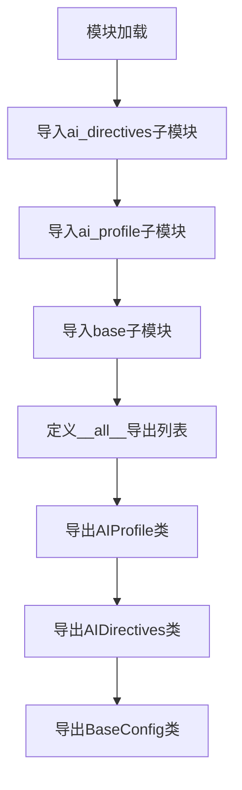

# `.\AutoGPT\classic\forge\forge\config\__init__.py` 详细设计文档

这是AutoGPT Forge项目的配置模块入口文件，主要负责导出配置相关的核心类（AIProfile、AIDirectives、BaseConfig），为整个项目提供配置模型的基础设施。

## 整体流程



## 类结构

```
BaseConfig (基础配置类)
├── AIProfile (AI配置文件)
└── AIDirectives (AI指令配置)
```

## 全局变量及字段


### `__all__`
    
一个列表，定义了使用 'from module import *' 时允许导入的公共接口名称，包括 AIProfile、AIDirectives 和 BaseConfig 三个类

类型：`list[str]`
    


    

## 全局函数及方法


## 关键组件


### AIDirectives

AI指令配置类，用于定义和管理AI代理的行为指令和约束条件。

### AIProfile

AI配置文件，定义了AI代理的个人资料、特征和配置参数。

### BaseConfig

基础配置类，提供配置模型的基类功能，用于统一配置对象的结构和行为。


## 问题及建议


### 已知问题

-   **模块实现缺失**：该模块仅为导入和导出声明，实际的配置模型实现（AIDirectives、AIProfile、BaseConfig）位于子模块中但未被展示，可能导致功能不完整
-   **缺乏错误处理**：导入语句未使用try-except包装，若子模块导入失败时会直接抛出异常，缺乏优雅的错误处理机制
-   **接口暴露过度**：直接导出具体实现类而非抽象接口，增加了调用方与实现之间的耦合度
-   **缺少类型注解和文档**：模块本身缺乏版本信息、作者声明、使用示例等元数据说明

### 优化建议

-   **添加导入保护机制**：使用try-except包装导入语句，提供有意义的错误信息或降级方案
-   **引入配置加载器**：添加配置文件读取、环境变量解析、默认值管理等配置管理功能
-   **增加类型注解和文档**：为模块添加详细的文档字符串，说明各配置类的用途和关系
-   **解耦依赖关系**：考虑通过抽象基类或协议定义配置接口，将具体实现与接口分离
-   **添加验证逻辑**：在配置模型中加入数据校验机制，确保配置项的有效性


## 其它


### 设计目标与约束

本模块作为AutoGPT Forge配置模型的核心入口模块，目标是提供统一的配置类导出接口，使得其他模块能够方便地导入所需的配置类。该模块遵循Python包的最佳实践，通过`__init__.py`文件清晰地将配置相关的类（AIProfile、AIDirectives、BaseConfig）对外暴露，同时保持模块的内聚性和可维护性。设计约束方面，该模块不包含任何业务逻辑，仅作为配置类的命名空间导出层，要求被导入的类必须实现统一的配置接口规范。

### 错误处理与异常设计

由于该模块仅包含导入语句，不涉及运行时业务逻辑，因此本身不产生特定的异常。然而，当导入的模块（ai_directives、ai_profile、base）不存在或类定义缺失时，会抛出`ImportError`或`AttributeError`。建议在顶层包级别添加异常处理机制，例如使用try-except块捕获导入错误，并提供清晰的错误信息提示。同时，建议为配置类定义自定义异常类，如`ConfigurationError`，用于配置加载、验证失败时的异常处理场景。

### 数据流与状态机

该模块的数据流属于静态导入导出类型，不涉及运行时状态变化。配置对象的数据流遵循以下路径：配置文件或环境变量 → 配置解析器 → 配置类实例化 → 业务模块调用。状态机方面，配置对象通常具有三种状态：初始化状态（默认值）、加载状态（已读取配置）、验证状态（通过验证）。建议在BaseConfig基类中定义状态转换逻辑，确保配置对象在有效状态流转。

### 外部依赖与接口契约

该模块的外部依赖包括Python标准库（无额外依赖）和同包下的三个模块。接口契约方面，导出的配置类必须遵循以下规范：所有配置类应继承自BaseConfig基类；配置类必须实现`to_dict()`方法用于序列化；配置类必须实现`from_dict()`类方法用于反序列化；配置类应提供`validate()`方法进行配置验证。依赖的三个模块应保证API稳定性，任何接口变更应遵循语义化版本控制规范。

### 性能要求与考量

该模块本身不涉及计算密集型操作，性能开销主要来自于配置对象的实例化。建议在BaseConfig基类中实现`__slots__`以减少内存占用；对于频繁访问的配置项，可考虑实现缓存机制；配置验证应支持延迟验证策略，避免不必要的性能开销。配置加载应支持异步模式，以适应高并发场景的需求。

### 安全考虑

配置模块可能涉及敏感信息（如API密钥、数据库凭证等），因此需要考虑以下安全措施：配置类应支持敏感字段的自动脱敏处理；配置加载时应验证配置来源的可信度；避免在配置对象中存储明文密码，建议使用密钥管理系统集成；配置文件的访问权限应严格控制，建议使用环境变量或加密配置源。

### 测试策略

该模块的测试策略应包括：单元测试验证模块导入正确性；单元测试验证各配置类的实例化；单元测试验证配置类的序列化/反序列化功能；集成测试验证配置模块与其他模块的协作；Mock测试验证配置加载流程。建议使用pytest框架，测试覆盖率目标应达到80%以上。

### 版本兼容性

该模块应明确支持的Python版本范围（建议Python 3.8+）；配置类的接口应保持向后兼容性；建议使用类型提示（typing）提高代码的可读性和IDE支持；应提供迁移指南，帮助用户从旧版本配置格式升级到新版本。

### 配置加载机制

配置加载应支持多种来源：环境变量、YAML配置文件、JSON配置文件、命令行参数。加载优先级应遵循：命令行参数 > 环境变量 > 配置文件 > 默认值。建议在BaseConfig中实现统一的配置加载接口，支持多配置源合并和覆盖逻辑。配置热更新机制也是需要考虑的重要特性。


    