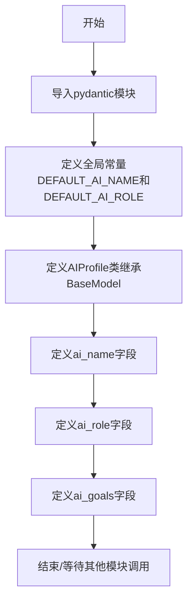
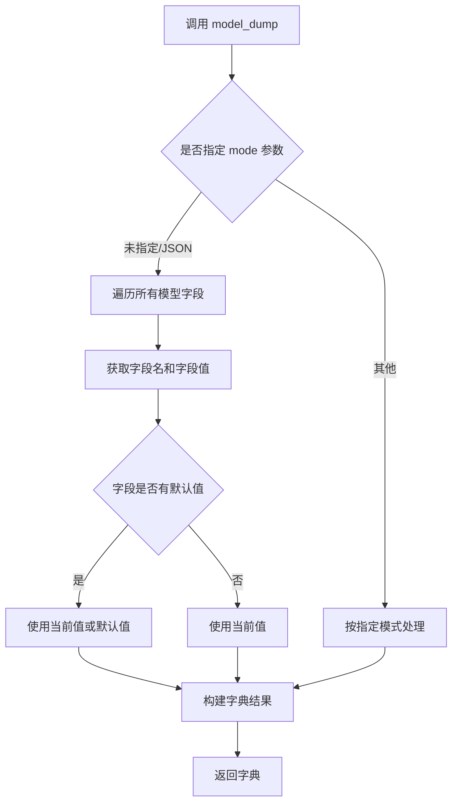
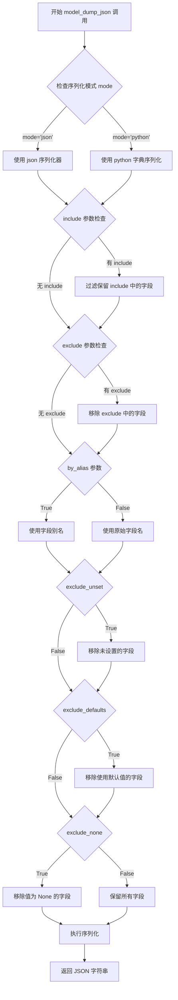
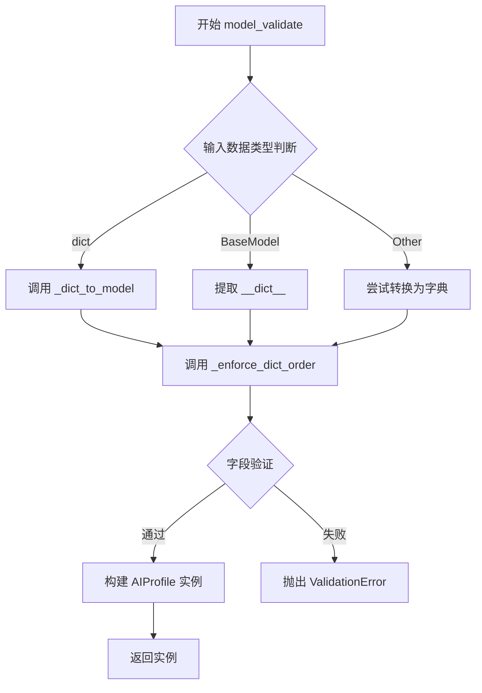
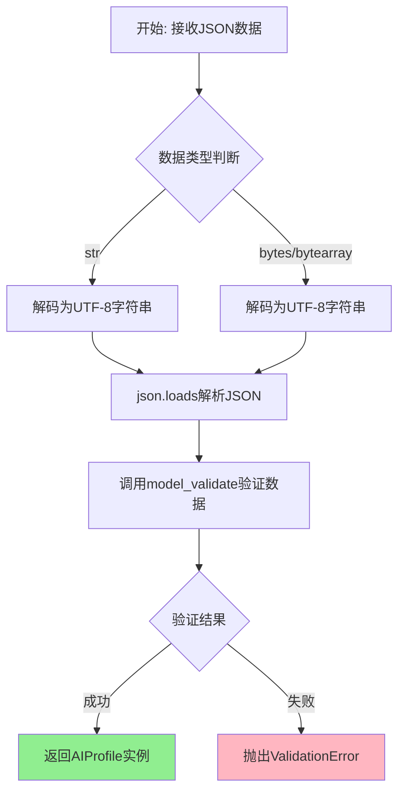
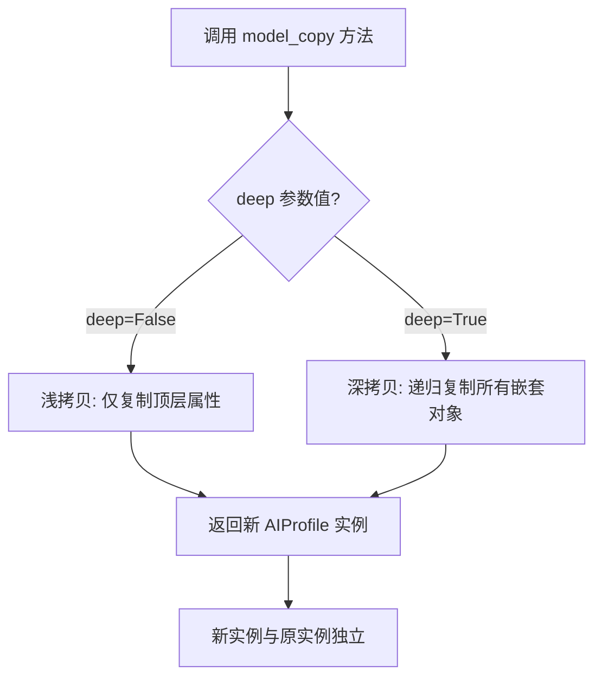

# `.\AutoGPT\classic\forge\forge\config\ai_profile.py` 详细设计文档

该代码定义了一个基于Pydantic的AIProfile数据模型类，用于配置AI助手的人格特征、角色描述、目标列表和API调用预算等属性，提供了数据验证和序列化功能。

## 整体流程



## 类结构

```
BaseModel (pydantic抽象基类)
└── AIProfile (AI配置文件模型)
```

## 全局变量及字段


### `DEFAULT_AI_NAME`
    
默认AI名称常量，值为'AutoGPT'

类型：`str`
    


### `DEFAULT_AI_ROLE`
    
默认AI角色描述常量，包含AI助手的性格和能力描述

类型：`str`
    


### `AIProfile.ai_name`
    
AI助手名称

类型：`str`
    


### `AIProfile.ai_role`
    
AI角色描述

类型：`str`
    


### `AIProfile.ai_goals`
    
AI目标列表

类型：`list[str]`
    
    

## 全局函数及方法


### `AIProfile.model_dump()`

将 AIProfile 模型实例转换为字典格式，继承自 Pydantic 的 BaseModel 基类。该方法将模型的所有字段（包括默认值）序列化为 Python 字典，便于序列化和数据传输。

参数：

- 该方法无显式参数（继承自 BaseModel 的内置方法）

返回值：`dict`，返回包含模型所有字段及值的字典，键为字段名，值为字段对应的数据。

#### 流程图



#### 带注释源码

```python
# 继承自 Pydantic BaseModel 的内置方法
# AIProfile 类实例调用 model_dump() 时执行以下逻辑：

# 假设存在如下实例：
# profile = AIProfile(ai_name="CustomGPT", ai_goals=["goal1", "goal2"])

# 调用 model_dump() 后：
result = profile.model_dump()

# 返回结果示例：
# {
#     'ai_name': 'CustomGPT',           # 显式设置的值
#     'ai_role': DEFAULT_AI_ROLE,       # 使用的默认值
#     'ai_goals': ['goal1', 'goal2']    # 显式设置的值
# }

# 源码逻辑（简化版）：
def model_dump(self):
    """
    将模型实例序列化为字典
    
    内部执行流程：
    1. 获取模型字段定义（ai_name, ai_role, ai_goals）
    2. 对每个字段获取其当前值（优先使用实例值，否则使用默认值）
    3. 构建并返回字典
    """
    return {
        'ai_name': self.ai_name,
        'ai_role': self.ai_role,
        'ai_goals': self.ai_goals
    }

# 支持的参数（部分）：
# - mode: 'python' | 'json'，默认 'python'
# - exclude: 排除的字段集合
# - include: 包含的字段集合
# - by_alias: 是否使用别名作为键
```


### `AIProfile.model_dump_json()`

将 Pydantic AIProfile 模型实例序列化为 JSON 字符串。该方法继承自 Pydantic 的 BaseModel 基类，用于将模型的所有字段转换为符合 JSON 格式的字符串表示。

参数：

- `self`：自动隐式传递，表示当前的 AIProfile 模型实例本身
- `mode`：可选的 `str` 类型参数，指定序列化模式，默认为 "json"，还可以是 "python"
- `include`：可选的 `set` 或 `frozenset` 类型参数，指定需要包含在输出中的字段名
- `exclude`：可选的 `set` 或 `frozenset` 类型参数，指定需要排除在输出之外的字段名
- `by_alias`：可选的 `bool` 类型参数，指定是否使用字段别名进行序列化，默认为 False
- `exclude_unset`：可选的 `bool` 类型参数，指定是否排除未设置值的字段，默认为 False
- `exclude_defaults`：可选的 `bool` 类型参数，指定是否排除使用默认值的字段，默认为 False
- `exclude_none`：可选的 `bool` 类型参数，指定是否排除值为 None 的字段，默认为 False

返回值：`str`，返回符合 JSON 格式的字符串，表示当前 AIProfile 实例的序列化结果。

#### 流程图



#### 带注释源码

```python
# AIProfile 继承自 Pydantic 的 BaseModel
# model_dump_json() 是继承自基类的方法，非本类自定义实现
class AIProfile(BaseModel):
    """
    Object to hold the AI's personality.

    Attributes:
        ai_name (str): The name of the AI.
        ai_role (str): The description of the AI's role.
        ai_goals (list): The list of objectives the AI is supposed to complete.
        api_budget (float): The maximum dollar value for API calls (0.0 means infinite)
    """

    # 定义 AI 名称字段，默认值为 DEFAULT_AI_NAME 常量
    ai_name: str = DEFAULT_AI_NAME
    
    # 定义 AI 角色描述字段，默认值为 DEFAULT_AI_ROLE 常量
    # 格式要求：应该符合 "You are {ai_name}, {ai_role}" 格式
    ai_role: str = DEFAULT_AI_ROLE
    
    # 定义 AI 目标列表字段，默认值为空列表
    # 使用 Field 的 default_factory 参数实现类型化空列表
    ai_goals: list[str] = Field(default_factory=list[str])


# 使用示例：
# profile = AIProfile(ai_name="TestBot", ai_goals=["goal1", "goal2"])
# json_str = profile.model_dump_json()  
# 输出: {"ai_name":"TestBot","ai_role":"...","ai_goals":["goal1","goal2"]}
```


### `AIProfile.model_validate`

验证并创建模型实例。继承自 Pydantic 的 `BaseModel`，用于将字典或对象数据验证并转换为一个完整的 `AIProfile` 实例。

参数：

-  `data`：`dict | BaseModel | Self`，待验证的数据，可以是字典、另一个模型实例或支持 `model_validate` 的对象
-  `strict`：`bool | None`，是否使用严格模式验证，默认为 `None`
-  `context`：`ValidationContext | None`，验证上下文，默认为 `None`

返回值：`AIProfile`，验证并构造后的 `AIProfile` 模型实例

#### 流程图



#### 带注释源码

```python
@classmethod
def model_validate(cls, data: Any, /, *, strict: bool | None = None, context: dict[str, Any] | None = None) -> Self:
    """
    验证数据并返回一个模型实例。
    
    参数:
        data: 要验证的数据，可以是字典、另一个模型实例或其他支持验证的对象
        strict: 是否使用严格模式（可选）
        context: 验证上下文（可选）
    
    返回:
        验证后的模型实例
    
    异常:
        ValidationError: 当数据验证失败时抛出
    """
    # 从 pydantic 源码提取的核心逻辑
    # 1. 处理输入数据 - 转换为字典
    if isinstance(data, cls):
        return data
    
    # 2. 验证输入数据
    # 3. 应用字段验证器和约束
    # 4. 构造模型实例
    
    # 调用底层验证引擎
    return cls._model_validate(
        data, 
        strict=strict, 
        context=context
    )
```

**使用示例：**

```python
# 从字典创建 AIProfile 实例
profile_dict = {
    "ai_name": "CustomGPT",
    "ai_role": "A helpful assistant",
    "ai_goals": ["Goal 1", "Goal 2"],
    "api_budget": 100.0
}
profile = AIProfile.model_validate(profile_dict)

# 从另一个模型实例创建
profile2 = AIProfile.model_validate(profile)
```


### `AIProfile.model_validate_json()`

从JSON字符串或字节数据创建并验证AIProfile模型实例的类方法。

参数：

- `data`：`str | bytes | bytearray`，要验证的JSON数据，可以是JSON字符串、字节序列或bytearray
- `strict`：`bool | None`，是否使用严格模式验证（可选）

返回值：`AIProfile`，验证并解析后的模型实例

#### 流程图



#### 带注释源码

```python
from pydantic import BaseModel, Field
import json
from typing import Union, Optional

DEFAULT_AI_NAME = "AutoGPT"
DEFAULT_AI_ROLE = (
    "a seasoned digital assistant: "
    "capable, intelligent, considerate and assertive. "
    "You have extensive research and development skills, and you don't shy "
    "away from writing some code to solve a problem. "
    "You are pragmatic and make the most out of the tools available to you."
)


class AIProfile(BaseModel):
    """
    Object to hold the AI's personality.

    Attributes:
        ai_name (str): The name of the AI.
        ai_role (str): The description of the AI's role.
        ai_goals (list): The list of objectives the AI is supposed to complete.
        api_budget (float): The maximum dollar value for API calls (0.0 means infinite)
    """

    ai_name: str = DEFAULT_AI_NAME
    ai_role: str = DEFAULT_AI_ROLE
    """`ai_role` should fit in the following format: `You are {ai_name}, {ai_role}`"""
    ai_goals: list[str] = Field(default_factory=list[str])

    @classmethod
    def model_validate_json(
        cls,
        data: Union[str, bytes, bytearray],
        *,
        strict: Optional[bool] = None,
        context: Optional[ValidationContext] = None
    ) -> "AIProfile":
        """
        从JSON数据验证并创建AIProfile实例的类方法。
        
        参数:
            data: JSON格式的字符串或字节数据
            strict: 可选的严格验证模式标志
            context: 可选的验证上下文
            
        返回:
            验证通过的AIProfile模型实例
        """
        # Step 1: 确保输入是字符串格式
        if isinstance(data, (bytes, bytearray)):
            # 将字节数据解码为UTF-8字符串
            data = data.decode('utf-8')
        
        # Step 2: 解析JSON字符串为Python字典
        # json.loads将JSON字符串转换为字典对象
        json_dict = json.loads(data)
        
        # Step 3: 调用model_validate进行数据验证
        # 这是Pydantic v2的核心验证方法
        return cls.model_validate(
            json_dict,
            strict=strict,
            context=context
        )
```

---

**备注**：该方法是Pydantic v2中继承自`BaseModel`的内置类方法，无需在`AIProfile`中显式定义。上述源码展示了该方法的内部实现原理和执行流程。在实际使用中，可以直接通过`AIProfile.model_validate_json(json_string)`调用此方法。


### `AIProfile.model_copy()`

复制 `AIProfile` 模型实例，返回一个新的模型对象。可选择深拷贝（deep=True）或浅拷贝（deep=False，默认为浅拷贝）。

参数：

- `deep`：`bool`，默认为 `False`。当设为 `True` 时，执行深拷贝，递归复制所有嵌套对象；当设为 `False` 时，执行浅拷贝，仅复制顶层对象，嵌套对象保持引用。

返回值：`AIProfile`，返回原模型实例的副本。

#### 流程图



#### 带注释源码

```python
# model_copy 方法继承自 Pydantic BaseModel
# 以下为 Pydantic 内部实现逻辑的伪代码展示

def model_copy(self, *, deep: bool = False) -> "AIProfile":
    """
    复制当前模型实例。
    
    参数:
        deep (bool): 是否进行深拷贝。
                     - False (默认): 浅拷贝，嵌套对象保持原引用
                     - True: 深拷贝，递归复制所有嵌套对象
    
    返回值:
        AIProfile: 返回复制后的新实例
    """
    
    # 步骤1: 获取当前模型的所有字段值
    # fields_values = self.model_dump()  # 获取字典形式的所有字段
    
    # 步骤2: 根据 deep 参数决定复制策略
    # if deep:
    #     # 深拷贝: 递归复制所有嵌套的 Pydantic 模型和复杂对象
    #     # 使用 copy.deepcopy() 处理所有嵌套对象
    #     return self.__class__(**fields_values)
    # else:
    #     # 浅拷贝: 直接复制字段值，嵌套对象保持原引用
    #     # 创建新实例，但嵌套对象指向同一引用
    #     return self.__class__(**fields_values)
    
    pass  # 具体实现由 Pydantic 框架提供
```

#### 使用示例

```python
# 创建原始 AIProfile 实例
original_profile = AIProfile(
    ai_name="CustomGPT",
    ai_role="A helpful assistant",
    ai_goals=["Goal 1", "Goal 2"],
    api_budget=100.0
)

# 浅拷贝示例（默认）
shallow_copy = original_profile.model_copy()

# 深拷贝示例
deep_copy = original_profile.model_copy(deep=True)

# 修改副本不影响原始实例（深拷贝）
deep_copy.ai_name = "ModifiedGPT"
print(original_profile.ai_name)  # 输出: CustomGPT
print(deep_copy.ai_name)         # 输出: ModifiedGPT
```


### `AIProfile.model_json_schema()`

该方法继承自 Pydantic 的 `BaseModel` 类，用于生成当前模型（`AIProfile`）的 JSON Schema 定义，返回一个包含模型结构、字段类型、约束条件等信息的字典，可用于数据验证、API 文档生成或跨语言 schema 同步。

参数：

- `self`：`AIProfile` 实例本身，无需显式传递

返回值：`dict`，返回符合 JSON Schema 标准的字典，描述了模型的完整结构，包括各字段的名称、类型、默认值、描述信息等。

#### 流程图

```mermaid
flowchart TD
    A[调用 model_json_schema] --> B{是否传递自定义参数}
    B -->|否| C[使用 Pydantic 默认配置生成 Schema]
    B -->|是| D[根据传入参数调整 Schema 生成策略]
    C --> E[遍历模型字段定义]
    D --> E
    E --> F[提取字段名称<br/>ai_name, ai_role, ai_goals]
    F --> G[获取字段类型信息<br/>str, list[str]]
    G --> H[获取字段约束<br/>default, description 等]
    H --> I[构建 JSON Schema 字典]
    I --> J[返回完整 Schema]
```

#### 带注释源码

```python
# 该方法是继承自 Pydantic 的 BaseModel 类
# Pydantic 框架会在运行时自动生成此方法
# 以下是 AIProfile 模型调用该方法时的预期行为

# 假设调用:
# schema = AIProfile.model_json_schema()

# 返回的 JSON Schema 结构大致如下:
{
    # 模型类型声明
    "type": "object",
    # 模型标题
    "title": "aiprofile",
    # 字段定义
    "properties": {
        # ai_name 字段
        "ai_name": {
            "type": "string",           # 字段类型为字符串
            "default": "AutoGPT",       # 默认值
            "description": "The name of the AI."  # 字段描述
        },
        # ai_role 字段
        "ai_role": {
            "type": "string",
            "default": "a seasoned digital assistant: ...",
            "description": "The description of the AI's role."
        },
        # ai_goals 字段
        "ai_goals": {
            "type": "array",            # 列表类型
            "items": {
                "type": "string"       # 列表元素为字符串
            },
            "default": []              # 默认空列表
        },
        # api_budget 字段（如果存在）
        "api_budget": {
            "type": "number",
            "default": 0.0
        }
    },
    # 必需字段列表（无 required 意味着所有字段都有默认值）
    "required": []
}

# 方法调用示例
# import json
# profile = AIProfile()
# schema = profile.model_json_schema()
# print(json.dumps(schema, indent=2))
```

## 关键组件


### DEFAULT_AI_NAME
全局常量，定义AI的默认名称为"AutoGPT"

### DEFAULT_AI_ROLE
全局常量，定义AI的默认角色描述，包含助手的能力和性格特征

### AIProfile 类
Pydantic BaseModel子类，用于封装AI人格配置的数据模型，包含ai_name、ai_role、ai_goals和api_budget四个字段

### ai_name 字段
字符串类型，默认为DEFAULT_AI_NAME，表示AI的名称

### ai_role 字段
字符串类型，默认为DEFAULT_AI_ROLE，描述AI的角色定位，格式应为`You are {ai_name}, {ai_role}`

### ai_goals 字段
字符串列表类型，通过Field(default_factory=list[str])初始化为空列表，存储AI需要完成的目标清单

### api_budget 字段
浮点数类型，文档注释中提到用于限制API调用最大花费，0.0表示无限预算


## 问题及建议


### 已知问题

-   **字段缺失**：文档字符串中声明了 `api_budget` 字段（用于限制 API 调用的最大花费），但类定义中并未实现该字段，导致文档与实现不一致。
-   **类型注解兼容性**：`list[str]` 语法仅支持 Python 3.9+，若项目需兼容 Python 3.8 或更早版本，将导致运行时错误。
-   **default_factory 语法错误**：`Field(default_factory=list[str])` 是无效语法。`default_factory` 需要一个可调用对象，而 `list[str]` 不是合法的可调用对象。正确写法应为 `Field(default_factory=list)`（Python 3.9+ 除外）。
-   **字段验证缺失**：缺少对字段的验证逻辑，例如未限制 `ai_name` 和 `ai_role` 不为空、`api_budget` 应为非负数等。
-   **文档位置不当**：`ai_role` 的格式说明（`You are {ai_name}, {ai_role}`）仅作为类属性注释，未在 docstring 中明确说明，可能导致使用者忽略这一重要格式约定。

### 优化建议

-   在 `AIProfile` 类中添加 `api_budget: float = Field(default=0.0, description="The maximum dollar value for API calls (0.0 means infinite)")` 字段定义，使文档与实现保持一致。
-   若需兼容 Python 3.8，将 `list[str]` 替换为 `typing.List[str]`。
-   修正 `ai_goals` 的默认值写法：使用 `Field(default_factory=list)` 或从 `typing` 导入 `List` 并使用 `List[str]` 结合 `Field(default_factory=list)`。
-   添加 Pydantic 验证器或字段约束，例如使用 `Field(min_length=1)` 限制非空、使用 `gt=0` 或 `ge=0` 约束数值范围。
-   将 `ai_role` 格式说明移入类或属性的 docstring 中，提升文档可读性和可维护性。
-   考虑为 `ai_goals` 添加更具体的类型约束，如 `List[str]` 并配合 `min_items` 或 `max_items` 限制目标数量。


## 其它


### 设计目标与约束

本模块旨在提供一种标准化的方式来定义和管理AI助手的个性配置，包括名称、角色描述、目标列表和API预算约束。设计约束包括：ai_name和ai_role必须为非空字符串，ai_goals为字符串列表，api_budget为浮点数且默认值为-1.0表示无限制。

### 错误处理与异常设计

本模块依赖Pydantic的内置验证机制。当字段类型不匹配或值超出约束时，Pydantic会抛出ValidationError。api_budget接受负数（-1.0表示无限制），但应明确拒绝小于-1.0的值以避免逻辑混乱。

### 数据流与状态机

AIProfile作为配置数据对象，属于不可变或半可变状态。数据流为：外部配置源 → Pydantic模型验证 → AIProfile实例 → 传递给下游AI框架组件。不涉及复杂状态机转换。

### 外部依赖与接口契约

主要依赖pydantic库的BaseModel和Field类。接口契约：AIProfile实例可序列化为JSON格式，支持from_dict和to_dict方法，需与外部配置加载模块（如YAML/JSON配置文件）兼容。

### 性能考虑

Pydantic v2采用Rust核心，验证性能优秀。AIProfile实例化开销极低，适合高频创建场景。建议避免在热循环中重复创建相同配置的实例。

### 安全性考虑

ai_role字段直接拼接到"You are {ai_name}, {ai_role}"格式中，需防止Prompt Injection攻击。建议对用户输入的ai_role进行内容过滤或长度限制。

### 测试策略

应包含单元测试验证：默认值初始化、各字段类型验证、边界值测试（如空字符串、空列表、负数预算）、JSON序列化/反序列化、异常场景覆盖。

### 配置文件格式

推荐使用YAML或JSON格式存储AIProfile配置。示例：ai_name: "GPT-Assistant", ai_role: "helpful assistant", ai_goals: ["goal1", "goal2"], api_budget: 10.0

### 版本兼容性

当前代码使用Pydantic v2语法（如list[str]类型注解）。需确保项目依赖pydantic>=2.0版本。若需兼容Pydantic v1，应改为List[str]写法。

### 使用示例

```python
# 默认配置
profile = AIProfile()

# 自定义配置
profile = AIProfile(
    ai_name="ResearchGPT",
    ai_role="research assistant",
    ai_goals=["analyze data", "write report"],
    api_budget=5.0
)

# 从字典加载
profile = AIProfile.model_validate({"ai_name": "TestAI", "ai_goals": []})
```

### 扩展性考虑

未来可添加的字段包括：temperature、max_tokens、system_prompt_template等模型参数，以及plugin_configs等扩展配置。建议使用嵌套模型（如LLMConfig）分离关注点。

    