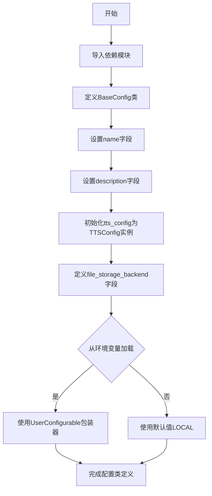

# `.\AutoGPT\classic\forge\forge\config\base.py` 详细设计文档

这是一个基础配置类，定义了Forge代理的默认配置，包括TTS语音配置和文件存储后端设置，支持从环境变量加载文件存储后端配置。

## 整体流程



## 类结构

```
SystemSettings (基类)
└── BaseConfig (配置类)
```

## 全局变量及字段


### `FileStorageBackendName`
    
文件存储后端枚举类

类型：`class`
    


### `SystemSettings`
    
系统设置基类

类型：`class`
    


### `UserConfigurable`
    
用户可配置装饰器

类型：`class`
    


### `TTSConfig`
    
TTS配置类

类型：`class`
    


### `BaseConfig.name`
    
配置名称

类型：`str`
    


### `BaseConfig.description`
    
配置描述

类型：`str`
    


### `BaseConfig.tts_config`
    
TTS语音配置

类型：`TTSConfig`
    


### `BaseConfig.file_storage_backend`
    
文件存储后端

类型：`FileStorageBackendName`
    
    

## 全局函数及方法


## 关键组件


### BaseConfig 类

BaseConfig 是 Forge 代理的默认配置类，继承自 SystemSettings，用于集中管理代理的基础配置参数，包括 TTS 语音合成配置和文件存储后端选择。

### TTSConfig 组件

TTSConfig 是语音合成配置对象，用于配置文本转语音功能的各项参数，在 BaseConfig 中作为默认配置项实例化。

### FileStorageBackendName 枚举

FileStorageBackendName 是文件存储后端名称的枚举类型，定义了可选的存储后端类型，当前支持 LOCAL 本地存储。

### UserConfigurable 装饰器

UserConfigurable 是配置装饰器，用于将配置项设置为用户可自定义属性，支持从环境变量读取配置值，默认值为 FileStorageBackendName.LOCAL。

### SystemSettings 基类

SystemSettings 是系统设置基类，BaseConfig 继承该类以获得配置管理功能，是整个配置体系的基础抽象。


## 问题及建议


### 已知问题

-   **配置灵活性不足**：`tts_config` 字段硬编码默认值为 `TTSConfig()`，缺乏从环境变量或外部配置源加载的能力，与 `file_storage_backend` 的配置方式不对称
-   **魔法字符串**：`name` 和 `description` 的默认值硬编码在类定义中，这些字符串可能在多处重复使用，难以维护和国际化
-   **缺乏配置验证**：没有显式的配置验证逻辑，如果 `TTSConfig` 或 `FileStorageBackendName` 的初始化参数无效，可能在运行时才发现问题
-   **文档缺失**：类和方法缺少文档字符串，难以理解配置项的具体用途和预期值
-   **类型注解潜在风险**：虽然代码未显示，但若 `SystemSettings`、`UserConfigurable` 等类型在其他模块定义，可能存在循环导入问题
-   **扩展性受限**：没有提供配置继承或多环境配置支持的机制（如开发、测试、生产环境的不同配置）

### 优化建议

-   **统一配置加载方式**：为 `tts_config` 添加类似 `file_storage_backend` 的环境变量配置能力，或提供统一的配置加载接口
-   **提取魔法字符串**：将默认配置值提取到常量或配置文件中，统一管理
-   **添加配置验证**：实现 `__post_init__` 方法或在父类中添加验证逻辑，确保配置值合法
-   **完善文档注释**：为类和各字段添加详细的文档字符串，说明用途、默认值和可取值范围
-   **考虑配置分层**：设计配置继承机制，支持基础配置和环境特定配置的组合
-   **使用 TYPE_CHECKING**：将类型注解放在 `TYPE_CHECKING` 块中，避免循环导入
-   **提供配置模板**：添加类方法或工厂方法，支持创建不同场景下的配置实例


## 其它


### 设计目标与约束

本配置类的设计目标是为 forge agent 系统提供统一的配置管理框架，支持运行时配置加载、环境变量覆盖、类型安全的配置访问，以及可扩展的配置项。设计约束包括：必须继承自 SystemSettings 基类以保持配置体系的一致性；配置项必须支持默认值和从环境变量读取的能力；TTS 配置和文件存储后端配置作为核心组件必须可定制。

### 错误处理与异常设计

当配置值不符合预期时，系统应抛出配置验证异常。FileStorageBackendName 的无效值应触发配置错误并提示可用的存储后端选项。TTSConfig 的初始化失败应向上传递异常，由上层调用者处理。环境变量格式错误或类型不匹配时应记录警告并使用默认值。

### 数据流与状态机

配置数据流从环境变量或默认值进入 BaseConfig 实例，通过 UserConfigurable 包装器实现延迟解析。配置对象在系统初始化阶段被创建并注入到各服务组件中。配置变更应触发相关组件的重新初始化流程。

### 外部依赖与接口契约

本类依赖三个外部模块：FileStorageBackendName 枚举定义可用的存储后端类型；SystemSettings 提供配置基类和解析逻辑；TTSConfig 定义文本转语音的配置结构。所有依赖均为类型提示依赖，不引入运行时耦合。

### 配置验证机制

配置类在实例化时应对 file_storage_backend 进行枚举值校验，确保为有效的 FileStorageBackendName。TTSConfig 内部应包含其自身的字段验证逻辑。整体配置在系统启动时应完成所有验证，任何验证失败都应阻止系统启动。

### 安全性考虑

当前配置类不包含敏感信息，但若未来扩展需存储密钥或凭证，应使用 UserConfigurable 的加密存储机制。环境变量中的敏感配置应通过配置管理系统进行保护，避免明文写入配置文件。

### 测试策略

应编写单元测试验证默认配置值正确加载，环境变量覆盖生效，非法配置值触发异常。集成测试应验证配置对象能正确注入到依赖组件中，TTS 和文件存储服务能根据配置正确初始化。


    