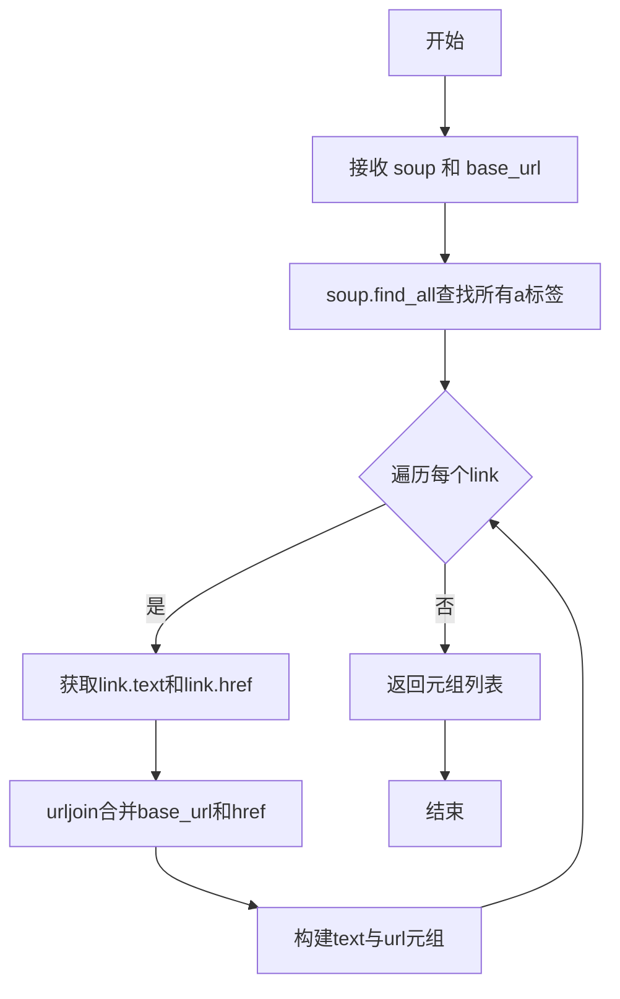

# `.\AutoGPT\classic\forge\forge\content_processing\html.py` 详细设计文档

A lightweight HTML processing module that extracts and formats hyperlinks from BeautifulSoup objects, enabling easy retrieval of web page links with their text and absolute URLs.

## 整体流程

```mermaid
graph TD
    A[开始] --> B[调用 extract_hyperlinks]
B --> C{遍历所有 <a> 标签}
C --> D[获取链接文本和 href 属性]
D --> E[使用 urljoin 转换相对 URL 为绝对 URL]
E --> F[返回 (link_text, link_url) 元组列表]
F --> G[调用 format_hyperlinks]
G --> H{遍历 hyperlinks 列表}
H --> I[去除文本空格并格式化字符串]
I --> J[返回格式化后的字符串列表]
J --> K[结束]
```

## 类结构

```
该文件为模块文件，无类层次结构
仅有模块级函数：
├── extract_hyperlinks
└── format_hyperlinks
```

## 全局变量及字段


### `BeautifulSoup`
    
HTML/XML parser from bs4 library, used for parsing and navigating HTML documents

类型：`type`
    


### `urljoin`
    
Constructs absolute URL by combining base URL with relative URL path

类型：`function`
    


### `extract_hyperlinks`
    
Extracts all hyperlinks (anchor tags with href attributes) from a BeautifulSoup object

类型：`function`
    


### `format_hyperlinks`
    
Formats extracted hyperlinks into readable strings with text and URL

类型：`function`
    


    

## 全局函数及方法


### `extract_hyperlinks`

该函数接收一个 BeautifulSoup 对象和基础 URL，遍历所有包含 href 属性的 `<a>` 标签，使用 urljoin 将相对路径转换为绝对 URL，并返回一个包含 (链接文本, 完整 URL) 元组的列表。

**参数：**

- `soup`：`BeautifulSoup`，待处理的 BeautifulSoup 对象，从中提取超链接
- `base_url`：`str`，用于将相对路径转换为绝对 URL 的基础 URL

**返回值：** `list[tuple[str, str]]`，提取的超链接列表，每个元素为 (链接文本, 绝对 URL) 的元组

#### 流程图



#### 带注释源码

```python
def extract_hyperlinks(soup: BeautifulSoup, base_url: str) -> list[tuple[str, str]]:
    """Extract hyperlinks from a BeautifulSoup object

    Args:
        soup (BeautifulSoup): The BeautifulSoup object
        base_url (str): The base URL

    Returns:
        List[Tuple[str, str]]: The extracted hyperlinks
    """
    # 使用列表推导式，遍历所有包含href属性的<a>标签
    # 对每个链接：link.text获取链接文本，urljoin将相对href转为完整URL
    return [
        (link.text, urljoin(base_url, link["href"]))
        for link in soup.find_all("a", href=True)
    ]
```


### `format_hyperlinks`

该函数接收一个包含元组（链接文本，链接URL）的列表，并将每个元组格式化为用户可读的字符串格式，格式为"链接文本 (链接URL)"，同时对链接文本进行去除首尾空白处理。

参数：

- `hyperlinks`：`list[tuple[str, str]]`，待格式化的超链接列表，每个元素为包含链接文本和链接URL的元组

返回值：`list[str]`，格式化后的超链接字符串列表

#### 流程图

```mermaid
flowchart TD
    A[开始] --> B[接收hyperlinks列表]
    B --> C{列表是否为空?}
    C -->|是| D[返回空列表]
    C -->|否| E[遍历hyperlinks中的每个元组]
    E --> F[提取link_text和link_url]
    F --> G[对link_text调用strip方法去除空白]
    G --> H[格式化为 "link_text (link_url)"]
    H --> I[添加到结果列表]
    I --> J{是否还有更多元组?}
    J -->|是| E
    J -->|否| K[返回结果列表]
    K --> L[结束]
```

#### 带注释源码

```python
def format_hyperlinks(hyperlinks: list[tuple[str, str]]) -> list[str]:
    """Format hyperlinks to be displayed to the user
    
    该函数将超链接元组列表转换为用户友好的字符串格式。
    每个元组包含(链接文本, 链接URL)，输出格式为"文本 (URL)"。
    
    Args:
        hyperlinks (List[Tuple[str, str]]): 待格式化的超链接列表，
            每个元素是一个二元元组，第一个元素为链接显示文本，
            第二个元素为链接的URL地址
            
    Returns:
        List[str]: 格式化后的超链接字符串列表，
            每个元素格式为"链接文本 (链接URL)"
    """
    # 使用列表推导式遍历每个超链接元组
    # 对每个元组解包为link_text和link_url
    # 对link_text调用strip()去除首尾空白字符
    # 格式化为 "文本 (URL)" 的字符串格式
    return [f"{link_text.strip()} ({link_url})" for link_text, link_url in hyperlinks]
```

## 关键组件


### 超链接提取功能

从BeautifulSoup解析的HTML文档中提取所有带有href属性的锚点标签，返回由链接文本和完整URL组成的元组列表。核心依赖urljoin进行相对URL到绝对URL的转换。

### 超链接格式化功能

将提取出的超链接元组列表转换为用户可读的字符串格式，每个元素呈现为"链接文本 (URL)"的形式。包含文本空白符 strip 处理以确保输出整洁。

### BeautifulSoup 解析集成

代码接收 BeautifulSoup 对象作为输入，调用 find_all("a", href=True) 方法筛选有效链接。设计良好的参数类型注解支持静态类型检查，函数签名清晰明确。

### URL 相对路径处理

使用 requests.compat.urljoin 实现相对URL向绝对URL的安全转换，处理 base_url 与相对路径的拼接逻辑，确保提取的链接可直接访问。

### 列表推导式优化

提取和格式化函数均采用列表推导式实现，代码简洁高效。extract_hyperlinks 一次性完成查找和转换，format_hyperlinks 集成 strip 处理减少遍历次数。


## 问题及建议


### 已知问题

-   **错误处理不足**：代码未对异常输入进行验证，未处理 `BeautifulSoup` 对象为 `None`、`base_url` 为空或非法、URL 解析失败等情况
-   **类型安全缺失**：函数参数和返回值均未使用 `Optional` 类型声明，无法处理 `None` 输入
-   **功能局限性**：仅提取 `<a>` 标签的 `href` 属性，忽略了 `<link>`、`<area>` 等其他包含链接的元素
-   **缺少去重逻辑**：提取的链接可能存在重复，未提供去重功能
-   **URL 验证缺失**：未验证 `href` 属性的有效性，对于无效 URL 可能产生不可预期的结果
-   **缺少单元测试**：代码未包含任何测试用例

### 优化建议

-   添加输入验证：检查 `soup` 和 `base_url` 是否为有效对象，对无效输入抛出有意义的异常或返回空列表
-   完善类型注解：使用 `Optional` 类型声明可选参数和返回值，增加代码可读性和类型安全
-   扩展链接提取范围：考虑提取 `<link>`、`<area>`、`` (srcset) 等元素的链接
-   添加去重功能：提供可选参数或在提取后进行 URL 去重
-   增加 URL 验证：使用 `urllib.parse` 或正则表达式验证提取的 URL 格式是否合法
-   编写单元测试：为两个函数编写全面的测试用例，覆盖正常输入、边界情况和异常输入

## 其它


### 设计目标与约束

- **主要目标**：提供从HTML文档中提取和格式化超链接的功能，支持在爬虫或HTML解析场景中快速获取页面链接信息
- **约束条件**：
  - 依赖BeautifulSoup4和requests库
  - 输入的soup对象必须为有效的BeautifulSoup解析结果
  - base_url用于相对URL转换为绝对URL，必须为有效的URL格式

### 错误处理与异常设计

- **URL处理异常**：当base_url格式无效或link["href"]为无效URL时，urljoin可能返回异常结果，但当前代码未做额外处理
- **输入验证缺失**：未对soup对象类型、base_url类型进行运行时检查
- **空值处理**：当soup中不存在带href属性的a标签时，返回空列表，符合预期

### 数据流与状态机

- **数据输入**：外部传入BeautifulSoup对象和base_url字符串
- **处理流程**：
  1. find_all查找所有a标签（带href属性）
  2. 对每个链接使用urljoin合并base_url和href为绝对URL
  3. 提取link.text作为显示文本
  4. format_hyperlinks对元组列表进行字符串格式化
- **数据输出**：返回格式化后的字符串列表

### 外部依赖与接口契约

- **第三方库依赖**：
  - bs4 (BeautifulSoup4)：HTML/XML解析
  - requests.compat：URL处理工具
- **接口契约**：
  - extract_hyperlinks：输入有效的BeautifulSoup对象和非空base_url，返回list[tuple[str, str]]
  - format_hyperlinks：输入超链接元组列表，返回格式化字符串列表

### 性能考虑

- **算法复杂度**：O(n)，n为HTML中a标签数量
- **内存效率**：列表推导式一次性构建结果列表，避免中间变量
- **潜在优化点**：对于大型HTML文档，可考虑使用生成器替代列表推导式以降低内存占用

### 安全性考虑

- **URL安全**：urljoin可处理javascript:等伪协议，未做额外过滤
- **XSS风险**：直接使用link.text可能包含恶意脚本内容，建议进行HTML转义
- **建议**：添加URL白名单验证或URL类型过滤

### 兼容性考虑

- **Python版本**：使用from __future__ import annotations支持Python 3.7+
- **类型注解**：使用list[tuple[str, str]]语法，需Python 3.9+或from __future__ import annotations

### 测试策略建议

- **单元测试**：应覆盖正常HTML、嵌套标签、空HTML、无href属性的a标签等场景
- **边界测试**：空soup对象、异常base_url、超长文本的链接等
- **集成测试**：与实际HTTP请求流程集成测试

### 配置与扩展性

- **函数设计**：纯函数设计，无状态，易于测试和复用
- **扩展建议**：可添加过滤参数（如只返回特定域名的链接）、可添加去重功能


    