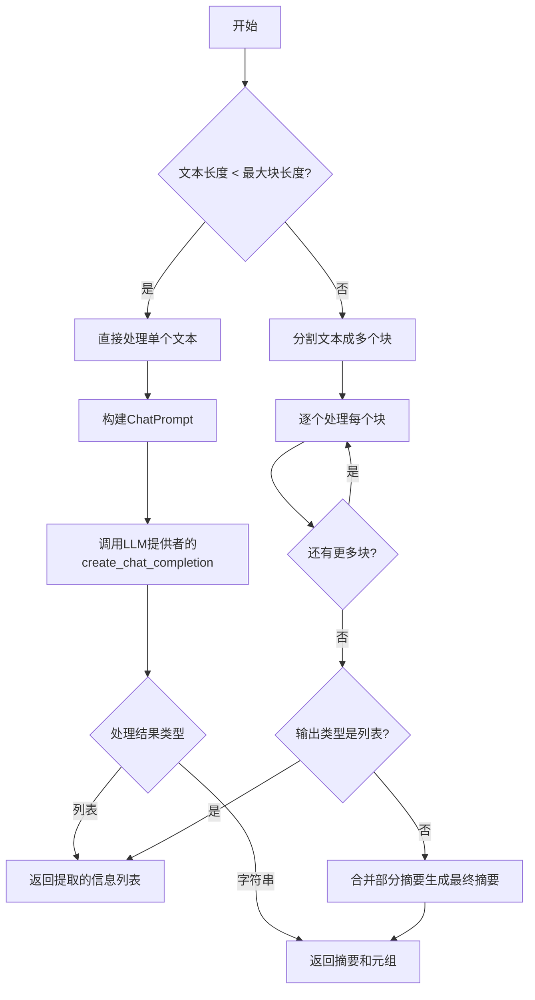
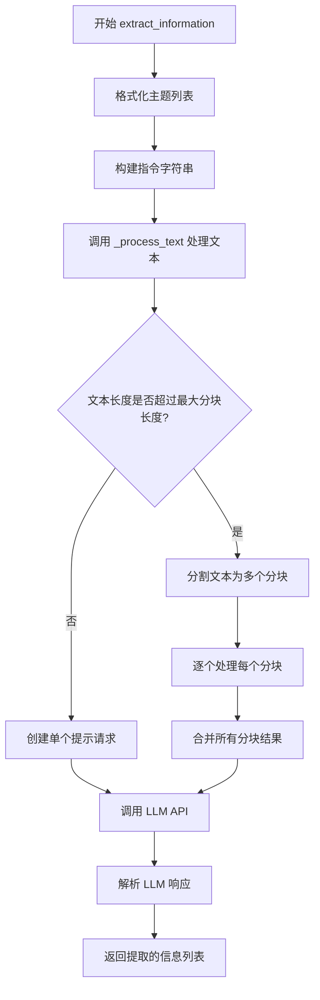

# `.\AutoGPT\classic\forge\forge\content_processing\text.py` 详细设计文档

该模块提供文本处理功能，包括文本分块、摘要和信息提取。通过使用LLM（大型语言模型）和spaCy进行句子分割，将长文本分割成合适的块进行处理，支持重叠处理以保持上下文连贯性，最终返回摘要或提取的信息。

## 整体流程



## 类结构

```
无类定义
└── 模块级函数集合
    ├── batch - 批处理工具函数
    ├── chunk_content - Token级别分块
    ├── split_text - 句子级别分块
    ├── summarize_text - 文本摘要入口
    ├── extract_information - 信息提取入口
    └── _process_text - 核心处理逻辑
```

## 全局变量及字段


### `T`
    
TypeVar类型变量，用于泛型批处理函数batch()，允许函数处理不同类型的元素列表

类型：`TypeVar`
    


### `logger`
    
模块级日志记录器，用于记录函数执行过程中的调试和信息日志

类型：`logging.Logger`
    


### `MAX_OVERLAP`
    
常量200，限制重叠token数以节省资源，在chunk_content函数中使用

类型：`int`
    


    

## 全局函数及方法


### `batch`

将输入序列按照指定的最大批次长度和可选的重叠量进行分批处理的生成器函数。

参数：

- `sequence`：`list[T]`，待分批处理的输入序列，类型为泛型列表
- `max_batch_length`：`int`，每个批次的最大长度，必须至少为 1
- `overlap`：`int`，相邻批次之间的重叠元素数量，默认为 0

返回值：`Iterator[list[T]]`，返回分批后的子序列迭代器，最后一个批次可能短于指定长度

#### 流程图

```mermaid
flowchart TD
    A[开始 batch 函数] --> B{检查 max_batch_length >= 1?}
    B -->|否| C[抛出 ValueError: n must be at least one]
    B -->|是| D[初始化 i = 0]
    D --> E{i < len(sequence)?}
    E -->|是| F[计算批次结束位置: end = i + max_batch_length]
    F --> G[yield sequence[i:end] 子列表]
    G --> H[i = i + max_batch_length - overlap]
    H --> E
    E -->|否| I[结束生成器]
    C --> J[异常处理完成]
```

#### 带注释源码

```python
def batch(
    sequence: list[T], max_batch_length: int, overlap: int = 0
) -> Iterator[list[T]]:
    """
    Batch data from iterable into slices of length N. The last batch may be shorter.

    Example: `batched('ABCDEFGHIJ', 3)` --> `ABC DEF GHI J`
    """
    # 验证参数有效性：批次长度必须至少为 1
    if max_batch_length < 1:
        raise ValueError("n must be at least one")
    
    # 使用 range 生成起始索引，每次步进 = max_batch_length - overlap
    # 当 overlap=0 时，等同于标准的 range(0, len(sequence), max_batch_length)
    for i in range(0, len(sequence), max_batch_length - overlap):
        # 切片获取当前批次的子序列
        yield sequence[i : i + max_batch_length]
```

### 关键组件信息

| 名称 | 描述 |
|------|------|
| `batch` | 核心分批生成器函数 |
| `chunk_content` | 基于 token 长度进行内容分块的辅助函数 |
| `split_text` | 使用 spaCy 进行句子级别文本分块的函数 |

### 潜在技术债务与优化空间

1. **边界条件处理**：当 `overlap >= max_batch_length` 时会导致无限循环，当前实现未做防护（虽然文档暗示 overlap 应小于 max_batch_length）
2. **泛型类型支持**：仅支持 `list[T]` 输入，未对其他可迭代对象提供直接支持
3. **性能优化**：对于超大序列，可考虑使用 `itertools` 相关的工具或流式处理减少内存占用
4. **错误信息**：ValueError 的错误信息仍使用 "n" 而非 "max_batch_length"，存在命名不一致

### 其他项目

- **设计目标**：提供一种简单高效的方式将长序列拆分为固定大小的批次，便于批量处理
- **约束**：`max_batch_length >= 1`，`overlap >= 0` 且通常应小于 `max_batch_length`
- **错误处理**：当 `max_batch_length < 1` 时抛出 `ValueError`
- **数据流**：输入序列 → 分批迭代器 → 消费者函数（如 `_process_text` 中的 chunk 处理）


### `chunk_content`

按token长度将内容分割为近似等长的文本块的生成器函数。

参数：

- `content`：`str`，要分割的文本内容
- `max_chunk_length`：`int`，每个文本块的最大token长度限制
- `tokenizer`：`ModelTokenizer`，用于对文本进行编码（encode）和解码（decode）的tokenizer实例
- `with_overlap`：`bool`，是否允许块之间存在重叠，默认为 `True`

返回值：`Iterator[tuple[str, int]]`，返回一个迭代器，每次迭代 yields 一个元组，包含（分割后的文本块字符串，该块的token长度）

#### 流程图

```mermaid
flowchart TD
    A[开始 chunk_content] --> B[设置 MAX_OVERLAP = 200]
    B --> C[使用 tokenizer.encode 将 content 转换为 token 列表]
    C --> D[计算 total_length = tokenized_text 长度]
    D --> E[计算 n_chunks = ceil(total_length / max_chunk_length)]
    E --> F[计算 chunk_length = ceil(total_length / n_chunks)]
    F --> G{with_overlap 是否为 True?}
    G -->|是| H[overlap = min(max_chunk_length - chunk_length, MAX_OVERLAP)]
    G -->|否| I[overlap = 0]
    H --> J[调用 batch 函数生成 token_batch]
    I --> J
    J --> K[对每个 token_batch 执行]
    K --> L[tokenizer.decode 将 token_batch 转换为字符串]
    K --> M[获取 len(token_batch) 作为长度]
    L --> N[yield (decoded_text, token_length)]
    N --> K
    K --> O[结束]
```

#### 带注释源码

```python
def chunk_content(
    content: str,
    max_chunk_length: int,
    tokenizer: ModelTokenizer,
    with_overlap: bool = True,
) -> Iterator[tuple[str, int]]:
    """Split content into chunks of approximately equal token length."""

    # 定义最大重叠token数，用于节省tokens
    MAX_OVERLAP = 200  # limit overlap to save tokens

    # 使用tokenizer将文本内容编码为token列表
    tokenized_text = tokenizer.encode(content)
    # 计算文本的总token长度
    total_length = len(tokenized_text)
    # 计算需要分割成的块数（向上取整）
    n_chunks = math.ceil(total_length / max_chunk_length)

    # 计算每个块的基准长度（近似等分）
    chunk_length = math.ceil(total_length / n_chunks)
    # 计算重叠token数：如果允许重叠，则取 (max_chunk_length - chunk_length) 和 MAX_OVERLAP 中的较小值；否则为0
    overlap = min(max_chunk_length - chunk_length, MAX_OVERLAP) if with_overlap else 0

    # 遍历由batch函数生成的每个token批次
    for token_batch in batch(tokenized_text, chunk_length + overlap, overlap):
        # 将token批次解码回字符串，并返回该批次的token长度
        yield tokenizer.decode(token_batch), len(token_batch)
```


### `split_text`

将文本按句子分割成多个文本块，每个文本块的 token 长度不超过指定的最大长度。该函数使用 spaCy 进行句子分割，使用 tokenizer 计算 token 长度，支持可选的重叠功能。

参数：

- `text`：`str`，要分割的原始文本
- `max_chunk_length`：`int`，每个文本块的最大 token 长度
- `tokenizer`：`ModelTokenizer`，用于编码文本并计算 token 长度的分词器
- `spacy_model`：`str`，用于句子分割的 spaCy 模型名称，默认为 "en_core_web_sm"
- `with_overlap`：`bool`，是否在相邻文本块之间保留重叠内容，默认为 True

返回值：`Iterator[tuple[str, int]]`，生成器迭代器，每yield一个元组包含 (文本块内容, 该文本块的token长度)

#### 流程图

```mermaid
flowchart TD
    A[开始 split_text] --> B{文本token长度<br/>小于 max_chunk_length?}
    B -->|是| C[yield 原始文本<br/>直接返回]
    B -->|否| D[计算目标块长度<br/>n_chunks = ceil总长度/最大长度]
    D --> E[加载spaCy模型<br/>添加sentencizer管道]
    E --> F[使用spaCy<br/>分割句子列表]
    F --> G[初始化当前块为空<br/>当前块长度为0]
    G --> H{遍历所有句子<br/>i < len(sentences)}
    
    H -->|是| I[计算当前句子token长度<br/>sentence_length]
    I --> J{预期块长度<br/>小于 max_chunk_length<br/>且接近目标长度?}
    J -->|是| K[将句子加入当前块<br/>更新当前块长度]
    J -->|否| L{句子长度<br/>小于 max_chunk_length?}
    
    L -->|是| M[yield 当前块内容<br/>重置当前块]
    M --> N{with_overlap<br/>是否开启重叠?}
    N -->|是| O[计算允许的重叠长度<br/>尝试添加上一句]
    N -->|否| P[将当前句子加入新块]
    O --> P
    P --> Q[更新当前块长度<br/>last_sentence更新]
    Q --> H
    
    L -->|否| R[句子过长<br/>使用chunk_content切分]
    R --> S[将切分后的块<br/>替换原句子位置]
    S --> H
    
    K --> Q
    H -->|否| T{当前块<br/>有内容?}
    T -->|是| U[yield 最后一块]
    T -->|否| V[结束]
    C --> V
    U --> V
```

#### 带注释源码

```python
def split_text(
    text: str,
    max_chunk_length: int,
    tokenizer: ModelTokenizer,
    spacy_model: str = "en_core_web_sm",
    with_overlap: bool = True,
) -> Iterator[tuple[str, int]]:
    """
    Split text into chunks of sentences, with each chunk not exceeding the max length.

    Args:
        text (str): The text to split.
        spacy_model (str): The spaCy model to use for sentence splitting.
        max_chunk_length (int, optional): The maximum length of a chunk.
        tokenizer (ModelTokenizer): Tokenizer to use for determining chunk length.
        with_overlap (bool, optional): Whether to allow overlap between chunks.

    Yields:
        str: The next chunk of text

    Raises:
        ValueError: when a sentence is longer than the maximum length
    """
    # 使用tokenizer编码文本，获取总token长度
    text_length = len(tokenizer.encode(text))

    # 如果文本长度小于最大块长度，直接返回整个文本
    if text_length < max_chunk_length:
        yield text, text_length
        return

    # 计算需要分割成的块数
    n_chunks = math.ceil(text_length / max_chunk_length)
    # 计算目标块长度，使各块尽量均匀
    target_chunk_length = math.ceil(text_length / n_chunks)

    # 加载spaCy模型并添加sentencizer管道用于句子分割
    nlp: spacy.language.Language = spacy.load(spacy_model)
    nlp.add_pipe("sentencizer")
    doc = nlp(text)
    # 提取所有句子文本，去除首尾空白
    sentences = [sentence.text.strip() for sentence in doc.sents]

    # 初始化当前块和状态变量
    current_chunk: list[str] = []
    current_chunk_length = 0
    last_sentence = None
    last_sentence_length = 0

    i = 0
    # 遍历所有句子进行分块
    while i < len(sentences):
        sentence = sentences[i]
        sentence_length = len(tokenizer.encode(sentence))
        # 预期添加当前句子后的块长度（+1表示空格分隔）
        expected_chunk_length = current_chunk_length + 1 + sentence_length

        # 如果预期长度小于最大长度，且接近目标块长度（尝试创建均匀块）
        if (
            expected_chunk_length < max_chunk_length
            # try to create chunks of approximately equal size
            and expected_chunk_length - (sentence_length / 2) < target_chunk_length
        ):
            # 将句子加入当前块
            current_chunk.append(sentence)
            current_chunk_length = expected_chunk_length

        # 如果句子长度小于最大块长度
        elif sentence_length < max_chunk_length:
            # 如果有上一个句子，先yield当前块
            if last_sentence:
                yield " ".join(current_chunk), current_chunk_length
                current_chunk = []
                current_chunk_length = 0

                # 如果启用重叠，处理重叠逻辑
                if with_overlap:
                    # 计算允许的最大重叠长度
                    overlap_max_length = max_chunk_length - sentence_length - 1
                    # 如果上一句足够短，完全加入重叠区
                    if last_sentence_length < overlap_max_length:
                        current_chunk += [last_sentence]
                        current_chunk_length += last_sentence_length + 1
                    # 否则如果还有足够空间，切分上一句取尾部
                    elif overlap_max_length > 5:
                        # add as much from the end of the last sentence as fits
                        current_chunk += [
                            list(
                                chunk_content(
                                    content=last_sentence,
                                    max_chunk_length=overlap_max_length,
                                    tokenizer=tokenizer,
                                )
                            ).pop()[0],
                        ]
                        current_chunk_length += overlap_max_length + 1

            # 将当前句子加入新块
            current_chunk += [sentence]
            current_chunk_length += sentence_length

        else:  # sentence longer than maximum length -> chop up and try again
            # 句子过长，使用chunk_content进一步切分，替换原位置
            sentences[i : i + 1] = [
                chunk
                for chunk, _ in chunk_content(sentence, target_chunk_length, tokenizer)
            ]
            continue  # 继续处理替换后的句子

        i += 1
        last_sentence = sentence
        last_sentence_length = sentence_length

    # 处理最后一块
    if current_chunk:
        yield " ".join(current_chunk), current_chunk_length
```


### `summarize_text`

该函数是异步文本摘要的主入口函数，支持通过问题引导的问答式摘要或通用指令式摘要，内部委托给 `_process_text` 执行实际的处理逻辑。

参数：

- `text`：`str`，需要被处理或摘要的输入文本
- `llm_provider`：`MultiProvider`，用于调用大型语言模型的提供方，支持多种模型
- `model_name`：`ModelName`，指定使用的语言模型名称
- `spacy_model`：`str`，用于句子分割的 spaCy 模型名称，默认为 `"en_core_web_sm"`
- `question`：`Optional[str]`，可选参数，若设置则生成针对该问题的答案而非摘要
- `instruction`：`Optional[str]`，可选参数，自定义处理指令，与 `question` 互斥

返回值：`tuple[str, list[tuple[str, str]]]`，返回包含摘要内容字符串和原始文本块列表的元组，其中列表元素为 `(摘要, 原始文本块)` 的元组对

#### 流程图

```mermaid
flowchart TD
    A[开始 summarize_text] --> B{question 是否设置?}
    B -->|是| C{instruction 是否设置?}
    C -->|是| D[抛出 ValueError: question 和 instruction 互斥]
    C -->|否| E[构建问题式指令]
    B -->|否| F{instruction 是否设置?}
    F -->|是| G[使用传入的 instruction]
    F -->|否| H[构建默认摘要指令]
    E --> I[调用 _process_text]
    H --> I
    G --> I
    I --> J[返回结果 tuple[str, list[tuple[str, str]]]]
    
    style D fill:#ffcccc
```

#### 带注释源码

```python
async def summarize_text(
    text: str,
    llm_provider: MultiProvider,
    model_name: ModelName,
    spacy_model: str = "en_core_web_sm",
    question: Optional[str] = None,
    instruction: Optional[str] = None,
) -> tuple[str, list[tuple[str, str]]]:
    """
    异步文本摘要主入口函数。
    
    该函数提供两种处理模式：
    1. 问答模式：当传入 question 参数时，根据给定问题从文本中提取答案
    2. 摘要模式：当仅传入 instruction 或两者都为空时，执行通用摘要
    
    Args:
        text: str，要处理的原始文本
        llm_provider: MultiProvider，LLM服务提供者实例
        model_name: ModelName，要使用的模型标识
        spacy_model: str，spaCy语言模型名称，用于断句
        question: Optional[str]，可选的问题，若设置则生成答案式响应
        instruction: Optional[str]，可选的自定义指令
    
    Returns:
        tuple[str, list[tuple[str, str]]]，返回(摘要内容, [(摘要块, 原文块)])
    
    Raises:
        ValueError: 当同时设置 question 和 instruction 时抛出
    """
    # 如果传入了问题参数，则检查是否同时传入了指令
    if question:
        # question 和 instruction 互斥，不能同时设置
        if instruction:
            raise ValueError(
                "Parameters 'question' and 'instructions' cannot both be set"
            )

        # 构建问题导向的指令模板
        # 要求模型从文本中回答问题，若无答案则明确说明原因
        instruction = (
            f'From the text, answer the question: "{question}". '
            "If the answer is not in the text, indicate this clearly "
            "and concisely state why the text is not suitable to answer the question."
        )
    # 如果既没有问题也没有指令，则使用默认摘要指令
    elif not instruction:
        instruction = (
            "Summarize or describe the text clearly and concisely, "
            "whichever seems more appropriate."
        )

    # 委托给内部处理函数执行实际逻辑
    # _process_text 负责处理单次或分块处理的所有细节
    return await _process_text(  # type: ignore
        text=text,
        instruction=instruction,
        llm_provider=llm_provider,
        model_name=model_name,
        spacy_model=spacy_model,
    )
```


### `extract_information`

这是一个异步信息提取主入口函数，用于从给定的源文本中根据指定的主题列表提取相关信息。该函数通过构建特定的指令提示，引导大语言模型从文本中识别并提取与所列主题相关的内容片段，最终以JSON字符串数组格式返回结果。

参数：

- `source_text`：`str`，需要从中提取信息的源文本内容
- `topics_of_interest`：`list[str]`，感兴趣的主题列表，用于指导信息提取的方向
- `llm_provider`：`MultiProvider`，大语言模型提供者，负责与LLM交互
- `model_name`：`ModelName`，要使用的LLM模型名称
- `spacy_model`：`str`（默认为 `"en_core_web_sm"`），用于句子分割的spaCy模型

返回值：`list[str]`，提取的信息片段列表，每个元素为一个独立的信息片段

#### 流程图



#### 带注释源码

```python
async def extract_information(
    source_text: str,
    topics_of_interest: list[str],
    llm_provider: MultiProvider,
    model_name: ModelName,
    spacy_model: str = "en_core_web_sm",
) -> list[str]:
    """
    异步信息提取主入口函数
    
    该函数接收源文本和感兴趣的主题列表，构建相应的指令提示，
    然后调用 _process_text 函数进行处理，最终返回提取的信息片段列表。
    
    Args:
        source_text: 要从中提取信息的源文本
        topics_of_interest: 感兴趣的主题列表
        llm_provider: LLM提供者实例
        model_name: 使用的模型名称
        spacy_model: spaCy模型名称，默认为 en_core_web_sm
    
    Returns:
        提取的信息片段列表
    """
    # 将主题列表格式化为带星号的列表形式，便于在指令中展示
    fmt_topics_list = "\n".join(f"* {topic}." for topic in topics_of_interest)
    
    # 构建详细的指令字符串，指导LLM如何提取信息
    instruction = (
        "Extract relevant pieces of information about the following topics:\n"
        f"{fmt_topics_list}\n"
        "Reword pieces of information if needed to make them self-explanatory. "
        "Be concise.\n\n"
        "Respond with an `Array<string>` in JSON format AND NOTHING ELSE. "
        'If the text contains no relevant information, return "[]".'
    )
    
    # 调用内部处理函数，指定 output_type 为 list[str] 表示提取信息列表
    return await _process_text(  # type: ignore
        text=source_text,
        instruction=instruction,
        output_type=list[str],
        llm_provider=llm_provider,
        model_name=model_name,
        spacy_model=spacy_model,
    )
```


### `_process_text`

`_process_text` 是一个异步私有核心处理函数，负责使用 LLM API 对文本进行摘要或信息提取。该函数支持自动分块处理长文本，通过递归调用将大文本分割为较小的块，分别处理后再合并结果。

参数：

-  `text`：`str`，要处理的文本内容
-  `instruction`：`str`，用于指导 LLM 处理的指令（如摘要要求或信息提取要求）
-  `llm_provider`：`MultiProvider`，LLM 提供者实例，用于调用大语言模型
-  `model_name`：`ModelName`，要使用的 LLM 模型名称
-  `spacy_model`：`str`，默认为 `"en_core_web_sm"`，用于句子分割的 spaCy 模型
-  `output_type`：`type[str | list[str]]`，默认为 `str`，指定输出类型——`str` 用于摘要，`list[str]` 用于逐条信息提取

返回值：`tuple[str, list[tuple[str, str]]] | list[str]`，摘要模式下返回 `(摘要内容, 原始文本块列表)` 的元组；信息提取模式下返回提取结果字符串列表

#### 流程图

```mermaid
flowchart TD
    A[开始 _process_text] --> B{文本是否为空?}
    B -->|是| C[抛出 ValueError: No content]
    B -->|否| D[计算文本 token 长度]
    D --> E[计算最大 chunk 长度]
    E --> F{文本长度 < 最大 chunk 长度?}
    
    F -->|是| G[构建 ChatPrompt]
    G --> H[调用 LLM API]
    H --> I{output_type == list[str]?}
    I -->|是| J[解析 JSON 列表结果]
    I -->|否| K[返回摘要内容]
    J --> L[返回提取结果列表]
    
    F -->|否| M[调用 split_text 分块]
    M --> N[遍历每个 chunk]
    N --> O[递归调用 _process_text 处理单个 chunk]
    O --> P[收集处理结果]
    N --> Q{所有 chunk 已处理?}
    Q -->|否| N
    Q -->|是| R{output_type == list[str]?}
    
    R -->|是| S[返回所有结果列表]
    R -->|否| T[合并所有摘要]
    T --> U[再次调用 _process_text 合并摘要]
    U --> V[返回最终摘要和原始 chunk 对应关系]
```

#### 带注释源码

```python
async def _process_text(
    text: str,
    instruction: str,
    llm_provider: MultiProvider,
    model_name: ModelName,
    spacy_model: str = "en_core_web_sm",
    output_type: type[str | list[str]] = str,
) -> tuple[str, list[tuple[str, str]]] | list[str]:
    """Process text using the OpenAI API for summarization or information extraction

    Params:
        text (str): The text to process.
        instruction (str): Additional instruction for processing.
        llm_provider: LLM provider to use.
        model_name: The name of the llm model to use.
        spacy_model: The spaCy model to use for sentence splitting.
        output_type: `str` for summaries or `list[str]` for piece-wise info extraction.

    Returns:
        For summarization: tuple[str, None | list[(summary, chunk)]]
        For piece-wise information extraction: list[str]
    """
    # 检查文本是否为空，若为空则抛出异常
    if not text.strip():
        raise ValueError("No content")

    # 计算输入文本的 token 数量，用于判断是否需要分块
    text_tlength = llm_provider.count_tokens(text, model_name)
    logger.debug(f"Text length: {text_tlength} tokens")

    # 计算单次处理的最大 chunk 长度（模型上限 - 预留 token - 安全边距）
    max_result_tokens = 500
    max_chunk_length = llm_provider.get_token_limit(model_name) - max_result_tokens - 50
    logger.debug(f"Max chunk length: {max_chunk_length} tokens")

    # 短文本处理分支：直接调用 LLM 进行处理
    if text_tlength < max_chunk_length:
        # 构建 ChatPrompt，包含系统指令和用户输入
        prompt = ChatPrompt(
            messages=[
                ChatMessage.system(
                    "The user is going to give you a text enclosed in triple quotes. "
                    f"{instruction}"
                ),
                ChatMessage.user(f'"""{text}"""'),
            ]
        )

        logger.debug(f"PROCESSING:\n{prompt}")

        # 调用 LLM 提供者的聊天完成接口
        response = await llm_provider.create_chat_completion(
            model_prompt=prompt.messages,
            model_name=model_name,
            temperature=0.5,
            max_output_tokens=max_result_tokens,
            # 根据 output_type 配置解析器：list 类型需要从 JSON 解析
            completion_parser=lambda s: (
                extract_list_from_json(s.content) if output_type is not str else None
            ),
        )

        # 处理不同输出类型的结果
        if isinstance(response.parsed_result, list):
            # 信息提取模式：返回解析后的列表结果
            logger.debug(f"Raw LLM response: {repr(response.response.content)}")
            fmt_result_bullet_list = "\n".join(f"* {r}" for r in response.parsed_result)
            logger.debug(
                f"\n{'-'*11} EXTRACTION RESULT {'-'*12}\n"
                f"{fmt_result_bullet_list}\n"
                f"{'-'*42}\n"
            )
            return response.parsed_result
        else:
            # 摘要模式：返回摘要内容和原文对应关系
            summary = response.response.content
            logger.debug(f"\n{'-'*16} SUMMARY {'-'*17}\n{summary}\n{'-'*42}\n")
            return summary.strip(), [(summary, text)]
    else:
        # 长文本处理分支：需要分块处理
        # 使用 split_text 将文本分割成多个 chunk
        chunks = list(
            split_text(
                text,
                max_chunk_length=max_chunk_length,
                tokenizer=llm_provider.get_tokenizer(model_name),
                spacy_model=spacy_model,
            )
        )

        processed_results = []
        # 逐个处理每个 chunk
        for i, (chunk, _) in enumerate(chunks):
            logger.info(f"Processing chunk {i + 1} / {len(chunks)}")
            # 递归调用处理每个 chunk
            chunk_result = await _process_text(
                text=chunk,
                instruction=instruction,
                output_type=output_type,
                llm_provider=llm_provider,
                model_name=model_name,
                spacy_model=spacy_model,
            )
            # 收集各 chunk 的处理结果
            processed_results.extend(
                chunk_result if output_type == list[str] else [chunk_result]
            )

        # 合并最终结果
        if output_type == list[str]:
            # 信息提取模式：直接返回所有提取结果
            return processed_results
        else:
            # 摘要模式：将所有部分摘要合并为一个最终摘要
            summary, _ = await _process_text(
                "\n\n".join([result[0] for result in processed_results]),
                instruction=(
                    "The text consists of multiple partial summaries. "
                    "Combine these partial summaries into one."
                ),
                llm_provider=llm_provider,
                model_name=model_name,
                spacy_model=spacy_model,
            )
            # 返回最终摘要和每个 chunk 与其摘要的对应关系
            return summary.strip(), [
                (processed_results[i], chunks[i][0]) for i in range(0, len(chunks))
            ]
```

## 关键组件


### 张量索引与惰性加载

代码采用迭代器模式实现惰性加载，避免一次性加载全部数据到内存。通过`batch`、`chunk_content`和`split_text`函数使用`yield`关键字分批生成数据，其中`split_text`函数将文本按句子边界分割并通过迭代器逐块返回，实现高效的张量索引访问。

### Token管理与长度控制

使用`ModelTokenizer`对文本进行token编码和解码，通过`llm_provider.count_tokens()`和`llm_provider.get_token_limit()`获取token数量和模型限制。`chunk_content`函数基于token长度进行分块，确保每个chunk不超过指定的最大token数。

### 重叠分块策略

`split_text`函数实现了带重叠的分块机制，通过`with_overlap`参数控制。当启用重叠时，会将前一个chunk的最后一部分（`last_sentence`）加入到当前chunk中，并使用`chunk_content`函数对过长的句子进行二次分割，确保关键信息的连续性。

### LLM调用与结果解析

通过`llm_provider.create_chat_completion()`调用大语言模型，使用`ChatPrompt`构建提示词，支持`completion_parser`参数进行结果解析。`_process_text`函数根据`output_type`参数选择返回类型（str或list[str]），并通过`extract_list_from_json`解析JSON格式的提取结果。

### 递归分块与聚合处理

对于超过最大token限制的文本，代码采用递归分块策略：先调用`split_text`将文本分割成多个chunk，然后对每个chunk递归调用`_process_text`进行处理，最后对所有部分结果进行聚合（summarization时合并所有summary，extraction时extend所有结果）。

### spaCy句子分割

`split_text`函数使用spaCy的`sentencizer`管道对文本进行句子级别的分割，将文本分解为句子列表后再进行分块，确保语义完整性。`summarize_text`和`extract_information`函数默认使用`en_core_web_sm`模型。

### 异常处理与输入验证

代码包含多项输入验证：`batch`函数检查`max_batch_length`必须至少为1；`_process_text`函数检查输入文本不能为空；`summarize_text`函数检查`question`和`instruction`不能同时设置。

### 日志记录与调试支持

使用Python标准日志模块记录处理过程的关键信息，包括文本token长度、最大chunk长度、处理进度、原始LLM响应以及最终结果，方便调试和监控。


## 问题及建议


### 已知问题

- **递归栈溢出风险**：`_process_text` 函数对长文本进行递归调用处理，但没有设置最大递归深度限制。当文本被分割成大量 chunks 时，可能导致递归栈溢出。
- **batch 函数死循环隐患**：当 `overlap >= max_batch_length` 时，`batch` 函数中的 `range(0, len(sequence), max_chunk_length - overlap)` 会产生零或负数步长，导致死循环或无意义迭代。
- **spaCy 模型重复加载**：每次调用 `split_text` 都会重新加载 spaCy 模型 (`spacy.load(spacy_model)`)，这在处理大量文本时会造成严重的性能开销。
- **递归处理效率低下**：长文本采用递归方式逐块处理，后续还需要再次调用 LLM 进行汇总，整体时间复杂度较高且延迟明显。
- **硬编码配置值**：`MAX_OVERLAP = 200` 和 `max_result_tokens = 500` 被硬编码在函数内部，无法根据不同模型或场景灵活调整。
- **overlap 计算逻辑缺陷**：`chunk_content` 中的 overlap 计算逻辑复杂且可能导致 chunks 大小严重不均匀，实际效果与预期不符。
- **异常处理缺失**：没有处理 LLM API 调用失败、tokenizer 返回异常值、spaCy 模型加载失败等边界情况。
- **split_text 句子切分过细问题**：当单个句子长度超过 `max_chunk_length` 时，会使用 `chunk_content` 递归切分，但此时传入的 `target_chunk_length` 可能远小于原始 `max_chunk_length`，导致逻辑混乱。

### 优化建议

- **消除递归**：将 `_process_text` 的递归处理改为循环迭代方式，使用显式的栈或队列管理 chunks，避免栈溢出风险。
- **修复 batch 函数**：添加参数校验，当 `overlap >= max_batch_length` 时抛出明确的异常或自动调整。
- **缓存 spaCy 模型**：在模块级别或使用缓存机制缓存已加载的 spaCy 模型，避免重复加载。
- **提取配置参数**：将 `MAX_OVERLAP`、`max_result_tokens` 等硬编码值提取为函数参数或配置项，支持灵活配置。
- **简化 chunk_content**：重新设计 overlap 逻辑，确保 chunks 之间的大小更加均匀合理。
- **添加完整异常处理**：为 API 调用、模型加载、tokenization 等关键步骤添加 try-except 异常处理和重试机制。
- **优化日志记录**：统一日志格式，将重复的日志代码封装为辅助函数。

## 其它


### 设计目标与约束

本模块的设计目标是提供一个高效的文本处理框架，支持对长文本进行智能分块、摘要和信息提取。核心约束包括：1）必须支持多种LLM provider；2）分块策略需平衡token限制和语义完整性；3）处理过程中需控制API调用次数以优化成本；4）依赖spacy进行句子级别分割。

### 错误处理与异常设计

模块包含以下异常处理场景：1）batch函数中max_batch_length<1时抛出ValueError；2）空文本输入时抛出ValueError("No content")；3）question和instruction同时设置时抛出ValueError；4）split_text中单句超过max_chunk_length时进行递归切分；5）网络/API错误由MultiProvider层处理。异常设计遵循快速失败原则，在入口处进行参数验证。

### 外部依赖与接口契约

核心依赖包括：1）spacy用于句子分割，需加载en_core_web_sm或类似模型；2）forge.llm模块提供LLM交互能力（MultiProvider、ChatPrompt、ChatMessage）；3）forge.json.parsing提供JSON解析；4）typing标准库。接口契约：batch返回Iterator，chunk_content返回Iterator[tuple[str, int]]，summarize_text和extract_information返回协程结果，split_text返回Iterator[tuple[str, int]]。

### 性能考虑与优化空间

性能关键点：1）token编码是计算密集型操作，被频繁调用；2）递归处理长文本时存在指数级API调用风险；3）chunk_content中的overlap逻辑可进一步优化以减少重复计算。优化建议：1）添加tokenizer结果缓存；2）实现批量并行处理多个chunk；3）限制递归深度并提供降级策略；4）MAX_OVERLAP=200的硬编码应改为可配置参数。

### 安全性考虑

当前模块主要处理文本数据，安全风险较低。需注意：1）LLM输出应进行内容过滤后再返回；2）用户输入的instruction和question需进行长度限制以防止prompt注入；3）日志记录需避免泄露敏感内容（当前debug级别会打印完整prompt和响应）。

### 数据流与状态机

主数据流：输入文本 → token计数 → 判断是否需要分块 → （是）调用split_text分块 → 递归调用_process_text处理各chunk → 合并结果；summarize_text流程：构建instruction → 调用_process_text → 返回(summary, chunks)元组；extract_information流程：构建JSON格式instruction → 调用_process_text → 解析JSON返回list[str]。

### 配置参数说明

关键配置参数：1）max_result_tokens=500控制单次LLM响应长度；2）MAX_OVERLAP=200限制token重叠量；3）temperature=0.5控制生成随机性；4）spacy_model默认"en_core_web_sm"可替换为更大模型以提升精度；5）with_overlap默认为True启用重叠分块。

### 使用示例与调用模式

典型调用模式：1）摘要：await summarize_text(long_text, provider, ModelName.GPT4)；2）问答：await summarize_text(text, provider, model, question="关键信息是什么")；3）信息提取：await extract_information(text, ["主题1", "主题2"], provider, model)。支持流式处理大文档，chunk级联处理后进行最终聚合。


    