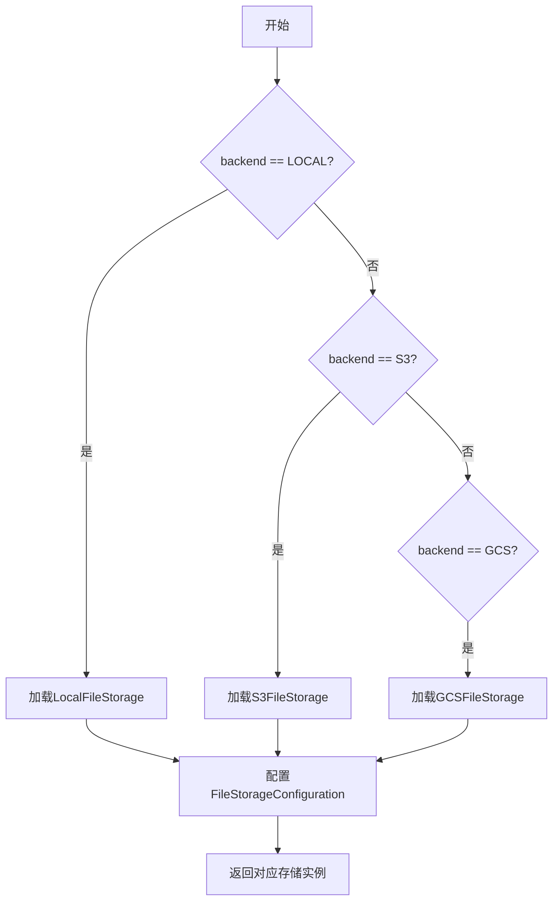
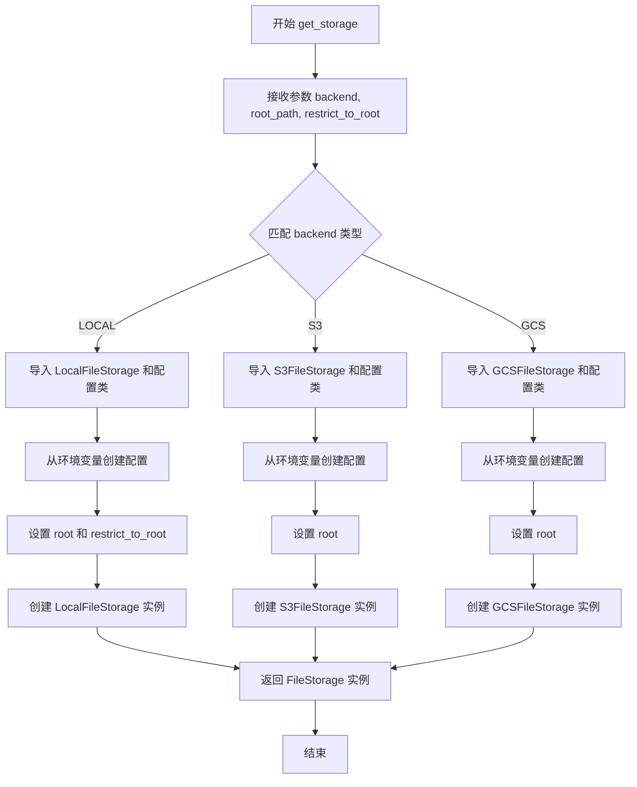

# `.\AutoGPT\classic\forge\forge\file_storage\__init__.py` 详细设计文档

这是一个文件存储后端工厂模块，通过get_storage函数根据传入的backend参数（LOCAL、GCS或S3）动态加载并返回对应的文件存储实现实例，支持配置根路径和访问限制。

## 整体流程



## 类结构

```
FileStorage (抽象基类，由base模块提供)
├── LocalFileStorage (本地存储实现)
├── S3FileStorage (AWS S3存储实现)
└── GCSFileStorage (Google Cloud Storage存储实现)
```

## 全局变量及字段


### `FileStorageBackendName`
    
枚举类，包含LOCAL、GCS、S3三种存储后端类型

类型：`str, enum.Enum`
    


### `get_storage`
    
根据传入的存储后端类型返回对应的FileStorage实例

类型：`function`
    


### `FileStorageBackendName.LOCAL`
    
本地存储后端，值为字符串'local'

类型：`FileStorageBackendName`
    


### `FileStorageBackendName.GCS`
    
Google Cloud Storage存储后端，值为字符串'gcs'

类型：`FileStorageBackendName`
    


### `FileStorageBackendName.S3`
    
AWS S3存储后端，值为字符串's3'

类型：`FileStorageBackendName`
    
    

## 全局函数及方法


### `get_storage`

该函数是一个工厂函数，用于根据指定的存储后端类型创建相应的文件存储实例，支持本地存储（LOCAL）、Amazon S3（S3）和 Google Cloud Storage（GCS）三种后端。

参数：

- `backend`：`FileStorageBackendName`，存储后端类型枚举值
- `root_path`：`Path`，文件存储的根路径，默认为当前目录
- `restrict_to_root`：`bool`，是否限制访问在根路径范围内，默认为 True

返回值：`FileStorage`，返回对应后端的文件存储实例

#### 流程图



#### 带注释源码

```python
import enum
from pathlib import Path

from .base import FileStorage


class FileStorageBackendName(str, enum.Enum):
    """存储后端名称枚举类"""
    LOCAL = "local"
    GCS = "gcs"
    S3 = "s3"


def get_storage(
    backend: FileStorageBackendName,      # 存储后端类型枚举值
    root_path: Path = Path("."),           # 根路径，默认为当前目录
    restrict_to_root: bool = True,        # 是否限制在根目录，默认为 True
) -> FileStorage:
    """
    工厂函数：根据后端类型创建相应的文件存储实例
    
    Args:
        backend: 存储后端类型（LOCAL、S3、GCS）
        root_path: 文件存储的根路径
        restrict_to_root: 是否限制访问在根路径范围内
    
    Returns:
        对应后端的 FileStorage 实例
    """
    # 使用 match 语句匹配后端类型
    match backend:
        case FileStorageBackendName.LOCAL:
            # 本地存储后端处理
            from .local import FileStorageConfiguration, LocalFileStorage
            
            # 从环境变量加载配置
            config = FileStorageConfiguration.from_env()
            # 设置根路径
            config.root = root_path
            # 设置是否限制在根目录
            config.restrict_to_root = restrict_to_root
            # 返回本地文件存储实例
            return LocalFileStorage(config)
        
        case FileStorageBackendName.S3:
            # S3 存储后端处理
            from .s3 import S3FileStorage, S3FileStorageConfiguration
            
            # 从环境变量加载 S3 配置
            config = S3FileStorageConfiguration.from_env()
            # 设置根路径
            config.root = root_path
            # 返回 S3 文件存储实例
            return S3FileStorage(config)
        
        case FileStorageBackendName.GCS:
            # GCS 存储后端处理
            from .gcs import GCSFileStorage, GCSFileStorageConfiguration
            
            # 从环境变量加载 GCS 配置
            config = GCSFileStorageConfiguration.from_env()
            # 设置根路径
            config.root = root_path
            # 返回 GCS 文件存储实例
            return GCSFileStorage(config)
```

## 关键组件


### FileStorageBackendName 枚举类

定义支持的存储后端类型，包括 LOCAL、GCS、S3 三种，用于标识和选择不同的文件存储后端。

### get_storage 工厂函数

根据传入的 backend 参数（FileStorageBackendName 枚举值），动态导入并实例化对应的存储后端类，同时配置 root_path 和 restrict_to_root 参数，返回相应的 FileStorage 实例。

### 存储后端配置类

包括 FileStorageConfiguration（本地存储配置）、S3FileStorageConfiguration（S3 存储配置）和 GCSFileStorageConfiguration（GCS 存储配置），均支持从环境变量加载配置并可动态设置 root 属性。

### 存储后端实现类

包括 LocalFileStorage（本地文件存储）、S3FileStorage（S3 文件存储）和 GCSFileStorage（GCS 文件存储），均继承自 FileStorage 基类，提供统一的文件存储接口。

### Pattern Matching 模式匹配

使用 Python 3.10+ 的 match-case 语法进行后端类型匹配，提供清晰的条件分支逻辑。


## 问题及建议


### 已知问题

-   **动态导入性能问题**：在每次调用 `get_storage()` 函数时都会执行动态导入（import 语句在 match-case 内部），这会导致额外的模块查找开销，应该将导入移到模块顶部或实现导入缓存机制
-   **参数不一致性**：`restrict_to_root` 参数仅在 `LOCAL` 后端中设置，而 `S3` 和 `GCS` 后端未应用此参数，可能导致行为不一致
-   **缺少默认分支**：match-case 语句没有处理未知后端的默认情况，当传入无效的 backend 值时会产生不清晰的 `TypeError` 异常
-   **配置加载无错误处理**：`from_env()` 方法调用没有异常捕获，如果环境变量未设置或配置无效，程序将直接抛出异常
-   **无实例缓存机制**：每次调用 `get_storage()` 都会创建新的存储实例，未实现连接池或实例复用，可能导致资源浪费
-   **类型提示不精确**：返回值类型仅标注为 `FileStorage` 抽象基类，无法在静态分析时获知具体返回的实现类型

### 优化建议

-   **重构导入策略**：将条件导入移至函数外部，或使用 functools.lru_cache 缓存导入的模块，避免重复导入开销
-   **添加默认分支**：在 match-case 中添加 `_` 作为默认分支，处理未知后端并抛出明确的 `ValueError` 异常
-   **统一配置参数**：确保 `restrict_to_root` 参数在所有后端中一致应用，或在不支持的后端中给出明确提示
-   **增加错误处理**：用 try-except 包装 `from_env()` 调用，提供更友好的错误信息或降级方案
-   **实现实例缓存**：使用字典或装饰器缓存已创建的存储实例，根据 backend 和 root_path 作为键进行复用
-   **细化返回类型**：使用 TypeVar 和 overload 装饰器为不同后端提供精确的返回类型提示
-   **添加日志记录**：在关键路径添加日志，便于运行时调试和监控存储实例的创建过程

## 其它


### 设计目标与约束

**设计目标**：提供统一的文件存储抽象接口，通过工厂模式支持多种存储后端（本地、GCS、S3）的灵活切换，使上层业务代码无需关心底层存储实现细节。

**约束条件**：
- 依赖Python 3.10+的match-case语法
- 必须使用项目内部的base.FileStorage抽象基类
- 各后端配置必须从环境变量加载
- root_path参数用于指定存储根目录
- restrict_to_root参数用于限制文件访问范围（仅对LOCAL后端生效）

### 错误处理与异常设计

**异常类型**：
- ImportError：动态导入后端模块失败时抛出
- ValueError：无效的backend枚举值传入match语句时抛出（match会引发MatchError）
- 环境变量缺失异常：各配置类的from_env()方法可能抛出相关异常

**错误传播机制**：
- 底层配置加载错误会直接向上传播
- 不匹配的backend值会导致代码执行失败（隐式MatchError）
- 建议在调用方增加异常捕获和日志记录

### 数据流与状态机

**数据流方向**：
```
调用方 → get_storage() → 配置加载 → 后端实例化 → 返回FileStorage对象
```

**状态转换**：
- 无状态设计，函数每次调用独立创建新的存储实例
- 配置对象在函数内部创建，可复用
- FileStorage实例为有状态对象（包含root_path等配置信息）

**关键决策点**：
- match语句根据backend参数选择具体后端实现

### 外部依赖与接口契约

**接口依赖**：
- 抽象基类：`FileStorage`（来自.base模块）
- 配置类：`FileStorageConfiguration`（LOCAL）、`S3FileStorageConfiguration`（S3）、`GCSFileStorageConfiguration`（GCS）
- 存储实现类：`LocalFileStorage`、`S3FileStorage`、`GCSFileStorage`

**环境变量依赖**（推测）：
- LOCAL后端：可能依赖相关本地路径配置
- S3后端：AWS_ACCESS_KEY_ID、AWS_SECRET_ACCESS_KEY、AWS_REGION等
- GCS后端：GOOGLE_APPLICATION_CREDENTIALS等

**接口契约**：
- get_storage()函数必须返回FileStorage或其子类的实例
- 配置对象的root属性必须被设置为传入的root_path参数
- 所有后端必须实现FileStorage定义的抽象方法

### 安全性考虑

**配置安全**：
- 敏感凭证通过环境变量传递，避免硬编码
- restrict_to_root=True时可防止目录遍历攻击（LOCAL后端）

**访问控制**：
- root_path限制可访问的目录范围
- 云存储后端依赖IAM权限控制

**潜在风险**：
- 环境变量未设置时配置加载可能失败
- 动态导入模块失败时错误信息可能暴露路径信息

### 性能考量

**初始化性能**：
- 每次调用都重新加载配置和创建实例，无缓存机制
- 动态导入模块有一定开销，建议在应用启动时预初始化

**优化建议**：
- 可考虑增加单例模式或实例缓存机制
- 配置对象可复用，减少重复解析环境变量

### 配置管理

**配置加载方式**：
- 使用各后端配置类的from_env()类方法从环境变量加载
- 支持运行时动态覆盖root_path参数

**配置覆盖优先级**：
- 函数参数（root_path） > 环境变量配置 > 默认值

**配置验证**：
- 依赖各配置类的内部验证逻辑
- 建议增加配置合法性检查

### 可测试性设计

**单元测试策略**：
- 可通过mock配置类的from_env()方法进行测试
- 可使用patch动态导入的模块进行测试

**测试覆盖点**：
- 三种后端的实例化逻辑
- 参数传递正确性（root_path、restrict_to_root）
- 异常情况处理

**测试建议**：
- 增加对无效backend值的测试
- 增加对配置加载失败的异常测试

    