# `.\AutoGPT\classic\forge\forge\file_storage\base.py` 详细设计文档

该代码定义了一个抽象的文件存储接口FileStorage，提供了本地和云端文件存储的统一抽象，包含文件的读写、删除、列表、复制、重命名等操作，并通过FileSyncHandler实现本地目录与存储之间的文件同步功能。

## 整体流程

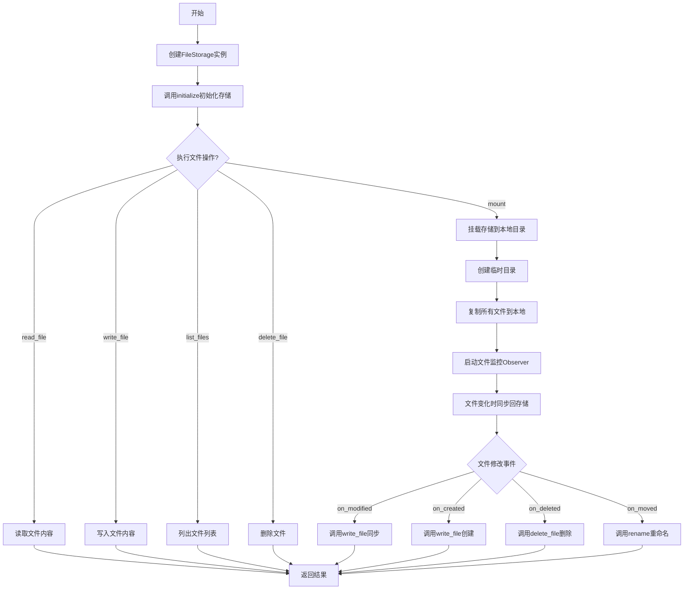
```mermaid
graph TD
    A[开始] --> B[创建FileStorage实例]
    B --> C[调用initialize初始化存储]
    C --> D{执行文件操作?}
    D -->|read_file| E[读取文件内容]
    D -->|write_file| F[写入文件内容]
    D -->|list_files| G[列出文件列表]
    D -->|delete_file| H[删除文件]
    D -->|mount| I[挂载存储到本地目录]
    I --> J[创建临时目录]
    J --> K[复制所有文件到本地]
    K --> L[启动文件监控Observer]
    L --> M[文件变化时同步回存储]
    M --> N{文件修改事件}
    N -->|on_modified| O[调用write_file同步]
    N -->|on_created| P[调用write_file创建]
    N -->|on_deleted| Q[调用delete_file删除]
    N -->|on_moved| R[调用rename重命名]
    E --> S[返回结果]
    F --> S
    G --> S
    H --> S
    O --> S
    P --> S
    Q --> S
    R --> S
```

## 类结构

```
SystemConfiguration (配置基类)
└── FileStorageConfiguration (文件存储配置)
ABC (Python内置抽象基类)
└── FileStorage (文件存储抽象基类)
    └── FileSyncHandler (文件同步处理器)
        └── FileSystemEventHandler (watchdog库)
```

## 全局变量及字段


### `logger`
    
模块级日志记录器，用于记录文件存储操作的日志信息

类型：`logging.Logger`
    


### `FileStorageConfiguration.restrict_to_root`
    
是否限制文件访问在根路径内

类型：`bool`
    


### `FileStorageConfiguration.root`
    
文件存储的根路径

类型：`Path`
    


### `FileStorage.on_write_file`
    
文件写入后的事件钩子

类型：`Callable[[Path], Any] | None`
    


### `FileSyncHandler.storage`
    
关联的FileStorage实例

类型：`FileStorage`
    


### `FileSyncHandler.path`
    
监控的本地路径

类型：`Path`
    
    

## 全局函数及方法


### `FileStorageConfiguration`

该类是一个配置类，用于定义文件存储的行为约束和根目录路径，继承自 `SystemConfiguration`，提供了限制文件访问范围和设置存储根路径的配置项。

参数：无（此类为配置类，不包含实例方法参数）

返回值：无（此类为配置类定义，不包含返回值）

#### 流程图

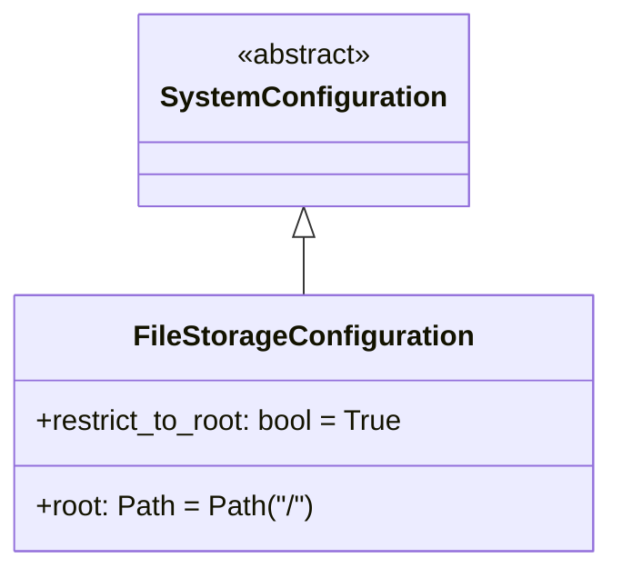
```mermaid
classDiagram
    class SystemConfiguration {
        <<abstract>>
    }
    class FileStorageConfiguration {
        +restrict_to_root: bool = True
        +root: Path = Path("/")
    }
    SystemConfiguration <|-- FileStorageConfiguration
```

#### 带注释源码

```python
class FileStorageConfiguration(SystemConfiguration):
    """文件存储配置类，定义文件存储的根路径和访问限制规则"""
    
    restrict_to_root: bool = True
    """
    是否限制文件访问在根目录范围内
    
    值为 True 时，将限制所有文件操作只能在 root 指定的目录内进行，
    防止路径遍历等安全问题。默认为 True。
    """
    
    root: Path = Path("/")
    """
    文件存储的根目录路径
    
    指定文件存储的基础路径，所有文件操作都基于此路径进行解析。
    默认为根路径 "/"。
    """
```


### `FileStorage`

FileStorage 是一个抽象基类，提供了与文件系统存储交互的接口，定义了文件读写、列表、删除、重命名、复制、目录创建等操作规范，并支持路径安全检查和本地/远程存储的挂载同步。

#### 流程图

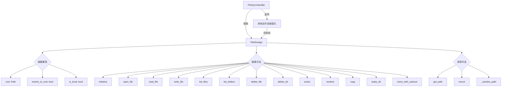
```mermaid
flowchart TD
    A[FileStorage] --> B{抽象属性}
    B --> B1[root: Path]
    B --> B2[restrict_to_root: bool]
    B --> B3[is_local: bool]
    
    A --> C{抽象方法}
    C --> C1[initialize]
    C --> C2[open_file]
    C --> C3[read_file]
    C --> C4[write_file]
    C --> C5[list_files]
    C --> C6[list_folders]
    C --> C7[delete_file]
    C --> C8[delete_dir]
    C --> C9[exists]
    C --> C10[rename]
    C --> C11[copy]
    C --> C12[make_dir]
    C --> C13[clone_with_subroot]
    
    A --> D{具体方法}
    D --> D1[get_path]
    D --> D2[mount]
    D --> D3[_sanitize_path]
    
    E[FileSyncHandler] -->|使用| A
    E -->|监听| F[本地文件系统变化]
    F -->|同步到| A
```

#### 带注释源码

```python
class FileStorage(ABC):
    """A class that represents a file storage."""
    
    # 类字段：事件钩子，写入文件后执行
    on_write_file: Callable[[Path], Any] | None = None
    """
    Event hook, executed after writing a file.

    Params:
        Path: The path of the file that was written, relative to the storage root.
    """

    # ==================== 抽象属性 ====================
    # 子类必须实现以下三个属性
    
    @property
    @abstractmethod
    def root(self) -> Path:
        """The root path of the file storage."""

    @property
    @abstractmethod
    def restrict_to_root(self) -> bool:
        """Whether to restrict file access to within the storage's root path."""

    @property
    @abstractmethod
    def is_local(self) -> bool:
        """Whether the storage is local (i.e. on the same machine, not cloud-based)."""

    # ==================== 抽象方法 ====================
    # 子类必须实现以下方法
    
    @abstractmethod
    def initialize(self) -> None:
        """
        Calling `initialize()` should bring the storage to a ready-to-use state.
        For example, it can create the resource in which files will be stored, if it
        doesn't exist yet. E.g. a folder on disk, or an S3 Bucket.
        """

    # 文件打开操作（多个重载版本）
    @overload
    @abstractmethod
    def open_file(
        self,
        path: str | Path,
        mode: Literal["r", "w"] = "r",
        binary: Literal[False] = False,
    ) -> TextIO:
        """Returns a readable text file-like object representing the file."""

    @overload
    @abstractmethod
    def open_file(
        self, path: str | Path, mode: Literal["r", "w"], binary: Literal[True]
    ) -> BinaryIO:
        """Returns a binary file-like object representing the file."""

    @overload
    @abstractmethod
    def open_file(self, path: str | Path, *, binary: Literal[True]) -> BinaryIO:
        """Returns a readable binary file-like object representing the file."""

    @overload
    @abstractmethod
    def open_file(
        self, path: str | Path, mode: Literal["r", "w"] = "r", binary: bool = False
    ) -> TextIO | BinaryIO:
        """Returns a file-like object representing the file."""

    # 文件读取操作（多个重载版本）
    @overload
    @abstractmethod
    def read_file(self, path: str | Path, binary: Literal[False] = False) -> str:
        """Read a file in the storage as text."""
        ...

    @overload
    @abstractmethod
    def read_file(self, path: str | Path, binary: Literal[True]) -> bytes:
        """Read a file in the storage as binary."""
        ...

    @overload
    @abstractmethod
    def read_file(self, path: str | Path, binary: bool = False) -> str | bytes:
        """Read a file in the storage."""
        ...

    # 文件写入操作（异步）
    @abstractmethod
    async def write_file(self, path: str | Path, content: str | bytes) -> None:
        """Write to a file in the storage."""

    # 文件列表操作
    @abstractmethod
    def list_files(self, path: str | Path = ".") -> list[Path]:
        """List all files (recursively) in a directory in the storage."""

    @abstractmethod
    def list_folders(
        self, path: str | Path = ".", recursive: bool = False
    ) -> list[Path]:
        """List all folders in a directory in the storage."""

    # 文件/目录删除操作
    @abstractmethod
    def delete_file(self, path: str | Path) -> None:
        """Delete a file in the storage."""

    @abstractmethod
    def delete_dir(self, path: str | Path) -> None:
        """Delete an empty folder in the storage."""

    # 文件/目录存在性检查
    @abstractmethod
    def exists(self, path: str | Path) -> bool:
        """Check if a file or folder exists in the storage."""

    # 文件/目录重命名
    @abstractmethod
    def rename(self, old_path: str | Path, new_path: str | Path) -> None:
        """Rename a file or folder in the storage."""

    # 文件/目录复制
    @abstractmethod
    def copy(self, source: str | Path, destination: str | Path) -> None:
        """Copy a file or folder with all contents in the storage."""

    # 目录创建
    @abstractmethod
    def make_dir(self, path: str | Path) -> None:
        """Create a directory in the storage if doesn't exist."""

    # 子根存储克隆
    @abstractmethod
    def clone_with_subroot(self, subroot: str | Path) -> FileStorage:
        """Create a new FileStorage with a subroot of the current storage."""

    # ==================== 具体方法 ====================
    # 以下方法有默认实现
    
    def get_path(self, relative_path: str | Path) -> Path:
        """Get the full path for an item in the storage.

        Parameters:
            relative_path: The relative path to resolve in the storage.

        Returns:
            Path: The resolved path relative to the storage.
        """
        return self._sanitize_path(relative_path)

    @contextmanager
    def mount(self, path: str | Path = ".") -> Generator[Path, Any, None]:
        """Mount the file storage and provide a local path."""
        # 创建临时目录用于本地挂载
        local_path = tempfile.mkdtemp(dir=path)

        observer = Observer()
        try:
            # 将所有文件复制到本地目录
            files = self.list_files()
            for file in files:
                file_path = local_path / file
                file_path.parent.mkdir(parents=True, exist_ok=True)
                content = self.read_file(file, binary=True)
                file_path.write_bytes(content)

            # 设置文件同步事件处理器
            event_handler = FileSyncHandler(self, local_path)
            observer.schedule(event_handler, local_path, recursive=True)
            observer.start()

            yield Path(local_path)
        finally:
            # 清理：停止观察者并删除临时目录
            observer.stop()
            observer.join()
            shutil.rmtree(local_path)

    def _sanitize_path(
        self,
        path: str | Path,
    ) -> Path:
        """Resolve the relative path within the given root if possible.

        Parameters:
            relative_path: The relative path to resolve.

        Returns:
            Path: The resolved path.

        Raises:
            ValueError: If the path is absolute and a root is provided.
            ValueError: If the path is outside the root and the root is restricted.
        """

        # 检查空字节（Posix系统禁止路径中的空字节）
        if "\0" in str(path):
            raise ValueError("Embedded null byte")

        logger.debug(f"Resolving path '{path}' in storage '{self.root}'")

        relative_path = Path(path)

        # 允许绝对路径如果它们在存储范围内
        if (
            relative_path.is_absolute()
            and self.restrict_to_root
            and not relative_path.is_relative_to(self.root)
        ):
            raise ValueError(
                f"Attempted to access absolute path '{relative_path}' "
                f"in storage '{self.root}'"
            )

        # 拼接完整路径
        full_path = self.root / relative_path
        # 本地存储需要resolve，远程存储使用normpath
        if self.is_local:
            full_path = full_path.resolve()
        else:
            full_path = Path(os.path.normpath(full_path))

        logger.debug(f"Joined paths as '{full_path}'")

        # 检查路径是否在存储根目录内
        if self.restrict_to_root and not full_path.is_relative_to(self.root):
            raise ValueError(
                f"Attempted to access path '{full_path}' "
                f"outside of storage '{self.root}'."
            )

        return full_path
```

---

### 关键组件信息

| 名称 | 一句话描述 |
|------|-----------|
| `FileStorageConfiguration` | 继承自SystemConfiguration的配置类，定义存储根路径和访问限制 |
| `FileSyncHandler` | 文件系统事件处理器，用于监听本地文件变化并同步到存储 |
| `on_write_file` | 文件写入后的回调钩子，允许外部订阅写入事件 |

---

### 潜在技术债务与优化空间

1. **FileSyncHandler 中的阻塞调用**：在 `on_modified` 和 `on_created` 方法中，使用 `run_until_complete` 同步等待异步的 `write_file` 操作，这会阻塞事件循环。优化建议：使用 `asyncio.create_task` 非阻塞调度写操作。

2. **挂载同步的单向性**：`mount` 方法目前只实现了从存储到本地目录的同步，缺少从本地目录回写到存储的增量同步机制（虽然监听了变化事件，但未处理所有边界情况）。

3. **路径安全检查的完整性**：`_sanitize_path` 方法未处理符号链接可能导致的路径遍历问题（symlink escape），对于本地存储应额外检查 resolved path 是否仍在 root 内。

4. **异常处理的粒度**：多个抽象方法未定义具体异常类型，子类实现时缺乏统一的错误契约。

5. **类型注解的兼容性**：使用 `str | Path` 和 `list[Path]` 等现代类型注解，需确保运行时 Python 版本 >= 3.10。

---

### 其它项目

#### 设计目标与约束
- **抽象接口**：定义统一的文件存储抽象，支持本地和云端存储实现
- **安全性**：默认限制文件访问在存储根目录内，防止路径遍历攻击
- **事件驱动**：通过 `on_write_file` 钩子支持文件写入后的扩展操作

#### 错误处理与异常设计
- `ValueError`：路径包含空字节、绝对路径越界、访问存储外路径时抛出
- 子类实现需自行处理资源不存在、权限不足等具体存储相关异常

#### 数据流与状态机
- `mount` 方法创建临时本地副本并通过 Watchdog 监听文件变化，实时同步到后端存储
- `_sanitize_path` 作为所有路径操作的中心验证层，确保路径安全

#### 外部依赖
- `watchdog`：文件系统事件监听（Observer、FileSystemEventHandler）
- `tempfile`、`shutil`、`os`、`pathlib`：本地文件操作和临时目录管理
- `asyncio`：异步文件写入支持
- `logging`：调试日志输出


### `FileSyncHandler`

FileSyncHandler 是一个文件系统事件处理器类，继承自 watchdog 库的 FileSystemEventHandler，用于监听本地目录的文件系统变化（创建、修改、删除、移动），并将这些变化同步到 FileStorage 存储后端。

参数：

- `storage`：`FileStorage`，文件系统存储后端实例，用于执行实际的文件操作（写入、删除、重命名等）
- `path`：`str | Path`，要监听变化的本地目录路径，默认为当前目录 "."

返回值：无（该类为事件处理器，通过回调方法处理文件变化，无返回值）

#### 流程图

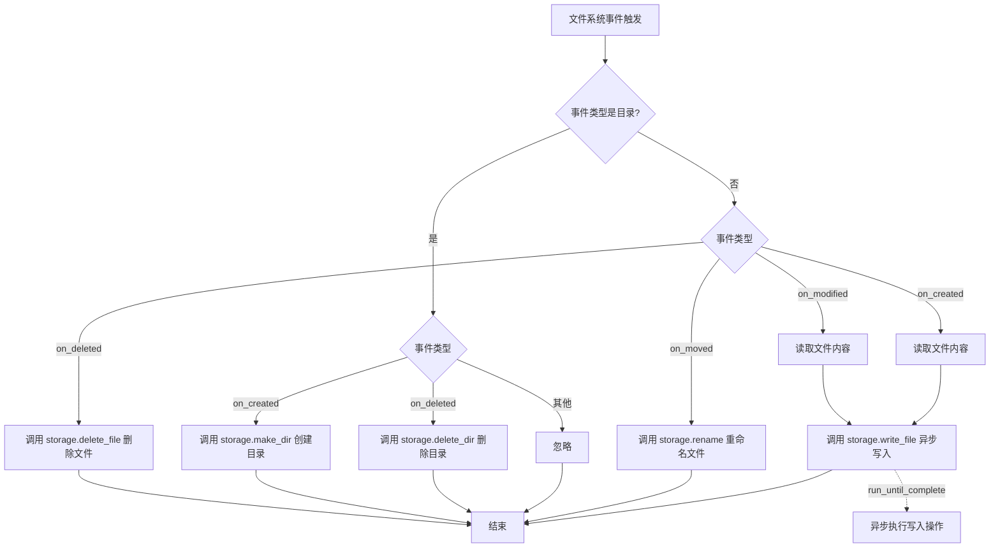
```mermaid
flowchart TD
    A[文件系统事件触发] --> B{事件类型是目录?}
    
    B -->|是| C{事件类型}
    B -->|否| D{事件类型}
    
    C -->|on_created| E[调用 storage.make_dir 创建目录]
    C -->|on_deleted| F[调用 storage.delete_dir 删除目录]
    C -->|其他| G[忽略]
    
    D -->|on_modified| H[读取文件内容]
    D -->|on_created| I[读取文件内容]
    D -->|on_deleted| J[调用 storage.delete_file 删除文件]
    D -->|on_moved| K[调用 storage.rename 重命名文件]
    
    H --> L[调用 storage.write_file 异步写入]
    I --> L
    J --> M[结束]
    E --> M
    F --> M
    G --> M
    K --> M
    L --> M
    
    L -.->|run_until_complete| N[异步执行写入操作]
```

#### 带注释源码

```python
class FileSyncHandler(FileSystemEventHandler):
    """文件系统事件处理器，用于将本地目录的文件变化同步到存储后端"""
    
    def __init__(self, storage: FileStorage, path: str | Path = "."):
        """
        初始化文件同步处理器
        
        参数:
            storage: FileStorage 实例，用于执行文件操作的后端
            path: 要监听变化的本地目录路径
        """
        self.storage = storage
        self.path = Path(path)

    def on_modified(self, event: FileSystemEvent):
        """文件修改事件处理
        
        当监听到文件被修改时，读取本地文件内容并同步到存储后端
        
        参数:
            event: watchdog 的文件系统事件对象
        """
        # 忽略目录修改事件，只处理文件
        if event.is_directory:
            return

        # 计算相对于监听路径的文件路径
        file_path = Path(event.src_path).relative_to(self.path)
        # 读取修改后的文件内容
        content = file_path.read_bytes()
        # 必须同步执行 write_file，因为钩子是同步的
        # TODO: 使用 asyncio.create_task 调度写操作（非阻塞）
        asyncio.get_event_loop().run_until_complete(
            self.storage.write_file(file_path, content)
        )

    def on_created(self, event: FileSystemEvent):
        """文件创建事件处理
        
        当监听到新文件或目录创建时，将新创建的内容同步到存储后端
        
        参数:
            event: watchdog 的文件系统事件对象
        """
        # 如果是目录，创建对应的目录
        if event.is_directory:
            self.storage.make_dir(event.src_path)
            return

        # 计算相对于监听路径的文件路径
        file_path = Path(event.src_path).relative_to(self.path)
        # 读取新创建的文件内容
        content = file_path.read_bytes()
        # 必须同步执行 write_file，因为钩子是同步的
        # TODO: 使用 asyncio.create_task 调度写操作（非阻塞）
        asyncio.get_event_loop().run_until_complete(
            self.storage.write_file(file_path, content)
        )

    def on_deleted(self, event: FileSystemEvent):
        """文件删除事件处理
        
        当监听到文件或目录被删除时，从存储后端删除对应的文件或目录
        
        参数:
            event: watchdog 的文件系统事件对象
        """
        # 如果是目录，删除对应的目录
        if event.is_directory:
            self.storage.delete_dir(event.src_path)
            return

        # 删除文件
        file_path = event.src_path
        self.storage.delete_file(file_path)

    def on_moved(self, event: FileSystemEvent):
        """文件移动/重命名事件处理
        
        当监听到文件或目录被移动或重命名时，在存储后端执行重命名操作
        
        参数:
            event: watchdog 的文件系统事件对象，包含 src_path 和 dest_path
        """
        # 执行重命名操作，将源路径的文件移动到目标路径
        self.storage.rename(event.src_path, event.dest_path)
```


### FileStorage.root

这是一个抽象属性，用于返回文件存储的根路径。子类必须实现此属性以提供具体的存储根目录。

参数： 无

返回值：`Path`，返回文件存储的根路径。

#### 流程图

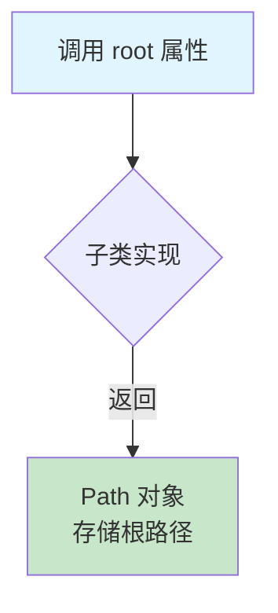
```mermaid
flowchart TD
    A[调用 root 属性] --> B{子类实现}
    B -->|返回| C[Path 对象<br/>存储根路径]
    
    style A fill:#e1f5fe
    style C fill:#c8e6c9
```

#### 带注释源码

```python
@property
@abstractmethod
def root(self) -> Path:
    """The root path of the file storage."""
    
    # @property: 将方法转换为属性，允许通过 self.root 访问
    # @abstractmethod: 抽象方法签名，表示子类必须实现此属性
    # 返回类型: Path - 使用 pathlib.Path 表示文件系统路径
    # 
    # 此属性是 FileStorage 类的核心抽象属性之一
    # 子类（如 LocalFileStorage）需要实现此属性以提供具体的根路径
    # 例如：LocalFileStorage 中可能返回 Path("/data/uploads")
    # 此路径用于：
    # 1. 作为所有文件操作的基准目录
    # 2. 在 _sanitize_path 中验证路径安全性
    # 3. 在 mount() 方法中确定存储的根位置
```


### `FileStorage.restrict_to_root`

该属性是一个抽象属性，用于定义是否限制文件访问在存储根路径内，以确保安全隔离。

参数：无

返回值：`bool`，返回 `True` 表示限制文件访问在根路径内，返回 `False` 表示不限制。

#### 流程图

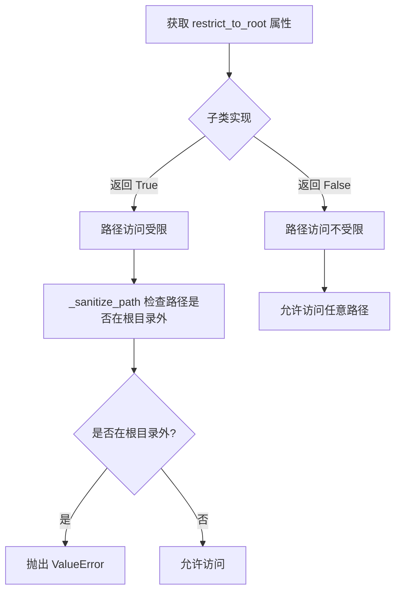
```mermaid
flowchart TD
    A[获取 restrict_to_root 属性] --> B{子类实现}
    B -->|返回 True| C[路径访问受限]
    B -->|返回 False| D[路径访问不受限]
    C --> E[_sanitize_path 检查路径是否在根目录外]
    D --> F[允许访问任意路径]
    E --> G{是否在根目录外?}
    G -->|是| H[抛出 ValueError]
    G -->|否| I[允许访问]
```

#### 带注释源码

```python
@property
@abstractmethod
def restrict_to_root(self) -> bool:
    """Whether to restrict file access to within the storage's root path."""
```

**源码说明：**
- `@property`：装饰器，将方法转换为属性访问
- `@abstractmethod`：装饰器，标记该方法为抽象方法，要求子类必须实现
- 返回类型 `bool`：返回布尔值，表示是否限制文件访问在根路径内
- 文档字符串：描述该属性的用途是确定是否将文件访问限制在存储的根路径内

**相关配置：**
```python
class FileStorageConfiguration(SystemConfiguration):
    restrict_to_root: bool = True  # 默认值为 True，表示限制在根路径
    root: Path = Path("/")         # 根路径默认为根目录
```

**使用场景：**
在 `_sanitize_path` 方法中会检查该属性：
```python
if self.restrict_to_root and not full_path.is_relative_to(self.root):
    raise ValueError(
        f"Attempted to access path '{full_path}' "
        f"outside of storage '{self.root}'."
    )
```


### `FileStorage.is_local`

抽象属性，用于判断当前存储是否为本地存储（即位于同一台机器上，而非云存储）。

参数：无

返回值：`bool`，返回 `True` 表示本地存储，返回 `False` 表示远程/云存储。

#### 流程图

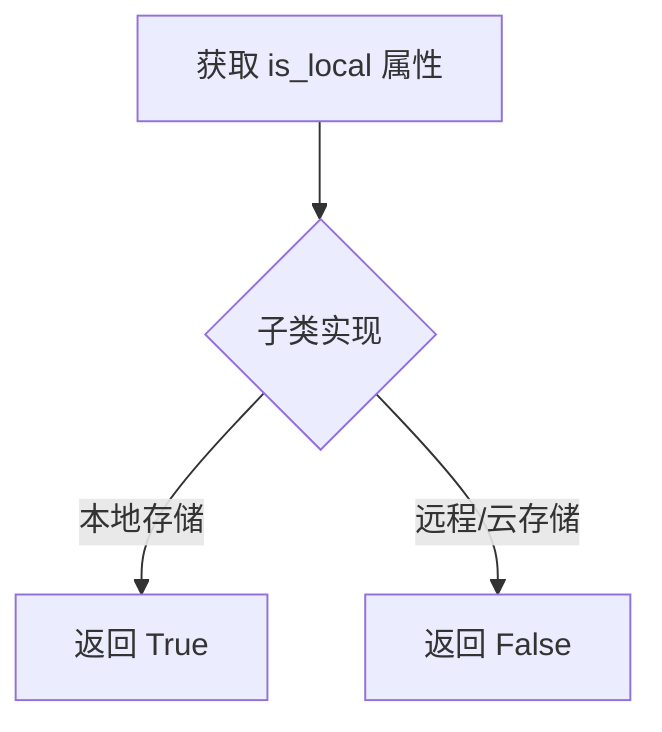
```mermaid
flowchart TD
    A[获取 is_local 属性] --> B{子类实现}
    B -->|本地存储| C[返回 True]
    B -->|远程/云存储| D[返回 False]
```

#### 带注释源码

```python
@property
@abstractmethod
def is_local(self) -> bool:
    """Whether the storage is local (i.e. on the same machine, not cloud-based).
    
    这是一个抽象属性，子类必须实现此属性以表明存储的类型。
    当返回 True 时，表示存储是本地的（如本地文件系统）；
    当返回 False 时，表示存储是远程的（如 S3、云存储等）。
    
    此属性在 _sanitize_path 方法中被使用，用于决定路径解析的方式：
    - 本地存储：使用 Path.resolve() 解析绝对路径
    - 远程存储：使用 os.path.normpath() 规范化路径
    """
```


### `FileStorage.initialize`

抽象方法：初始化存储到可用状态。调用 `initialize()` 应使存储进入准备使用状态，例如创建用于存储文件的资源（如果尚不存在），如磁盘上的文件夹或 S3 存储桶。

参数：

- 此方法无参数（`self` 为隐式参数）

返回值：`None`，无返回值描述

#### 流程图

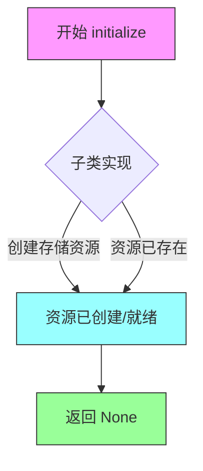
```mermaid
flowchart TD
    A[开始 initialize] --> B{子类实现}
    B -->|创建存储资源| C[资源已创建/就绪]
    B -->|资源已存在| C
    C --> D[返回 None]
    
    style A fill:#f9f,stroke:#333
    style D fill:#9f9,stroke:#333
    style C fill:#9ff,stroke:#333
```

#### 带注释源码

```python
@abstractmethod
def initialize(self) -> None:
    """
    Calling `initialize()` should bring the storage to a ready-to-use state.
    For example, it can create the resource in which files will be stored, if it
    doesn't exist yet. E.g. a folder on disk, or an S3 Bucket.
    """
    # 这是一个抽象方法，具体实现由子类提供
    # 子类应实现以下逻辑：
    # 1. 检查存储资源是否存在（如文件夹、S3 bucket 等）
    # 2. 如果不存在，则创建该资源
    # 3. 确保存储处于可用状态
    # 注意：此方法没有参数，返回值类型为 None
    pass
```

#### 备注

- **抽象方法标识**：使用 `@abstractmethod` 装饰器标记，表明子类必须实现此方法
- **设计意图**：为不同的存储后端（如本地文件系统、云存储等）提供统一的初始化接口
- **实现要求**：子类需要重写此方法以实现具体的初始化逻辑
- **调用时机**：通常在 `FileStorage` 实例创建后首次使用前调用


### `FileStorage.open_file`

抽象方法：以指定模式（文本或二进制）打开文件，返回文件-like对象供读写操作。

参数：

- `path`：`str | Path`，要打开的文件路径，相对于存储根目录
- `mode`：`Literal["r", "w"] = "r"`，打开模式，"r"为读取，"w"为写入
- `binary`：`bool = False`，是否以二进制模式打开，True返回BinaryIO，False返回TextIO

返回值：`TextIO | BinaryIO`，根据mode和binary参数返回文本或二进制文件-like对象

#### 流程图

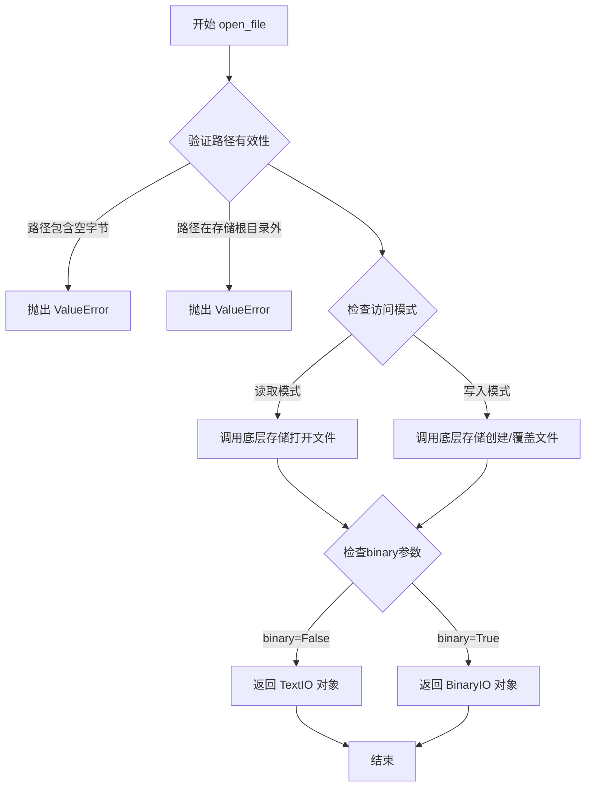
```mermaid
flowchart TD
    A[开始 open_file] --> B{验证路径有效性}
    B -->|路径包含空字节| C[抛出 ValueError]
    B -->|路径在存储根目录外| D[抛出 ValueError]
    B --> E{检查访问模式}
    E -->|读取模式| F[调用底层存储打开文件]
    E -->|写入模式| G[调用底层存储创建/覆盖文件]
    F --> H{检查binary参数}
    G --> H
    H -->|binary=False| I[返回 TextIO 对象]
    H -->|binary=True| J[返回 BinaryIO 对象]
    I --> K[结束]
    J --> K
```

#### 带注释源码

```python
@overload
@abstractmethod
def open_file(
    self,
    path: str | Path,
    mode: Literal["r", "w"] = "r",
    binary: Literal[False] = False,
) -> TextIO:
    """Returns a readable text file-like object representing the file."""

@overload
@abstractmethod
def open_file(
    self, path: str | Path, mode: Literal["r", "w"], binary: Literal[True]
) -> BinaryIO:
    """Returns a binary file-like object representing the file."""

@overload
@abstractmethod
def open_file(self, path: str | Path, *, binary: Literal[True]) -> BinaryIO:
    """Returns a readable binary file-like object representing the file."""

@overload
@abstractmethod
def open_file(
    self, path: str | Path, mode: Literal["r", "w"] = "r", binary: bool = False
) -> TextIO | BinaryIO:
    """Returns a file-like object representing the file."""

@abstractmethod
async def write_file(self, path: str | Path, content: str | bytes) -> None:
    """Write to a file in the storage."""
```


### `FileStorage.read_file`

抽象方法：读取文件内容，支持文本和二进制两种模式。该方法定义了从文件存储中读取数据的接口，具体实现由子类提供。

参数：

- `path`：`str | Path`，要读取的文件路径，可以是字符串或 Path 对象
- `binary`：`bool`，可选参数，默认为 `False`。当为 `False` 时以文本模式读取，返回 `str`；当为 `True` 时以二进制模式读取，返回 `bytes`

返回值：`str | bytes`，文件内容。文本模式返回字符串，二进制模式返回字节数据

#### 流程图

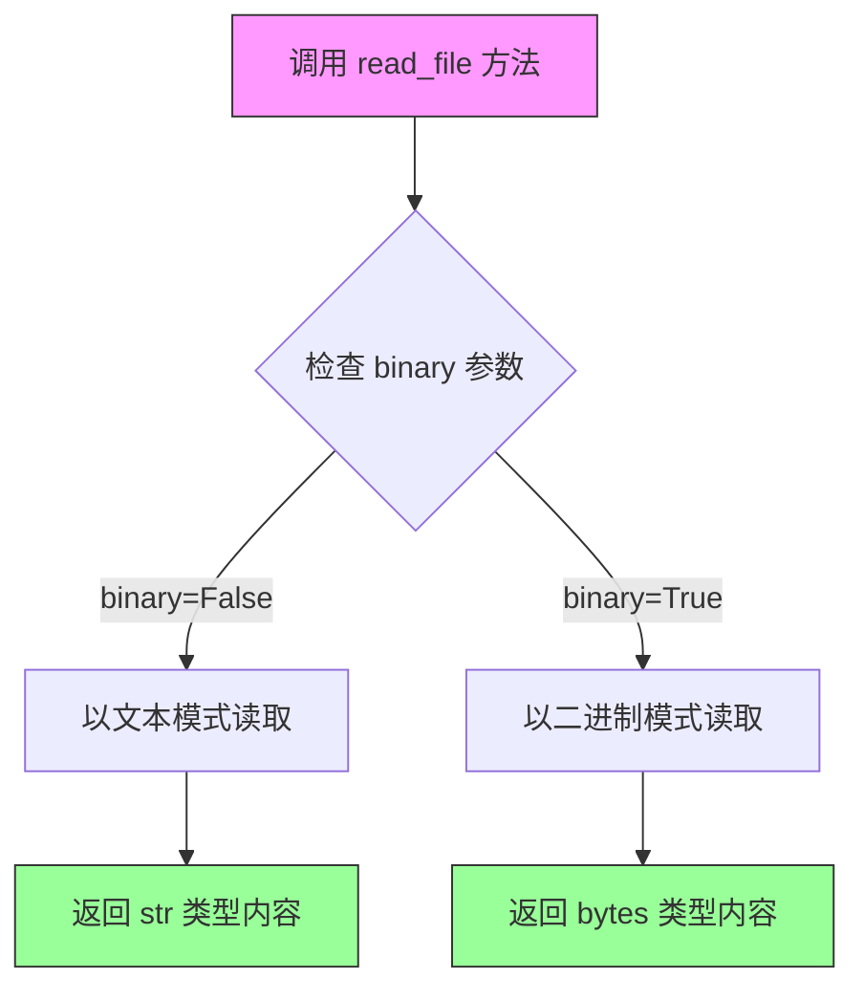
```mermaid
flowchart TD
    A[调用 read_file 方法] --> B{检查 binary 参数}
    B -->|binary=False| C[以文本模式读取]
    B -->|binary=True| D[以二进制模式读取]
    C --> E[返回 str 类型内容]
    D --> F[返回 bytes 类型内容]
    
    style A fill:#f9f,stroke:#333
    style E fill:#9f9,stroke:#333
    style F fill:#9f9,stroke:#333
```

#### 带注释源码

```python
@overload
@abstractmethod
def read_file(self, path: str | Path, binary: Literal[False] = False) -> str:
    """Read a file in the storage as text."""
    ...

@overload
@abstractmethod
def read_file(self, path: str | Path, binary: Literal[True]) -> bytes:
    """Read a file in the storage as binary."""
    ...

@overload
@abstractmethod
def read_file(self, path: str | Path, binary: bool = False) -> str | bytes:
    """Read a file in the storage."""
    ...
```


### `FileStorage.write_file`

抽象方法：写入文件内容到存储中。该方法定义了一个异步文件写入的接口，具体实现由子类提供，用于将指定的内容写入到存储中指定的路径。

参数：

- `path`：`str | Path`，要写入的目标文件路径，可以是相对路径或绝对路径
- `content`：`str | bytes`，要写入文件的内容，支持文本或二进制数据

返回值：`None`，无返回值

#### 流程图

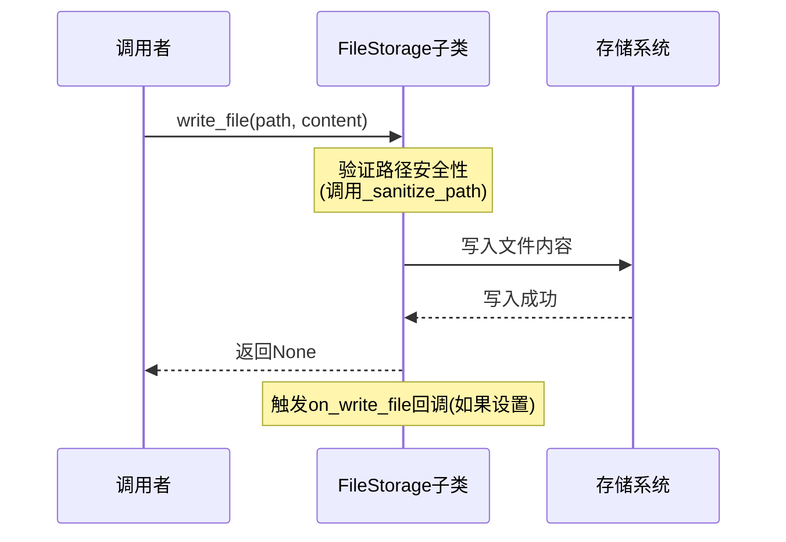
```mermaid
sequenceDiagram
    participant C as 调用者
    participant FS as FileStorage子类
    participant S as 存储系统
    
    C->>FS: write_file(path, content)
    Note over FS: 验证路径安全性<br/>(调用_sanitize_path)
    FS->>S: 写入文件内容
    S-->>FS: 写入成功
    FS-->>C: 返回None
    Note over FS: 触发on_write_file回调(如果设置)
```

#### 带注释源码

```python
@abstractmethod
async def write_file(self, path: str | Path, content: str | bytes) -> None:
    """Write to a file in the storage.
    
    这是一个抽象方法，具体实现由子类提供。
    子类实现时应考虑以下方面：
    1. 路径安全性验证（利用基类的_sanitize_path方法）
    2. 递归创建父目录
    3. 文件内容的写入（文本或二进制）
    4. 触发on_write_file回调（写入完成后）
    
    Parameters:
        path: 要写入的文件路径，相对于存储根目录
        content: 要写入的内容，字符串或字节
    
    Returns:
        None
    """
    ...
```


### `FileStorage.list_files`

抽象方法：递归列出指定目录下的所有文件。

参数：

- `self`：`FileStorage`，隐式的 FileStorage 实例，代表具体的存储后端
- `path`：`str | Path = "."`，要列出文件的目录路径，默认为当前目录

返回值：`list[Path]`，返回包含存储中所有文件相对路径的列表

#### 流程图

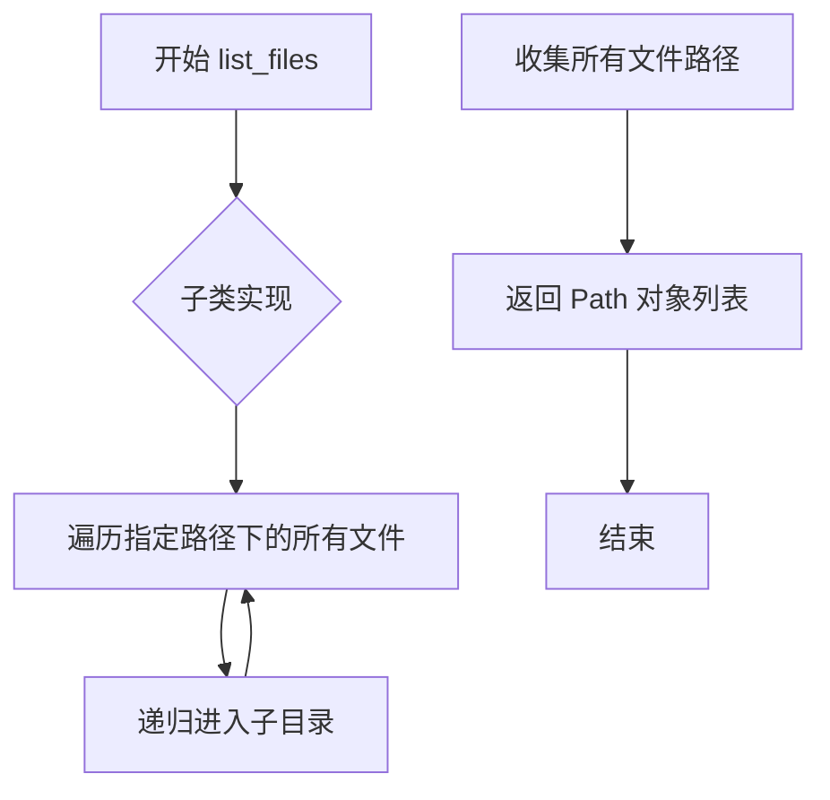
```mermaid
flowchart TD
    A[开始 list_files] --> B{子类实现}
    B --> C[遍历指定路径下的所有文件]
    C --> D[递归进入子目录]
    D --> C
    E[收集所有文件路径] --> F[返回 Path 对象列表]
    F --> G[结束]
```

#### 带注释源码

```python
@abstractmethod
def list_files(self, path: str | Path = ".") -> list[Path]:
    """List all files (recursively) in a directory in the storage.

    这是一个抽象方法，由子类实现具体逻辑。

    参数:
        path: 要列出文件的目录路径，默认为当前目录 (".")。
              可以是相对路径或绝对路径，具体行为取决于子类实现。

    返回值:
        list[Path]: 包含所有文件相对路径的 Path 对象列表。
                   路径相对于存储根目录。

    示例:
        # 假设存储根目录为 /data
        # 返回值可能是 [Path('file1.txt'), Path('subdir/file2.txt')]
    """
    ...
```


### `FileStorage.list_folders`

抽象方法：列出文件夹

参数：

- `path`：`str | Path`，默认值 `"."`，要列出文件夹的目录路径
- `recursive`：`bool`，默认值 `False`，是否递归列出子文件夹

返回值：`list[Path]`，返回存储中指定目录下的所有文件夹路径列表

#### 流程图

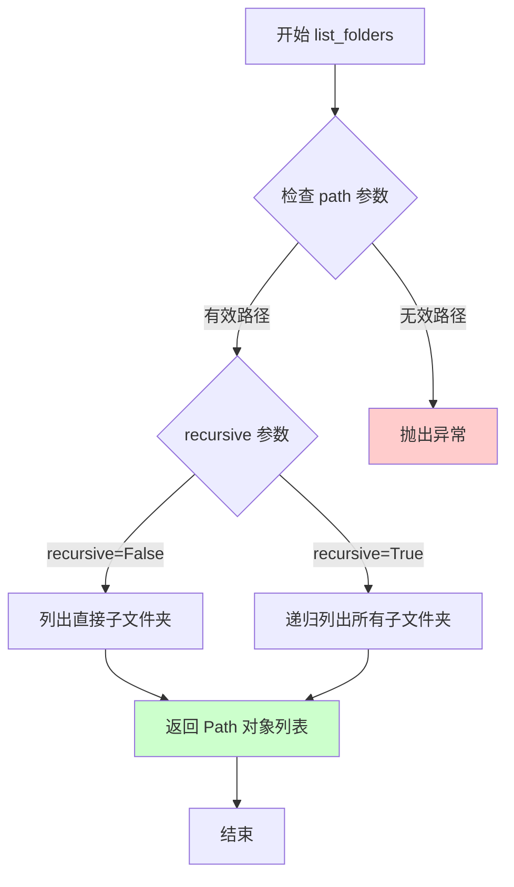
```mermaid
flowchart TD
    A[开始 list_folders] --> B{检查 path 参数}
    B -->|有效路径| C{recursive 参数}
    B -->|无效路径| D[抛出异常]
    C -->|recursive=False| E[列出直接子文件夹]
    C -->|recursive=True| F[递归列出所有子文件夹]
    E --> G[返回 Path 对象列表]
    F --> G
    G --> H[结束]
    
    style D fill:#ffcccc
    style G fill:#ccffcc
```

#### 带注释源码

```python
@abstractmethod
def list_folders(
    self, path: str | Path = ".", recursive: bool = False
) -> list[Path]:
    """List all folders in a directory in the storage.
    
    这是一个抽象方法，具体实现由子类提供。
    
    参数:
        path: 要列出文件夹的目录路径，默认为当前目录 "."
        recursive: 是否递归列出所有子文件夹，默认为 False（仅列出直接子文件夹）
    
    返回:
        包含所有文件夹路径的列表，每个路径都是 Path 对象
    """
    ...
```


### `FileStorage.delete_file`

删除存储中的指定文件。

参数：

- `path`：`str | Path`，要删除的文件路径，相对于存储根目录

返回值：`None`，无返回值

#### 流程图

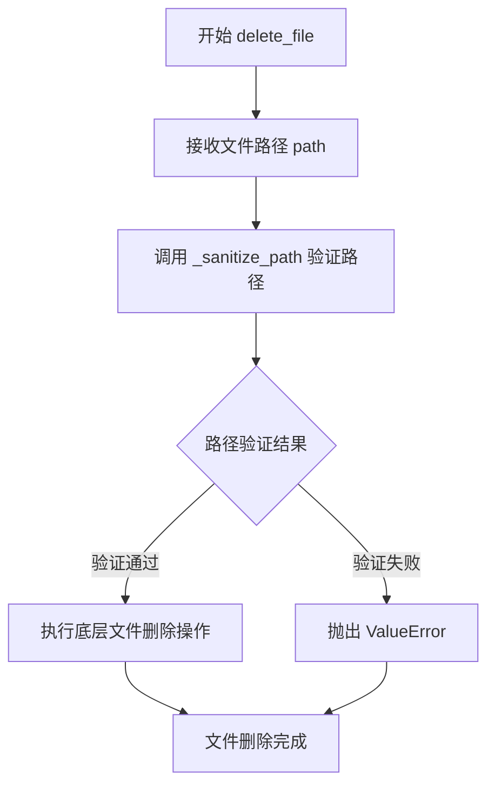
```mermaid
flowchart TD
    A[开始 delete_file] --> B[接收文件路径 path]
    B --> C[调用 _sanitize_path 验证路径]
    C --> D{路径验证结果}
    D -->|验证失败| E[抛出 ValueError]
    D -->|验证通过| F[执行底层文件删除操作]
    F --> G[文件删除完成]
    E --> G
```

#### 带注释源码

```python
@abstractmethod
def delete_file(self, path: str | Path) -> None:
    """Delete a file in the storage.
    
    参数:
        path: 要删除的文件路径，相对于存储根目录
        
    返回:
        None
        
    注意:
        - 这是一个抽象方法，具体删除逻辑由子类实现
        - 路径会经过 _sanitize_path 进行安全检查
        - 如果 restrict_to_root 为 True，则无法删除根目录外的文件
        - 如果文件不存在，具体行为由子类实现决定（可能抛出异常或静默失败）
    """
    ...
```


### `FileStorage.delete_dir`

删除空文件夹的抽象方法，由子类实现具体逻辑。

参数：

- `self`：FileStorage，隐式参数，表示 FileStorage 类的实例
- `path`：`str | Path`，要删除的空文件夹的相对路径或绝对路径

返回值：`None`，无返回值

#### 流程图

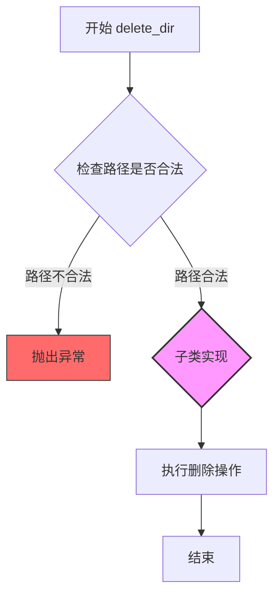
```mermaid
flowchart TD
    A[开始 delete_dir] --> B{检查路径是否合法}
    B -->|路径不合法| C[抛出异常]
    B -->|路径合法| D{子类实现}
    D --> E[执行删除操作]
    E --> F[结束]
    
    style D fill:#f9f,stroke:#333,stroke-width:2px
    style C fill:#ff6b6b,stroke:#333,stroke-width:1px
```

#### 带注释源码

```python
@abstractmethod
def delete_dir(self, path: str | Path) -> None:
    """Delete an empty folder in the storage.
    
    此抽象方法定义删除空文件夹的接口，由具体存储实现类（如本地存储、云存储等）实现具体逻辑。
    
    参数:
        path: 要删除的空文件夹路径，可以是相对路径或绝对路径
        
    注意:
        - 该方法只能删除空文件夹，非空文件夹应抛出异常
        - 子类实现时需遵循 restrict_to_root 限制，禁止操作根目录外的路径
    """
    ...
```


### `FileStorage.exists`

抽象方法，用于检查文件存储中是否存在指定的文件或文件夹。

参数：

- `path`：`str | Path`，要检查的文件或文件夹路径，可以是相对路径或绝对路径

返回值：`bool`，如果指定的文件或文件夹存在于存储中返回 `True`，否则返回 `False`

#### 流程图

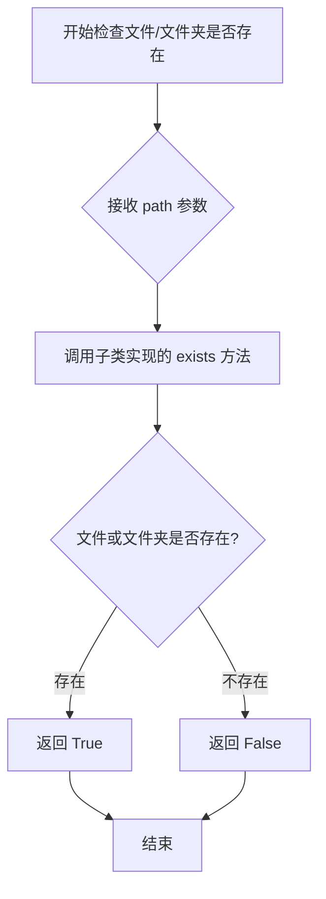
```mermaid
flowchart TD
    A[开始检查文件/文件夹是否存在] --> B{接收 path 参数}
    B --> C[调用子类实现的 exists 方法]
    C --> D{文件或文件夹是否存在?}
    D -->|存在| E[返回 True]
    D -->|不存在| F[返回 False]
    E --> G[结束]
    F --> G
```

#### 带注释源码

```python
@abstractmethod
def exists(self, path: str | Path) -> bool:
    """
    检查文件存储中是否存在指定的文件或文件夹。
    
    Parameters:
        path: 要检查的文件或文件夹路径，可以是字符串或 Path 对象
        
    Returns:
        bool: 如果文件或文件夹存在返回 True，否则返回 False
    """
    # 抽象方法，由子类实现具体逻辑
    # 子类需要根据存储类型（本地/云存储）实现具体的检查逻辑
    pass
```


### `FileStorage.rename`

抽象方法，用于重命名存储中的文件或文件夹。

参数：

-  `old_path`：`str | Path`，需要重命名的文件或文件夹的原始路径
-  `new_path`：`str | Path`，文件或文件夹的新路径

返回值：`None`，无返回值

#### 流程图

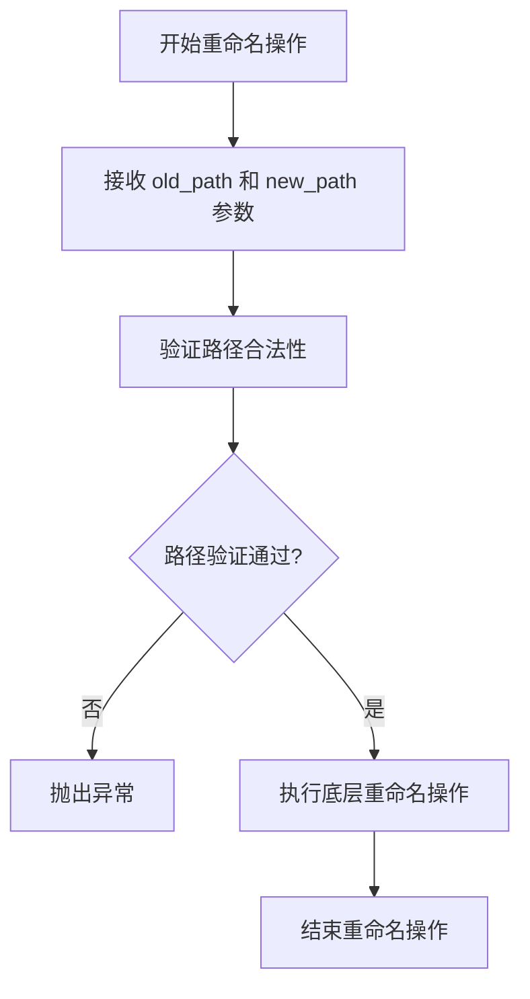
```mermaid
flowchart TD
    A[开始重命名操作] --> B[接收 old_path 和 new_path 参数]
    B --> C[验证路径合法性]
    C --> D{路径验证通过?}
    D -->|否| E[抛出异常]
    D -->|是| F[执行底层重命名操作]
    F --> G[结束重命名操作]
```

#### 带注释源码

```python
@abstractmethod
def rename(self, old_path: str | Path, new_path: str | Path) -> None:
    """Rename a file or folder in the storage.
    
    Parameters:
        old_path: The current path of the file or folder to rename.
        new_path: The new path for the file or folder.
    """
    ...
```


### `FileStorage.copy`

该抽象方法定义了文件存储中复制文件或文件夹的标准接口，要求子类实现具体的复制逻辑，支持将源路径的文件或文件夹及其内容复制到目标路径。

参数：

- `source`：`str | Path`，源文件或文件夹的路径
- `destination`：`str | Path`，目标文件或文件夹的路径

返回值：`None`，无返回值，仅执行复制操作

#### 流程图

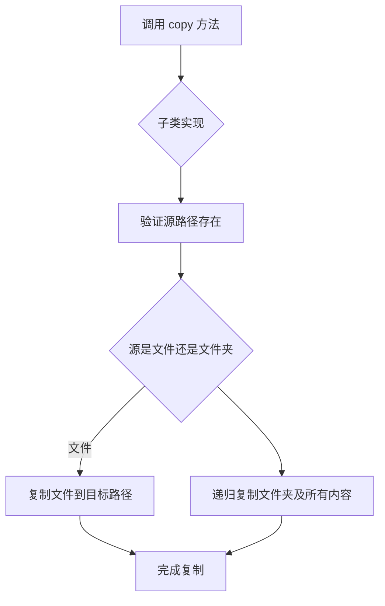
```mermaid
flowchart TD
    A[调用 copy 方法] --> B{子类实现}
    B --> C[验证源路径存在]
    C --> D{源是文件还是文件夹}
    D -->|文件| E[复制文件到目标路径]
    D --> F[递归复制文件夹及所有内容]
    E --> G[完成复制]
    F --> G
```

#### 带注释源码

```python
@abstractmethod
def copy(self, source: str | Path, destination: str | Path) -> None:
    """Copy a file or folder with all contents in the storage.
    
    这是一个抽象方法，具体实现由子类提供。
    通常需要处理以下情况：
    1. 复制单个文件
    2. 递归复制目录及其所有内容
    3. 如果目标存在，可能需要覆盖或报错
    """
```


### FileStorage.make_dir

创建目录的抽象方法，用于在存储中创建不存在的目录。

参数：

-  `path`：`str | Path`，要创建的目录路径（相对或绝对路径）

返回值：`None`，无返回值

#### 流程图

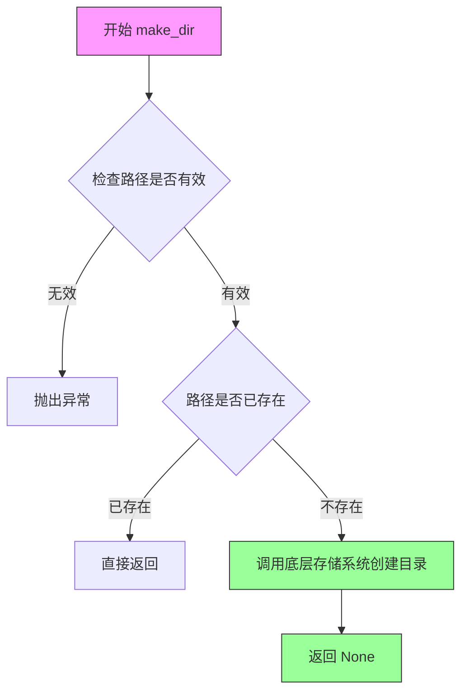
```mermaid
flowchart TD
    A[开始 make_dir] --> B{检查路径是否有效}
    B -->|无效| C[抛出异常]
    B -->|有效| D{路径是否已存在}
    D -->|已存在| E[直接返回]
    D -->|不存在| F[调用底层存储系统创建目录]
    F --> G[返回 None]
    
    style A fill:#f9f,stroke:#333
    style F fill:#9f9,stroke:#333
    style G fill:#9f9,stroke:#333
```

#### 带注释源码

```python
@abstractmethod
def make_dir(self, path: str | Path) -> None:
    """Create a directory in the storage if doesn't exist."""
    # 抽象方法，由子类实现具体逻辑
    # 参数：
    #   - path: str | Path，要创建的目录路径
    # 返回值：
    #   - None
    # 
    # 子类实现需考虑：
    # 1. 路径安全性检查（防止目录遍历攻击）
    # 2. 调用底层存储API创建目录
    # 3. 递归创建父目录（如果需要）
    # 4. 处理已存在目录的情况
    pass
```

#### 说明

该方法是 `FileStorage` 抽象基类定义的抽象方法，具体的存储实现（如本地文件存储、云存储等）需要实现此方法。方法的核心职责是在存储系统中创建指定的目录，如果目录已存在则不应抛出异常。


### `FileStorage.clone_with_subroot`

抽象方法：创建子根目录的新存储实例

参数：

- `subroot`：`str | Path`，子根目录的路径，用于指定新存储实例的根目录

返回值：`FileStorage`，返回一个新的 FileStorage 实例，其根目录为当前存储的子目录

#### 流程图

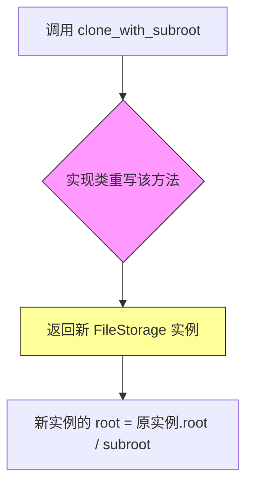
```mermaid
flowchart TD
    A[调用 clone_with_subroot] --> B{实现类重写该方法}
    B --> C[返回新 FileStorage 实例]
    C --> D[新实例的 root = 原实例.root / subroot]
    
    style B fill:#f9f,stroke:#333
    style C fill:#ff9,stroke:#333
```

#### 带注释源码

```python
@abstractmethod
def clone_with_subroot(self, subroot: str | Path) -> FileStorage:
    """Create a new FileStorage with a subroot of the current storage.
    
    这是一个抽象方法，具体实现由子类完成。
    子类需要创建一个新的存储实例，其根路径为当前存储根路径的子目录。
    
    Parameters:
        subroot: 子根目录的路径，可以是相对路径或绝对路径（相对于当前存储根目录）
    
    Returns:
        FileStorage: 返回一个新的存储实例，其访问权限限制在子目录范围内
    """
    # 抽象方法，无具体实现
    # 子类需要重写此方法，实现类似如下逻辑：
    # new_storage = self.__class__(...)
    # new_storage.root = self.root / subroot
    # return new_storage
```


### `FileStorage.get_path`

获取存储中项目的完整路径。

参数：

- `relative_path`：`str | Path`，需要解析的相对路径

返回值：`Path`，相对于存储的解析后路径

#### 流程图

```mermaid
flowchart TD
    A[开始: get_path] --> B{检查路径是否包含空字节}
    B -->|是| C[抛出 ValueError: Embedded null byte]
    B -->|否| D{路径是绝对路径且受限}
    D -->|是且不在root内| E[抛出 ValueError: 禁止访问绝对路径]
    D -->|否| F[拼接 root 和相对路径]
    F --> G{是否为本地存储}
    G -->|是| H[解析绝对路径]
    G -->|否| I[标准化路径]
    H --> J{路径是否在root内}
    I --> J
    J -->|否| K[抛出 ValueError: 路径超出存储范围]
    J -->|是| L[返回完整路径]
    C --> M[结束]
    E --> M
    K --> M
    L --> M
```

#### 带注释源码

```python
def get_path(self, relative_path: str | Path) -> Path:
    """Get the full path for an item in the storage.

    Parameters:
        relative_path: The relative path to resolve in the storage.

    Returns:
        Path: The resolved path relative to the storage.
    """
    # 调用内部方法 _sanitize_path 进行路径验证和解析
    # 该方法会检查路径安全性、权限限制，并返回规范化后的完整路径
    return self._sanitize_path(relative_path)
```


### `FileStorage.mount`

挂载存储并提供本地路径用于文件同步。该方法创建一个本地临时目录，将远程存储的所有文件同步到本地，并使用文件系统观察器监听本地文件的变化并同步回存储。

参数：

- `path`：`str | Path`，默认为 `.`，挂载点路径，用于指定临时目录创建的父目录

返回值：`Generator[Path, Any, None]`，返回一个上下文管理器生成器，yield 出本地临时目录的路径，用于文件同步操作

#### 流程图

```mermaid
flowchart TD
    A[开始 mount] --> B[创建临时目录 local_path]
    B --> C[创建文件系统观察器 Observer]
    C --> D[获取存储中所有文件列表]
    D --> E{遍历所有文件}
    E -->|对于每个文件| F[构建本地文件路径]
    F --> G[创建必要的父目录]
    G --> H[读取远程文件内容]
    H --> I[写入本地文件]
    I --> E
    E -->|遍历完成| J[创建 FileSyncHandler]
    J --> K[配置观察器监听本地目录]
    K --> L[启动观察器]
    L --> M[yield 本地路径给调用者]
    M --> N{上下文管理器退出}
    N --> O[停止观察器]
    O --> P[等待观察器线程结束]
    P --> Q[删除临时目录]
    Q --> R[结束 mount]
```

#### 带注释源码

```python
@contextmanager
def mount(self, path: str | Path = ".") -> Generator[Path, Any, None]:
    """Mount the file storage and provide a local path.
    
    该方法是一个上下文管理器，用于挂载文件存储并提供一个本地路径。
    它会在本地创建一个临时目录，将远程存储的所有文件同步到本地，
    并监听本地文件的变化以实时同步回存储。
    
    Parameters:
        path: 挂载点路径，临时目录将在此目录下创建，默认为当前目录
        
    Yields:
        Path: 本地临时目录的路径，用于文件同步操作
    """
    # 创建一个临时目录，用于存放从远程存储同步下来的文件
    # dir=path 指定了临时目录创建的父目录
    local_path = tempfile.mkdtemp(dir=path)

    # 创建文件系统观察器，用于监听本地文件的变化
    observer = Observer()
    try:
        # Copy all files to the local directory
        # 获取远程存储中的所有文件
        files = self.list_files()
        
        # 遍历所有文件，将它们从远程存储复制到本地临时目录
        for file in files:
            # 构建本地文件路径：临时目录路径 + 文件相对路径
            file_path = local_path / file
            
            # 创建必要的父目录，确保目录结构存在
            file_path.parent.mkdir(parents=True, exist_ok=True)
            
            # 读取远程存储中的文件内容（二进制模式）
            content = self.read_file(file, binary=True)
            
            # 将内容写入本地文件
            file_path.write_bytes(content)

        # Sync changes
        # 创建文件同步处理器，用于处理本地文件的变更事件
        event_handler = FileSyncHandler(self, local_path)
        
        # 配置观察者监听本地目录及其子目录的递归变化
        observer.schedule(event_handler, local_path, recursive=True)
        
        # 启动文件系统观察器
        observer.start()

        # 将本地临时目录路径 yield 给调用者
        # 调用者可以在此路径下进行文件操作
        yield Path(local_path)
    finally:
        # 停止文件系统观察器
        observer.stop()
        
        # 等待观察器线程完全结束
        observer.join()
        
        # 清理临时目录，删除所有同步下来的文件
        shutil.rmtree(local_path)
```


### `FileStorage._sanitize_path`

内部方法：解析和验证相对路径，确保路径在存储的根目录内，防止路径遍历攻击。

参数：

- `path`：`str | Path`，需要解析和验证的相对路径或绝对路径

返回值：`Path`，解析后的完整路径

#### 流程图

```mermaid
flowchart TD
    A[开始 _sanitize_path] --> B{检查路径是否包含空字节 \0?}
    B -->|是| C[抛出 ValueError: Embedded null byte]
    B -->|否| D[将 path 转换为 Path 对象]
    D --> E{路径是绝对路径 且 启用了root限制 且 不在root内?}
    E -->|是| F[抛出 ValueError: 拒绝访问绝对路径]
    E -->|否| G[拼接 root / relative_path]
    G --> H{存储是本地类型?}
    H -->|是| I[调用 full_path.resolve 解析路径]
    H -->|否| J[使用 os.path.normpath 规范化路径]
    I --> K{路径在 root 内?}
    J --> K
    K -->|是| L[返回完整路径]
    K -->|否| M[抛出 ValueError: 路径超出存储root范围]
```

#### 带注释源码

```python
def _sanitize_path(
    self,
    path: str | Path,
) -> Path:
    """Resolve the relative path within the given root if possible.

    Parameters:
        relative_path: The relative path to resolve.

    Returns:
        Path: The resolved path.

    Raises:
        ValueError: If the path is absolute and a root is provided.
        ValueError: If the path is outside the root and the root is restricted.
    """

    # Posix systems disallow null bytes in paths. Windows is agnostic about it.
    # Do an explicit check here for all sorts of null byte representations.
    # 检查路径字符串中是否包含空字节，防止空字节注入攻击
    if "\0" in str(path):
        raise ValueError("Embedded null byte")

    logger.debug(f"Resolving path '{path}' in storage '{self.root}'")

    # 将输入路径转换为 Path 对象以便后续处理
    relative_path = Path(path)

    # Allow absolute paths if they are contained in the storage.
    # 如果路径是绝对的、启用了root限制、且不在root内，则抛出异常
    # 这是为了允许绝对路径只要它们在存储的根目录内
    if (
        relative_path.is_absolute()
        and self.restrict_to_root
        and not relative_path.is_relative_to(self.root)
    ):
        raise ValueError(
            f"Attempted to access absolute path '{relative_path}' "
            f"in storage '{self.root}'"
        )

    # 拼接存储根目录和相对路径，形成完整路径
    full_path = self.root / relative_path
    
    # 根据存储类型选择不同的路径解析方式
    # 本地存储使用 resolve() 获取绝对路径并解析符号链接
    if self.is_local:
        full_path = full_path.resolve()
    else:
        # 非本地存储（如云存储）使用 normpath 规范化路径
        full_path = Path(os.path.normpath(full_path))

    logger.debug(f"Joined paths as '{full_path}'")

    # 最后再次检查完整路径是否在允许的 root 目录内
    # 这是关键的路径遍历攻击防护
    if self.restrict_to_root and not full_path.is_relative_to(self.root):
        raise ValueError(
            f"Attempted to access path '{full_path}' "
            f"outside of storage '{self.root}'."
        )

    # 返回验证后的完整路径
    return full_path
```


### `FileSyncHandler.__init__`

初始化文件同步处理器，用于监听文件系统变化并将变更同步到文件存储系统。

参数：

- `storage`：`FileStorage`，文件存储实例，用于处理文件同步操作（写入、删除、重命名等）
- `path`：`str | Path`，要监听的本地路径，默认为当前目录`.`

返回值：`None`，无返回值（构造函数）

#### 流程图

```mermaid
flowchart TD
    A[开始初始化] --> B[接收 storage 和 path 参数]
    B --> C[将 storage 赋值给 self.storage]
    C --> D[将 path 转换为 Path 对象并赋值给 self.path]
    D --> E[初始化完成]
```

#### 带注释源码

```python
def __init__(self, storage: FileStorage, path: str | Path = "."):
    """
    初始化文件同步处理器。

    Parameters:
        storage: FileStorage 实例，用于执行文件操作（写入、删除、重命名等）
        path: 要监听的本地路径，默认为当前目录
    """
    self.storage = storage  # 存储文件存储实例的引用
    self.path = Path(path)  # 将路径转换为 Path 对象以便后续处理
```


### `FileSyncHandler.on_modified`

处理文件修改事件，当文件系统中的文件被修改时触发，将本地文件的变化同步到远程存储。

参数：

-  `event`：`FileSystemEvent`，来自 watchdog 的文件系统事件对象，包含事件类型和文件路径信息

返回值：`None`，该方法没有返回值

#### 流程图

```mermaid
flowchart TD
    A[开始 on_modified] --> B{event.is_directory?}
    B -->|是| C[直接返回]
    B -->|否| D[获取 file_path = Path(event.src_path).relative_to(self.path)]
    D --> E[读取文件内容: file_path.read_bytes()]
    E --> F[异步执行: storage.write_file]
    F --> G[结束]
    
    style C fill:#ffcccc
    style F fill:#ccffcc
```

#### 带注释源码

```python
def on_modified(self, event: FileSystemEvent):
    """处理文件修改事件，将本地修改同步到存储后端。
    
    当 watchdog 检测到文件被修改时，此方法会被调用。
    它读取修改后的文件内容并将其写入到关联的 FileStorage 中。
    
    参数:
        event: FileSystemEvent，watchdog 发出的文件系统事件对象
               包含 src_path（事件源路径）等属性
    """
    # 目录的修改事件被忽略，只处理文件
    if event.is_directory:
        return

    # 计算相对于监控根目录的路径
    # event.src_path 是绝对路径，需要转换为相对于 self.path 的路径
    # 这样才能正确地对应到存储中的相对路径
    file_path = Path(event.src_path).relative_to(self.path)
    
    # 读取修改后的文件内容（以二进制模式）
    content = file_path.read_bytes()
    
    # 必须同步执行异步的 write_file 方法
    # 这是因为 watchdog 的事件处理器是同步调用的
    # TODO: 计划使用 asyncio.create_task 实现非阻塞写入
    asyncio.get_event_loop().run_until_complete(
        self.storage.write_file(file_path, content)
    )
```


### `FileSyncHandler.on_created`

处理文件创建事件，当新文件或目录被创建时触发，将本地文件系统的变更同步到存储后端。

参数：

-  `event`：`FileSystemEvent`，来自 watchdog 库的文件系统事件对象，包含事件类型（如文件或目录创建）和相关路径信息（`src_path` 等属性）

返回值：`None`，该方法不返回任何值，通过修改存储后端来同步变更

#### 流程图

```mermaid
flowchart TD
    A[接收 on_created 事件] --> B{event.is_directory?}
    B -->|是 目录| C[调用 storage.make_dir 创建目录]
    C --> D[返回]
    B -->|否 文件| E[获取文件相对路径]
    E --> F[读取文件内容 bytes]
    F --> G[运行异步 write_file 同步到存储]
    G --> D
```

#### 带注释源码

```python
def on_created(self, event: FileSystemEvent):
    """处理文件/目录创建事件，将变更同步到存储后端。
    
    当文件系统中有新文件或新目录被创建时，此方法会被 watchdog 调用。
    它负责将本地文件系统的创建操作同步到 FileStorage 后端。
    
    参数:
        event: FileSystemEvent 对象，包含事件类型和源路径 (src_path)
    """
    # 检查是否为目录创建事件
    if event.is_directory:
        # 如果是目录，则在存储中创建对应的目录
        self.storage.make_dir(event.src_path)
        # 目录处理完成，直接返回
        return

    # 处理文件创建事件
    # 获取相对于监控路径的文件路径
    file_path = Path(event.src_path).relative_to(self.path)
    # 读取新创建文件的二进制内容
    content = file_path.read_bytes()
    # Must execute write_file synchronously because the hook is synchronous
    # TODO: Schedule write operation using asyncio.create_task (non-blocking)
    # 注意：此处使用 run_until_complete 是因为 watchdog 的回调是同步的
    # TODO: 建议优化为使用 asyncio.create_task 实现非阻塞写入
    # 将文件内容写入到存储后端
    asyncio.get_event_loop().run_until_complete(
        self.storage.write_file(file_path, content)
    )
```


### `FileSyncHandler.on_deleted`

处理文件删除事件，当文件系统中的文件或目录被删除时触发。

参数：

-  `event`：`FileSystemEvent`，来自 watchdog 库的文件系统事件对象，包含被删除文件或目录的信息（如 `src_path` 和 `is_directory`）

返回值：`None`，无返回值

#### 流程图

```mermaid
flowchart TD
    A[接收 on_deleted 事件] --> B{event.is_directory?}
    B -->|是| C[调用 storage.delete_dir 删除目录]
    B -->|否| D[获取 file_path = event.src_path]
    D --> E[调用 storage.delete_file 删除文件]
    C --> F[结束]
    E --> F
```

#### 带注释源码

```python
def on_deleted(self, event: FileSystemEvent):
    """处理文件删除事件。
    
    当文件系统中的文件或目录被删除时，此方法会被 watchdog 观察器调用。
    它会根据事件类型（文件或目录）调用相应的存储删除方法。
    
    Parameters:
        event: FileSystemEvent 对象，包含被删除项的信息。
               - event.is_directory: 布尔值，指示被删除的是否为目录。
               - event.src_path: 被删除文件或目录的绝对路径。
    """
    
    # 检查被删除的是否为目录
    if event.is_directory:
        # 如果是目录，调用存储接口的 delete_dir 方法删除空目录
        self.storage.delete_dir(event.src_path)
        return  # 方法结束，不继续处理

    # 如果是文件（非目录），则执行文件删除逻辑
    # 直接从事件对象中获取被删除文件的源路径
    file_path = event.src_path
    
    # 调用存储接口的 delete_file 方法删除文件
    self.storage.delete_file(file_path)
```


### `FileSyncHandler.on_moved`

处理文件移动事件，当文件系统监测到文件或目录被移动/重命名时，此方法会被调用，它将调用存储后端的 `rename` 方法将原路径的文件重命名到目标路径。

参数：

-  `event`：`FileSystemEvent`，来自 watchdog 的文件系统事件对象，包含 `src_path`（原路径）和 `dest_path`（移动后的目标路径）

返回值：`None`，无返回值

#### 流程图

```mermaid
flowchart TD
    A[接收 on_moved 事件] --> B{检查事件是否为目录}
    B -->|是目录| C[直接调用 storage.rename]
    B -->|否| C
    C --> D[调用 self.storage.rename<br/>参数: event.src_path, event.dest_path]
    D --> E[执行存储后端的 rename 操作]
    E --> F[结束]
```

#### 带注释源码

```python
def on_moved(self, event: FileSystemEvent):
    """处理文件移动事件。
    
    当文件系统监测到文件或目录被移动（重命名）时调用此方法。
    它将原路径的文件重命名到目标路径，保持文件在存储中的位置更新。
    
    Parameters:
        event: FileSystemEvent 对象，包含 src_path（原路径）和 dest_path（目标路径）
    """
    # 直接调用存储后端的 rename 方法，将文件从源路径移动到目标路径
    # 不区分文件或目录，因为 rename 方法会统一处理
    self.storage.rename(event.src_path, event.dest_path)
```

## 关键组件


### FileStorageConfiguration

配置类，继承自SystemConfiguration，用于存储文件存储的根路径和访问限制配置。

### FileStorage

核心抽象类，提供文件存储的统一接口。包含根路径属性、访问限制属性、本地/远程判断属性，以及初始化、打开文件、读写文件、列表文件、删除、复制、重命名等抽象方法。实现了路径清理（_sanitize_path）和挂载（mount）功能。

### FileSyncHandler

文件系统事件处理器，继承自FileSystemEventHandler。用于监听本地目录的文件变化（创建、修改、删除、移动），并将这些变化同步回FileStorage。

### _sanitize_path

路径清理方法，检查空字节、处理绝对路径和相对路径、验证路径是否在存储根目录内，防止路径遍历攻击。

### mount

挂载方法，将远程存储内容同步到本地临时目录，并使用Observer监听文件变化实现双向同步。

### open_file / read_file / write_file

文件读写操作的抽象方法定义，支持文本和二进制模式，使用@overload提供多种重载签名。

### list_files / list_folders

列出文件和文件夹的抽象方法，支持递归遍历目录。

### delete_file / delete_dir / rename / copy / make_dir

文件和目录管理的抽象方法，包括删除、复制、重命名、创建目录等操作。

### clone_with_subroot

创建子根存储的抽象方法，返回一个新的FileStorage实例指向当前存储的子目录。

### on_modified / on_created / on_deleted / on_moved

FileSyncHandler的事件处理方法，分别处理文件修改、创建、删除和移动事件，同步到存储后端。


## 问题及建议


### 已知问题

-   **Deprecated asyncio用法**: `FileSyncHandler`中的`on_modified`和`on_created`方法使用`asyncio.get_event_loop().run_until_complete()`，这是已废弃的写法，在某些Python版本和环境中会导致错误或警告，且每次调用都创建新的事件循环效率低下。
-   **路径处理不一致**: `FileSyncHandler`的`on_moved`方法和`on_deleted`方法中目录处理使用原始路径`event.src_path`，而`on_modified`和`on_created`使用了相对路径转换，导致行为不一致，可能引发路径穿越漏洞。
-   **mount方法缺乏错误处理**: `mount`方法在复制文件时没有异常捕获，如果复制过程中某个文件失败，会导致整个挂载过程失败，留下不一致的临时状态。
-   **缺少async方法实现**: 抽象类定义了`write_file`为async，但`read_file`、`list_files`等方法为同步实现，对于云存储等场景可能导致性能瓶颈。
-   **类型提示不精确**: `clone_with_subroot`方法返回`FileStorage`类型，但实际应该返回具体子类的类型以支持链式调用。
-   **observer未妥善清理**: `FileSyncHandler`持有`Observer`引用但在类中没有显式的资源清理方法，如果异常发生在observer启动前可能导致资源泄漏。
-   **tempfile清理风险**: `mount`方法使用`shutil.rmtree`同步清理临时目录，如果清理时仍有文件被写入可能失败。

### 优化建议

-   **重构异步逻辑**: 将`FileSyncHandler`改为接收async callback或使用`asyncio.create_task`队列处理，避免在事件处理器中阻塞；或使用`asyncio.run()`在新的事件循环中执行async操作。
-   **统一路径处理**: 所有文件操作方法中统一使用相对路径进行存储操作，避免直接使用绝对路径造成路径穿越或不一致。
-   **增强错误处理**: 在`mount`方法的文件复制循环中添加try-except，为每个文件失败提供单独日志和继续机制；使用`shutil.rmtree(ignore_errors=True)`防止清理失败。
-   **添加异步方法**: 为`FileStorage`添加`aread_file`、`alist_files`等异步方法，或提供异步适配器实现。
-   **改进类型提示**: 使用泛型或TypeVar使`clone_with_subroot`返回具体实现类类型。
-   **添加资源管理**: 为`FileSyncHandler`添加`close()`或`__enter__/__exit__`方法确保observer正确停止。
-   **实现断点续传**: `mount`方法可考虑增量同步而非全量复制，提升大规模文件系统挂载效率。


## 其它


### 设计目标与约束

**设计目标**：
- 提供统一的抽象文件存储接口，支持本地和云存储后端
- 确保文件访问限制在存储根目录内，防止路径遍历攻击
- 支持文件同步功能，通过watchdog监控本地目录变化并同步到存储
- 提供异步文件写入能力，提升I/O操作效率

**约束条件**：
- 继承自`SystemConfiguration`，需符合配置模型规范
- 必须实现所有抽象方法以提供完整功能
- `restrict_to_root`默认为True，安全优先
- `mount`方法仅适用于本地存储，云存储需特殊处理

### 错误处理与异常设计

**路径安全校验异常**：
- `ValueError`: 当路径包含null字节、尝试访问绝对路径、或路径超出存储根目录时抛出

**文件操作异常**（由具体实现类抛出）：
- 文件不存在时`exists`返回False，其他操作可能抛出`FileNotFoundError`
- 权限不足时抛出`PermissionError`
- 磁盘空间不足时抛出`OSError`

**同步机制异常**：
- `FileSyncHandler`中的同步写操作失败时异常向上传播
- Observer启动/停止失败时异常处理

### 数据流与状态机

**主要数据流**：

1. **文件读取流程**：`read_file` → `_sanitize_path`校验 → 底层存储实现读取 → 返回内容
2. **文件写入流程**：`write_file`（异步） → `_sanitize_path`校验 → 触发`on_write_file`回调 → 底层存储实现写入
3. **mount同步流程**：`mount` → 列出所有文件 → 复制到临时目录 → 启动Observer监听 → 变化时同步到存储

**状态机**：
- **FileStorage生命周期**：未初始化 → 已初始化（调用initialize）→ 使用中 → 已卸载
- **mount状态**：未挂载 → 挂载中（临时目录存在）→ 已卸载（临时目录已删除）

### 外部依赖与接口契约

**核心依赖**：
- `watchdog`: 文件系统事件监控（`Observer`, `FileSystemEventHandler`）
- `tempfile`: 临时目录创建（`mkdtemp`）
- `shutil`: 目录删除（`rmtree`）
- `pathlib.Path`: 路径操作
- `asyncio`: 异步事件循环处理
- `forge.models.config.SystemConfiguration`: 配置基类

**接口契约**：
- `root`属性：返回存储根目录的Path对象
- `restrict_to_root`属性：返回是否限制访问范围
- `is_local`属性：返回是否为本地存储
- `open_file`: 返回文件句柄，需支持文本/二进制模式
- `read_file`: 支持文本/二进制读取
- `write_file`: 异步写入，支持文本/二进制
- `list_files`: 返回文件Path列表（递归）
- `list_folders`: 返回目录Path列表
- `delete_file/delete_dir/rename/copy/make_dir`: 文件操作
- `clone_with_subroot`: 返回子存储实例

### 并发与异步处理

**异步设计**：
- `write_file`方法为异步实现，具体子类需支持异步写入
- `FileSyncHandler`内部使用`run_until_complete`将异步调用转为同步执行
- Observer在独立线程中运行，不阻塞主线程

**并发考虑**：
- `mount`方法中文件复制为串行操作，大文件量时性能受限
- 多个文件同时修改时存在竞态条件（TODO注释已提及）
- 当前实现为同步写回，可考虑使用`asyncio.create_task`优化

### 安全性考虑

**路径遍历防护**：
- `_sanitize_path`方法强制校验路径是否在根目录内
- 检测null字节防止字符串截断攻击
- 绝对路径需在根目录范围内才允许访问

**本地路径解析**：
- 本地存储使用`resolve()`获取绝对路径并校验
- 非本地存储使用`normpath`标准化路径

### 性能考虑

**mount操作性能**：
- 首次挂载需复制所有文件，大存储时耗时较长
- 临时目录存储于`path`参数指定位置，需确保磁盘空间充足
- 文件变更监控粒度为文件级，频繁小更新可能效率较低

**内存使用**：
- `list_files`返回完整文件列表，大目录可能占用较多内存
- `read_file`一次性加载整个文件内容，大文件需谨慎使用

### 测试策略建议

**单元测试**：
- 测试`_sanitize_path`的各种边界条件（null字节、绝对路径、越界路径）
- 测试各抽象方法的参数校验
- Mock具体存储实现进行功能测试

**集成测试**：
- 使用本地临时目录实现`LocalFileStorage`进行完整流程测试
- 测试`mount`同步机制的正确性
- 测试Observer事件触发的文件操作

### 使用示例

```python
# 基本文件操作
storage = LocalFileStorage(Path("/data"))
storage.initialize()
storage.write_file("test.txt", "hello")
content = storage.read_file("test.txt")
storage.delete_file("test.txt")

# 安全路径校验
try:
    storage.get_path("../etc/passwd")
except ValueError as e:
    print(f"路径越界: {e}")

# 挂载同步
with storage.mount("/tmp/mount") as local_path:
    # 在local_path下的文件修改会自动同步到storage
    (local_path / "new.txt").write_text("content")
```

### 潜在技术债务与优化空间

1. **TODO**: `FileSyncHandler`中应使用`asyncio.create_task`实现非阻塞异步写回
2. **TODO**: `mount`方法可添加增量同步支持，避免全量复制
3. **TODO**: 缺少文件锁机制，并发写入同一文件可能导致数据覆盖
4. **改进**: `list_files`可考虑返回生成器以支持大目录
5. **改进**: 可添加缓存层减少频繁的远程存储访问
6. **改进**: 错误处理可更细化，区分不同类型的存储异常

### 关键组件信息

| 组件名称 | 描述 |
|---------|------|
| FileStorage | 抽象文件存储基类，定义文件操作接口规范 |
| FileStorageConfiguration | 存储配置模型，包含root和restrict_to_root设置 |
| FileSyncHandler | watchdog事件处理器，负责本地与存储间的文件同步 |
| _sanitize_path | 路径安全校验方法，防止路径遍历攻击 |
| mount | 上下文管理器，将远程存储挂载为本地目录并同步变更 |
| on_write_file | 写入文件后的回调钩子，允许自定义处理逻辑 |


    