# `.\AutoGPT\classic\forge\forge\file_storage\gcs.py` 详细设计文档

该代码实现了一个与Google Cloud Storage交互的文件存储类GCSFileStorage，提供了对GCS存储桶中文件的读取、写入、列表、删除、重命名、复制等操作的功能，并支持文件版本锁定和子目录克隆。

## 整体流程

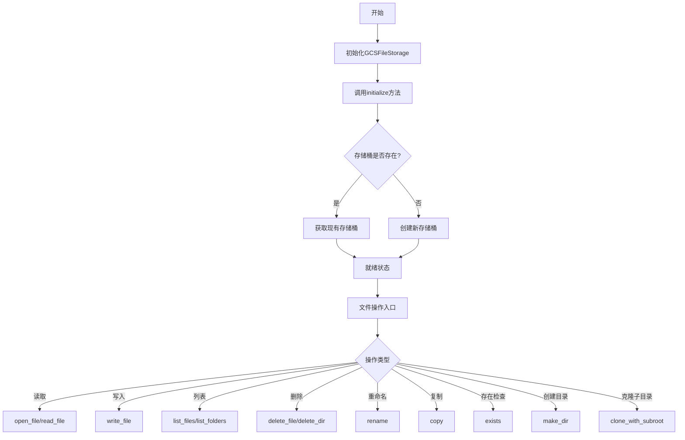

## 类结构

```
FileStorageConfiguration (基类)
└── GCSFileStorageConfiguration
FileStorage (抽象基类)
└── GCSFileStorage
```

## 全局变量及字段


### `logger`
    
模块级别的日志记录器，用于记录GCS文件存储的操作日志

类型：`logging.Logger`
    


### `GCSFileStorageConfiguration.bucket`
    
GCS存储桶名称，支持从环境变量STORAGE_BUCKET配置

类型：`str`
    


### `GCSFileStorage._bucket`
    
GCS存储桶对象

类型：`storage.Bucket`
    


### `GCSFileStorage._bucket_name`
    
存储桶名称字符串

类型：`str`
    


### `GCSFileStorage._root`
    
文件存储的根路径

类型：`Path`
    


### `GCSFileStorage._gcs`
    
GCS客户端实例

类型：`storage.Client`
    


### `GCSFileStorage.on_write_file`
    
写入文件后的回调函数(继承自父类)

类型：`Callable`
    
    

## 全局函数及方法


### `GCSFileStorage.__init__`

初始化 GCSFileStorage 实例，配置 Google Cloud Storage 客户端和存储桶信息，并设置根路径。

参数：

- `config`：`GCSFileStorageConfiguration`，包含存储配置的参数对象，主要包含 bucket 名称和 root 路径信息

返回值：`None`，构造函数无返回值

#### 流程图

```mermaid
flowchart TD
    A[开始 __init__] --> B[接收 config 参数]
    B --> C[设置 self._bucket_name = config.bucket]
    C --> D[设置 self._root = config.root]
    D --> E{self._root 是否为绝对路径?}
    E -->|是| F[保持不变]
    E -->|否| G[在 root 前添加 '/' 前缀]
    F --> H[创建 GCS 客户端: self._gcs = storage.Client]
    G --> H
    H --> I[调用父类初始化: super().__init__]
    I --> J[结束]
```

#### 带注释源码

```python
def __init__(self, config: GCSFileStorageConfiguration):
    """初始化 GCSFileStorage 实例。
    
    参数:
        config: GCSFileStorageConfiguration 配置对象，包含存储桶名称和根路径等信息
    """
    # 从配置对象中获取 bucket 名称并存储
    self._bucket_name = config.bucket
    
    # 从配置对象中获取根路径
    self._root = config.root
    
    # Add / at the beginning of the root path
    # 如果根路径不是绝对路径，则在其前面添加 "/" 使其成为绝对路径
    if not self._root.is_absolute():
        self._root = Path("/").joinpath(self._root)

    # 创建 Google Cloud Storage 客户端实例
    self._gcs = storage.Client()
    
    # 调用父类 FileStorage 的初始化方法
    super().__init__()
```


### `GCSFileStorage.root`

该属性是GCSFileStorage类的根目录getter访问器，用于返回当前Google Cloud Storage文件存储的根路径。

参数：

- （无参数，该方法为属性访问器）

返回值：`Path`，返回文件存储的根目录路径。

#### 流程图

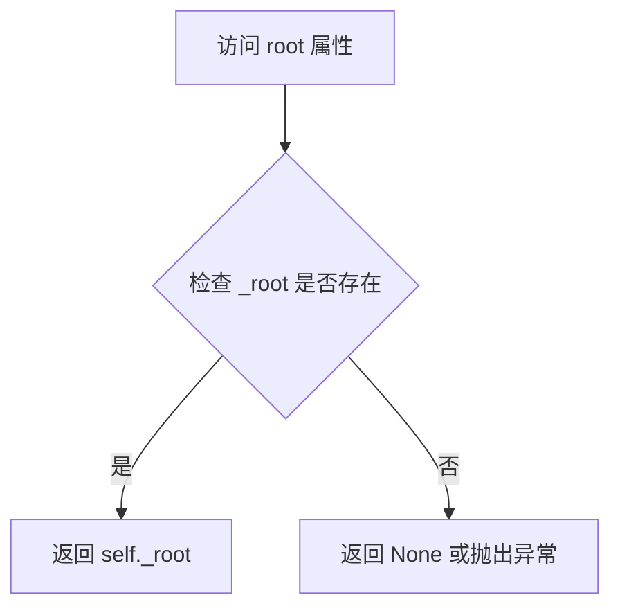

#### 带注释源码

```python
@property
def root(self) -> Path:
    """The root directory of the file storage."""
    return self._root
```

**源码说明：**

- `@property` 装饰器：将该方法转换为属性访问器，允许像访问字段一样调用 `instance.root` 而不需要括号。
- `self`：隐式参数，指向GCSFileStorage实例本身。
- 返回类型 `Path`：使用pathlib.Path表示文件系统路径。
- `self._root`：实例私有属性，在构造函数`__init__`中初始化，存储GCS存储桶中的根路径。
- 该属性为只读（read-only），提供对内部根路径的安全访问，不允许外部直接修改。


### `GCSFileStorage.restrict_to_root`

该属性用于指示是否将生成的路径限制在根目录范围内。对于 GCS 存储，由于云存储的特性，路径限制功能始终启用以确保安全性。

参数： 无

返回值：`bool`，表示是否限制生成的路径在根目录内（始终返回 `True`）

#### 流程图

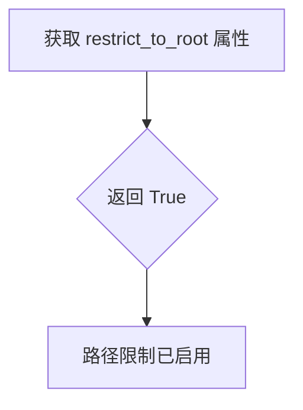

#### 带注释源码

```python
@property
def restrict_to_root(self) -> bool:
    """Whether to restrict generated paths to the root."""
    return True
```


### `GCSFileStorage.is_local`

该属性表示 GCS 文件存储是否为本地存储。由于 GCS 是云存储服务，因此返回 `False`，表明该存储不是本地的。

参数： 无

返回值： `bool`，表示存储是否为本地存储（`False` 表示云存储）

#### 流程图

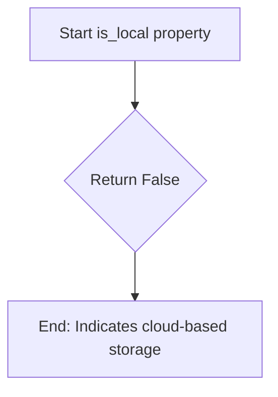

#### 带注释源码

```python
@property
def is_local(self) -> bool:
    """Whether the storage is local (i.e. on the same machine, not cloud-based)."""
    return False
```

**代码说明：**

- 这是一个只读属性（使用 `@property` 装饰器）
- 该属性用于判断文件存储是否为本地存储
- 对于 `GCSFileStorage`（Google Cloud Storage）来说，存储是云端的，因此始终返回 `False`
- 这个属性在基类 `FileStorage` 中可能有不同的实现，用于区分本地存储和云存储的逻辑分支


### `GCSFileStorage.initialize`

该方法用于初始化 GCS 文件存储，尝试获取指定的 GCS bucket，如果 bucket 不存在则自动创建。

参数：

- 该方法无参数（除隐含的 `self`）

返回值：`None`，无返回值

#### 流程图

```mermaid
flowchart TD
    A[开始 initialize] --> B[记录调试日志: 'Initializing {repr}...']
    B --> C[尝试获取 GCS Bucket: self._gcs.get_bucket]
    C --> D{是否找到 Bucket?}
    D -->|是| E[将获取的 Bucket 赋值给 self._bucket]
    D -->|否| F[记录日志: Bucket 不存在, 正在创建...]
    F --> G[创建 Bucket: self._gcs.create_bucket]
    G --> H[将新创建的 Bucket 赋值给 self._bucket]
    E --> I[结束]
    H --> I
```

#### 带注释源码

```python
def initialize(self) -> None:
    """Initialize the GCS file storage by connecting to or creating a bucket."""
    # 记录调试日志，输出当前存储对象的表示形式
    logger.debug(f"Initializing {repr(self)}...")
    try:
        # 尝试从 Google Cloud Storage 获取指定的 bucket
        self._bucket = self._gcs.get_bucket(self._bucket_name)
    except NotFound:
        # 如果 bucket 不存在，记录信息日志并创建新的 bucket
        logger.info(f"Bucket '{self._bucket_name}' does not exist; creating it...")
        self._bucket = self._gcs.create_bucket(self._bucket_name)
```


### `GCSFileStorage.get_path`

该方法用于将传入的相对路径转换为基于GCS存储根目录的绝对路径，并移除路径开头的斜杠，以适配GCS的文件命名规范。由于GCS的根路径在初始化时被设置为以"/"开头，但GCS的blob名称中不应包含这个前缀，因此需要通过`relative_to("/")`移除这个前缀。

参数：

- `relative_path`：`str | Path`，需要转换的相对路径，可以是字符串或Path对象

返回值：`Path`，转换后的绝对路径，已移除开头的斜杠

#### 流程图

```mermaid
flowchart TD
    A[开始 get_path] --> B[调用父类方法 super().get_path]
    B --> C[获取完整路径包含根目录]
    C --> D{调用 relative_to}
    D --> E[传入参数 '/']
    E --> F[移除路径开头的 '/' 前缀]
    F --> G[返回处理后的 Path 对象]
```

#### 带注释源码

```python
def get_path(self, relative_path: str | Path) -> Path:
    """
    获取相对于GCS存储根目录的绝对路径。
    
    由于GCS根路径在初始化时被设置为以'/'开头（例如：/autogpt），
    但在GCS的blob名称中不应包含这个前缀，
    因此使用relative_to('/')移除该前缀以获得正确的存储文件名。
    
    参数:
        relative_path: 相对路径，类型为str或Path
        
    返回:
        相对于根目录的绝对路径，已移除开头的斜杠
    """
    # 我们在根路径前添加了 "/"
    # 但 relative_to("/") 会移除它
    # 因为我们实际上不希望它在存储文件名中
    return super().get_path(relative_path).relative_to("/")
```


### `GCSFileStorage._get_blob`

获取指定路径对应的 Google Cloud Storage Blob 对象。

参数：

- `path`：`str | Path`，要获取 Blob 的文件路径（相对路径或绝对路径）

返回值：`storage.Blob`，Google Cloud Storage 存储桶中的 Blob 对象

#### 流程图

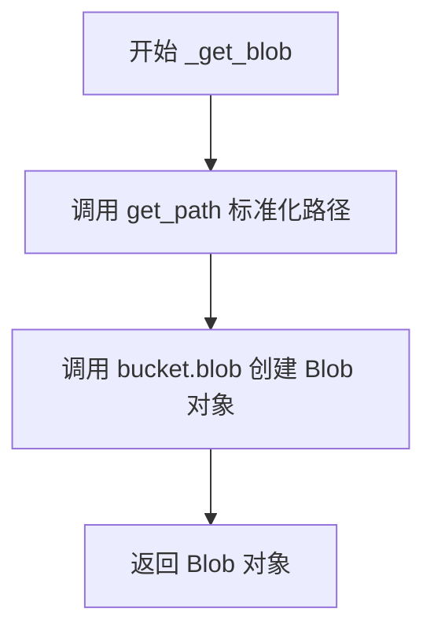

#### 带注释源码

```python
def _get_blob(self, path: str | Path) -> storage.Blob:
    """
    获取指定路径对应的 Google Cloud Storage Blob 对象。
    
    参数:
        path: str | Path，要获取 Blob 的文件路径
        
    返回:
        storage.Blob，GCS 存储桶中的 Blob 对象
    """
    # 1. 将传入的路径标准化（处理相对路径、转换为绝对路径等）
    path = self.get_path(path)
    
    # 2. 使用 GCS bucket 的 blob 方法创建 Blob 对象
    #    将 Path 对象转换为字符串
    return self._bucket.blob(str(path))
```


### `GCSFileStorage.open_file`

该方法用于在 Google Cloud Storage 中打开一个文件，支持文本和二进制模式读取或写入。它通过获取 Blob 对象并调用其 open 方法返回一个文件句柄（TextIOWrapper、BlobReader 或 BlobWriter）。

参数：

- `path`：`str | Path`，要打开的文件路径
- `mode`：`Literal["r", "w"] = "r"`，打开模式，默认为读模式（"r" 表示读取，"w" 表示写入）
- `binary`：`bool = False`，是否以二进制模式打开，默认为 False（文本模式）

返回值：`BlobReader | BlobWriter | TextIOWrapper`，根据 mode 和 binary 参数返回不同类型的文件句柄：
- 文本读模式（"r", binary=False）返回 TextIOWrapper
- 二进制读模式（"r", binary=True）返回 BlobReader
- 二进制写模式（"w", binary=True）返回 BlobWriter

#### 流程图

```mermaid
flowchart TD
    A[Start open_file] --> B[获取Blob对象: self._get_blob(path)]
    B --> C[调用 blob.reload 锁定修订版本号]
    C --> D{判断 binary 参数}
    D -->|True| E[将 'b' 追加到 mode 后面<br/>例如 'r' 变为 'rb'，'w' 变为 'wb']
    D -->|False| F[保持原 mode 不变]
    E --> G[调用 blob.open 方法打开文件]
    F --> G
    G --> H[返回文件句柄]
    
    H --> I{binary=False 且 mode='r'}
    I -->|是| J[返回 TextIOWrapper]
    I -->|否| K{binary=True 且 mode='r'}
    K -->|是| L[返回 BlobReader]
    K -->|否| M[返回 BlobWriter]
```

#### 带注释源码

```python
@overload
def open_file(
    self,
    path: str | Path,
    mode: Literal["r", "w"] = "r",
    binary: Literal[False] = False,
) -> TextIOWrapper:
    """打开文件用于文本读取或写入（默认）"""
    ...

@overload
def open_file(
    self, path: str | Path, mode: Literal["r"], binary: Literal[True]
) -> BlobReader:
    """以二进制模式打开文件用于读取"""
    ...

@overload
def open_file(
    self, path: str | Path, mode: Literal["w"], binary: Literal[True]
) -> BlobWriter:
    """以二进制模式打开文件用于写入"""
    ...

@overload
def open_file(
    self, path: str | Path, mode: Literal["r", "w"], binary: Literal[True]
) -> BlobWriter | BlobReader:
    """以二进制模式打开文件（返回类型取决于 mode）"""
    ...

@overload
def open_file(self, path: str | Path, *, binary: Literal[True]) -> BlobReader:
    """仅读取模式且二进制（默认 mode='r'）"""
    ...

@overload
def open_file(
    self, path: str | Path, mode: Literal["r", "w"] = "r", binary: bool = False
) -> BlobReader | BlobWriter | TextIOWrapper:
    """通用重载签名"""
    ...

# 实际实现方法
# 使用 # pyright: ignore[reportIncompatibleMethodOverride] 忽略 pyright 的类型检查警告
def open_file(  # pyright: ignore[reportIncompatibleMethodOverride]
    self, path: str | Path, mode: Literal["r", "w"] = "r", binary: bool = False
) -> BlobReader | BlobWriter | TextIOWrapper:
    """Open a file in the storage."""
    # 1. 根据路径获取 GCS Blob 对象
    blob = self._get_blob(path)
    # 2. 重新加载 Blob 以锁定修订版本号，防止读取时版本混合
    blob.reload()  # pin revision number to prevent version mixing while reading
    # 3. 根据 binary 参数决定是否添加 'b' 后缀
    #    - binary=True: 'r' -> 'rb', 'w' -> 'wb'
    #    - binary=False: 'r' -> 'r', 'w' -> 'w'
    # 4. 调用 Blob 的 open 方法打开文件并返回对应的文件句柄
    return blob.open(f"{mode}b" if binary else mode)
```


### `GCSFileStorage.read_file`

读取 GCS 存储中的文件内容，支持文本和二进制两种模式。

参数：

- `path`：`str | Path`，要读取的文件路径
- `binary`：`bool = False`，是否以二进制模式读取（True 为二进制，False 为文本）

返回值：`str | bytes`，文件内容（文本模式返回 str，二进制模式返回 bytes）

#### 流程图

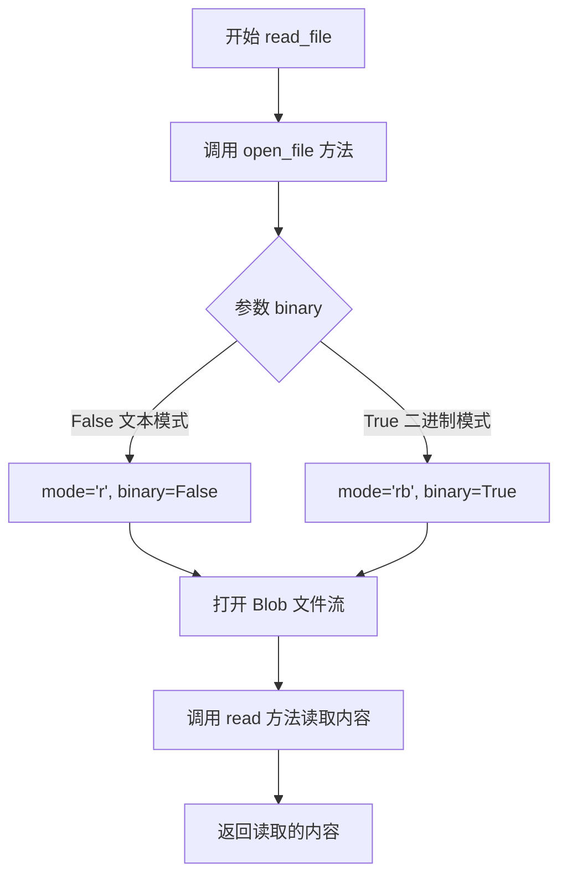

#### 带注释源码

```python
@overload
def read_file(self, path: str | Path, binary: Literal[False] = False) -> str:
    """Read a file in the storage as text."""
    ...

@overload
def read_file(self, path: str | Path, binary: Literal[True]) -> bytes:
    """Read a file in the storage as binary."""
    ...

@overload
def read_file(self, path: str | Path, binary: bool = False) -> str | bytes:
    """Read a file in the storage."""
    ...

def read_file(self, path: str | Path, binary: bool = False) -> str | bytes:
    """Read a file in the storage.
    
    通过调用 open_file 方法打开文件，然后读取全部内容返回。
    - 当 binary=False 时，以文本模式读取，返回 str 类型
    - 当 binary=True 时，以二进制模式读取，返回 bytes 类型
    """
    # 调用 open_file 方法打开文件，mode 固定为 "r"（读取模式）
    # binary 参数决定是否以二进制模式打开
    # open_file 内部会将 mode 转换为 "rb" 如果 binary=True
    return self.open_file(path, "r", binary).read()
```


### `GCSFileStorage.write_file`

将内容写入 Google Cloud Storage 存储中的文件，支持文本和二进制内容，并可选地触发写入回调。

参数：

- `path`：`str | Path`，要写入的文件路径
- `content`：`str | bytes`，要写入的内容，字符串将作为文本写入，字节将作为二进制写入

返回值：`None`，无返回值（异步方法）

#### 流程图

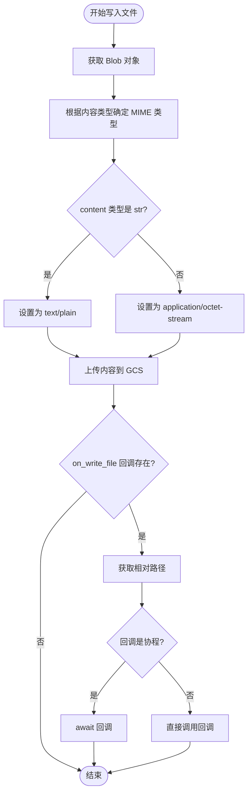

#### 带注释源码

```python
async def write_file(self, path: str | Path, content: str | bytes) -> None:
    """Write to a file in the storage."""
    # 通过路径获取对应的 Blob 对象
    blob = self._get_blob(path)

    # 使用 upload_from_string 将内容上传到 GCS
    # 根据内容类型设置 MIME 类型：
    # - 如果是字符串，使用 "text/plain"
    # - 如果是字节，使用 "application/octet-stream"
    blob.upload_from_string(
        data=content,
        content_type=(
            "text/plain"
            if type(content) is str
            # TODO: get MIME type from file extension or binary content
            else "application/octet-stream"
        ),
    )

    # 检查是否注册了写入文件后的回调函数
    if self.on_write_file:
        # 将路径转换为 Path 对象
        path = Path(path)
        # 如果是绝对路径，转换为相对于根目录的路径
        if path.is_absolute():
            path = path.relative_to(self.root)
        
        # 调用回调函数，传入相对路径
        res = self.on_write_file(path)
        
        # 如果回调函数返回的是协程（可等待对象），则等待其完成
        if inspect.isawaitable(res):
            await res
```


### `GCSFileStorage.list_files`

列出存储中指定目录下的所有文件（递归遍历），返回相对于指定路径的文件路径列表。

参数：

- `path`：`str | Path`，默认值 `"."`，指定要列出文件的目录路径，默认为当前目录

返回值：`list[Path]`，返回 Path 对象列表，表示相对于指定路径的所有文件路径

#### 流程图

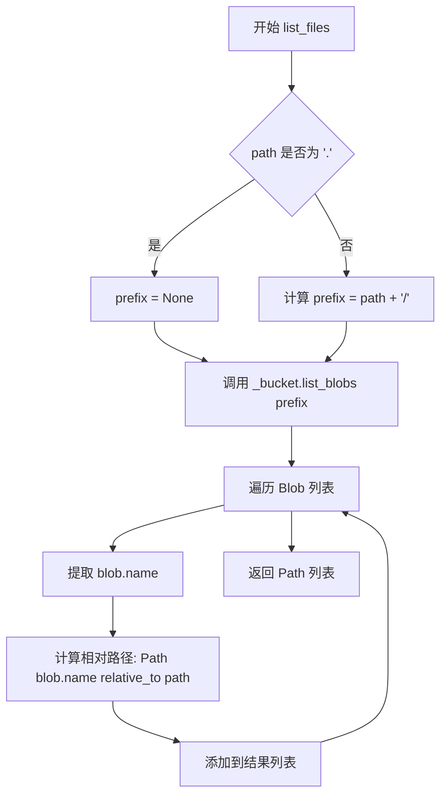

#### 带注释源码

```python
def list_files(self, path: str | Path = ".") -> list[Path]:
    """List all files (recursively) in a directory in the storage."""
    # 1. 将输入路径转换为标准化的 Path 对象
    #    get_path 方法会处理相对路径转换、根路径添加等逻辑
    path = self.get_path(path)
    
    # 2. 使用 GCS Bucket 的 list_blobs 方法列出所有匹配的 Blob
    #    - 如果 path 是 "." (根目录)，则 prefix 为 None，列出所有文件
    #    - 否则只列出以 path/ 为前缀的文件（即该目录下的所有文件）
    # 3. list_blobs 返回一个迭代器，包含所有匹配的 Blob 对象
    # 4. 对每个 Blob，提取其名称并计算相对于输入 path 的路径
    #    这会去除前缀路径，只返回相对于查询目录的文件路径
    return [
        Path(blob.name).relative_to(path)
        for blob in self._bucket.list_blobs(
            prefix=f"{path}/" if path != Path(".") else None
        )
    ]
```

---

#### 关键组件信息

| 名称 | 一句话描述 |
|------|------------|
| `GCSFileStorage` | 提供与 Google Cloud Storage 存储交互的文件系统接口实现 |
| `storage.Client` | Google Cloud Storage Python 客户端，用于与 GCS API 交互 |
| `storage.Bucket` | 表示 GCS 存储桶对象，提供 blob 操作方法如 `list_blobs`、`blob` 等 |
| `storage.Blob` | 表示 GCS 中的文件对象，包含文件名、内容等属性 |
| `Path` | Python 标准库路径对象，用于处理和转换文件路径 |

#### 技术债务与优化空间

1. **未过滤目录条目**：`list_blobs` 会返回所有以 prefix 开头的对象，包括嵌套目录中的对象。如果 GCS 中存在空目录或仅包含子目录的文件夹，`list_files` 可能返回意外的路径结果。建议在返回前过滤掉以 `/` 结尾的名称（表示目录）。

2. **缺少错误处理**：如果 GCS 认证失败、存储桶不存在或网络异常，方法会直接抛出 Google Cloud 异常，缺乏友好的错误提示和重试机制。

3. **性能考虑**：对于大型存储桶，`list_blobs` 可能返回大量结果，当前实现会将所有结果加载到内存中。建议考虑添加分页支持或生成器模式。

4. **路径处理边界情况**：`path != Path(".")` 的比较在某些边界情况下可能不如显式检查 `path == Path(".")` 可靠。

#### 其它项目

**设计目标与约束：**
- 实现与 `FileStorage` 基类一致的文件系统接口
- 使用 GCS 的 prefix 搜索模拟目录遍历
- GCS 没有真正的目录概念，所有对象都是 Blob

**错误处理与异常设计：**
- 依赖 Google Cloud Storage 客户端的默认异常传播
- `get_path` 方法会调用基类实现，可能抛出路径相关异常
- 建议在调用处捕获 `google.cloud.exceptions` 中的异常

**外部依赖与接口契约：**
- 依赖 `google-cloud-storage` 库
- 需要有效的 GCS 认证（通过环境变量或默认凭证）
- 返回的路径是相对路径，基于输入的 `path` 参数


### `GCSFileStorage.list_folders`

列出存储中指定路径下的所有文件夹（目录），支持递归和非递归两种模式。

参数：

- `path`：`str | Path`，默认为 `"."`，要列出文件夹的目标路径，默认为当前根路径
- `recursive`：`bool`，默认为 `False`，是否递归列出所有嵌套的子文件夹，False 只列出直接子文件夹

返回值：`list[Path]`，返回包含所有文件夹路径的列表，每个元素都是相对路径的 Path 对象

#### 流程图

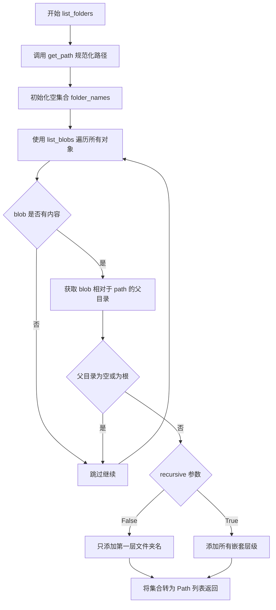

#### 带注释源码

```python
def list_folders(
    self, path: str | Path = ".", recursive: bool = False
) -> list[Path]:
    """List 'directories' directly in a given path or recursively in the storage."""
    # 规范化路径：将传入的路径转换为标准化的 Path 对象
    path = self.get_path(path)
    # 使用集合存储文件夹名，利用集合的去重特性
    folder_names = set()

    # 使用 GCS 的 list_blobs 方法列出所有对象（文件）
    # 注意：GCS 没有真正的目录，通过对象前缀模拟
    for blob in self._bucket.list_blobs(prefix=path):
        # 获取 blob 名称相对于查询路径的部分，然后取其父目录
        # 这样可以找出包含该文件的目录结构
        folder = Path(blob.name).relative_to(path).parent
        # 如果父目录为空或是当前目录根路径，说明是顶层文件，跳过
        if not folder or folder == Path("."):
            continue
        # 非递归模式：只添加第一层级的文件夹
        if not recursive:
            # 取文件夹路径的第一个部分（即直接子文件夹）
            folder_names.add(folder.parts[0])
        else:
            # 递归模式：需要添加所有嵌套的文件夹层级
            # 遍历所有层级，每一层都生成一个路径
            for i in range(len(folder.parts)):
                folder_names.add("/".join(folder.parts[: i + 1]))

    # 将集合转换为 Path 对象列表并返回
    return [Path(f) for f in folder_names]
```


### `GCSFileStorage.delete_file`

该方法用于从 Google Cloud Storage 存储中删除指定路径的文件。

参数：

- `path`：`str | Path`，要删除的文件路径

返回值：`None`，无返回值，操作完成后直接结束

#### 流程图

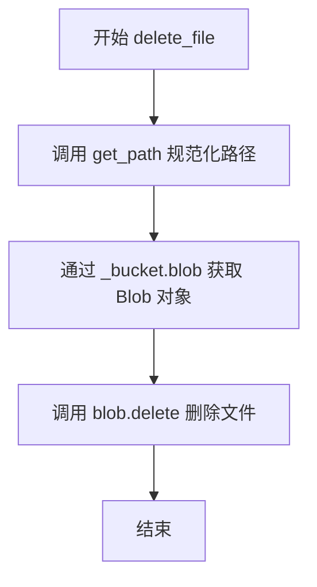

#### 带注释源码

```python
def delete_file(self, path: str | Path) -> None:
    """Delete a file in the storage."""
    # 1. 调用 get_path 方法将传入的相对路径或绝对路径转换为标准化的相对路径
    #    该方法会将根路径前缀移除，确保路径格式统一
    path = self.get_path(path)
    
    # 2. 根据路径创建 GCS Blob 对象
    #    Blob 对象代表 GCS 存储桶中的单个文件
    blob = self._bucket.blob(str(path))
    
    # 3. 调用 Blob 的 delete 方法从 GCS 存储桶中删除该文件
    #    如果文件不存在，GCS SDK 会抛出 google.cloud.exceptions.NotFound 异常
    blob.delete()
```


### `GCSFileStorage.delete_dir`

删除存储中的空文件夹。由于Google Cloud Storage（GCS）本质上是一个扁平的对象存储系统，没有真正的目录概念，因此该方法不执行任何实际删除操作。

参数：

- `path`：`str | Path`，需要删除的文件夹路径

返回值：`None`，无返回值

#### 流程图

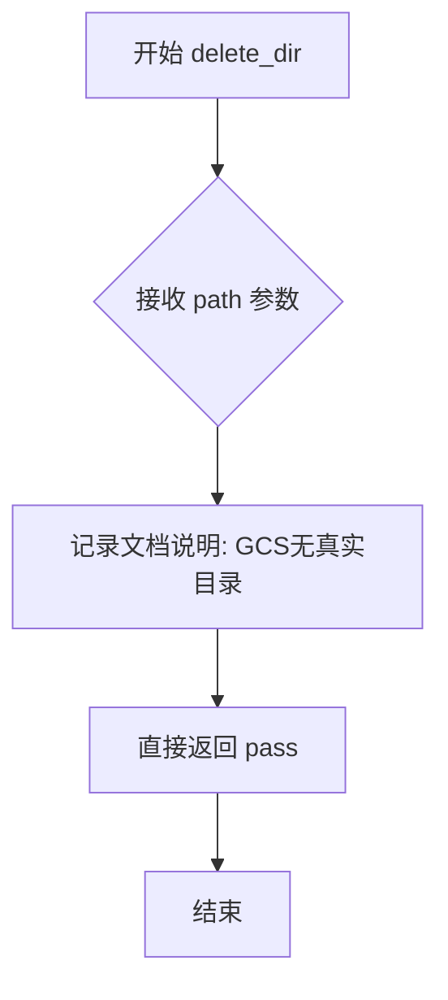

#### 带注释源码

```python
def delete_dir(self, path: str | Path) -> None:
    """Delete an empty folder in the storage."""
    # Since GCS does not have directories, we don't need to do anything
    # Google Cloud Storage 使用对象存储模型，没有传统文件系统中的目录概念
    # GCS 中的"文件夹"只是通过对象名称前缀模拟的视觉展示
    # 因此删除操作实际上不需要做任何事情，pass 表示空操作
    pass
```

---

#### 技术债务或优化空间

1. **方法实现不完整**：当前实现是一个空操作（pass），如果调用者期望删除实际内容，可能导致逻辑错误。建议在方法中添加文档说明或抛出明确的异常/警告。

2. **缺少验证逻辑**：可以添加对路径格式的验证，确保传入的路径符合GCS命名规范。

3. **与父类接口不一致**：如果基类 `FileStorage` 中 `delete_dir` 方法有删除非空目录的逻辑，这里直接pass可能违反Liskov替换原则。

#### 其它项目

- **设计约束**：GCS的存储模型决定了无法像传统文件系统那样操作目录。
- **外部依赖**：依赖 `google.cloud.storage` 库。
- **接口契约**：遵循 `FileStorage` 基类定义的接口规范。


### `GCSFileStorage.exists`

检查给定路径在 Google Cloud Storage 存储中是否对应文件或文件夹存在。

参数：

- `path`：`str | Path`，需要检查存在性的文件或文件夹路径

返回值：`bool`，如果路径对应文件或文件夹存在则返回 `True`，否则返回 `False`

#### 流程图

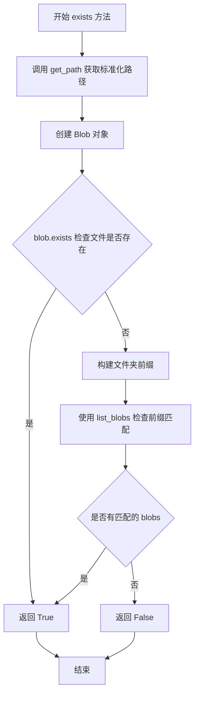

#### 带注释源码

```python
def exists(self, path: str | Path) -> bool:
    """Check if a file or folder exists in GCS storage."""
    # 使用 get_path 方法将路径标准化并获取相对路径
    path = self.get_path(path)
    
    # 检查精确匹配的 Blob（文件）
    blob = self._bucket.blob(str(path))
    if blob.exists():
        return True  # 文件存在，直接返回 True
    
    # 检查是否有以该路径为前缀的 Blob（文件夹）
    # 移除路径末尾的斜杠并添加斜杠形成文件夹前缀
    prefix = f"{str(path).rstrip('/')}/"
    # 列出匹配前缀的 blobs，使用 max_results=1 优化性能
    blobs = self._bucket.list_blobs(prefix=prefix, max_results=1)
    # 如果存在至少一个匹配的 blob，则认为文件夹存在
    return next(blobs, None) is not None
```


### `GCSFileStorage.make_dir`

在存储中创建一个目录（如果不存在）。由于 Google Cloud Storage 没有真正的目录概念，该方法实际上不执行任何操作。

参数：

- `path`：`str | Path`，要创建的目录路径

返回值：`None`，此方法不返回任何值

#### 流程图

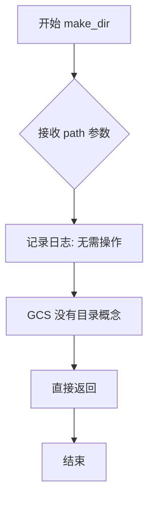

#### 带注释源码

```python
def make_dir(self, path: str | Path) -> None:
    """Create a directory in the storage if doesn't exist."""
    # GCS does not have directories, so we don't need to do anything
    pass
```


### `GCSFileStorage.rename`

该方法用于在 Google Cloud Storage 存储中重命名文件或文件夹，支持单文件重命名和文件夹批量重命名两种操作。

参数：

- `old_path`：`str | Path`，需要重命名的文件或文件夹的原始路径
- `new_path`：`str | Path`，重命名后的目标路径（新名称）

返回值：`None`，无返回值

#### 流程图

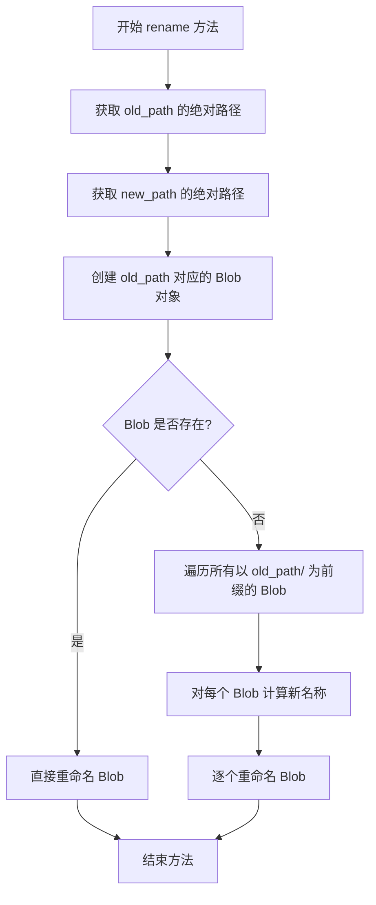

#### 带注释源码

```python
def rename(self, old_path: str | Path, new_path: str | Path) -> None:
    """Rename a file or folder in the storage."""
    # 将 old_path 转换为绝对路径（相对于 GCS 根目录）
    old_path = self.get_path(old_path)
    # 将 new_path 转换为绝对路径
    new_path = self.get_path(new_path)
    # 获取 old_path 对应的 Blob 对象
    blob = self._bucket.blob(str(old_path))
    # 如果 Blob 已存在（文件），直接重命名该文件
    if blob.exists():
        self._bucket.rename_blob(blob, new_name=str(new_path))
        return
    # 否则，遍历所有以 old_path/ 为前缀的 Blob（文件夹场景）
    for blob in self._bucket.list_blobs(prefix=f"{old_path}/"):
        # 计算新名称：替换旧路径前缀为新路径前缀
        new_name = str(blob.name).replace(str(old_path), str(new_path), 1)
        # 逐个重命名每个 Blob
        self._bucket.rename_blob(blob, new_name=new_name)
```


### `GCSFileStorage.copy`

将文件或文件夹及其所有内容复制到存储中的目标位置。

参数：

- `source`：`str | Path`，源文件或文件夹路径
- `destination`：`str | Path`，目标文件或文件夹路径

返回值：`None`，无返回值，执行复制操作后直接返回

#### 流程图

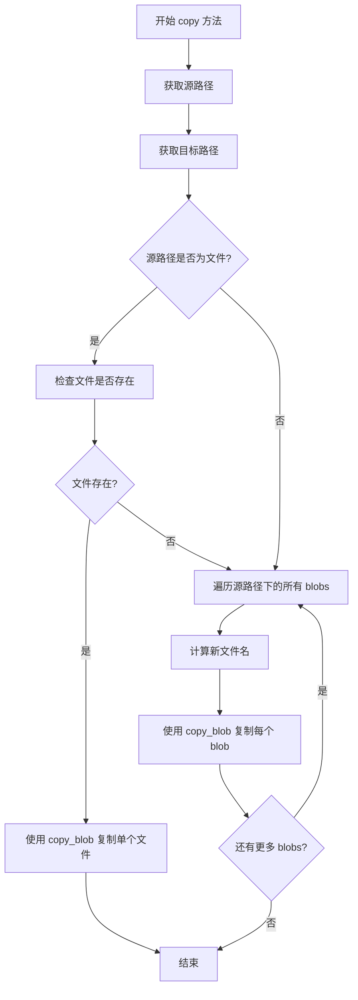

#### 带注释源码

```python
def copy(self, source: str | Path, destination: str | Path) -> None:
    """Copy a file or folder with all contents in the storage."""
    # 将源路径和目标路径转换为标准化的 Path 对象
    source = self.get_path(source)
    destination = self.get_path(destination)
    
    # 如果源路径是一个文件（精确匹配），直接复制该文件
    if self._bucket.blob(str(source)).exists():
        # 使用 GCS 的 copy_blob 方法复制单个文件到目标位置
        self._bucket.copy_blob(
            self._bucket.blob(str(source)),  # 源 blob
            self._bucket,                     # 目标 bucket
            str(destination)                  # 目标路径
        )
        return
    
    # 否则，源路径是一个文件夹，复制该文件夹下的所有 blobs
    # 遍历源路径前缀下的所有 blob 对象
    for blob in self._bucket.list_blobs(prefix=f"{source}/"):
        # 计算新名称：将源路径替换为目标路径
        new_name = str(blob.name).replace(str(source), str(destination), 1)
        # 复制每个 blob 到目标位置
        self._bucket.copy_blob(blob, self._bucket, new_name)
```


### `GCSFileStorage.clone_with_subroot`

创建一个新的 GCSFileStorage 实例，其根路径设置为当前存储的子目录。该方法通过复制现有实例的 GCS 客户端和存储桶引用来创建新实例，从而实现资源共享。

参数：

- `subroot`：`str | Path`，用于指定新存储实例的子根路径

返回值：`GCSFileStorage`，返回一个新的 GCSFileStorage 实例，其根路径为当前存储的子目录

#### 流程图

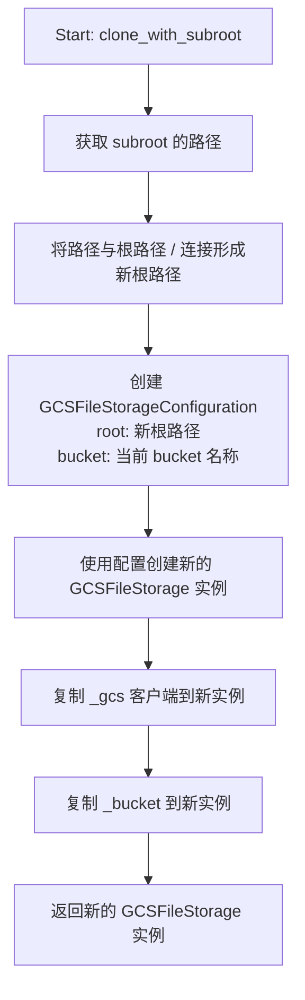

#### 带注释源码

```python
def clone_with_subroot(self, subroot: str | Path) -> GCSFileStorage:
    """Create a new GCSFileStorage with a subroot of the current storage."""
    # 使用当前实例的 get_path 方法获取 subroot 的标准化路径
    # 然后与根路径 "/" 连接，形成新的根路径
    file_storage = GCSFileStorage(
        GCSFileStorageConfiguration(
            root=Path("/").joinpath(self.get_path(subroot)),  # 构建新实例的根路径
            bucket=self._bucket_name,  # 保持与原实例相同的 bucket 名称
        )
    )
    # 直接复制 GCS 客户端对象，避免重新创建连接
    file_storage._gcs = self._gcs
    # 直接复制 bucket 引用，共享同一个 GCS Bucket 对象
    file_storage._bucket = self._bucket
    return file_storage  # 返回配置好但未初始化（initialize）的新实例
```


### `GCSFileStorage.__repr__`

该方法是 Python 的特殊方法，用于返回对象的官方字符串表示，通常用于调试和日志输出。它返回一个包含类名、存储桶名称和根路径的格式化字符串。

参数：

- `self`：`GCSFileStorage`，类的实例本身，包含所有实例属性

返回值：`str`，返回对象的官方字符串表示，格式为 `GCSFileStorage(bucket='bucket_name', root=root_path)`

#### 流程图

```mermaid
flowchart TD
    A[__repr__ 方法被调用] --> B[获取类名: __class__.__name__]
    B --> C[获取 bucket 名称: self._bucket_name]
    C --> D[获取根路径: self._root]
    D --> E[格式化字符串: GCSFileStorage(bucket='...', root=...)]
    E --> F[返回字符串]
```

#### 带注释源码

```python
def __repr__(self) -> str:
    """
    返回对象的官方字符串表示。
    
    Returns:
        str: 包含类名、存储桶名称和根路径的字符串表示。
    """
    # 使用 f-string 格式化字符串
    # __class__.__name__ 获取当前类的名称（即 'GCSFileStorage'）
    # self._bucket_name 是 GCS 存储桶的名称
    # self._root 是文件存储的根路径（Path 对象）
    return f"{__class__.__name__}(bucket='{self._bucket_name}', root={self._root})"
```

## 关键组件


### GCS 存储桶管理

负责初始化 Google Cloud Storage 客户端并创建或获取存储桶，包含 bucket 名称配置和错误处理机制。

### 文件打开与读取

通过 open_file 方法使用 BlobReader/BlobWriter 打开文件，使用 blob.reload() 固定修订版本号以防止读取时版本混合，支持文本和二进制模式。

### 文件写入

通过 write_file 异步方法将内容上传到 GCS，支持字符串和字节内容，根据内容类型设置 MIME 类型，并触发写入回调。

### 路径解析

get_path 方法将相对路径转换为 GCS 内部路径格式，_get_blob 方法获取指定路径的 Blob 对象，处理路径前缀和根目录逻辑。

### 文件列表遍历

list_files 递归列出指定目录下的所有文件，list_folders 支持递归和非递归模式列出目录，通过 list_blobs 使用 prefix 和 delimiter 实现。

### 文件存在性检查

exists 方法通过精确匹配 Blob 和前缀匹配两种方式检查文件或目录是否存在，先检查精确 Blob 再检查前缀。

### 文件与目录重命名

rename 方法支持单文件重命名和目录重命名，目录重命名通过遍历所有带前缀的 Blob 并替换路径实现。

### 文件与目录复制

copy 方法支持单文件复制和目录复制，目录复制遍历源路径前缀下的所有 Blob 并复制到目标路径。

### 子根克隆

clone_with_subroot 方法创建新的 GCSFileStorage 实例，使用子根路径配置，共享同一个 GCS 客户端和 Bucket 对象。


## 问题及建议


### 已知问题

-   **异常处理不完善**：`initialize` 方法只捕获 `NotFound` 异常，缺少对网络错误、权限问题等其他 GCP 异常的捕获和处理；`write_file`、`delete_file`、`rename`、`copy` 等方法均无异常处理
-   **`exists` 方法效率低下**：调用了两次存储操作（先检查 exact blob，再检查 prefix），可优化为单次查询
-   **类型判断方式不当**：`write_file` 中使用 `type(content) is str` 而非 `isinstance()`，不符合 Python 最佳实践
-   **路径处理使用字符串替换**：`rename` 和 `copy` 方法使用 `str.replace()` 进行路径替换，可能导致错误匹配（如路径包含相同字符串）
-   **`clone_with_subroot` 破坏封装性**：直接访问私有属性 `_gcs` 和 `_bucket`，应通过公开接口或工厂方法实现
-   **缺少超时配置**：`list_blobs` 等操作未设置超时参数，可能导致长时间阻塞
-   **`open_file` 每次都调用 `blob.reload()`**：每次打开文件都触发 API 调用 pinning revision，不必要的性能开销
-   **硬编码默认值**：`GCSFileStorageConfiguration` 的 `bucket` 默认值 "autogpt" 硬编码，缺乏灵活性
-   **`delete_dir` 和 `make_dir` 空实现**：未提供有意义的实现或文档说明，应考虑抛出 `NotImplementedError` 或添加相应逻辑

### 优化建议

-   为所有涉及 GCP 调用的方法添加异常处理和重试机制，使用 `google.api_core.retry.Retry`
-   优化 `exists` 方法，通过单个查询同时判断文件或文件夹是否存在
-   将 `type(content) is str` 改为 `isinstance(content, str)`
-   使用 `pathlib.Path` 的方法进行路径操作，避免字符串替换导致的潜在问题
-   重构 `clone_with_subroot`，通过配置对象或工厂方法传递内部状态
-   为 `list_blobs` 等方法添加超时配置，使用 `timeout` 参数
-   考虑在 `open_file` 中提供可选的 revision pinning，或添加配置项控制此行为
-   将 bucket 名称等配置抽离为环境变量或配置中心管理
-   为 `delete_dir` 和 `make_dir` 添加文档注释说明 GCS 无目录概念，或抛出明确异常
-   考虑使用生成器替代列表推导式，提高大规模文件遍历时的内存效率

## 其它


### 设计目标与约束

**设计目标**：为AutoGPT项目提供一个统一的文件存储抽象接口，实现将文件存储在Google Cloud Storage (GCS) 桶中的功能，支持文件的读写、列表、删除、重命名、复制等操作，同时保持与本地文件系统API的一致性。

**核心约束**：
1. 必须继承自`FileStorage`基类，实现所有抽象方法
2. GCS本身没有真正的目录概念，通过对象前缀模拟文件夹结构
3. 根路径必须为绝对路径，且以"/"开头
4. 文件操作必须遵循GCS的存储语义（如revision pinning）

### 错误处理与异常设计

**主要异常来源**：
1. **GCS客户端异常**：`google.cloud.exceptions.NotFound` - 桶不存在时创建新桶
2. **Blob操作异常**：读取不存在的文件、删除不存在的对象等GCS API返回的错误
3. **路径解析异常**：`ValueError` - 当传入的相对路径无法正确解析时

**错误处理策略**：
- `initialize()`方法捕获`NotFound`异常并自动创建桶
- `exists()`方法通过双重检查（精确匹配blob + 前缀匹配）判断文件/文件夹是否存在
- 文件操作失败时通过Python内置异常传播错误
- 使用`logger`记录关键操作和错误信息

### 外部依赖与接口契约

**外部依赖**：
- `google.cloud.storage` - GCS客户端库
- `google.cloud.exceptions` - GCS异常类
- `google.cloud.storage.fileio` - BlobReader/BlobWriter文件流
- `forge.models.config.UserConfigurable` - 配置模型
- `pathlib.Path` - 路径处理
- `typing` - 类型提示

**接口契约（FileStorage基类）**：
```
- initialize() -> None: 初始化存储连接
- open_file(path, mode, binary) -> BlobReader|BlobWriter|TextIOWrapper: 打开文件
- read_file(path, binary) -> str|bytes: 读取文件
- write_file(path, content) -> None: 写入文件
- list_files(path) -> list[Path]: 列出文件
- list_folders(path, recursive) -> list[Path]: 列出文件夹
- delete_file(path) -> None: 删除文件
- delete_dir(path) -> None: 删除空文件夹
- exists(path) -> bool: 检查是否存在
- make_dir(path) -> None: 创建目录
- rename(old_path, new_path) -> None: 重命名
- copy(source, destination) -> None: 复制
- clone_with_subroot(subroot) -> Self: 创建子根存储实例
```

### 数据流与状态机

**主要数据流**：
1. **写入流程**：用户调用`write_file()` → 获取Blob对象 → 调用`upload_from_string()`上传内容 → 触发`on_write_file`回调（如果设置）
2. **读取流程**：用户调用`read_file()`或`open_file()` → 获取Blob对象 → 调用`reload()`固定版本 → 打开文件流读取
3. **列表流程**：调用GCS的`list_blobs()`方法，通过prefix和delimiter模拟目录列表

**关键状态**：
- **未初始化状态**：构造函数执行后，`_bucket`属性未赋值
- **已初始化状态**：调用`initialize()`后，`_bucket`已获取或创建
- **运行状态**：可执行各种文件操作

### 并发与线程安全

**并发考虑**：
1. GCS客户端`storage.Client()`不是线程安全的，文档建议每个线程创建独立客户端，但当前实现中客户端在`__init__`创建并在多实例间共享（通过`clone_with_subroot`复制）
2. `blob.reload()`用于固定revision号，防止在读取过程中版本混合，这本身就是一种并发控制措施
3. 多个并发写入同一文件时，GCS会保留所有版本，但当前实现未启用版本控制

**优化建议**：考虑为每个请求创建独立的Client，或使用线程安全的连接池

### 性能考虑与优化空间

**当前实现性能特点**：
1. `list_files()`和`list_folders()`使用GCS的`list_blobs()`API，对于大桶可能较慢
2. `exists()`方法执行两次GCS API调用（精确匹配 + 前缀匹配），可优化
3. `rename()`和`copy()`对文件夹操作使用循环逐个处理blob，无批量操作优化

**优化建议**：
1. 实现缓存机制减少GCS API调用
2. `exists()`方法可合并为单次查询
3. 考虑使用GCS的Object Versioning减少版本混合风险
4. 对于大量小文件的场景，考虑批量操作API

### 安全考虑

1. **认证安全**：依赖GCS客户端的默认认证机制（环境变量`GOOGLE_APPLICATION_CREDENTIALS`或ADC）
2. **路径安全**：`get_path()`方法确保路径相对于root，防止路径遍历攻击
3. **数据安全**：支持二进制模式写入，可扩展支持服务端加密（CSE/KMS）

### 配置管理

**配置项**：
- `bucket`: GCS桶名称，通过`UserConfigurable`支持运行时配置和环境变量`STORAGE_BUCKET`
- `root`: 存储根路径，继承自`FileStorageConfiguration`
- `on_write_file`: 回调函数，写入后触发

**环境变量**：
- `STORAGE_BUCKET`: 指定GCS桶名称
- `GOOGLE_APPLICATION_CREDENTIALS`: GCS认证凭据路径

### 测试考虑

**单元测试要点**：
1. 模拟GCS客户端和Bucket行为
2. 测试各种路径解析情况（相对路径、绝对路径、根路径处理）
3. 测试`exists()`的双重检查逻辑
4. 测试文件夹的递归和非递归列表
5. 测试`clone_with_subroot()`的继承行为

**集成测试需要**：
1. 真实的GCS测试环境或模拟器（gcs-emulator）
2. 测试各种错误场景（无权限、桶不存在等）

### 版本与兼容性

**Python版本要求**：基于`__future__`注解使用，应支持Python 3.9+

**依赖版本约束**：
- `google-cloud-storage`: 主要依赖，需与GCS API版本兼容
- `pyright`: 类型检查工具配置忽略特定警告

### 日志与监控

**日志策略**：
- 使用`logger.debug()`记录初始化信息
- 使用`logger.info()`记录桶创建操作
- 错误通过异常传播，不捕获隐藏错误

**建议添加**：
- 文件操作的成功/失败计数指标
- API调用延迟监控
- 桶访问模式日志


    