# `.\AutoGPT\classic\forge\forge\file_storage\local.py` 详细设计文档

LocalFileStorage类实现了一个基于本地文件系统的文件存储方案，继承自FileStorage基类，提供文件的读写、删除、复制、重命名、目录操作等功能，并支持路径限制和子目录挂载。

## 整体流程

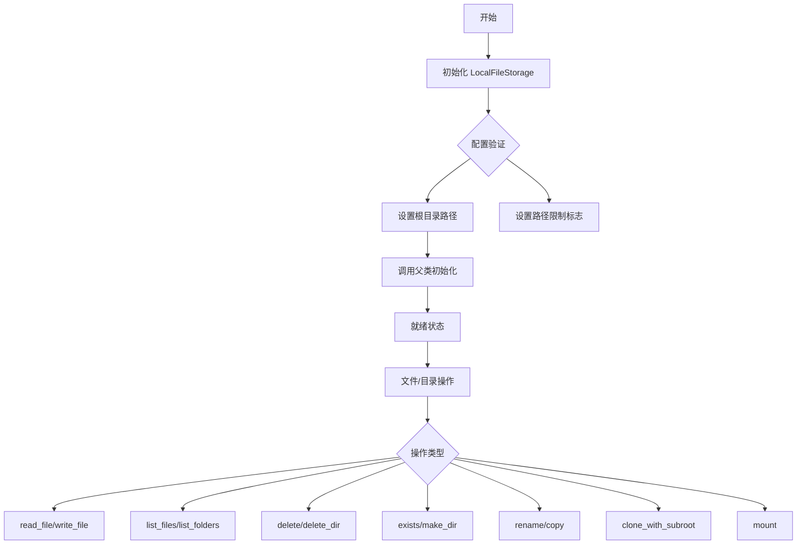

## 类结构

```
FileStorage (抽象基类)
└── LocalFileStorage (本地文件存储实现)
```

## 全局变量及字段


### `logger`
    
模块级日志记录器，用于记录类内部的运行状态和错误信息

类型：`logging.Logger`
    


### `LocalFileStorage._root`
    
存储根目录路径，指定文件存储的基准目录

类型：`Path`
    


### `LocalFileStorage._restrict_to_root`
    
是否限制操作在根目录内，防止文件操作超出指定目录范围

类型：`bool`
    
    

## 全局函数及方法


### `LocalFileStorage.write_file` 中的 `inspect.isawaitable` 调用

该部分代码用于在文件写入后检查回调函数（`on_write_file`）的返回值是否为协程，如果是则异步等待其完成。这是一种处理同步/异步回调的常见模式。

参数（`write_file` 方法）：

-  `path`：`str | Path`，要写入的文件路径
-  `content`：`str | bytes`，要写入的内容

返回值（`write_file` 方法）：`None`，无返回值

#### 流程图

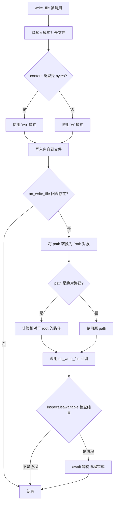

#### 带注释源码

```python
async def write_file(self, path: str | Path, content: str | bytes) -> None:
    """Write to a file in the storage."""
    # 根据 content 类型选择写入模式：bytes 用二进制模式，str 用文本模式
    with self._open_file(path, "wb" if type(content) is bytes else "w") as file:
        file.write(content)  # type: ignore

    # 检查是否存在写入后的回调函数 on_write_file
    if self.on_write_file:
        # 确保 path 是 Path 对象，以便后续处理
        path = Path(path)
        # 如果路径是绝对路径，转换为相对于 root 的路径
        if path.is_absolute():
            path = path.relative_to(self.root)
        
        # 调用回调函数，获取返回值
        res = self.on_write_file(path)
        
        # 使用 inspect.isawaitable 检查返回值是否为协程或可等待对象
        if inspect.isawaitable(res):
            # 如果是协程，则异步等待其完成
            await res
```


### `LocalFileStorage.mount`

上下文管理器装饰器，用于将文件存储挂载为本地路径，提供上下文管理器接口以便于在 `with` 语句中使用本地存储路径。

参数：

- `self`：`LocalFileStorage`，LocalFileStorage 类的实例
- `path`：`str | Path`，可选参数，默认为 `"."`，要挂载的路径（默认为当前目录）

返回值：`Generator[Path, Any, None]`，返回一个生成器形式的上下文管理器，生成一个绝对路径的 Path 对象

#### 流程图

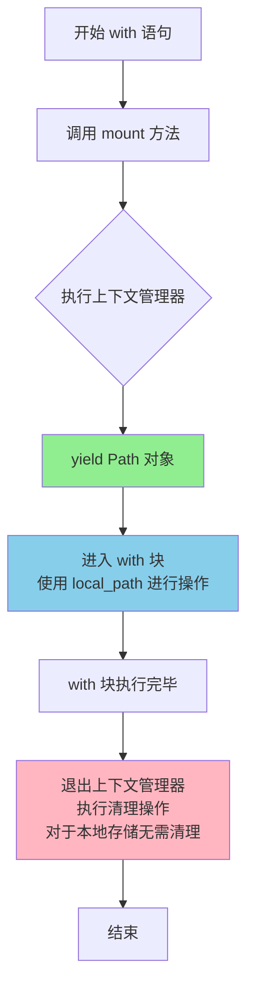

#### 带注释源码

```python
@contextmanager
def mount(self, path: str | Path = ".") -> Generator[Path, Any, None]:
    """Mount the file storage and provide a local path."""
    # No need to do anything for local storage
    # 对于本地存储，无需执行任何挂载操作
    # 直接解析并返回绝对路径即可
    yield Path(self.get_path(".")).absolute()
    # 上下文管理器退出时无需额外清理操作
    # 因为本地文件系统不需要 unmount
```

---

### 上下文管理器装饰器 `contextmanager` 详情

**装饰器来源**：`contextlib.contextmanager`

**参数**：
- 无显式参数，装饰器直接应用于函数

**返回值**：
- `_GeneratorContextManager`，一个上下文管理器类型

#### 流程图

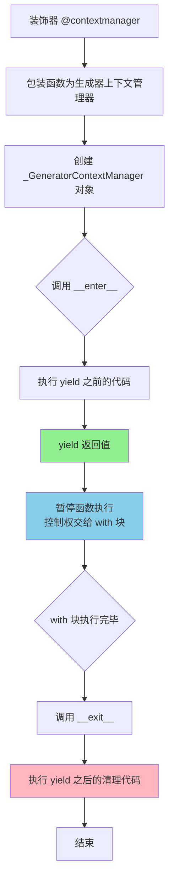

#### 带注释源码

```python
# 使用方式
@contextmanager
def mount(self, path: str | Path = ".") -> Generator[Path, Any, None]:
    """
    上下文管理器装饰器用法说明：
    
    1. 被装饰的函数必须是一个生成器函数（包含 yield）
    2. yield 之前的代码相当于 __enter__ 的功能
    3. yield 的值就是 with 语句中 as 绑定的值
    4. yield 之后的代码相当于 __exit__ 的功能，无论是否发生异常都会执行
    
    工作原理：
    - @contextmanager 将生成器函数转换为上下文管理器
    - 首次调用时，执行到 yield 暂停并返回生成的值
    - with 块执行完毕后，继续执行 yield 之后的清理代码
    """
    # 前置处理：获取绝对路径
    yield Path(self.get_path(".")).absolute()
    # 后置处理：本地存储无需清理操作
```


### `LocalFileStorage`

LocalFileStorage 类是用于处理本地文件系统的存储实现，继承自 FileStorage 基类，提供了对本地文件和目录的创建、读取、写入、删除、列表、复制、重命名等操作，并通过根目录限制确保文件访问的安全性。

#### 流程图

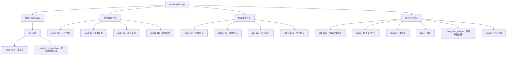

#### 带注释源码

```python
class LocalFileStorage(FileStorage):
    """A class that represents a file storage."""
    
    # ==================== 构造函数 ====================
    def __init__(self, config: FileStorageConfiguration):
        """
        初始化本地文件存储
        
        参数：
            config: FileStorageConfiguration - 存储配置对象，包含根目录和限制设置
        """
        self._root = config.root.resolve()  # 解析并存储根目录路径
        self._restrict_to_root = config.restrict_to_root  # 是否限制在根目录内
        self.make_dir(self.root)  # 确保根目录存在
        super().__init__()
    
    # ==================== 属性 ====================
    @property
    def root(self) -> Path:
        """The root directory of the file storage."""
        return self._root
    
    @property
    def restrict_to_root(self) -> bool:
        """Whether to restrict generated paths to the root."""
        return self._restrict_to_root
    
    @property
    def is_local(self) -> bool:
        """Whether the storage is local (i.e. on the same machine, not cloud-based)."""
        return True
    
    # ==================== 初始化方法 ====================
    def initialize(self) -> None:
        """初始化存储，确保根目录存在"""
        self.root.mkdir(exist_ok=True, parents=True)
    
    # ==================== 文件操作 ====================
    def open_file(
        self, 
        path: str | Path, 
        mode: Literal["w", "r"] = "r", 
        binary: bool = False
    ) -> TextIO | BinaryIO:
        """Open a file in the storage."""
        # 根据 binary 参数添加 'b' 模式
        return self._open_file(path, f"{mode}b" if binary else mode)
    
    def _open_file(self, path: str | Path, mode: str) -> TextIO | BinaryIO:
        """内部方法：打开文件"""
        full_path = self.get_path(path)  # 获取完整路径
        # 如果是写入模式，确保父目录存在
        if any(m in mode for m in ("w", "a", "x")):
            full_path.parent.mkdir(parents=True, exist_ok=True)
        return open(full_path, mode)  # type: ignore
    
    def read_file(self, path: str | Path, binary: bool = False) -> str | bytes:
        """Read a file in the storage."""
        with self._open_file(path, "rb" if binary else "r") as file:
            return file.read()
    
    async def write_file(self, path: str | Path, content: str | bytes) -> None:
        """Write to a file in the storage."""
        # 根据内容类型选择写入模式
        with self._open_file(path, "wb" if type(content) is bytes else "w") as file:
            file.write(content)  # type: ignore
        
        # 如果注册了写入回调，调用回调函数
        if self.on_write_file:
            path = Path(path)
            if path.is_absolute():
                path = path.relative_to(self.root)
            res = self.on_write_file(path)
            if inspect.isawaitable(res):
                await res
    
    # ==================== 目录操作 ====================
    def list_files(self, path: str | Path = ".") -> list[Path]:
        """List all files (recursively) in a directory in the storage."""
        path = self.get_path(path)
        return [file.relative_to(path) for file in path.rglob("*") if file.is_file()]
    
    def list_folders(
        self, path: str | Path = ".", recursive: bool = False
    ) -> list[Path]:
        """List directories directly in a given path or recursively."""
        path = self.get_path(path)
        if recursive:
            # 递归列出所有子目录
            return [
                folder.relative_to(path)
                for folder in path.rglob("*")
                if folder.is_dir()
            ]
        else:
            # 仅列出直接子目录
            return [
                folder.relative_to(path) for folder in path.iterdir() if folder.is_dir()
            ]
    
    def delete_file(self, path: str | Path) -> None:
        """Delete a file in the storage."""
        full_path = self.get_path(path)
        full_path.unlink()
    
    def delete_dir(self, path: str | Path) -> None:
        """Delete an empty folder in the storage."""
        full_path = self.get_path(path)
        full_path.rmdir()
    
    def make_dir(self, path: str | Path) -> None:
        """Create a directory in the storage if doesn't exist."""
        full_path = self.get_path(path)
        full_path.mkdir(exist_ok=True, parents=True)
    
    # ==================== 路径操作 ====================
    def exists(self, path: str | Path) -> bool:
        """Check if a file or folder exists in the storage."""
        return self.get_path(path).exists()
    
    def rename(self, old_path: str | Path, new_path: str | Path) -> None:
        """Rename a file or folder in the storage."""
        old_path = self.get_path(old_path)
        new_path = self.get_path(new_path)
        old_path.rename(new_path)
    
    def copy(self, source: str | Path, destination: str | Path) -> None:
        """Copy a file or folder with all contents in the storage."""
        source = self.get_path(source)
        destination = self.get_path(destination)
        if source.is_file():
            # 复制单个文件
            destination.write_bytes(source.read_bytes())
        else:
            # 递归复制目录
            destination.mkdir(exist_ok=True, parents=True)
            for file in source.rglob("*"):
                if file.is_file():
                    target = destination / file.relative_to(source)
                    target.parent.mkdir(exist_ok=True, parents=True)
                    target.write_bytes(file.read_bytes())
    
    def clone_with_subroot(self, subroot: str | Path) -> FileStorage:
        """Create a new LocalFileStorage with a subroot of the current storage."""
        return LocalFileStorage(
            FileStorageConfiguration(
                root=self.get_path(subroot),
                restrict_to_root=self.restrict_to_root,
            )
        )
    
    @contextmanager
    def mount(self, path: str | Path = ".") -> Generator[Path, Any, None]:
        """Mount the file storage and provide a local path."""
        # 本地存储不需要特殊挂载操作，直接返回绝对路径
        yield Path(self.get_path(".")).absolute()
```

---

### `LocalFileStorage.get_path` (继承自 FileStorage 基类)

由于 `get_path` 方法未在 `LocalFileStorage` 代码中定义，它应该继承自 `FileStorage` 基类。该方法负责将用户提供的相对路径转换为基于根目录的完整路径，并根据配置进行安全检查。

#### 流程图

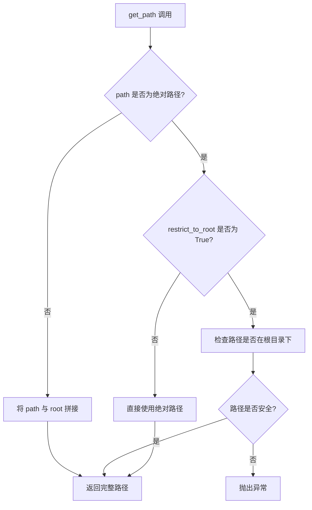

#### 推测源码 (基于 FileStorage 基类)

```python
# 推测的基类方法实现
def get_path(self, path: str | Path) -> Path:
    """
    将相对路径转换为基于根目录的完整路径
    
    参数：
        path: str | Path - 用户提供的路径
        
    返回值：
        Path - 完整的文件系统路径
        
    说明：
        - 如果 path 是绝对路径且 restrict_to_root=True，则验证路径是否在根目录下
        - 如果 path 是相对路径，则与 root 拼接
    """
    path = Path(path)
    
    # 如果是绝对路径且启用了根目录限制
    if path.is_absolute() and self.restrict_to_root:
        # 确保路径在根目录下，防止路径穿越攻击
        try:
            path = path.relative_to(self.root)
        except ValueError:
            raise ValueError(f"Path '{path}' is outside of the root '{self.root}'")
        return self.root / path
    
    # 相对路径直接与根目录拼接
    return self.root / path
```

---


### `LocalFileStorage.open_file`

`open_file` 方法是一个被 `@overload` 装饰器重载的函数，用于以不同模式打开存储中的文件。该方法提供了四种函数签名，支持文本/二进制模式、不同的 mode 参数组合，以及类型安全的返回值推断。

参数：

-  `path`：`str | Path`，文件路径
-  `mode`：`Literal["w", "r"]`，文件打开模式，默认为 `"r"`（读模式）
-  `binary`：`bool`，是否以二进制模式打开，默认为 `False`

返回值：`TextIO | BinaryIO`，返回文件对象，文本模式返回 `TextIO`，二进制模式返回 `BinaryIO`

#### 流程图

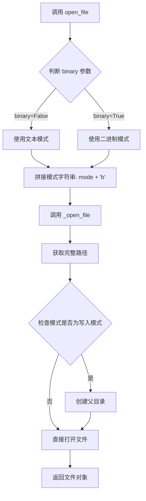

#### 带注释源码

```python
@overload
def open_file(
    self,
    path: str | Path,
    mode: Literal["w", "r"] = "r",
    binary: Literal[False] = False,
) -> TextIO:
    """重载1: 当 binary 明确为 False 时，返回 TextIO"""
    ...

@overload
def open_file(
    self, path: str | Path, mode: Literal["w", "r"], binary: Literal[True]
) -> BinaryIO:
    """重载2: 当 binary 明确为 True 时，返回 BinaryIO"""
    ...

@overload
def open_file(self, path: str | Path, *, binary: Literal[True]) -> BinaryIO:
    """重载3: 仅指定 binary=True（mode 使用默认值），返回 BinaryIO"""
    ...

@overload
def open_file(
    self, path: str | Path, mode: Literal["w", "r"] = "r", binary: bool = False
) -> TextIO | BinaryIO:
    """重载4: 默认重载，类型不确定时返回联合类型"""
    ...

def open_file(
    self, path: str | Path, mode: Literal["w", "r"] = "r", binary: bool = False
) -> TextIO | BinaryIO:
    """Open a file in the storage."""
    # 根据 binary 标志决定是否追加 'b' 后缀
    # binary=True 时模式变为 'rb' 或 'wb'
    return self._open_file(path, f"{mode}b" if binary else mode)

def _open_file(self, path: str | Path, mode: str) -> TextIO | BinaryIO:
    """内部方法：实际打开文件的底层实现"""
    # 将相对路径转换为绝对路径
    full_path = self.get_path(path)
    # 如果是写入模式，确保父目录存在
    if any(m in mode for m in ("w", "a", "x")):
        full_path.parent.mkdir(parents=True, exist_ok=True)
    # 调用 Python 内置 open 函数打开文件
    return open(full_path, mode)  # type: ignore
```

---

### `LocalFileStorage.read_file`

`read_file` 方法是一个被 `@overload` 装饰器重载的函数，用于以不同方式读取存储中的文件内容。该方法提供了三种函数签名，支持文本/二进制读取模式，并返回对应的数据类型。

参数：

-  `path`：`str | Path`，文件路径
-  `binary`：`bool`，是否以二进制模式读取，默认为 `False`

返回值：`str | bytes`，文本模式返回 `str`，二进制模式返回 `bytes`

#### 流程图

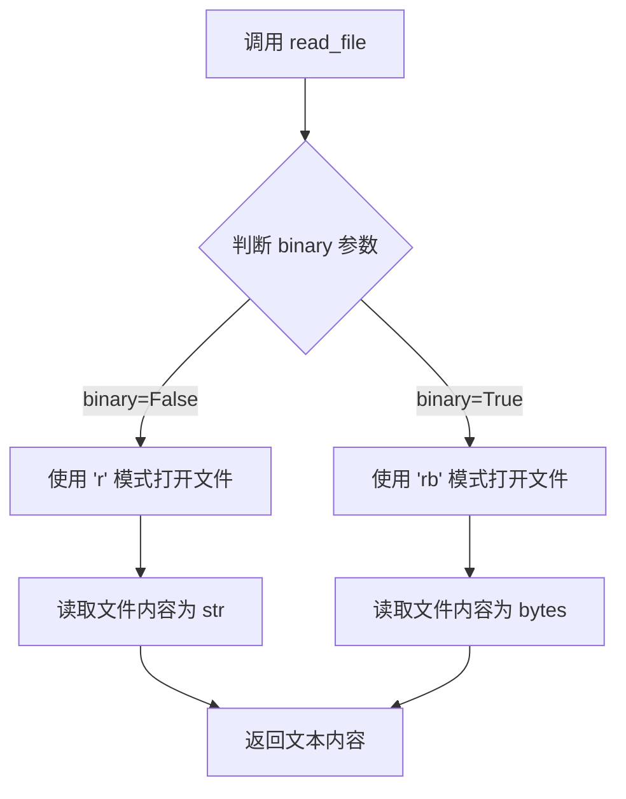

#### 带注释源码

```python
@overload
def read_file(self, path: str | Path, binary: Literal[False] = False) -> str:
    """重载1: 当 binary 明确为 False 时，返回 str"""
    """Read a file in the storage as text."""
    ...

@overload
def read_file(self, path: str | Path, binary: Literal[True]) -> bytes:
    """重载2: 当 binary 明确为 True 时，返回 bytes"""
    """Read a file in the storage as binary."""
    ...

@overload
def read_file(self, path: str | Path, binary: bool = False) -> str | bytes:
    """重载3: 默认重载，类型不确定时返回联合类型"""
    """Read a file in the storage."""
    ...

def read_file(self, path: str | Path, binary: bool = False) -> str | bytes:
    """Read a file in the storage."""
    # 使用上下文管理器打开文件，根据 binary 参数选择模式
    # binary=True 使用 'rb'（二进制读取），否则使用 'r'（文本读取）
    with self._open_file(path, "rb" if binary else "r") as file:
        # 读取并返回文件内容
        return file.read()
```


### `LocalFileStorage.__init__`

初始化 LocalFileStorage 实例，设置根目录路径、访问限制选项，并创建必要的根目录。

参数：

- `config`：`FileStorageConfiguration`，存储配置文件，包含 root（根目录路径）和 restrict_to_root（是否限制访问范围）等配置项

返回值：`None`，`__init__` 方法不返回值

#### 流程图

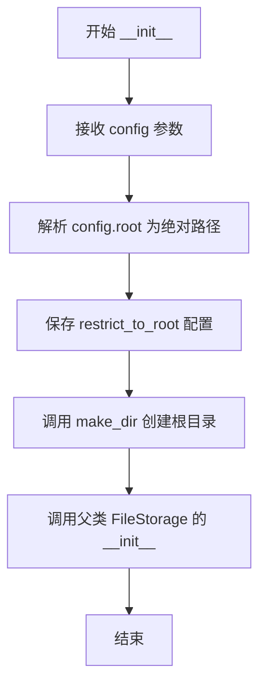

#### 带注释源码

```python
def __init__(self, config: FileStorageConfiguration):
    """初始化 LocalFileStorage 实例。
    
    Args:
        config: 文件存储配置对象，包含根目录路径和访问限制设置
    """
    # 将配置中的根目录路径解析为绝对路径并保存
    self._root = config.root.resolve()
    
    # 保存是否限制路径在根目录内的配置
    self._restrict_to_root = config.restrict_to_root
    
    # 确保根目录存在，如果不存在则创建
    self.make_dir(self.root)
    
    # 调用父类 FileStorage 的初始化方法
    super().__init__()
```


### `LocalFileStorage.root`

获取本地文件存储的根目录属性

参数： 无

返回值：`Path`，文件存储的根目录路径对象

#### 流程图

```mermaid
flowchart TD
    A[访问 root 属性] --> B{检查 _root 是否已设置}
    B -->|是| C[返回 self._root]
    B -->|否| D[返回 None 或抛出异常]
    
    subgraph 初始化流程
    E[__init__ 调用] --> F[config.root.resolve()]
    F --> G[赋值给 self._root]
    end
```

#### 带注释源码

```python
@property
def root(self) -> Path:
    """The root directory of the file storage."""
    return self._root
```

**源码解析：**

- `@property` 装饰器：将此方法转换为属性，允许通过 `instance.root` 访问而非 `instance.root()`
- `self`：`LocalFileStorage` 实例本身
- 返回值类型 `Path`：来自 `pathlib` 模块的路径对象
- `self._root`：在 `__init__` 方法中通过 `config.root.resolve()` 初始化，解析为绝对路径并存储

**关联代码片段（初始化逻辑）：**

```python
def __init__(self, config: FileStorageConfiguration):
    self._root = config.root.resolve()  # 从配置获取根路径并解析为绝对路径
    self._restrict_to_root = config.restrict_to_root
    self.make_dir(self.root)  # 确保根目录存在
    super().__init__()
```


### `LocalFileStorage.restrict_to_root`

获取路径限制属性，用于指示是否将生成的路径限制在根目录内。

参数： 无（该方法为属性 getter，仅使用隐式参数 `self`）

返回值：`bool`，返回是否限制生成的路径在根目录内的布尔值。

#### 流程图

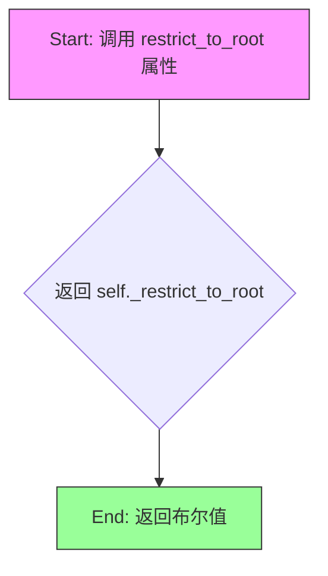

#### 带注释源码

```python
@property
def restrict_to_root(self) -> bool:
    """Whether to restrict generated paths to the root."""
    return self._restrict_to_root
```

**源码说明：**

- `@property` 装饰器：将该方法转换为属性，允许通过 `instance.restrict_to_root` 方式访问，无需括号
- `self`：隐式参数，指向 `LocalFileStorage` 实例本身
- `-> bool`：类型注解，表示返回值为布尔类型
- `self._restrict_to_root`：类实例属性，在 `__init__` 方法中通过 `config.restrict_to_root` 初始化，用于存储路径限制配置


### `LocalFileStorage.is_local`

获取是否为本地存储，该属性返回一个布尔值，用于标识当前存储实现是否为本地存储（在同一台机器上，而非云存储）。

参数： 无

返回值： `bool`，返回 `True`，表示该存储实现是本地存储（在同一台机器上，不依赖云服务）。

#### 流程图

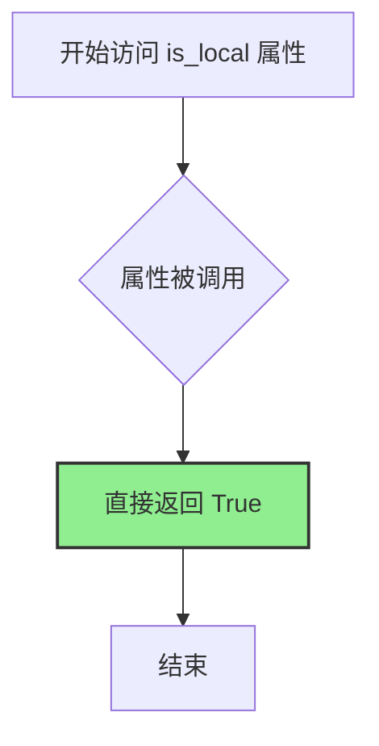

#### 带注释源码

```python
@property
def is_local(self) -> bool:
    """Whether the storage is local (i.e. on the same machine, not cloud-based)."""
    return True
```

**源码说明：**

- `@property` 装饰器：将方法转换为属性，使其可以像访问字段一样调用（无需括号）
- `def is_local(self) -> bool:` 方法签名，接受 `self` 参数（实例自身），返回布尔类型
- `"""Whether the storage is local (i.e. on the same machine, not cloud-based)."""` 方法文档字符串，说明该属性的用途：判断存储是否为本地存储（即在同一台机器上，非云存储）
- `return True` 直接返回 `True`，表示 `LocalFileStorage` 实现的是本地存储，区别于云存储实现（如 S3、GCS 等）


### `LocalFileStorage.initialize`

初始化存储目录，确保本地文件存储的根目录存在。

参数：
- 该方法无参数（`self` 为实例自身）

返回值：`None`，无返回值描述

#### 流程图

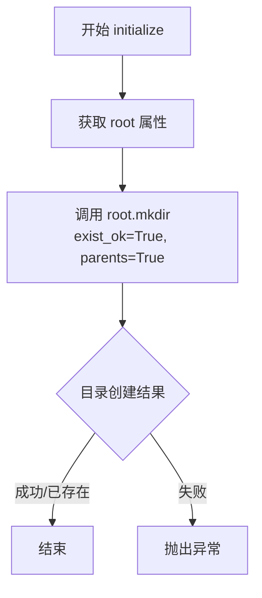

#### 带注释源码

```python
def initialize(self) -> None:
    """初始化存储目录，确保根目录存在。
    
    该方法使用 Path.mkdir 创建根目录，参数说明：
    - exist_ok=True: 如果目录已存在，不抛出异常
    - parents=True: 创建所有必要的父目录
    """
    self.root.mkdir(exist_ok=True, parents=True)
```


### `LocalFileStorage.open_file`

打开文件（重载多种签名），根据传入的路径、模式和二进制标志，以文本或二进制模式打开存储中的文件。

参数：

- `self`：`LocalFileStorage` 实例，调用此方法的对象实例
- `path`：`str | Path`，要打开的文件路径，可以是字符串或 `pathlib.Path` 对象
- `mode`：`Literal["w", "r"]`，文件打开模式，默认为 `"r"`（只读），可选择 `"w"`（写入）
- `binary`：`bool`，是否以二进制模式打开，默认为 `False`（文本模式）

返回值：`TextIO | BinaryIO`，返回文件对象。若 `binary` 为 `True`，返回 `BinaryIO`（二进制文件对象）；否则返回 `TextIO`（文本文件对象）

#### 流程图

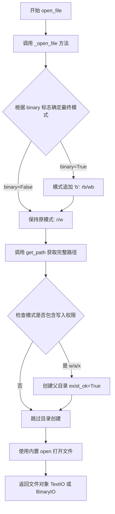

#### 带注释源码

```python
@overload
def open_file(
    self,
    path: str | Path,
    mode: Literal["w", "r"] = "r",
    binary: Literal[False] = False,
) -> TextIO:
    """打开文件 - 文本模式重载（默认）"""
    ...

@overload
def open_file(
    self, path: str | Path, mode: Literal["w", "r"], binary: Literal[True]
) -> BinaryIO:
    """打开文件 - 二进制模式重载（指定 binary=True）"""
    ...

@overload
def open_file(self, path: str | Path, *, binary: Literal[True]) -> BinaryIO:
    """打开文件 - 仅二进制模式重载（只传 binary 参数）"""
    ...

@overload
def open_file(
    self, path: str | Path, mode: Literal["w", "r"] = "r", binary: bool = False
) -> TextIO | BinaryIO:
    """打开文件 - 通用重载（类型提示用）"""
    ...

def open_file(
    self, path: str | Path, mode: Literal["w", "r"] = "r", binary: bool = False
) -> TextIO | BinaryIO:
    """Open a file in the storage."""
    # 根据 binary 标志决定是否追加 'b' 模式字符
    # 例如: r + b = rb, w + b = wb
    return self._open_file(path, f"{mode}b" if binary else mode)

def _open_file(self, path: str | Path, mode: str) -> TextIO | BinaryIO:
    """内部方法：实际执行文件打开操作"""
    # 获取完整路径（可能包含根目录限制等逻辑）
    full_path = self.get_path(path)
    
    # 如果是写入模式（w）、追加模式（a）或独占创建模式（x）
    # 则确保父目录存在
    if any(m in mode for m in ("w", "a", "x")):
        full_path.parent.mkdir(parents=True, exist_ok=True)
    
    # 使用 Python 内置 open 函数打开文件
    # type: ignore 忽略 mypy 对返回类型的严格检查
    return open(full_path, mode)  # type: ignore
```


### `LocalFileStorage._open_file`

内部打开文件方法，负责在本地文件系统中打开文件，支持文本和二进制模式，并在写入时自动创建父目录。

参数：

- `path`：`str | Path`，需要打开的文件路径
- `mode`：`str`，文件打开模式（如 "r"、"w"、"rb" 等）

返回值：`TextIO | BinaryIO`，打开的文件对象（文本IO或二进制IO）

#### 流程图

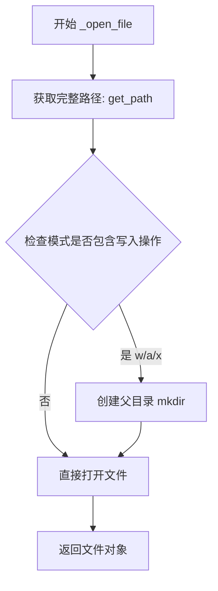

#### 带注释源码

```python
def _open_file(self, path: str | Path, mode: str) -> TextIO | BinaryIO:
    """内部打开文件方法"""
    # 1. 调用 get_path 获取完整的绝对路径（包含根目录和安全性检查）
    full_path = self.get_path(path)
    
    # 2. 判断是否为写入模式（写入/追加/排他创建）
    # 如果是写入模式，需要确保父目录存在，避免FileNotFoundError
    if any(m in mode for m in ("w", "a", "x")):
        full_path.parent.mkdir(parents=True, exist_ok=True)
    
    # 3. 使用内置 open 函数打开文件
    # 根据 mode 参数决定以文本还是二进制模式打开
    # mode: "r"/"w" -> TextIO, "rb"/"wb" -> BinaryIO
    return open(full_path, mode)  # type: ignore
```


### `LocalFileStorage.read_file`

读取存储中的文件内容，支持文本和二进制两种模式。

参数：

- `path`：`str | Path`，要读取的文件路径
- `binary`：`bool`，是否以二进制模式读取，默认为 False（文本模式）

返回值：`str | bytes`，如果 binary=False 则返回字符串内容，如果 binary=True 则返回字节内容

#### 流程图

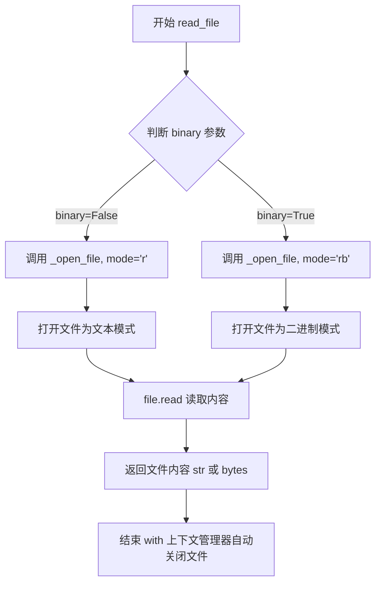

#### 带注释源码

```python
@overload
def read_file(self, path: str | Path, binary: Literal[False] = False) -> str:
    """Read a file in the storage as text."""
    ...

@overload
def read_file(self, path: str | Path, binary: Literal[True]) -> bytes:
    """Read a file in the storage as binary."""
    ...

@overload
def read_file(self, path: str | Path, binary: bool = False) -> str | bytes:
    """Read a file in the storage."""
    ...

def read_file(self, path: str | Path, binary: bool = False) -> str | bytes:
    """Read a file in the storage."""
    # 根据 binary 参数决定打开模式：二进制用 'rb'，文本用 'r'
    # _open_file 方法内部会调用 get_path 获取完整路径
    with self._open_file(path, "rb" if binary else "r") as file:
        # 读取整个文件内容并返回
        return file.read()
```


### `LocalFileStorage.write_file`

异步写入文件内容到本地存储，支持文本和二进制数据写入，并在写入完成后可选地触发回调函数。

参数：

- `path`：`str | Path`，要写入的文件路径，可以是相对路径或绝对路径
- `content`：`str | bytes`，要写入的文件内容，支持文本或二进制数据

返回值：`None`，无返回值

#### 流程图

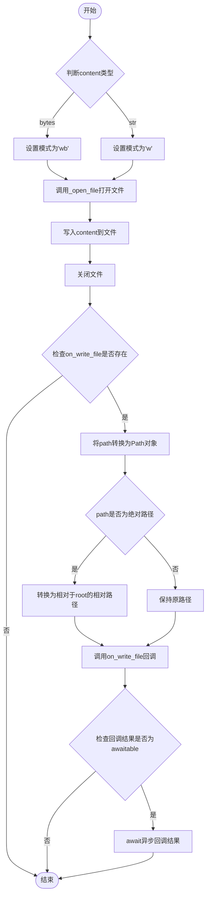

#### 带注释源码

```python
async def write_file(self, path: str | Path, content: str | bytes) -> None:
    """Write to a file in the storage."""
    # 根据content的类型选择写入模式：二进制用'wb'，文本用'w'
    with self._open_file(path, "wb" if type(content) is bytes else "w") as file:
        file.write(content)  # type: ignore

    # 如果定义了写入回调函数，则在写入完成后执行
    if self.on_write_file:
        path = Path(path)
        # 如果path是绝对路径，转换为相对于root的路径
        if path.is_absolute():
            path = path.relative_to(self.root)
        # 调用写入回调函数
        res = self.on_write_file(path)
        # 如果回调函数是异步的，等待其完成
        if inspect.isawaitable(res):
            await res
```


### `LocalFileStorage.list_files`

递归列出指定目录中的所有文件，并返回相对于该目录的文件路径列表。

参数：

- `path`：`str | Path`，指定要列出文件的目录路径，默认为当前目录（"。"）

返回值：`list[Path]`，返回相对于指定路径的文件路径列表

#### 流程图

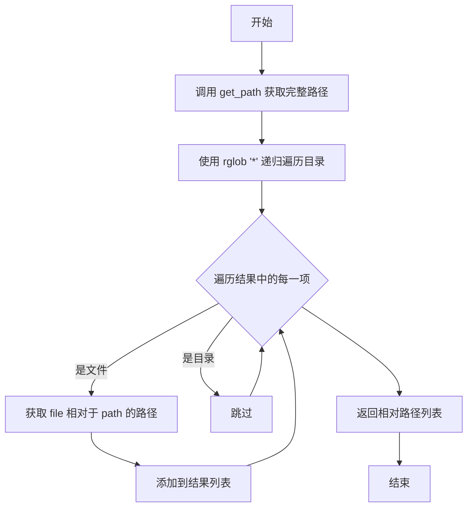

#### 带注释源码

```python
def list_files(self, path: str | Path = ".") -> list[Path]:
    """List all files (recursively) in a directory in the storage."""
    # 将输入路径转换为存储中的完整路径，并确保在根目录限制内
    path = self.get_path(path)
    # 使用 Path.rglob('*') 递归遍历目录中的所有文件和子目录
    # 过滤出所有文件（排除目录）
    # 计算每个文件相对于原始路径的相对路径
    # 返回相对路径列表
    return [file.relative_to(path) for file in path.rglob("*") if file.is_file()]
```


### `LocalFileStorage.list_folders`

列出指定路径下的目录，可选择递归或非递归模式，返回相对路径列表。

参数：

- `path`：`str | Path`，要列出目录的路径，默认为当前目录 "."
- `recursive`：`bool`，是否递归列出所有子目录，默认为 False

返回值：`list[Path]`，返回目录路径的相对路径列表

#### 流程图

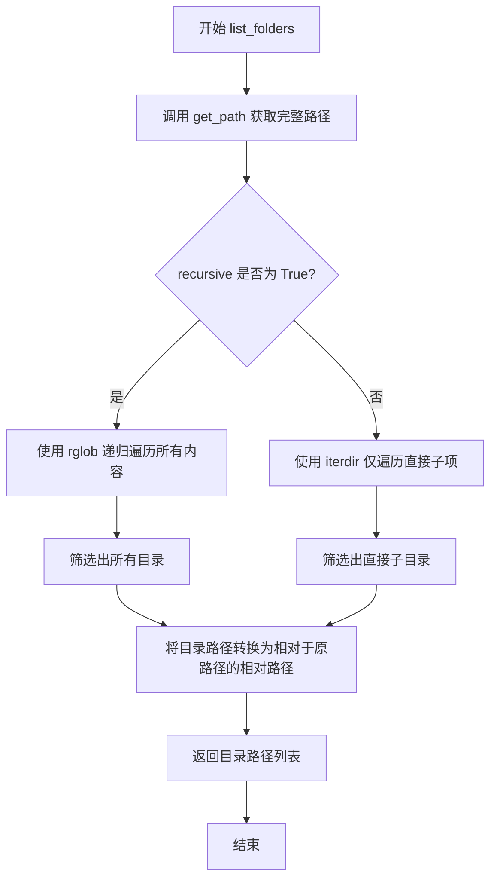

#### 带注释源码

```python
def list_folders(
    self, path: str | Path = ".", recursive: bool = False
) -> list[Path]:
    """List directories directly in a given path or recursively."""
    # 将传入的路径转换为存储中的完整路径
    path = self.get_path(path)
    
    # 根据 recursive 参数决定遍历方式
    if recursive:
        # 递归模式：使用 rglob("*") 遍历所有子目录和文件
        return [
            # 将找到的每个目录路径转换为相对于原路径的相对路径
            folder.relative_to(path)
            # 遍历路径下所有内容
            for folder in path.rglob("*")
            # 只保留目录，过滤掉文件
            if folder.is_dir()
        ]
    else:
        # 非递归模式：仅使用 iterdir() 遍历直接子项
        return [
            # 将找到的每个目录路径转换为相对于原路径的相对路径
            folder.relative_to(path)
            # 仅遍历指定路径的直接子项
            for folder in path.iterdir()
            # 只保留目录，过滤掉文件
            if folder.is_dir()
        ]
```


### `LocalFileStorage.delete_file`

删除指定路径的文件。

参数：

- `path`：`str | Path`，要删除的文件路径（相对于存储根目录）

返回值：`None`，该方法不返回任何值，仅执行文件删除操作

#### 流程图

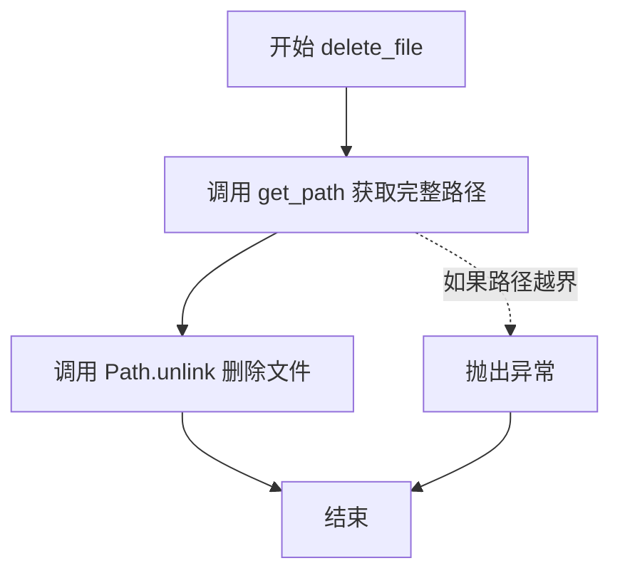

#### 带注释源码

```python
def delete_file(self, path: str | Path) -> None:
    """Delete a file in the storage."""
    # 1. 将传入的相对路径解析为存储根目录下的完整绝对路径
    # get_path 方法会检查路径是否在允许的根目录范围内（如果 restrict_to_root 为 True）
    full_path = self.get_path(path)
    
    # 2. 调用 Path 对象的 unlink() 方法删除文件
    # 如果文件不存在，会抛出 FileNotFoundError
    full_path.unlink()
```


### `LocalFileStorage.delete_dir`

删除空目录。

参数：

- `path`：`str | Path`，要删除的空目录路径

返回值：`None`，无返回值（该方法用于删除空目录）

#### 流程图

```mermaid
flowchart TD
    A[开始 delete_dir] --> B[获取完整路径: full_path = self.get_path(path)]
    B --> C[调用 rmdir 删除空目录: full_path.rmdir()]
    C --> D[结束]
```

#### 带注释源码

```python
def delete_dir(self, path: str | Path) -> None:
    """Delete an empty folder in the storage."""
    # 将传入的路径转换为存储中的完整路径（包含根目录）
    full_path = self.get_path(path)
    # 调用 Path 对象的 rdir() 方法删除空目录
    # 注意：rmdir() 只能删除空目录，如果目录非空会抛出 OSError
    full_path.rmdir()
```


### `LocalFileStorage.exists`

检查存储中指定路径的文件或目录是否存在。

参数：

- `path`：`str | Path`，要检查是否存在的文件或目录路径

返回值：`bool`，如果指定路径存在返回 `True`，否则返回 `false`

#### 流程图

```mermaid
flowchart TD
    A[开始 exists] --> B[获取完整路径: get_path(path)]
    B --> C[调用 Path.exists 方法]
    C --> D{路径是否存在?}
    D -->|是| E[返回 True]
    D -->|否| F[返回 False]
    E --> G[结束]
    F --> G
```

#### 带注释源码

```python
def exists(self, path: str | Path) -> bool:
    """Check if a file or folder exists in the storage."""
    # 调用 get_path 方法将传入的路径转换为存储根目录下的完整路径
    # get_path 方法会处理路径验证、相对路径转换等工作
    full_path = self.get_path(path)
    
    # 使用 pathlib.Path 的 exists 方法检查路径是否存在
    # 这会检查文件或目录是否存在于文件系统中
    return full_path.exists()
```


### `LocalFileStorage.make_dir`

创建目录，如果目录不存在则创建它。

参数：

- `path`：`str | Path`，要创建的目录路径

返回值：`None`，无返回值

#### 流程图

```mermaid
flowchart TD
    A[开始 make_dir] --> B[调用 get_path 获取完整路径]
    B --> C[调用 Path.mkdir 创建目录]
    C --> D[exist_ok=True: 如果目录已存在不报错]
    D --> E[parents=True: 创建父目录]
    E --> F[结束]
```

#### 带注释源码

```python
def make_dir(self, path: str | Path) -> None:
    """Create a directory in the storage if doesn't exist."""
    # 获取完整路径，将相对路径转换为绝对路径（基于存储根目录）
    full_path = self.get_path(path)
    # 创建目录，如果已存在则不抛出异常，并创建所有必需的父目录
    full_path.mkdir(exist_ok=True, parents=True)
```


### `LocalFileStorage.rename`

重命名存储中的文件或文件夹。

参数：

- `old_path`：`str | Path`，要重命名的文件或文件夹的路径
- `new_path`：`str | Path`，文件或文件夹的新名称或新路径

返回值：`None`，无返回值描述

#### 流程图

```mermaid
flowchart TD
    A[开始 rename] --> B[调用 get_path old_path 获取完整路径]
    B --> C[调用 get_path new_path 获取完整路径]
    C --> D[调用 old_path.rename new_path 执行重命名操作]
    D --> E[结束]
```

#### 带注释源码

```python
def rename(self, old_path: str | Path, new_path: str | Path) -> None:
    """Rename a file or folder in the storage."""
    # 使用 get_path 方法将传入的旧路径转换为存储根目录下的完整绝对路径
    old_path = self.get_path(old_path)
    
    # 使用 get_path 方法将传入的新路径转换为存储根目录下的完整绝对路径
    new_path = self.get_path(new_path)
    
    # 调用 Python pathlib.Path 的 rename 方法执行文件系统级别的重命名操作
    # 该操作会移动文件或文件夹到新位置，如果目标存在则会覆盖
    # 对于文件：仅重命名文件
    # 对于目录：重命名整个目录树
    old_path.rename(new_path)
```


### `LocalFileStorage.copy`

复制文件或文件夹（包含所有内容）到存储中的目标位置。

参数：

- `source`：`str | Path`，要复制的源文件或文件夹路径
- `destination`：`str | Path`，目标文件或文件夹路径

返回值：`None`，该方法无返回值，仅执行复制操作

#### 流程图

```mermaid
flowchart TD
    A[Start copy] --> B[调用 get_path 获取源路径]
    B --> C[调用 get_path 获取目标路径]
    C --> D{判断源路径是否为文件?}
    D -->|是| E[读取源文件所有字节]
    E --> F[将字节写入目标文件]
    F --> G[End copy]
    D -->|否| H[创建目标目录<br/>mkdir exist_ok=True parents=True]
    H --> I[使用 rglob 递归遍历源目录所有文件]
    I --> J{遍历到文件?}
    J -->|是| K[计算文件的相对路径]
    K --> L[创建目标文件的父目录<br/>mkdir exist_ok=True parents=True]
    L --> M[读取源文件字节并写入目标文件]
    M --> I
    J -->|否| G
```

#### 带注释源码

```python
def copy(self, source: str | Path, destination: str | Path) -> None:
    """
    复制文件或文件夹（包含所有内容）到存储中的目标位置。
    
    参数:
        source: 源文件或文件夹路径
        destination: 目标文件或文件夹路径
    """
    # 将用户输入的路径转换为完整的绝对路径
    source = self.get_path(source)
    destination = self.get_path(destination)
    
    # 判断复制类型：文件复制 vs 文件夹复制
    if source.is_file():
        # --- 文件复制逻辑 ---
        # 读取源文件的所有字节内容
        # 然后直接写入目标路径（会覆盖已存在的文件）
        destination.write_bytes(source.read_bytes())
    else:
        # --- 文件夹复制逻辑 ---
        # 1. 创建目标文件夹（如果已存在则不报错）
        destination.mkdir(exist_ok=True, parents=True)
        
        # 2. 递归遍历源文件夹中的所有文件和子目录
        # rglob("*") 会匹配所有内容（包括文件和子文件夹）
        for file in source.rglob("*"):
            # 只处理文件，不处理目录
            if file.is_file():
                # 计算文件相对于源根目录的路径，以保持目录结构
                target = destination / file.relative_to(source)
                
                # 确保目标文件的父目录存在
                target.parent.mkdir(exist_ok=True, parents=True)
                
                # 读取源文件字节并写入目标位置
                target.write_bytes(file.read_bytes())
```


### `LocalFileStorage.clone_with_subroot`

创建一个新的 LocalFileStorage 实例，以当前存储的指定子目录作为根目录，同时保留原有的访问限制配置。

参数：

- `subroot`：`str | Path`，子目录路径，用于创建新的存储实例的根目录

返回值：`FileStorage`，返回一个新的 LocalFileStorage 实例，其根目录设置为当前存储的子目录

#### 流程图

```mermaid
flowchart TD
    A[开始 clone_with_subroot] --> B[接收 subroot 参数]
    B --> C[调用 self.get_pathsubroot 获取完整路径]
    C --> D[创建 FileStorageConfiguration 对象]
    D --> E[设置 root 为子路径]
    E --> F[继承当前的 restrict_to_root 设置]
    F --> G[创建新的 LocalFileStorage 实例]
    G --> H[返回新的存储实例]
```

#### 带注释源码

```python
def clone_with_subroot(self, subroot: str | Path) -> FileStorage:
    """Create a new LocalFileStorage with a subroot of the current storage."""
    # 接收 subroot 参数，可以是字符串或 Path 对象
    # 调用 get_path 方法将相对路径转换为基于当前存储根目录的完整路径
    # 创建一个新的 FileStorageConfiguration 对象，配置新存储的属性
    return LocalFileStorage(
        FileStorageConfiguration(
            # 使用 get_path 方法解析子目录路径，作为新存储的根目录
            root=self.get_path(subroot),
            # 保留当前存储的 restrict_to_root 限制设置，确保安全策略一致
            restrict_to_root=self.restrict_to_root,
        )
    )
```


### `LocalFileStorage.mount`

挂载本地文件存储并返回其根目录的绝对路径，提供给调用者作为本地文件系统访问入口。

参数：

- `path`：`str | Path`，要挂载的路径，默认为 `"."`（当前根目录）

返回值：`Generator[Path, Any, None]`，返回一个生成器，yield 出存储根目录的绝对 `Path` 对象，供调用者在上下文管理器中使用

#### 流程图

```mermaid
flowchart TD
    A[开始 mount] --> B{检查 path 参数}
    B --> C[调用 self.get_path 解析路径]
    C --> D[将路径转换为绝对路径]
    D --> E[yield 绝对路径给调用者]
    E --> F[上下文管理器退出]
    F --> G[结束]
    
    style A fill:#e1f5fe
    style E fill:#fff3e0
    style G fill:#e8f5e9
```

#### 带注释源码

```python
@contextmanager
def mount(self, path: str | Path = ".") -> Generator[Path, Any, None]:
    """Mount the file storage and provide a local path."""
    # 对于本地存储而言，挂载操作无需执行任何特殊处理
    # 因为本地文件系统已经可以直接访问，无需像云存储那样进行网络挂载
    # 直接返回存储根目录的绝对路径即可
    yield Path(self.get_path(".")).absolute()
```

## 关键组件


### LocalFileStorage 类

核心类，负责本地文件系统的存储操作，继承自 FileStorage 基类，提供文件读写、目录管理、路径解析等功能。

### 文件操作组件

包含 open_file、read_file、write_file 方法，支持文本和二进制模式的文件操作，具备自动创建父目录功能。

### 目录管理组件

包含 list_files、list_folders、make_dir、delete_dir 方法，支持递归和非递归目录遍历，目录创建支持 exist_ok 和 parents 参数。

### 路径管理组件

通过 root 属性和 restrict_to_root 属性管理根目录路径，支持路径安全限制，防止路径穿越攻击。

### 文件/目录操作组件

包含 delete_file、delete_dir、rename、copy 方法，支持文件和目录的删除、重命名和递归复制操作。

### 子目录克隆组件

clone_with_subroot 方法，支持创建基于当前存储子目录的新 LocalFileStorage 实例。

### 挂载组件

mount 方法，作为上下文管理器返回存储的绝对路径，用于将存储挂载到特定路径。

## 问题及建议


### 已知问题

- **write_file 方法类型检查不严谨**：使用 `type(content) is bytes` 而非 `isinstance(content, bytes)`，对 bytes 子类无法正确识别
- **伪异步实现**：`write_file` 声明为 async，但内部调用同步的 `open()` 和文件写入操作，并非真正的异步 I/O，异步声明具有误导性
- **文件操作缺少异常处理**：`delete_file`、`delete_dir`、`rename`、`copy` 等方法直接调用文件系统操作，未捕获 `FileNotFoundError`、`PermissionError` 等常见异常
- **copy 方法效率低下**：目录复制时逐个文件读取写入，应使用 `shutil.copytree` 替代
- **rename 缺乏原子性保证**：跨文件系统 rename 可能失败，且未处理目标路径已存在的情况
- **mount 方法与类语义不匹配**：local storage 的 mount 方法直接 yield 路径，但注释称"mount the file storage"，语义不清晰
- **list_files/list_folders 未过滤隐藏文件**：可能返回系统隐藏文件或 Unix 点文件
- **exists 方法逻辑不严谨**：检查路径时未区分文件与目录，应明确是文件存在还是目录存在
- **make_dir 重复调用**：`__init__` 中调用 `make_dir(self.root)`，`initialize()` 也会创建目录，存在冗余

### 优化建议

- 将 `write_file` 改为真正的异步实现（使用 `aiofiles` 或 `asyncio.to_thread`）
- 使用 `shutil.copytree` 和 `shutil.move` 替代手动的目录复制和重命名逻辑
- 为所有文件系统操作添加 try-except 包装，统一处理 `OSError` 及子类异常
- 使用 `isinstance(content, (bytes, bytearray))` 进行类型检查
- 在 `list_files` 和 `list_folders` 中添加隐藏文件过滤选项
- 考虑将 `on_write_file` 回调改为更明确的事件机制，避免路径穿越风险

## 其它


### 设计目标与约束

设计目标：实现一个本地文件系统存储后端，提供统一的文件操作接口（读、写、删除、复制、重命名、列表等），确保所有文件操作在指定的根目录下进行，防止路径遍历攻击，并支持写入后的异步回调机制。

设计约束：
- 必须继承自 FileStorage 基类
- 所有路径操作必须受限于根目录（当 restrict_to_root 为 True 时）
- 支持文本和二进制两种文件模式
- 文件写入支持异步回调通知

### 错误处理与异常设计

异常类型：
- FileNotFoundError：文件或目录不存在时抛出
- PermissionError：无权限访问文件或目录时抛出
- OSError：底层操作系统相关错误（磁盘满、路径无效等）
- ValueError：路径不符合安全约束时抛出

异常处理策略：
- 所有文件操作使用 try-except 包装，转换底层异常为统一异常类型
- 路径验证失败时抛出明确的 ValueError
- 文件不存在时返回 False 或抛出 FileNotFoundError
- 使用上下文管理器确保文件句柄正确释放

### 数据流与状态机

状态机：
- 初始化状态：构造函数接收配置，创建根目录
- 就绪状态：可以进行所有文件操作
- 活动状态：正在进行文件读写操作
- 结束状态：实例销毁，所有资源释放

数据流：
- 输入数据：文件路径（str | Path）、操作模式、文件内容
- 处理流程：路径解析 → 权限验证 → 安全检查 → 文件操作 → 回调通知
- 输出数据：文件内容、布尔值、文件对象或 None

### 外部依赖与接口契约

外部依赖：
- FileStorage：基类，定义存储接口规范
- FileStorageConfiguration：配置类，提供 root 和 restrict_to_root 配置
- pathlib.Path：路径对象处理
- typing：类型注解（BinaryIO、TextIO、Generator 等）
- inspect：用于检查异步函数
- contextlib：上下文管理器装饰器
- logging：日志记录

接口契约：
- get_path()：将相对路径解析为绝对路径，并进行安全检查
- open_file()：返回文件句柄，支持上下文管理器
- write_file()：异步写入，支持回调通知
- 所有方法必须返回指定类型的值或 None

### 性能考虑

性能特点：
- list_files() 使用 rglob 递归扫描，大目录可能较慢
- copy() 使用流式读写，避免一次性加载大文件到内存
- make_dir() 使用 exist_ok=True 减少文件系统调用

优化建议：
- 大文件复制考虑使用 shutil.copy2 或 os.sendfile
- 大量小文件列表考虑添加缓存或分页机制
- 频繁的 exists() 检查可考虑内存缓存

### 安全性考虑

安全特性：
- restrict_to_root 防止路径遍历攻击（../../etc/passwd）
- get_path() 方法对所有路径进行安全验证
- 写入回调自动将绝对路径转换为相对路径

潜在风险：
- 软链接和硬链接可能绕过 restrict_to_root 检查
- 并发写入同一文件可能导致数据丢失
- 敏感文件可能因权限设置不当而泄露

### 并发和线程安全性

线程安全性分析：
- 自身不维护共享可变状态
- 底层的文件操作不是原子的，多线程并发访问同一文件可能产生竞态条件
- 回调函数 on_write_file 可能被并发调用

使用建议：
- 应用层负责线程间协调
- 高并发场景考虑使用文件锁（fcntl.flock）
- 回调函数应为线程安全或使用队列机制

### 资源管理

资源管理策略：
- 所有文件操作使用 with 语句确保资源释放
- open_file() 返回的文件对象由调用方负责关闭
- write_file() 在写入完成后立即关闭文件句柄
- 目录创建使用 parents=True 确保父目录存在

### 配置说明

配置项：
- root：存储根目录，Path 类型，必填项
- restrict_to_root：是否限制路径在根目录下，布尔类型，默认为 True

配置示例：
```python
config = FileStorageConfiguration(
    root=Path("/var/data/storage"),
    restrict_to_root=True
)
```

### 使用示例

基本文件操作：
```python
from pathlib import Path
from storage import LocalFileStorage, FileStorageConfiguration

# 初始化存储
config = FileStorageConfiguration(root=Path("./data"))
storage = LocalFileStorage(config)

# 创建目录
storage.make_dir("documents")

# 写入文件
import asyncio
asyncio.run(storage.write_file("documents/test.txt", "Hello World"))

# 读取文件
content = storage.read_file("documents/test.txt")
print(content)  # 输出: Hello World

# 列出文件
files = storage.list_files("documents")

# 删除文件
storage.delete_file("documents/test.txt")
```

使用写入回调：
```python
async def on_write(path: Path):
    print(f"File written: {path}")
    # 可以在这里记录日志或触发其他操作

storage = LocalFileStorage(config)
storage.on_write_file = on_write
await storage.write_file("test.txt", "Content")
```

### 测试策略

测试方法：
- 单元测试：测试每个方法的输入输出正确性
- 集成测试：测试实际文件系统操作
- 边界测试：测试空路径、超长路径、特殊字符路径
- 安全测试：测试路径遍历攻击防护

关键测试用例：
- 文件读写一致性
- 二进制与文本模式切换
- 目录递归列表正确性
- 文件复制保留内容
- 路径限制生效验证
- 异常抛出条件验证


    