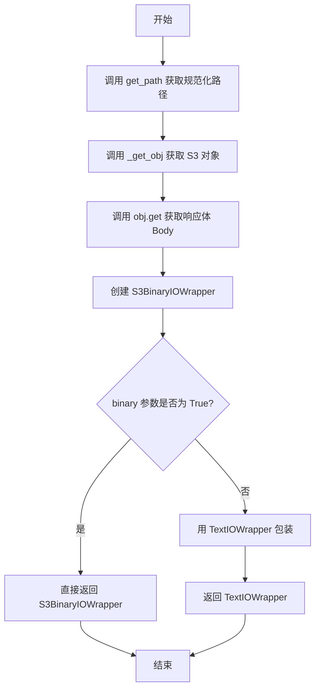

# `.\AutoGPT\classic\forge\forge\file_storage\s3.py` 详细设计文档

该代码实现了一个基于Amazon S3的文件存储系统，通过S3FileStorage类提供文件的读写、删除、列表、复制、重命名等操作，并使用S3BinaryIOWrapper将S3对象包装为Python二进制IO接口，支持文本和二进制模式的文件操作。

## 整体流程


## 类结构

```
FileStorageConfiguration (基类配置)
└── S3FileStorageConfiguration (S3配置)
FileStorage (基类存储)
└── S3FileStorage (S3存储实现)
BinaryIO (Python内置接口)
└── S3BinaryIOWrapper (S3二进制IO包装器)
```

## 全局变量及字段


### `logger`
    
用于记录模块日志的日志记录器

类型：`logging.Logger`
    


### `S3FileStorageConfiguration.bucket`
    
S3存储桶名称

类型：`str`
    


### `S3FileStorageConfiguration.s3_endpoint_url`
    
S3端点URL

类型：`Optional[SecretStr]`
    


### `S3FileStorage._bucket`
    
S3桶对象

类型：`mypy_boto3_s3.service_resource.Bucket`
    


### `S3FileStorage._bucket_name`
    
存储桶名称

类型：`str`
    


### `S3FileStorage._root`
    
根路径

类型：`Path`
    


### `S3FileStorage._s3`
    
boto3 S3资源对象

类型：`boto3.resources`
    


### `S3BinaryIOWrapper.body`
    
S3流式响应体

类型：`StreamingBody`
    


### `S3BinaryIOWrapper._name`
    
文件名

类型：`str`
    
    

## 全局函数及方法


### `S3FileStorage.__init__`

这是 `S3FileStorage` 类的构造函数，用于初始化 S3 文件存储实例。它接收一个 S3 文件存储配置对象，设置存储桶名称、根路径，并创建 boto3 S3 资源客户端。

参数：

- `config`：`S3FileStorageConfiguration`，S3 文件存储的配置对象，包含存储桶名称、根路径和 S3 端点 URL 等信息

返回值：`None`，构造函数不返回任何值，仅初始化实例状态

#### 流程图


#### 带注释源码

```python
def __init__(self, config: S3FileStorageConfiguration):
    # 从配置对象中获取存储桶名称并存储为实例变量
    self._bucket_name = config.bucket
    
    # 从配置对象中获取根路径并存储为实例变量
    self._root = config.root
    
    # Add / at the beginning of the root path
    # 如果根路径不是绝对路径，则在其前面拼接 /，确保路径格式正确
    if not self._root.is_absolute():
        self._root = Path("/").joinpath(self._root)

    # https://boto3.amazonaws.com/v1/documentation/api/latest/guide/configuration.html
    # 创建 boto3 S3 资源客户端，用于后续与 S3 存储交互
    # 如果配置中提供了 S3_ENDPOINT_URL，则使用该端点 URL；否则设为 None（使用默认 AWS 端点）
    self._s3 = boto3.resource(
        "s3",
        endpoint_url=(
            config.s3_endpoint_url.get_secret_value()
            if config.s3_endpoint_url
            else None
        ),
    )

    # 调用父类 FileStorage 的初始化方法，完成基类部分的初始化
    super().__init__()
```


### S3FileStorage.initialize

该方法用于初始化 S3 文件存储，通过检查指定的 S3 存储桶是否存在，如果不存在则创建一个新的存储桶。

参数： 无（仅包含 `self` 参数）

返回值：`None`，无返回值描述

#### 流程图

```mermaid
flowchart TD
    A[开始: 调用 initialize] --> B[记录调试日志: 'Initializing {repr(self)}...']
    B --> C{尝试检查 S3 存储桶是否存在}
    C -->|成功| D[设置 self._bucket = self._s3.Bucket]
    C -->|ClientError 异常| E{检查异常是否为 404}
    E -->|不是 404| F[重新抛出异常]
    E -->|是 404| G[记录日志: 'Bucket 不存在, 正在创建...']
    G --> H[创建存储桶: self._bucket = self._s3.create_bucket]
    D --> I[结束]
    H --> I
    F --> I
```

#### 带注释源码

```python
def initialize(self) -> None:
    """
    初始化 S3 存储。
    检查指定的 S3 存储桶是否存在，如果不存在则创建一个新的存储桶。
    """
    # 记录调试信息，显示正在初始化的对象
    logger.debug(f"Initializing {repr(self)}...")
    
    try:
        # 使用 head_bucket API 检查存储桶是否存在
        # 如果存储桶存在，不会抛出异常
        # 如果存储桶不存在，会抛出 ClientError 异常
        self._s3.meta.client.head_bucket(Bucket=self._bucket_name)
        
        # 如果存储桶存在，获取 Bucket 对象并赋值给实例变量
        self._bucket = self._s3.Bucket(self._bucket_name)
        
    except botocore.exceptions.ClientError as e:
        # 捕获 AWS S3 客户端错误
        
        # 检查错误消息中是否包含 "404"
        # boto3 在存储桶不存在时返回的错误信息中包含 "(404)"
        if "(404)" not in str(e):
            # 如果不是 404 错误（例如权限问题），重新抛出异常
            raise
        
        # 如果是 404 错误，说明存储桶不存在
        # 记录信息日志并创建存储桶
        logger.info(f"Bucket '{self._bucket_name}' does not exist; creating it...")
        self._bucket = self._s3.create_bucket(Bucket=self._bucket_name)
```


### `S3FileStorage.get_path`

获取相对于存储根目录的路径，将绝对路径转换为相对路径并移除 S3 根目录的前导斜杠。

参数：

- `relative_path`：`str | Path`，要获取路径的文件或目录的相对路径

返回值：`Path`，相对于存储根目录的路径对象（已移除前导斜杠）

#### 流程图

```mermaid
flowchart TD
    A[开始 get_path] --> B[调用父类 get_path 方法]
    B --> C{relative_path 参数}
    C -->|str| D[转换为 Path 对象]
    C -->|Path| E[直接使用]
    D --> F[获取绝对路径]
    E --> F
    F --> G[调用 relative_to('/')]
    G --> H[移除前导斜杠]
    H --> I[返回相对路径]
```

#### 带注释源码

```python
def get_path(self, relative_path: str | Path) -> Path:
    """获取相对于 S3 存储根目录的路径。
    
    该方法覆盖了父类的 get_path 方法，主要用于处理 S3 存储的特殊需求：
    - S3 根路径以 "/" 开头存储
    - 但实际存储的文件名不希望包含这个前导斜杠
    - 因此通过 relative_to('/') 移除它
    
    Args:
        relative_path: 要获取路径的文件或目录的相对路径
        
    Returns:
        相对于存储根目录的路径对象，已移除前导斜杠
    """
    # We set S3 root with "/" at the beginning
    # but relative_to("/") will remove it
    # because we don't actually want it in the storage filenames
    return super().get_path(relative_path).relative_to("/")
```


### `S3FileStorage._get_obj`

获取 S3 存储中的对象，并尝试加载对象元数据以验证其存在性。

参数：

- `path`：`str | Path`，需要获取的 S3 对象的路径

返回值：`mypy_boto3_s3.service_resource.Object`，S3 对象

#### 流程图


#### 带注释源码

```python
def _get_obj(self, path: str | Path) -> mypy_boto3_s3.service_resource.Object:
    """Get an S3 object."""
    # 根据路径创建 S3 对象
    obj = self._bucket.Object(str(path))
    
    # 尝试加载对象以验证其存在性
    # 如果对象不存在，load() 会抛出 ClientError
    # 使用 contextlib.suppress 忽略该异常，使方法总是返回对象
    # 调用方可以通过捕获异常或检查对象是否存在来处理不存在的情况
    with contextlib.suppress(botocore.exceptions.ClientError):
        obj.load()
    
    # 返回 S3 对象（即使对象不存在也返回）
    return obj
```


### `S3FileStorage.open_file`

该方法用于在 S3 存储中打开文件，根据 `binary` 参数返回文本或二进制 I/O 包装器。

参数：

- `path`：`str | Path`，要打开的文件路径
- `mode`：`Literal["r", "w"] = "r"`，文件打开模式（读取或写入）
- `binary`：`bool = False`，是否以二进制模式打开

返回值：`TextIOWrapper | S3BinaryIOWrapper`，返回文本 I/O 包装器或二进制 I/O 包装器

#### 流程图



#### 带注释源码

```python
@overload
def open_file(
    self,
    path: str | Path,
    mode: Literal["r", "w"] = "r",
    binary: Literal[False] = False,
) -> TextIOWrapper:
    ...

@overload
def open_file(
    self, path: str | Path, mode: Literal["r", "w"], binary: Literal[True]
) -> S3BinaryIOWrapper:
    ...

@overload
def open_file(
    self, path: str | Path, *, binary: Literal[True]
) -> S3BinaryIOWrapper:
    ...

@overload
def open_file(
    self, path: str | Path, mode: Literal["r", "w"] = "r", binary: bool = False
) -> S3BinaryIOWrapper | TextIOWrapper:
    ...

def open_file(
    self, path: str | Path, mode: Literal["r", "w"] = "r", binary: bool = False
) -> TextIOWrapper | S3BinaryIOWrapper:
    """Open a file in the storage."""
    # 1. 将输入路径规范化为相对路径
    path = self.get_path(path)
    # 2. 获取 S3 对象
    body = S3BinaryIOWrapper(self._get_obj(path).get()["Body"], str(path))
    # 3. 根据 binary 参数决定返回类型：
    #    - binary=True: 返回二进制包装器 S3BinaryIOWrapper
    #    - binary=False: 返回文本包装器 TextIOWrapper
    return body if binary else TextIOWrapper(body)
```


### `S3FileStorage.read_file`

读取 S3 存储中的文件内容，支持以文本或二进制模式读取。

参数：

- `path`：`str | Path`，要读取的文件路径
- `binary`：`bool`，是否以二进制模式读取（默认为 False，即文本模式）

返回值：`str | bytes`，文件内容。文本模式返回 `str`，二进制模式返回 `bytes`

#### 流程图


#### 带注释源码

```python
@overload
def read_file(self, path: str | Path, binary: Literal[False] = False) -> str:
    """以文本模式读取文件的重载方法签名"""
    ...

@overload
def read_file(self, path: str | Path, binary: Literal[True]) -> bytes:
    """以二进制模式读取文件的重载方法签名"""
    ...

@overload
def read_file(self, path: str | Path, binary: bool = False) -> str | bytes:
    """通用读取文件的方法签名"""
    ...

def read_file(self, path: str | Path, binary: bool = False) -> str | bytes:
    """读取 S3 存储中的文件内容"""
    # 调用 open_file 方法打开文件，然后调用 read() 读取内容
    # open_file 会根据 binary 参数返回不同的文件对象：
    # - binary=False: 返回 TextIOWrapper，可读取为 str
    # - binary=True: 返回 S3BinaryIOWrapper，可读取为 bytes
    return self.open_file(path, binary=binary).read()
```


### `S3FileStorage.write_file`

该方法用于将内容写入到S3存储中的指定文件。它首先获取S3对象，然后使用boto3将内容上传到S3，最后如果存在写文件回调函数，则调用该回调（支持异步）。

参数：

- `path`：`str | Path`，要写入的文件路径
- `content`：`str | bytes`，要写入的内容（文本或二进制）

返回值：`None`，无返回值

#### 流程图


#### 带注释源码

```python
async def write_file(self, path: str | Path, content: str | bytes) -> None:
    """Write to a file in the storage."""
    # 1. 获取规范化后的路径（处理相对路径和根路径）
    obj = self._get_obj(self.get_path(path))
    
    # 2. 使用boto3将内容上传到S3
    obj.put(Body=content)

    # 3. 如果存在写文件回调，则调用它
    if self.on_write_file:
        # 标准化路径：如果传入绝对路径，转换为相对于根路径的路径
        path = Path(path)
        if path.is_absolute():
            path = path.relative_to(self.root)
        
        # 调用回调函数并获取结果
        res = self.on_write_file(path)
        
        # 如果结果是协程（可等待），则异步等待其完成
        if inspect.isawaitable(res):
            await res
```


### `S3FileStorage.list_files`

列出存储中指定目录下的所有文件（递归），返回包含文件路径的列表。

参数：

- `path`：`str | Path`，要列出文件的目录路径，默认为当前目录（"."）

返回值：`list[Path]`，包含所有文件路径的列表

#### 流程图


#### 带注释源码

```python
def list_files(self, path: str | Path = ".") -> list[Path]:
    """List all files (recursively) in a directory in the storage."""
    # 调用 get_path 方法将输入路径转换为标准化的 Path 对象
    path = self.get_path(path)
    
    # 判断是否查询根目录
    if path == Path("."):  # root level of bucket
        # 根目录：列出 bucket 中所有对象
        # _bucket.objects.all() 返回 S3 bucket 中所有对象的迭代器
        return [Path(obj.key) for obj in self._bucket.objects.all()]
    else:
        # 非根目录：使用 Prefix 过滤只返回指定目录下的对象
        # 构建 S3 前缀路径（以 / 结尾）
        return [
            # 将对象 key 转换为相对于查询路径的 Path 对象
            Path(obj.key).relative_to(path)
            # 使用 Prefix 过滤只获取指定目录下的对象
            for obj in self._bucket.objects.filter(Prefix=f"{path}/")
        ]
```


### `S3FileStorage.list_folders`

列出存储中给定路径下的所有"目录"（文件夹），支持递归和非递归两种模式。

参数：

- `path`：`str | Path`，默认为 `"."`，要列出文件夹的路径
- `recursive`：`bool`，默认为 `False`，是否递归列出所有嵌套文件夹

返回值：`list[Path]`，返回文件夹路径列表

#### 流程图


#### 带注释源码

```python
def list_folders(
    self, path: str | Path = ".", recursive: bool = False
) -> list[Path]:
    """List 'directories' directly in a given path or recursively in the storage."""
    # 获取规范化后的路径，将相对路径转换为绝对路径并处理根路径
    path = self.get_path(path)
    # 使用集合存储文件夹名称，避免重复
    folder_names = set()

    # 列出具有指定前缀的所有 S3 对象
    for obj_summary in self._bucket.objects.filter(Prefix=str(path)):
        # 计算对象的相对路径，然后获取其父目录（去掉文件名后的目录部分）
        folder = Path(obj_summary.key).relative_to(path).parent
        # 跳过根目录或空目录
        if not folder or folder == Path("."):
            continue
        # 非递归模式：只添加第一层文件夹
        if not recursive:
            # 取文件夹路径的第一个部分（即第一层）
            folder_names.add(folder.parts[0])
        else:
            # 递归模式：需要添加所有嵌套的文件夹
            # 遍历所有层级，添加每一层级的路径
            for i in range(len(folder.parts)):
                folder_names.add("/".join(folder.parts[: i + 1]))

    # 将集合转换为 Path 对象列表返回
    return [Path(f) for f in folder_names]
```


### `S3FileStorage.delete_file`

删除 S3 存储中指定路径的文件。

参数：

- `path`：`str | Path`，要删除的文件路径，可以是字符串或 Path 对象

返回值：`None`，该方法执行删除操作，不返回任何值

#### 流程图


#### 带注释源码

```python
def delete_file(self, path: str | Path) -> None:
    """Delete a file in the storage."""
    # 首先调用 get_path 方法将传入的路径规范化为绝对路径
    # 并确保路径相对于根目录
    path = self.get_path(path)
    
    # 使用 boto3 资源对象创建对 S3 对象的引用
    # 参数: bucket 名称, 文件的键名(路径)
    obj = self._s3.Object(self._bucket_name, str(path))
    
    # 调用 S3 Object 的 delete 方法删除文件
    # 这会向 S3 发送 DELETE 请求
    obj.delete()
```


### `S3FileStorage.delete_dir`

删除S3存储中的空文件夹（由于S3本身不具有真正的目录结构，此方法为空实现）。

参数：

- `path`：`str | Path`，要删除的文件夹路径

返回值：`None`，无返回值描述

#### 流程图


#### 带注释源码

```python
def delete_dir(self, path: str | Path) -> None:
    """Delete an empty folder in the storage."""
    # S3 does not have directories, so we don't need to do anything
    # 在S3中，对象键可以包含斜杠（如 folder/file.txt），
    # 但S3本身没有真正的目录结构，因此无法像传统文件系统那样删除"空目录"
    # S3的目录概念是通过前缀模拟的，任何带有该前缀的对象都存在时，
    # 该"目录"就不为空，无法删除
    pass
```


### `S3FileStorage.exists`

检查文件或文件夹是否存在于 S3 存储中。

参数：

-  `path`：`str | Path`，要检查的文件或文件夹路径

返回值：`bool`，如果文件或文件夹存在返回 True，否则返回 False

#### 流程图


#### 带注释源码

```python
def exists(self, path: str | Path) -> bool:
    """Check if a file or folder exists in S3 storage."""
    # 首先通过 get_path 方法规范化路径
    path = self.get_path(path)
    try:
        # 尝试使用 head_object API 检查精确对象匹配（文件）
        # 这会向 S3 发送 HEAD 请求来检查对象是否存在
        # 如果对象存在，不会抛出异常；如果不存在，会抛出 404 错误
        self._s3.meta.client.head_object(Bucket=self._bucket_name, Key=str(path))
        return True  # 文件存在，返回 True
    except botocore.exceptions.ClientError as e:
        # 如果发生客户端错误，检查是否为 404 错误
        if e.response.get("ResponseMetadata", {}).get("HTTPStatusCode") == 404:
            # 如果对象不存在，可能是文件夹
            # 检查是否有以该路径为前缀的对象存在（文件夹概念）
            prefix = f"{str(path).rstrip('/')}/"  # 构造文件夹前缀
            # 使用 filter 查找具有该前缀的对象，MaxKeys=1 优化性能
            objs = list(self._bucket.objects.filter(Prefix=prefix, MaxKeys=1))
            return len(objs) > 0  # 如果有对象存在，返回 True；否则返回 False
        else:
            # 对于其他客户端错误（如权限不足等），重新抛出异常
            raise  # Re-raise for any other client errors
```


### `S3FileStorage.make_dir`

在 S3 存储中创建目录（由于 S3 本质上是扁平结构，不存在真正的目录，因此该方法为空操作）。

参数：

- `path`：`str | Path`，要创建的目录路径

返回值：`None`，该方法不返回任何值

#### 流程图


#### 带注释源码

```python
def make_dir(self, path: str | Path) -> None:
    """Create a directory in the storage if doesn't exist."""
    # S3 does not have directories, so we don't need to do anything
    # S3 使用对象键（Object Key）的命名约定来模拟目录结构
    # 实际上 S3 中的"目录"只是没有实际内容的键前缀
    # 因此该方法直接返回，不执行任何操作
    pass
```


### `S3FileStorage.rename`

重命名S3存储中的文件或文件夹，支持单文件重命名和文件夹（带前缀的对象集合）重命名。

参数：

- `old_path`：str | Path，原文件或文件夹的路径
- `new_path`：str | Path，新文件或文件夹的路径

返回值：None，此方法无返回值（直接修改S3中的对象）

#### 流程图


#### 带注释源码

```python
def rename(self, old_path: str | Path, new_path: str | Path) -> None:
    """Rename a file or folder in the storage."""
    # 将路径转换为绝对路径并处理根路径
    old_path = str(self.get_path(old_path))
    new_path = str(self.get_path(new_path))

    try:
        # 检查文件是否存在
        # 使用head_object检查对象是否存在，如果不存在会抛出ClientError
        self._s3.meta.client.head_object(Bucket=self._bucket_name, Key=old_path)
        
        # 文件存在，执行重命名操作
        # 1. 复制对象到新位置（S3没有直接重命名，需要copy+delete）
        self._s3.meta.client.copy_object(
            CopySource={"Bucket": self._bucket_name, "Key": old_path},
            Bucket=self._bucket_name,
            Key=new_path,
        )
        # 2. 删除原对象
        self._s3.meta.client.delete_object(Bucket=self._bucket_name, Key=old_path)
        
    except botocore.exceptions.ClientError as e:
        # 如果对象不存在（404），可能是文件夹
        if e.response.get("ResponseMetadata", {}).get("HTTPStatusCode") == 404:
            # S3中文件夹实际上是以特定前缀存在的对象的集合
            # 获取该路径前缀下的所有对象
            prefix = f"{old_path.rstrip('/')}/"
            objs = list(self._bucket.objects.filter(Prefix=prefix))
            
            # 遍历每个对象，重命名到新前缀下
            for obj in objs:
                # 计算新键名：替换前缀部分
                new_key = new_path + obj.key[len(old_path):]
                
                # 复制对象到新位置
                self._s3.meta.client.copy_object(
                    CopySource={"Bucket": self._bucket_name, "Key": obj.key},
                    Bucket=self._bucket_name,
                    Key=new_key,
                )
                # 删除原对象
                self._s3.meta.client.delete_object(
                    Bucket=self._bucket_name, Key=obj.key
                )
        else:
            # 其他客户端错误，重新抛出异常
            raise  # Re-raise for any other client errors
```


### `S3FileStorage.copy`

该方法用于在 S3 存储中复制文件或文件夹（包含所有内容）。它首先尝试将源路径作为文件进行复制，如果源对象不存在（404 错误），则将其视为文件夹，遍历并复制所有以该前缀开头的对象。

参数：

- `source`：`str | Path`，要复制的源文件或文件夹的路径
- `destination`：`str | Path`，目标文件或文件夹的路径

返回值：`None`，该方法直接修改存储状态，不返回任何值

#### 流程图


#### 带注释源码

```python
def copy(self, source: str | Path, destination: str | Path) -> None:
    """Copy a file or folder with all contents in the storage."""
    # 标准化路径：将 Path 对象转换为字符串，并应用根路径逻辑
    source = str(self.get_path(source))
    destination = str(self.get_path(destination))

    try:
        # 尝试检查源对象是否存在（作为文件）
        # head_object 会触发 404 异常如果对象不存在
        self._s3.meta.client.head_object(Bucket=self._bucket_name, Key=source)
        
        # 源对象存在，作为文件进行复制
        # 使用 S3 的 copy_object API 在同一 bucket 内复制对象
        self._s3.meta.client.copy_object(
            CopySource={"Bucket": self._bucket_name, "Key": source},  # 源对象
            Bucket=self._bucket_name,  # 目标 bucket
            Key=destination,  # 目标键名
        )
    except botocore.exceptions.ClientError as e:
        # 检查是否是 404 错误（对象不存在）
        if e.response.get("ResponseMetadata", {}).get("HTTPStatusCode") == 404:
            # 源对象不存在，可能是一个文件夹（prefix）
            # S3 中文件夹实际上是以特定前缀命名的对象集合
            prefix = f"{source.rstrip('/')}/"
            
            # 获取所有以该前缀开头的对象
            objs = list(self._bucket.objects.filter(Prefix=prefix))
            
            # 遍历每个对象并复制到目标路径
            for obj in objs:
                # 计算新对象键：目标路径 + 原始键名中超出源前缀的部分
                # 例如：source="/folder/", obj.key="/folder/file.txt"
                # destination="/new_folder/" -> new_key="/new_folder/file.txt"
                new_key = destination + obj.key[len(source):]
                
                # 复制单个对象
                self._s3.meta.client.copy_object(
                    CopySource={"Bucket": self._bucket_name, "Key": obj.key},
                    Bucket=self._bucket_name,
                    Key=new_key,
                )
        else:
            # 其他客户端错误（如权限不足、网络错误等）重新抛出
            raise
```


### `S3FileStorage.clone_with_subroot`

该方法用于创建一个新的 S3FileStorage 实例，该实例具有当前存储的子根目录。它通过复制当前的 S3 连接和桶资源，同时设置新的根路径来实现"克隆"功能。

参数：

- `subroot`：`str | Path`，要设置为新存储实例根目录的子路径

返回值：`S3FileStorage`，返回一个新的 S3FileStorage 实例，其根目录为原存储的子目录

#### 流程图


#### 带注释源码

```python
def clone_with_subroot(self, subroot: str | Path) -> S3FileStorage:
    """Create a new S3FileStorage with a subroot of the current storage."""
    # 使用 get_path 方法将传入的 subroot 转换为绝对路径，然后与根路径 "/" 连接
    # 形成新的根路径。例如：subroot="folder1" -> "/folder1"
    file_storage = S3FileStorage(
        S3FileStorageConfiguration(
            bucket=self._bucket_name,  # 保留原始的 bucket 名称
            root=Path("/").joinpath(self.get_path(subroot)),  # 设置新的根路径
            s3_endpoint_url=SecretStr(self._s3.meta.client.meta.endpoint_url),  # 复用当前的 S3 endpoint URL
        )
    )
    # 直接赋值 _s3 和 _bucket，共享同一个 S3 连接和桶对象，避免重新创建连接
    file_storage._s3 = self._s3
    file_storage._bucket = self._bucket
    return file_storage
```


### `S3FileStorage.__repr__`

该方法返回 S3FileStorage 对象的字符串表示形式，包含存储桶名称和根路径信息。

参数：
- 该方法没有额外参数（`self` 为隐式参数）

返回值：`str`，返回对象的可读字符串表示，格式为 `S3FileStorage(bucket='{bucket_name}', root={root_path})`

#### 流程图

```mermaid
flowchart TD
    A[开始 __repr__] --> B[获取类名: __class__.__name__]
    B --> C[获取 bucket 名称: self._bucket_name]
    C --> D[获取根路径: self._root]
    D --> E[格式化字符串: S3FileStorage(bucket='bucket_name', root=root_path)]
    E --> F[返回字符串]
```

#### 带注释源码

```python
def __repr__(self) -> str:
    """
    返回对象的字符串表示形式。
    
    Returns:
        str: 格式化的字符串，包含类名、存储桶名称和根路径。
             例如: "S3FileStorage(bucket='my-bucket', root=/data)"
    """
    # 使用 f-string 格式化字符串表示
    # __class__.__name__ 获取当前类的名称 (S3FileStorage)
    # self._bucket_name 是 S3 存储桶的名称
    # self._root 是文件存储的根路径
    return f"{__class__.__name__}(bucket='{self._bucket_name}', root={self._root})"
```


### `S3BinaryIOWrapper.read`

读取 S3 对象的二进制内容，支持指定读取字节数或不指定（读取全部）。

参数：

- `size`：`int`，要读取的字节数。默认为 -1，表示读取全部内容。当值大于 0 时读取指定字节数，否则读取全部。

返回值：`bytes`，从 S3 对象读取的字节数据。

#### 流程图


#### 带注释源码

```python
def read(self, size: int = -1) -> bytes:
    """
    读取 S3 对象的二进制内容。

    参数:
        size: 要读取的字节数。默认为 -1，表示读取全部内容。
              当 size > 0 时，读取指定字节数；否则读取全部。

    返回:
        bytes: 从 S3 对象读取的字节数据。
    """
    # 如果 size 大于 0，则传递具体数值；否则传递 None 表示读取全部
    # boto3 的 StreamingBody.read() 方法，None 表示读取全部，0 表示读取一行
    return self.body.read(size if size > 0 else None)
```


### `S3BinaryIOWrapper.readinto`

将数据从 S3 对象的响应体读取到预分配的字节数组中，实现 Python 的 BinaryIO 接口协议。

参数：

- `b`：`bytearray`，用于存储读取数据的缓冲区

返回值：`int`，实际读取的字节数。如果返回 0，表示已到达文件末尾。

#### 流程图

```mermaid
flowchart TD
    A[开始 readinto] --> B[获取缓冲区大小<br/>size = len(b)]
    B --> C[调用 self.read<br/>读取 size 字节数据]
    C --> D{读取数据长度}
    D -->|data 长度 > 0| E[将数据写入缓冲区<br/>b[:len(data)] = data]
    D -->|data 长度为 0| F[跳过写入步骤]
    E --> G[返回实际读取字节数<br/>return len(data)]
    F --> G
    G --> H[结束]
```

#### 带注释源码

```python
def readinto(self, b: bytearray) -> int:
    """
    将数据从 S3 对象的响应体读取到预分配的字节数组中。
    
    实现 BinaryIO 接口的 readinto 方法，从底层 S3 StreamingBody
    读取数据并填充到提供的缓冲区中。
    
    参数:
        b: bytearray - 预分配的字节数组，用于存储读取的数据
        
    返回:
        int - 实际读取的字节数。如果返回 0，表示已到达文件末尾
    """
    # 从 S3 响应体读取数据，读取长度等于缓冲区长度
    # 调用自身的 read 方法，读取最多 len(b) 字节的数据
    data = self.read(len(b))
    
    # 将读取的数据复制到提供的 bytearray 中
    # 使用切片赋值，从索引 0 开始写入
    b[: len(data)] = data
    
    # 返回实际读取的字节数，这是 BinaryIO 协议的要求
    # 调用方可以通过此值判断是否已到达文件末尾
    return len(data)
```


### `S3BinaryIOWrapper.close`

该方法是 S3BinaryIOWrapper 类的关闭方法，负责关闭底层的 S3 流对象（StreamingBody），释放资源并确保数据已正确处理。

参数：此方法无参数。

返回值：`None`，无返回值描述。

#### 流程图

```mermaid
flowchart TD
    A[调用 S3BinaryIOWrapper.close] --> B{检查 self.body 是否存在}
    B -->|是| C[调用 self.body.close]
    C --> D[关闭底层 StreamingBody 流]
    D --> E[释放资源]
    B -->|否| F[直接返回]
    E --> F
```

#### 带注释源码

```python
def close(self) -> None:
    """
    关闭底层的 S3 流对象。
    
    此方法实现了 BinaryIO 接口的 close 方法，
    通过调用内部 body 对象的 close 方法来关闭
    与 S3 的流连接，释放底层资源。
    """
    self.body.close()  # 调用底层 StreamingBody 对象的 close 方法
```


### `S3BinaryIOWrapper.fileno`

该方法实现了 `BinaryIO` 接口的 `fileno` 方法，用于返回文件描述符。由于 S3 流不支持文件描述符，该方法直接调用底层 `StreamingBody` 对象的 `fileno` 方法，通常会抛出 `io.UnsupportedOperation` 异常。

参数：

- 该方法无参数（除隐式 `self` 参数外）

返回值：`int`，返回底层流的文件描述符

#### 流程图

```mermaid
flowchart TD
    A[调用 fileno 方法] --> B{调用 self.body.fileno}
    B --> C[返回文件描述符或抛出异常]
```

#### 带注释源码

```python
def fileno(self) -> int:
    """
    返回底层 S3 流的文件描述符。
    
    注意：S3 StreamingBody 不支持 fileno 操作，
    调用此方法通常会抛出 io.UnsupportedOperation 异常。
    此方法是 BinaryIO 接口的实现。
    
    Returns:
        int: 文件描述符（实际上 S3 不支持，会抛出异常）
    
    Raises:
        io.UnsupportedOperation: 当底层流不支持 fileno 时
    """
    return self.body.fileno()
```


### `S3BinaryIOWrapper.flush`

将缓冲区的数据刷新到底层的 S3 StreamingBody。该方法是 `BinaryIO` 接口的实现，用于兼容文件操作接口，但 S3 的 StreamingBody 通常不支持真正的刷新操作。

参数：

- （无额外参数，仅有隐式 `self`）

返回值：`None`，无返回值，此方法不返回任何数据。

#### 流程图

```mermaid
flowchart TD
    A[调用 flush] --> B{检查 self.body 是否存在}
    B -->|是| C[调用 self.body.flush]
    B -->|否| D[抛出异常]
    C --> E[返回 None]
```

#### 带注释源码

```python
def flush(self) -> None:
    """
    刷新内部缓冲区。
    
    注意：S3 的 StreamingBody 不支持真正的刷新操作，
    此方法仅为保持 BinaryIO 接口的完整性而存在。
    调用此方法实际上不会将任何数据发送到 S3。
    """
    self.body.flush()
```


### `S3BinaryIOWrapper.isatty`

该方法用于检查 S3 二进制文件流是否连接到终端设备（Tty），是 `BinaryIO` 接口的实现，用于兼容文件-like 对象操作。

参数：

- （无参数，除隐式 `self`）

返回值：`bool`，表示该流是否连接到终端设备

#### 流程图

```mermaid
flowchart TD
    A[调用 isatty] --> B{调用 self.body.isatty}
    B -->|返回 True| C[返回 True]
    B -->|返回 False| D[返回 False]
```

#### 带注释源码

```python
def isatty(self) -> bool:
    """
    检查流是否连接到终端设备（Tty）。
    
    S3 对象不是终端设备，因此通常返回 False。
    该方法代理到底层 body 对象的 isatty 方法。
    """
    return self.body.isatty()
```


### `S3BinaryIOWrapper.readable`

该方法用于检查 S3 对象的二进制流是否可读，通过委托给底层 boto3 StreamingBody 对象的 `readable()` 方法来获取状态。

参数：无

返回值：`bool`，返回底层 S3 流是否可读取

#### 流程图

```mermaid
flowchart TD
    A[调用 readable 方法] --> B{检查 self.body 是否可读}
    B -->|是| C[返回 True]
    B -->|否| D[返回 False]
    C --> E[结束]
    D --> E
```

#### 带注释源码

```python
def readable(self) -> bool:
    """
    检查底层 S3 流是否可读。

    该方法委托给 boto3 StreamingBody 对象的 readable() 方法，
    用于满足 BinaryIO 接口的必须方法之一。

    返回值:
        bool: 如果底层流可读取则返回 True，否则返回 False
    """
    return self.body.readable()
```


### S3BinaryIOWrapper.seekable

该方法用于检查底层S3流对象是否支持随机访问（seek操作）。它是Python I/O抽象基类BinaryIO的抽象方法之一，用于判断流是否可查找。

参数：此方法没有参数

返回值：`bool`，返回底层S3流对象是否支持seek操作

#### 流程图

```mermaid
flowchart TD
    A[调用 seekable 方法] --> B{调用 self.body.seekable}
    B -->|返回 True| C[返回 True: 流可查找]
    B -->|返回 False| D[返回 False: 流不可查找]
```

#### 带注释源码

```python
def seekable(self) -> bool:
    """
    检查底层S3流对象是否支持随机访问（seek操作）。
    
    该方法实现了Python BinaryIO接口的seekable抽象方法，
    用于判断当前流是否支持seek操作。在S3存储中，由于
    StreamingBody对象可能基于网络流，因此需要委托给
    底层body对象来判断其是否可查找。
    
    Returns:
        bool: 如果底层S3流对象支持seek操作返回True，否则返回False。
    """
    return self.body.seekable()
```


### `S3BinaryIOWrapper.writable`

该方法用于判断当前 S3 二进制 I/O 包装器是否支持写入操作。由于 S3BinaryIOWrapper 是用于从 S3 读取数据的只读包装器，该方法始终返回 `False`。

参数：此方法无参数（仅包含 `self`）

返回值：`bool`，始终返回 `False`，表示该包装器不可写入

#### 流程图

```mermaid
flowchart TD
    A[开始 writable 方法] --> B{返回 False}
    B --> C[结束方法]
    
    style B fill:#ff9999,stroke:#333,stroke-width:2px
    style C fill:#d9d9d9,stroke:#333,stroke-width:1px
```

#### 带注释源码

```python
def writable(self) -> bool:
    """
    判断当前 S3 二进制 I/O 包装器是否支持写入操作。
    
    S3BinaryIOWrapper 是一个只读的二进制流包装器，用于从 S3 对象存储中
    读取数据。由于它仅用于读取操作，因此始终返回 False。
    
    Returns:
        bool: 始终返回 False，表示该包装器不支持写入操作
    """
    return False
```


### `S3BinaryIOWrapper.__enter__`

实现上下文管理器协议的入口方法，允许该类的实例在 `with` 语句中使用。

参数：

- 该方法无显式参数（`self` 为隐式参数）

返回值：`S3BinaryIOWrapper`，返回实例本身，以便在 `with` 语句块中使用

#### 流程图

```mermaid
flowchart TD
    A[开始 __enter__] --> B[返回 self]
    B --> C[结束]
```

#### 带注释源码

```python
def __enter__(self):
    """进入上下文管理器时调用的方法。
    
    当执行 'with S3BinaryIOWrapper(...) as wrapper:' 时，
    此方法会被自动调用。
    
    Returns:
        S3BinaryIOWrapper: 返回实例本身，使其可以在 with 块中使用
                         即 'wrapper' 变量将引用同一个 S3BinaryIOWrapper 实例
    """
    return self
```


### `S3BinaryIOWrapper.__exit__`

上下文管理器的退出方法，在退出 with 语句块时自动调用，负责清理 S3 流式响应对象。

参数：

- `self`：`S3BinaryIOWrapper`，当前实例本身
- `exc_type`：`type | None`，如果发生异常则为异常类型，否则为 `None`
- `exc_val`：`BaseException | None`，如果发生异常则为异常实例，否则为 `None`
- `exc_tb`：`traceback | None`，如果发生异常则为异常回溯对象，否则为 `None`

返回值：`None`，无返回值。该方法不返回任何值，默认返回 `None`，表示不抑制异常，异常将继续传播。

#### 流程图

```mermaid
flowchart TD
    A[__exit__ 被调用] --> B{检查异常类型}
    B -->|有异常| C[执行 self.body.close]
    B -->|无异常| C
    C --> D[返回 None]
    D --> E[异常继续传播或正常退出]
```

#### 带注释源码

```python
def __exit__(self, exc_type, exc_val, exc_tb):
    """
    上下文管理器退出方法。
    
    当离开 with 语句块时自动调用，用于执行清理操作。
    该方法不处理异常，只是确保底层资源被正确关闭。
    
    参数:
        exc_type: 异常类型，如果发生异常则为异常类，否则为 None
        exc_val: 异常值，如果发生异常则为异常实例，否则为 None
        exc_tb: 异常回溯，如果发生异常则为回溯对象，否则为 None
    
    返回:
        None: 不抑制异常，异常将继续传播
    """
    # 关闭 S3 流式响应体，释放网络连接和资源
    self.body.close()
```

## 关键组件


### S3FileStorageConfiguration

S3存储的配置类，继承自FileStorageConfiguration，用于配置S3存储的bucket名称和端点URL。

### S3FileStorage

核心S3文件存储实现类，提供完整的文件操作接口，包括文件的读取、写入、删除、列表、复制、重命名等功能，并支持子目录克隆。

### S3BinaryIOWrapper

二进制文件I/O包装器，封装了boto3的StreamingBody对象，使其符合Python的BinaryIO接口标准。

### S3连接管理

使用boto3库创建S3资源连接，支持自定义端点URL配置，用于与S3兼容的存储服务（如MinIO、AWS S3等）交互。

### Bucket初始化

在initialize方法中实现，自动检测bucket是否存在，不存在则自动创建，确保存储服务可用。

### 路径处理

通过get_path方法将相对路径转换为S3对象键，移除了根路径前缀"/"，确保路径格式符合S3的键名规范。

### 文件读取

通过open_file和read_file方法支持文本和二进制模式读取，使用S3BinaryIOWrapper包装S3响应体，支持流式读取。

### 文件写入

write_file方法将内容写入S3对象，并支持写入后触发回调函数（on_write_file），支持异步操作。

### 文件列表

list_files方法递归列出指定路径下的所有文件，list_folders方法支持递归和非递归两种模式列出目录。

### 文件存在性检查

exists方法通过head_object检查精确对象匹配，若不存在则检查前缀（模拟文件夹检查）。

### 文件重命名

rename方法先尝试重命名单个文件，若失败则遍历所有带前缀的对象进行批量重命名。

### 文件复制

copy方法支持文件和文件夹的复制，通过copy_object API实现，支持批量复制文件夹内容。

### 子根目录克隆

clone_with_subroot方法创建新的S3FileStorage实例，共享同一S3连接但使用不同的根路径，实现子目录隔离。


## 问题及建议


### 已知问题

-   **错误处理不一致**：`initialize`方法中使用字符串包含"(404)"来判断bucket不存在，而`exists`、`rename`、`copy`方法中使用`HTTPStatusCode == 404`进行比较，错误处理方式不统一
-   **S3资源未正确管理**：`boto3.resource("s3")`在`__init__`中创建但没有提供关闭或资源清理方法，可能导致连接泄漏
-   **路径处理逻辑复杂且易出错**：`get_path`方法中处理根路径的逻辑（`relative_to("/")`）可能导致路径处理不一致，`list_files`和`list_folders`对路径的处理存在边界情况未覆盖
-   **分页处理缺失**：`list_files`、`list_folders`、`rename`（文件夹情况）、`copy`（文件夹情况）方法在处理大量对象时没有实现分页，可能导致内存溢出或性能问题
-   **exists方法效率低下**：检查"文件夹"是否存在时使用`filter(Prefix=prefix, MaxKeys=1)`，但对于根路径情况处理不当，会获取所有对象
-   **write_file异步实现不完整**：`write_file`方法声明为async但内部调用的是同步的boto3方法，没有真正实现异步，会阻塞事件循环
-   **S3BinaryIOWrapper类型兼容性问题**：`fileno`方法声明返回`int`，但`StreamingBody.fileno()`会抛出`io.UnsupportedOperation`异常
-   **代码重复**：处理文件夹的`rename`和`copy`方法有大量重复的遍历和复制逻辑，可以提取为公共方法
-   **配置克隆问题**：`clone_with_subroot`方法中使用`SecretStr(self._s3.meta.client.meta.endpoint_url)`获取endpoint_url，但传入的是完整URL字符串而非密钥，且未正确传递配置对象的根路径处理逻辑

### 优化建议

-   **统一错误处理**：定义常量或使用`botocore.exceptions.ClientError`的错误码常量（如`404`）进行比较，避免字符串匹配
-   **实现资源管理协议**：添加`__enter__`、`__exit__`或`close`方法实现上下文管理器协议，正确关闭S3连接
-   **简化路径处理**：重新审视根路径处理逻辑，确保`get_path`对所有路径情况（相对路径、绝对路径、根路径）返回一致的结果
-   **添加分页支持**：对于列出文件和文件夹的操作，使用boto3的分页器（paginator）进行流式处理，避免一次性加载所有对象
-   **优化exists方法**：对根路径和不同路径情况分别处理，避免不必要的S3请求
-   **真正的异步实现**：考虑使用`aiobotocore`或`boto3aio`等异步库，或使用`asyncio.to_thread`将同步调用放入线程池
-   **修复类型签名**：将`fileno`方法改为返回`NoReturn`或捕获异常后抛出`io.UnsupportedOperation`
-   **提取公共逻辑**：将文件夹复制/重命名逻辑提取为私有方法如`_copy_folder_recursively`
-   **修复配置克隆**：正确处理`S3FileStorageConfiguration`对象的创建，确保配置属性完整传递
-   **添加日志和监控**：在关键操作（特别是错误路径）添加更详细的日志，便于排查问题

## 其它


### 设计目标与约束

**设计目标**：为应用提供统一的文件存储抽象层，支持将文件存储后端切换为AWS S3或兼容S3的对象存储服务，同时保持与本地文件系统相似的操作体验。

**设计约束**：
- **S3对象模型限制**：S3是无层次结构的键值存储，目录概念不存在。代码中通过`delete_dir`、`make_dir`等方法为空操作（pass）来适配这一特性。
- **根路径处理**：根路径必须为绝对路径，代码会自动在根路径前添加`/`前缀，并在`get_path`中移除它以避免影响存储键名。
- **同步/异步混合**：大部分方法为同步，但`write_file`为异步方法，需注意调用上下文。

### 错误处理与异常设计

**异常来源**：
- `botocore.exceptions.ClientError`：S3 API调用失败时抛出，如404（文件不存在）、403（权限不足）等。
- `FileNotFoundError`：继承自`FileStorage`基类，当文件不存在时抛出。
- `PermissionError`：当S3权限不足时可能抛出。

**错误处理策略**：
- `initialize`：捕获`ClientError`，检查错误信息中是否包含"(404)"来判断bucket是否存在，不存在则创建。
- `exists`：双重检查策略，先检查精确对象（文件），若不存在则检查前缀（目录）。
- `rename`/`copy`：先尝试作为文件处理，若返回404则尝试作为目录（批量对象）处理。
- 其他方法遇错误时通常直接向上抛出。

### 数据流与状态机

**主要数据流**：

1. **读取文件流程**：`read_file` → `open_file` → `get_path` → `_get_obj` → S3 API `GetObject` → `S3BinaryIOWrapper`/`TextIOWrapper`
2. **写入文件流程**：`write_file` → `get_path` → `_get_obj` → S3 API `PutObject` → 触发回调`on_write_file`
3. **删除文件流程**：`delete_file` → `get_path` → S3 API `DeleteObject`
4. **列举文件流程**：`list_files` → `get_path` → S3 API `ListObjectsV2` (通过`bucket.objects.filter`)
5. **目录操作**：S3无真实目录，`list_folders`、`delete_dir`、`make_dir`均通过对象键的前缀匹配模拟目录行为。

**状态机**：无复杂状态机，主要为对S3对象的CRUD操作状态转换。

### 外部依赖与接口契约

**关键依赖**：
- `boto3`：AWS SDK for Python，用于S3交互。
- `botocore.exceptions`：Boto3底层异常模块。
- `mypy_boto3_s3`：类型提示库，提供S3资源的类型定义。
- `pydantic`：用于配置模型`S3FileStorageConfiguration`的数据验证。
- `forge.models.config.UserConfigurable`：配置项定义。

**接口契约**：
- 继承`FileStorage`基类，必须实现`root`、`restrict_to_root`、`is_local`属性及所有文件操作方法。
- `S3FileStorageConfiguration`继承`FileStorageConfiguration`，必须提供`bucket`和`s3_endpoint_url`配置。
- 文件操作方法签名需与基类一致，返回类型需匹配（`str`或`bytes`，或`TextIOWrapper`/`BinaryIO`）。

### 性能考虑

- **延迟**：S3操作涉及网络延迟，每次API调用（如`head_object`、`get_object`）均有网络开销。
- **批量操作**：`list_files`和`list_folders`使用`bucket.objects.filter`，支持前缀过滤但可能返回大量结果，需考虑分页（代码中未实现分页）。
- **连接复用**：通过`boto3.resource`创建的S3资源默认会复用连接。
- **流式读写**：`S3BinaryIOWrapper`包装了S3的`StreamingBody`，支持流式读取大文件，避免一次性加载到内存。

### 安全性设计

- **凭据管理**：S3凭据通过boto3配置机制获取（环境变量、配置文件、IAM角色等），代码中不硬编码凭据。
- **端点自定义**：`s3_endpoint_url`支持配置自定义S3兼容端点（如MinIO、本地S3兼容存储）。
- **路径限制**：通过`restrict_to_root=True`限制操作在根路径内，防止路径遍历攻击（虽然S3本身无真实目录层级，但仍需防止`../`escaping）。

### 配置与初始化

- **配置项**：
  - `bucket`：S3桶名称，可通过环境变量`STORAGE_BUCKET`配置。
  - `s3_endpoint_url`：S3端点URL，可通过环境变量`S3_ENDPOINT_URL`配置（可选）。
  - `root`：继承自基类，用于指定存储根路径。
- **初始化流程**：`__init__`设置配置和根路径 → `initialize`检查并创建bucket。

### 资源管理与生命周期

- **连接管理**：boto3资源在`S3FileStorage`实例生命周期内保持，无需显式关闭。
- **文件句柄**：`open_file`返回的`S3BinaryIOWrapper`或`TextIOWrapper`需调用方使用`with`语句或手动`close()`，否则S3流可能未释放。
- **克隆实例**：`clone_with_subroot`方法可创建子根路径的新实例，共享S3连接和bucket对象。

### 并发与线程安全

- **线程安全**：boto3的S3客户端通常线程安全，但多线程并发访问同一`S3FileStorage`实例时，需注意共享`self._bucket`和`self._s3`的状态。
- **异步支持**：`write_file`方法为异步，但内部S3操作（`obj.put`）为同步调用，实际异步效果取决于调用上下文。

### 测试策略

- **单元测试**：可使用`moto`库（AWS S3模拟器）进行mock测试，避免依赖真实S3。
- **集成测试**：需配置真实的S3兼容端点（真实AWS S3或MinIO）进行测试。
- **边界测试**：空目录、嵌套目录、超长文件名、特殊字符文件名等。

### 监控与可观测性

- **日志**：使用`logging`模块，logger名为`__name__`（`forge.storages.s3`），记录初始化、bucket创建等关键操作。
- **错误追踪**：通过`logger.debug`和`logger.info`记录操作上下文，便于排查问题。

### 故障恢复与容错

- **网络错误**：boto3会自动重试部分错误，但复杂网络问题需调用方处理。
- **bucket不存在**：`initialize`方法会自动创建bucket，但生产环境建议预先创建并配置好权限。
- **对象不存在**：多数方法遇404错误会抛出异常，调用方需根据业务判断是返回默认值还是抛出错误。
    