# `.\AutoGPT\classic\forge\forge\file_storage\test_gcs_file_storage.py` 详细设计文档

这是针对Google Cloud Storage (GCS) 文件存储系统的集成测试文件，测试了GCSFileStorage类的核心功能，包括文件的读写、列表、删除、重命名、复制、文件夹操作以及克隆子目录等能力。

## 整体流程

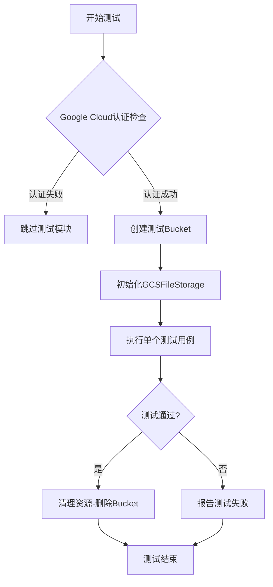

## 类结构

```
测试模块 (test_gcs.py)
├── Fixtures
│   ├── gcs_bucket_name (动态生成测试bucket名称)
│   ├── gcs_root (测试根目录)
│   ├── gcs_storage_uninitialized (未初始化的存储实例)
│   └── gcs_storage_with_files (带测试文件的存储实例)
└── 测试用例
    ├── test_initialize
    ├── test_workspace_bucket_name
    ├── test_read_file
    ├── test_list_files
    ├── test_list_folders
    ├── test_write_read_file
    ├── test_overwrite_file
    ├── test_delete_file
    ├── test_exists
    ├── test_rename_file
    ├── test_rename_dir
    ├── test_clone
    ├── test_copy_file
    └── test_copy_dir
```

## 全局变量及字段


### `NESTED_DIR`
    
嵌套测试目录路径，用于测试嵌套目录操作

类型：`str`
    


### `TEST_FILES`
    
测试文件列表，包含文件名和内容元组，用于批量创建测试文件

类型：`list[tuple[str | Path, str]]`
    


### `gcs_bucket_name`
    
动态生成的GCS bucket名称，使用UUID确保唯一性

类型：`str`
    


### `gcs_root`
    
测试根目录路径，指向/workspaces/AutoGPT-some-unique-task-id

类型：`Path`
    


### `gcs_storage_uninitialized`
    
未初始化的GCSFileStorage实例，用于测试初始化流程

类型：`GCSFileStorage`
    


### `gcs_storage`
    
已初始化的GCSFileStorage实例，包含可用的bucket

类型：`GCSFileStorage`
    


### `gcs_storage_with_files`
    
包含预创建测试文件的GCSFileStorage实例，用于文件操作测试

类型：`GCSFileStorage`
    


### `GCSFileStorage._gcs`
    
Google Cloud Storage客户端，用于与GCS服务交互

类型：`google.cloud.storage.Client`
    


### `GCSFileStorage._bucket`
    
GCS Bucket对象，代表当前配置的存储桶

类型：`google.cloud.storage.Bucket`
    


### `GCSFileStorage.root`
    
存储根目录路径，用于构建文件在bucket中的路径

类型：`Path`
    


### `GCSFileStorageConfiguration.root`
    
根目录配置，从环境变量或配置中读取的存储根路径

类型：`Path`
    
    

## 全局函数及方法


### `test_initialize`

该测试函数用于验证 `GCSFileStorage` 类的 `initialize()` 方法能否正确地在 Google Cloud Storage 中创建指定的 bucket。测试逻辑包括：验证初始化前 bucket 不存在（预期抛出 `NotFound` 异常），调用初始化方法后成功创建 bucket，最后清理删除该测试 bucket。

#### 参数

- `gcs_bucket_name`：`str`，测试用的高随机性 bucket 名称，确保测试环境的隔离性
- `gcs_storage_uninitialized`：`GCSFileStorage`，通过 fixture 创建的未初始化存储实例，其配置已从环境变量加载但未调用 `initialize()`

#### 返回值

`None`，该函数为 pytest 测试函数，不返回任何值，测试结果通过断言和异常捕获判定

#### 流程图

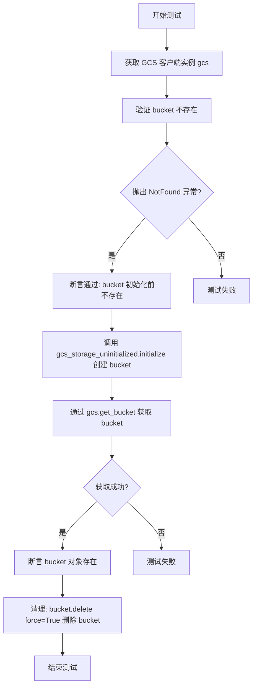

#### 带注释源码

```python
def test_initialize(gcs_bucket_name: str, gcs_storage_uninitialized: GCSFileStorage):
    """
    测试 GCSFileStorage 的 initialize 方法能否正确创建 GCS bucket
    
    测试步骤:
    1. 验证初始化前 bucket 不存在 (预期抛出 NotFound)
    2. 调用 initialize() 创建 bucket
    3. 验证 bucket 已成功创建
    4. 清理删除测试 bucket
    """
    
    # 获取底层 GCS 客户端实例，用于直接操作 Google Cloud Storage
    gcs = gcs_storage_uninitialized._gcs

    # 测试 bucket 在初始化前尚不存在
    # 使用 pytest.raises 捕获预期抛出的 NotFound 异常
    with pytest.raises(NotFound):
        gcs.get_bucket(gcs_bucket_name)

    # 调用被测试的 initialize 方法，创建 bucket
    gcs_storage_uninitialized.initialize()

    # 测试 bucket 已被成功创建，可通过 get_bucket 获取
    bucket = gcs.get_bucket(gcs_bucket_name)

    # 清理操作: 强制删除 bucket 及其内所有对象
    # force=True 会删除 bucket 内的所有文件后删除 bucket 本身
    bucket.delete(force=True)
```


### `test_workspace_bucket_name`

该测试函数用于验证 GCSFileStorage 实例内部绑定的 Google Cloud Storage bucket 名称是否与预期创建测试 bucket 时生成的名称一致，确保存储配置正确初始化。

参数：

- `gcs_storage`：`GCSFileStorage`，已初始化的 GCS 存储实例，包含已创建的测试 bucket
- `gcs_bucket_name`：`str`，测试开始前通过 UUID 生成的唯一 bucket 名称

返回值：`None`，该函数为测试用例，使用 assert 断言进行验证，无显式返回值

#### 流程图

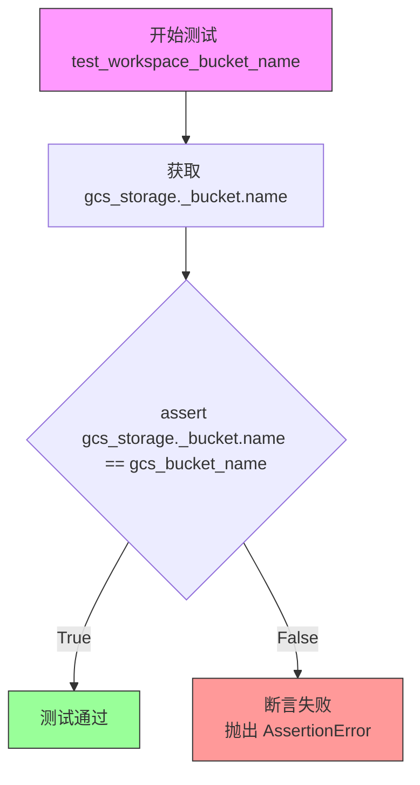

#### 带注释源码

```python
def test_workspace_bucket_name(
    gcs_storage: GCSFileStorage,  # 已初始化的 GCS 存储实例，包含测试 bucket
    gcs_bucket_name: str,         # 预期的 bucket 名称，由 fixture 生成
):
    """
    测试 workspace bucket 名称是否正确获取
    
    该测试验证 GCSFileStorage 实例在初始化后，其内部 _bucket 对象的
    name 属性是否与配置的环境变量 STORAGE_BUCKET 中设置的名称一致。
    这是确保存储配置正确性的基础测试。
    """
    # 断言：gcs_storage 内部 bucket 的名称应等于预期的 bucket 名称
    assert gcs_storage._bucket.name == gcs_bucket_name
```


### `test_read_file`

该测试函数用于验证 GCSFileStorage 类的 `read_file` 方法能否正确读取文件内容，包括对不同路径格式（字符串和 Path 对象）的支持，以及验证对不存在文件的错误处理。

参数：

- `gcs_storage_with_files`：`GCSFileStorage`，包含预置测试文件的 Google Cloud Storage 存储实例

返回值：`None`，测试函数无返回值

#### 流程图

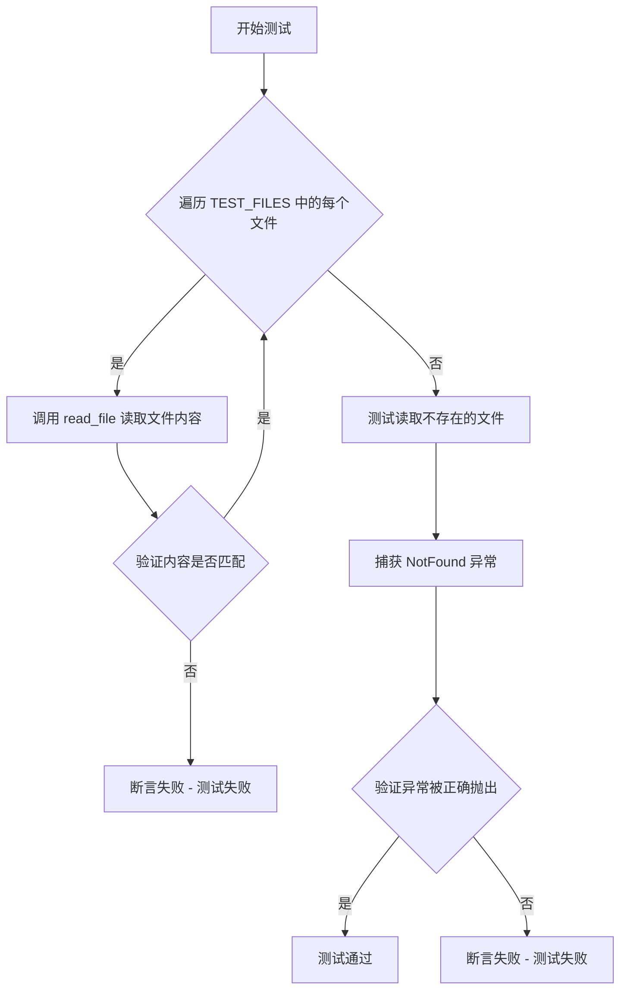

#### 带注释源码

```python
@pytest.mark.asyncio
async def test_read_file(gcs_storage_with_files: GCSFileStorage):
    """
    测试 GCSFileStorage.read_file 方法的功能：
    1. 读取多个预置文件并验证内容正确性
    2. 验证对不存在文件的错误处理
    """
    
    # 遍历预定义的测试文件列表，验证每个文件都能正确读取
    # TEST_FILES 包含: (文件名, 文件内容) 元组列表
    for file_name, file_content in TEST_FILES:
        # 调用 read_file 方法读取文件内容
        content = gcs_storage_with_files.read_file(file_name)
        # 断言读取的内容与预期内容完全一致
        assert content == file_content

    # 测试对不存在文件的错误处理
    # 预期行为：读取不存在的文件时抛出 google.cloud.exceptions.NotFound 异常
    with pytest.raises(NotFound):
        gcs_storage_with_files.read_file("non_existent_file")
```


### `test_list_files`

该测试函数用于验证 `GCSFileStorage` 类的 `list_files()` 方法在不同路径层级（根目录和嵌套目录）下列出文件的功能是否正确，包括幂等性验证和文件列表完整性校验。

参数：

- `gcs_storage_with_files`：`GCSFileStorage`，包含预置测试文件的 GCS 存储实例（fixture）

返回值：`None`，无返回值（pytest 测试函数）

#### 流程图

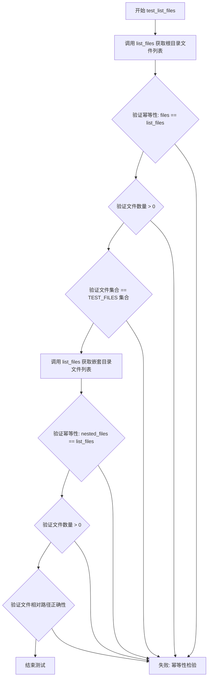

#### 带注释源码

```python
def test_list_files(gcs_storage_with_files: GCSFileStorage):
    """
    测试 GCSFileStorage.list_files() 方法的文件列表功能
    
    测试场景：
    1. 根目录文件列表查询
    2. 嵌套目录文件列表查询
    3. 方法幂等性验证
    """
    
    # ---------- 根目录文件列表测试 ----------
    
    # 调用 list_files() 方法获取根目录下的文件列表
    # 使用 walrus operator 同时赋值并验证幂等性
    assert (
        files := gcs_storage_with_files.list_files()
    ) == gcs_storage_with_files.list_files()
    
    # 验证返回的文件列表不为空
    assert len(files) > 0
    
    # 验证返回的文件集合与预定义的 TEST_FILES 集合一致
    # 将文件名转换为 Path 对象进行比较
    assert set(files) == set(Path(file_name) for file_name, _ in TEST_FILES)

    # ---------- 嵌套目录文件列表测试 ----------
    
    # 调用 list_files(NESTED_DIR) 获取嵌套目录下的文件列表
    # NESTED_DIR = "existing/test/dir"
    assert (
        nested_files := gcs_storage_with_files.list_files(NESTED_DIR)
    ) == gcs_storage_with_files.list_files(NESTED_DIR)
    
    # 验证嵌套目录返回的文件数量大于 0
    assert len(nested_files) > 0
    
    # 验证返回的文件路径是相对于 NESTED_DIR 的相对路径
    # 过滤出属于 NESTED_DIR 目录的文件，转换为相对路径后比较
    assert set(nested_files) == set(
        p.relative_to(NESTED_DIR)
        for file_name, _ in TEST_FILES
        if (p := Path(file_name)).is_relative_to(NESTED_DIR)
    )
```

#### 关联的全局变量

| 变量名 | 类型 | 描述 |
|--------|------|------|
| `TEST_FILES` | `list[tuple[str \| Path, str]]` | 预定义的测试文件列表，包含文件名和文件内容元组 |
| `NESTED_DIR` | `str` | 嵌套测试目录路径 `"existing/test/dir"` |


### `test_list_folders`

该测试函数用于验证 GCS 存储的文件夹列表功能，分别测试递归和非递归两种模式下列出文件夹的正确性。

参数：

- `gcs_storage_with_files`：`GCSFileStorage`，已初始化并包含测试文件的 GCS 存储实例fixture

返回值：`None`，测试函数无返回值，通过断言验证功能正确性

#### 流程图

```mermaid
flowchart TD
    A[开始测试 test_list_folders] --> B[调用 list_folders recursive=True]
    B --> C{验证返回文件夹数量 > 0}
    C -->|是| D[验证返回文件夹集合 == expected]
    D --> E[调用 list_folders recursive=False]
    E --> F{验证返回文件夹数量 > 0}
    F -->|是| G[验证返回文件夹集合 == {Path('existing')}]
    G --> H[测试通过]
    C -->|否| I[断言失败 - 递归模式]
    F -->|否| J[断言失败 - 非递归模式]
```

#### 带注释源码

```python
def test_list_folders(gcs_storage_with_files: GCSFileStorage):
    """
    测试 list_folders 方法的递归和非递归模式
    
    Args:
        gcs_storage_with_files: 包含预置测试文件的 GCS 存储实例
            (由 gcs_storage_with_files fixture 提供)
    
    Returns:
        None (测试函数，通过断言验证)
    """
    
    # ===== 测试递归模式 =====
    # 调用 list_folders 方法，recursive=True 表示递归列出所有子文件夹
    folders = gcs_storage_with_files.list_folders(recursive=True)
    
    # 验证返回的文件夹数量大于0（确保有文件夹被列出）
    assert len(folders) > 0
    
    # 验证返回的文件夹集合与预期一致
    # 预期包含：existing, existing/test, existing/test/dir 三个文件夹
    assert set(folders) == {
        Path("existing"),           # 根级文件夹
        Path("existing/test"),      # 二级子文件夹
        Path("existing/test/dir"),  # 三级子文件夹
    }
    
    # ===== 测试非递归模式 =====
    # 调用 list_folders 方法，recursive=False 表示仅列出顶层文件夹
    folders = gcs_storage_with_files.list_folders(recursive=False)
    
    # 验证返回的文件夹数量大于0（确保有文件夹被列出）
    assert len(folders) > 0
    
    # 验证非递归模式下只返回顶层文件夹
    # 预期只包含：existing（不包含子文件夹）
    assert set(folders) == {Path("existing")}
```


### `test_write_read_file`

该测试函数用于验证 GCSFileStorage 类的文件写入和读取功能是否正常工作。测试通过异步方式向 GCS 存储写入指定内容，然后立即读取并验证内容一致性。

参数：

- `gcs_storage`：`GCSFileStorage`，GCS 存储实例，提供文件操作接口

返回值：`None`，该测试函数通过断言验证功能，不返回具体值

#### 流程图

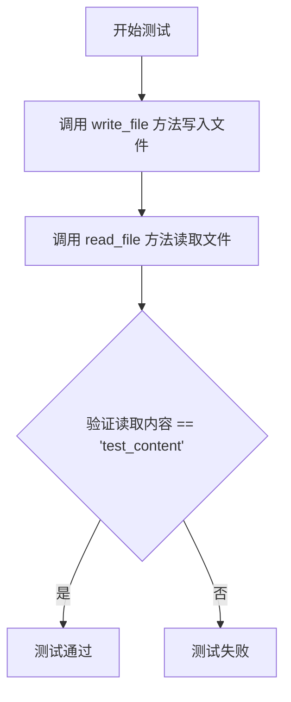

#### 带注释源码

```python
@pytest.mark.asyncio
async def test_write_read_file(gcs_storage: GCSFileStorage):
    """
    测试 GCS 文件存储的写入和读取功能
    
    该测试验证：
    1. write_file 方法能够正确将内容写入指定文件
    2. read_file 方法能够正确读取写入的内容
    3. 写入和读取的内容保持一致
    """
    # 异步写入文件，文件名为 'test_file'，内容为 'test_content'
    await gcs_storage.write_file("test_file", "test_content")
    
    # 读取刚才写入的文件内容，并与预期内容进行比对
    # 使用 assert 断言确保读取的内容与写入的内容一致
    assert gcs_storage.read_file("test_file") == "test_content"
```


### `test_overwrite_file`

该测试函数用于验证 GCS 存储的文件覆盖写入功能。函数遍历预创建的测试文件列表，对每个文件调用 `write_file` 方法写入新内容，然后读取文件内容进行断言验证，确保文件内容已正确更新为新内容。

参数：

- `gcs_storage_with_files`：`GCSFileStorage`，pytest fixture 提供的带有预创建测试文件的 GCS 存储实例

返回值：`None`，测试函数不返回任何值，仅通过断言验证功能正确性

#### 流程图

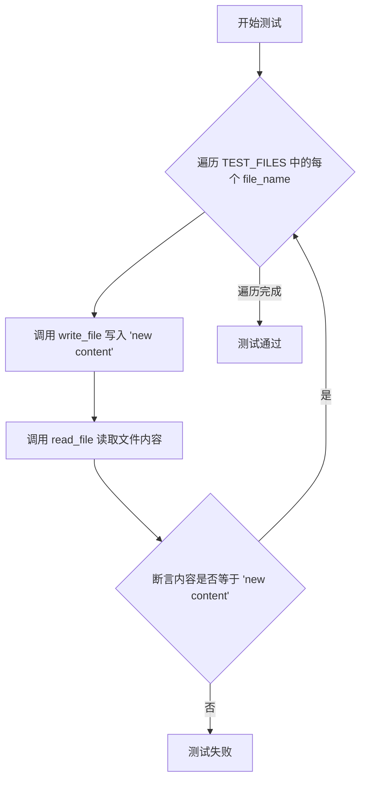

#### 带注释源码

```python
@pytest.mark.asyncio
async def test_overwrite_file(gcs_storage_with_files: GCSFileStorage):
    """
    测试文件覆盖写入功能
    
    该测试验证当使用 write_file 方法写入已存在的文件时，
    能够正确覆盖原有内容
    """
    # 遍历预创建的测试文件列表（包含文件名和原始内容）
    for file_name, _ in TEST_FILES:
        # 使用 write_file 方法覆盖写入新内容 "new content"
        await gcs_storage_with_files.write_file(file_name, "new content")
        
        # 读取文件内容并断言是否成功覆盖为新内容
        assert gcs_storage_with_files.read_file(file_name) == "new content"
```


### `test_delete_file`

该测试函数用于验证 GCS 文件存储的删除功能，通过遍历预设的测试文件列表，逐个调用 `delete_file` 方法删除文件，并使用 `exists` 方法断言文件已被成功删除。

参数：

- `gcs_storage_with_files`：`GCSFileStorage`，预先配置了测试文件的 GCS 存储实例fixture

返回值：`None`，无返回值（测试函数）

#### 流程图

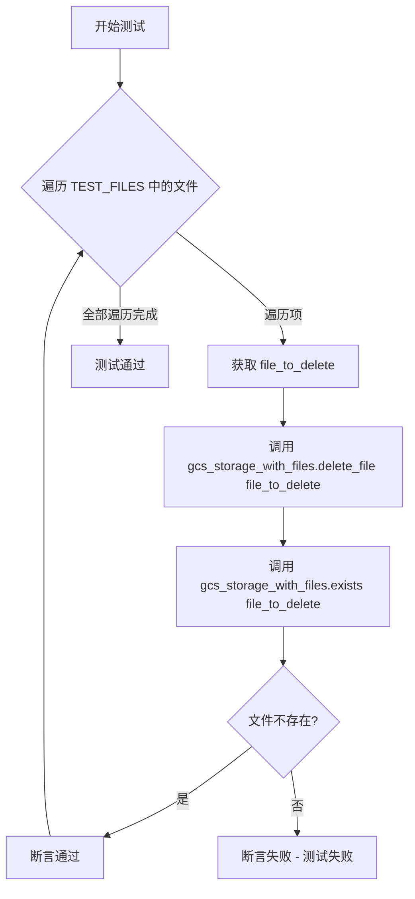

#### 带注释源码

```python
def test_delete_file(gcs_storage_with_files: GCSFileStorage):
    """
    测试 GCSFileStorage 的 delete_file 方法
    
    该测试函数执行以下步骤：
    1. 遍历预定义的测试文件列表 TEST_FILES
    2. 对每个文件调用 delete_file 方法进行删除
    3. 使用 exists 方法验证文件已被成功删除
    
    参数:
        gcs_storage_with_files: 包含预先上传的测试文件的 GCS 存储实例
    
    返回值:
        None
    
    异常:
        AssertionError: 如果文件在删除后仍然存在
    """
    # 遍历测试文件列表中的每个文件
    # TEST_FILES 包含: [("existing_test_file_1", "test content 1"), 
    #                   ("existing_test_file_2.txt", "test content 2"),
    #                   (Path("existing_test_file_3"), "test content 3"),
    #                   (Path(f"{NESTED_DIR}/test_file_4"), "test content 4")]
    for file_to_delete, _ in TEST_FILES:
        # 调用 GCSFileStorage 的 delete_file 方法删除文件
        gcs_storage_with_files.delete_file(file_to_delete)
        
        # 断言验证文件已被成功删除
        # exists 方法应返回 False，因为文件已被删除
        assert not gcs_storage_with_files.exists(file_to_delete)
```


### `test_exists`

该测试函数用于验证 GCSFileStorage 类的 `exists` 方法能够正确检测指定文件在 Google Cloud Storage 存储中是否存在。测试通过遍历预定义的测试文件列表，断言每个已存在的文件返回 True，同时验证不存在的文件返回 False。

参数：

- `gcs_storage_with_files`：`GCSFileStorage`，包含预先上传的测试文件的 GCS 存储实例

返回值：`None`，该函数为测试函数，无返回值，主要通过断言验证功能

#### 流程图

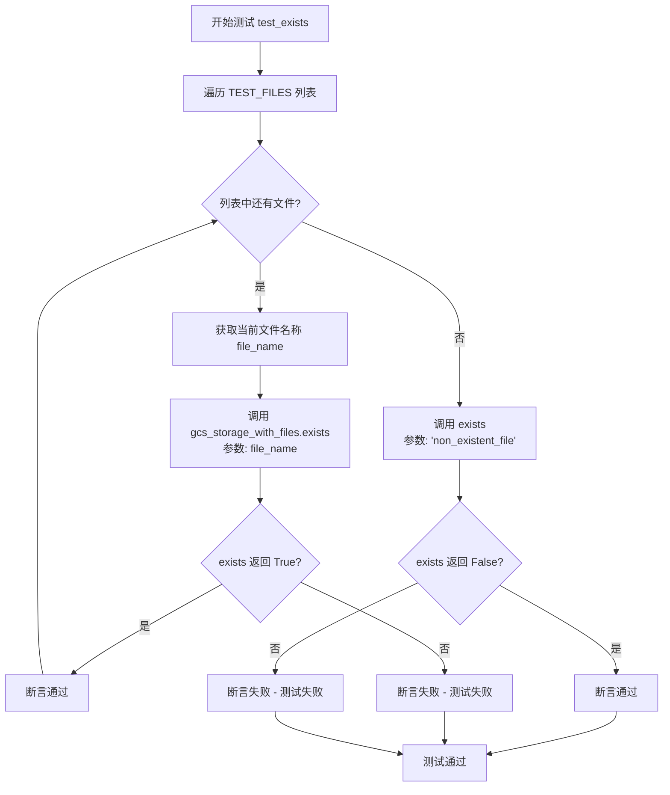

#### 带注释源码

```python
def test_exists(gcs_storage_with_files: GCSFileStorage):
    """
    测试 GCSFileStorage.exists 方法的文件存在性检查功能
    
    参数:
        gcs_storage_with_files: 包含预先上传测试文件的 GCSFileStorage 实例
        该 fixture 会在测试前创建以下测试文件:
        - existing_test_file_1
        - existing_test_file_2.txt
        - existing_test_file_3
        - existing/test/dir/test_file_4
    """
    # 遍历所有预定义的测试文件，验证 exists 方法能正确检测到已存在的文件
    for file_name, _ in TEST_FILES:
        # 断言: 对于已存在的文件，exists 方法应返回 True
        assert gcs_storage_with_files.exists(file_name)

    # 验证不存在的文件返回 False
    # 断言: 对于不存在的文件 'non_existent_file'，exists 方法应返回 False
    assert not gcs_storage_with_files.exists("non_existent_file")
```


### `test_rename_file`

该测试函数用于验证 GCSFileStorage 类的文件重命名功能，遍历预定义的测试文件列表，将每个文件重命名为新名称，并断言重命名后的文件存在而原文件不再存在。

参数：

- `gcs_storage_with_files`：`GCSFileStorage`，带有预加载测试文件的 GCS 存储实例 fixture

返回值：`None`，测试函数无返回值，通过断言验证功能正确性

#### 流程图

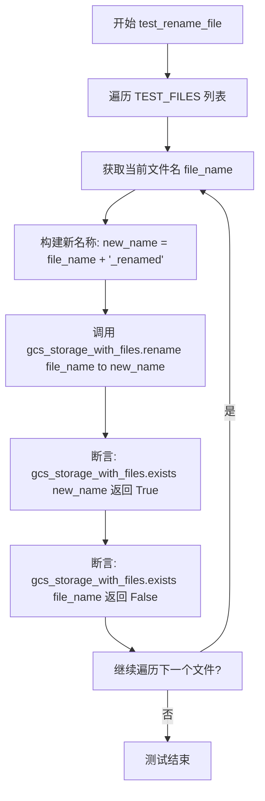

#### 带注释源码

```python
def test_rename_file(gcs_storage_with_files: GCSFileStorage):
    """
    测试 GCSFileStorage 的文件重命名功能。
    
    该测试遍历预定义的测试文件列表 (TEST_FILES)，
    对每个文件调用 rename 方法重命名，
    然后验证重命名成功：原文件不存在，新文件存在。
    """
    # 遍历所有预定义的测试文件
    for file_name, _ in TEST_FILES:
        # 构造新的文件名：在原文件名后追加 "_renamed"
        new_name = str(file_name) + "_renamed"
        
        # 调用 GCSFileStorage 的 rename 方法执行重命名
        gcs_storage_with_files.rename(file_name, new_name)
        
        # 断言：重命名后的新文件应该存在
        assert gcs_storage_with_files.exists(new_name)
        
        # 断言：原来的旧文件应该不再存在
        assert not gcs_storage_with_files.exists(file_name)
```


### `test_rename_dir`

该测试函数用于验证 GCSFileStorage 类的目录重命名功能是否正常工作。测试通过将一个已存在的嵌套目录重命名为新名称，并验证新目录存在而原目录已被移除。

参数：

- `gcs_storage_with_files`：`GCSFileStorage`，一个预先配置好的 GCS 存储实例，已包含测试文件（通过 `gcs_storage_with_files` fixture 注入）

返回值：`None`，该函数为测试函数，不返回任何值，通过断言验证功能正确性

#### 流程图

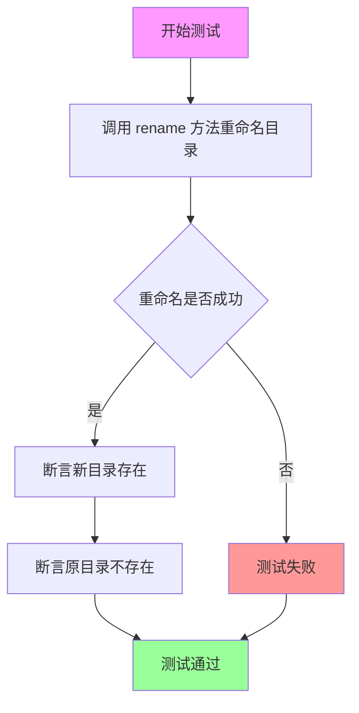

#### 带注释源码

```python
def test_rename_dir(gcs_storage_with_files: GCSFileStorage):
    """
    测试 GCSFileStorage 的目录重命名功能。
    
    该测试验证能够将已存在的嵌套目录重命名为新名称，
    并确保原目录不再存在。
    
    参数:
        gcs_storage_with_files: 带有预置测试文件的 GCS 存储实例，
                                通过 fixture 自动注入
    """
    # 调用 rename 方法将嵌套目录 NESTED_DIR ("existing/test/dir") 
    # 重命名为 "existing/test/dir_renamed"
    gcs_storage_with_files.rename(NESTED_DIR, "existing/test/dir_renamed")
    
    # 断言验证新目录名称 "existing/test/dir_renamed" 已存在
    assert gcs_storage_with_files.exists("existing/test/dir_renamed")
    
    # 断言验证原目录名称 NESTED_DIR ("existing/test/dir") 已不存在
    assert not gcs_storage_with_files.exists(NESTED_DIR)
```


### `test_clone`

该测试函数验证 GCSFileStorage 类的 `clone_with_subroot` 方法是否能够正确创建一个具有子根目录的新存储实例，并确保克隆后的实例具有正确的根路径、共享同一个存储桶，并且能够访问原路径下的文件和目录。

参数：

- `gcs_storage_with_files`：`GCSFileStorage`，预先配置了测试文件（包括嵌套目录 "existing/test/dir" 下的文件）的 GCS 存储实例 fixture
- `gcs_root`：`Path`，GCS 存储的根路径，值为 `/workspaces/AutoGPT-some-unique-task-id`

返回值：`None`，测试函数无返回值，通过断言验证功能正确性

#### 流程图

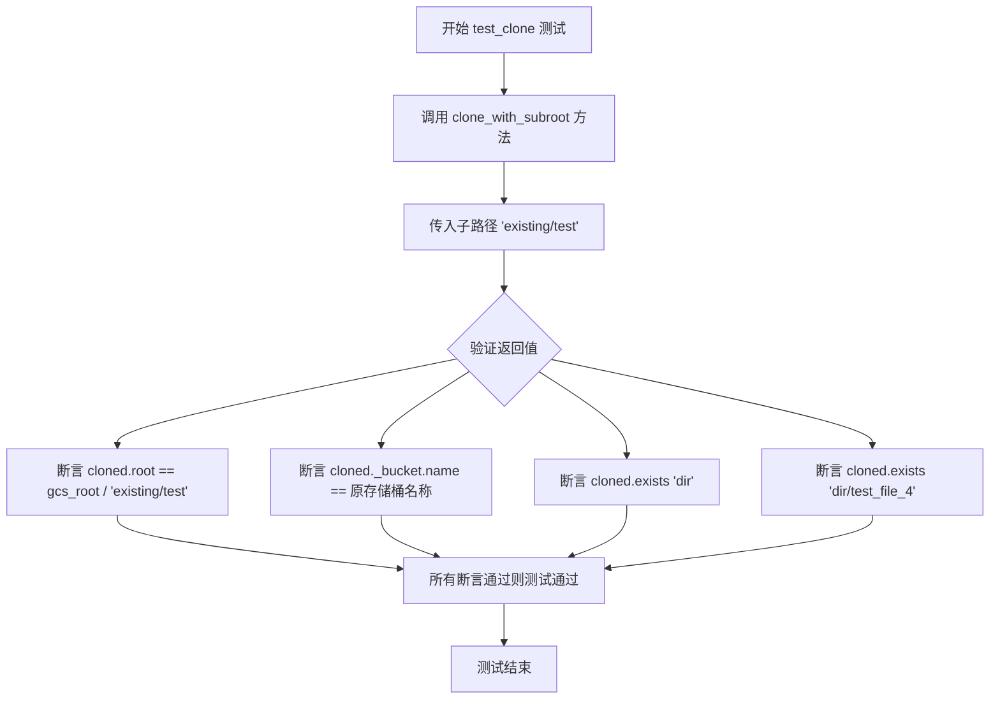

#### 带注释源码

```python
def test_clone(gcs_storage_with_files: GCSFileStorage, gcs_root: Path):
    """
    测试 clone_with_subroot 方法的功能。
    
    该方法创建一个新的 GCSFileStorage 实例，其根路径为原存储的子目录，
    但共享同一个存储桶，用于操作特定的子目录内容。
    """
    # 调用 clone_with_subroot 方法，传入子路径 'existing/test'
    # 这将返回一个根路径为 gcs_root / 'existing/test' 的新存储实例
    cloned = gcs_storage_with_files.clone_with_subroot("existing/test")
    
    # 断言1：验证克隆实例的根路径是否正确设置为子目录路径
    assert cloned.root == gcs_root / Path("existing/test")
    
    # 断言2：验证克隆实例共享同一个存储桶（而非创建新桶）
    assert cloned._bucket.name == gcs_storage_with_files._bucket.name
    
    # 断言3：验证在子路径下存在 'dir' 目录
    # 由于子路径是 'existing/test'，实际检查的是 'existing/test/dir'
    assert cloned.exists("dir")
    
    # 断言4：验证在子路径下存在 'dir/test_file_4' 文件
    # 实际检查的是 'existing/test/dir/test_file_4'
    assert cloned.exists("dir/test_file_4")
```


### `test_copy_file`

该测试函数用于验证 GCSFileStorage 类的文件复制功能，包括单文件复制和将文件复制到指定目录的能力。

参数：

- `storage`：`GCSFileStorage`，GCS 存储客户端实例，用于执行文件操作

返回值：`None`，该测试函数无返回值，仅通过断言验证复制结果的正确性

#### 流程图

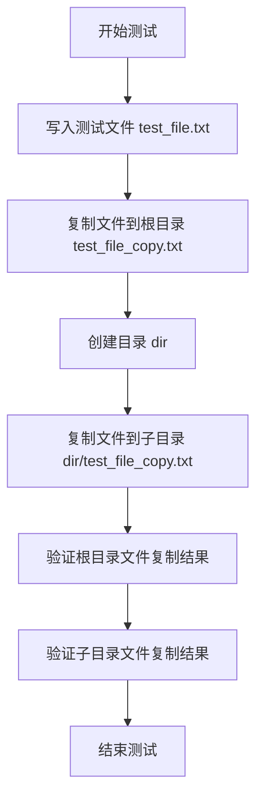

#### 带注释源码

```python
@pytest.mark.asyncio
async def test_copy_file(storage: GCSFileStorage):
    """测试 GCSFileStorage 的文件复制功能"""
    # 写入原始测试文件，内容为 'test content'
    await storage.write_file("test_file.txt", "test content")
    
    # 将文件复制到根目录，生成新文件 test_file_copy.txt
    storage.copy("test_file.txt", "test_file_copy.txt")
    
    # 创建一个名为 'dir' 的目录
    storage.make_dir("dir")
    
    # 将文件复制到 dir 目录下
    storage.copy("test_file.txt", "dir/test_file_copy.txt")
    
    # 断言：验证根目录下的复制文件内容正确
    assert storage.read_file("test_file_copy.txt") == "test content"
    
    # 断言：验证子目录下的复制文件内容正确
    assert storage.read_file("dir/test_file_copy.txt") == "test content"
```


### `test_copy_dir`

这是一个异步测试函数，用于测试 GCSFileStorage 类的目录复制功能。测试会创建嵌套目录结构，写入测试文件，然后复制整个目录，最后验证复制后的文件内容是否正确。

参数：

- `storage`：`GCSFileStorage`，GCS 存储实例，用于执行文件操作

返回值：`None`，无返回值（测试函数）

#### 流程图

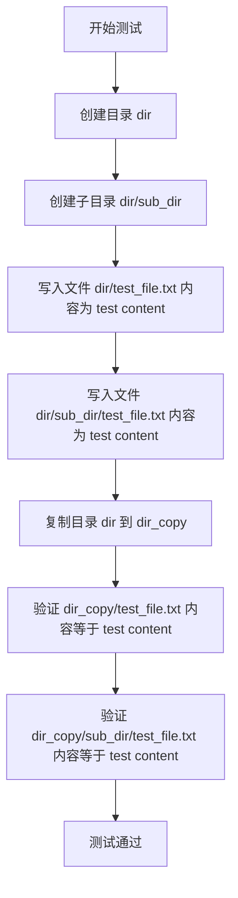

#### 带注释源码

```python
@pytest.mark.asyncio
async def test_copy_dir(storage: GCSFileStorage):
    """
    测试 GCSFileStorage 的目录复制功能
    
    参数:
        storage: GCSFileStorage 实例，用于执行文件存储操作
    """
    # 创建一个名为 dir 的顶层目录
    storage.make_dir("dir")
    
    # 在 dir 目录下创建子目录 sub_dir
    storage.make_dir("dir/sub_dir")
    
    # 在 dir 目录下创建文件 test_file.txt，内容为 'test content'
    await storage.write_file("dir/test_file.txt", "test content")
    
    # 在 dir/sub_dir 目录下创建文件 test_file.txt，内容为 'test content'
    await storage.write_file("dir/sub_dir/test_file.txt", "test content")
    
    # 将整个 dir 目录复制为 dir_copy（包含所有子目录和文件）
    storage.copy("dir", "dir_copy")
    
    # 断言：验证复制后的文件 dir_copy/test_file.txt 内容正确
    assert storage.read_file("dir_copy/test_file.txt") == "test content"
    
    # 断言：验证复制后的文件 dir_copy/sub_dir/test_file.txt 内容正确
    assert storage.read_file("dir_copy/sub_dir/test_file.txt") == "test content"
```


### GCSFileStorage.initialize()

该方法用于初始化 GCS 存储客户端，验证并确保指定的存储桶已创建，是 GCSFileStorage 存储服务启动时的核心初始化流程。

参数： 无

返回值：`None`，无返回值描述

#### 流程图

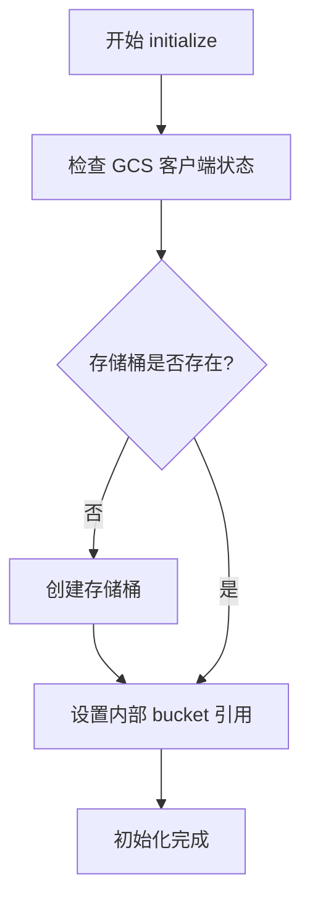

#### 带注释源码

```python
def initialize(self) -> None:
    """
    初始化 GCS 存储客户端，验证或创建存储桶。
    
    该方法执行以下操作：
    1. 验证 GCS 客户端是否已正确配置
    2. 检查配置的存储桶名称是否存在于 GCS 中
    3. 如果存储桶不存在，则创建新的存储桶
    4. 将 bucket 对象存储在实例变量中供后续操作使用
    
    注意：
    - 依赖 GCSFileStorageConfiguration 中配置的 bucket 名称
    - 需要有效的 Google Cloud 认证凭据
    - 如果认证失败会抛出 GoogleAuthError
    """
    # 从配置获取存储桶名称
    bucket_name = self._config.bucket
    
    # 尝试获取已存在的存储桶
    # 如果存储桶不存在，google.cloud.exceptions.NotFound 会被抛出
    try:
        bucket = self._gcs.get_bucket(bucket_name)
    except NotFound:
        # 存储桶不存在，创建新存储桶
        bucket = self._gcs.create_bucket(bucket_name)
    
    # 将 bucket 对象存储为实例变量，供其他方法使用
    self._bucket = bucket
```


### `GCSFileStorage.read_file`

该方法用于从 GCS 存储桶中读取指定文件的内容，支持字符串和 Path 类型的文件名输入，当文件不存在时抛出 `google.cloud.exceptions.NotFound` 异常。

参数：

- `file_name`：str | Path，要读取的文件名或路径

返回值：str，返回文件的文本内容

#### 流程图

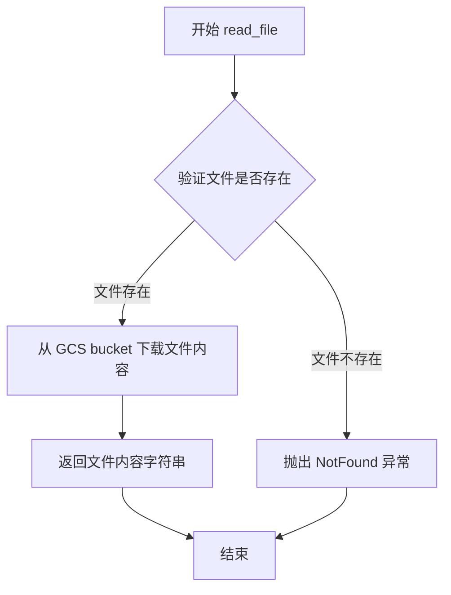

#### 带注释源码

```python
def read_file(self, file_name: str | Path) -> str:
    """
    从 GCS 存储读取文件内容
    
    参数:
        file_name: 文件名或路径，支持 str 和 Path 类型
    
    返回:
        文件的文本内容字符串
    
    异常:
        google.cloud.exceptions.NotFound: 文件不存在时抛出
    """
    # 将输入转换为字符串路径
    file_path = str(file_name)
    
    # 获取完整的 GCS 对象路径（包含 root 前缀）
    blob_path = self.get_path(file_path)
    
    # 从 GCS bucket 获取 blob 对象
    blob = self._bucket.blob(blob_path)
    
    # 下载并返回文件内容为字符串
    # 如果文件不存在，这里会抛出 NotFound 异常
    content = blob.download_as_string()
    
    # 返回解码后的字符串内容
    return content.decode("utf-8")
```


### `GCSFileStorage.write_file`

该方法用于将内容写入指定名称的 GCS 存储文件，支持覆盖已存在的文件或创建新文件。

参数：

- `file_name`：`str` 或 `Path`，要写入的文件名称或路径
- `content`：`str`，要写入文件的内容

返回值：`None`，该方法为异步操作，不返回具体值（通过 `await` 调用）

#### 流程图

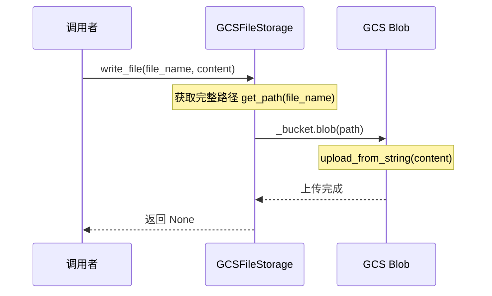

#### 带注释源码

```python
# 从测试代码中提取的调用方式：
await gcs_storage.write_file("test_file", "test_content")
await gcs_storage.write_file(file_name, "new content")
await storage.write_file("test_file.txt", "test content")
await storage.write_file("dir/test_file.txt", "test content")

# 基于测试代码推断的实现逻辑：
async def write_file(self, file_name: str | Path, content: str) -> None:
    """
    将内容写入到指定的文件
    
    参数:
        file_name: 文件名或路径，支持 str 或 Path 类型
        content: 要写入的字符串内容
    """
    # 1. 获取文件的完整路径
    # 2. 获取或创建对应的 GCS Blob 对象
    # 3. 使用 upload_from_string 将内容上传
    blob = self._bucket.blob(str(self.get_path(file_name)))
    blob.upload_from_string(content)
```

---

**注意**：用户提供的代码仅为测试文件（test file），未包含 `GCSFileStorage` 类的实际实现源码。上述信息是基于测试代码中的调用方式推断得出的。若需要完整的实现源码，请提供 `.gcs` 模块的内容。


### `GCSFileStorage.list_files`

该方法用于列出指定路径下的所有文件，支持根目录和嵌套目录的文件列表返回。

参数：

- `path`：`str | Path`，可选参数，指定要列出文件的目录路径，默认为空字符串（即根目录）

返回值：`set[Path]`，返回指定路径下所有文件的 Path 对象集合

#### 流程图

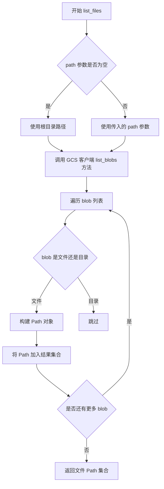

#### 带注释源码

```python
def test_list_files(gcs_storage_with_files: GCSFileStorage):
    # 测试1：列出根目录下的所有文件
    # 调用 list_files() 不传参数，默认列出根目录文件
    assert (
        files := gcs_storage_with_files.list_files()
    ) == gcs_storage_with_files.list_files()
    # 验证返回的文件集合大于0
    assert len(files) > 0
    # 验证返回的文件与测试文件集合一致
    assert set(files) == set(Path(file_name) for file_name, _ in TEST_FILES)

    # 测试2：列出嵌套目录下的文件
    # 传入 NESTED_DIR 路径，列出该目录下的文件
    assert (
        nested_files := gcs_storage_with_files.list_files(NESTED_DIR)
    ) == gcs_storage_with_files.list_files(NESTED_DIR)
    assert len(nested_files) > 0
    # 验证返回的嵌套文件路径正确（相对于 NESTED_DIR）
    assert set(nested_files) == set(
        p.relative_to(NESTED_DIR)
        for file_name, _ in TEST_FILES
        if (p := Path(file_name)).is_relative_to(NESTED_DIR)
    )
```


### `GCSFileStorage.list_folders`

该方法用于列出 Google Cloud Storage 存储桶中的文件夹，支持递归和非递归两种模式。递归模式下会返回所有层级的文件夹路径，非递归模式仅返回顶级文件夹。

#### 参数

- `recursive`：`bool`，指定是否递归列出所有子文件夹。为 `True` 时返回完整文件夹层级结构，为 `False` 时仅返回顶级文件夹。

#### 返回值

- `set[Path]`，返回文件夹路径的集合，每个元素为 `pathlib.Path` 对象。

#### 流程图

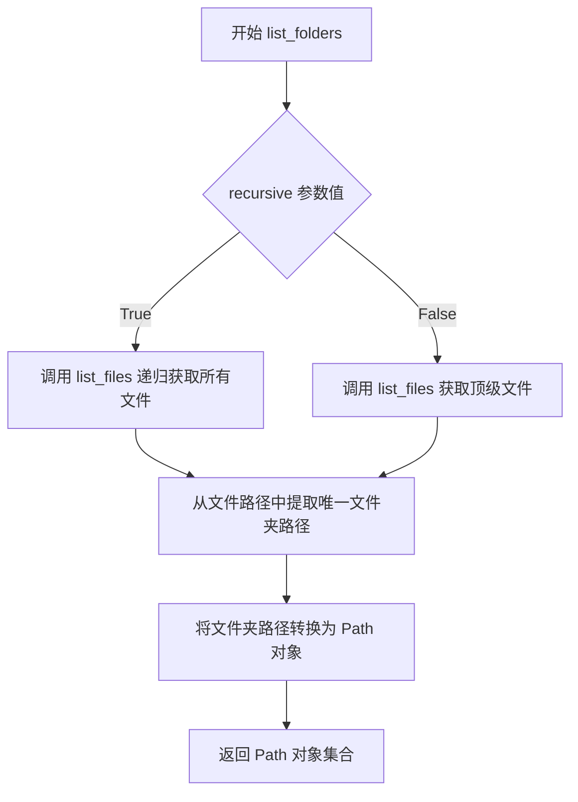

#### 带注释源码

```python
def list_folders(self, recursive: bool = False) -> set[Path]:
    """
    列出存储桶中的文件夹。
    
    Args:
        recursive: 是否递归列出所有子文件夹。
                   - True: 返回所有层级的文件夹（如 existing, existing/test, existing/test/dir）
                   - False: 仅返回顶级文件夹（如 existing）
    
    Returns:
        包含文件夹路径的 Path 对象集合。
    """
    # 获取文件列表，list_files 会返回所有文件路径
    # 参数为空时表示从根目录开始
    files = self.list_files()
    
    # 如果 recursive 为 False，只获取顶级文件夹
    # 顶级文件夹的定义是文件路径中第一个斜杠之前的部分
    if not recursive:
        # 提取顶级文件夹：取文件路径中第一个 '/' 之前的部分作为文件夹
        # 例如：'existing/test/file.txt' -> 'existing'
        folders = {
            Path(parts[0])  # 取第一个路径部分作为顶级文件夹
            for file in files
            if (parts := str(file).split("/"))  # 按 '/' 分割路径
            and len(parts) > 1  # 只有多级路径才有文件夹
        }
    else:
        # 递归模式：从所有文件路径中提取完整的文件夹层级
        # 例如：'existing/test/file.txt' -> ['existing', 'existing/test', 'existing/test/dir']
        folders = set()
        for file in files:
            path_str = str(file)
            # 按 '/' 分割并构建每层级的文件夹路径
            parts = path_str.split("/")
            for i in range(1, len(parts)):  # 从第二部分开始（跳过文件名）
                # 构建文件夹路径：取前 i 个部分
                folder_path = "/".join(parts[:i])
                folders.add(Path(folder_path))
    
    return folders
```

**注意**：由于提供的代码仅为测试文件，未包含 `GCSFileStorage` 类的实际实现源码，以上源码为基于测试用例行为和 Google Cloud Storage API 特性的合理推断。实际实现可能略有差异。


### `GCSFileStorage.delete_file`

该方法用于从Google Cloud Storage存储桶中删除指定的文件，通过获取文件路径对应的Blob对象并调用其delete方法实现文件删除操作。

参数：

- `file_name`：`str | Path`，要删除的文件名称或路径，支持字符串或Path对象类型

返回值：`None`，该方法执行完成后不返回任何值

#### 流程图

```mermaid
flowchart TD
    A[开始 delete_file] --> B[获取完整文件路径 get_path]
    B --> C[构造 Blob 对象]
    C --> D{Blob 是否存在}
    D -->|是| E[调用 blob.delete]
    D -->|否| F[抛出 NotFound 异常]
    E --> G[结束]
    F --> G
```

#### 带注释源码

```python
def delete_file(self, file_name: str | Path) -> None:
    """
    删除指定文件
    
    参数:
        file_name: 要删除的文件名或路径
    
    返回:
        None: 操作完成后不返回任何值
    
    异常:
        NotFound: 当指定文件不存在时抛出
    """
    # 1. 获取文件的完整路径（结合根目录和文件名）
    file_path = self.get_path(file_name)
    
    # 2. 获取对应的 Blob 对象（不实际创建，仅获取引用）
    blob = self._bucket.blob(str(file_path))
    
    # 3. 执行删除操作
    # 如果文件不存在，Google Cloud SDK 会抛出 NotFound 异常
    blob.delete()
    
    # 注意：该方法没有返回值，删除成功后直接结束
    # 调用方可以通过 exists() 方法验证文件是否已被删除
```


### `GCSFileStorage.exists`

检查指定文件是否存在于 GCS 存储中，通过调用 GCS 客户端的 blob 方法尝试获取文件对象，若捕获到 NotFound 异常则返回 False，否则返回 True。

参数：

- `file_name`：`str | Path`，需要检查存在的文件名或路径

返回值：`bool`，如果文件存在返回 True，否则返回 False

#### 流程图

```mermaid
flowchart TD
    A[开始 exists 检查] --> B[获取文件完整路径]
    B --> C{尝试获取 Blob 对象}
    C -->|成功获取| D[文件存在]
    D --> E[返回 True]
    C -->|抛出 NotFound 异常| F[文件不存在]
    F --> G[返回 False]
    
    style A fill:#f9f,color:#333
    style D fill:#9f9,color:#333
    style F fill:#f99,color:#333
```

#### 带注释源码

```python
def exists(self, file_name: str | Path) -> bool:
    """
    检查文件是否存在于存储中
    
    参数:
        file_name: 要检查的文件名或路径
        
    返回:
        bool: 文件存在返回 True，否则返回 False
    """
    # 根据测试代码推断的实现逻辑
    try:
        # 获取文件的完整路径
        file_path = self.get_path(file_name)
        
        # 尝试获取 GCS blob 对象
        # 如果文件不存在会抛出 google.cloud.exceptions.NotFound 异常
        blob = self._bucket.blob(str(file_path))
        
        # 尝试重新加载 blob 对象以验证存在性
        # 如果不存在会抛出 NotFound 异常
        blob.reload()
        
        # 如果没有抛出异常，说明文件存在
        return True
        
    except NotFound:
        # 捕获 NotFound 异常，返回 False
        return False
```

> **注意**：由于提供的代码片段仅包含测试代码，未包含 `GCSFileStorage` 类的实际实现，上述源码是基于测试用例 `test_exists` 和 `test_delete_file` 中的调用方式推断得出的。具体实现可能略有差异。


### `GCSFileStorage.rename`

该方法用于在 Google Cloud Storage 存储桶中重命名文件或目录。它接受旧路径和新路径作为参数，将指定路径的文件或目录重命名为新名称，并确保原路径不再存在而新路径存在。

参数：
- `old_path`：str | Path，要重命名的文件或目录的原始路径
- `new_path`：str | Path，重命名后的目标路径

返回值：None，该方法直接修改存储状态，不返回任何值

#### 流程图

```mermaid
flowchart TD
    A[开始重命名操作] --> B{old_path 是否存在}
    B -->|否| C[抛出异常或返回错误]
    B -->|是| D{old_path 是文件还是目录}
    D -->|文件| E[获取源文件的 Blob 对象]
    D -->|目录| F[获取目录下所有文件]
    E --> G[复制文件到新路径]
    F --> G
    G --> H[删除原路径的文件或目录]
    H --> I[验证 new_path 存在]
    I --> J{验证成功?}
    J -->|是| K[结束]
    J -->|否| L[抛出异常]
```

#### 带注释源码

```python
def rename(self, old_path: str | Path, new_path: str | Path) -> None:
    """
    重命名文件或目录。
    
    参数:
        old_path: str | Path - 要重命名的文件或目录的原始路径
        new_path: str | Path - 重命名后的目标路径
    
    返回:
        None - 该方法直接修改存储状态，不返回任何值
    
    注意:
        - 如果 old_path 不存在，将抛出异常
        - 如果 new_path 已存在，将覆盖已有文件
        - 该方法既支持文件重命名，也支持目录重命名
        - 目录重命名时，目录下所有文件的路径都会相应更新
    """
    # 将路径转换为字符串格式，确保兼容性
    old_path_str = str(old_path)
    new_path_str = str(new_path)
    
    # 检查源路径是否存在
    if not self.exists(old_path_str):
        from google.cloud.exceptions import NotFound
        raise NotFound(f"Source path '{old_path_str}' does not exist")
    
    # 判断是否为目录（通过路径末尾是否有斜杠或是否包含多个部分）
    # 在 GCS 中，目录是虚拟的，实际上是通过文件路径前缀来模拟的
    is_directory = old_path_str.endswith('/') or '/' in old_path_str
    
    if is_directory:
        # 处理目录重命名
        # 获取目录下所有文件
        files = self.list_files(old_path_str, recursive=True)
        
        # 计算旧路径的前缀长度，用于构建新路径
        old_prefix = old_path_str.rstrip('/') + '/'
        new_prefix = new_path_str.rstrip('/') + '/'
        
        # 遍历所有文件，复制到新路径并删除旧路径
        for file_path in files:
            # 构建相对路径
            relative_path = str(file_path).replace(old_prefix, '', 1)
            # 构建新的完整路径
            new_file_path = new_prefix + relative_path
            
            # 复制文件内容
            content = self.read_file(file_path)
            # 注意：这里需要递归创建目录，可能需要先创建父目录
            await self.write_file(new_file_path, content)
            
            # 删除旧文件
            self.delete_file(file_path)
    else:
        # 处理文件重命名
        # 获取源文件的 Blob 对象
        old_blob = self._bucket.blob(self.get_path(old_path_str))
        
        # 获取目标路径的 Blob 对象
        new_blob = self._bucket.blob(self.get_path(new_path_str))
        
        # 复制文件内容到新位置
        # GCS 的 copy 方法需要指定源 Blob 和目标 Blob
        old_blob.copy(new_blob)
        
        # 删除源文件
        old_blob.delete()
    
    # 注意：由于 GCS 没有真正的目录概念，重命名目录实际上是
    # 重命名所有以该路径为前缀的文件，这在上面的目录处理逻辑中实现
```


### GCSFileStorage.copy

该方法实现将文件或目录从源路径复制到目标路径的功能，支持单个文件复制和整个目录的递归复制操作。

参数：

- `source`：`str`，源文件或目录的路径
- `destination`：`str`，目标路径

返回值：`None`，无返回值（直接修改GCS存储状态）

#### 流程图

```mermaid
flowchart TD
    A[开始 copy] --> B{判断 source 是否是目录}
    B -->|是目录| C[调用 _copy_dir 方法]
    B -->|不是目录| D[调用 _copy_file 方法]
    
    C --> E[获取源目录的 Blob 对象列表]
    E --> F[遍历所有文件 Blob]
    F --> G[构建目标路径]
    G --> H[复制每个文件到目标路径]
    H --> I[结束]
    
    D --> J[获取源文件的 Blob 对象]
    J --> K[创建目标路径的 Blob]
    K --> L[使用 copy 方法复制内容]
    L --> I
    
    style A fill:#f9f,color:#000
    style I fill:#9f9,color:#000
```

#### 带注释源码

```python
# 测试代码中展示的调用方式：
# 文件复制：
storage.copy("test_file.txt", "test_file_copy.txt")
storage.copy("test_file.txt", "dir/test_file_copy.txt")

# 目录复制：
storage.copy("dir", "dir_copy")

# 根据测试代码推断的 copy 方法实现逻辑：

def copy(self, source: str, destination: str) -> None:
    """
    复制文件或目录到目标路径
    
    参数:
        source: 源文件或目录的路径
        destination: 目标路径
    """
    # 判断是否为目录复制
    if self._is_dir(source):
        # 调用目录复制方法
        self._copy_dir(source, destination)
    else:
        # 调用文件复制方法
        self._copy_file(source, destination)

def _copy_file(self, source: str, destination: str) -> None:
    """复制单个文件"""
    # 获取源文件的 Blob 对象
    source_blob = self._bucket.blob(self.get_path(source))
    
    # 创建目标路径的 Blob 并复制内容
    dest_blob = self._bucket.blob(self.get_path(destination))
    dest_blob.copy(source_blob)

def _copy_dir(self, source: str, destination: str) -> None:
    """递归复制整个目录"""
    # 获取源目录下所有文件
    source_prefix = self.get_path(source)
    blobs = self._bucket.list_blobs(prefix=source_prefix)
    
    # 遍历并复制每个文件
    for blob in blobs:
        # 计算相对路径
        relative_path = blob.name[len(source_prefix):].lstrip('/')
        
        # 构建目标路径
        dest_path = f"{self.get_path(destination)}/{relative_path}"
        
        # 复制文件
        dest_blob = self._bucket.blob(dest_path)
        dest_blob.copy(blob)
```


### `GCSFileStorage.make_dir`

该方法用于在 GCS 存储桶中创建一个虚拟目录（实际上是通过创建一个以路径为名的 Blob 来实现目录的创建）。

参数：

- `path`：str 或 Path，需要创建的目录路径

返回值：None，该方法没有返回值

#### 流程图

```mermaid
flowchart TD
    A[开始 make_dir] --> B{检查 path 是否存在}
    B -->|目录已存在| C[直接返回]
    B -->|目录不存在| D[获取 Bucket]
    D --> E[构建目录 Blob 路径]
    E --> F[上传空内容创建目录标记]
    F --> G[结束]
```

#### 带注释源码

```python
def make_dir(self, path: str | Path) -> None:
    """
    在 GCS 存储桶中创建目录。
    
    GCS 没有真正的目录概念，通过创建以路径结尾的空 Blob 来模拟目录。
    例如：创建 'dir' 目录实际会上传一个名为 'dir_' 的空文件。
    
    参数:
        path: str | Path - 需要创建的目录路径
        
    返回:
        None
    """
    # 将路径转换为字符串
    path = str(path)
    
    # 检查目录是否已存在（通过检查是否存在同名 Blob）
    if not self.exists(path):
        # 获取完整路径
        full_path = self.get_path(path)
        
        # 在 GCS 中创建目录标记（通过上传空内容的 Blob）
        # 使用 '/' 后缀来标识这是一个目录
        self._bucket.blob(full_path + "/").upload_from_string("")
```

**注意**：由于提供的代码片段仅包含测试文件，未找到 `make_dir` 方法的完整实现源码。以上源码为基于 GCS 存储特性和测试代码中调用方式的合理推断。实际实现可能略有差异。


### `GCSFileStorage.clone_with_subroot(subroot)`

该方法用于创建一个新的 `GCSFileStorage` 实例，其根路径基于当前实例的根路径加上指定的子目录路径，同时共享原始实例的存储桶引用。

参数：

- `subroot`：`str`，要添加的子目录路径（相对路径）

返回值：`GCSFileStorage`，返回一个新的存储实例，其根路径为原始根路径与子目录的组合

#### 流程图

```mermaid
flowchart TD
    A[开始 clone_with_subroot] --> B{检查 subroot 参数}
    B -->|有效| C[创建新配置对象]
    B -->|无效| D[抛出异常]
    C --> E[设置新配置的 root 为 原root / subroot]
    E --> F[创建新 GCSFileStorage 实例]
    F --> G[返回新实例]
    D --> H[结束]
    G --> H
```

#### 带注释源码

```python
def clone_with_subroot(self, subroot: str) -> "GCSFileStorage":
    """
    创建一个新的 GCSFileStorage 实例，其根路径为当前实例的根路径加上指定的子目录。
    
    参数:
        subroot: 要添加的子目录路径（相对路径）
    
    返回值:
        GCSFileStorage: 新的存储实例，共享原始实例的存储桶，但根路径不同
    
    示例:
        # 假设原始实例的 root 为 /workspaces/AutoGPT-some-unique-task-id
        # 调用 clone_with_subroot("existing/test") 将创建新实例
        # 新实例的 root 为 /workspaces/AutoGPT-some-unique-task-id/existing/test
    """
    # 创建当前配置的副本
    new_config = self._config.copy()
    
    # 将子目录路径添加到根路径
    new_config.root = self._config.root / Path(subroot)
    
    # 使用新配置创建并返回新的 GCSFileStorage 实例
    # 注意：_bucket 被直接传递，因此新旧实例共享同一个 GCS 存储桶
    return GCSFileStorage(new_config, bucket=self._bucket)
```

> **注意**：由于提供的代码片段仅为测试文件，未包含 `GCSFileStorage` 类的完整实现，上述源码是基于测试用例 `test_clone` 的使用方式和 `GCSFileStorage` 类的典型设计模式推断得出的。具体实现可能略有差异。


### `GCSFileStorage.get_path`

该方法用于将传入的文件名（可能是相对路径）与存储配置中的根路径（root）相结合，生成对应的 GCS 对象存储路径（相对路径），供后续 GCS 操作（如上传、下载、删除等）使用。

参数：
- `file_name`：`str | Path`，需要获取路径的文件名或相对路径

返回值：`str`，返回拼接后的 GCS 对象存储相对路径

#### 流程图

```mermaid
flowchart TD
    A[开始 get_path] --> B{file_name 是 Path 类型?}
    B -- 是 --> C[转换为字符串]
    B -- 否 --> D[直接使用 file_name]
    C --> E[拼接 root 与 file_name]
    D --> E
    E --> F[返回拼接后的路径字符串]
```

#### 带注释源码

```python
def get_path(self, file_name: str | Path) -> str:
    """
    将文件名与根路径拼接，生成完整的 GCS 存储路径
    
    参数:
        file_name: 文件名或相对路径，可以是 str 或 Path 类型
        
    返回:
        拼接后的相对路径字符串，用于 GCS blob 操作
    """
    # 使用根路径与文件名拼接，生成完整的 GCS 对象键
    return str(self.root / file_name)
```


### `GCSFileStorageConfiguration.from_env`

从环境变量创建 GCS 文件存储配置对象，用于配置 Google Cloud Storage 存储服务。

参数： 无

返回值：`GCSFileStorageConfiguration`，从环境变量读取配置信息创建的 GCS 存储配置对象，包含存储桶名称和根路径等配置项。

#### 流程图

```mermaid
flowchart TD
    A[开始 from_env] --> B{检查环境变量}
    B -->|STORAGE_BUCKET 存在| C[读取 STORAGE_BUCKET]
    B -->|STORAGE_BUCKET 不存在| D[抛出异常或使用默认值]
    C --> E[创建配置对象]
    D --> E
    E --> F[返回配置对象]
```

#### 带注释源码

```python
# from .gcs import GCSFileStorage, GCSFileStorageConfiguration
# 注：由于源代码未直接提供 GCSFileStorageConfiguration 类的定义
# 以下为基于测试代码使用方式的推断实现

class GCSFileStorageConfiguration:
    """Google Cloud Storage 文件存储配置类"""
    
    @classmethod
    def from_env(cls) -> "GCSFileStorageConfiguration":
        """
        从环境变量创建配置对象
        
        读取环境变量 STORAGE_BUCKET 获取 GCS 存储桶名称
        
        Returns:
            GCSFileStorageConfiguration: 配置对象实例
            
        Raises:
            KeyError: 当必需的环境变量 STORAGE_BUCKET 未设置时
        """
        # 从环境变量读取存储桶名称
        bucket_name = os.environ.get("STORAGE_BUCKET")
        
        if not bucket_name:
            raise KeyError("环境变量 STORAGE_BUCKET 未设置")
        
        # 创建配置对象实例
        config = cls()
        config.bucket = bucket_name
        # root 属性可在创建后通过赋值设置
        # 如: storage_config.root = gcs_root
        
        return config
```

> **注**：由于提供的代码是测试文件，未包含 `GCSFileStorageConfiguration` 类的完整源代码。上述源码为基于测试代码中 `GCSFileStorageConfiguration.from_env()` 使用方式的合理推断。实际实现可能包含更多配置项（如项目 ID、凭证路径等）。

## 关键组件


### GCSFileStorage

Google Cloud Storage 文件存储核心类，提供文件读写、列表、删除、重命名、复制等操作

### GCSFileStorageConfiguration

GCS存储配置类，用于从环境变量或手动设置配置项（如bucket名称、root路径等）

### 测试 Fixtures

测试所需的fixtures，包括bucket名称生成、root路径设置、未初始化存储、已初始化存储、带文件的存储等

### 文件读写操作

read_file()、write_file() 方法实现文件的同步/异步读取和写入功能

### 文件列表操作

list_files()、list_folders() 方法支持递归和非递归列出文件和文件夹

### 文件删除与存在性检查

delete_file()、exists() 方法实现文件删除和存在性检查

### 文件重命名

rename() 方法支持文件和目录的重命名操作

### 文件复制

copy() 方法支持文件和目录的复制操作

### 子目录克隆

clone_with_subroot() 方法创建带有子root的存储副本


## 问题及建议


### 已知问题

-   **测试参数命名不一致**：`test_copy_file` 和 `test_copy_dir` 函数的参数名为 `storage` 而非 `gcs_storage`，与其他测试函数的参数命名规范不一致，可能导致测试运行失败或使用错误的存储实例。
-   **异步测试缺少标记**：`test_copy_file` 和 `test_copy_dir` 为异步函数但未添加 `@pytest.mark.asyncio` 装饰器，导致无法被正确识别为异步测试执行。
-   **资源清理风险**：`test_initialize` 中使用 `bucket.delete(force=True)` 直接删除 bucket 而未先清空内容，可能导致清理失败或产生意外副作用。
-   **测试状态污染风险**：使用 `scope="module"` 的 fixture 导致多个测试共享同一 bucket，测试间缺乏隔离性，若某一测试失败可能影响后续测试的执行结果。
-   **硬编码路径问题**：`gcs_root` 硬编码为 `/workspaces/AutoGPT-some-unique-task-id`，在不同运行环境中可能不存在或无权限访问。
-   **重复断言冗余**：`test_list_files` 中对同一方法调用了两次并进行相等性断言，第二次断言是冗余的。

### 优化建议

-   **统一参数命名**：将 `test_copy_file` 和 `test_copy_dir` 的参数 `storage` 统一改为 `gcs_storage`，保持与其他测试函数的一致性。
-   **添加异步标记**：为 `test_copy_file` 和 `test_copy_dir` 添加 `@pytest.mark.asyncio` 装饰器以确保异步测试被正确执行。
-   **改进清理逻辑**：在删除 bucket 前先遍历并删除其中的所有对象，或使用 `bucket.delete(force=False)` 并配合递归删除逻辑。
-   **改用 function 级别 scope**：将关键 fixture 的 scope 改为 "function" 以增强测试隔离性，或在测试结束时显式清理创建的资源。
-   **使用环境变量或配置文件**：将 `gcs_root` 改为从环境变量或配置文件读取，提高测试的可移植性。
-   **移除冗余断言**：删除 `test_list_files` 中重复的第二次断言以提升代码可读性。

## 其它


### 设计目标与约束

本测试文件旨在验证 GCSFileStorage 类的核心功能，包括文件存储、读取、列表、删除、重命名、复制等操作。测试采用 pytest 框架，结合 pytest-asyncio 支持异步测试，确保与 GCSFileStorage 的异步方法兼容。测试依赖 Google Cloud Storage 服务，需要有效的 GCP 认证配置，否则跳过测试。

### 错误处理与异常设计

测试中使用了 pytest.raises 来验证异常处理逻辑，包括 NotFound 异常用于测试不存在的文件读取和删除场景。GoogleAuthError 用于在未配置 GCP 认证时跳过整个测试模块。测试清理阶段通过 bucket.delete(force=True) 确保测试环境清理，即使删除失败也不会影响后续测试。

### 数据流与状态机

测试数据流遵循 setup-execute-verify-teardown 模式。模块级 fixture 创建测试bucket和根路径，initialize() 创建实际 bucket，测试操作在 gcs_storage_with_files 中执行预置文件，最后通过 gcs_storage 的 teardown 删除测试 bucket。测试状态机包括：未初始化 -> 已初始化 -> 包含文件 -> 文件操作后 -> 清理完成。

### 外部依赖与接口契约

测试依赖以下外部组件：google.cloud.storage 提供 GCS 客户端，pytest 和 pytest_asyncio 提供测试框架，google.auth.exceptions 和 google.cloud.exceptions 提供异常类。测试假设 GCSFileStorage 类实现了 initialize()、read_file()、write_file()、list_files()、list_folders()、delete_file()、rename()、copy()、make_dir()、exists()、get_path()、clone_with_subroot() 等方法，且部分方法为异步。

### 安全性考虑

测试使用动态生成的唯一 bucket 名称（包含 UUID）避免与其他测试或实际环境冲突。测试完成后强制删除 bucket 及其内容，防止测试数据残留。环境变量 STORAGE_BUCKET 在测试后被清理。

### 测试覆盖范围

测试覆盖了核心 CRUD 操作（创建、读取、更新、删除）、列表查询（文件列表、文件夹列表）、重命名功能（文件重命名、目录重命名）、复制功能（文件复制、目录复制）、子根克隆功能（clone_with_subroot）、存在性检查功能。测试包含边界情况：嵌套目录、非递归/递归列表、空文件覆盖、目录重命名等。

### 性能与资源管理

测试标记为 @pytest.mark.slow，表明这些测试执行时间较长。模块级 scope 的 fixture 减少了重复初始化开销。测试中的 bucket 删除使用 force=True 确保彻底清理存储资源。


    