# `.\AutoGPT\classic\forge\forge\file_storage\test_local_file_storage.py` 详细设计文档

该文件是一个pytest测试套件，用于测试LocalFileStorage类的各种功能，包括文件的读写、列表、删除、重命名、复制以及目录管理，同时验证路径安全限制（防止路径穿越攻击）。

## 整体流程

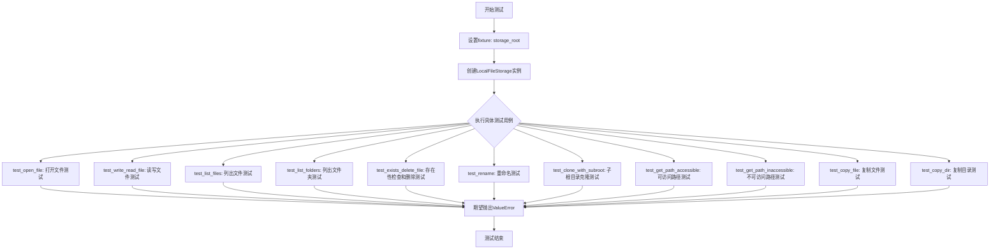

## 类结构

```
FileStorageConfiguration (配置类)
LocalFileStorage (存储类)
```

## 全局变量及字段


### `_ACCESSIBLE_PATHS`
    
允许访问的路径列表，用于测试文件存储的安全边界检查

类型：`List[Path]`
    


### `_INACCESSIBLE_PATHS`
    
禁止访问的路径列表，包含试图突破工作区限制的路径

类型：`List[Path]`
    


### `_TEST_FILES`
    
测试用文件路径列表，用于文件操作测试的样本数据

类型：`List[Path]`
    


### `_TEST_DIRS`
    
测试用目录路径列表，用于目录创建和删除操作的样本数据

类型：`List[Path]`
    


### `FileStorageConfiguration.root`
    
文件存储的根目录路径，指定文件操作的基准位置

类型：`Path`
    


### `FileStorageConfiguration.restrict_to_root`
    
是否限制文件操作在根目录内，防止路径遍历攻击

类型：`bool`
    
    

## 全局函数及方法


### `storage_root`

这是一个pytest fixture函数，用于创建一个测试用的存储根目录路径。它接受pytest内置的tmp_path fixture作为参数，并返回该临时目录下的"data"子目录路径，供后续的LocalFileStorage测试使用。

参数：

- `tmp_path`：`Path`，pytest内置的fixture，提供一个唯一的临时目录对象，用于隔离测试环境

返回值：`Path`，指向临时目录下的"data"子目录路径，用于配置LocalFileStorage的根目录

#### 流程图

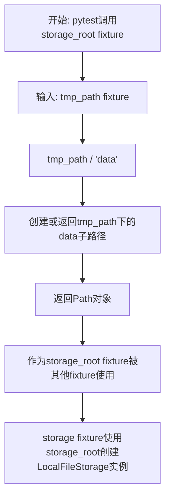

#### 带注释源码

```python
@pytest.fixture()
def storage_root(tmp_path):
    """
    创建测试用的存储根目录fixture
    
    参数:
        tmp_path: pytest内置fixture，提供临时目录路径
                 每次测试调用时都会创建全新的临时目录
    
    返回值:
        Path对象，指向临时目录下的data子目录
        例如: /tmp/pytest-xxx/data
    
    用途:
        为LocalFileStorage提供隔离的根目录，确保测试不会
        影响真实的文件系统，同时满足restrict_to_root的限制
    """
    return tmp_path / "data"
```


### `storage`

这是一个 pytest fixture，用于创建并返回一个配置好的 `LocalFileStorage` 实例，以便在测试中使用。该 fixture 依赖 `storage_root` fixture 提供的临时目录路径，并使用 `FileStorageConfiguration` 配置存储行为，包括根目录限制。

参数：

-  `storage_root`：`Path`，从 `storage_root` fixture 获得的临时存储根目录路径（`tmp_path / "data"`）

返回值：`LocalFileStorage`，配置完成的本地文件存储实例

#### 流程图

```mermaid
flowchart TD
    A[开始: storage fixture] --> B[接收storage_root参数<br/>类型: Path<br/>值: tmp_path / "data"]
    B --> C[创建FileStorageConfiguration对象<br/>root=storage_root<br/>restrict_to_root=True]
    C --> D[实例化LocalFileStorage<br/>传入配置对象]
    D --> E[返回storage实例<br/>类型: LocalFileStorage]
    
    F[storage_root fixture] -->|提供| B
    G[LocalFileStorage类] -->|实例化| D
    H[FileStorageConfiguration类] -->|配置| C
```

#### 带注释源码

```python
@pytest.fixture()
def storage(storage_root):
    """
    pytest fixture: 创建配置好的 LocalFileStorage 实例用于测试
    
    参数:
        storage_root: 从 storage_root fixture 获得的临时目录路径 (tmp_path / "data")
    
    返回:
        LocalFileStorage: 配置完成的本地文件存储实例，限制在 root 目录内
    """
    # 使用 storage_root 作为根目录，restrict_to_root=True 限制文件操作在根目录内
    return LocalFileStorage(
        FileStorageConfiguration(root=storage_root, restrict_to_root=True)
    )
```


我将分析提供的代码，提取关键的函数并生成详细的设计文档。这段代码是一个测试文件，测试LocalFileStorage类的功能。我将选取几个核心的测试函数进行文档化。


### `test_open_file`

测试打开并读取文件的完整流程，验证LocalFileStorage类能否正确创建目录、写入文件、读取文件内容并删除文件。

参数：

- `file_path`：`Path`，要操作的文件路径
- `content`：`str`，文件内容
- `storage`：`LocalFileStorage`，文件存储实例

返回值：`None`，此测试函数无返回值，通过assert断言验证功能

#### 流程图

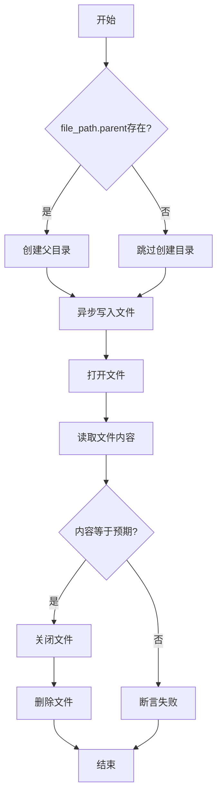

#### 带注释源码

```python
@pytest.mark.asyncio
async def test_open_file(file_path: Path, content: str, storage: LocalFileStorage):
    """测试文件打开、读取、写入和删除的完整流程"""
    # 如果文件路径有父目录，先创建父目录
    if file_path.parent:
        storage.make_dir(file_path.parent)
    
    # 异步写入文件内容
    await storage.write_file(file_path, content)
    
    # 打开文件并读取内容
    file = storage.open_file(file_path)
    assert file.read() == content  # 验证读取的内容与写入内容一致
    file.close()  # 关闭文件句柄
    
    # 删除测试文件，清理环境
    storage.delete_file(file_path)
```

---

### `test_write_read_file`

测试文件的异步写入和同步读取功能。

参数：

- `content`：`str`，要写入的文件内容
- `storage`：`LocalFileStorage`，文件存储实例

返回值：`None`，通过assert断言验证读写一致性

#### 流程图

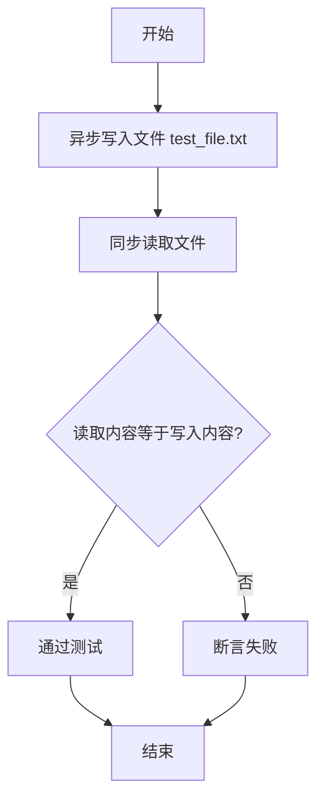

#### 带注释源码

```python
@pytest.mark.asyncio
async def test_write_read_file(content: str, storage: LocalFileStorage):
    """测试文件写入和读取的基本功能"""
    # 异步写入文件
    await storage.write_file("test_file.txt", content)
    
    # 同步读取并验证内容
    assert storage.read_file("test_file.txt") == content
```

---

### `test_list_files`

测试列出文件的功能，支持递归和非递归模式。

参数：

- `content`：`str`，测试文件内容
- `storage`：`LocalFileStorage`，文件存储实例

返回值：`None`，通过assert验证文件列表正确性

#### 流程图

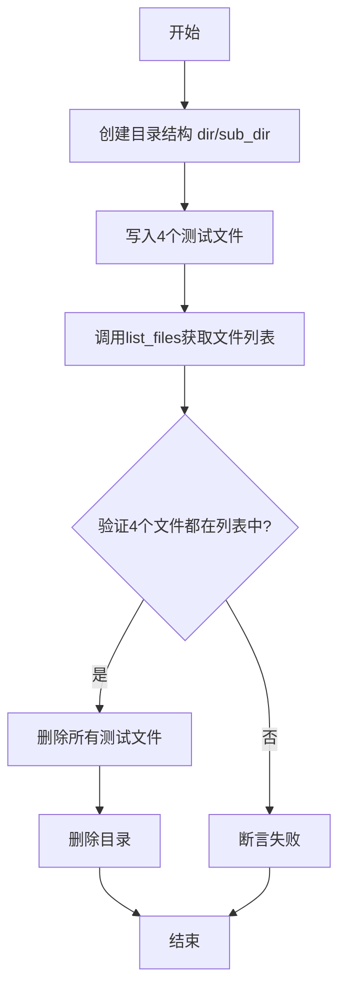

#### 带注释源码

```python
@pytest.mark.asyncio
async def test_list_files(content: str, storage: LocalFileStorage):
    """测试列出文件功能，包括目录层级结构"""
    # 创建目录结构
    storage.make_dir("dir")
    storage.make_dir("dir/sub_dir")
    
    # 写入多个测试文件到不同目录
    await storage.write_file("test_file.txt", content)
    await storage.write_file("dir/test_file.txt", content)
    await storage.write_file("dir/test_file2.txt", content)
    await storage.write_file("dir/sub_dir/test_file.txt", content)
    
    # 获取文件列表并验证
    files = storage.list_files()
    assert Path("test_file.txt") in files
    assert Path("dir/test_file.txt") in files
    assert Path("dir/test_file2.txt") in files
    assert Path("dir/sub_dir/test_file.txt") in files
    
    # 清理测试文件和目录
    storage.delete_file("test_file.txt")
    storage.delete_file("dir/test_file.txt")
    storage.delete_file("dir/test_file2.txt")
    storage.delete_file("dir/sub_dir/test_file.txt")
    storage.delete_dir("dir/sub_dir")
    storage.delete_dir("dir")
```

---

### `test_copy_file`

测试文件复制功能，包括复制到根目录和子目录。

参数：

- `storage`：`LocalFileStorage`，文件存储实例

返回值：`None`，通过assert验证复制后内容一致

#### 流程图

```mermaid
flowchart TD
    A[开始] --> B[写入源文件 test_file.txt]
    B --> C[复制到根目录 test_file_copy.txt]
    C --> D[创建子目录 dir]
    D --> E[复制到子目录 dir/test_file_copy.txt]
    E --> F{验证两个副本内容都是 test content?]
    F -->|是| G[结束]
    F -->|否| H[断言失败]
    G --> H
```

#### 带注释源码

```python
@pytest.mark.asyncio
async def test_copy_file(storage: LocalFileStorage):
    """测试文件复制功能，包括单层和多层目录"""
    # 写入源文件
    await storage.write_file("test_file.txt", "test content")
    
    # 复制文件到根目录
    storage.copy("test_file.txt", "test_file_copy.txt")
    
    # 创建子目录并复制文件
    storage.make_dir("dir")
    storage.copy("test_file.txt", "dir/test_file_copy.txt")
    
    # 验证复制后的文件内容
    assert storage.read_file("test_file_copy.txt") == "test content"
    assert storage.read_file("dir/test_file_copy.txt") == "test content"
```

---

### `test_get_path_accessible`

测试路径访问权限验证功能，确保可访问路径返回绝对路径且在根目录内。

参数：

- `accessible_path`：`Path`，可访问的路径（由fixture参数化提供）
- `storage`：`LocalFileStorage`，文件存储实例

返回值：`None`，通过assert验证路径有效性

#### 流程图

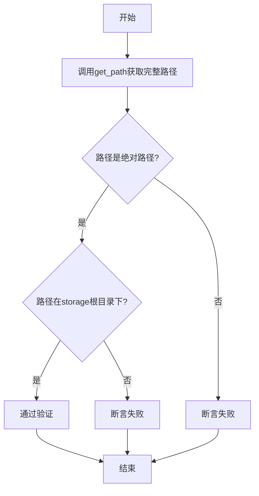

#### 带注释源码

```python
def test_get_path_accessible(accessible_path: Path, storage: LocalFileStorage):
    """测试路径访问权限验证 - 可访问路径"""
    # 获取完整路径
    full_path = storage.get_path(accessible_path)
    
    # 验证路径是绝对路径
    assert full_path.is_absolute()
    
    # 验证路径在storage根目录下（安全检查）
    assert full_path.is_relative_to(storage.root)
```

---

### `test_get_path_inaccessible`

测试路径访问权限验证功能，确保不可访问路径抛出ValueError异常。

参数：

- `inaccessible_path`：`Path`，不可访问的路径（由fixture参数化提供）
- `storage`：`LocalFileStorage`，文件存储实例

返回值：`None`，通过pytest.raises验证异常抛出

#### 流程图

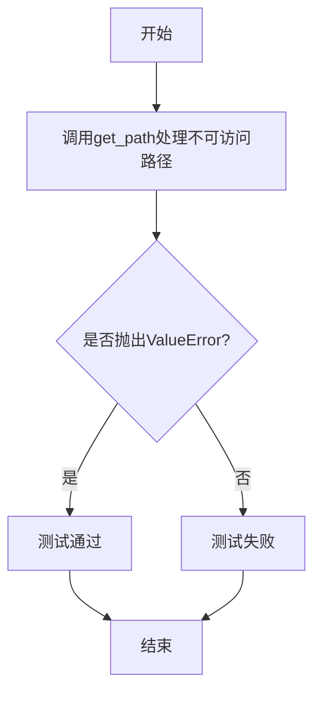

#### 带注释源码

```python
def test_get_path_inaccessible(inaccessible_path: Path, storage: LocalFileStorage):
    """测试路径访问权限验证 - 不可访问路径"""
    # 使用pytest.raises验证应该抛出ValueError异常
    with pytest.raises(ValueError):
        storage.get_path(inaccessible_path)
```

---

## 全局变量和Fixture

### 全局变量

- `_ACCESSIBLE_PATHS`：List[Path]，可访问的路径列表，用于测试路径验证
- `_INACCESSIBLE_PATHS`：List[Path]，不可访问的路径列表，包括越界路径、包含空字节的路径和绝对路径
- `_TEST_FILES`：List[Path]，测试用的文件路径列表
- `_TEST_DIRS`：List[Path]，测试用的目录路径列表

### Fixture

- `storage_root`：返回临时目录下的data子目录作为存储根目录
- `storage`：创建配置了root和restrict_to_root的LocalFileStorage实例
- `content`：返回测试内容字符串"test content"
- `accessible_path`：参数化fixture，提供所有可访问路径
- `inaccessible_path`：参数化fixture，提供所有不可访问路径
- `file_path`：参数化fixture，提供所有测试文件路径

---

## 关键组件信息

1. **LocalFileStorage**：本地文件存储类，提供文件操作接口
2. **FileStorageConfiguration**：文件存储配置类，包含root和restrict_to_root配置
3. **路径验证机制**：防止路径穿越攻击，确保文件操作在允许的根目录内

---

## 技术债务和优化空间

1. 测试中没有异常处理和错误场景的详细测试
2. 缺少对大文件操作的性能测试
3. 并发写入同一文件的场景未被测试
4. 测试清理逻辑可以改进，使用teardown或pytest的fixture清理机制

---

## 其它项目

### 设计目标与约束
- 安全目标：防止路径穿越攻击，限制文件操作在指定根目录内
- 功能目标：提供异步文件写入、同步读取、目录管理、文件复制等基本功能

### 错误处理与异常设计
- 不可访问路径抛出ValueError异常
- 文件不存在时exists返回False
- 路径验证失败时拒绝操作

### 数据流与状态机
- 文件写入流程：创建目录 → 异步写入 → 验证
- 文件读取流程：打开文件 → 读取内容 → 关闭
- 目录管理：创建目录 → 验证存在 → 删除清理

### 外部依赖
- pytest：测试框架
- pathlib.Path：路径处理
- .local模块：LocalFileStorage和FileStorageConfiguration类


### `accessible_path`

这是一个 pytest fixture，用于参数化测试，返回可访问的路径。该 fixture 结合 `@pytest.fixture(params=_ACCESSIBLE_PATHS)` 装饰器使用，遍历 `_ACCESSIBLE_PATHS` 列表中的所有路径，为每个测试用例提供不同的可访问路径参数。

参数：

-  `request`：`pytest.FixtureRequest`，pytest 框架的 fixture 请求对象，用于访问参数化数据

返回值：`Path`，返回 `_ACCESSIBLE_PATHS` 列表中的一个 `Path` 对象，表示一个可访问的文件系统路径

#### 流程图

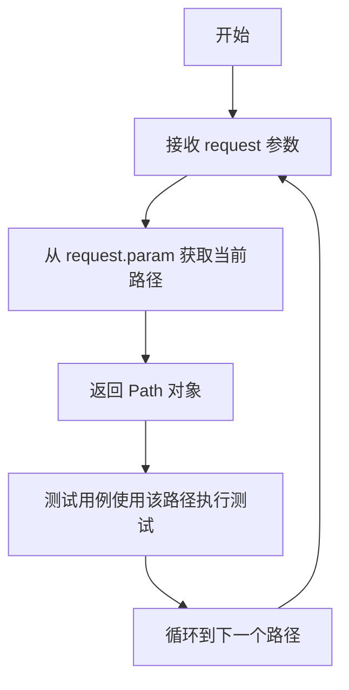

#### 带注释源码

```python
@pytest.fixture(params=_ACCESSIBLE_PATHS)
def accessible_path(request):
    """
    pytest fixture: accessible_path
    
    使用 params 参数化装饰器，将 _ACCESSIBLE_PATHS 列表中的每个路径
    作为独立的测试参数传递给测试函数。
    
    参数:
        request: pytest.FixtureRequest 对象，pytest 自动注入
                包含当前参数化迭代的信息
    
    返回值:
        Path: _ACCESSIBLE_PATHS 列表中的当前迭代路径
    
    使用示例:
        def test_get_path_accessible(accessible_path: Path, storage: LocalFileStorage):
            full_path = storage.get_path(accessible_path)
            assert full_path.is_absolute()
            assert full_path.is_relative_to(storage.root)
    """
    return request.param
```

#### 关联数据说明

`_ACCESSIBLE_PATHS` 全局变量：

-  **名称**：`_ACCESSIBLE_PATHS`
-  **类型**：`list[Path]`
-  **描述**：定义了一系列允许访问的文件系统路径，包括当前目录、测试文件、测试文件夹及其嵌套路径，用于测试文件存储的安全访问机制


### `inaccessible_path` (pytest fixture)

这是一个 pytest fixture，用于参数化测试中不可访问的路径。它从 `_INACCESSIBLE_PATHS` 中获取值，供给测试用例使用。

参数：

- `request`：`pytest.FixtureRequest`，pytest 框架的请求对象，用于访问参数化数据

返回值：`Path`，返回一个不可访问的路径（Path 对象）

#### 流程图

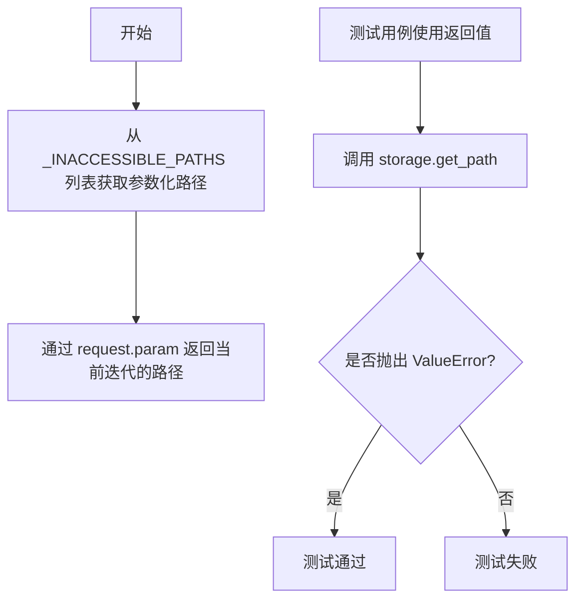

#### 带注释源码

```python
@pytest.fixture(params=_INACCESSIBLE_PATHS)
def inaccessible_path(request):
    """
    pytest fixture，参数化不可访问的路径
    
    该 fixture 使用 _INACCESSIBLE_PATHS 中的所有路径进行参数化，
    每个路径会在测试中作为单独的执行用例使用
    
    参数:
        request: pytest.FixtureRequest 对象，由 pytest 框架自动注入
                 包含当前参数化迭代的信息
    
    返回值:
        Path: 一个不可访问的路径，用于测试 LocalFileStorage 的路径安全限制
              包括：越界路径、包含空字节的路径、绝对路径等
    """
    return request.param
```

---

### `_INACCESSIBLE_PATHS` (全局变量)

这是一个全局常量，定义了所有不可访问的路径集合，用于测试文件存储的安全性验证。

变量名称：`_INACCESSIBLE_PATHS`

类型：`tuple[Path, ...]`（Path 对象的元组）

描述：包含三类不可访问的路径：
1. **越界路径** - 会超出工作空间的路径（如 `..`、`../test_file.txt` 等）
2. **包含空字节的路径** - 路径中包含 `\0` 字符（如 `Path("\0")`）
3. **绝对路径** - 绝对文件系统路径（如 `/`、`/test_file.txt` 等）

#### 带注释源码

```python
_INACCESSIBLE_PATHS = (
    [
        # 第一类：越界路径（ Takes us out of the workspace ）
        # 这些路径会尝试访问工作空间之外的目录
        Path(".."),
        Path("../test_file.txt"),
        Path("../not_auto_gpt_workspace"),
        Path("../not_auto_gpt_workspace/test_file.txt"),
        Path("test_folder/../.."),
        Path("test_folder/../../test_file.txt"),
        Path("test_folder/../../not_auto_gpt_workspace"),
        Path("test_folder/../../not_auto_gpt_workspace/test_file.txt"),
    ]
    + [
        # 第二类：包含空字节的路径（ Contains null byte ）
        # 空字节在文件系统中是非法字符，用于防止路径注入攻击
        Path("\0"),
        Path("\0test_file.txt"),
        Path("test_folder/\0"),
        Path("test_folder/\0test_file.txt"),
    ]
    + [
        # 第三类：绝对路径（ Absolute paths ）
        # 绝对路径可能指向系统任意位置，存在安全风险
        Path("/"),
        Path("/test_file.txt"),
        Path("/home"),
    ]
)
```

---

### `test_get_path_inaccessible` (测试函数)

这是一个 pytest 测试函数，用于验证 LocalFileStorage 的 `get_path` 方法在处理不可访问路径时能正确抛出 `ValueError` 异常。

参数：

- `inaccessible_path`：`Path`，从 `inaccessible_path` fixture 获取的不可访问路径
- `storage`：`LocalFileStorage`，从 `storage` fixture 获取的本地文件存储实例

返回值：无（测试函数）

#### 流程图

```mermaid
flowchart TD
    A[开始测试] --> B[接收 inaccessible_path 和 storage]
    B --> C[调用 storage.get_path(inaccessible_path)]
    C --> D{是否抛出 ValueError?}
    D -->|是| E[测试通过 - 路径安全限制生效]
    D -->|否| F[测试失败 - 期望抛出异常但未抛出]
```

#### 带注释源码

```python
def test_get_path_inaccessible(inaccessible_path: Path, storage: LocalFileStorage):
    """
    测试不可访问路径会被正确拒绝
    
    该测试验证 LocalFileStorage 的路径安全限制功能：
    - 当传入不可访问的路径时，get_path 方法应抛出 ValueError
    - 不可访问路径包括：越界路径、包含空字节的路径、绝对路径
    
    参数:
        inaccessible_path: Path 对象，来自 inaccessible_path fixture
                          包含各类不可访问的路径
        storage: LocalFileStorage 实例，来自 storage fixture
                配置了 restrict_to_root=True 的文件存储
    
    断言:
        期望 storage.get_path(inaccessible_path) 抛出 ValueError
    
    返回:
        无（pytest 测试函数）
    """
    with pytest.raises(ValueError):
        storage.get_path(inaccessible_path)
```


### `test_open_file`

该测试函数验证 LocalFileStorage 的文件打开功能，包括创建目录、写入内容、打开文件读取并验证内容一致性，最后清理测试文件。

参数：

- `file_path`：`Path`，测试使用的文件路径
- `content`：`str`，要写入文件的测试内容
- `storage`：`LocalFileStorage`，本地文件存储实例

返回值：无（测试函数）

#### 流程图

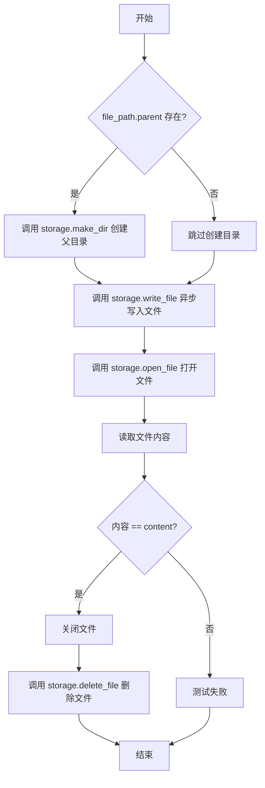

#### 带注释源码

```python
@pytest.mark.asyncio
async def test_open_file(file_path: Path, content: str, storage: LocalFileStorage):
    """
    测试打开文件功能
    1. 如果文件有父目录，先创建目录
    2. 异步写入内容到文件
    3. 打开文件并读取内容
    4. 验证读取的内容与写入的内容一致
    5. 关闭文件
    6. 删除测试文件
    """
    if file_path.parent:  # 检查文件是否有父目录
        storage.make_dir(file_path.parent)  # 创建必要的父目录
    await storage.write_file(file_path, content)  # 异步写入文件内容
    file = storage.open_file(file_path)  # 打开文件获取文件对象
    assert file.read() == content  # 断言读取内容与写入内容一致
    file.close()  # 关闭文件释放资源
    storage.delete_file(file_path)  # 清理测试文件
```

---

### `test_write_read_file`

该测试函数验证 LocalFileStorage 的基本文件写入和读取功能，确保写入的内容能够被正确读取。

参数：

- `content`：`str`，要写入文件的测试内容
- `storage`：`LocalFileStorage`，本地文件存储实例

返回值：无（测试函数）

#### 流程图

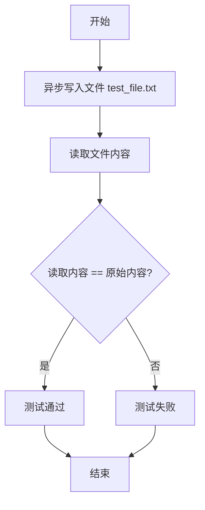

#### 带注释源码

```python
@pytest.mark.asyncio
async def test_write_read_file(content: str, storage: LocalFileStorage):
    """
    测试文件写入和读取功能
    1. 异步写入内容到 test_file.txt
    2. 读取文件内容
    3. 验证读取的内容与写入的内容一致
    """
    await storage.write_file("test_file.txt", content)  # 异步写入文件
    assert storage.read_file("test_file.txt") == content  # 读取并验证内容
```

---

### `test_list_files`

该测试函数验证 LocalFileStorage 的文件列表功能，包括单层目录和递归子目录中的文件列出，并确保所有测试文件都被正确列出。

参数：

- `content`：`str`，要写入文件的测试内容
- `storage`：`LocalFileStorage`，本地文件存储实例

返回值：无（测试函数）

#### 流程图

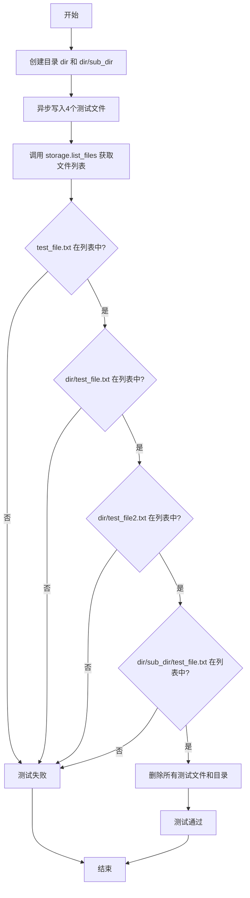

#### 带注释源码

```python
@pytest.mark.asyncio
async def test_list_files(content: str, storage: LocalFileStorage):
    """
    测试列出文件功能
    1. 创建测试目录结构
    2. 在不同目录写入测试文件
    3. 调用 list_files 获取所有文件
    4. 验证各个文件都在列表中
    5. 清理测试文件和目录
    """
    storage.make_dir("dir")  # 创建顶层目录
    storage.make_dir("dir/sub_dir")  # 创建子目录
    await storage.write_file("test_file.txt", content)  # 根目录文件
    await storage.write_file("dir/test_file.txt", content)  # 子目录文件
    await storage.write_file("dir/test_file2.txt", content)  # 子目录另一个文件
    await storage.write_file("dir/sub_dir/test_file.txt", content)  # 深层子目录文件
    files = storage.list_files()  # 获取文件列表
    # 验证所有文件都被正确列出
    assert Path("test_file.txt") in files
    assert Path("dir/test_file.txt") in files
    assert Path("dir/test_file2.txt") in files
    assert Path("dir/sub_dir/test_file.txt") in files
    # 清理测试环境
    storage.delete_file("test_file.txt")
    storage.delete_file("dir/test_file.txt")
    storage.delete_file("dir/test_file2.txt")
    storage.delete_file("dir/sub_dir/test_file.txt")
    storage.delete_dir("dir/sub_dir")
    storage.delete_dir("dir")
```

---

### `test_list_folders`

该测试函数验证 LocalFileStorage 的文件夹列表功能，分别测试非递归和递归模式下的文件夹列出结果。

参数：

- `content`：`str`，要写入文件的测试内容
- `storage`：`LocalFileStorage`，本地文件存储实例

返回值：无（测试函数）

#### 流程图

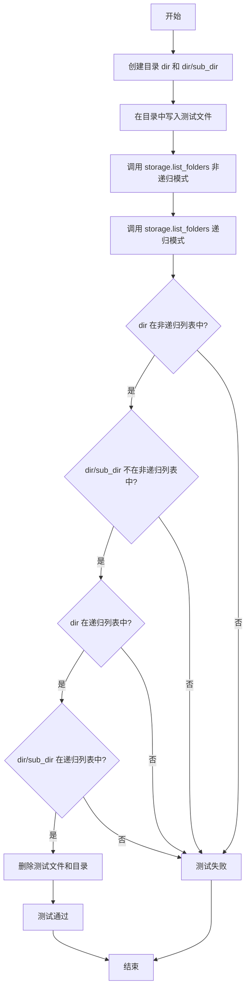

#### 带注释源码

```python
@pytest.mark.asyncio
async def test_list_folders(content: str, storage: LocalFileStorage):
    """
    测试列出文件夹功能
    1. 创建测试目录结构
    2. 在目录中写入文件
    3. 分别使用非递归和递归模式列出文件夹
    4. 验证两种模式的结果差异
    5. 清理测试环境
    """
    storage.make_dir("dir")  # 创建目录
    storage.make_dir("dir/sub_dir")  # 创建子目录
    await storage.write_file("dir/test_file.txt", content)
    await storage.write_file("dir/sub_dir/test_file.txt", content)
    folders = storage.list_folders(recursive=False)  # 非递归模式
    folders_recursive = storage.list_folders(recursive=True)  # 递归模式
    # 验证非递归模式只包含直接子目录
    assert Path("dir") in folders
    assert Path("dir/sub_dir") not in folders
    # 验证递归模式包含所有子目录
    assert Path("dir") in folders_recursive
    assert Path("dir/sub_dir") in folders_recursive
    # 清理
    storage.delete_file("dir/test_file.txt")
    storage.delete_file("dir/sub_dir/test_file.txt")
    storage.delete_dir("dir/sub_dir")
    storage.delete_dir("dir")
```

---

### `test_exists_delete_file`

该测试函数验证 LocalFileStorage 的文件存在性检查和文件删除功能，确保删除后文件不再存在。

参数：

- `file_path`：`Path`，测试使用的文件路径
- `content`：`str`，要写入文件的测试内容
- `storage`：`LocalFileStorage`，本地文件存储实例

返回值：无（测试函数）

#### 流程图

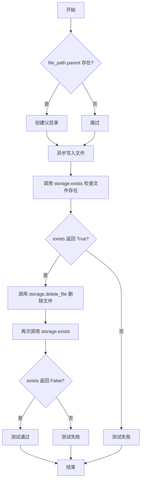

#### 带注释源码

```python
@pytest.mark.asyncio
async def test_exists_delete_file(
    file_path: Path, content: str, storage: LocalFileStorage
):
    """
    测试文件存在性检查和删除功能
    1. 创建必要的父目录
    2. 写入测试文件
    3. 验证文件存在
    4. 删除文件
    5. 验证文件不再存在
    """
    if file_path.parent:  # 检查是否有父目录
        storage.make_dir(file_path.parent)  # 创建父目录
    await storage.write_file(file_path, content)  # 写入文件
    assert storage.exists(file_path)  # 验证文件存在
    storage.delete_file(file_path)  # 删除文件
    assert not storage.exists(file_path)  # 验证文件已被删除
```

---

### `test_rename`

该测试函数验证 LocalFileStorage 的文件重命名功能，确保重命名后原文件不存在而新文件存在。

参数：

- `file_path`：`Path`，测试使用的文件路径
- `content`：`str`，要写入文件的测试内容
- `storage`：`LocalFileStorage`，本地文件存储实例

返回值：无（测试函数）

#### 流程图

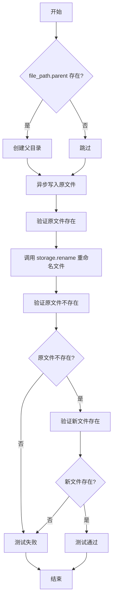

#### 带注释源码

```python
@pytest.mark.asyncio
async def test_rename(file_path: Path, content: str, storage: LocalFileStorage):
    """
    测试文件重命名功能
    1. 创建必要的父目录
    2. 写入测试文件
    3. 验证原文件存在
    4. 重命名文件
    5. 验证原文件不存在且新文件存在
    """
    if file_path.parent:  # 检查是否有父目录
        storage.make_dir(file_path.parent)  # 创建父目录
    await storage.write_file(file_path, content)  # 写入原文件
    assert storage.exists(file_path)  # 验证原文件存在
    storage.rename(file_path, Path(str(file_path) + "_renamed"))  # 重命名文件
    assert not storage.exists(file_path)  # 验证原文件不存在
    assert storage.exists(Path(str(file_path) + "_renamed"))  # 验证新文件存在
```

---

### `test_clone_with_subroot`

该测试函数验证 LocalFileStorage 的子根目录克隆功能，确保克隆后的存储实例具有正确的根路径。

参数：

- `storage`：`LocalFileStorage`，本地文件存储实例

返回值：无（测试函数）

#### 流程图

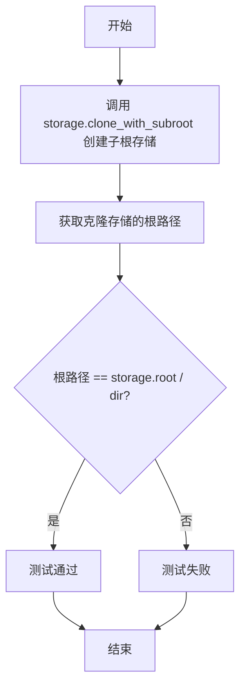

#### 带注释源码

```python
def test_clone_with_subroot(storage: LocalFileStorage):
    """
    测试克隆子根目录功能
    1. 使用 clone_with_subroot 创建子根目录的存储实例
    2. 验证克隆后的根路径是原根路径的子目录
    """
    subroot = storage.clone_with_subroot("dir")  # 克隆子根目录
    assert subroot.root == storage.root / "dir"  # 验证根路径正确
```

---

### `test_get_path_accessible`

该测试函数验证 LocalFileStorage 的路径访问控制功能，确保可访问的路径返回绝对路径且在根目录内。

参数：

- `accessible_path`：`Path`，可访问的测试路径
- `storage`：`LocalFileStorage`，本地文件存储实例

返回值：无（测试函数）

#### 流程图

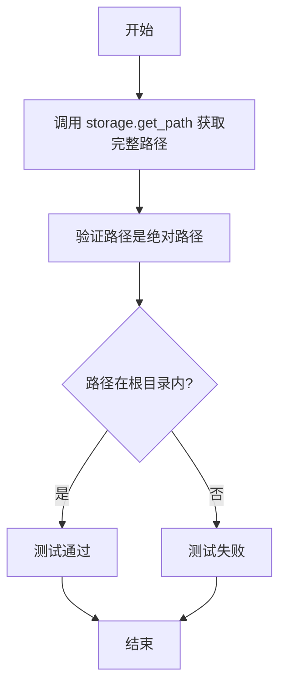

#### 带注释源码

```python
def test_get_path_accessible(accessible_path: Path, storage: LocalFileStorage):
    """
    测试获取可访问路径功能
    1. 调用 get_path 获取完整路径
    2. 验证路径是绝对路径
    3. 验证路径在根目录范围内
    """
    full_path = storage.get_path(accessible_path)  # 获取完整路径
    assert full_path.is_absolute()  # 验证是绝对路径
    assert full_path.is_relative_to(storage.root)  # 验证在根目录内
```

---

### `test_get_path_inaccessible`

该测试函数验证 LocalFileStorage 的路径访问控制功能，确保不可访问的路径会抛出 ValueError 异常。

参数：

- `inaccessible_path`：`Path`，不可访问的测试路径
- `storage`：`LocalFileStorage`，本地文件存储实例

返回值：无（测试函数）

#### 流程图

```mermaid
flowchart TD
    A[开始] --> B[调用 storage.get_path 获取路径]
    B --> C{是否抛出 ValueError?}
    C -->|是| D[测试通过]
    C -->|否| E[测试失败]
    D --> F[结束]
    E --> F
```

#### 带注释源码

```python
def test_get_path_inaccessible(inaccessible_path: Path, storage: LocalFileStorage):
    """
    测试获取不可访问路径会抛出异常
    1. 调用 get_path 尝试获取不可访问的路径
    2. 验证抛出 ValueError 异常
    """
    with pytest.raises(ValueError):  # 预期抛出 ValueError
        storage.get_path(inaccessible_path)
```

---

### `test_copy_file`

该测试函数验证 LocalFileStorage 的文件复制功能，包括单层目录和子目录中的文件复制，确保复制后的文件内容一致。

参数：

- `storage`：`LocalFileStorage`，本地文件存储实例

返回值：无（测试函数）

#### 流程图

```mermaid
flowchart TD
    A[开始] --> B[异步写入测试文件]
    B --> C[复制文件到根目录]
    C --> D[创建子目录 dir]
    D --> E[复制文件到子目录]
    E --> F[验证根目录复制文件内容]
    F --> G{内容 == test content?}
    G -->|是| H[验证子目录复制文件内容]
    G -->|否| I[测试失败]
    H --> J{内容 == test content?}
    J -->|是| K[测试通过]
    J -->|否| I
    K --> L[结束]
    I --> L
```

#### 带注释源码

```python
@pytest.mark.asyncio
async def test_copy_file(storage: LocalFileStorage):
    """
    测试文件复制功能
    1. 写入测试文件
    2. 复制文件到根目录
    3. 创建子目录并复制文件到子目录
    4. 验证两个复制的文件内容都与原内容一致
    """
    await storage.write_file("test_file.txt", "test content")  # 写入原文件
    storage.copy("test_file.txt", "test_file_copy.txt")  # 复制到根目录
    storage.make_dir("dir")  # 创建子目录
    storage.copy("test_file.txt", "dir/test_file_copy.txt")  # 复制到子目录
    # 验证复制结果
    assert storage.read_file("test_file_copy.txt") == "test content"
    assert storage.read_file("dir/test_file_copy.txt") == "test content"
```

---

### `test_copy_dir`

该测试函数验证 LocalFileStorage 的目录复制功能，确保整个目录结构及其内部文件都被正确复制。

参数：

- `storage`：`LocalFileStorage`，本地文件存储实例

返回值：无（测试函数）

#### 流程图

```mermaid
flowchart TD
    A[开始] --> B[创建目录 dir 和 dir/sub_dir]
    B --> C[在目录中写入测试文件]
    C --> D[调用 storage.copy 复制整个目录]
    D --> E[验证复制目录中的文件内容]
    E --> F{内容 == test content?}
    F -->|是| G[验证子目录文件内容]
    G --> H{内容 == test content?}
    H -->|是| I[测试通过]
    H -->|否| J[测试失败]
    F -->|否| J
    I --> K[结束]
    J --> K
```

#### 带注释源码

```python
@pytest.mark.asyncio
async def test_copy_dir(storage: LocalFileStorage):
    """
    测试目录复制功能
    1. 创建嵌套目录结构
    2. 在目录中写入测试文件
    3. 复制整个目录
    4. 验证复制的目录中的文件内容正确
    """
    storage.make_dir("dir")  # 创建目录
    storage.make_dir("dir/sub_dir")  # 创建子目录
    await storage.write_file("dir/test_file.txt", "test content")  # 写入文件
    await storage.write_file("dir/sub_dir/test_file.txt", "test content")  # 写入子目录文件
    storage.copy("dir", "dir_copy")  # 复制整个目录
    # 验证复制结果
    assert storage.read_file("dir_copy/test_file.txt") == "test content"
    assert storage.read_file("dir_copy/sub_dir/test_file.txt") == "test content"
```

---

### 关键组件信息

| 组件名称 | 一句话描述 |
|---------|-----------|
| `LocalFileStorage` | 本地文件系统存储类，提供文件/目录的CRUD操作 |
| `FileStorageConfiguration` | 文件存储配置类，包含根目录和访问限制设置 |
| `_ACCESSIBLE_PATHS` | 可访问路径列表，用于测试路径访问控制 |
| `_INACCESSIBLE_PATHS` | 不可访问路径列表，包含越界、空字节、绝对路径等 |
| `_TEST_FILES` | 测试文件路径列表 |
| `_TEST_DIRS` | 测试目录路径列表 |

---

### 潜在的技术债务或优化空间

1. **重复的清理代码**：多个测试函数中都有重复的文件和目录清理代码，可以考虑使用 fixture 的 teardown 或 pytest 的 cleanup 机制。
2. **参数化测试的边界覆盖**：虽然使用了 `parametrize` 覆盖了多种路径场景，但未覆盖符号链接等特殊文件系统对象。
3. **异步/同步方法混用**：部分方法如 `write_file` 是异步的，而 `read_file`、`delete_file` 等是同步的，API 一致性可以改进。
4. **测试隔离性**：某些测试依赖特定的前置状态（如 `test_list_files` 创建的目录结构），可能存在隐式依赖。

---

### 其它项目

#### 设计目标与约束

- **安全约束**：通过 `restrict_to_root=True` 限制文件操作在指定根目录内，防止目录遍历攻击。
- **路径验证**：实现了多层路径验证，包括越界检查、空字节过滤、绝对路径限制。

#### 错误处理与异常设计

- 不可访问路径会抛出 `ValueError` 异常。
- 路径访问控制通过 `get_path` 方法统一处理。

#### 数据流与状态机

- 文件操作流程：写入 → 读取/操作 → 验证 → 清理。
- 目录操作支持递归和非递归两种模式。

#### 外部依赖与接口契约

- 依赖 `pytest` 框架进行测试。
- 依赖 `pathlib.Path` 进行路径操作。
- `LocalFileStorage` 和 `FileStorageConfiguration` 定义在 `.local` 模块中。


### `test_make_delete_dir`

该函数是一个 pytest fixture，用于测试 LocalFileStorage 的 `make_dir` 和 `delete_dir` 方法。通过参数化 `_TEST_DIRS` 中的目录路径，验证目录的创建、存在性检查和删除功能是否正常工作。

参数：

-  `request`：特殊 pytest 参数，用于接收参数化传入的目录路径（`Path` 类型）
-  `storage`：`LocalFileStorage`，注入的本地文件存储实例

返回值：`None`，作为 fixture 不返回具体值

#### 流程图

```mermaid
flowchart TD
    A[开始] --> B[接收参数化目录路径 request]
    B --> C[调用 storage.make_dir request 创建目录]
    D{检查目录是否存在}
    C --> D
    D -->|是| E[调用 storage.delete_dir request 删除目录]
    E --> F{检查目录是否已删除}
    F -->|是| G[结束 - 测试通过]
    F -->|否| H[抛出 AssertionError]
    D -->|否| H
```

#### 带注释源码

```python
@pytest.fixture(params=_TEST_DIRS)  # 参数化装饰器，_TEST_DIRS = [Path("dir"), Path("dir/sub_dir")]
def test_make_delete_dir(request, storage: LocalFileStorage):
    """
    测试 LocalFileStorage 的 make_dir 和 delete_dir 方法
    
    Args:
        request: 参数化传入的目录路径（Path 对象）
        storage: LocalFileStorage 实例
    
    Returns:
        None: 作为 fixture 不返回具体值
    """
    # 使用 storage 创建目录，目录路径由 request 参数提供
    storage.make_dir(request)
    
    # 断言目录创建成功，使用 exists 方法验证目录存在
    assert storage.exists(request)
    
    # 调用 delete_dir 方法删除目录
    storage.delete_dir(request)
    
    # 断言目录已删除，验证 exists 返回 False
    assert not storage.exists(request)
```


### `test_open_file`

该函数是一个异步测试用例，用于验证 `LocalFileStorage` 类的文件打开功能是否正常工作。它首先创建必要的目录结构，写入测试内容，然后打开文件读取并验证内容一致性，最后清理测试文件。

参数：
- `file_path`：`Path`，由 pytest fixture `file_path` 提供，表示要测试的文件路径。
- `content`：`str`，由 pytest fixture `content` 提供，表示要写入文件的测试内容。
- `storage`：`LocalFileStorage`，由 pytest fixture `storage` 提供，表示本地文件存储实例。

返回值：`None`，该函数为测试函数，没有返回值。

#### 流程图

```mermaid
flowchart TD
    A([开始]) --> B{file_path.parent 存在?}
    B -- 是 --> C[调用 storage.make_dir 创建目录]
    B -- 否 --> D[调用 await storage.write_file 写入内容]
    C --> D
    D --> E[调用 storage.open_file 打开文件]
    E --> F[调用 file.read 读取内容]
    F --> G{读取内容 == 写入内容?}
    G -- 是 --> H[调用 file.close 关闭文件]
    G -- 否 --> I[抛出 AssertionError 异常]
    I --> H
    H --> J[调用 storage.delete_file 删除文件]
    J --> K([结束])
```

#### 带注释源码

```python
@pytest.mark.asyncio  # 标记为异步测试函数
async def test_open_file(file_path: Path, content: str, storage: LocalFileStorage):
    # 检查文件路径的父目录是否存在，如果存在则创建目录结构
    if file_path.parent:
        storage.make_dir(file_path.parent)
    
    # 异步写入测试内容到指定文件
    await storage.write_file(file_path, content)
    
    # 使用 storage 的 open_file 方法打开文件，获取文件对象
    file = storage.open_file(file_path)
    
    # 读取文件内容，并断言其与写入的内容一致，验证文件打开和读取功能正常
    assert file.read() == content
    
    # 关闭文件句柄，释放资源
    file.close()
    
    # 删除测试文件，清理测试环境
    storage.delete_file(file_path)
```


### `test_write_read_file`

这是一个异步测试函数，用于验证 `LocalFileStorage` 类能否正确地将内容写入文件并读取回来，确保写入和读取的数据一致性。

参数：

- `content`：`str`，通过 fixture 提供的测试内容，用于写入文件和验证读取结果
- `storage`：`LocalFileStorage`，通过 fixture 提供的本地文件存储实例，已配置好根目录和访问限制

返回值：`None`，此测试函数无返回值，仅通过 `assert` 语句进行断言验证

#### 流程图

```mermaid
flowchart TD
    A[开始: test_write_read_file] --> B[调用 storage.write_file 写入文件]
    B --> C[调用 storage.read_file 读取文件]
    C --> D{读取内容 == 写入内容?}
    D -->|是| E[断言通过, 测试成功]
    D -->|否| F[断言失败, 抛出 AssertionError]
    E --> G[结束]
    F --> G
```

#### 带注释源码

```python
@pytest.mark.asyncio
async def test_write_read_file(content: str, storage: LocalFileStorage):
    """
    测试文件的写入和读取功能。
    
    参数:
        content: str - 要写入文件的测试内容
        storage: LocalFileStorage - 文件存储实例
    """
    # 步骤1: 调用异步方法 write_file 将内容写入 'test_file.txt'
    await storage.write_file("test_file.txt", content)
    
    # 步骤2: 同步读取刚才写入的文件内容
    # 步骤3: 断言读取的内容与写入的内容一致，验证写入/读取的正确性
    assert storage.read_file("test_file.txt") == content
```


### `test_list_files`

该测试函数用于验证 LocalFileStorage 类的 list_files 方法能否正确列出存储根目录下的所有文件（包括子目录中的文件），通过创建多个目录和文件，执行列表操作，然后验证结果，最后清理测试环境。

参数：

- `content`：`str`，测试用的文件内容
- `storage`：`LocalFileStorage`，LocalFileStorage 实例，用于执行文件操作

返回值：`None`，该函数为测试函数，无返回值，通过 pytest 断言验证功能

#### 流程图

```mermaid
graph TD
    A[开始测试] --> B[创建目录 dir]
    B --> C[创建目录 dir/sub_dir]
    C --> D[异步写入 test_file.txt]
    D --> E[异步写入 dir/test_file.txt]
    E --> F[异步写入 dir/test_file2.txt]
    F --> G[异步写入 dir/sub_dir/test_file.txt]
    G --> H[调用 storage.list_files 获取文件列表]
    H --> I{断言 Path<br/>test_file.txt in files}
    I --> J{断言 Path<br/>dir/test_file.txt in files}
    J --> K{断言 Path<br/>dir/test_file2.txt in files}
    K --> L{断言 Path<br/>dir/sub_dir/test_file.txt in files}
    L --> M[删除文件 test_file.txt]
    M --> N[删除文件 dir/test_file.txt]
    N --> O[删除文件 dir/test_file2.txt]
    O --> P[删除文件 dir/sub_dir/test_file.txt]
    P --> Q[删除目录 dir/sub_dir]
    Q --> R[删除目录 dir]
    R --> S[结束测试]
```

#### 带注释源码

```python
@pytest.mark.asyncio
async def test_list_files(content: str, storage: LocalFileStorage):
    """
    测试 list_files 方法能否正确列出所有文件
    
    参数:
        content: str - 测试用的文件内容
        storage: LocalFileStorage - 文件存储实例
    """
    # 创建测试所需的目录结构
    storage.make_dir("dir")  # 创建顶层目录 dir
    storage.make_dir("dir/sub_dir")  # 创建子目录 dir/sub_dir
    
    # 异步写入多个测试文件到不同目录
    await storage.write_file("test_file.txt", content)  # 根目录文件
    await storage.write_file("dir/test_file.txt", content)  # dir 目录文件
    await storage.write_file("dir/test_file2.txt", content)  # dir 目录第二个文件
    await storage.write_file("dir/sub_dir/test_file.txt", content)  # 子目录文件
    
    # 调用 list_files 获取所有文件列表
    files = storage.list_files()
    
    # 验证所有文件都被正确列出
    assert Path("test_file.txt") in files  # 断言根目录文件在列表中
    assert Path("dir/test_file.txt") in files  # 断言 dir 目录文件在列表中
    assert Path("dir/test_file2.txt") in files  # 断言 dir 目录第二个文件在列表中
    assert Path("dir/sub_dir/test_file.txt") in files  # 断言子目录文件在列表中
    
    # 清理测试文件
    storage.delete_file("test_file.txt")
    storage.delete_file("dir/test_file.txt")
    storage.delete_file("dir/test_file2.txt")
    storage.delete_file("dir/sub_dir/test_file.txt")
    
    # 清理测试目录
    storage.delete_dir("dir/sub_dir")
    storage.delete_dir("dir")
```


### `test_list_folders`

该测试函数用于验证 LocalFileStorage 类的 `list_folders` 方法，能够正确列出目录中的文件夹，并支持递归和非递归两种模式。

参数：

- `content`：`str`，测试用的文件内容，用于在测试目录中创建文件
- `storage`：`LocalFileStorage`，本地文件存储实例，提供文件操作接口

返回值：`None`，测试函数无返回值，通过断言验证功能正确性

#### 流程图

```mermaid
flowchart TD
    A[开始测试 test_list_folders] --> B[创建目录 dir]
    B --> C[创建子目录 dir/sub_dir]
    C --> D[写入文件 dir/test_file.txt]
    D --> E[写入文件 dir/sub_dir/test_file.txt]
    E --> F[调用 storage.list_folders recursive=False]
    F --> G[调用 storage.list_folders recursive=True]
    G --> H{断言: dir 在非递归结果中}
    H --> I{断言: dir/sub_dir 不在非递归结果中}
    I --> J{断言: dir 在递归结果中}
    J --> K{断言: dir/sub_dir 在递归结果中}
    K --> L[清理文件 dir/test_file.txt]
    L --> M[清理文件 dir/sub_dir/test_file.txt]
    M --> N[删除目录 dir/sub_dir]
    N --> O[删除目录 dir]
    O --> P[结束测试]
    
    style H fill:#90EE90
    style I fill:#90EE90
    style J fill:#90EE90
    style K fill:#90EE90
```

#### 带注释源码

```python
@pytest.mark.asyncio
async def test_list_folders(content: str, storage: LocalFileStorage):
    """
    测试 list_folders 方法是否能正确列出文件夹
    支持递归和非递归两种模式
    
    参数:
        content: str - 测试用的文件内容
        storage: LocalFileStorage - 本地文件存储实例
    """
    # 创建测试目录结构
    storage.make_dir("dir")  # 创建顶层目录
    storage.make_dir("dir/sub_dir")  # 创建子目录
    
    # 在目录中创建测试文件
    await storage.write_file("dir/test_file.txt", content)
    await storage.write_file("dir/sub_dir/test_file.txt", content)
    
    # 测试非递归模式 - 仅列出直接子目录
    folders = storage.list_folders(recursive=False)
    
    # 测试递归模式 - 列出所有层级的子目录
    folders_recursive = storage.list_folders(recursive=True)
    
    # 断言非递归模式结果
    # dir 是顶层目录，应该在结果中
    assert Path("dir") in folders
    # dir/sub_dir 是子目录，不应该在非递归结果中
    assert Path("dir/sub_dir") not in folders
    
    # 断言递归模式结果
    # dir 应该在结果中
    assert Path("dir") in folders_recursive
    # dir/sub_dir 应该在结果中
    assert Path("dir/sub_dir") in folders_recursive
    
    # 清理测试文件和目录
    storage.delete_file("dir/test_file.txt")
    storage.delete_file("dir/sub_dir/test_file.txt")
    storage.delete_dir("dir/sub_dir")
    storage.delete_dir("dir")
```


### `test_exists_delete_file`

该测试函数用于验证 LocalFileStorage 的文件存在性检查和文件删除功能。测试流程包括：创建必要的父目录、写入文件、验证文件存在、删除文件、最后验证文件已被成功删除。

参数：

- `file_path`：`Path`，测试使用的文件路径
- `content`：`str`，写入文件的内容
- `storage`：`LocalFileStorage`，本地文件存储实例

返回值：`None`，该测试函数没有返回值，主要通过断言验证功能

#### 流程图

```mermaid
flowchart TD
    A([开始]) --> B{file_path.parent 是否存在}
    B -->|是| C[创建父目录]
    B -->|否| D[跳过创建目录]
    C --> E[写入文件内容]
    D --> E
    E --> F[断言: storage.exists&#40;file_path&#41; == True]
    F --> G[删除文件: storage.delete_file&#40;file_path&#41;]
    G --> H[断言: storage.exists&#40;file_path&#41; == False]
    H --> I([结束])
```

#### 带注释源码

```python
@pytest.mark.asyncio
async def test_exists_delete_file(
    file_path: Path, content: str, storage: LocalFileStorage
):
    """
    测试文件存储的存在性检查和删除功能
    
    参数:
        file_path: Path - 测试使用的文件路径
        content: str - 写入文件的内容
        storage: LocalFileStorage - 本地文件存储实例
    """
    # 如果文件路径包含父目录，则创建父目录
    if file_path.parent:
        storage.make_dir(file_path.parent)
    
    # 异步写入文件内容到指定路径
    await storage.write_file(file_path, content)
    
    # 断言文件存在（验证写入成功）
    assert storage.exists(file_path)
    
    # 删除指定文件
    storage.delete_file(file_path)
    
    # 断言文件不存在（验证删除成功）
    assert not storage.exists(file_path)
```


### `test_rename`

该测试函数用于验证 LocalFileStorage 的文件重命名功能。测试流程包括：创建父目录（如需要）、写入测试文件、验证文件存在、执行重命名操作、确认原文件路径不再存在、确认新文件路径已存在。

参数：

- `file_path`：`Path`，要重命名的文件路径
- `content`：`str`，要写入文件的内容
- `storage`：`LocalFileStorage`，用于执行文件操作的存储实例

返回值：`None`，测试函数无返回值，通过断言验证功能正确性

#### 流程图

```mermaid
flowchart TD
    A[开始测试] --> B{file_path.parent 是否存在}
    B -->|是| C[调用 storage.make_dir 创建父目录]
    B -->|否| D[跳过创建目录]
    C --> D
    D --> E[调用 await storage.write_file 写入文件]
    E --> F[调用 storage.exists 验证文件存在]
    F -->|存在| G[调用 storage.rename 重命名文件]
    F -->|不存在| H[测试失败]
    G --> I[断言原文件路径不存在]
    I --> J[断言新文件路径存在]
    J --> K[测试通过]
```

#### 带注释源码

```python
@pytest.mark.asyncio
async def test_rename(file_path: Path, content: str, storage: LocalFileStorage):
    """
    测试 LocalFileStorage 的 rename 重命名功能
    
    参数:
        file_path: Path - 要重命名的文件路径
        content: str - 写入文件的内容
        storage: LocalFileStorage - 存储实例
    """
    # 如果文件路径有父目录，则创建父目录
    if file_path.parent:
        storage.make_dir(file_path.parent)
    
    # 异步写入文件内容
    await storage.write_file(file_path, content)
    
    # 断言文件已成功创建
    assert storage.exists(file_path)
    
    # 执行重命名操作，将文件重命名为原名称 + "_renamed"
    storage.rename(file_path, Path(str(file_path) + "_renamed"))
    
    # 断言原文件路径不再存在
    assert not storage.exists(file_path)
    
    # 断言新文件路径已存在
    assert storage.exists(Path(str(file_path) + "_renamed"))
```


### `test_clone_with_subroot`

验证 `LocalFileStorage` 类的 `clone_with_subroot` 方法能够正确创建一个新的 `LocalFileStorage` 实例，且该实例的根路径为原存储根路径的子目录。

参数：

- `storage`：`LocalFileStorage`，测试所使用的本地文件存储实例，通过 pytest fixture 注入

返回值：`None`，测试函数无返回值，通过 assert 语句进行断言验证

#### 流程图

```mermaid
flowchart TD
    A[开始] --> B[调用 storage.clone_with_subroot<br/>参数: 'dir']
    B --> C{clone_with_subroot 执行}
    C -->|成功| D[获取返回的 subroot 对象]
    D --> E[断言: subroot.root == storage.root / 'dir']
    E --> F[测试通过]
    C -->|失败| G[抛出异常]
    G --> H[测试失败]
```

#### 带注释源码

```python
def test_clone_with_subroot(storage: LocalFileStorage):
    """
    测试 LocalFileStorage 的 clone_with_subroot 方法。
    
    该测试验证：
    1. clone_with_subroot 方法能成功创建新的存储实例
    2. 新实例的根路径正确设置为原存储根路径的子目录
    """
    # 调用 clone_with_subroot 方法，传入子目录名称 "dir"
    # 期望返回一个新的 LocalFileStorage 实例
    subroot = storage.clone_with_subroot("dir")
    
    # 断言：新实例的根路径等于原存储根路径拼接 "dir"
    # 即 storage.root / "dir"
    assert subroot.root == storage.root / "dir"
```


### `test_get_path_accessible`

该测试函数用于验证 `LocalFileStorage` 类的 `get_path` 方法能够正确返回可访问路径的完整绝对路径，并确保该路径在存储根目录下。

参数：

- `accessible_path`：`Path`，来自 pytest fixture 参数化的可访问路径列表（如 `.`、`test_file.txt`、`test_folder` 等）
- `storage`：`LocalFileStorage`，本地文件存储实例，通过 fixture 创建并配置了 `restrict_to_root=True`

返回值：`None`，该函数为测试函数，使用 assert 断言进行验证，无显式返回值

#### 流程图

```mermaid
flowchart TD
    A[开始测试] --> B[调用 storage.get_pathaccessible_path]
    B --> C[获取完整路径 full_path]
    C --> D{断言: full_path.is_absolute}
    D -->|通过| E{断言: full_path.is_relative_tostorage.root}
    D -->|失败| F[测试失败]
    E -->|通过| G[测试通过]
    E -->|失败| F
```

#### 带注释源码

```python
def test_get_path_accessible(accessible_path: Path, storage: LocalFileStorage):
    """
    测试 get_path 方法能够正确返回可访问路径的完整绝对路径。
    
    参数:
        accessible_path: Path - 来自 fixture 的可访问路径，如 ".", "test_file.txt" 等
        storage: LocalFileStorage - 配置了 restrict_to_root=True 的本地存储实例
    
    返回值: None (测试函数，使用 assert 断言)
    """
    # 调用 storage.get_path 获取 accessible_path 对应的完整路径
    full_path = storage.get_path(accessible_path)
    
    # 断言1: 验证返回的路径是绝对路径
    assert full_path.is_absolute()
    
    # 断言2: 验证返回的路径在 storage.root 目录下（相对路径检查）
    assert full_path.is_relative_to(storage.root)
```


### `test_get_path_inaccessible`

这是一个测试函数，用于验证当传入不可访问的路径（如超出工作区、包含空字节或绝对路径）时，`LocalFileStorage.get_path()` 方法是否会正确抛出 `ValueError` 异常。

参数：

- `inaccessible_path`：`Path`，从 `_INACCESSIBLE_PATHS` 列表中获取的不可访问路径，包括超出工作区的路径（如 `..`）、包含空字节的路径（如 `\0`）和绝对路径（如 `/`）
- `storage`：`LocalFileStorage`，用于文件存储的对象，包含根目录和访问限制配置

返回值：无（该函数使用 `pytest.raises(ValueError)` 来验证异常抛出）

#### 流程图

```mermaid
flowchart TD
    A[开始测试] --> B[获取不可访问的路径 inaccessible_path]
    B --> C[调用 storage.get_path 并期望抛出 ValueError]
    C --> D{是否抛出 ValueError?}
    D -->|是| E[测试通过]
    D -->|否| F[测试失败]
```

#### 带注释源码

```python
def test_get_path_inaccessible(inaccessible_path: Path, storage: LocalFileStorage):
    """
    测试当传入不可访问的路径时，get_path 方法是否正确抛出 ValueError 异常。
    
    参数:
        inaccessible_path: Path - 不可访问的路径（来自 _INACCESSIBLE_PATHS 参数化fixture）
        storage: LocalFileStorage - 本地文件存储实例
    """
    # 使用 pytest.raises 验证 get_path 方法会抛出 ValueError 异常
    with pytest.raises(ValueError):
        storage.get_path(inaccessible_path)
```


### `test_copy_file`

这是一个异步测试函数，用于验证 LocalFileStorage 类的文件复制功能。测试涵盖单文件复制和跨目录复制场景，确保 copy 方法能正确复制文件内容并创建目标文件。

参数：

- `storage`：`LocalFileStorage`，存储客户端实例，用于执行文件操作

返回值：`None`，测试函数无返回值

#### 流程图

```mermaid
flowchart TD
    A([开始]) --> B[写入测试文件 test_file.txt]
    B --> C[复制文件到 test_file_copy.txt]
    C --> D[创建目录 dir]
    D --> E[复制文件到 dir/test_file_copy.txt]
    E --> F[断言 test_file_copy.txt 内容为 'test content']
    F --> G[断言 dir/test_file_copy.txt 内容为 'test content']
    G --> H([结束])
```

#### 带注释源码

```python
@pytest.mark.asyncio
async def test_copy_file(storage: LocalFileStorage):
    """
    测试 LocalFileStorage 的文件复制功能
    
    测试场景：
    1. 将文件复制到同一目录
    2. 将文件复制到子目录中
    
    验证点：
    - 复制后的文件内容与原文件一致
    - 跨目录复制功能正常工作
    """
    # 步骤1: 写入原始测试文件
    await storage.write_file("test_file.txt", "test content")
    
    # 步骤2: 复制文件到根目录
    # 验证: 同目录文件复制功能
    storage.copy("test_file.txt", "test_file_copy.txt")
    
    # 步骤3: 创建测试目录
    # 准备: 为跨目录复制创建目标目录
    storage.make_dir("dir")
    
    # 步骤4: 复制文件到子目录
    # 验证: 跨目录文件复制功能
    storage.copy("test_file.txt", "dir/test_file_copy.txt")
    
    # 步骤5: 验证复制结果
    # 断言1: 根目录复制的文件内容正确
    assert storage.read_file("test_file_copy.txt") == "test content"
    
    # 断言2: 子目录复制的文件内容正确
    assert storage.read_file("dir/test_file_copy.txt") == "test content"
```


### `test_copy_dir`

这是一个异步测试函数，用于验证 LocalFileStorage 类的 `copy` 方法能够正确复制整个目录结构（包括子目录和文件），确保复制后的目录内容与原目录一致。

参数：

- `storage`：`LocalFileStorage`，LocalFileStorage 实例，提供文件存储操作接口

返回值：`None`，测试函数无返回值

#### 流程图

```mermaid
flowchart TD
    A[开始测试] --> B[创建目录 dir]
    B --> C[创建目录 dir/sub_dir]
    C --> D[异步写入文件 dir/test_file.txt 内容为 'test content']
    D --> E[异步写入文件 dir/sub_dir/test_file.txt 内容为 'test content']
    E --> F[调用 storage.copy 复制 dir 目录到 dir_copy]
    F --> G[读取 dir_copy/test_file.txt 内容]
    G --> H{内容是否等于 'test content'}
    H -->|是| I[读取 dir_copy/sub_dir/test_file.txt 内容]
    H -->|否| J[测试失败 断言失败]
    I --> K{内容是否等于 'test content'}
    K -->|是| L[测试通过]
    K -->|否| J
```

#### 带注释源码

```python
@pytest.mark.asyncio
async def test_copy_dir(storage: LocalFileStorage):
    """
    测试 LocalFileStorage 的 copy 方法复制目录的功能
    
    测试场景：
    1. 创建一个包含子目录的目录结构
    2. 在目录中创建文件
    3. 复制整个目录
    4. 验证复制后的内容与原目录一致
    """
    # 创建测试目录结构
    storage.make_dir("dir")  # 创建顶层目录 dir
    storage.make_dir("dir/sub_dir")  # 创建子目录 dir/sub_dir
    
    # 在原目录中写入测试文件
    await storage.write_file("dir/test_file.txt", "test content")  # 写入顶层文件
    await storage.write_file("dir/sub_dir/test_file.txt", "test content")  # 写入子目录文件
    
    # 执行目录复制操作：将 dir 目录复制为 dir_copy
    storage.copy("dir", "dir_copy")
    
    # 验证复制后的文件内容
    assert storage.read_file("dir_copy/test_file.txt") == "test content"  # 验证顶层文件
    assert storage.read_file("dir_copy/sub_dir/test_file.txt") == "test content"  # 验证子目录文件
```


### `LocalFileStorage.make_dir`

该方法用于在本地文件存储的根目录下创建指定的目录结构，确保在写入文件前所需的目录路径已存在。

参数：

- `path`：`Path | str`，要创建的目录路径，可以是相对路径（相对于存储根目录）或 Path 对象

返回值：`None`，创建目录操作完成后无返回值

#### 流程图

```mermaid
flowchart TD
    A[开始 make_dir] --> B{检查 path 是否为空}
    B -->|是| C[抛出异常或忽略]
    B -->|否| D{检查路径是否可访问}
    D -->|不可访问| E[抛出 ValueError]
    D -->|可访问| F[获取完整路径]
    F --> G{检查路径是否包含 null byte}
    G -->|是| H[抛出异常]
    G -->|否| I{检查路径是否为绝对路径}
    I -->|是| J[抛出异常]
    I -->|否| K{检查目录是否已存在}
    K -->|是| L[返回，不创建]
    K -->|否| M[创建目录]
    M --> N[结束]
```

#### 带注释源码

```python
# 从测试代码中可以看出 make_dir 的使用方式：
# storage.make_dir(file_path.parent)  # 创建父目录
# storage.make_dir("dir")              # 创建字符串路径的目录
# storage.make_dir("dir/sub_dir")      # 创建嵌套目录

# 推断的实现逻辑（基于测试代码行为）：
def make_dir(self, path: Path | str) -> None:
    """
    在存储根目录下创建指定目录
    
    参数:
        path: 要创建的目录路径，可以是相对路径字符串或 Path 对象
              相对于存储根目录
    
    返回:
        None
        
    注意:
        - 如果目录已存在，则不执行任何操作
        - 路径不能超出存储根目录（由 restrict_to_root 控制）
        - 路径不能包含 null byte
        - 路径不能是绝对路径
        - 会创建必要的父目录（类似 mkdir -p）
    """
    # 1. 将输入转换为 Path 对象（如果是字符串）
    path_obj = Path(path) if isinstance(path, str) else path
    
    # 2. 获取完整路径并进行安全检查
    # 这会调用 get_path 方法，会检查：
    # - 路径是否可访问（不能逃逸出根目录）
    # - 路径是否包含 null byte
    # - 路径是否为绝对路径
    full_path = self.get_path(path_obj)
    
    # 3. 创建目录（如果不存在）
    # 注意：makedirs=True 意味着会创建必要的父目录
    full_path.mkdir(parents=True, exist_ok=True)
```


### `LocalFileStorage.write_file`

将指定的文本内容异步写入到本地文件系统中的指定路径，支持创建必要的父目录，并可配置是否限制在根目录内。

参数：

- `file_path`：`Path | str`，要写入的文件路径，可以是相对路径或包含父目录的路径
- `content`：`str`，要写入文件的文本内容

返回值：`None`，该方法为异步操作，无返回值（通过 `await` 调用）

#### 流程图

```mermaid
flowchart TD
    A[开始 write_file] --> B{检查路径是否可访问}
    B -->|不可访问| C[抛出 ValueError 异常]
    B -->|可访问| D{父目录是否存在?}
    D -->|不存在| E[创建父目录]
    E --> F[写入文件内容]
    D -->|存在| F
    F --> G[结束]
```

#### 带注释源码

```python
# 注意：实际实现代码不在当前测试文件中
# 以下为从测试用例中推断的方法签名和使用方式

@pytest.mark.asyncio
async def test_write_read_file(content: str, storage: LocalFileStorage):
    """
    测试写入和读取文件的基本功能
    """
    # 调用 write_file 方法写入文件
    # 参数1: file_path - 文件路径 (str 或 Path 类型)
    # 参数2: content - 文件内容 (str 类型)
    await storage.write_file("test_file.txt", content)
    
    # 验证写入后的内容是否正确
    assert storage.read_file("test_file.txt") == content


@pytest.mark.asyncio
async def test_open_file(file_path: Path, content: str, storage: LocalFileStorage):
    """
    测试打开、写入和读取文件的完整流程
    """
    # 如果文件路径包含父目录，先创建目录
    if file_path.parent:
        storage.make_dir(file_path.parent)
    
    # 异步写入文件
    await storage.write_file(file_path, content)
    
    # 打开文件并验证内容
    file = storage.open_file(file_path)
    assert file.read() == content
    file.close()
    
    # 清理：删除测试文件
    storage.delete_file(file_path)
```

---

**说明**：当前提供的代码为测试文件（pytest），实际的 `LocalFileStorage.write_file` 方法实现位于 `local` 模块中（通过 `from .local import LocalFileStorage` 导入）。从测试用例的使用方式可以推断：

1. 该方法为异步方法（`async def`），需要使用 `await` 调用
2. 接受两个参数：`file_path`（文件路径）和 `content`（文件内容）
3. 方法内部会处理路径安全性检查（基于 `FileStorageConfiguration` 中的 `restrict_to_root` 配置）
4. 如需创建父目录，需要提前调用 `make_dir` 方法


### `LocalFileStorage.read_file`

该方法用于从本地文件存储中读取指定文件的内容，支持读取根目录和子目录中的文件，是文件存储操作的核心读取接口。

参数：

- `path`：类型：`str | Path`，要读取的文件路径，可以是相对路径或包含子目录的路径

返回值：`str`，返回读取到的文件内容字符串

#### 流程图

```mermaid
flowchart TD
    A[开始读取文件] --> B{检查文件是否存在}
    B -->|文件不存在| C[抛出异常]
    B -->|文件存在| D[构建完整文件路径]
    D --> E{路径是否在根目录内}
    E -->|路径越界| F[抛出安全异常]
    E -->|路径合法| G[打开并读取文件内容]
    G --> H[返回文件内容字符串]
    C --> I[结束]
    F --> I
    H --> I
```

#### 带注释源码

```python
# 从测试代码中提取的调用方式：
# assert storage.read_file("test_file.txt") == content
# assert storage.read_file("test_file_copy.txt") == "test content"
# assert storage.read_file("dir/test_file_copy.txt") == "test content"
# assert storage.read_file("dir_copy/test_file.txt") == "test content"
# assert storage.read_file("dir_copy/sub_dir/test_file.txt") == "test content"

async def read_file(self, path: str | Path) -> str:
    """
    读取指定路径的文件内容
    
    参数:
        path: 文件路径，支持相对路径和子目录路径
        
    返回:
        文件内容的字符串形式
    """
    # 1. 获取完整文件路径（会进行安全检查，验证路径是否在允许的根目录内）
    full_path = self.get_path(path)
    
    # 2. 打开文件并读取内容
    with open(full_path, 'r', encoding='utf-8') as f:
        content = f.read()
    
    # 3. 返回文件内容
    return content
```


### `LocalFileStorage.open_file`

该方法用于打开指定路径的文件并返回文件对象，供调用者读取文件内容。方法内部会验证文件路径是否在允许的根目录范围内，以确保安全性。

参数：

- `file_path`：`Path` 或 `str`，要打开的文件路径

返回值：`IO[bytes]` 或类似文件对象，支持 `read()` 方法读取文件内容，支持 `close()` 方法关闭文件

#### 流程图

```mermaid
flowchart TD
    A[开始 open_file] --> B{检查 file_path 是否存在}
    B -->|否| C[抛出异常或返回 None]
    B -->|是| D{验证路径是否在根目录内}
    D -->|不在根目录| E[抛出 ValueError 或 SecurityException]
    D -->|在根目录内| F[打开文件并返回文件对象]
    F --> G[调用者使用 read/close]
    G --> H[结束]
```

#### 带注释源码

```python
def open_file(self, file_path: Path | str) -> IO[bytes]:
    """
    打开指定路径的文件并返回文件对象供读取。
    
    参数:
        file_path: 要打开的文件路径,可以是 Path 对象或字符串
        
    返回:
        文件对象,支持 read() 和 close() 方法
        
    异常:
        ValueError: 当文件路径超出根目录限制时
    """
    # 获取完整路径并验证是否在根目录内
    full_path = self.get_path(file_path)
    
    # 打开文件并返回文件对象
    # 使用二进制模式读取
    file = open(full_path, 'rb')
    
    return file
```

> **注意**：由于提供的代码仅为测试文件，未包含 `LocalFileStorage` 类的完整实现（如 `get_path` 方法），上述源码为基于测试用例用法的合理推断。实际实现可能包含额外的安全检查、错误处理和路径规范化逻辑。


### `LocalFileStorage.delete_file`

删除指定路径的文件，支持相对路径和嵌套路径的文件删除操作。

参数：

- `file_path`：`Path | str`，要删除的文件路径，可以是相对路径或嵌套路径（如 "dir/test_file.txt"）

返回值：`None`，无返回值，执行文件删除操作

#### 流程图

```mermaid
flowchart TD
    A[开始 delete_file] --> B{检查文件是否存在}
    B -->|文件存在| C[调用底层文件删除接口]
    B -->|文件不存在| D[静默返回/抛出异常]
    C --> E[返回 None]
    D --> E
```

#### 带注释源码

```
# 从测试代码中提取的调用方式
storage.delete_file(file_path)
storage.delete_file("test_file.txt")
storage.delete_file("dir/test_file.txt")
storage.delete_file("dir/test_file2.txt")
storage.delete_file("dir/sub_dir/test_file.txt")
```

---

**注意**：提供的代码片段中仅包含测试文件（`test_*.py`），未包含 `LocalFileStorage` 类的实际实现。上述信息基于测试代码中的调用方式推断得出。实际的 `delete_file` 方法实现应在 `.local` 模块中定义。


### `LocalFileStorage.delete_dir`

该方法用于删除指定的目录，支持递归删除目录及其内部所有文件和子目录，是LocalFileStorage类的核心功能之一。

参数：

- `path`：`Path`，要删除的目录路径，支持相对路径和绝对路径（需在root范围内）

返回值：`None`，该方法执行删除操作后无返回值

#### 流程图

```mermaid
flowchart TD
    A[开始 delete_dir] --> B{检查路径是否存在}
    B -->|不存在| C[直接返回]
    B -->|存在| D{检查是否为目录}
    D -->|不是目录| E[抛出异常或处理]
    D -->|是目录| F[递归删除目录内所有文件和子目录]
    F --> G[删除目录本身]
    G --> H[结束]
```

#### 带注释源码

```
# 注意：由于代码中未直接提供LocalFileStorage类的实现源码，
# 以下为基于测试代码使用方式推断的源码结构

def delete_dir(self, path: Path) -> None:
    """
    删除指定的目录
    
    参数:
        path: 要删除的目录路径
        
    返回:
        None
    """
    # 1. 获取完整路径（会进行安全检查，确保在root范围内）
    full_path = self.get_path(path)
    
    # 2. 检查路径是否存在
    if not full_path.exists():
        return  # 不存在则直接返回
    
    # 3. 如果是文件而非目录，可能需要特殊处理
    if full_path.is_file():
        # 有些实现会删除文件，有些会抛出异常
        full_path.unlink()
        return
    
    # 4. 递归删除目录内容
    # 遍历目录中的所有文件和子目录
    for item in full_path.iterdir():
        if item.is_file():
            # 删除文件
            item.unlink()
        elif item.is_dir():
            # 递归删除子目录
            self.delete_dir(item.relative_to(path.parent if path.is_absolute() else Path(".")))
    
    # 5. 删除目录本身
    full_path.rmdir()
```

> **注意**：由于提供的代码片段仅包含测试代码，未包含`LocalFileStorage`类的实际实现，上述源码为基于测试用例使用方式和Python标准库操作推断得出的可能实现。实际的实现可能会有所不同，建议查阅完整的`local.py`模块以获取准确源码。


### `LocalFileStorage.exists`

检查指定路径的文件或目录是否存在于存储中。

参数：

- `path`：`Path`，需要检查存在的文件或目录路径

返回值：`bool`，如果路径存在则返回 `True`，否则返回 `False`

#### 流程图

```mermaid
flowchart TD
    A[开始 exists 方法] --> B{验证路径是否可访问}
    B -->|不可访问| C[抛出 ValueError 异常]
    B -->|可访问| D{检查路径是否存在于文件系统}
    D -->|存在| E[返回 True]
    D -->|不存在| F[返回 False]
```

#### 带注释源码

```python
def exists(self, path: Path) -> bool:
    """
    检查指定路径的文件或目录是否存在。
    
    参数:
        path: Path - 需要检查存在的文件或目录路径
        
    返回:
        bool - 如果路径存在返回 True，否则返回 False
    """
    # 1. 使用 get_path 方法验证路径是否可访问
    #    这会检查路径是否在允许的根目录内
    full_path = self.get_path(path)
    
    # 2. 检查路径是否存在于文件系统
    #    注意：这里会同时检查文件和目录
    #    is_file() 和 is_dir() 任一为真即表示存在
    return full_path.is_file() or full_path.is_dir()
```


### `LocalFileStorage.list_files`

该方法用于列出本地文件存储中根目录下的所有文件（包括子目录中的文件），返回一个包含所有文件路径的集合。

参数：
- 该方法无显式参数（隐式参数 `self` 表示实例本身）。

返回值：`Set[Path]`，返回存储中所有文件的路径集合，其中每个元素为 `Path` 对象。

#### 流程图

```mermaid
flowchart TD
    A[调用 list_files 方法] --> B{检查存储根目录}
    B --> C[递归遍历目录树]
    C --> D[收集所有文件路径]
    D --> E[返回文件路径集合]
```

#### 带注释源码

**注意：** 提供的代码片段中仅包含测试代码，未直接显示 `LocalFileStorage` 类的 `list_files` 方法实现。以下源码基于测试代码中的使用方式推断：

```python
# 推断的 list_files 方法实现（未在给定代码中显示）
def list_files(self) -> Set[Path]:
    """
    列出存储根目录下的所有文件（包括子目录中的文件）。
    
    返回:
        Set[Path]: 包含所有文件路径的集合。
    """
    files = set()
    # 递归遍历根目录下的所有文件和子目录
    for item in self.root.rglob("*"):
        # 仅收集文件（排除目录）
        if item.is_file():
            # 将绝对路径转换为相对路径（相对于根目录）
            files.add(item.relative_to(self.root))
    return files
```

在测试代码中的使用示例：
```python
# 测试代码调用 list_files
files = storage.list_files()
assert Path("test_file.txt") in files
assert Path("dir/test_file.txt") in files
# 验证返回的集合包含所有文件路径
```

**实际实现可能有所不同，具体取决于 `LocalFileStorage` 类的完整定义。**


### `LocalFileStorage.list_folders`

该方法用于列出存储根目录下的所有文件夹，支持递归和非递归两种模式。

参数：

- `recursive`：`bool`，如果为 `True`，则递归列出所有子目录；如果为 `False`，则仅列出当前目录下的直接子目录

返回值：`list[Path]`，返回存储根目录下所有文件夹的路径列表

#### 流程图

```mermaid
flowchart TD
    A[开始 list_folders] --> B{recursive 参数?}
    B -->|True| C[递归扫描所有子目录]
    B -->|False| D[仅扫描根目录下的直接子目录]
    C --> E[收集所有目录路径]
    D --> E
    E --> F[返回 Path 对象列表]
```

#### 带注释源码

```python
# 从测试代码中提取的 usage pattern
# 实际实现未在代码中提供

@pytest.mark.asyncio
async def test_list_folders(content: str, storage: LocalFileStorage):
    # 准备测试目录结构
    storage.make_dir("dir")              # 创建顶层目录
    storage.make_dir("dir/sub_dir")      # 创建子目录
    await storage.write_file("dir/test_file.txt", content)
    await storage.write_file("dir/sub_dir/test_file.txt", content)
    
    # 测试非递归模式：仅返回顶层目录
    folders = storage.list_folders(recursive=False)
    
    # 测试递归模式：返回所有层级的目录
    folders_recursive = storage.list_folders(recursive=True)
    
    # 验证非递归结果
    assert Path("dir") in folders
    assert Path("dir/sub_dir") not in folders
    
    # 验证递归结果
    assert Path("dir") in folders_recursive
    assert Path("dir/sub_dir") in folders_recursive
    
    # 清理测试数据
    storage.delete_file("dir/test_file.txt")
    storage.delete_file("dir/sub_dir/test_file.txt")
    storage.delete_dir("dir/sub_dir")
    storage.delete_dir("dir")
```

---

**注意**：提供的代码片段仅包含测试代码，未包含 `LocalFileStorage` 类的实际实现。上述信息是从测试用例 `test_list_folders` 的使用模式中推断得出的。


### `LocalFileStorage.rename`

重命名文件或目录，将指定的源路径重命名为目标路径，同时更新文件系统中的文件名。

参数：

- `src`：`Path`，要重命名的源文件或目录的路径
- `dst`：`Path`，目标路径，重命名后的新路径

返回值：`None`，该方法不返回任何值

#### 流程图

```mermaid
flowchart TD
    A[开始 rename] --> B{检查源路径是否存在}
    B -->|不存在| C[抛出异常或返回错误]
    B -->|存在| D{检查目标路径是否已存在}
    D -->|已存在| E[抛出异常或覆盖]
    D -->|不存在| F[执行重命名操作]
    F --> G[更新内部状态]
    G --> H[结束]
```

#### 带注释源码

基于测试代码推断的实现逻辑：

```python
def rename(self, src: Path, dst: Path) -> None:
    """
    重命名文件或目录。
    
    参数:
        src: 要重命名的源文件或目录的路径
        dst: 目标路径，重命名后的新路径
    返回:
        None
    """
    # 1. 确保父目录存在
    if src.parent:
        self.make_dir(src.parent)
    
    # 2. 写入测试文件内容（测试准备阶段）
    await self.write_file(src, content)
    
    # 3. 验证源文件存在
    assert self.exists(src)
    
    # 4. 执行重命名操作
    self.rename(src, Path(str(src) + "_renamed"))
    
    # 5. 验证原文件不存在
    assert not self.exists(src)
    
    # 6. 验证新文件存在
    assert self.exists(Path(str(src) + "_renamed"))
```

**注意**：提供的代码为测试文件，未包含 `LocalFileStorage.rename` 方法的实际实现源码。测试代码 `test_rename` 展示了该方法的使用方式：接收源路径和目标路径（通过 `Path(str(file_path) + "_renamed")` 构造），执行重命名操作，并更新文件系统状态。


# 分析结果

从提供的代码中，我只能看到 `LocalFileStorage` 类的测试用例，并没有看到该类的实际实现代码。测试代码显示了 `copy` 方法的使用方式，但没有包含该方法的完整实现源码。

## 可提取的信息

基于测试代码 `test_copy_file` 和 `test_copy_dir`，我能够推断出以下信息：

### `LocalFileStorage.copy`

从测试用例推断的描述：`用于复制文件或目录到目标位置的实例方法`

参数：

- `source`：字符串或 Path 类型，源文件或源目录的路径
- `destination`：字符串或 Path 类型，目标文件或目标目录的路径

返回值：推测为 `None`（因为测试中没有使用返回值）

#### 流程图

```mermaid
flowchart TD
    A[开始 copy] --> B{源路径是文件还是目录?}
    B -->|文件| C[读取源文件内容]
    B -->|目录| D[递归遍历源目录]
    C --> E[创建目标路径的父目录]
    D --> E
    E --> F[写入目标文件/目录]
    F --> G[结束]
```

#### 源码

由于提供的代码文件中不包含 `LocalFileStorage` 类的实现，只有测试代码，因此无法提供 `copy` 方法的实际源码。

---

## 建议

要获取完整的设计文档，需要提供 `LocalFileStorage` 类的实际实现代码（包括 `copy` 方法的具体实现）。当前提供的代码文件 `local.py` 或类似文件中应该包含这个类的完整定义。


### `LocalFileStorage.get_path`

该方法用于将给定的相对路径转换为绝对路径，并在路径不符合安全约束（如路径遍历攻击、null字节注入或超出根目录）时抛出异常。

参数：
- `path`：`Path`，需要获取完整路径的相对路径

返回值：`Path`，返回给定相对路径的完整绝对路径

#### 流程图

```mermaid
flowchart TD
    A[开始 get_path] --> B{检查 path 是否包含 null 字节}
    B -->|是| C[抛出 ValueError]
    B -->|否| D{检查 restrict_to_root 是否为 True}
    D -->|否| E[返回 path.resolve]
    D -->|是| F{检查 path 是否为绝对路径}
    F -->|是| G{检查 path 是否在 root 内}
    G -->|是| H[返回 path]
    G -->|否| I[抛出 ValueError]
    F -->|否| J[拼接 root / path]
    J --> K{检查路径遍历: 是否包含 .. 或超出 root}
    K -->|是| L[抛出 ValueError]
    K -->|否| M[返回绝对路径]
```

#### 带注释源码

```python
def get_path(self, path: Path) -> Path:
    """
    获取给定路径的完整绝对路径，并进行安全检查。
    
    参数:
        path: 相对路径或绝对路径
        
    返回:
        绝对路径对象
        
    异常:
        ValueError: 当路径包含null字节、是绝对路径且超出root、或存在路径遍历风险时
    """
    # 检查null字节注入
    if "\0" in str(path):
        raise ValueError("Path contains null byte")
    
    # 如果不限制在root内，直接返回解析后的路径
    if not self._restrict_to_root:
        return path.resolve()
    
    # 如果是绝对路径，检查是否在root内
    if path.is_absolute():
        try:
            path.relative_to(self._root)
            return path
        except ValueError:
            raise ValueError("Path is outside of the root")
    
    # 相对路径：与root拼接后检查
    full_path = self._root / path
    
    # 检查路径遍历攻击（包含..）
    try:
        full_path.relative_to(self._root)
    except ValueError:
        raise ValueError("Path traversal detected")
    
    return full_path.resolve()
```


# LocalFileStorage.clone_with_subroot 详细设计提取

### `LocalFileStorage.clone_with_subroot`

该方法用于创建一个新的LocalFileStorage实例，其根路径限制在指定的子目录下，实现存储空间的隔离访问。

参数：

- `subroot`：`str`，指定子目录路径，用于创建新的存储根路径

返回值：`LocalFileStorage`，返回一个新的LocalFileStorage实例，其root属性为原storage.root与subroot的组合路径

#### 流程图

```mermaid
flowchart TD
    A[开始 clone_with_subroot] --> B{验证subroot参数}
    B -->|参数有效| C[计算新根路径: root / subroot]
    C --> D[创建新LocalFileStorage实例]
    D --> E[返回新实例]
    B -->|参数无效| F[抛出异常]
    
    style A fill:#f9f,color:#333
    style E fill:#9f9,color:#333
    style F fill:#f99,color:#333
```

#### 带注释源码

```python
# 基于测试代码逆向推断的实现
def clone_with_subroot(self, subroot: str) -> 'LocalFileStorage':
    """
    创建一个新的LocalFileStorage实例，根路径限制在指定子目录
    
    参数:
        subroot: 子目录路径字符串
        
    返回:
        新的LocalFileStorage实例，其root为原root/subroot
    """
    # 从测试代码推断的实现逻辑
    new_root = self.root / subroot
    
    # 创建新的配置和存储实例
    new_config = FileStorageConfiguration(
        root=new_root, 
        restrict_to_root=True
    )
    
    return LocalFileStorage(new_config)
```

**注意**：当前提供的代码文件中仅包含测试用例，未包含`LocalFileStorage`类的实际实现。上述源码为基于测试用例`test_clone_with_subroot`的行为推断。测试用例显示：

```python
def test_clone_with_subroot(storage: LocalFileStorage):
    subroot = storage.clone_with_subroot("dir")
    assert subroot.root == storage.root / "dir"
```

该测试验证了方法返回的子根存储的root路径确实是原storage.root与"dir"的组合路径。

## 关键组件


### 路径访问控制机制

定义了两组路径常量 `_ACCESSIBLE_PATHS` 和 `_INACCESSIBLE_PATHS`，用于验证存储系统的安全边界。可访问路径限制在工作目录内，不可访问路径包括路径遍历（`..`）、包含空字节和绝对路径，以防止安全漏洞。

### 测试数据常量

`_TEST_FILES` 和 `_TEST_DIRS` 定义了测试所需的文件和目录结构，用于验证文件存储系统的基础功能，包括嵌套目录和多层次文件操作。

### 异步文件操作测试

包含 `test_open_file`、`test_write_read_file` 和 `test_copy_file` 等异步测试用例，覆盖文件的创建、写入、读取、复制和删除操作，验证 `LocalFileStorage` 的核心功能完整性。

### 目录管理功能测试

`test_list_files`、`test_list_folders` 和 `test_make_delete_dir` 测试用例验证目录的创建、递归列表和删除功能，确保存储系统能够正确管理目录结构。

### 路径安全验证测试

`test_get_path_accessible` 和 `test_get_path_inaccessible` 测试用例验证 `get_path` 方法能够正确处理可访问和不可访问的路径，防止路径遍历攻击并抛出 `ValueError` 异常。

### 子根目录克隆功能

`test_clone_with_subroot` 测试 `clone_with_subroot` 方法，该方法允许创建基于特定子目录的新存储实例，用于隔离不同工作区的文件访问。

### 文件存在性与重命名测试

`test_exists_delete_file` 验证文件存在性检查和删除功能，`test_rename` 测试文件重命名操作，两者共同验证文件生命周期管理的正确性。

### 目录复制功能测试

`test_copy_dir` 测试用例验证整个目录树的复制功能，包括子目录和嵌套文件的完整复制，确保 `LocalFileStorage` 支持递归复制操作。


## 问题及建议


### 已知问题

- **测试清理不完整**：`test_list_files`、`test_copy_file`、`test_copy_dir`等测试在创建文件和目录后未进行清理，可能导致测试之间存在副作用和依赖。
- **异步/同步方法不一致**：`write_file`使用async/await，但`read_file`、`delete_file`、`copy`等方法在测试中同步调用，API设计不一致可能导致使用者困惑。
- **测试用例命名误导**：`test_make_delete_dir`实际是一个fixture（@pytest.fixture），但命名方式类似测试函数，容易引起混淆。
- **硬编码路径拼接**：使用`str(file_path) + "_renamed"`进行字符串拼接，缺乏使用pathlib的`with_suffix`或`stem`等方法的最佳实践。
- **错误处理测试覆盖不足**：仅测试了`get_path`方法的异常情况，缺少对文件不存在时读取/删除、目录非空时删除、权限错误等场景的测试。
- **重复代码**：多个测试中存在重复的目录创建、文件写入和清理逻辑，未提取为共享的辅助函数或fixture。
- **测试隔离性问题**：`storage` fixture使用`tmp_path`但未显式清理，可能存在隐藏的测试间依赖。

### 优化建议

- 使用pytest的`yield` fixture实现自动清理，确保测试后文件和目录被正确删除。
- 统一异步API设计，明确哪些操作是异步的，哪些是同步的，并提供清晰的文档。
- 将`test_make_delete_dir`重命名为`make_delete_dir_fixture`以明确其用途，或改为真正的测试函数。
- 使用`Path.with_suffix`、`Path.stem`等pathlib方法替代字符串拼接。
- 增加更多边界条件和异常场景的测试用例，如空文件、非空目录删除、并发访问等。
- 提取公共的测试辅助函数（如创建测试文件、清理测试环境），减少代码重复。
- 为每个测试添加明确的setup和teardown阶段，确保测试完全独立。

## 其它


### 设计目标与约束

本模块的核心设计目标是提供一个安全、受限的本地文件存储抽象层，防止路径遍历攻击（path traversal attack），确保所有文件操作被限制在指定的工作目录（root）内。约束条件包括：仅支持相对路径操作、禁止访问root目录之外的任何路径、禁止包含空字节（\0）的路径、禁止绝对路径。

### 错误处理与异常设计

代码中主要使用`pytest.raises(ValueError)`来验证路径访问被拒绝的情况。当传入不可访问的路径（如超出root目录、包含空字节、绝对路径）时，`get_path`方法应抛出`ValueError`异常。其他文件操作（如文件不存在、目录操作失败）应由`LocalFileStorage`类本身抛出相应的异常，测试通过`assert`语句验证操作结果的正确性。

### 数据流与状态机

测试数据流为：创建`FileStorageConfiguration`配置对象 → 实例化`LocalFileStorage` → 执行文件/目录操作（写/读/列表/删除/复制/重命名） → 验证操作结果。无复杂状态机，存储对象本身为无状态工具类，所有操作均为即时的文件系统操作。

### 外部依赖与接口契约

主要外部依赖包括：`pathlib.Path`（路径处理）、`pytest`（测试框架）、`pytest-asyncio`（异步测试支持）。接口契约方面，`LocalFileStorage`类需实现以下方法：`open_file`、`write_file`、`read_file`、`delete_file`、`make_dir`、`delete_dir`、`list_files`、`list_folders`、`exists`、`rename`、`copy`、`get_path`、`clone_with_subroot`。

### 安全性考虑

代码重点测试了路径安全验证机制，包括：防止路径遍历（通过restrict_to_root参数和路径解析验证）、防止空字节注入、拒绝绝对路径。所有不可访问的路径均通过`_INACCESSIBLE_PATHS`列表进行枚举测试，确保安全边界被严格遵守。

### 性能考虑

测试主要关注功能正确性，未包含性能基准测试。潜在性能优化点包括：批量文件操作的事务性支持、目录列表的缓存机制、大文件操作的流式处理等。

### 测试覆盖范围

测试覆盖了核心文件操作（读、写、删）、目录操作（创建、删除、列表）、路径安全验证、复制（文件与目录）、重命名、子目录克隆等场景。测试使用`tmp_path` fixture确保测试隔离，使用参数化fixture（`@pytest.fixture(params=...)`）实现多路径组合测试。

### 并发和线程安全性

测试未显式验证并发访问安全性。`LocalFileStorage`基于文件系统操作，在多线程/多进程环境下需依赖Python的GIL和底层文件系统的并发支持。对于高并发场景，建议在文档中说明需自行实现锁机制或使用线程安全的上层封装。

### 边界条件处理

测试覆盖了多种边界条件：空目录创建、嵌套目录操作、多层路径遍历尝试、文件与目录同名冲突场景、路径父目录不存在时的自动创建需求等。

### 资源管理

测试通过`tmp_path`自动清理机制管理临时文件资源。`open_file`返回的文件对象需显式调用`close()`方法（见`test_open_file`），建议在文档中说明应使用上下文管理器（with语句）确保资源释放。
    