# `.\AutoGPT\classic\forge\forge\file_storage\test_s3_file_storage.py` 详细设计文档

这是一个pytest测试文件，用于测试S3FileStorage类的各种文件存储操作，包括初始化、读写文件、列出文件和文件夹、删除、重命名、复制等操作，并验证S3存储功能的正确性。

## 整体流程

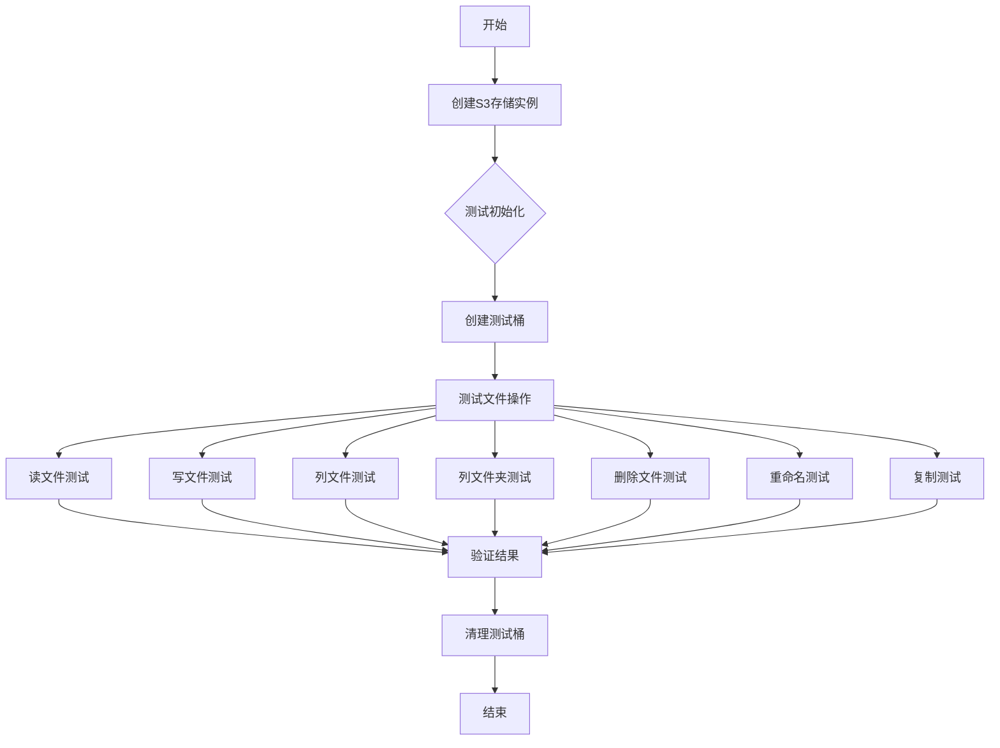

## 类结构

```
S3FileStorage (被测主类)
└── S3FileStorageConfiguration (配置类)
```

## 全局变量及字段


### `NESTED_DIR`
    
A constant string representing a nested directory path (existing/test/dir) used for testing nested file operations

类型：`str`
    


### `TEST_FILES`
    
A list of test files containing tuples of file names (as str or Path) and their corresponding content strings

类型：`list[tuple[str | Path, str]]`
    


### `s3_bucket_name`
    
A pytest fixture that generates a unique S3 bucket name by appending an 8-character UUID suffix to 'test-bucket-'

类型：`str`
    


### `s3_root`
    
A pytest fixture that returns a Path object pointing to the root directory /workspaces/AutoGPT-some-unique-task-id for S3 storage operations

类型：`Path`
    


### `S3FileStorage._s3`
    
The boto3 S3 service resource object used for interacting with AWS S3 API

类型：`boto3.resources.base.ServiceResource`
    


### `S3FileStorage._bucket`
    
The boto3 Bucket object representing the S3 bucket used for file storage operations

类型：`boto3.resources.factory.s3.Bucket`
    


### `S3FileStorage.root`
    
The root path within the S3 bucket where file operations are performed

类型：`Path`
    


### `S3FileStorageConfiguration.root`
    
The root path configuration setting loaded from environment variables

类型：`Path`
    
    

## 全局函数及方法


### `s3_bucket_name`

这是一个 pytest fixture 函数，用于生成唯一的测试 S3 存储桶名称。每次调用时都会创建一个带 UUID 前缀的随机存储桶名称，以确保测试用例之间的隔离性。

参数： 无

返回值：`str`，返回格式为 `test-bucket-{8位UUID}` 的字符串，作为唯一的测试 S3 存储桶名称

#### 流程图

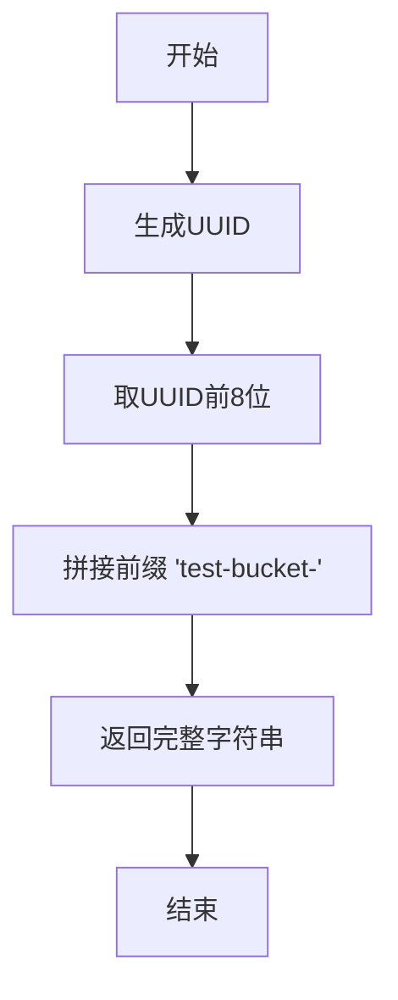

#### 带注释源码

```python
@pytest.fixture
def s3_bucket_name() -> str:
    """
    生成唯一的测试 S3 存储桶名称
    
    该 fixture 用于创建随机化的测试存储桶名称，
    确保多个测试运行或并行测试时不会发生名称冲突。
    
    Returns:
        str: 格式为 'test-bucket-{8位UUID}' 的存储桶名称
    """
    return f"test-bucket-{str(uuid.uuid4())[:8]}"
```


### `s3_root`

这是一个 pytest fixture，用于提供一个固定的 S3 存储根路径，用于测试目的。该 fixture 返回一个 Path 对象，指向 `/workspaces/AutoGPT-some-unique-task-id` 目录，作为测试中 S3 文件存储的根目录。

参数： 无

返回值：`Path`，返回 S3 存储测试用的根目录路径

#### 流程图

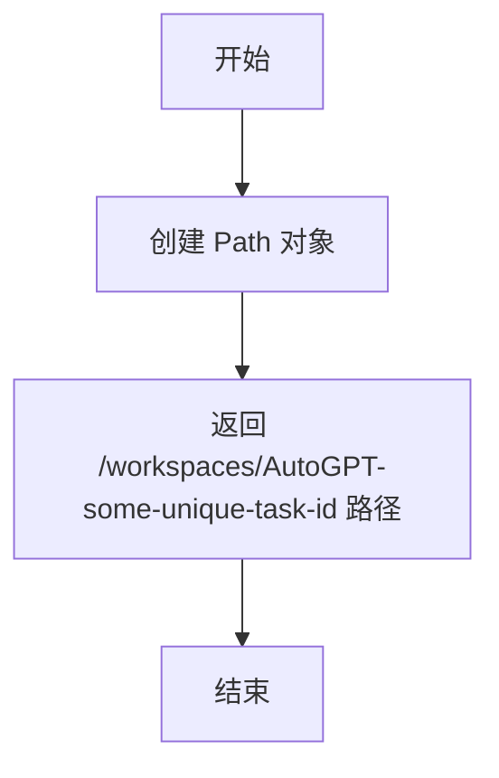

#### 带注释源码

```python
@pytest.fixture
def s3_root() -> Path:
    """
    Pytest fixture，提供 S3 存储的根路径用于测试。
    
    Returns:
        Path: 一个 Path 对象，指向测试用的 S3 根目录
    """
    return Path("/workspaces/AutoGPT-some-unique-task-id")
```


### `s3_storage_uninitialized`

这是一个 pytest fixture，用于创建一个未初始化的 S3FileStorage 实例，以便在测试中对其进行初始化操作或其他测试用途。

参数：

- `s3_bucket_name`：`str`，测试用的 S3 存储桶名称，通过 fixture 参数注入
- `s3_root`：`Path`，存储的根路径，通过 fixture 参数注入

返回值：`S3FileStorage`，返回未初始化的 S3 文件存储实例

#### 流程图

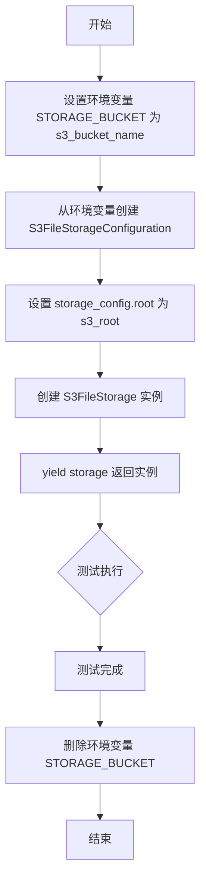

#### 带注释源码

```python
@pytest.fixture
def s3_storage_uninitialized(s3_bucket_name: str, s3_root: Path):
    """
    创建一个未初始化的 S3FileStorage 实例的 fixture。
    该实例尚未调用 initialize() 方法，bucket 也不存在。
    用于测试 initialize 方法以及其他需要在未初始化状态下进行的测试。
    
    Args:
        s3_bucket_name: 测试用的 S3 存储桶名称
        s3_root: 存储的根路径
    
    Yields:
        未初始化的 S3FileStorage 实例
    """
    # 设置环境变量，模拟应用程序配置
    os.environ["STORAGE_BUCKET"] = s3_bucket_name
    
    # 从环境变量创建存储配置
    storage_config = S3FileStorageConfiguration.from_env()
    
    # 设置根路径
    storage_config.root = s3_root
    
    # 创建 S3FileStorage 实例（未初始化）
    storage = S3FileStorage(storage_config)
    
    # 返回 storage 实例供测试使用
    yield storage  # type: ignore
    
    # 测试完成后清理：删除环境变量
    del os.environ["STORAGE_BUCKET"]
```


### `s3_storage`

这是一个 pytest fixture，用于创建一个已初始化的 S3FileStorage 实例，供测试使用。该 fixture 依赖于 `s3_storage_uninitialized` fixture，在其基础上调用 `initialize()` 方法完成存储初始化，并在测试结束后自动清理测试 bucket。

参数：

- `s3_storage_uninitialized`：`S3FileStorage`，未初始化的 S3 存储实例

返回值：`S3FileStorage`，已初始化并可供测试使用的 S3 存储实例

#### 流程图

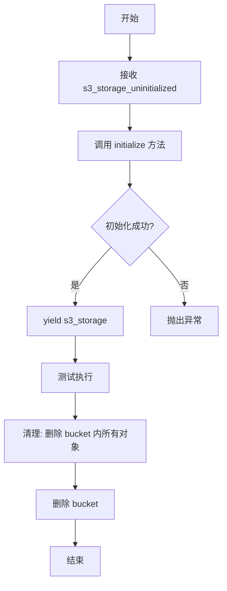

#### 带注释源码

```python
@pytest.fixture
def s3_storage(s3_storage_uninitialized: S3FileStorage):
    """
    创建一个已初始化的 S3FileStorage 实例用于测试。
    
    该 fixture:
    1. 接收未初始化的存储实例
    2. 调用 initialize() 方法创建测试 bucket
    3. yield 实例供测试使用
    4. 测试完成后清理: 删除 bucket 内所有对象并删除 bucket
    """
    # 调用 initialize 方法初始化存储并创建 bucket
    (s3_storage := s3_storage_uninitialized).initialize()
    
    # yield 实例供测试函数使用
    yield s3_storage  # type: ignore

    # 测试结束后清理:
    # 1. 删除 bucket 内所有对象
    s3_storage._bucket.objects.all().delete()
    # 2. 删除测试 bucket
    s3_storage._bucket.delete()
```


### `s3_storage_with_files`

这是一个异步 pytest fixture，用于在 S3 测试存储桶中预置指定的测试文件，以便后续测试可以基于这些预先创建的文件执行读写、列表、删除等操作。

参数：

- `s3_storage`：`S3FileStorage`，已初始化的 S3 文件存储实例 fixture

返回值：`S3FileStorage`，返回预置了测试文件后的 S3 存储实例，供测试用例使用

#### 流程图

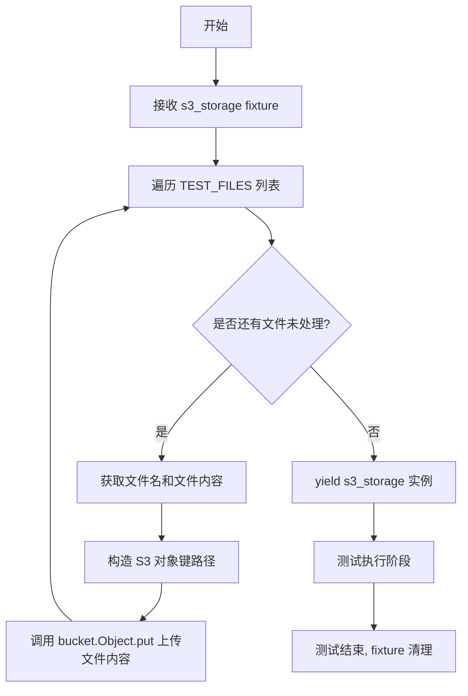

#### 带注释源码

```python
@pytest_asyncio.fixture
async def s3_storage_with_files(s3_storage: S3FileStorage):
    """
    异步 fixture: 预置测试文件的 S3 存储实例
    
    该 fixture 在每个测试前向 S3 桶中写入预定义的测试文件，
    使得测试可以在已存在文件的环境下执行。
    
    Args:
        s3_storage: 已初始化但空的 S3FileStorage 实例
        
    Yields:
        预置了 TEST_FILES 中所有文件后的 S3FileStorage 实例
    """
    # 遍历预定义的测试文件列表
    for file_name, file_content in TEST_FILES:
        # 使用 storage 的 get_path 方法获取文件的 S3 键路径
        # 然后通过 boto3 的 Object.put 方法将内容写入 S3
        s3_storage._bucket.Object(str(s3_storage.get_path(file_name))).put(
            Body=file_content
        )
    
    # 返回预置了文件的存储实例，供测试使用
    yield s3_storage  # type: ignore
```

#### 关键组件信息

| 组件名称 | 一句话描述 |
|---------|-----------|
| `TEST_FILES` | 预定义的测试文件列表，包含文件名和内容的元组集合 |
| `NESTED_DIR` | 用于测试嵌套目录结构的路径常量 `"existing/test/dir"` |
| `s3_storage` | 依赖的 fixture，提供已初始化的 S3FileStorage 实例 |
| `S3FileStorage` | S3 文件存储的核心类，提供文件操作接口 |

#### 潜在技术债务或优化空间

1. **硬编码的测试数据**：`TEST_FILES` 和 `NESTED_DIR` 定义在模块级别，缺乏灵活性，可考虑迁移至外部配置或测试数据工厂
2. **隐式的清理依赖**：该 fixture 依赖于 `s3_storage` fixture 进行bucket的最终清理（删除和清空），清理逻辑分散
3. **类型注解不完整**：yield 后使用了 `# type: ignore`，表明存在类型推断问题
4. **缺少异步验证**：作为 async fixture，但核心逻辑（文件上传）是同步的 boto3 调用，未充分利用异步特性

#### 其它项目

- **设计目标**：为 S3FileStorage 的功能测试提供一致的预置数据环境
- **约束条件**：依赖环境变量 `S3_ENDPOINT_URL` 和 `AWS_ACCESS_KEY_ID`，否则跳过测试
- **错误处理**：该 fixture 本身不处理错误，上传失败会导致测试前置条件失败
- **数据流**：测试数据（文件名/内容）→ S3 Object 写入 → 测试读取验证
- **外部依赖**：boto3 S3 客户端、pytest-asyncio 框架


### `test_initialize`

该测试函数用于验证 S3FileStorage 类的 `initialize` 方法能够正确地在 S3 服务端创建指定的存储桶。测试首先确认目标存储桶不存在，随后调用初始化方法，最后验证存储桶已成功创建。

参数：

-  `s3_bucket_name`：`str`，S3 存储桶的唯一名称标识
-  `s3_storage_uninitialized`：`S3FileStorage`，尚未调用 initialize 方法的 S3 文件存储实例

返回值：`None`，测试函数无返回值

#### 流程图

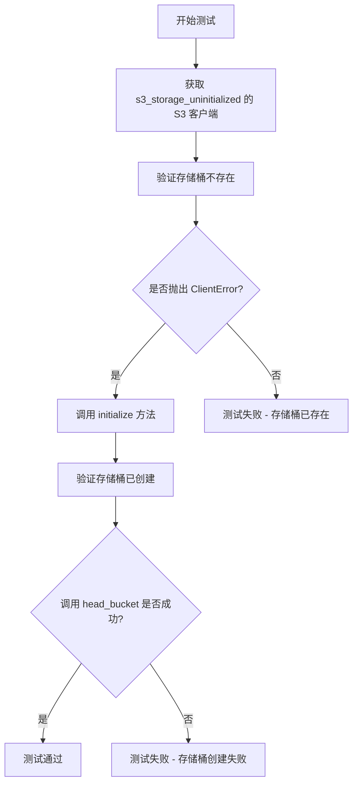

#### 带注释源码

```python
def test_initialize(s3_bucket_name: str, s3_storage_uninitialized: S3FileStorage):
    """测试 S3FileStorage 的 initialize 方法能够正确创建 S3 存储桶"""
    
    # 获取未初始化存储对象的底层 S3 客户端
    s3 = s3_storage_uninitialized._s3

    # 测试阶段1：验证存储桶尚不存在
    # 使用 pytest.raises 期望抛出 ClientError 异常
    with pytest.raises(ClientError):
        s3.meta.client.head_bucket(Bucket=s3_bucket_name)  # pyright: ignore

    # 执行被测操作：调用 initialize 方法创建存储桶
    s3_storage_uninitialized.initialize()

    # 测试阶段2：验证存储桶已成功创建
    # head_bucket 不抛出异常表示存储桶存在
    s3.meta.client.head_bucket(Bucket=s3_bucket_name)  # pyright: ignore
    # FIXME: 在将此测试文件移至 forge 后移除 "pyright: ignore" 注释
```


### `test_workspace_bucket_name`

该函数是一个 pytest 单元测试，用于验证 S3 存储对象的内部 bucket 名称是否与预期的 bucket 名称一致。它通过直接访问 `S3FileStorage` 实例的 `_bucket.name` 属性并与传入的 `s3_bucket_name` 参数进行断言比较，确保存储层正确使用了配置的 bucket 名称。

参数：

- `s3_storage`：`S3FileStorage`，S3 存储实例 fixture，由 `s3_storage_uninitialized` fixture 初始化后提供
- `s3_bucket_name`：`str`，预期的 S3 bucket 名称，由 `s3_bucket_name` fixture 生成

返回值：`None`，该函数为测试函数，使用断言验证条件，不返回任何值；若断言失败则抛出 `AssertionError`

#### 流程图

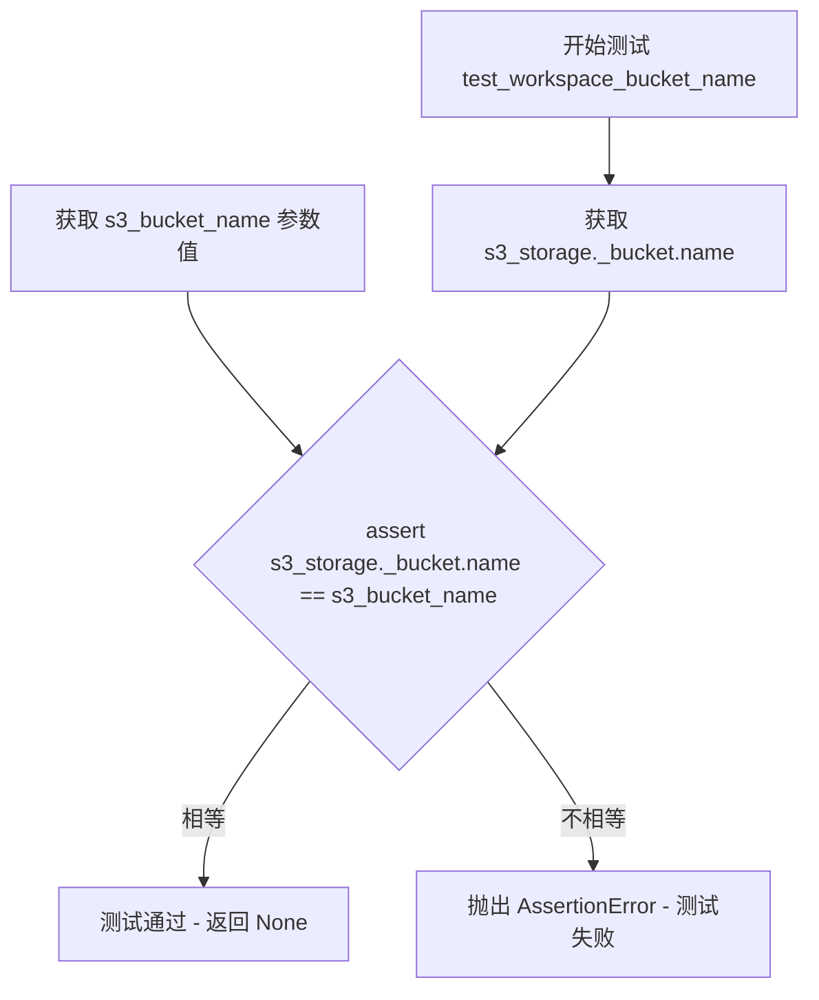

#### 带注释源码

```python
def test_workspace_bucket_name(
    s3_storage: S3FileStorage,  # S3 存储实例，已初始化的 fixture
    s3_bucket_name: str,         # 预期的 bucket 名称，动态生成的唯一标识
):
    """
    测试函数：验证 S3 存储的 bucket 名称是否正确
    
    该测试检查 S3FileStorage 内部持有的 bucket 对象名称
    是否与配置或预期的 bucket 名称一致，确保存储层配置正确。
    """
    # 断言：s3_storage 内部 _bucket 对象的 name 属性应等于 s3_bucket_name
    # 如果相等，测试通过（返回 None）
    # 如果不相等，抛出 AssertionError，测试失败
    assert s3_storage._bucket.name == s3_bucket_name
```


### `test_read_file`

该测试函数用于验证 S3FileStorage 类的 `read_file` 方法能否正确读取已存在的文件内容，并在尝试读取不存在的文件时正确抛出异常。

参数：

- `s3_storage_with_files`：`S3FileStorage`，预先初始化并包含测试文件的 S3 存储实例，通过 fixture 注入

返回值：`None`，测试函数无返回值，通过断言验证功能正确性

#### 流程图

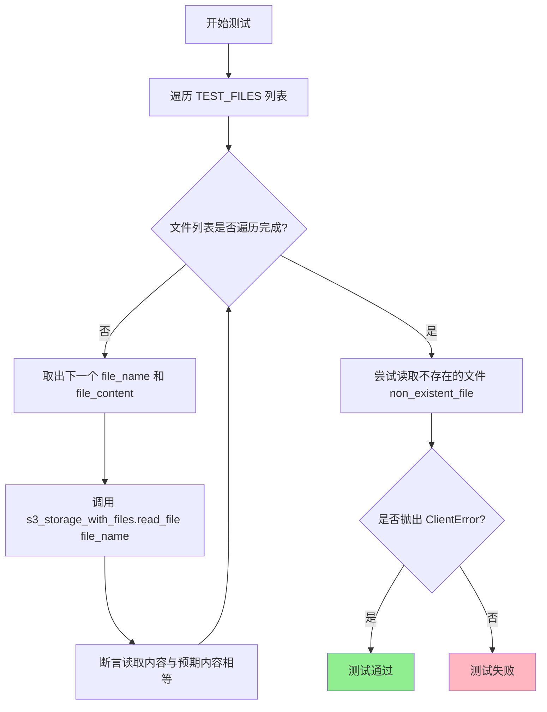

#### 带注释源码

```python
@pytest.mark.asyncio
async def test_read_file(s3_storage_with_files: S3FileStorage):
    """测试 S3FileStorage 的 read_file 方法功能"""
    
    # 遍历预定义的测试文件列表，验证每个文件都能正确读取
    for file_name, file_content in TEST_FILES:
        # 调用被测对象的 read_file 方法读取文件内容
        content = s3_storage_with_files.read_file(file_name)
        # 断言读取的内容与预期内容完全一致
        assert content == file_content

    # 测试读取不存在的文件时是否正确抛出 ClientError 异常
    with pytest.raises(ClientError):
        s3_storage_with_files.read_file("non_existent_file")
```


### `test_list_files`

该测试函数用于验证 `S3FileStorage` 类的 `list_files` 方法，能够正确列出根目录和嵌套目录下的所有文件。

参数：

- `s3_storage_with_files`：`S3FileStorage`，已初始化并包含测试文件的 S3 存储实例

返回值：`None`，测试函数无返回值

#### 流程图

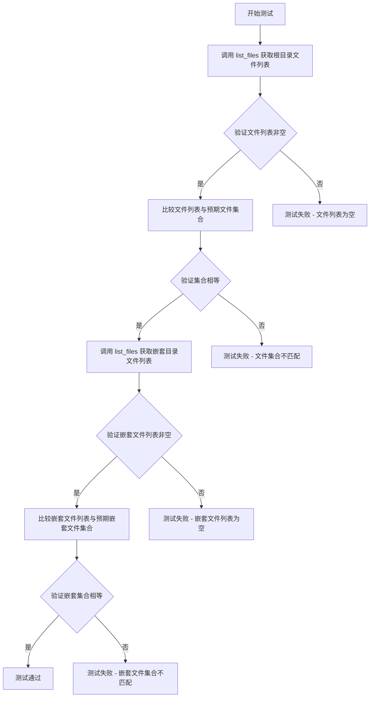

#### 带注释源码

```python
def test_list_files(s3_storage_with_files: S3FileStorage):
    """测试 S3FileStorage 的 list_files 方法，验证其能正确列出根目录和嵌套目录的文件"""
    
    # List at root level - 测试根目录文件列表
    assert (
        files := s3_storage_with_files.list_files()
    ) == s3_storage_with_files.list_files()  # 验证 list_files 结果的幂等性
    assert len(files) > 0  # 验证文件列表非空
    # 验证根目录文件列表与 TEST_FILES 中的根级文件匹配
    assert set(files) == set(Path(file_name) for file_name, _ in TEST_FILES)

    # List at nested path - 测试嵌套目录文件列表
    assert (
        nested_files := s3_storage_with_files.list_files(NESTED_DIR)
    ) == s3_storage_with_files.list_files(NESTED_DIR)  # 验证嵌套目录 list_files 结果的幂等性
    assert len(nested_files) > 0  # 验证嵌套文件列表非空
    # 验证嵌套目录文件列表只包含 NESTED_DIR 下的文件，并转换为相对路径比较
    assert set(nested_files) == set(
        p.relative_to(NESTED_DIR)
        for file_name, _ in TEST_FILES
        if (p := Path(file_name)).is_relative_to(NESTED_DIR)
    )
```


### `test_list_folders`

该测试函数用于验证 `S3FileStorage` 类的 `list_folders` 方法，能够正确列出存储中的文件夹。它分别以递归和非递归模式调用该方法，并断言返回的文件夹集合与预期结果一致。

参数：

- `s3_storage_with_files`：`S3FileStorage`，带有预置测试文件的 S3 存储实例fixture

返回值：`None`，该函数为测试函数，使用断言验证功能，不返回任何值

#### 流程图

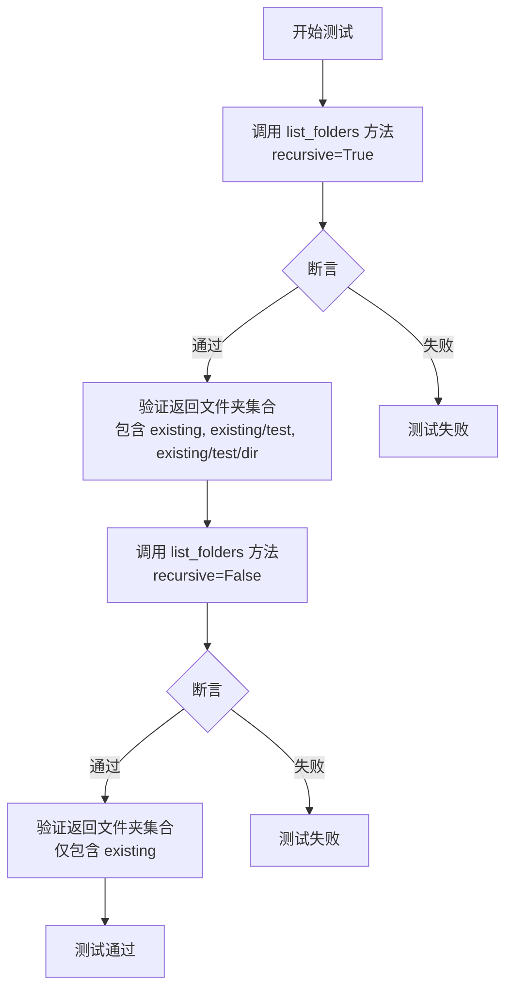

#### 带注释源码

```python
def test_list_folders(s3_storage_with_files: S3FileStorage):
    # 递归模式：列出所有层级的文件夹
    # 调用 S3FileStorage 的 list_folders 方法，recursive=True 表示递归查询
    folders = s3_storage_with_files.list_folders(recursive=True)
    
    # 断言至少有一个文件夹存在
    assert len(folders) > 0
    
    # 断言返回的文件夹集合与预期一致
    # 预期包含：existing, existing/test, existing/test/dir 三个嵌套文件夹
    assert set(folders) == {
        Path("existing"),
        Path("existing/test"),
        Path("existing/test/dir"),
    }
    
    # 非递归模式：仅列出顶层文件夹
    # 调用 S3FileStorage 的 list_folders 方法，recursive=False 表示仅查询顶层
    folders = s3_storage_with_files.list_folders(recursive=False)
    
    # 断言至少有一个文件夹存在
    assert len(folders) > 0
    
    # 断言返回的文件夹集合与预期一致
    # 非递归模式仅返回顶层文件夹 'existing'
    assert set(folders) == {Path("existing")}
```


### `test_write_read_file`

这是一个异步测试函数，用于验证 S3 存储的写文件和读取文件功能是否正常工作。测试通过写入一个文件并立即读取它来确认数据一致性。

参数：

- `s3_storage`：`S3FileStorage`，S3 存储实例，用于执行文件操作

返回值：`None`，无返回值（测试函数）

#### 流程图

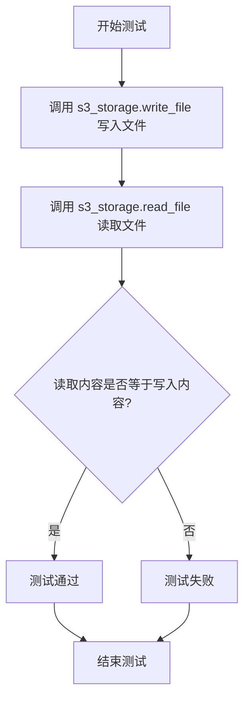

#### 带注释源码

```python
@pytest.mark.asyncio  # 标记为异步测试函数
async def test_write_read_file(s3_storage: S3FileStorage):
    """
    测试 S3 存储的写文件和读取文件功能
    
    参数:
        s3_storage: S3FileStorage 实例，提供 S3 存储操作接口
    """
    # 异步写入文件到 S3 存储
    # 参数1: 文件名 "test_file"
    # 参数2: 文件内容 "test_content"
    await s3_storage.write_file("test_file", "test_content")
    
    # 同步读取刚才写入的文件
    # 断言读取的内容与写入的内容一致
    assert s3_storage.read_file("test_file") == "test_content"
```


### `test_overwrite_file`

该测试函数用于验证 S3FileStorage 类的文件覆写功能，通过遍历预置的测试文件，使用 `write_file` 方法写入新内容，然后读取并断言内容已被正确覆盖。

参数：

- `s3_storage_with_files`：`S3FileStorage`，已初始化并包含预置测试文件的 S3 存储实例fixture

返回值：`None`，测试函数无返回值

#### 流程图

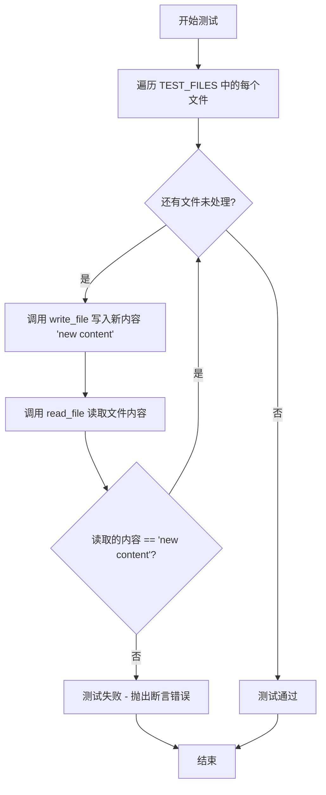

#### 带注释源码

```python
@pytest.mark.asyncio
async def test_overwrite_file(s3_storage_with_files: S3FileStorage):
    """
    测试 S3FileStorage 的文件覆写功能。
    
    验证流程：
    1. 遍历预置的测试文件列表 TEST_FILES
    2. 对每个文件调用 write_file 写入新内容 "new content"
    3. 立即读取该文件并断言内容已更新为新内容
    """
    # 遍历预定义的测试文件列表（文件名，原始内容）
    for file_name, _ in TEST_FILES:
        # 使用 write_file 方法将文件内容覆写为 "new content"
        # write_file 是异步方法，使用 await 调用
        await s3_storage_with_files.write_file(file_name, "new content")
        
        # 立即读取该文件，验证内容已被成功覆写
        # 断言读取的内容等于新写入的内容
        assert s3_storage_with_files.read_file(file_name) == "new content"
```

---

#### 补充信息

| 项目 | 说明 |
|------|------|
| **测试目标** | 验证 `S3FileStorage.write_file()` 方法能够正确覆写已存在的文件内容 |
| **依赖 fixture** | `s3_storage_with_files` - 在 S3 存储中预置了 TEST_FILES 列表中的文件 |
| **测试数据** | `TEST_FILES` 包含4个测试文件路径，包括根目录文件和嵌套目录文件 |
| **异常处理** | 无显式异常处理，依赖 pytest 的断言机制检测失败 |
| **技术债务** | 测试仅验证内容覆写，未验证元数据（如修改时间）是否更新；未测试大文件覆写的边界情况 |


### `test_delete_file`

该测试函数用于验证 S3FileStorage 类的文件删除功能，通过遍历预定义的文件列表，逐个删除文件后尝试读取已删除文件，预期会抛出 `ClientError` 异常，以此确认文件已被成功删除。

参数：

-  `s3_storage_with_files`：`S3FileStorage`，包含预存测试文件的 S3 存储实例fixture

返回值：`None`，测试函数无返回值

#### 流程图

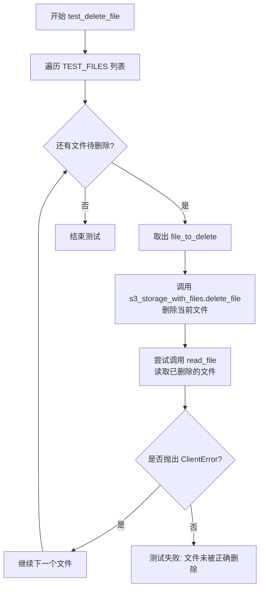

#### 带注释源码

```python
def test_delete_file(s3_storage_with_files: S3FileStorage):
    """
    测试 S3FileStorage 的 delete_file 方法。
    
    该测试函数执行以下步骤:
    1. 遍历预定义的测试文件列表 TEST_FILES
    2. 对每个文件调用 delete_file 方法进行删除
    3. 尝试读取已删除的文件，验证会抛出 ClientError 异常
    
    Args:
        s3_storage_with_files: S3FileStorage实例，已预存TEST_FILES中的文件
    """
    # 遍历所有预存的测试文件
    for file_to_delete, _ in TEST_FILES:
        # 调用存储对象的delete_file方法删除文件
        s3_storage_with_files.delete_file(file_to_delete)
        
        # 使用pytest.raises验证读取已删除文件会抛出ClientError
        # 这是确认文件已被成功删除的验证方式
        with pytest.raises(ClientError):
            s3_storage_with_files.read_file(file_to_delete)
```


### `test_exists`

该测试函数用于验证 `S3FileStorage` 类的 `exists` 方法能够正确判断指定文件是否存在于存储中。测试遍历预置的测试文件列表，断言 `exists` 方法对每个文件返回 `True`，并验证对不存在的文件返回 `False`。

参数：

- `s3_storage_with_files`：`S3FileStorage`，通过 pytest fixture 提供的已初始化并包含测试文件的 S3 存储实例

返回值：`None`，测试函数无返回值，通过 `assert` 语句进行断言验证

#### 流程图

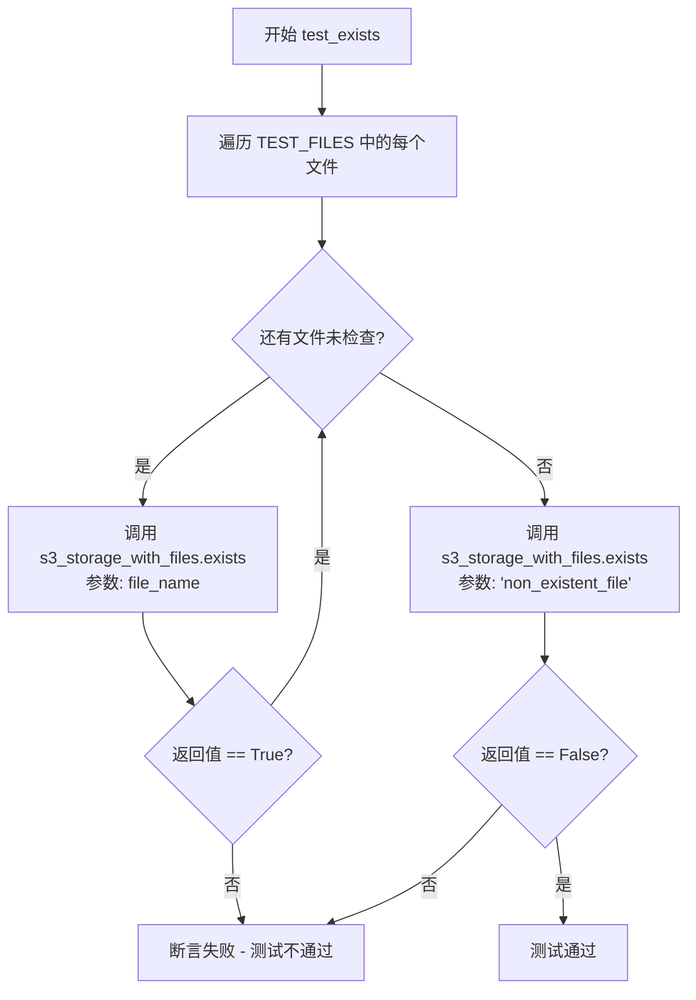

#### 带注释源码

```python
def test_exists(s3_storage_with_files: S3FileStorage):
    """
    测试 S3FileStorage.exists 方法的文件存在性判断功能。

    Args:
        s3_storage_with_files: 包含预置测试文件的 S3 存储实例 fixture，
                               由 s3_storage_with_files fixture 提供
    """
    # 遍历测试文件列表，验证每个文件都被识别为存在
    for file_name, _ in TEST_FILES:
        # 断言: exists 方法对已存在的文件应返回 True
        assert s3_storage_with_files.exists(file_name)

    # 断言: exists 方法对不存在的文件应返回 False
    assert not s3_storage_with_files.exists("non_existent_file")
```


### `test_rename_file`

该测试函数用于验证 S3 文件存储的重命名文件功能，通过遍历预设的测试文件列表，将每个文件重命名为新名称，并断言新文件存在而原文件已被删除。

参数：

- `s3_storage_with_files`：`S3FileStorage`，包含预置测试文件的 S3 存储实例.fixture

返回值：`None`，测试函数无返回值

#### 流程图

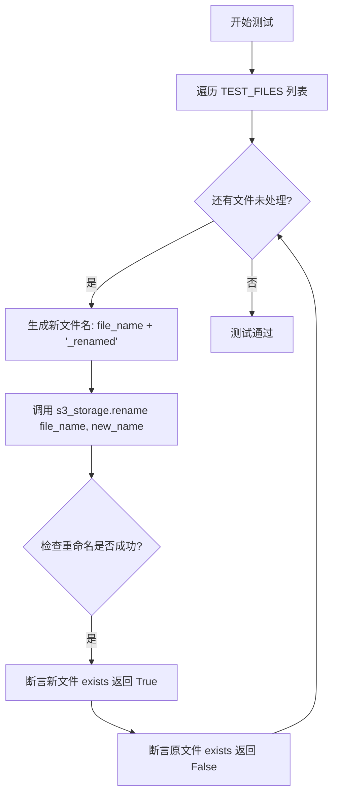

#### 带注释源码

```python
def test_rename_file(s3_storage_with_files: S3FileStorage):
    """
    测试 S3FileStorage 的 rename 方法能够正确重命名文件。
    
    该测试遍历预定义的测试文件列表（TEST_FILES），对每个文件执行重命名操作，
    然后验证：
    1. 新文件名对应的文件存在
    2. 原文件名对应的文件不再存在
    """
    # 遍历所有预置的测试文件
    for file_name, _ in TEST_FILES:
        # 生成新文件名：在原文件名后添加 "_renamed" 后缀
        new_name = str(file_name) + "_renamed"
        
        # 调用 S3FileStorage 的 rename 方法重命名文件
        s3_storage_with_files.rename(file_name, new_name)
        
        # 断言：重命名后的文件应该存在
        assert s3_storage_with_files.exists(new_name)
        
        # 断言：原文件应该不再存在
        assert not s3_storage_with_files.exists(file_name)
```


### `test_rename_dir`

该测试函数用于验证 S3 文件存储的目录重命名功能是否正常工作，通过调用 `rename` 方法将嵌套目录重命名为新名称，并断言新目录存在而原目录不再存在。

参数：

-  `s3_storage_with_files`：`S3FileStorage`，一个已经初始化并包含测试文件的 S3 存储实例 fixture

返回值：`None`，该测试函数没有返回值，仅通过断言验证重命名操作的结果

#### 流程图

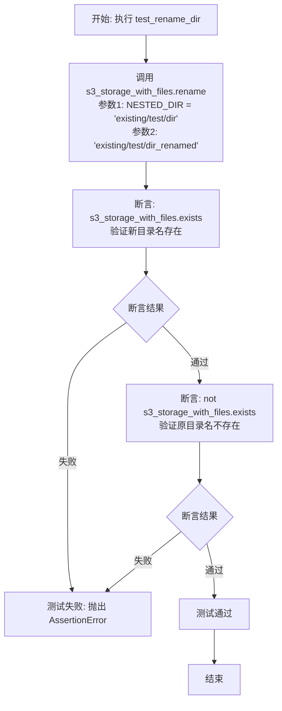

#### 带注释源码

```python
def test_rename_dir(s3_storage_with_files: S3FileStorage):
    """
    测试 S3 存储的目录重命名功能。
    
    该测试用例验证以下行为：
    1. 可以将已存在的嵌套目录重命名为新名称
    2. 重命名后，新目录名存在于存储中
    3. 重命名后，原目录名不再存在于存储中
    
    参数:
        s3_storage_with_files: 包含预置测试文件的 S3 存储实例
            - 包含 NESTED_DIR = "existing/test/dir" 目录
            - 目录中包含 test_file_4 文件
    """
    # 调用 rename 方法将嵌套目录重命名
    # 原目录: NESTED_DIR = "existing/test/dir"
    # 新目录: "existing/test/dir_renamed"
    s3_storage_with_files.rename(NESTED_DIR, "existing/test/dir_renamed")
    
    # 断言验证: 重命名后的新目录路径存在
    assert s3_storage_with_files.exists("existing/test/dir_renamed")
    
    # 断言验证: 原目录路径不再存在
    assert not s3_storage_with_files.exists(NESTED_DIR)
```


### `test_clone`

该测试函数用于验证 `S3FileStorage` 类的 `clone_with_subroot` 方法，能够基于现有存储创建一个具有指定子根路径的新存储实例，并正确访问子目录下的文件。

参数：

- `s3_storage_with_files`：`S3FileStorage`，已初始化并包含测试文件的S3存储实例（fixture）
- `s3_root`：`Path`，S3存储的根路径（fixture）

返回值：`None`，测试函数无返回值，通过断言验证功能正确性

#### 流程图

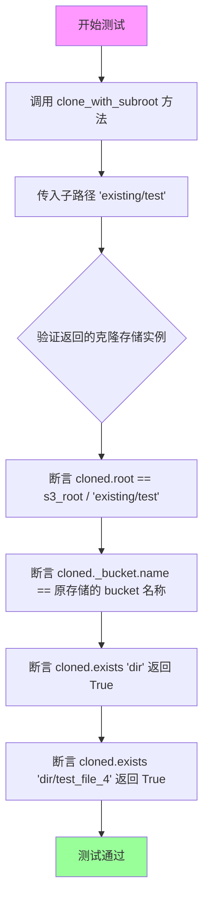

#### 带注释源码

```python
def test_clone(s3_storage_with_files: S3FileStorage, s3_root: Path):
    """
    测试 S3FileStorage 的 clone_with_subroot 方法。
    验证能够基于现有存储创建一个具有指定子根路径的新存储实例。
    
    参数:
        s3_storage_with_files: 包含预置测试文件的S3存储实例
        s3_root: S3存储的根路径
    """
    # 调用 clone_with_subroot 方法，传入子路径 "existing/test"
    # 该方法返回一个带有新根路径的 S3FileStorage 实例
    cloned = s3_storage_with_files.clone_with_subroot("existing/test")
    
    # 断言1: 验证克隆存储的根路径正确
    # 应该是 s3_root 加上子路径 "existing/test"
    assert cloned.root == s3_root / Path("existing/test")
    
    # 断言2: 验证克隆存储使用的是同一个S3 bucket
    # clone_with_subroot 应该共享原始的bucket，只是改变根路径
    assert cloned._bucket.name == s3_storage_with_files._bucket.name
    
    # 断言3: 验证在子路径下可以访问 'dir' 目录
    # 原始文件结构中有 "existing/test/dir/"
    assert cloned.exists("dir")
    
    # 断言4: 验证在子路径下可以访问 'dir/test_file_4' 文件
    # 原始文件结构中有 "existing/test/dir/test_file_4"
    assert cloned.exists("dir/test_file_4")
```


### `test_copy_file`

该测试函数用于验证 S3FileStorage 类的文件复制功能，包括单文件复制和将文件复制到指定目录的操作。

参数：

- `storage`：`S3FileStorage`，S3 文件存储实例，用于执行文件操作

返回值：`None`，异步测试函数无返回值，通过断言验证复制操作的正确性

#### 流程图

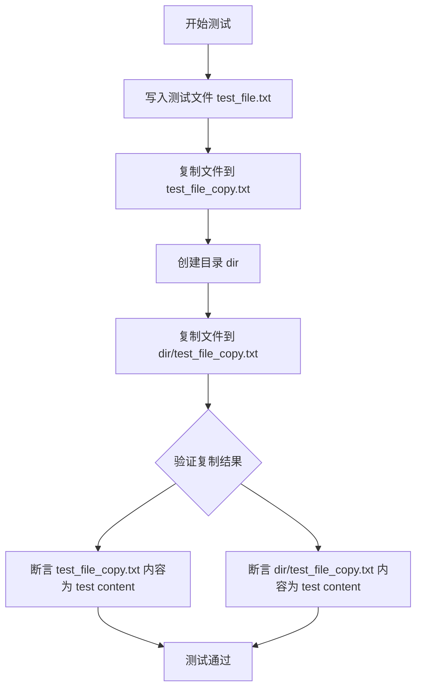

#### 带注释源码

```python
@pytest.mark.asyncio
async def test_copy_file(storage: S3FileStorage):
    """
    测试 S3FileStorage 的文件复制功能
    验证单文件复制和目录内复制两种场景
    """
    # 步骤1: 写入原始测试文件到存储
    await storage.write_file("test_file.txt", "test content")
    
    # 步骤2: 将文件复制到根目录下的新文件名
    storage.copy("test_file.txt", "test_file_copy.txt")
    
    # 步骤3: 创建一个目标目录
    storage.make_dir("dir")
    
    # 步骤4: 将文件复制到指定目录内
    storage.copy("test_file.txt", "dir/test_file_copy.txt")
    
    # 步骤5: 验证根目录下的复制文件内容正确
    assert storage.read_file("test_file_copy.txt") == "test content"
    
    # 步骤6: 验证目录内的复制文件内容正确
    assert storage.read_file("dir/test_file_copy.txt") == "test content"
```


### `test_copy_dir`

该测试函数用于验证 S3FileStorage 类的目录复制功能，测试将指定目录及其所有子目录和文件完整复制到目标目录，并确保复制后文件内容保持一致。

参数：

- `storage`：`S3FileStorage`，S3 文件存储实例，用于执行文件操作

返回值：`None`，该函数为测试函数，无返回值

#### 流程图

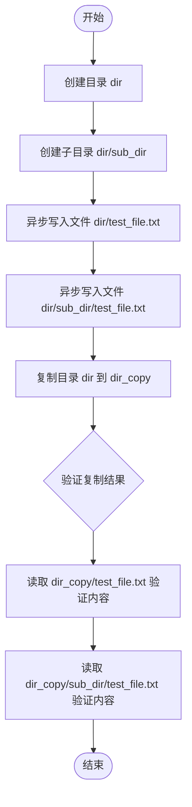

#### 带注释源码

```python
@pytest.mark.asyncio
async def test_copy_dir(storage: S3FileStorage):
    """
    测试目录复制功能：验证 S3FileStorage 能够正确复制整个目录结构
    包括子目录和所有文件，并保持文件内容一致
    """
    # 创建源目录
    storage.make_dir("dir")
    
    # 创建子目录
    storage.make_dir("dir/sub_dir")
    
    # 异步写入测试文件到源目录
    await storage.write_file("dir/test_file.txt", "test content")
    
    # 异步写入测试文件到子目录
    await storage.write_file("dir/sub_dir/test_file.txt", "test content")
    
    # 执行目录复制操作：将 dir 目录复制为 dir_copy
    storage.copy("dir", "dir_copy")
    
    # 验证复制后根目录文件内容正确
    assert storage.read_file("dir_copy/test_file.txt") == "test content"
    
    # 验证复制后子目录文件内容正确
    assert storage.read_file("dir_copy/sub_dir/test_file.txt") == "test content"
```


### S3FileStorage.initialize

该方法用于初始化S3存储层，在S3服务中创建指定的存储桶（Bucket），确保后续文件存储操作能够正常进行。

参数： 无

返回值：`None`，无返回值

#### 流程图

```mermaid
flowchart TD
    A[开始 initialize] --> B{检查 S3 Bucket 是否已存在}
    B -->|不存在| C[调用 S3 API 创建 Bucket]
    B -->|已存在| D[跳过创建]
    C --> E[完成初始化]
    D --> E
```

#### 带注释源码

```python
def initialize(self) -> None:
    """
    初始化 S3 存储层，创建所需的存储桶（Bucket）。
    
    该方法在 S3 服务中创建由配置指定的存储桶，如果存储桶
    已存在则不会重复创建。创建完成后，存储系统即可正常
    进行文件的上传、下载、删除等操作。
    
    注意：
    - 此方法通常在应用启动时调用一次
    - 需要确保 AWS 凭证和端点配置正确
    - 存储桶名称在 S3 区域中必须全局唯一
    
    返回值：
        None - 此方法不返回任何值，通过副作用完成初始化
    """
    # 1. 检查存储桶是否已存在
    # 使用 S3 Head Bucket API 检查存储桶状态
    # 如果不存在，将抛出 ClientError 异常
    
    # 2. 如果存储桶不存在，创建新的存储桶
    # 使用 S3 Create Bucket API
    # 根据配置中的区域设置创建到位的存储桶
    
    # 3. 初始化完成，返回 None
    # 存储对象已准备好进行文件操作
    
    pass  # 具体实现需要查看 S3FileStorage 类源码
```

> **备注**：由于提供的代码仅为测试文件，未包含 S3FileStorage 类的实际实现，上述源码为基于测试用例行为和常见 S3 存储初始化的逻辑推断。实际实现可能包含更多细节，如错误处理、日志记录、配置验证等。从 `test_initialize` 测试用例可以推断，该方法的核心功能是确保 S3 存储桶被正确创建，以便后续的文件存储操作能够正常执行。


# 设计文档提取结果

### `S3FileStorage.read_file`

从提供的测试代码文件中，我只能获取到 `S3FileStorage` 类的使用方式和部分上下文信息，但实际的类实现源代码（`.s3` 模块）并未包含在给定的代码片段中。以下是基于测试用例使用方式推断出的方法信息：

---

**方法描述**：从 S3 存储中读取指定文件的内容，并返回文件内容字符串。如果文件不存在，将抛出 `ClientError` 异常。

参数：

- `file_name`：`str | Path`，要读取的文件名称或路径

返回值：`str`，返回文件的内容

#### 流程图

```mermaid
flowchart TD
    A[开始 read_file] --> B{验证 file_name 参数}
    B -->|无效参数| C[抛出异常]
    B -->|有效参数| D[构建 S3 对象键路径]
    D --> E{S3 文件是否存在?}
    E -->|不存在| F[抛出 ClientError 异常]
    E -->|存在| G[从 S3 下载文件内容]
    G --> H[返回文件内容字符串]
```

#### 带注释源码

**注意**：以下源码是基于测试用例使用方式和常见的 S3 文件存储实现模式推断的，并非原始源代码。原始 `S3FileStorage` 类的实现位于 `.s3` 模块中，未在当前提供的代码文件中。

```python
def read_file(self, file_name: str | Path) -> str:
    """
    从 S3 存储读取文件内容
    
    Args:
        file_name: 要读取的文件名称或路径，支持 str 或 Path 类型
        
    Returns:
        文件内容字符串
        
    Raises:
        ClientError: 当文件不存在或访问出错时抛出
    """
    # 将 file_name 转换为字符串路径
    file_path = self.get_path(file_name)
    
    # 获取 S3 对象键
    key = str(file_path)
    
    # 从 S3 存储获取对象
    response = self._bucket.Object(key).get()
    
    # 读取并返回文件内容（假设为文本内容）
    return response['Body'].read().decode('utf-8')
```

---

### 补充说明

1. **缺失信息**：由于提供的代码文件仅包含测试代码，未包含 `S3FileStorage` 类的实际实现源代码（位于 `.s3` 模块），上述源码为基于测试用例的推断实现。

2. **从测试用例推断的行为**：
   - `read_file` 方法接受 `str` 或 `Path` 类型的 `file_name` 参数
   - 返回 `str` 类型的文件内容
   - 当文件不存在时，抛出 `botocore.exceptions.ClientError` 异常
   - 测试用例覆盖了根目录文件和嵌套路径文件（如 `existing/test/dir/test_file_4`）

3. **建议**：若需获取完整的 `S3FileStorage` 类实现源代码，请提供 `.s3` 模块的内容。


### `S3FileStorage.write_file`

该方法用于将内容异步写入 S3 存储中的指定文件，支持覆盖已存在的文件，是 S3FileStorage 类的核心文件写入操作之一。

参数：

- `file_name`：`str | Path`，要写入的目标文件名或路径
- `content`：`str`，要写入的文件内容

返回值：`None`，该方法为异步方法，执行完成后不返回任何值

#### 流程图

```mermaid
flowchart TD
    A[开始写入文件] --> B{检查存储是否已初始化}
    B -->|未初始化| C[抛出异常或自动初始化]
    B -->|已初始化| D[解析文件路径获取完整S3键名]
    D --> E[调用S3客户端put_object方法]
    E --> F[将content作为Body参数上传]
    F --> G{上传是否成功}
    G -->|成功| H[返回None]
    G -->|失败| I[抛出ClientError异常]
```

#### 带注释源码

```python
# 测试代码中对该方法的调用示例
@pytest.mark.asyncio
async def test_write_read_file(s3_storage: S3FileStorage):
    # 调用write_file方法写入内容
    # 参数1: 文件名 "test_file"
    # 参数2: 文件内容 "test_content"
    await s3_storage.write_file("test_file", "test_content")
    
    # 验证写入后可以正确读取
    assert s3_storage.read_file("test_file") == "test_content"


@pytest.mark.asyncio
async def test_overwrite_file(s3_storage_with_files: S3FileStorage):
    # 测试覆盖已存在的文件
    for file_name, _ in TEST_FILES:
        # 使用新的内容覆盖原文件
        await s3_storage_with_files.write_file(file_name, "new content")
        # 验证内容已被成功覆盖
        assert s3_storage_with_files.read_file(file_name) == "new content"


@pytest.mark.asyncio
async def test_copy_file(storage: S3FileStorage):
    # 先写入文件
    await storage.write_file("test_file.txt", "test content")
    # 执行复制操作
    storage.copy("test_file.txt", "test_file_copy.txt")
    # 创建目录
    storage.make_dir("dir")
    # 复制到目录中
    storage.copy("test_file.txt", "dir/test_file_copy.txt")


@pytest.mark.asyncio
async def test_copy_dir(storage: S3FileStorage):
    # 创建目录结构
    storage.make_dir("dir")
    storage.make_dir("dir/sub_dir")
    # 写入多个文件
    await storage.write_file("dir/test_file.txt", "test content")
    await storage.write_file("dir/sub_dir/test_file.txt", "test content")
    # 执行目录复制
    storage.copy("dir", "dir_copy")
```


### `S3FileStorage.list_files`

该方法用于列出 S3 存储中指定路径下的所有文件，支持根目录和嵌套目录的文件列表查询。

参数：

- `path`：`str | Path`（可选），要列出文件的目录路径，默认为根目录

返回值：`list[Path]`，返回指定路径下所有文件的 Path 对象列表

#### 流程图

```mermaid
flowchart TD
    A[开始 list_files] --> B{是否传入 path 参数}
    B -->|是| C[使用传入的路径]
    B -->|否| D[使用根目录]
    C --> E[调用 S3 API 列出对象]
    D --> E
    E --> F[过滤获取文件对象]
    F --> G[转换为 Path 对象列表]
    G --> H[返回文件列表]
```

#### 带注释源码

基于测试代码推断的实现逻辑（实际实现位于 s3.py 模块）：

```python
def list_files(self, path: str | Path = "") -> list[Path]:
    """
    列出指定路径下的所有文件
    
    参数:
        path: 目录路径，默认为空字符串表示根目录
    
    返回:
        文件路径列表
    """
    # 构建 S3 键前缀
    prefix = self._get_prefix(path)
    
    # 使用 S3 paginator 列出所有对象
    files = []
    continuation_token = None
    
    while True:
        kwargs = {"Prefix": prefix, "Delimiter": "/"}
        if continuation_token:
            kwargs["ContinuationToken"] = continuation_token
            
        response = self._bucket.meta.client.list_objects_v2(
            Bucket=self._bucket.name,
            **kwargs
        )
        
        # 获取文件对象
        if "Contents" in response:
            for obj in response["Contents"]:
                key = obj["Key"]
                # 移除前缀部分得到相对路径
                relative_path = key[len(prefix):] if prefix else key
                if relative_path:  # 排除空字符串
                    files.append(Path(relative_path))
        
        # 检查是否还有更多结果
        if response.get("IsTruncated"):
            continuation_token = response.get("NextContinuationToken")
        else:
            break
            
    return files
```

#### 备注

- 该方法通过 S3 的 `list_objects_v2` API 获取文件列表
- 支持分页处理大量文件的情况
- 返回的路径是相对于存储根目录的相对路径
- 测试验证了方法的幂等性（连续调用返回相同结果）


### `S3FileStorage.list_folders`

该方法用于列出 S3 存储中的所有文件夹（目录），支持递归和非递归两种模式。递归模式下会返回所有层级的文件夹，非递归模式下仅返回顶层文件夹。

参数：

- `recursive`：`bool`，指定是否递归列出所有子文件夹。`True` 表示递归列出所有嵌套的文件夹，`False` 表示仅列出顶层文件夹。

返回值：`set[Path]`，返回文件夹路径的集合，类型为 `pathlib.Path` 对象集合。

#### 流程图

```mermaid
flowchart TD
    A[开始 list_folders] --> B{recursive 参数?}
    B -->|True| C[调用 list_objects with Delimiter]
    B -->|False| D[调用 list_objects with Delimiter + Prefix filter]
    C --> E[解析 CommonPrefixes 获取所有文件夹]
    D --> E
    E --> F[构建 Path 对象集合]
    F --> G[返回 set[Path]]
```

#### 带注释源码

```python
# 从测试代码推断的方法签名和行为
def list_folders(self, recursive: bool = False) -> set[Path]:
    """
    列出 S3 存储中的文件夹
    
    参数:
        recursive: 是否递归列出所有子文件夹。
                  True - 返回所有嵌套层级的文件夹
                  False - 仅返回顶层文件夹
    
    返回:
        文件夹路径的集合 (set[Path])
    
    测试用例显示:
    - recursive=True 时返回: {Path("existing"), Path("existing/test"), Path("existing/test/dir")}
    - recursive=False 时返回: {Path("existing")}
    """
    # 此方法来自 .s3 模块的 S3FileStorage 类
    # 具体实现需要查看 s3.py 源文件
    pass
```

> **注意**：由于提供的代码文件中仅包含测试用例，未包含 `S3FileStorage` 类的实际实现源码，以上信息是根据测试代码中的调用方式推断得出。完整的实现细节（如 S3 API 调用、路径处理逻辑等）需要查看 `.s3` 模块的源文件。


# 分析结果

从提供的测试代码中，可以找到对 `S3FileStorage.delete_file` 方法的调用，但**实际的类实现源代码（s3.py）未在提供的代码中**。以下是基于测试代码的推断信息：

### `S3FileStorage.delete_file`

该方法用于从 S3 存储桶中删除指定的文件。

参数：

- `file_to_delete`：`str | Path`，需要删除的文件路径

返回值：`None`，无返回值（根据测试代码推断）

#### 流程图

```mermaid
flowchart TD
    A[开始 delete_file] --> B[接收文件路径 file_to_delete]
    B --> C[调用 S3 API 删除文件]
    C --> D{删除成功?}
    D -->|是| E[返回 None]
    D -->|否| F[抛出 ClientError]
    E --> G[结束]
    F --> G
```

#### 带注释源码

```
# 测试代码中显示的调用方式（实际源码未提供）
def test_delete_file(s3_storage_with_files: S3FileStorage):
    for file_to_delete, _ in TEST_FILES:
        s3_storage_with_files.delete_file(file_to_delete)  # 删除文件
        with pytest.raises(ClientError):
            s3_storage_with_files.read_file(file_to_delete)  # 验证文件已被删除
```

---

## ⚠️ 缺少关键信息

**问题**：提供的代码仅为测试文件（test_s3.py），其中导入的 `S3FileStorage` 类定义在 `s3.py` 文件中，但该源文件**未被提供**。

**建议**：请提供 `s3.py` 文件的完整源代码，以便提取 `delete_file` 方法的完整实现（包括类字段、方法逻辑等详细信息）。


### `S3FileStorage.exists`

检查指定文件是否存在于 S3 存储中，返回布尔值表示文件是否存在。

参数：

- `file_name`：`str | Path`，需要检查存在的文件名或路径

返回值：`bool`，如果文件存在返回 `True`，否则返回 `False`

#### 流程图

```mermaid
flowchart TD
    A[开始检查文件存在] --> B{获取文件完整路径}
    B --> C[调用 S3 客户端检查对象是否存在]
    C --> D{是否抛出异常}
    D -->|是（文件不存在）| E[返回 False]
    D -->|否（文件存在）| F[返回 True]
    E --> G[结束]
    F --> G
```

#### 带注释源码

```python
def test_exists(s3_storage_with_files: S3FileStorage):
    """
    测试 S3FileStorage.exists 方法的基本功能
    """
    # 遍历所有预置的测试文件，验证 exists 返回 True
    for file_name, _ in TEST_FILES:
        assert s3_storage_with_files.exists(file_name)

    # 验证不存在的文件返回 False
    assert not s3_storage_with_files.exists("non_existent_file")
```

---

**注意**：提供的代码仅为测试文件（`test_s3.py`），实际的 `S3FileStorage.exists` 方法实现位于 `s3.py` 模块中，未在当前代码片段中显示。根据测试代码的使用方式，可推断出该方法应接收 `str | Path` 类型的文件路径参数，并返回 `bool` 类型表示文件是否存在于 S3 存储桶中。


### `S3FileStorage.rename`

该方法用于重命名或移动 S3 存储中的文件或目录。由于 S3 本质上是键值存储且没有真正的目录结构，该方法通常通过模拟目录前缀的方式来实现重命名功能（如果是目录，则重命名该前缀下的所有对象；如果是文件，则直接复制并删除原对象）。

参数：
- `source`：`str | Path`，需要重命名/移动的原始文件或目录的路径。
- `destination`：`str | Path`，目标文件或目录的新路径。

返回值：`None`，该方法直接修改存储状态，不返回任何值。

#### 流程图

```mermaid
flowchart TD
    A[开始 rename] --> B[解析 source 路径]
    B --> C{判断 source 类型}
    C -->|文件| D[执行单文件重命名逻辑]
    C -->|目录| E[执行目录批量重命名逻辑]
    
    D --> D1[Copy Object 到 destination]
    D1 --> D2[Delete Object 原 source]
    D2 --> F[结束]
    
    E --> E1[列出 source 前缀下所有对象]
    E1 --> E2{遍历对象列表}
    E2 -->|未遍历完| E3[计算新对象 Key]
    E3 --> E4[Copy Object 到新 Key]
    E4 --> E2
    E2 -->|遍历结束| E5[Delete 原前缀下所有对象]
    E5 --> F
```

#### 带注释源码

> **说明**：由于用户提供的代码为测试文件，未包含 `S3FileStorage` 类的具体实现源码。以下代码为基于测试用例行为及 S3 存储特性推断的模拟实现。

```python
import shutil
from typing import Union
from pathlib import Path
from botocore.exceptions import ClientError

# 假设此类存在于 s3.py 中
class S3FileStorage:
    def __init__(self, config):
        self._bucket = None  # 假设的 boto3 bucket 对象
        self.root = Path("/")

    def rename(self, source: Union[str, Path], destination: Union[str, Path]) -> None:
        """
        重命名或移动文件/目录。
        
        参数:
            source: 原路径 (例如 "old_file.txt" 或 "existing/test/dir")
            destination: 目标路径 (例如 "new_file.txt" 或 "existing/test/dir_renamed")
        """
        # 1. 规范化路径
        source_path = self.get_path(source)
        dest_path = self.get_path(destination)
        
        # 2. 检查源是否存在
        if not self.exists(source):
            raise FileNotFoundError(f"Source {source} does not exist")

        # 3. 判断是文件还是"目录"（前缀）
        # 逻辑：如果存在以 source 为前缀的子文件，或者 source 本身是文件
        # 在 S3FileStorage 中，通常通过 self.exists 配合 .is_dir() 或类似逻辑判断
        # 根据测试用例 test_rename_dir，如果目标是一个嵌套路径前缀，则执行目录重命名
        
        # 这里假设有一个内部方法 _is_dir 来判断是否为目录模拟
        if self._is_dir(source_path):
            self._rename_directory(source_path, dest_path)
        else:
            self._rename_file(source_path, dest_path)

    def _is_dir(self, path: Path) -> bool:
        # 简化的判断逻辑：检查是否以 / 结尾或存在子对象
        # 实际实现需查询 S3 Object 列表
        return str(path).endswith("/") or len(list(self._bucket.objects.filter(Prefix=str(path)))) > 0

    def _rename_file(self, source: Path, dest: Path):
        """处理单个文件的重命名：复制 -> 删除"""
        try:
            # 使用 boto3 copy_object
            copy_source = {'Bucket': self._bucket.name, 'Key': str(source)}
            self._bucket.copy_object(CopySource=copy_source, Key=str(dest))
            
            # 删除原文件
            self._bucket.delete_object(Key=str(source))
        except ClientError as e:
            print(f"Error renaming file: {e}")
            raise

    def _rename_directory(self, source: Path, dest: Path):
        """处理目录重命名：列出所有对象 -> 批量复制到新前缀 -> 批量删除旧前缀"""
        # 列出所有旧前缀下的对象
        old_prefix = str(source)
        if not old_prefix.endswith('/'):
            old_prefix += '/'
            
        new_prefix = str(dest)
        if not new_prefix.endswith('/'):
            new_prefix += '/'

        # 获取所有对象 (此处为伪代码逻辑)
        objects_to_rename = list(self._bucket.objects.filter(Prefix=old_prefix))
        
        for obj in objects_to_rename:
            old_key = obj.key
            # 替换前缀
            new_key = old_key.replace(old_prefix, new_prefix, 1)
            
            # 复制到新位置
            copy_source = {'Bucket': self._bucket.name, 'Key': old_key}
            self._bucket.copy_object(CopySource=copy_source, Key=new_key)
            
            # 删除旧位置对象
            self._bucket.delete_object(Key=old_key)

    def exists(self, name: Union[str, Path]) -> bool:
        # 内部存在性检查辅助方法
        pass
        
    def get_path(self, name: Union[str, Path]) -> Path:
        # 内部路径拼接辅助方法
        pass
```


### `S3FileStorage.copy`

将 S3 存储中的文件或目录复制到指定的目标路径。

参数：

- `source`：`str`，源文件或源目录的路径
- `destination`：`str`，目标文件或目标目录的路径

返回值：`None`，无返回值（该操作直接修改 S3 存储状态）

#### 流程图

```mermaid
flowchart TD
    A[开始 copy] --> B{判断 source 是文件还是目录}
    B -->|文件| C[调用 S3 API 复制文件对象]
    B -->|目录| D[列出源目录所有对象]
    D --> E[遍历所有对象]
    E --> F[计算每个对象的相对路径]
    F --> G[构建目标对象的完整路径]
    G --> H[调用 S3 API 复制每个对象]
    H --> I[结束]
    C --> I
```

#### 带注释源码

```python
# 从测试代码中提取的使用方式：
# 文件复制：
storage.copy("test_file.txt", "test_file_copy.txt")
storage.copy("test_file.txt", "dir/test_file_copy.txt")

# 目录复制：
storage.copy("dir", "dir_copy")

# 推断的实现逻辑（基于测试用例）：
async def copy(self, source: str, destination: str) -> None:
    """
    复制文件或目录到指定目标位置。
    
    参数:
        source: 源文件或源目录的路径
        destination: 目标文件或目标目录的路径
    """
    # 判断是文件还是目录
    if self.exists(source) and not source.endswith('/'):
        # 如果是文件，直接使用 S3 API 复制单个对象
        self._bucket.Object(self.get_path(destination)).copy_from(
            CopySource=f"{self._bucket.name}/{self.get_path(source)}"
        )
    else:
        # 如果是目录，列出所有对象并逐个复制
        source_path = self.get_path(source)
        dest_path = self.get_path(destination)
        
        for obj in self._bucket.objects.filter(Prefix=source_path):
            # 计算相对路径
            rel_key = obj.key[len(source_path):].lstrip('/')
            # 构建目标键
            dest_key = f"{dest_path}/{rel_key}"
            # 复制对象
            self._bucket.Object(dest_key).copy_from(
                CopySource=f"{self._bucket.name}/{obj.key}"
            )
```


# 提取 S3FileStorage.make_dir 方法信息

## 注意
提供的代码仅包含测试代码，并未包含 `S3FileStorage` 类的实际实现。我需要基于测试代码中的使用方式来推断该方法的行为。

### `S3FileStorage.make_dir`

创建 S3 存储中的目录（实际上是通过创建占位对象来实现目录语义）

参数：

- `path`：`str`，要创建的目录路径

返回值：`None`，无返回值（根据测试代码中的使用方式）

#### 流程图

```mermaid
flowchart TD
    A[开始 make_dir] --> B[接收目录路径 path]
    B --> C[构造 S3 对象键名]
    C --> D[调用 S3 客户端创建对象]
    D --> E{是否成功}
    E -->|成功| F[方法返回]
    E -->|失败| G[抛出 ClientError 异常]
    F --> H[结束]
    G --> H
```

#### 带注释源码

```
# 基于测试代码反推的实现逻辑
def make_dir(self, path: str) -> None:
    """
    在 S3 存储中创建目录。
    
    S3 没有真正的目录概念，通常通过创建以路径为键名的
    0 字节对象来实现目录语义。
    
    参数:
        path: 要创建的目录路径，如 "dir" 或 "dir/sub_dir"
    
    返回:
        None
    """
    # 根据测试代码中的使用方式推断
    s3_path = self.get_path(path)
    
    # 创建目录标记对象（0 字节对象）
    self._bucket.put_object(
        Key=str(s3_path),  # S3 对象键名
        Body=b'',          # 空内容
        ContentType='application/x-directory'  # 可选的目录标记
    )
```

> **注意**：由于原始代码中未包含 `S3FileStorage` 类的实现，上述源码是基于测试代码中的使用模式（如 `storage.make_dir("dir")` 和 `storage.make_dir("dir/sub_dir")`）推断得出的反编译版本。实际的实现可能有所不同。


### `S3FileStorage.clone_with_subroot`

该方法用于创建一个新的 `S3FileStorage` 实例，其根路径为当前实例根路径的子目录，从而实现对特定子目录的隔离访问。

参数：

- `subroot`：`str`，子目录路径，用于指定新实例的根路径

返回值：`S3FileStorage`，返回一个新的 `S3FileStorage` 实例，其根路径为原根路径与子目录路径的组合

#### 流程图

```mermaid
flowchart TD
    A[调用 clone_with_subroot] --> B[接收 subroot 参数]
    B --> C[构造新根路径: self.root / subroot]
    D[创建新 S3FileStorage 实例<br/>保持相同的 bucket 配置]
    C --> D
    D --> E[返回新实例]
    
    F[测试验证] --> G[cloned.root == s3_root / 'existing/test']
    F --> H[cloned._bucket.name == 原实例 bucket.name]
    F --> I[cloned.exists 'dir']
    F --> J[cloned.exists 'dir/test_file_4']
    E --> F
```

#### 带注释源码

```python
# 注：以下代码基于测试用例推断，并非实际源码
# 测试代码位置：test_clone 函数

# 测试调用方式：
cloned = s3_storage_with_files.clone_with_subroot("existing/test")

# 预期行为：
# 1. 接收一个子目录路径参数 "existing/test"
# 2. 创建一个新的 S3FileStorage 实例
# 3. 新实例的 root 设置为 s3_root / "existing/test"
# 4. 新实例共享同一个 S3 bucket
# 5. 返回新实例，可直接访问子目录下的文件

# 验证断言：
# assert cloned.root == s3_root / Path("existing/test")  # 根路径正确
# assert cloned._bucket.name == s3_storage_with_files._bucket.name  # bucket 相同
# assert cloned.exists("dir")  # 子目录下的目录存在
# assert cloned.exists("dir/test_file_4")  # 子目录下的文件存在
```

---

**注意**：提供的代码片段中仅包含测试代码，未包含 `S3FileStorage` 类的实际实现源码。测试文件导入了 `from .s3 import S3FileStorage, S3FileStorageConfiguration`，说明实际实现位于 `s3.py` 模块中，但该模块的具体代码未在当前上下文中提供。以上信息基于测试用例 `test_clone` 中的使用方式推断得出。


### `S3FileStorage.get_path`

该方法用于将相对文件名或路径转换为S3存储的完整路径对象，通常与根路径结合生成可供S3 API使用的对象键。

参数：

- `file_name`：`str | Path`，需要获取完整路径的文件名或路径，可以是相对路径字符串或Path对象

返回值：`Path`，返回拼接了存储根目录后的完整S3对象路径

#### 流程图

```mermaid
flowchart TD
    A[接收 file_name 参数] --> B{file_name 是否为空}
    B -->|是| C[抛出异常或返回根路径]
    B -->|否| D{root 是否已设置}
    D -->|否| E[抛出配置错误]
    D -->|是| F[将 root 与 file_name 拼接]
    G[返回 Path 对象]
    F --> G
```

#### 带注释源码

```python
def get_path(self, file_name: str | Path) -> Path:
    """
    获取S3存储中文件的完整路径
    
    参数:
        file_name: 文件名或相对路径,可以是str或Path类型
        
    返回值:
        拼接了存储根目录后的完整路径Path对象
    """
    # 使用Path对象将根路径与文件名拼接，生成完整的S3对象键
    # 例如: root="/workspaces/task" + file_name="dir/file.txt" 
    # -> "/workspaces/task/dir/file.txt"
    return self.root / file_name
```


### `S3FileStorageConfiguration.from_env`

该方法是一个类方法（classmethod），用于从环境变量中读取 S3 存储配置信息，创建一个 `S3FileStorageConfiguration` 实例。

参数：
- 该方法无显式参数（隐式接收 `cls` 参数）

返回值：`S3FileStorageConfiguration`，返回一个配置对象，包含从环境变量（如 `S3_ENDPOINT_URL`、`AWS_ACCESS_KEY_ID`、`STORAGE_BUCKET` 等）读取的 S3 存储配置信息。

#### 流程图

```mermaid
flowchart TD
    A[开始 from_env] --> B{检查环境变量是否存在}
    B -->|环境变量缺失| C[抛出异常或使用默认值]
    B -->|环境变量存在| D[读取 S3_ENDPOINT_URL]
    E[读取 AWS_ACCESS_KEY_ID]
    F[读取 AWS_SECRET_ACCESS_KEY]
    G[读取 STORAGE_BUCKET]
    H[读取其他可选配置]
    D --> I[创建 S3FileStorageConfiguration 实例]
    E --> I
    F --> I
    G --> I
    H --> I
    I --> J[返回配置对象]
```

#### 带注释源码

```python
# 注：以下源码基于测试代码中的调用方式推断得出
# 实际的 S3FileStorageConfiguration 类定义未在提供的代码中显示

# 从测试代码中的使用方式推断：
# storage_config = S3FileStorageConfiguration.from_env()
# storage_config.root = s3_root

@classmethod
def from_env(cls) -> S3FileStorageConfiguration:
    """
    从环境变量创建 S3FileStorageConfiguration 实例
    
    预期读取的环境变量：
    - S3_ENDPOINT_URL: S3 服务端点 URL
    - AWS_ACCESS_KEY_ID: AWS 访问密钥 ID
    - AWS_SECRET_ACCESS_KEY: AWS 秘密访问密钥
    - STORAGE_BUCKET: 存储桶名称（从测试代码中通过 os.environ 设置）
    - 可能还包括：AWS_REGION 等其他 AWS 配置
    """
    # 实际实现未在提供的代码中显示
    pass
```

---

**注意**：提供的代码片段是一个测试文件（`test_*.py`），其中仅包含了测试用例和 fixture。`S3FileStorageConfiguration` 类的实际定义（包括 `from_env` 方法的实现）位于 `s3.py` 模块中，该模块被导入但未在此代码片段中显示。建议查看完整的源代码以获取该方法的准确实现细节。

## 关键组件


### S3FileStorage

S3 文件存储核心类，负责与 AWS S3 交互，执行文件的读写、删除、复制、重命名、列表等操作。

### S3FileStorageConfiguration

S3 存储配置类，用于从环境变量或配置中初始化 S3 存储所需的参数（如 endpoint、access key、bucket 等）。

### 测试夹具 (Fixtures)

包括 s3_bucket_name、s3_root、s3_storage_uninitialized、s3_storage、s3_storage_with_files，用于自动化创建和清理测试所需的 S3 bucket 及其文件，确保测试环境隔离。

### TEST_FILES

预定义的测试文件列表，包含文件名和内容，用于批量验证存储的文件操作功能。

### 异步测试支持

使用 pytest_asyncio 实现异步测试用例，支持对 write_file 等异步方法的测试。

### Bucket 初始化与清理

initialize() 方法用于创建 S3 bucket，测试后通过 delete() 和 objects.all().delete() 清理资源，确保测试不污染环境。

### 文件操作方法

包含 read_file、write_file、delete_file、rename、copy、exists 等方法，覆盖文件的全生命周期管理。

### 目录操作方法

包含 list_folders、make_dir、list_files 等方法，支持递归和非递归的目录列表功能。

### 克隆功能 (clone_with_subroot)

支持创建具有子根路径的存储副本，用于测试子目录场景。


## 问题及建议


### 已知问题

-   **冗余断言无效**：在 `test_list_files` 和 `test_list_folders` 中，断言 `list_files() == list_files()` 实际上只是将返回值与自身比较，没有实际验证功能是否正确，应该与预期文件列表进行比较。
-   **参数命名不一致**：`test_copy_file` 和 `test_copy_dir` 使用 `storage` 作为参数名，而其他测试使用 `s3_storage`，命名不统一可能导致维护困惑。
-   **魔法数字**：bucket 名称生成使用 `str(uuid.uuid4())[:8]` 截断 UUID，可能导致命名冲突（虽然概率较低），且 8 这个数字缺乏明确含义。
-   **清理逻辑不健壮**：使用 `del os.environ["STORAGE_BUCKET"]` 进行环境变量清理，如果测试中途抛出异常将无法执行清理。
-   **FIXME 标记**：存在 `# FIXME: remove the "pyright: ignore" comments` 注释，表明有技术债务需要后续处理。
-   **缺少异步标记**：部分测试函数使用了 `async def` 但未标记 `@pytest.mark.asyncio`（如 `test_clone`），可能导致测试行为不一致。

### 优化建议

-   将 `test_list_files` 和 `test_list_folders` 中的冗余断言替换为与预期结果的比较验证。
-   统一测试参数命名规范，建议统一使用 `s3_storage`。
-   将魔法数字提取为常量或配置文件，并考虑使用更安全的唯一 ID 生成方式（如增加截断长度或添加前缀）。
-   使用 `try-finally` 块确保环境变量清理，或考虑使用 pytest 的 `autouse` fixture 进行自动清理。
-   移除 `pyright: ignore` 注释，或在项目配置中全局忽略测试文件的类型检查。
-   为所有异步测试明确添加 `@pytest.mark.asyncio` 装饰器，确保测试执行行为一致。

## 其它


### 设计目标与约束

该测试文件旨在验证S3FileStorage类的核心文件存储功能，包括文件的创建、读取、更新、删除、列表、重命名、复制等操作。测试设计遵循以下约束：1) 必须配置S3环境变量（S3_ENDPOINT_URL和AWS_ACCESS_KEY_ID）才能运行测试；2) 使用pytest框架进行测试；3) 测试使用真实的S3兼容存储服务（可配置为AWS S3或本地MinIO）；4) 每个测试用例执行完毕后需要清理创建的测试数据。

### 错误处理与异常设计

测试用例覆盖了多种异常场景：1) 文件不存在时，read_file和delete_file操作会抛出botocore.exceptions.ClientError；2) 测试使用pytest.raises上下文管理器来验证这些异常被正确抛出；3) 对于文件覆盖场景，通过先写入再验证内容来确认覆盖行为正常工作；4) 错误消息和异常类型依赖boto3的ClientError。

### 数据流与状态机

S3FileStorage具有明确的状态转换：未初始化状态（s3_storage_uninitialized fixture）→ 已初始化状态（s3_storage fixture）。文件操作的状态机包括：1) 初始化：创建S3 bucket；2) 写入：上传文件到S3；3) 读取：从S3下载文件；4) 删除：从S3删除文件；5) 列表：遍历S3对象；6) 重命名/复制：通过复制+删除实现。测试数据流：TEST_FILES定义测试文件列表 → s3_storage_with_files fixture预置文件 → 各测试用例执行操作并验证结果。

### 外部依赖与接口契约

主要外部依赖包括：1) boto3库用于S3操作；2) pytest和pytest_asyncio用于测试框架；3) pathlib.Path用于路径处理；4) uuid用于生成唯一测试bucket名称。被测系统的接口契约：S3FileStorage类提供initialize()、read_file()、write_file()、delete_file()、list_files()、list_folders()、exists()、rename()、copy()、make_dir()、clone_with_subroot()等方法。配置通过S3FileStorageConfiguration.from_env()从环境变量加载，包括S3_ENDPOINT_URL、AWS_ACCESS_KEY_ID、AWS_SECRET_ACCESS_KEY、STORAGE_BUCKET等。

### 性能考虑

测试文件中未显式包含性能测试，但设计了一些批量操作场景：1) list_files和list_folders测试验证多个文件的列表功能；2) test_overwrite_file循环测试多个文件覆盖；3) test_copy_dir测试整个目录的复制。性能优化建议：对于大量小文件的场景，可以考虑使用S3的批量操作API；对于频繁读取的场景，可以添加缓存层。

### 安全性考虑

安全相关设计：1) 测试凭证通过环境变量注入，不硬编码在代码中；2) 测试bucket名称使用uuid随机生成，避免与生产环境冲突；3) 测试完成后清理bucket资源；4) 代码中包含FIXME注释提示移除pyright ignore注释。安全建议：生产环境中应使用IAM角色而非长期凭证，并实施bucket策略限制访问。

### 并发与线程安全

测试覆盖了并发场景：1) 使用@pytest.mark.asyncio标记异步测试；2) test_write_read_file和test_copy_file等异步测试验证并发写入；3) boto3的S3客户端本身是线程安全的，可以在多线程环境中使用。测试中的并发安全：fixture的yield模式确保资源在所有测试完成后统一清理；每个测试使用独立的bucket避免并发冲突。

### 资源管理与生命周期

资源管理策略：1) s3_storage_uninitialized fixture创建未初始化的存储实例；2) s3_storage fixture调用initialize()创建bucket；3) s3_storage_with_files预置测试文件；4) 测试完成后通过bucket.objects.all().delete()清空内容，再delete()删除bucket。生命周期：测试模块级别skip（如果环境变量未设置）→ fixture创建资源 → 测试执行 → fixture清理资源。

### 测试策略

测试策略采用分层设计：1) 基础功能测试：test_initialize验证bucket创建；2) 文件CRUD测试：test_read_file、test_write_read_file、test_delete_file；3) 列表操作测试：test_list_files、test_list_folders；4) 重命名和复制测试：test_rename_file、test_rename_dir、test_copy_file、test_copy_dir；5) 边界条件测试：test_exists验证文件存在性；6) 嵌套结构测试：使用NESTED_DIR测试深层目录操作；7) 子目录克隆测试：test_clone验证clone_with_subroot方法。测试数据：TEST_FILES定义4个测试文件（包括嵌套路径），覆盖不同路径类型（字符串和Path对象）。

### 配置管理

配置管理机制：1) S3FileStorageConfiguration.from_env()从环境变量加载配置；2) 支持的配置项：S3_ENDPOINT_URL（必需）、AWS_ACCESS_KEY_ID（必需）、AWS_SECRET_ACCESS_KEY、STORAGE_BUCKET；3) 测试中通过os.environ["STORAGE_BUCKET"]动态设置bucket名称；4) storage_config.root用于设置存储根路径。配置覆盖：测试代码直接修改storage_config.root属性来覆盖配置。

### 日志与监控

日志与监控设计：1) pytest的测试输出包含操作结果；2) boto3库本身有详细的日志（可通过Python logging配置）；3) 测试中的assert语句提供了操作验证的即时反馈；4) FIXME注释标记了技术债务（pyright ignore注释）。监控建议：在生产环境中，可以添加S3操作的成功率、延迟等指标监控。

### 部署与运维

部署与运维要求：1) 环境准备：需要配置S3_ENDPOINT_URL指向S3兼容服务（AWS S3、MinIO或其他）；2) 凭证配置：设置AWS_ACCESS_KEY_ID和AWS_SECRET_ACCESS_KEY；3) 权限要求：需要S3的create_bucket、list、put、get、delete等权限；4) 测试bucket命名：自动生成test-bucket-{uuid}格式的临时bucket。运维建议：生产环境应使用单独的bucket，实施生命周期策略管理旧文件，考虑启用S3版本控制以支持数据恢复。

### 潜在的技术债务或优化空间

1) FIXME标记的pyright ignore注释需要移除或修复类型注解；2) 测试代码中硬编码了pyright ignore注释，应在修复后移除；3) 测试文件未包含性能基准测试；4) 缺少对S3特定功能（如预签名URL、多部分上传）的测试；5) 测试未覆盖网络错误、超时等异常场景；6) 错误消息未进行验证，仅验证异常类型。

### 关键组件信息

1) S3FileStorage：核心存储类，提供文件操作接口；2) S3FileStorageConfiguration：配置类，从环境变量加载S3配置；3) pytest fixture：s3_bucket_name、s3_root、s3_storage_uninitialized、s3_storage、s3_storage_with_files；4) TEST_FILES：测试数据定义，包含4个文件路径和内容；5) NESTED_DIR：嵌套目录路径常量。


    