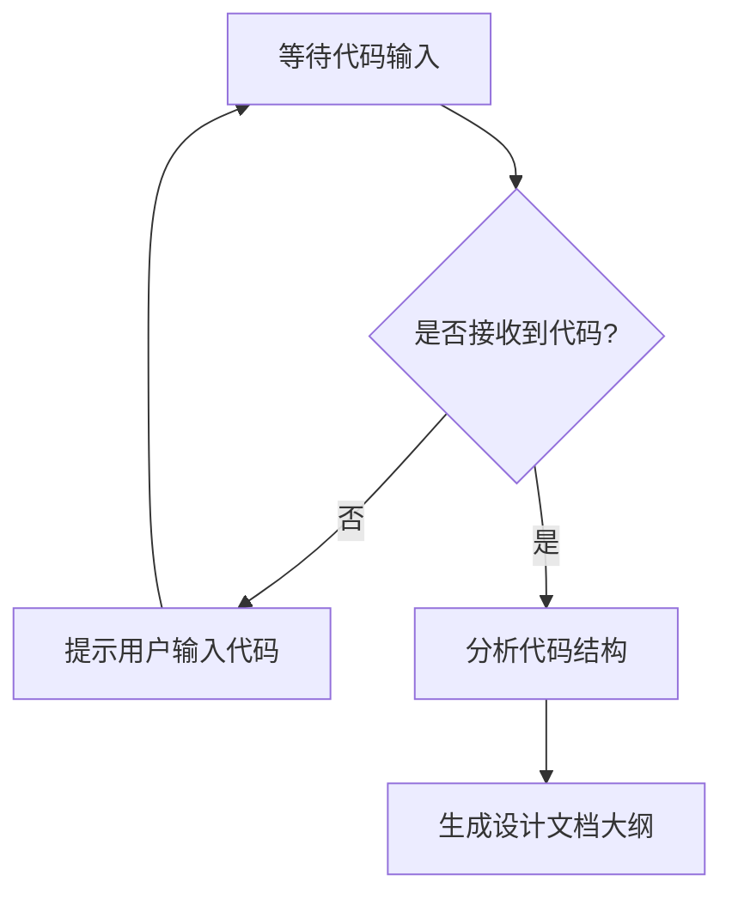

# `.\AutoGPT\classic\forge\forge\json\__init__.py` 详细设计文档

未提供源代码，无法进行分析

## 整体流程



## 类结构

```

```

## 全局变量及字段


    

## 全局函数及方法


## 关键组件


暂无内容 - 未提供源代码进行分析


## 问题及建议


### 已知问题

-   代码文件为空，未提供可分析的源代码

### 优化建议

-   请提供需要分析的代码内容，以便进行技术债务识别和优化建议


## 其它


### 设计目标与约束

描述该代码模块的设计目标、性能要求、安全性要求、兼容性要求等，以及所受到的技术约束、平台约束、时间约束等。

### 错误处理与异常设计

描述代码中错误处理的策略，包括异常类型定义、错误码体系、错误信息规范、异常传播机制、降级策略等。

### 数据流与状态机

描述数据的输入来源、处理流程、输出结果，以及可能的状态转换、状态存储、状态管理等。

### 外部依赖与接口契约

描述该代码模块依赖的外部库、服务、接口，包括依赖版本要求、接口调用规范、数据格式约定、超时重试策略等。

### 安全性设计

描述代码中的安全考虑，包括身份认证、权限控制、数据加密、输入校验、SQL注入防护、XSS防护等安全措施。

### 性能设计

描述性能相关的设计决策，包括缓存策略、连接池配置、并发控制、资源限制、性能监控点等。

### 配置管理

描述代码中的配置项、配置来源、配置加载方式、配置验证规则、配置更新机制等。

### 日志与监控

描述日志记录策略、日志级别、日志格式、监控指标、告警规则、追踪机制等。

### 测试策略

描述单元测试、集成测试、端到端测试的策略，测试覆盖率目标，测试数据准备方案等。

### 部署与运维

描述部署流程、运行环境要求、资源需求、扩容策略、备份恢复策略、运维监控要点等。

### 版本兼容性

描述版本演进策略、API版本管理、向后兼容处理、升级迁移方案等。

### 编码规范与约定

描述遵循的编码规范、命名约定、注释要求、文档规范等。

    