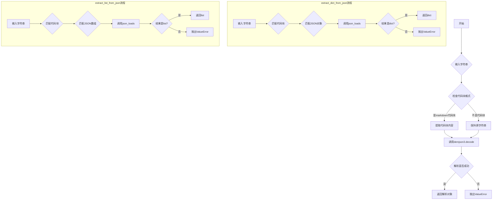
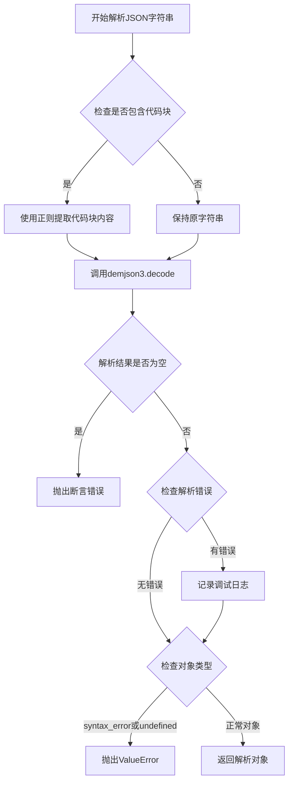
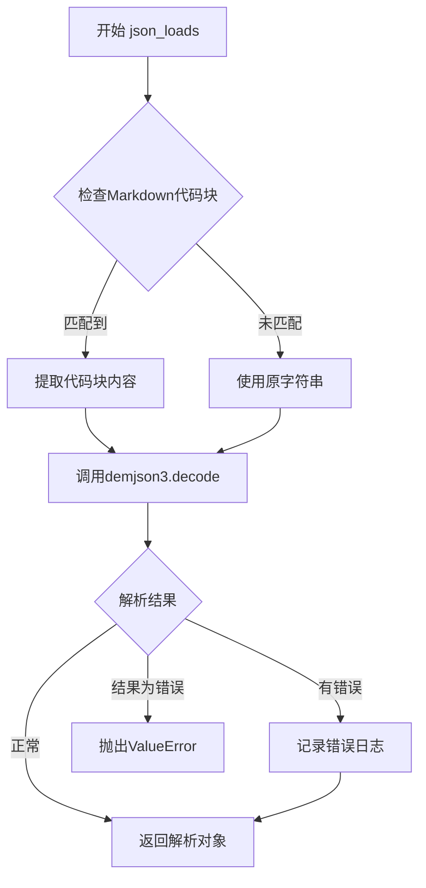
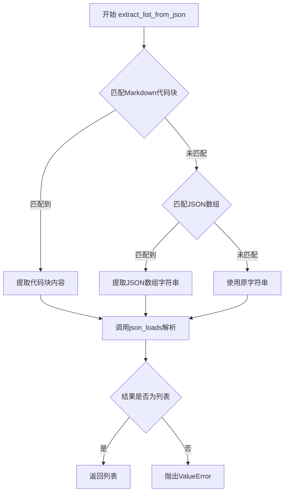

# `.\AutoGPT\classic\forge\forge\json\parsing.py` 详细设计文档

一个健壮的JSON解析工具库，通过demjson3库容忍各种JSON语法错误（如缺少逗号、多余空白、编码问题等），并提供从字符串中提取JSON对象和数组的便捷函数。

## 整体流程



## 类结构

```
该文件为函数式模块，无类定义
所有功能通过模块级函数实现
```

## 全局变量及字段


### `logger`
    
模块级日志记录器

类型：`logging.Logger`
    


    

## 全局函数及方法


### `json_loads`

该函数是一个增强型JSON解析函数，能够容忍常见的JSON语法问题（如缺失或多余的逗号、换行、空白字符、缺少闭合括号、数字格式问题、不同的编码格式以及Markdown代码块包裹等），通过正则表达式预处理后使用demjson3库进行解码，并返回解析后的JSON对象。

参数：

- `json_str`：`str`，需要解析的JSON字符串，可能包含Markdown代码块包裹或轻微的语法错误

返回值：`Any`，解析后的JSON对象（可能为字典、列表、字符串、数字、布尔值或None），与内置json.loads返回值一致

#### 流程图



#### 带注释源码

```python
def json_loads(json_str: str) -> Any:
    """Parse a JSON string, tolerating minor syntax issues:
    - Missing, extra and trailing commas
    - Extraneous newlines and whitespace outside of string literals
    - Inconsistent spacing after colons and commas
    - Missing closing brackets or braces
    - Numbers: binary, hex, octal, trailing and prefixed decimal points
    - Different encodings
    - Surrounding markdown code block
    - Comments

    Args:
        json_str: The JSON string to parse.

    Returns:
        The parsed JSON object, same as built-in json.loads.
    """
    # 定义正则表达式匹配Markdown代码块（支持json或JSON标签）
    # 捕获组(1)提取代码块内部内容
    pattern = r"```(?:json|JSON)*([\s\S]*?)```"
    # 在JSON字符串中搜索代码块模式
    match = re.search(pattern, json_str)

    # 如果找到代码块匹配，提取其内容并去除首尾空白
    if match:
        json_str = match.group(1).strip()

    # 使用demjson3的decode方法解析JSON字符串
    # return_errors=True参数确保即使有错误也返回结果而非抛出异常
    json_result = demjson3.decode(json_str, return_errors=True)
    
    # 断言确保解析结果不为None（因为设置了return_errors=True）
    assert json_result is not None  # by virtue of return_errors=True

    # 如果存在解析错误，记录到调试日志中
    if json_result.errors:
        logger.debug(
            "JSON parse errors:\n" + "\n".join(str(e) for e in json_result.errors)
        )

    # 检查解析结果是否为语法错误或未定义类型
    # 如果是，则抛出ValueError异常，包含原始字符串和错误信息
    if json_result.object in (demjson3.syntax_error, demjson3.undefined):
        raise ValueError(
            f"Failed to parse JSON string: {json_str}", *json_result.errors
        )

    # 解析成功，返回解析后的JSON对象
    return json_result.object
```


### `extract_dict_from_json`

该函数从包含 JSON 的字符串中提取 JSON 对象，支持从 Markdown 代码块中提取或直接从字符串中匹配 JSON 格式，并将其解析为 Python 字典。如果解析结果不是字典类型，则抛出 ValueError 异常。

参数：

- `json_str`：`str`，包含 JSON 内容的字符串，可能包含 Markdown 代码块或直接是 JSON 文本

返回值：`dict[str, Any]`，解析后的 Python 字典对象

#### 流程图

```mermaid
flowchart TD
    A[开始: json_str] --> B{匹配代码块模式<br/>```(?:json|JSON)*([\s\S]*?)```}
    B -->|匹配成功| C[提取代码块内容]
    B -->|匹配失败| D{匹配JSON对象模式<br/>{[\s\S]*}}
    C --> E[json_loads 解析]
    D -->|匹配成功| F[使用匹配内容]
    D -->|匹配失败| E
    F --> E
    E --> G{检查结果类型}
    G -->|是 dict| H[返回字典]
    G -->|不是 dict| I[抛出 ValueError]
```

#### 带注释源码

```python
def extract_dict_from_json(json_str: str) -> dict[str, Any]:
    """
    从字符串中提取 JSON 对象并解析为字典。
    
    该函数支持从 Markdown 代码块中提取 JSON，或者从原始字符串中
    使用正则表达式匹配 JSON 对象。
    
    Args:
        json_str: 包含 JSON 内容的字符串
        
    Returns:
        解析后的 Python 字典
        
    Raises:
        ValueError: 当解析结果不是字典类型时抛出
    """
    # 有时候响应内容包含在 Markdown 代码块中，使用 ``` 包裹
    # 正则匹配 Markdown 代码块，捕获 JSON 内容
    # 模式说明:
    #   ```        - 匹配三个反引号
    #   (?:json|JSON)* - 可选的 json 或 JSON 标记
    #   ([\s\S]*?)    - 捕获代码块内的任意内容（非贪婪）
    #   ```        - 匹配三个反引号结束
    pattern = r"```(?:json|JSON)*([\s\S]*?)```"
    match = re.search(pattern, json_str)

    if match:
        # 提取代码块内容并去除首尾空白
        json_str = match.group(1).strip()
    else:
        # 代码块未匹配时，尝试直接在字符串中查找 JSON 对象
        # 匹配从 { 到 } 的所有内容，包括换行符
        json_pattern = r"{[\s\S]*}"
        match = re.search(json_pattern, json_str)

        if match:
            # 使用匹配到的 JSON 字符串
            json_str = match.group()

    # 调用 json_loads 解析 JSON 字符串
    # json_loads 使用 demjson3 库，能够容忍一些常见的 JSON 语法问题
    result = json_loads(json_str)
    
    # 验证解析结果是否为字典类型
    # 如果不是字典，抛出明确的错误信息
    if not isinstance(result, dict):
        raise ValueError(
            f"Response '''{json_str}''' evaluated to non-dict value {repr(result)}"
        )
    return result
```


### `extract_list_from_json`

该函数用于从包含 JSON 数组的字符串中提取并解析 JSON 数组，支持处理包含在 Markdown 代码块中的 JSON 或直接嵌入在文本中的 JSON 数组，解析前会先尝试提取 JSON 内容，然后调用 json_loads 函数进行解析，最后验证解析结果是否为列表类型。

参数：

- `json_str`：`str`，包含 JSON 数组的输入字符串，可能直接是 JSON 数组，也可能包含在 Markdown 代码块中或与其他文本混合

返回值：`list[Any]`，解析后的 JSON 数组对象

#### 流程图

```mermaid
flowchart TD
    A[开始: json_str] --> B{尝试匹配代码块模式<br/>```json...```}
    B -->|匹配成功| C[提取代码块内容并去除首尾空白]
    B -->|匹配失败| D{尝试匹配JSON数组模式<br/>\[...\]}
    C --> E[调用json_loads解析字符串]
    D -->|匹配成功| F[提取JSON数组字符串]
    D -->|匹配失败| G[保持原字符串不变]
    F --> E
    G --> E
    E --> H{解析结果是否为列表?}
    H -->|是| I[返回解析后的列表]
    H -->|否| J[抛出ValueError异常]
```

#### 带注释源码

```python
def extract_list_from_json(json_str: str) -> list[Any]:
    """
    从字符串中提取并解析JSON数组。
    
    该函数首先尝试匹配Markdown代码块格式 ```json ... ```，
    如果未找到则尝试匹配纯JSON数组格式 [...]。
    解析完成后验证结果确实是列表类型。
    
    Args:
        json_str: 包含JSON数组的输入字符串
        
    Returns:
        解析后的JSON数组列表
        
    Raises:
        ValueError: 当解析结果不是列表类型时抛出
    """
    
    # 步骤1: 尝试匹配Markdown代码块格式 ```json ... ```
    # 正则表达式说明:
    # ``` - 匹配三个反引号
    # (?:json|JSON)* - 可选的json或JSON标记
    # ([\s\S]*?) - 捕获代码块内容（非贪婪匹配任意字符）
    # ``` - 匹配三个反引号结束
    pattern = r"```(?:json|JSON)*([\s\S]*?)```"
    match = re.search(pattern, json_str)
    
    if match:
        # 匹配成功，提取代码块内的内容并去除首尾空白
        json_str = match.group(1).strip()
    else:
        # 步骤2: 未找到代码块，尝试直接在字符串中查找JSON数组
        # 匹配 [...] 格式的JSON数组
        json_pattern = r"\[[\s\S]*\]"
        match = re.search(json_pattern, json_str)
        
        if match:
            # 找到JSON数组，提取出来
            json_str = match.group()
    
    # 步骤3: 调用json_loads解析JSON字符串
    # json_loads内部已经处理了各种容错情况（见其文档）
    result = json_loads(json_str)
    
    # 步骤4: 验证解析结果是否为列表类型
    if not isinstance(result, list):
        # 类型不匹配，抛出详细错误信息
        raise ValueError(
            f"Response '''{json_str}''' evaluated to non-list value {repr(result)}"
        )
    
    # 步骤5: 返回解析后的列表
    return result
```

## 关键组件


这段代码实现了一个健壮的JSON解析工具，能够容忍各种常见的JSON语法错误，并通过正则表达式从Markdown代码块或原始文本中提取JSON数据，最终将解析结果转换为Python字典或列表对象。

### 文件运行流程

程序入口为`json_loads`、`extract_dict_from_json`和`extract_list_from_json`三个导出的函数。当调用`extract_dict_from_json`或`extract_list_from_json`时，首先使用正则表达式尝试匹配并提取Markdown代码块（```json ... ```）中的JSON内容；若未匹配到代码块，则进一步使用正则表达式从字符串中提取JSON对象（{}）或数组（[]）。提取到的字符串随后传递给`json_loads`函数，该函数同样会尝试去除可能的Markdown代码块包装，然后调用`demjson3.decode`进行容错解析，并返回解析后的Python对象。

### 全局函数

#### json_loads

- **参数**: `json_str: str` - 待解析的JSON字符串
- **参数类型**: str
- **参数描述**: 需要解析的JSON字符串，可能包含Markdown代码块包装
- **返回值类型**: Any
- **返回值描述**: 解析后的Python对象（字典、列表或其他JSON类型）

**流程图**:


**源码**:
```python
def json_loads(json_str: str) -> Any:
    """Parse a JSON string, tolerating minor syntax issues:
    - Missing, extra and trailing commas
    - Extraneous newlines and whitespace outside of string literals
    - Inconsistent spacing after colons and commas
    - Missing closing brackets or braces
    - Numbers: binary, hex, octal, trailing and prefixed decimal points
    - Different encodings
    - Surrounding markdown code block
    - Comments

    Args:
        json_str: The JSON string to parse.

    Returns:
        The parsed JSON object, same as built-in json.loads.
    """
    # Remove possible code block
    pattern = r"```(?:json|JSON)*([\s\S]*?)```"
    match = re.search(pattern, json_str)

    if match:
        json_str = match.group(1).strip()

    json_result = demjson3.decode(json_str, return_errors=True)
    assert json_result is not None  # by virtue of return_errors=True

    if json_result.errors:
        logger.debug(
            "JSON parse errors:\n" + "\n".join(str(e) for e in json_result.errors)
        )

    if json_result.object in (demjson3.syntax_error, demjson3.undefined):
        raise ValueError(
            f"Failed to parse JSON string: {json_str}", *json_result.errors
        )

    return json_result.object
```

#### extract_dict_from_json

- **参数**: `json_str: str` - 包含JSON的字符串
- **参数类型**: str
- **参数描述**: 可能包含Markdown代码块或直接包含JSON对象的字符串
- **返回值类型**: dict[str, Any]
- **返回值描述**: 解析后的Python字典对象

**流程图**:


**源码**:
```python
def extract_dict_from_json(json_str: str) -> dict[str, Any]:
    # Sometimes the response includes the JSON in a code block with ```
    pattern = r"```(?:json|JSON)*([\s\S]*?)```"
    match = re.search(pattern, json_str)

    if match:
        json_str = match.group(1).strip()
    else:
        # The string may contain JSON.
        json_pattern = r"{[\s\S]*}"
        match = re.search(json_pattern, json_str)

        if match:
            json_str = match.group()

    result = json_loads(json_str)
    if not isinstance(result, dict):
        raise ValueError(
            f"Response '''{json_str}''' evaluated to non-dict value {repr(result)}"
        )
    return result
```

#### extract_list_from_json

- **参数**: `json_str: str` - 包含JSON的字符串
- **参数类型**: str
- **参数描述**: 可能包含Markdown代码块或直接包含JSON数组的字符串
- **返回值类型**: list[Any]
- **返回值描述**: 解析后的Python列表对象

**流程图**:


**源码**:
```python
def extract_list_from_json(json_str: str) -> list[Any]:
    # Sometimes the response includes the JSON in a code block with ```
    pattern = r"```(?:json|JSON)*([\s\S]*?)```"
    match = re.search(pattern, json_str)

    if match:
        json_str = match.group(1).strip()
    else:
        # The string may contain JSON.
        json_pattern = r"\[[\s\S]*\]"
        match = re.search(json_pattern, json_str)

        if match:
            json_str = match.group()

    result = json_loads(json_str)
    if not isinstance(result, list):
        raise ValueError(
            f"Response '''{json_str}''' evaluated to non-list value {repr(result)}"
        )
    return result
```

### 全局变量

#### logger

- **名称**: logger
- **类型**: logging.Logger
- **描述**: 模块级日志记录器，用于输出JSON解析过程中的错误信息

### 关键组件信息

### 1. Markdown代码块提取器

使用正则表达式`r"```(?:json|JSON)*([\s\S]*?)```"`从可能包含Markdown代码块的字符串中提取JSON内容，支持```json和```JSON两种标签。

### 2. JSON容错解析器

基于demjson3库实现，能够容忍各种非标准JSON语法，包括：缺失/多余/尾随逗号、括号不匹配、各种数字格式（二进制、十六进制、八进制）、不同编码、注释等。

### 3. JSON模式匹配器

使用正则表达式`r"{[\s\S]*}"`和`r"\[[\s\S]*\]"`从任意字符串中提取JSON对象或数组，处理字符串未包含Markdown代码块的情况。

### 4. 类型验证器

在`extract_dict_from_json`和`extract_list_from_json`中验证解析结果是否为期望的类型（dict或list），确保返回值的类型安全。

### 潜在技术债务与优化空间

1. **正则表达式性能问题**：`[\s\S]*`为贪婪匹配，在处理大型JSON字符串时可能导致回溯性能问题，应考虑使用更高效的匹配策略或分步解析。

2. **重复代码**：`extract_dict_from_json`和`extract_list_from_json`中存在大量重复的代码逻辑，可提取公共方法减少代码冗余。

3. **错误处理不一致**：`json_loads`中使用`assert`和`ValueError`混合处理错误，`extract_dict_from_json`和`extract_list_from_json`仅使用`ValueError`，应统一错误处理方式。

4. **正则表达式局限性**：JSON模式匹配`r"{[\s\S]*}"`无法正确处理嵌套的大括号，当JSON字符串中包含多层嵌套时可能提取错误。

5. **缺少输入验证**：函数未对输入进行空值检查，当传入空字符串时行为未定义。

6. **日志级别不当**：解析错误使用`logger.debug`记录，可能导致关键错误信息丢失，建议根据错误严重程度调整日志级别。

### 其它项目

#### 设计目标与约束

- **核心目标**：提供容错性强的JSON解析能力，能够处理AI模型返回的各种非标准JSON格式
- **兼容性目标**：支持Markdown代码块包装的JSON和裸JSON字符串两种输入形式

#### 错误处理与异常设计

- 解析失败时抛出`ValueError`异常，包含原始字符串和错误详情
- 使用日志记录解析过程中的警告信息（debug级别）
- 对类型不匹配的情况进行显式检查并抛出异常

#### 数据流与状态机

- 数据流：输入字符串 → 代码块提取/JSON模式匹配 → JSON解析 → 类型验证 → 返回结果
- 状态机：初始状态 → 匹配代码块 → 匹配JSON模式 → 解析 → 验证 → 结束

#### 外部依赖与接口契约

- **demjson3库**：第三方JSON解析库，提供容错JSON解析能力
- **logging模块**：Python标准库，用于日志记录
- **re模块**：Python标准库，用于正则表达式匹配
- **typing模块**：Python标准库，用于类型注解
- **公开接口**：`json_loads`、`extract_dict_from_json`、`extract_list_from_json`三个函数


## 问题及建议


### 已知问题

- **代码重复**：三个函数中都使用了相同的正则表达式 `r"```(?:json|JSON)*([\s\S]*?)```"` 来处理 Markdown 代码块，未提取为公共常量或函数
- **正则表达式贪婪匹配问题**：`json_pattern = r"{[\s\S]*}"` 和 `json_pattern = r"\[[\s\S]*\]"` 使用贪婪匹配 `[\s\S]*`，当输入包含多个 JSON 对象或数组时可能匹配到不期望的内容，且无法正确处理嵌套结构
- **Assert 用于业务逻辑**：`assert json_result is not None` 在生产环境中使用 `-O` 参数运行 Python 时会被跳过，导致逻辑失效
- **错误日志级别不当**：解析错误时使用 `logger.debug()` 记录，可能导致关键错误信息丢失
- **正则表达式未预编译**：每次调用函数都会重新编译正则表达式，影响性能
- **返回值类型注解不准确**：使用 `Any` 类型较多，缺乏更精确的类型定义
- **潜在的内存问题**：对于超大的 JSON 字符串，使用 `[\s\S]*` 正则可能引起性能问题
- **错误信息可能泄露敏感数据**：异常消息中包含原始输入 `json_str`，可能在日志中暴露敏感信息

### 优化建议

- **提取公共函数**：将 code block 提取逻辑抽取为独立函数，正则表达式预编译为模块级常量
- **改进错误处理**：用显式条件判断替代 assert，将解析错误日志级别提升为 warning 或 error
- **优化正则表达式**：使用非贪婪匹配 `[\s\S]*?`，或考虑使用 JSON 解析器结合字符串操作来处理边界情况
- **考虑性能替代方案**：如果场景允许，可考虑使用 `json5` 库或自定义容错 JSON 解析逻辑替代 demjson3
- **增强输入验证**：在正则匹配前检查字符串长度，避免对超大输入进行正则处理
- **安全考虑**：在异常信息中避免直接暴露原始输入，或提供选项控制是否包含输入内容

## 其它


### 设计目标与约束

本代码的设计目标是提供一个健壮的JSON解析工具，能够容忍各种非标准JSON格式的输入，主要服务于需要处理来自外部API或用户输入的JSON字符串的场景。核心约束包括：仅支持Python 3.9+版本（使用dict[str, Any]类型注解），依赖demjson3库进行解析，必须保持与标准json.loads返回值类型的一致性。

### 错误处理与异常设计

代码采用两种异常类型：ValueError用于表示JSON解析失败或类型不匹配，AssertionError用于内部逻辑验证。json_loads函数在解析失败时抛出ValueError，错误信息包含原始输入字符串和具体的解析错误列表。extract_dict_from_json和extract_list_from_json在解析结果类型不符合预期时抛出ValueError，并附带评估结果的具体表示。所有解析错误都会通过logger.debug记录，但不会中断执行流程。

### 外部依赖与接口契约

主要依赖包括：demjson3库（用于容忍多种JSON语法变体），Python标准库中的logging、re和typing模块。对外提供的三个函数接口契约如下：json_loads接受str返回Any，extract_dict_from_json接受str返回dict[str, Any]，extract_list_from_json接受str返回list[Any]。所有函数均不对输入字符串进行None检查，调用方需保证输入非空。

### 性能考虑

当前实现使用正则表达式进行多次匹配操作，在处理大规模数据或高频调用时可能存在性能瓶颈。建议在生产环境中对正则表达式进行预编译处理。demjson3库本身相比标准json库性能较低，对于确定性的标准JSON输入可考虑添加降级方案。

### 安全性考虑

代码仅处理字符串解析，不涉及文件操作或网络请求，安全性风险较低。但需要注意：demjson3.decode的return_errors=True模式可能允许部分恶意构造的输入通过验证，建议在关键业务场景中对输出结果进行额外的模式验证。日志输出需注意不要泄露敏感的原始数据。

### 兼容性考虑

当前代码使用Python 3.9+的类型注解语法（dict[str, Any]），对于Python 3.7-3.8版本需要修改为Dict和List的旧式注解。demjson3库在不同版本间可能存在行为差异，建议锁定具体版本号。代码处理了markdown代码块包裹的JSON场景，但未处理其他常见的包装格式如XML、YAML等。

### 使用示例

```python
# 标准JSON解析
result = json_loads('{"key": "value"}')

# 容错解析（允许尾部逗号）
result = json_loads('{"key": "value",}')

# 从混合文本中提取JSON对象
text = "Here is the response: ```json\n{\"data\": 123}\n```"
result = extract_dict_from_json(text)

# 从混合文本中提取JSON数组
text = "The list is: [1, 2, 3]"
result = extract_list_from_json(text)
```

    