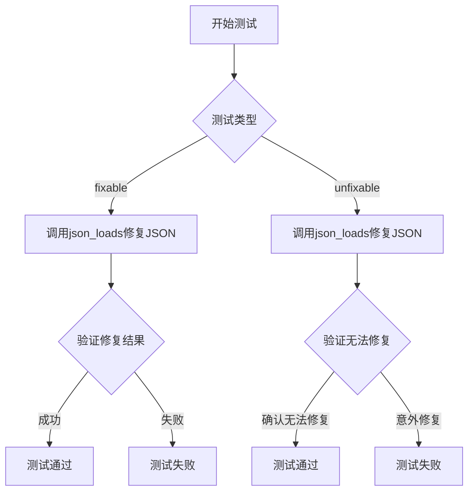
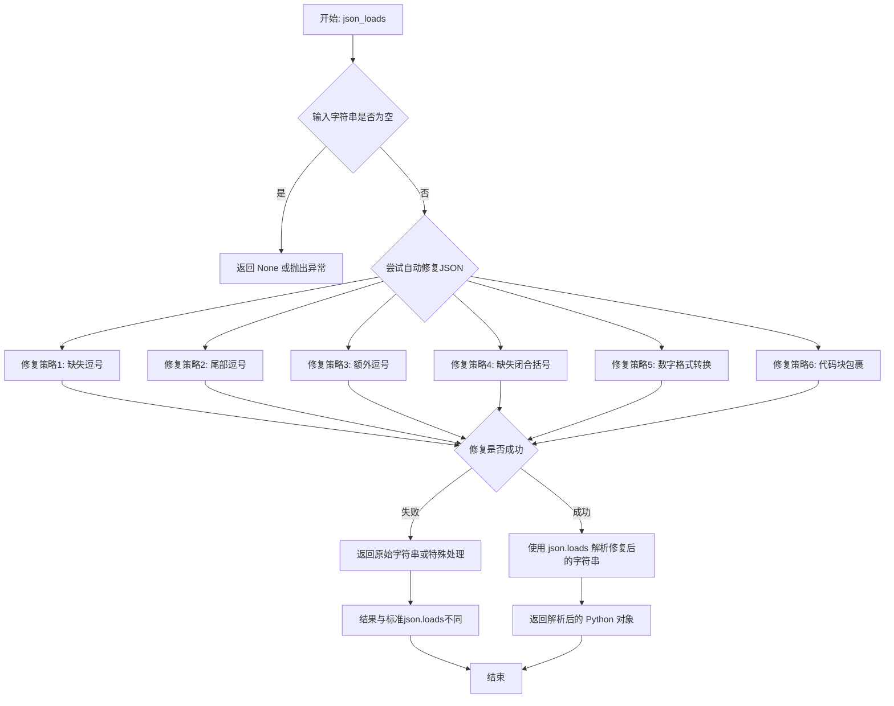
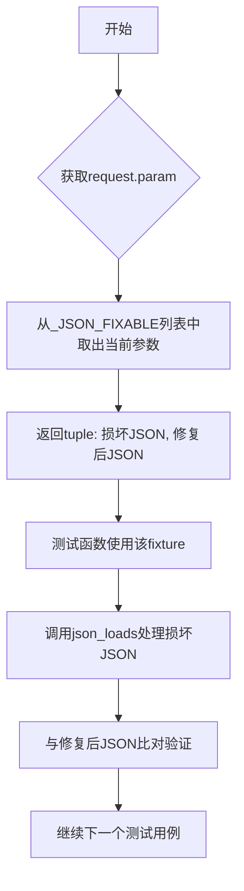
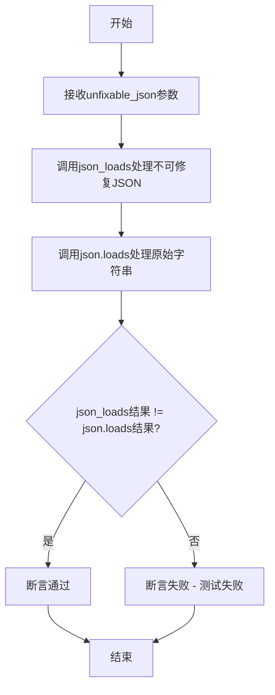

# `.\AutoGPT\classic\forge\forge\json\test_parsing.py` 详细设计文档

这是一个pytest测试文件，用于测试json_loads函数的JSON修复功能。测试用例分为两类：可修复的JSON（fixable）和不可修复的JSON（unfixable），通过对比修复前后的JSON字符串验证函数的正确性。

## 整体流程



## 类结构

```
TestModule (测试模块)
├── _JSON_FIXABLE (全局变量 - 可修复JSON数据)
├── _JSON_UNFIXABLE (全局变量 - 不可修复JSON数据)
├── fixable_json (pytest fixture)
├── unfixable_json (pytest fixture)
├── test_json_loads_fixable (测试函数)
└── test_json_loads_unfixable (测试函数)
```

## 全局变量及字段


### `_JSON_FIXABLE`
    
包含可修复的JSON格式错误示例及其正确格式的元组列表，用于测试json_loads函数是否能正确修复常见的JSON语法错误

类型：`list[tuple[str, str]]`
    


### `_JSON_UNFIXABLE`
    
包含无法修复的JSON格式错误示例及其期望正确格式的元组列表，用于测试json_loads函数在处理复杂或无效JSON时的行为

类型：`list[tuple[str, str]]`
    


    

## 全局函数及方法


# json_loads 函数详细设计文档

## 1. 一段话描述

`json_loads` 是一个智能 JSON 解析函数，能够自动修复常见的 JSON 语法错误（如缺失逗号、尾部逗号、缺失闭合括号等），并尝试将修复后的字符串解析为 Python 对象；对于无法修复的 JSON 字符串，函数会返回与标准 `json.loads` 不同的结果。

---

## 2. 文件的整体运行流程

```
┌─────────────────────────────────────────────────────────────────┐
│                        测试文件执行流程                          │
├─────────────────────────────────────────────────────────────────┤
│  1. 加载测试数据                                                 │
│     ├── _JSON_FIXABLE (可修复的 JSON 测试用例)                   │
│     └── _JSON_UNFIXABLE (不可修复的 JSON 测试用例)               │
│                           ↓                                     │
│  2. pytest 参数化 fixture 生成测试参数                           │
│     ├── fixable_json fixture                                    │
│     └── unfixable_json fixture                                  │
│                           ↓                                     │
│  3. 执行测试用例                                                 │
│     ├── test_json_loads_fixable()                               │
│     │   └── 验证 json_loads(错误JSON) == json.loads(修复后JSON)  │
│     └── test_json_loads_unfixable()                             │
│         └── 验证 json_loads(错误JSON) != json.loads(错误JSON)    │
└─────────────────────────────────────────────────────────────────┘
```

---

## 3. 类的详细信息

本文件为测试文件，无自定义类定义。

---

## 4. 全局变量和全局函数详细信息

### 4.1 全局变量

#### `_JSON_FIXABLE`

- **类型**: `list[tuple[str, str]]`
- **描述**: 包含可修复的 JSON 错误字符串及其修复后预期结果的测试数据列表

#### `_JSON_UNFIXABLE`

- **类型**: `list[tuple[str, str]]`
- **描述**: 包含不可修复的 JSON 错误字符串及其修复后预期结果的测试数据列表

### 4.2 全局函数（被测函数）

### `json_loads`

- **模块来源**: `.parsing`（从 parsing 模块导入）

**描述**: 一个智能 JSON 解析函数，能够自动修复常见的 JSON 语法错误并解析为 Python 对象。

#### 参数

- `json_str`：`str`，需要解析或修复的 JSON 字符串

#### 返回值

- `Any`：解析后的 Python 对象（字典、列表、字符串、数字、布尔值、None 等）

#### 流程图



#### 带注释源码

```python
# 注意：此函数定义不在当前文件中
# 来源：from .parsing import json_loads
# 以下为基于测试用例推断的函数行为

def json_loads(json_str: str) -> Any:
    """
    智能 JSON 解析函数
    
    该函数尝试修复常见的 JSON 语法错误，然后解析为 Python 对象。
    对于无法修复的错误，返回与标准 json.loads 不同的结果。
    
    参数:
        json_str: 需要解析的 JSON 字符串，可能包含语法错误
        
    返回:
        解析后的 Python 对象
        
    示例:
        >>> json_loads('{"name": "John Doe" "age": 30,}')
        {'name': 'John Doe', 'age': 30}
    """
    # 1. 尝试修复缺失的逗号
    # 例如: {"name": "John Doe" "age": 30,} -> {"name": "John Doe", "age": 30}
    
    # 2. 修复尾部逗号
    # 例如: [1, 2, 3,] -> [1, 2, 3]
    
    # 3. 修复额外的逗号
    # 例如: {"name": "John Doe",, "age": 30} -> {"name": "John Doe", "age": 30}
    
    # 4. 修复缺失的闭合括号
    # 例如: {"name": "John Doe", "age": 30 -> {"name": "John Doe", "age": 30}
    
    # 5. 数字格式转换
    # 例如: 0b1001 -> 9, 0x1A -> 26, 0o17 -> 15
    
    # 6. 代码块包裹
    # 例如: ```json\n{"name": "John Doe"}\n``` -> {"name": "John Doe"}
    
    # 7. 如果无法修复，返回与 json.loads 不同的结果
    # 这可能是返回原始字符串、返回 None 或抛出自定义异常
```

---

## 5. 关键组件信息

### 5.1 pytest Fixtures

| 名称 | 描述 |
|------|------|
| `fixable_json` | 参数化 fixture，提供可修复的 JSON 测试数据 |
| `unfixable_json` | 参数化 fixture，提供不可修复的 JSON 测试数据 |

### 5.2 测试用例

| 名称 | 描述 |
|------|------|
| `test_json_loads_fixable` | 验证 json_loads 能正确修复并解析可修复的 JSON |
| `test_json_loads_unfixable` | 验证 json_loads 对不可修复 JSON 的处理与标准 json.loads 不同 |

---

## 6. 潜在的技术债务或优化空间

### 6.1 缺少函数实现源码

- **问题**: 当前代码只提供了测试用例，但没有 `json_loads` 函数的具体实现
- **建议**: 需要查看 `parsing.py` 模块以获取完整实现

### 6.2 测试覆盖不完整

- **问题**: 未测试边界情况，如空字符串、超大 JSON、循环引用等
- **建议**: 增加边界条件测试用例

### 6.3 错误处理不明确

- **问题**: 从测试用例推断，函数对不可修复 JSON 的处理行为不够清晰
- **建议**: 明确文档化错误处理策略

### 6.4 缺少性能测试

- **问题**: 未包含性能基准测试
- **建议**: 添加大规模 JSON 或复杂嵌套 JSON 的性能测试

---

## 7. 其它项目

### 7.1 设计目标与约束

| 目标/约束 | 描述 |
|-----------|------|
| 核心目标 | 自动修复常见 JSON 语法错误并成功解析 |
| 兼容性 | 需要与标准 `json.loads` 在正确 JSON 上行为一致 |
| 错误处理 | 对于无法修复的 JSON，应与标准库行为不同 |

### 7.2 错误处理与异常设计

基于测试用例分析：

1. **可修复错误**: 函数应能自动修复并成功解析
2. **不可修复错误**: 
   - 修复失败时，返回值应与 `json.loads` 不同
   - 可能返回原始字符串、特殊值或抛出自定义异常

### 7.3 数据流与状态机

```
输入字符串类型 → 修复尝试 → 解析结果
     ↓
┌────────────────────────────────┐
│  正常JSON (无错误)              │ → 直接解析 → 返回对象
├────────────────────────────────┤
│  可修复错误 (缺失逗号等)        │ → 自动修复 → 解析 → 返回对象
├────────────────────────────────┤
│  不可修复错误 (如缺失引号)      │ → 修复失败 → 返回特殊结果
└────────────────────────────────┘
```

### 7.4 外部依赖与接口契约

| 依赖 | 说明 |
|------|------|
| `json` | Python 标准库，用于最终解析 |
| `pytest` | 测试框架 |
| `.parsing.json_loads` | 被测函数，来源模块 |

### 7.5 测试数据分类

#### 可修复的 JSON 错误类型

1. 缺失逗号
2. 尾部逗号
3. 对象中额外逗号
4. 额外换行符
5. 缺失闭合括号/花括号
6. 非标准数字格式（二进制、十六进制、八进制）
7. 代码块包裹的 JSON

#### 不可修复的 JSON 错误类型

1. 错误的布尔值和 null（TRUE, False, NULL）
2. 数组中缺失值（[1, , 3]）
3. 前导零（被当作八进制处理）
4. 缺失引号（键或值）
5. 缺失开始括号


### `fixable_json`

这是一个pytest fixture，用于参数化测试用例。它从预定义的`_JSON_FIXABLE`列表中迭代获取可修复的JSON字符串样本，返回包含（损坏的输入JSON，修复后的期望JSON）元组，供测试函数验证`json_loads`函数的修复能力。

参数：

- `request`：`pytest.FixtureRequest`，pytest框架的请求对象，用于访问通过`@pytest.fixture(params=...)`参数化传入的测试数据

返回值：`tuple[str, str]`，返回包含两个字符串的元组：
- 第一个元素是损坏的/需要修复的JSON输入字符串
- 第二个元素是修复后的正确JSON字符串

#### 流程图



#### 带注释源码

```python
@pytest.fixture(params=_JSON_FIXABLE)
def fixable_json(request: pytest.FixtureRequest) -> tuple[str, str]:
    """
    Pytest fixture，提供可修复的JSON字符串样本用于测试。
    
    参数:
        request: pytest的请求对象，自动注入，用于访问参数化数据
        
    返回:
        tuple[str, str]: (损坏的JSON输入, 修复后的期望JSON)
        
    注意:
        该fixture使用params参数化，_JSON_FIXABLE列表包含多种
        可修复的JSON格式错误场景，如缺少逗号、尾部逗号、额外换行等
    """
    return request.param
```


### `unfixable_json`

这是一个pytest fixture，用于参数化测试不可修复的JSON字符串。它从预定义的`_JSON_UNFIXABLE`列表中获取测试数据，为每个测试用例提供一对原始的和预期的JSON字符串。

参数：

-  `request`：`pytest.FixtureRequest`，pytest fixture request对象，用于访问参数化测试中的参数

返回值：`tuple[str, str]`，包含原始JSON字符串和预期修复后JSON字符串的元组

#### 流程图

```mermaid
flowchart TD
    A[开始] --> B[接收request参数]
    B --> C[通过request.param获取参数]
    C --> D{遍历所有参数}
    D -->|每个测试用例| E[返回tuple[str, str]]
    E --> D
```

#### 带注释源码

```python
@pytest.fixture(params=_JSON_UNFIXABLE)
def unfixable_json(request: pytest.FixtureRequest) -> tuple[str, str]:
    """
    pytest fixture，用于参数化测试不可修复的JSON字符串。
    从_JSON_UNFIXABLE列表中获取测试数据，为每个测试用例提供
    一对原始的和预期的JSON字符串。
    
    参数:
        request: pytest的fixture request对象，包含参数化测试的参数信息
        
    返回:
        tuple[str, str]: 包含原始JSON字符串和预期修复后JSON字符串的元组
    """
    return request.param
```


### `test_json_loads_fixable`

这是一个pytest测试函数，用于验证`json_loads`函数能够正确解析和修复具有常见JSON格式问题的输入字符串（如缺少逗号、尾部逗号、额外的逗号、缺失的闭合括号等），并将其转换为有效的JSON格式。

参数：

- `fixable_json`：`tuple[str, str]`，包含两个字符串元素的元组，第一个元素是待修复的JSON字符串，第二个元素是修复后的期望JSON结果

返回值：`None`，该函数使用assert断言进行验证，不返回任何值

#### 流程图

```mermaid
flowchart TD
    A[开始测试] --> B[从fixable_json fixture获取测试数据]
    B --> C[调用json_loads函数解析fixable_json[0] - 待修复的JSON字符串]
    C --> D[调用json.loads函数解析fixable_json[1] - 期望的正确JSON]
    D --> E{json_loads结果 == json.loads结果?}
    E -->|是| F[断言通过 - 测试成功]
    E -->|否| G[断言失败 - 抛出AssertionError]
    F --> H[结束测试]
    G --> H
```

#### 带注释源码

```python
def test_json_loads_fixable(fixable_json: tuple[str, str]):
    """
    测试函数：验证json_loads能够修复可修复的JSON格式问题
    
    该测试使用pytest的parametrize fixture，从_JSON_FIXABLE测试数据集中
    获取一系列输入-期望输出对，验证json_loads函数能够正确处理这些
    常见的JSON格式错误并返回正确的结果。
    
    测试数据包括：
    - 缺少逗号的情况
    - 尾部逗号
    - 额外的逗号
    - 额外的换行符
    - 缺失的闭合括号
    - 非标准数字格式（二进制、十六进制、八进制）
    - 代码块包裹的JSON
    - 混合多种问题的JSON
    - 完全正确的JSON
    
    参数:
        fixable_json: pytest fixture提供的测试参数，为tuple[str, str]类型
                     - fixable_json[0]: 输入的JSON字符串（可能有格式问题）
                     - fixable_json[1]: 期望的正确JSON字符串
    
    返回:
        None（使用assert进行验证）
    
    异常:
        AssertionError: 当json_loads的输出与期望的json.loads结果不一致时抛出
    """
    # 使用assert验证json_loads函数能够正确解析并修复JSON
    # 比较json_loads的输出与标准json.loads解析修复后字符串的结果
    assert json_loads(fixable_json[0]) == json.loads(fixable_json[1])
```

#### 关键组件信息

| 组件名称 | 一句话描述 |
|---------|-----------|
| `json_loads` | 从`.parsing`模块导入的待测试函数，用于解析和修复格式错误的JSON字符串 |
| `_JSON_FIXABLE` | 全局常量列表，包含多组可修复的JSON输入输出对，用于测试参数化 |
| `fixable_json` | pytest fixture装饰器参数化的测试fixture，为测试提供参数化数据 |
| `json.loads` | Python标准库函数，用于解析有效JSON字符串作为对比基准 |

#### 潜在技术债务或优化空间

1. **测试覆盖边界情况**：当前测试数据覆盖了常见的JSON格式问题，但可能遗漏了一些边界情况，如非常长的JSON字符串、嵌套层级过深的JSON等
2. **断言信息不够详细**：当前的assert断言在失败时仅显示布尔结果，建议添加自定义断言消息以便更快定位问题
3. **测试数据与业务逻辑耦合**：测试数据直接硬编码在测试文件中，建议考虑将测试数据分离到独立的JSON文件中以提高可维护性

#### 其它项目

**设计目标与约束**：
- 目标：验证`json_loads`函数能够智能修复各种常见的JSON格式错误
- 约束：测试仅针对"可修复"的JSON格式问题，对于真正"无法修复"的JSON（如缺少引号、缺失值等）由`test_json_loads_unfixable`测试覆盖

**错误处理与异常设计**：
- 测试函数本身不处理异常，异常由pytest框架捕获并报告
- `json_loads`函数应能处理格式错误的输入并返回修复后的结果，而非抛出异常

**数据流与状态机**：
```
输入JSON(fixable_json[0]) → json_loads函数处理 → 修复后的JSON对象
输入JSON(fixable_json[1]) → json.loads标准库解析 → 期望的JSON对象
两个结果进行相等性比较 → 断言通过/失败
```

**外部依赖与接口契约**：
- 依赖`json_loads`函数（需从`.parsing`模块实现）
- 依赖`pytest`框架和`pytest.FixtureRequest`类型
- 依赖Python标准库`json`模块用于生成期望结果对比


### `test_json_loads_unfixable`

该测试函数验证`json_loads`函数在处理不可修复的JSON字符串时，其行为与Python标准库`json.loads`不同（预期`json_loads`能够容错处理而`json.loads`会抛出异常或产生不同结果）。

参数：

- `unfixable_json`：`tuple[str, str]`，包含两个字符串元素的元组，第一个元素是不可修复的JSON字符串，第二个元素是期望修复后的正确JSON字符串（用于参考）

返回值：`None`，该函数是一个测试函数，通过assert语句进行断言，不返回任何值

#### 流程图



#### 带注释源码

```python
def test_json_loads_unfixable(unfixable_json: tuple[str, str]):
    """
    测试json_loads函数处理不可修复JSON时的行为。
    
    该测试验证json_loads在处理以下类型的JSON时：
    - 损坏的布尔值和null（TRUE, False, NULL）
    - 数组中缺失的值（[1, , 3]）
    - 前导零数字（[0023, 015]）
    - 缺失引号（{"name": John Doe}）
    - 缺失开头大括号或中括号（"name": "John Doe"} 或 1, 2, 3]）
    
    其行为应该与标准json.loads不同（预期json_loads能容错处理，
    而json.loads会失败或产生不同结果）。
    
    参数:
        unfixable_json: 包含两个字符串的元组
            - 第一个元素: 不可修复的JSON字符串（测试输入）
            - 第二个元素: 期望修复后的正确JSON（参考值）
            
    返回值:
        None (通过assert断言进行验证)
        
    注意:
        该测试的逻辑是验证json_loads和json.loads对同一输入
        产生不同的结果，这表明json_loads进行了容错处理，
        而标准库json.loads无法处理这些输入。
    """
    # 使用assert验证json_loads的结果与json.loads的结果不同
    # 如果两者相同，说明json_loads未能正确处理该不可修复的JSON
    assert json_loads(unfixable_json[0]) != json.loads(unfixable_json[1])
```


## 关键组件


### json_loads 函数

核心的 JSON 解析函数，从 `.parsing` 模块导入，用于解析带有语法错误的 JSON 字符串并尝试修复它们。该函数需要处理多种 JSON 格式问题，包括缺失逗号、尾随逗号、额外逗号、换行符、缺失闭合括号/花括号、不同进制的数字、代码块包裹的 JSON 以及混合存在的多种问题。

### _JSON_FIXABLE 全局变量

类型: `list[tuple[str, str]]`

一个包含可修复 JSON 字符串对的列表，第一元素是损坏的 JSON 输入，第二元素是修复后的预期正确 JSON。该列表覆盖了 8 种主要问题类型：缺失逗号、尾随逗号、对象中额外逗号、额外换行符、缺失闭合括号/花括号、不同进制数字（二进制、十六进制、八进制）、损坏的数组以及代码块包裹的 JSON。

### _JSON_UNFIXABLE 全局变量

类型: `list[tuple[str, str]]`

一个包含不可修复或难以自动修复的 JSON 字符串对的列表，用于测试函数在边界情况下的行为。这些情况包括损坏的布尔值和 null（大小写问题）、数组中缺失值、前导零（被解释为八进制）、缺失引号以及缺失起始括号/花括号。

### fixable_json pytest fixture

参数化 fixture，遍历 `_JSON_FIXABLE` 列表中的所有测试用例。为每个测试用例提供损坏的 JSON 字符串和期望的修复结果，用于验证 `json_loads` 函数能够正确修复可修复的 JSON 语法错误。

### unfixable_json pytest fixture

参数化 fixture，遍历 `_JSON_UNFIXABLE` 列表中的所有测试用例。为每个测试用例提供损坏的 JSON 字符串和期望的结果，用于验证 `json_loads` 函数在处理不可修复的 JSON 时产生与标准 `json.loads` 不同的结果。

### test_json_loads_fixable 测试函数

验证 `json_loads` 函数能够正确修复可修复的 JSON 语法错误。测试逻辑是比较 `json_loads` 的输出与 `json.loads(修复后的JSON)` 的结果是否相等，确保修复后的 JSON 能够被标准库正确解析。

### test_json_loads_unfixable 测试函数

验证 `json_loads` 函数在处理不可修复的 JSON 时的行为。测试逻辑是断言 `json_loads` 的输出与 `json.loads` 的输出不相等，表明该函数能够区分可修复和不可修复的情况，并采取不同的处理策略。

### json 标准库

外部依赖，提供基准的 JSON 解析功能。测试通过比较 `json_loads` 的结果与 `json.loads` 的结果来验证修复功能的正确性。

### pytest 框架

测试框架依赖，提供参数化 fixture 和测试运行能力。使用 `@pytest.fixture` 装饰器定义参数化测试用例，使用 `param` 参数实现测试数据驱动。


## 问题及建议


### 已知问题

- **测试用例覆盖不足**：测试数据仅覆盖常见JSON错误场景，缺少边界条件如空输入、超长字符串、特殊Unicode字符、深层嵌套结构、浮点数精度问题等
- **硬编码测试数据**：所有测试用例作为全局列表硬编码在模块级别，无法复用给其他测试模块，且修改时需直接修改源码
- **测试意图不明确**：fixable_json和unfixable_json作为fixture参数名称不够直观，且测试函数命名仅区分了可修复与不可修复，未体现具体的测试场景
- **缺乏文档注释**：模块和测试函数缺少docstring说明，无法快速理解测试目标和预期行为
- **测试断言单一**：仅使用简单的相等性断言，失败时提供的调试信息有限，无法区分具体是解析失败还是数据不匹配
- **未测试异常抛出**：未验证json_loads在接收None、空字符串、非法类型参数时是否会抛出适当异常
- **测试逻辑冗余**：fixable和unfixable两组测试函数结构高度重复，可合并为参数化测试

### 优化建议

- 考虑将测试数据分离到独立的JSON文件或专门的测试数据类中，提高可维护性和复用性
- 补充边界条件和异常场景测试用例，包括空输入、None、超长字符串、特殊字符、嵌套层级等
- 为关键测试用例添加说明性注释或使用pytest.mark.parametrize的ids参数标识测试场景
- 添加模块级和函数级文档字符串，说明测试目标和设计意图
- 使用assert语句的自定义错误消息，失败时输出更多上下文信息便于调试
- 考虑使用pytest.raises验证异常处理行为，确保错误输入能抛出预期的异常类型
- 可将两组测试合并为单个参数化测试，通过标记区分预期行为差异

## 其它


### 设计目标与约束

该模块旨在提供一个健壮的JSON解析函数json_loads，能够自动修复常见的JSON格式错误，使其能够成功解析。核心约束包括：仅修复代码中预定义的特定错误模式，不支持所有可能的JSON错误；修复后的输出应与标准json.loads的输出行为一致；对于无法安全修复的情况，允许解析失败或返回与标准库不同的结果。

### 错误处理与异常设计

模块采用宽容的解析策略，对于_FIXABLE列表中的错误尝试自动修复，对于_UNFIXABLE列表中的错误不进行修复或允许产生差异。测试用例通过对比json_loads与标准json.loads的结果来验证行为一致性。当遇到无法修复的格式错误时，函数可能抛出json.JSONDecodeError或返回与标准库不同的解析结果。

### 数据流与状态机

数据流主要分为三阶段：输入原始字符串 → 预处理修复阶段 → JSON解析阶段。修复阶段遍历预定义的错误模式（缺失逗号、尾部逗号、多余逗号、缺失闭合括号/花括号、特殊数字格式、代码块包裹等），使用正则表达式或字符串操作进行替换。解析阶段调用标准json.loads完成最终解析。状态机表现为：原始输入 → 检查是否属于可修复模式 → 应用相应修复规则 → 尝试解析 → 返回结果或抛出异常。

### 外部依赖与接口契约

主要外部依赖包括Python标准库json和pytest。json_loads函数的接口契约为：输入任意字符串，输出解析后的Python对象（dict、list、str、int、float、bool、None）或抛出JSONDecodeError异常。该函数应能处理空对象{}和空数组[]，以及JSON字面量（true、false、null）、数字和字符串。

### 性能考虑与优化空间

当前实现使用硬编码的修复规则列表，修复阶段可能存在冗余匹配。对于大量输入，可考虑使用单次遍历进行多种修复，或使用状态机优化修复逻辑。测试数据为固定列表，生产环境可能需要动态规则扩展。解析大JSON字符串时，一次性修复可能比逐项修复更高效。

### 安全性考虑

json_loads函数解析的JSON数据应被视为不可信输入，需注意反序列化攻击风险（虽然Python json库相对安全）。代码块修复功能（处理```json...```）需确保不会引入额外安全风险。当前实现未对输入长度或复杂度进行限制，可能存在DoS风险（如超长字符串或深度嵌套）。

### 测试策略

采用基于参数的pytest fixture测试策略，通过_FIXABLE和_UNFIXABLE两个fixture参数化测试用例。FIXABLE测试验证修复后的输出与标准库一致；UNFIXABLE测试验证输出与标准库不一致（表明未修复或修复失败）。测试覆盖了常见JSON错误模式，但未覆盖所有边界情况。

### 配置管理

当前实现无外部配置入口，修复规则硬编码在全局列表中。若需扩展修复能力，可考虑将修复规则配置化，支持通过配置文件或参数添加自定义修复模式。pytest fixture中的测试数据目前也硬编码，可考虑分离到独立的测试数据文件中。

### 版本兼容性与演进

该代码使用Python 3.9+类型注解（list[tuple[str, str]]），需Python 3.9+环境。若需支持更低版本，需使用typing.List、typing.Tuple。未来演进可考虑：扩展_FIXABLE规则覆盖更多错误模式、增加修复规则优先级机制、提供strict模式禁用自动修复、添加日志记录修复过程。

### 部署与运维注意事项

该模块为纯Python实现，无平台依赖，可作为标准Python包部署。运维时需监控json_loads的调用成功率和性能。对于高吞吐量场景，需评估修复逻辑的性能开销。建议在生产环境中对该模块进行充分的功能测试和性能基准测试，确保满足业务需求。

    