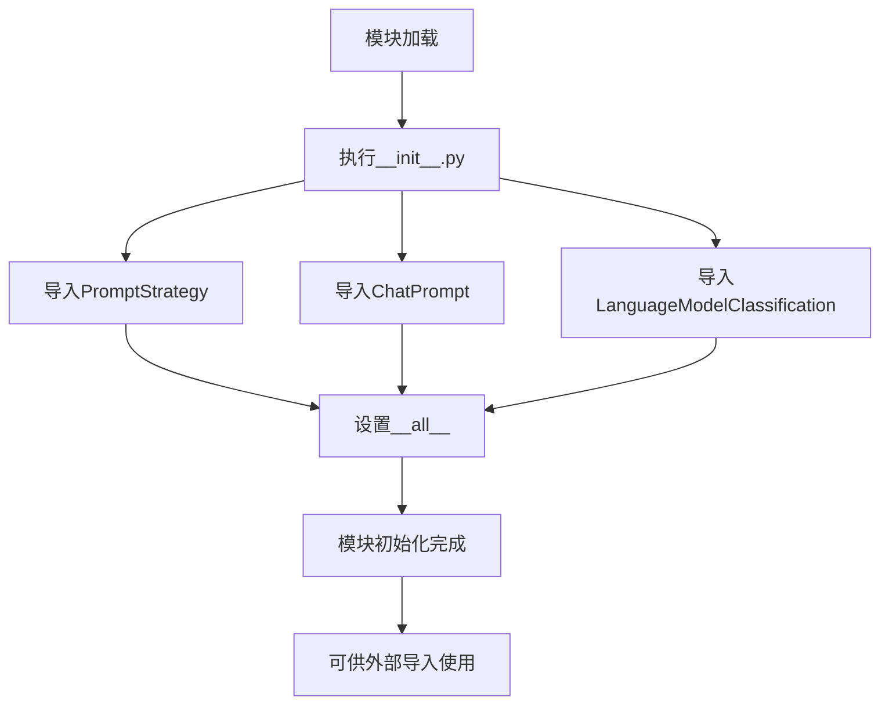

# `.\AutoGPT\classic\forge\forge\llm\prompting\__init__.py` 详细设计文档

这是一个Python包的初始化文件，作为提示词策略（Prompt Strategy）模块的入口点，它从base模块导入PromptStrategy类，从schema模块导入ChatPrompt和LanguageModelClassification，并通过__all__定义公开的API接口，供外部模块使用。

## 整体流程



## 类结构

```
PromptStrategy (基类/抽象类)
├── (由base模块定义的具体策略类)
ChatPrompt (数据结构类)
LanguageModelClassification (枚举/数据类型类)
```

## 全局变量及字段


### `__all__`
    
定义模块的公共API，指定哪些名称可以被from module import *导入

类型：`List[str]`
    


    

## 全局函数及方法


## 关键组件


### PromptStrategy

从base模块导入的提示策略基类，定义提示生成和优化的抽象接口，供具体的提示策略实现继承。

### ChatPrompt

从schema模块导入的聊天提示数据结构，可能包含对话上下文、消息列表、角色定义等用于构建LLM输入的schema定义。

### LanguageModelClassification

从schema模块导入的语言模型分类枚举或类，用于标识不同类型的语言模型（如GPT、Claude等），可能包含模型能力分级或厂商分类信息。

### 包初始化与模块导出机制

该`__init__.py`文件作为包的入口点，使用`__all__`显式定义公开导出的API，实现模块间的解耦和清晰的接口边界。


## 问题及建议


### 已知问题

- **缺少模块文档字符串**：`__init__.py` 文件没有任何文档说明该模块的用途、职责和设计意图
- **导入来源不明确**：从 `.base` 和 `.schema` 导入，但未在代码中体现这些模块的具体职责边界
- **`__all__` 定义可能不完整**：仅导出三个类，但未说明是否有其他需要公开的函数或常量被遗漏
- **无版本和元数据信息**：缺少 `__version__`、`__author__` 等常见模块级元数据
- **类型注解缺失**：未使用类型注解（typing）来明确导入对象的类型
- **抽象接口未明确标识**：从命名看 `PromptStrategy` 应为抽象基类，但未使用 `abc` 模块或协议进行显式标记

### 优化建议

- 为模块添加文档字符串，说明这是 Prompt 策略框架的核心入口
- 添加 `__all__` 的注释说明，解释各导出项的用途
- 考虑添加 `__version__` 版本信息以便版本追踪
- 若 `PromptStrategy` 为抽象基类，使用 `abc.ABC` 或 `typing.Protocol` 明确标记
- 可添加类型注解：`from .base import PromptStrategy as PromptStrategy` 后添加类型提示
- 在模块文档中说明各子模块（base、schema）的职责划分


## 其它


### 项目概述

该代码是一个Python包的初始化文件（__init__.py），主要功能是作为prompt策略模块的入口点，统一导出三个核心类：PromptStrategy（提示策略基类）、ChatPrompt（聊天提示类）和LanguageModelClassification（语言模型分类类），供外部模块使用。

### 设计目标与约束

1. **模块化设计**：通过统一的入口文件封装内部实现细节，外部调用者只需关注本模块导出的公共接口
2. **接口标准化**：定义PromptStrategy作为所有提示策略的基类，强制子类实现统一的方法签名
3. **类型安全**：使用类型提示（Type Hints）确保API调用的类型正确性
4. **最小依赖原则**：本模块仅依赖base和schema两个内部子模块，无外部复杂依赖

### 外部依赖与接口契约

| 依赖模块 | 导入内容 | 契约说明 |
|---------|---------|---------|
| .base | PromptStrategy | 抽象基类，定义提示策略的标准接口 |
| .schema | ChatPrompt, LanguageModelClassification | 数据模型类，用于提示构建和模型分类 |

### 模块职责

本模块承担以下职责：
1. **统一导出**：集中管理模块的公共API，通过__all__明确允许导入的成员
2. **命名空间组织**：将相关的提示策略类组织在同一包下
3. **版本兼容**：作为包的入口点，可在此处进行版本检查和兼容性处理

### 使用场景

该模块通常在以下场景中使用：
- 构建基于大语言模型的聊天应用时，用于管理和切换不同的提示策略
- 需要对语言模型进行分类（如GPT、Claude、Gemini等）时，使用LanguageModelClassification
- 实现自定义提示策略时，继承PromptStrategy基类

### 错误处理与异常设计

由于本文件仅为导入声明，不涉及运行时逻辑，因此主要的错误处理在于：
1. 导入时的ModuleNotFoundError：如果base或schema模块不存在，会在导入时抛出此异常
2. ImportError：如果尝试导入__all__中未列出的成员，会抛出ImportError

### 潜在扩展点

1. **策略注册机制**：可添加策略工厂类，自动注册和管理所有可用的PromptStrategy子类
2. **配置管理**：可添加默认策略配置，支持从配置文件加载策略参数
3. **中间件支持**：可添加策略执行的前后置钩子，用于日志记录、性能监控等
4. **缓存机制**：可添加提示模板缓存，提高重复调用的性能
5. **版本演进**：可添加版本兼容层，支持不同版本的LanguageModelClassification

### 技术债务与优化建议

1. **文档完善**：建议为每个导出的类添加详细的文档字符串（Docstring）
2. **类型注解增强**：可添加更详细的类型注解，如泛型支持
3. **单元测试**：需要为base和schema模块添加完整的单元测试覆盖
4. **依赖版本管理**：建议添加版本约束，防止依赖模块的破坏性更新
5. **性能监控**：在大型应用中，可考虑添加导入时间的性能监控

    