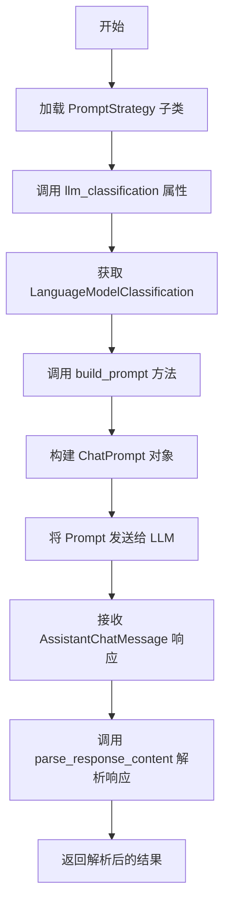
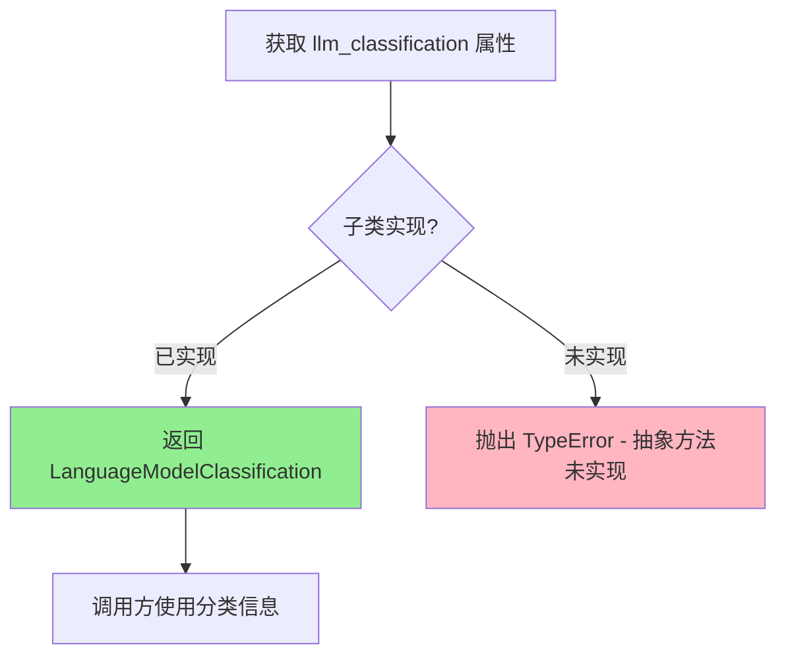
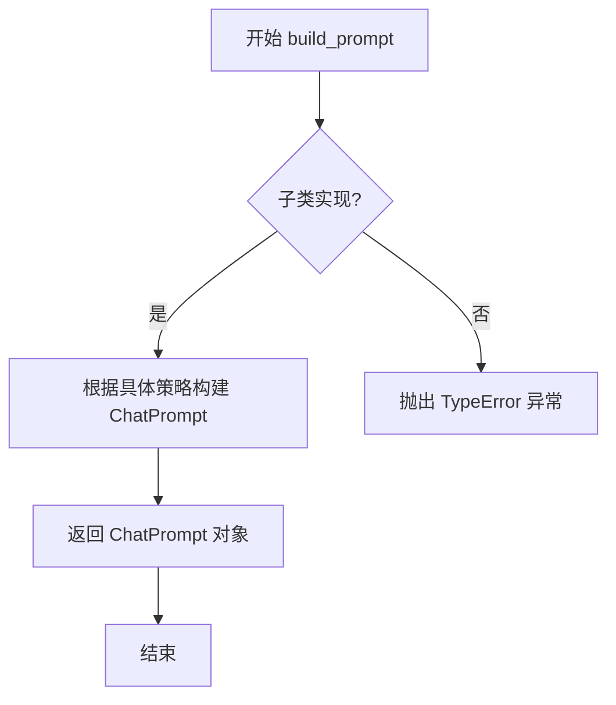
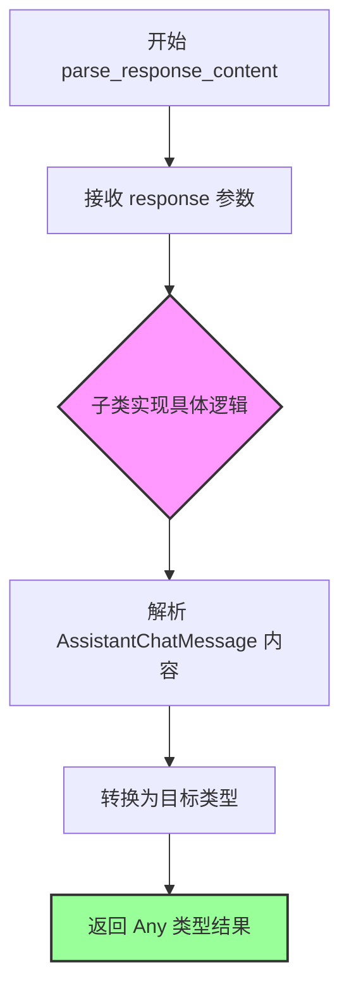

# `.\AutoGPT\classic\forge\forge\llm\prompting\base.py` 详细设计文档

这是一个抽象基类 PromptStrategy，定义了与大语言模型(LLM)交互的提示词策略模式，提供了构建提示词、解析响应内容和获取模型分类的抽象接口。

## 整体流程



## 类结构

```
PromptStrategy (抽象基类)
```

## 全局变量及字段


    

## 全局函数及方法


### `PromptStrategy.llm_classification`

该属性是 `PromptStrategy` 抽象类中的一个抽象属性，用于返回当前提示策略所对应的语言模型分类（Classification），使得系统能够根据不同的策略识别其所使用的语言模型类型。

参数：

- （无参数，该属性不接受任何输入）

返回值：`LanguageModelClassification`，返回当前提示策略所对应的语言模型分类类型，用于标识该策略关联的语言模型种类。

#### 流程图



#### 带注释源码

```python
@property
@abc.abstractmethod
def llm_classification(self) -> LanguageModelClassification:
    """
    抽象属性：获取当前提示策略的语言模型分类
    
    该属性是一个抽象属性（使用 @property 和 @abc.abstractmethod 装饰），
    要求子类必须实现此属性以返回对应的语言模型分类。
    
    返回值:
        LanguageModelClassification: 当前策略所对应的语言模型分类枚举值，
        用于标识策略所关联的语言模型类型（如 GPT-4、Claude、Gemini 等）
    
    注意:
        - 子类必须实现此属性，否则实例化时会抛出 TypeError
        - 该属性被设计为只读属性，不接受任何参数
        - 返回值用于后续的模型选择、提示词构建等逻辑判断
    """
    ...
```


### `PromptStrategy.build_prompt`

构建提示词的抽象方法，由子类实现具体逻辑，用于根据当前策略生成对应的聊天提示（ChatPrompt），以供语言模型使用。

参数：

- `*_`：`Any`，可变位置参数，接收任意数量的位置参数（当前未使用，保留为占位符以保持接口兼容性）
- `**kwargs`：`Dict[str, Any]`，可变关键字参数，接收任意数量的键值对参数，用于传递构建提示词所需的上下文信息（如用户输入、历史消息、配置参数等）

返回值：`ChatPrompt`，返回构建完成的聊天提示对象，包含用于调用语言模型的完整提示内容

#### 流程图



#### 带注释源码

```python
@abc.abstractmethod
def build_prompt(self, *_, **kwargs) -> ChatPrompt:
    """
    构建聊天提示的抽象方法。
    
    该方法由子类具体实现，用于根据特定的提示策略
    生成对应的 ChatPrompt 对象。子类需要覆盖此方法
    来定义具体的提示构建逻辑。
    
    Args:
        *_: 可变位置参数，当前未使用，保留以保持接口兼容性。
        **kwargs: 可变关键字参数，传递构建提示所需的上下文信息，
                  如用户输入、历史对话、配置参数等。
    
    Returns:
        ChatPrompt: 构建完成的聊天提示对象，包含提示内容、
                   消息历史或其他用于语言模型调用的信息。
    
    Note:
        这是一个抽象方法，子类必须实现此方法。
        由于使用了 *args 和 **kwargs，设计上允许子类接收
        任意参数，提供了最大的灵活性。
    """
    ...
```


### `PromptStrategy.parse_response_content`

该方法是抽象类 `PromptStrategy` 中的抽象方法，定义了解析语言模型（LLM）返回响应内容的接口契约。子类需要实现此方法，将 `AssistantChatMessage` 类型的原始响应转换为业务需要的任意格式数据。

参数：

- `response`：`AssistantChatMessage`，来自语言模型提供商的聊天消息对象，包含模型生成的原始响应内容

返回值：`Any`，解析后的业务数据，具体类型取决于子类实现，可能为字符串、字典、结构化对象等任意形式

#### 流程图



#### 带注释源码

```python
@abc.abstractmethod
def parse_response_content(self, response: "AssistantChatMessage") -> Any:
    """
    解析语言模型返回的响应内容。
    
    这是一个抽象方法，定义了响应解析的统一接口。
    子类必须实现此方法，将原始的聊天消息转换为业务所需的格式。
    
    参数:
        response (AssistantChatMessage): 
            来自 LLM 提供商的聊天消息对象，通常包含
            text、content、tool_calls 等属性
            
    返回值:
        Any: 
            解析后的业务数据。具体类型由子类实现决定，
            可能是纯文本、JSON 对象、结构化数据模型等
            
    示例:
        # 子类实现示例
        def parse_response_content(self, response: "AssistantChatMessage") -> str:
            return response.text
            
        # 另一种实现
        def parse_response_content(self, response: "AssistantChatMessage") -> dict:
            return {"content": response.content, "role": response.role}
    """
    ...  # 抽象方法，子类必须实现
```

## 关键组件


### PromptStrategy

一个抽象基类，定义了与大语言模型交互的提示词策略接口，包含模型分类、提示词构建和响应解析三个核心抽象方法。

### llm_classification

抽象属性，返回 LanguageModelClassification 枚举值，用于标识当前策略适用的语言模型分类。

### build_prompt

抽象方法，接受任意位置参数和关键字参数，返回 ChatPrompt 对象，用于根据具体业务场景构建提示词。

### parse_response_content

抽象方法，接受 AssistantChatMessage 类型的响应对象，返回 Any 类型解析结果，用于将大语言模型的原始输出转换为结构化数据。

### ChatPrompt

从 schema 模块导入的数据类，定义提示词的结构化表示。

### LanguageModelClassification

从 schema 模块导入的枚举类，定义支持的语言模型分类类型。

### AssistantChatMessage

从 forge.llm.providers 导入的类型提示，仅在类型检查时使用，表示助手聊天消息的对象结构。


## 问题及建议


### 已知问题

-   **抽象方法参数设计不明确**：`build_prompt` 使用 `*_` 和 `**kwargs` 接收任意参数，导致调用者无法确定应传递哪些参数，违反接口明确性原则
-   **返回类型过于宽泛**：`parse_response_content` 返回类型为 `Any`，缺乏具体的类型约束，降低了类型安全性和代码可维护性
-   **缺少文档字符串**：整个类及方法均无 docstring，无法明确类的作用、设计意图和使用方式
- **无异常处理设计**：缺少异常定义和错误处理机制，子类实现时缺乏统一的错误处理规范
- **抽象方法无默认实现**：`llm_classification` 作为 property 声明但无默认值约束，子类必须实现，增加了不必要的实现负担

### 优化建议

-   **明确方法签名**：将 `build_prompt` 的参数改为明确的类型化参数，或定义 dataclass/ TypedDict 来规范参数结构
-   **收窄返回类型**：为 `parse_response_content` 定义具体的返回类型注解或使用 TypeVar 泛型，提高类型安全性
-   **添加文档字符串**：为类和每个方法添加详细的 docstring，说明职责、参数、返回值和可能抛出的异常
-   **定义异常体系**：创建自定义异常类（如 `PromptStrategyError`），并在抽象方法中声明可能抛出的异常
-   **使用泛型增强类型安全**：考虑让类继承 `Generic[T]` 并定义输入输出类型参数，提升代码的通用性和类型推断能力
-   **添加类型别名**：为 `AssistantChatMessage` 等复杂类型创建类型别名，简化类型注解并提高可读性

## 其它


### 设计目标与约束

该类作为提示词策略的抽象基类，定义了与大语言模型交互的标准接口。其核心目标是解耦提示词构建与模型解析逻辑，使不同的提示词策略可以灵活替换和扩展。设计约束包括：子类必须实现所有抽象方法；`build_prompt` 应返回标准化的 `ChatPrompt` 对象；`parse_response_content` 的返回值类型由具体实现决定。

### 错误处理与异常设计

由于是抽象基类，错误处理由具体子类实现。建议的异常场景包括：`build_prompt` 参数验证失败时抛出 `ValueError`；`parse_response_content` 解析失败时抛出 `ParsingError`（自定义异常）；若 `response` 为 `None` 或格式异常，应抛出 `TypeError` 或自定义的 `InvalidResponseError`。

### 数据流与状态机

该类的典型数据流为：外部调用 → `build_prompt(*_, **kwargs)` 生成 `ChatPrompt` → 提交至LLM → 获得 `AssistantChatMessage` 响应 → `parse_response_content(response)` 解析响应内容。无状态机设计，该类本身不保存状态，状态由调用方或具体子类管理。

### 外部依赖与接口契约

主要依赖项：
- `forge.llm.providers.AssistantChatMessage`：LLM返回的消息类型，仅用于类型标注
- `.schema.ChatPrompt`：标准提示词数据结构
- `.schema.LanguageModelClassification`：模型分类枚举

接口契约：
- `llm_classification`：子类必须声明对应的模型分类
- `build_prompt`：接受任意参数（`*_`, `**kwargs`），返回 `ChatPrompt`
- `parse_response_content`：接收 `AssistantChatMessage` 类型参数，返回任意类型结果

### 使用场景与子类实现示例

使用场景：
- 根据不同任务（问答、摘要、代码生成）实现不同的提示词策略
- 支持多种大语言模型（GPT、Claude等）的差异化处理

子类实现示例结构：
```
class QAPromptStrategy(PromptStrategy):
    @property
    def llm_classification(self) -> LanguageModelClassification:
        return LanguageModelClassification.CHAT
    
    def build_prompt(self, question: str, **kwargs) -> ChatPrompt:
        # 实现具体的提示词构建逻辑
        pass
    
    def parse_response_content(self, response: AssistantChatMessage) -> str:
        # 实现具体的响应解析逻辑
        pass
```

### 继承关系与多态性

该类采用模板方法模式，定义了提示词策略的骨架。子类通过重写三个抽象方法提供具体实现。调用方可通过 `PromptStrategy` 抽象类型引用任意子类实例，实现多态调用。设计原则遵循开闭原则：新增提示词策略只需添加新子类，无需修改现有代码。

### 性能考量与扩展性

性能考量：
- `build_prompt` 应避免昂贵的IO操作，优先使用内存中的字符串拼接
- `parse_response_content` 若涉及复杂解析，考虑缓存或增量处理

扩展性：
- 可通过添加新的抽象方法扩展接口（如 `validate_prompt`、`preprocess_response`）
- 可通过装饰器模式添加日志、监控等横切关注点

### 测试策略

测试建议：
- 单元测试：测试各子类的 `build_prompt` 输出是否符合 `ChatPrompt` 规范
- 单元测试：测试 `parse_response_content` 对有效和无效响应的处理
- 接口测试：验证子类正确实现所有抽象方法（可使用 `abc` 模块的 `ABC` 检测）
- 集成测试：验证策略在实际LLM调用流程中的表现

### 版本兼容性

该代码使用了 `TYPE_CHECKING` 进行类型注解，避免运行时导入，仅在静态类型检查时有效。Python 版本要求取决于 `TYPE_CHECKING` 的支持（Python 3.5+）。`abc.ABC` 在 Python 3.4+ 可用。建议项目支持 Python 3.8+ 以获得完整的类型注解支持。

    