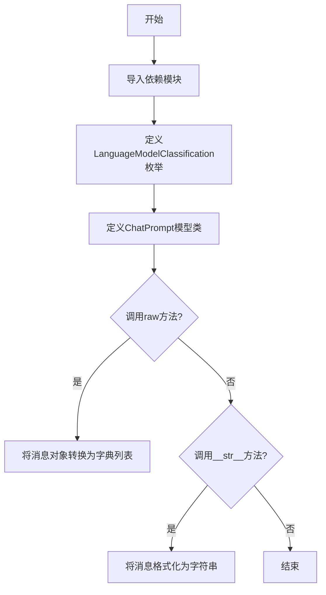
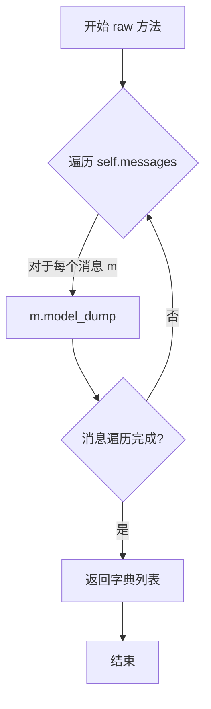
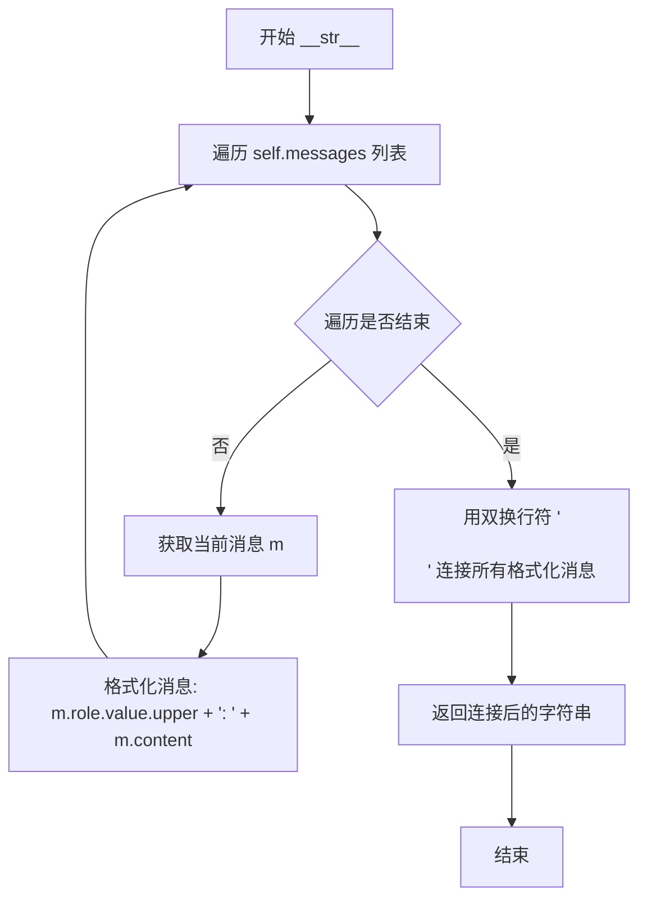

# `.\AutoGPT\classic\forge\forge\llm\prompting\schema.py` 详细设计文档

该模块定义了语言模型分类枚举和聊天提示模板，用于描述模型类型（快速模型/智能模型）以及构建聊天请求的消息结构，包含消息列表、可选函数调用和预填充响应功能。

## 整体流程



## 类结构

```
模块级
├── LanguageModelClassification (枚举类)
│   ├── FAST_MODEL
│   └── SMART_MODEL
└── ChatPrompt (Pydantic模型类)
    ├── 字段: messages, functions, prefill_response
    └── 方法: raw(), __str__()
```

## 全局变量及字段


### `LanguageModelClassification.FAST_MODEL`
    
快速/低成本的语言模型分类标识，用于优先选择响应快速且成本较低的场景

类型：`LanguageModelClassification`
    


### `LanguageModelClassification.SMART_MODEL`
    
智能/高质量的语言模型分类标识，用于需要更强推理能力和更高质量的场景

类型：`LanguageModelClassification`
    


### `ChatPrompt.messages`
    
聊天消息列表，包含一组对话消息，每条消息有角色和内容

类型：`list[ChatMessage]`
    


### `ChatPrompt.functions`
    
可用的函数定义列表，用于支持函数调用功能，默认为空列表

类型：`list[CompletionModelFunction]`
    


### `ChatPrompt.prefill_response`
    
预填充的响应内容，用于引导模型输出特定格式或内容的响应

类型：`str`
    
    

## 全局函数及方法


### `ChatPrompt.raw`

该方法将 ChatPrompt 实例中的消息列表（messages）转换为字典列表格式，使用 Pydantic 模型的 model_dump() 方法将每个 ChatMessage 对象序列化为字典，是将聊天提示对象序列化以便传输或持久化的关键方法。

参数：

- `self`：`ChatPrompt`，ChatPrompt 实例本身，包含 messages 列表

返回值：`list[ChatMessageDict]`，包含所有消息的字典列表，每个字典代表一个 ChatMessage 对象序列化后的结果

#### 流程图



#### 带注释源码

```python
def raw(self) -> list[ChatMessageDict]:
    """
    将 ChatPrompt 中的消息列表序列化为字典列表。
    
    Returns:
        list[ChatMessageDict]: 包含所有消息的字典列表
    """
    # 使用列表推导式遍历所有消息，调用 Pydantic 的 model_dump() 方法
    # 将每个 ChatMessage 模型实例转换为字典格式
    return [m.model_dump() for m in self.messages]  # type: ignore
```


### `ChatPrompt.__str__`

该方法将聊天提示对象格式化为可读的字符串形式，将每条消息按照"角色: 内容"的格式输出，并用双换行符分隔各消息。

参数：

- `self`：`ChatPrompt`，隐式参数，表示当前 ChatPrompt 实例

返回值：`str`，返回格式化后的聊天提示字符串，格式为每条消息以"角色（大写）: 内容"呈现，消息之间用双换行符分隔

#### 流程图



#### 带注释源码

```python
def __str__(self):
    """
    将 ChatPrompt 实例转换为可读字符串
    
    返回格式:
    SYSTEM: [系统消息内容]
    
    USER: [用户消息内容]
    
    ASSISTANT: [助手回复内容]
    """
    return "\n\n".join(
        # 遍历所有消息，将每条消息格式化为 "角色: 内容" 的形式
        # m.role.value 获取枚举值，.upper() 转换为大写
        f"{m.role.value.upper()}: {m.content}" for m in self.messages
    )
```

## 关键组件


### 核心功能概述

该代码定义了一个用于大语言模型交互的提示词管理模块，包含语言模型分类枚举和聊天提示数据结构，通过Pydantic模型提供了类型安全的消息管理、模型导出和字符串表示功能。

### 关键组件

### LanguageModelClassification

语言模型分类枚举，用于根据任务需求选择合适的模型类型，支持快速模型（FAST_MODEL）和智能模型（SMART_MODEL）两种分类，帮助系统在性能和成本之间做出权衡。

### ChatPrompt

聊天提示数据模型，基于Pydantic BaseModel构建，用于封装与语言模型交互所需的完整提示信息，包含消息列表、函数定义和预填充响应内容。

### ChatPrompt.messages

类型：list[ChatMessage]

描述：存储聊天消息的列表，按对话顺序排列，包含角色和内容信息。

### ChatPrompt.functions

类型：list[CompletionModelFunction]

描述：可选的函数定义列表，用于支持函数调用功能，默认值为空列表。

### ChatPrompt.prefill_response

类型：str

描述：预填充的响应内容，用于引导模型输出特定格式的响应，默认为空字符串。

### ChatPrompt.raw()

类型：方法

描述：将消息列表转换为字典格式，用于序列化或API调用。

### ChatPrompt.__str__()

类型：方法

描述：返回格式化的字符串表示，便于调试和日志输出。


## 问题及建议


### 已知问题

-   `raw()` 方法使用 `# type: ignore` 注释掩盖了类型问题，未从根本上解决类型冲突
-   `raw()` 方法中的 `model_dump()` 未指定 `mode='json'`，可能导致非 JSON 兼容类型（如 datetime、enum 等）无法序列化
-   `__str__()` 方法直接访问 `m.role.value` 和 `m.content`，若字段为 `None` 会引发 `AttributeError`，缺乏空值保护
-   `ChatPrompt` 类缺少文档字符串（docstring），影响代码可读性和可维护性
-   `prefill_response` 字段使用空字符串作为默认值，缺乏语义化表示（如使用 `None` 并配合 validator）
-   未对 `messages` 列表进行非空校验，空列表可能导致后续处理逻辑异常

### 优化建议

-   为 `ChatPrompt` 类添加类级别 docstring，描述其用途和业务含义
-   将 `raw()` 方法改为 `model_dump(mode='json')` 以确保 JSON 序列化兼容性，并移除 `# type: ignore`
-   在 `__str__()` 方法中添加空值检查或使用 `getattr` 安全访问属性
-   考虑为 `messages` 字段添加 validator 校验非空，或提供明确默认值
-   将 `prefill_response` 的空字符串改为 `Optional[str] = None`，并使用 validator 处理空值场景
-   考虑添加 `model_config` 配置，如 `str_strip_whitespace=True` 或 `frozen=True`（如适用）

## 其它


### 设计目标与约束

该模块的核心目标是为聊天语言模型提供标准化的提示构建机制，支持消息管理、函数调用定义和响应预填充。设计约束包括：依赖pydantic进行数据验证，使用enum实现类型安全，遵循函数式编程风格避免副作用，仅通过ChatMessage和CompletionModelFunction进行数据组合。

### 错误处理与异常设计

代码本身未定义显式异常处理，错误主要来源于pydantic的验证失败。当messages类型不为list、functions类型不合规或prefill_response类型错误时，pydantic会抛出ValidationError。raw()方法在messages元素类型不匹配时可能返回不完整数据，需依赖调用方进行类型检查。

### 数据流与状态机

数据流从外部输入开始：调用方构造ChatPrompt实例，传入messages列表、可选functions列表和可选prefill_response字符串。pydantic验证通过后，对象进入可用状态。raw()方法将模型转换为字典列表供LLM提供商使用，__str__方法提供可读字符串表示用于调试。整个生命周期为单向无状态转换，不涉及复杂状态机。

### 外部依赖与接口契约

主要依赖包括：pydantic.BaseModel提供数据验证和序列化；enum.Enum提供枚举类型；forge.llm.providers.schema中的ChatMessage、ChatMessageDict和CompletionModelFunction。调用方需确保messages中的ChatMessage对象已正确初始化，functions列表中的CompletionModelFunction符合提供商规范。

### 安全性考虑

当前代码未包含输入 sanitization。raw()方法直接调用model_dump()可能暴露内部结构，__str__方法直接输出消息内容可能泄露敏感信息。建议在生产环境中添加内容过滤和脱敏机制，特别是在处理用户生成内容时。

### 性能考虑

raw()方法使用列表推导式，每次调用都会遍历messages列表创建新列表，无缓存机制。对于高频调用场景，可考虑缓存序列化结果。__str__方法同样每次调用都重新构建字符串表示。

### 可扩展性与未来改进

建议的扩展方向包括：添加消息角色验证逻辑；支持模板化消息构建；实现消息历史自动管理；添加流式响应支持；考虑引入异步方法支持。当前结构为不可变设计，如需可变操作需重新设计类结构。

### 使用示例

```python
from forge.llm.providers.schema import ChatMessage, Role

prompt = ChatPrompt(
    messages=[
        ChatMessage(role=Role.USER, content="Hello"),
        ChatMessage(role=Role.ASSISTANT, content="Hi there!"),
    ],
    functions=[],
    prefill_response="Sure,"
)
print(prompt.raw())
print(str(prompt))
```

### 测试策略

建议测试覆盖：pydantic验证失败场景（错误类型输入）；empty messages和empty functions的边界情况；raw()方法输出格式正确性；__str__方法输出格式正确性；多消息场景下的顺序保持；与实际LLM提供商的集成测试。


    