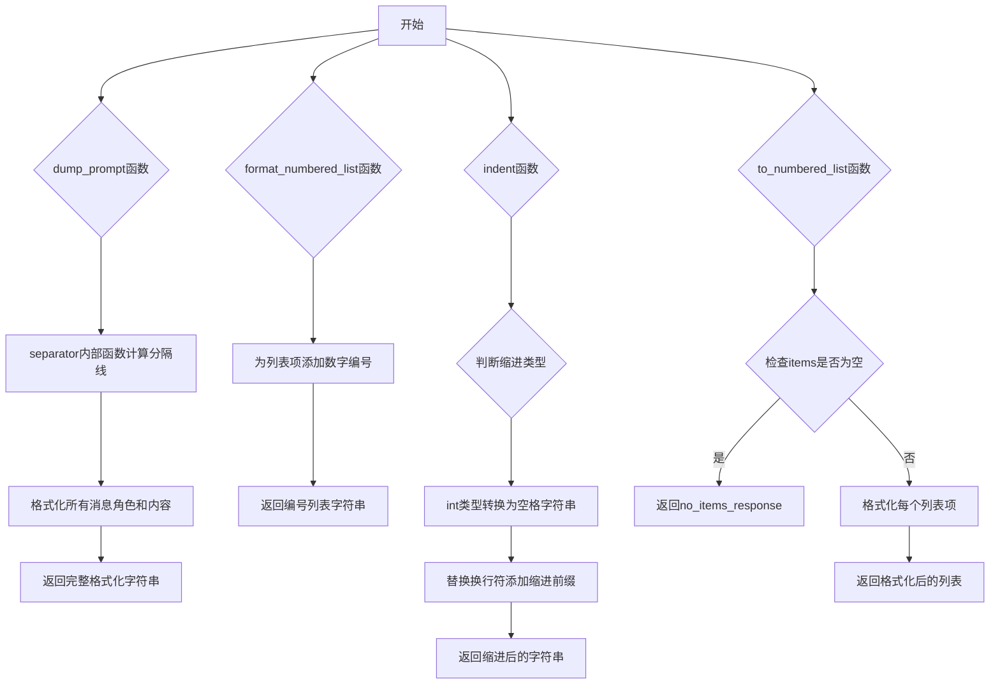
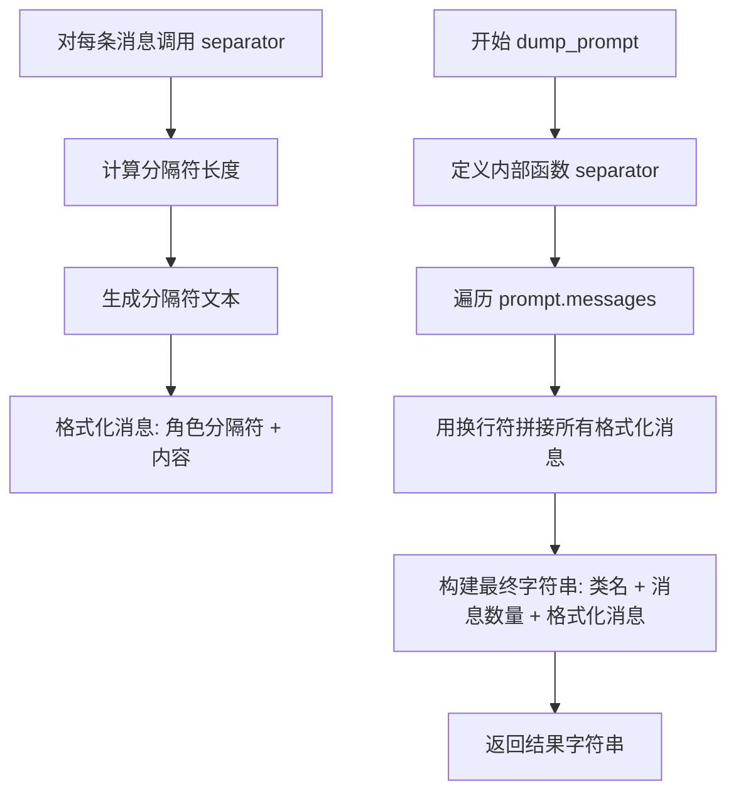
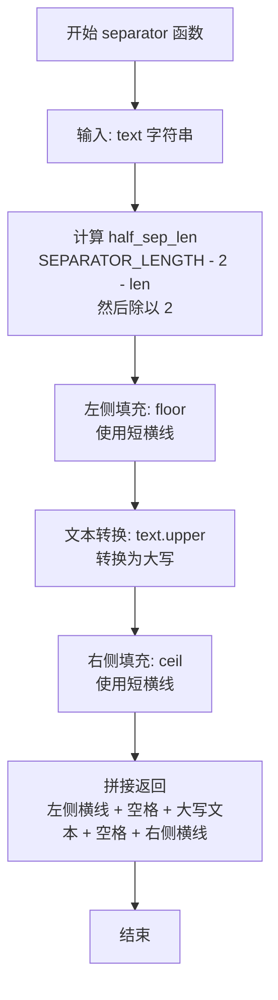
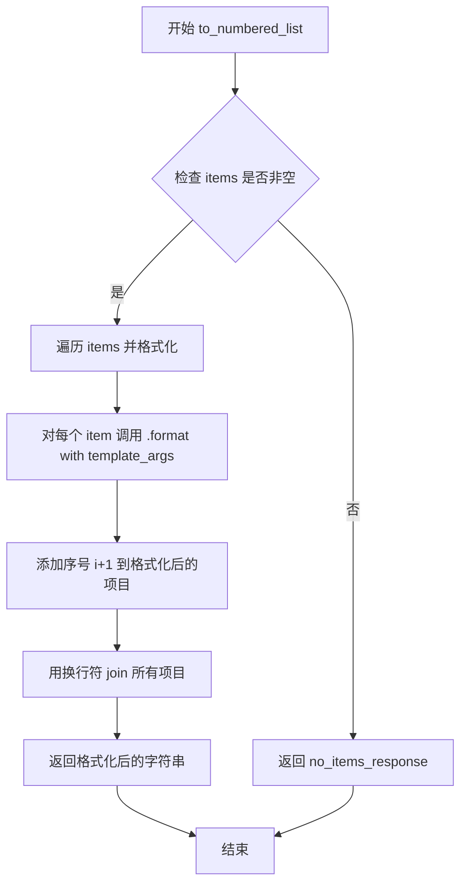

# `.\AutoGPT\classic\forge\forge\llm\prompting\utils.py` 详细设计文档

该代码文件提供了一组用于格式化LLM提示和文本输出的工具函数，包括提示消息的美化打印、编号列表生成、文本缩进等功能，主要用于调试和日志展示场景。

## 整体流程



## 类结构

```
该文件为模块文件，不包含类定义
所有函数均为模块级函数
依赖外部类型：ChatPrompt (from forge.llm.prompting.schema)
```

## 全局变量及字段


### `SEPARATOR_LENGTH`
    
全局常量，分隔线长度为42字符

类型：`int`
    


    

## 全局函数及方法


### `dump_prompt`

接收 ChatPrompt 对象，返回格式化后的提示字符串，用于调试和日志输出。该函数将提示对象转换为易于阅读的格式，包含类名、消息数量以及每条消息的角色和内容。

参数：

- `prompt`：`ChatPrompt`，待格式化的提示对象，包含消息列表

返回值：`str`，格式化后的提示字符串，包含类名、消息数量和所有消息内容

#### 流程图



#### 带注释源码

```python
from math import ceil, floor  # 导入数学函数用于计算分隔符长度
from typing import Any

from forge.llm.prompting.schema import ChatPrompt  # 导入 ChatPrompt 类型

SEPARATOR_LENGTH = 42  # 分隔符总长度常量


def dump_prompt(prompt: ChatPrompt) -> str:
    """接收 ChatPrompt 对象，返回格式化后的提示字符串"""
    
    def separator(text: str):
        """内部函数：生成分隔符文本"""
        # 计算分隔符一半的长度（减去2个空格和文本长度）
        half_sep_len = (SEPARATOR_LENGTH - 2 - len(text)) / 2
        # 返回格式化的分隔符，如 "----- TEXT -----"
        return f"{floor(half_sep_len)*'-'} {text.upper()} {ceil(half_sep_len)*'-'}"

    # 遍历消息列表，为每条消息生成分隔符和内容
    formatted_messages = "\n".join(
        [f"{separator(m.role)}\n{m.content}" for m in prompt.messages]
    )
    
    # 构建最终输出字符串，包含类名、消息数量和所有消息
    return f"""
============== {prompt.__class__.__name__} ==============
Length: {len(prompt.messages)} messages
{formatted_messages}
==========================================
"""
```


### `separator`

这是一个内部函数，接收文本字符串作为输入，计算并返回装饰性分隔线。该分隔线将输入文本转换为大写，并使用短横线（-）对称填充两侧，形成视觉上对称的装饰效果，常用于命令行输出或日志中区分不同的消息部分。

参数：

- `text`：`str`，需要装饰的文本内容

返回值：`str`，装饰性分隔线字符串

#### 流程图



#### 带注释源码

```python
def separator(text: str):
    """
    生成装饰性分隔线，将文本转换为大写并用短横线对称包围
    
    参数:
        text: 需要装饰的文本字符串
        
    返回:
        装饰性分隔线字符串
    """
    # 计算分隔线一半的长度
    # 公式: (总长度 - 2 - 文本长度) / 2
    # 减去2是为了预留文本两侧各一个空格的位置
    half_sep_len = (SEPARATOR_LENGTH - 2 - len(text)) / 2
    
    # 使用 floor 向下取整计算左侧短横线数量
    # 使用 ceil 向上取整计算右侧短横线数量
    # 这样即使文本长度为奇数，也能保证分隔线总长度一致
    return f"{floor(half_sep_len)*'-'} {text.upper()} {ceil(half_sep_len)*'-'}"
```


### `format_numbered_list`

该函数接收一个任意类型的列表和起始编号，将列表中的每个元素转换为带编号的字符串，编号从起始值开始递增，各行以换行符连接，最终返回格式化的字符串列表。

参数：

- `items`：`list[Any]`，要格式化的项目列表，可以包含任意类型的内容
- `start_at`：`int`，起始编号，默认为 1

返回值：`str`，带编号的字符串列表，每行格式为 "{编号}. {元素字符串}"

#### 流程图

```mermaid
flowchart TD
    A[开始] --> B{检查 items 是否为空}
    B -->|是| C[返回空字符串]
    B -->|否| D[从 start_at 开始遍历 items]
    D --> E[将每个 item 转换为字符串]
    E --> F[格式化为 '{i}. {str(item)}']
    F --> G[使用换行符连接所有格式化字符串]
    G --> H[返回结果字符串]
```

#### 带注释源码

```python
def format_numbered_list(items: list[Any], start_at: int = 1) -> str:
    """
    将列表格式化为带编号的字符串列表
    
    参数:
        items: 要格式化的项目列表，支持任意类型
        start_at: 起始编号，默认为 1
    
    返回:
        带编号的字符串，每行格式为 "{编号}. {内容}"
    """
    # 使用 enumerate 从 start_at 开始计数
    # 将每个元素转换为字符串并格式化为带编号的形式
    # 最后用换行符连接所有行
    return "\n".join(f"{i}. {str(item)}" for i, item in enumerate(items, start_at))
```

---

#### 潜在的技术债务或优化空间

1. **缺乏输入验证**：函数未对 `items` 参数进行类型检查，若传入非列表类型可能导致运行时错误
2. **空列表处理**：当前空列表会返回空字符串，可能需要根据业务需求返回更明确的提示
3. **性能考虑**：对于大量元素，一次性构建大字符串可能导致内存压力，可考虑生成器方式或分块处理

#### 其它项目

**设计目标**：提供一个简单通用的列表格式化工具，支持任意起始编号

**约束**：
- 依赖 Python 内置函数，无需外部库
- 遵循 Python 的显式优于隐式原则

**错误处理**：
- 未对 `items` 为 `None` 的情况进行处理
- 未对 `start_at` 为负数或非整数进行校验

**数据流**：输入列表 → 遍历转换 → 字符串拼接 → 输出格式化字符串


### `indent`

该函数接收一个字符串内容和缩进参数，将内容进行缩进处理后返回。当缩进参数为整数时，会自动转换为对应数量的空格字符；无论是单行还是多行内容，都会在每行开头添加指定的缩进字符。

参数：

- `content`：`str`，需要缩进处理的内容字符串
- `indentation`：`int | str`，缩进量，默认为 4。当为整数时表示空格数量，当为字符串时直接使用该字符串作为缩进

返回值：`str`，缩进处理后的字符串

#### 流程图

```mermaid
flowchart TD
    A([开始]) --> B{indentation 类型是 int?}
    B -- 是 --> C[将 indentation 转换为空格字符串<br/>indentation = " " * indentation]
    B -- 否 --> D[保持原样]
    C --> E[在 content 前添加缩进<br/>并替换所有换行符为<br/>换行符+缩进]
    D --> E
    E --> F([返回缩进后的字符串])
```

#### 带注释源码

```python
def indent(content: str, indentation: int | str = 4) -> str:
    """
    将给定内容按照指定的缩进量进行缩进处理
    
    参数:
        content: 需要缩进的内容字符串
        indentation: 缩进量，int类型表示空格数量，str类型直接作为缩进字符
    
    返回:
        缩进处理后的字符串
    """
    # 判断缩进参数是否为整数类型
    if type(indentation) is int:
        # 整数类型：将数字转换为对应数量的空格字符串
        indentation = " " * indentation
    
    # 核心逻辑：
    # 1. 在内容最前方添加缩进字符
    # 2. 将内容中所有换行符替换为"换行符+缩进字符"
    #    这样可以保证多行内容每一行都有缩进
    return indentation + content.replace("\n", f"\n{indentation}")  # type: ignore
```


### `to_numbered_list`

将字符串列表转换为带编号的格式化字符串，如果列表为空则返回指定的空列表响应内容，支持通过模板参数对列表项进行字符串格式化。

参数：

- `items`：`list[str]`，需要格式化的字符串列表
- `no_items_response`：`str`，当列表为空时返回的响应内容，默认为空字符串
- `**template_args`：关键字参数，传递给列表中每个项目的 `.format()` 方法进行字符串格式化

返回值：`str`，格式化后的带编号列表字符串，每个项目前添加序号（从1开始）

#### 流程图



#### 带注释源码

```python
def to_numbered_list(
    items: list[str], no_items_response: str = "", **template_args
) -> str:
    """
    将字符串列表转换为带编号的格式化字符串。

    参数:
        items: 需要格式化的字符串列表
        no_items_response: 当列表为空时返回的响应内容
        **template_args: 传递给每个项目进行字符串格式化的关键字参数

    返回:
        格式化后的带编号列表字符串
    """
    # 检查列表是否非空
    if items:
        # 遍历列表，使用 enumerate 获取索引（从0开始）
        # 每个项目调用 .format(**template_args) 进行字符串格式化
        # 序号从1开始（i+1）
        return "\n".join(
            f"{i+1}. {item.format(**template_args)}" for i, item in enumerate(items)
        )
    else:
        # 列表为空时返回预设的空列表响应
        return no_items_response
```

## 关键组件


### SEPARATOR_LENGTH

全局常量，定义分隔符的标准长度为42个字符，用于格式化输出时的视觉分隔。

### dump_prompt 函数

核心函数，用于将 ChatPrompt 对象格式化为可读的字符串形式。它使用内部定义的 separator 函数为每条消息添加装饰性分隔符，并显示消息总数和类名。

### separator 函数

内部辅助函数，根据传入的文本计算并生成分隔符。它计算文本两侧破折号的数量，使分隔符总长度保持为42个字符，并将文本转换为大写。

### format_numbered_list 函数

将任意列表转换为带编号的字符串格式，支持自定义起始编号，默认从1开始。返回形如 "1. item1\n2. item2" 的字符串。

### indent 函数

为内容添加缩进的工具函数，支持指定缩进字符数（默认4个空格）或自定义缩进字符串。处理换行符以确保整体缩进一致。

### to_numbered_list 函数

带模板支持的编号列表生成函数，支持对列表项应用模板参数格式化。当列表为空时返回指定的默认响应文本。


## 问题及建议


### 已知问题

- **魔法数字缺乏解释**：`SEPARATOR_LENGTH = 42` 作为硬编码常量出现在模块级别，没有注释说明其含义，且该常量仅在 `dump_prompt` 函数内使用
- **内部函数重复定义**：`separator` 函数定义在 `dump_prompt` 函数内部，每次调用外层函数都会重新创建该内部函数，造成不必要的开销
- **类型注解不一致**：`to_numbered_list` 接收 `list[str]` 类型参数，但内部调用 `.format(**template_args)` 方法，暗示元素需支持格式化协议，类型注解与实际使用不匹配
- **缺少参数校验**：未对空值、None 或空列表进行显式处理，可能导致运行时错误
- **功能重复**：`format_numbered_list` 和 `to_numbered_list` 存在功能重叠，前者返回带编号的字符串列表，后者返回带编号的格式化字符串，可考虑合并或明确区分职责
- **缺少文档注释**：模块级缺少 docstring，各函数缺少参数和返回值说明

### 优化建议

- 将 `SEPARATOR_LENGTH` 移入 `dump_prompt` 函数内作为默认参数或常量，并添加注释说明其用途
- 将 `separator` 函数提取到模块级别作为独立函数，避免重复定义
- 完善类型注解，为 `to_numbered_list` 的 `items` 参数使用更精确的类型（如 `list[format[str]]`），或添加运行时类型检查
- 在关键函数入口添加空值和空列表校验，提升健壮性
- 考虑合并或重构 `format_numbered_list` 和 `to_numbered_list`，减少代码冗余
- 为模块和函数添加 docstring，提升代码可维护性和可读性

## 其它


### 设计目标与约束

本代码模块主要用于日志输出格式化，提供将提示词模板、列表数据等内容格式化为可读字符串的辅助函数。设计目标包括：1）提供统一的输出格式，便于调试和日志记录；2）支持多种数据类型的格式化；3）保持函数纯度，无副作用，易于测试。约束条件包括：依赖forge.llm.prompting.schema.ChatPrompt类型，需保持Python 3.9+兼容性。

### 错误处理与异常设计

当前代码未实现显式的异常处理机制。主要风险点包括：1）indent函数中type(indentation) is int的类型检查方式不够Pythonic，建议使用isinstance；2）to_numbered_list中format调用若模板参数不匹配可能抛出KeyError；3）separator计算中除法操作在极端情况下可能出现浮点精度问题。建议添加：参数类型验证、默认值降级处理、异常捕获与日志记录。

### 数据流与状态机

本模块为无状态工具函数集合，数据流较为简单：输入参数（ChatPrompt/list/str） → 格式化处理 → 字符串输出。不涉及状态机设计。数据转换路径：dump_prompt接收ChatPrompt对象，遍历messages列表，调用separator生成角色分隔符，拼接为最终字符串；format_numbered_list/to_numbered_list接收列表数据，枚举后拼接为编号列表；indent接收字符串内容，替换换行符并添加缩进前缀。

### 外部依赖与接口契约

核心依赖：1）math模块的ceil、floor用于分隔符长度计算；2）typing模块的Any类型注解；3）forge.llm.prompting.schema.ChatPrompt类型，来自外部包。接口契约：dump_prompt要求传入ChatPrompt对象且需包含messages属性和class.__name__；format_numbered_list/to_numbered_list要求传入可迭代对象；indent要求content为字符串类型。

### 性能考量

潜在性能瓶颈：1）dump_prompt中字符串拼接使用多行f-string和join，在大量消息场景下可能有优化空间；2）indent中replace操作对大字符串有O(n)复杂度；3）separator函数在每次调用时重新计算half_sep_len。建议：对于高频调用场景可考虑缓存separator结果，使用list comprehension替代多次字符串拼接。

### 安全考量

当前代码无用户输入处理逻辑，安全风险较低。但需注意：1）format_numbered_list中str(item)可能暴露对象内部信息；2）to_numbered_list的format调用需防止模板注入，建议对template_args进行白名单验证。

### 测试策略

建议测试覆盖：1）dump_prompt对空messages、单条消息、多条消息的输出格式；2）format_numbered_list的start_at参数边界情况；3）indent对不同缩进类型（int/str）和嵌套换行的处理；4）to_numbered_list的空列表和非空列表，以及template_args参数化。推荐使用pytest编写单元测试。

### 配置与扩展性

当前代码无配置文件依赖。扩展方向：1）SEPARATOR_LENGTH可抽取为配置参数；2）separator函数逻辑可抽象为策略模式支持自定义分隔符；3）indent的缩进字符（空格）可扩展为支持制表符或其他字符。模块设计遵循单一职责原则，易于扩展。

### 版本兼容性

代码使用Python 3.9+的联合类型注解（int | str），需确保目标Python版本支持。ChatPrompt类型依赖外部包forge，需明确版本范围建议。

### 监控与日志

建议添加：1）入口函数的调用计数监控；2）关键路径的性能指标（执行时长）；3）异常情况的错误日志记录，便于排查线上问题。当前为工具函数库，建议在上层业务中集成监控能力。

### 命名规范与代码风格

代码整体遵循PEP8风格，函数命名清晰。改进建议：1）separator定义为内部函数可加下划线前缀（_separator）表示私有；2）类型注解可使用from __future__ import annotations增强兼容性；3）dump_prompt返回值包含类名，可考虑提取为常量避免魔法字符串。

    