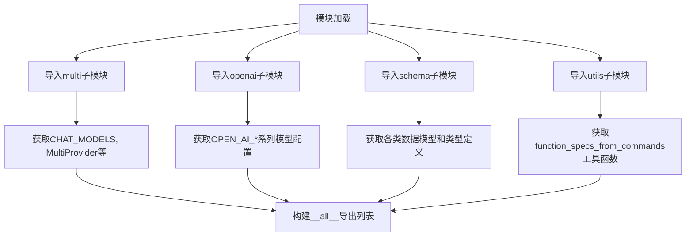
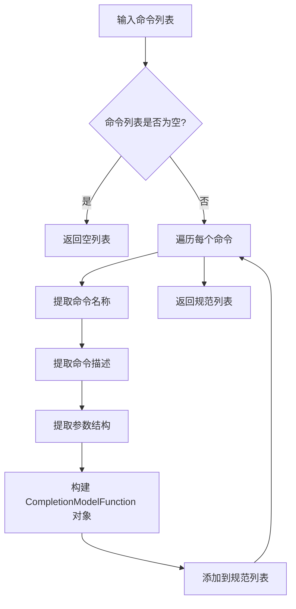

# `.\AutoGPT\classic\forge\forge\llm\providers\__init__.py` 详细设计文档

这是一个AI模型提供者统一接口模块，封装了对多种AI模型（如OpenAI的GPT系列、Embedding模型等）的访问，提供统一的模型信息、聊天响应、嵌入向量等数据结构定义，以及多提供商切换能力。

## 整体流程



## 类结构

```
ModelProvider (模型提供者接口体系)
├── MultiProvider (多提供商协调器)
├── ChatModelProvider (聊天模型提供者抽象)
├── EmbeddingModelProvider (嵌入模型提供者抽象)
├── OpenAIProvider (OpenAI具体实现)
├── ModelName (模型名称枚举)
├── OpenAIModelName (OpenAI模型名称枚举)
Schema (数据模型层)
├── ChatMessage / AssistantChatMessage (聊天消息)
├── ChatModelResponse / EmbeddingModelResponse (模型响应)
├── ModelInfo / ChatModelInfo / EmbeddingModelInfo (模型信息)
├── ModelProviderSettings / Credentials / Budget (提供者配置)
└── ModelProviderUsage (使用量统计)
Utils (工具层)
└── function_specs_from_commands (命令转函数规范)
```

## 全局变量及字段


### `CHAT_MODELS`
    
多提供商聊天模型的注册表，包含各种聊天模型的元数据信息

类型：`Dict[str, ChatModelInfo]`
    


### `OPEN_AI_CHAT_MODELS`
    
OpenAI聊天模型的配置字典，定义了所有可用的OpenAI聊天模型及其参数

类型：`Dict[str, ChatModelInfo]`
    


### `OPEN_AI_EMBEDDING_MODELS`
    
OpenAI嵌入模型的配置字典，定义了所有可用的OpenAI嵌入模型及其参数

类型：`Dict[str, EmbeddingModelInfo]`
    


### `OPEN_AI_MODELS`
    
所有OpenAI模型的统一注册表，包含聊天和嵌入模型的总集合

类型：`Dict[str, ModelInfo]`
    


### `AssistantChatMessageDict`
    
助手聊天消息的字典类型定义，用于类型检查和序列化助手生成的消息结构

类型：`TypedDict`
    


### `AssistantFunctionCallDict`
    
助手函数调用的字典类型定义，用于描述模型生成的函数调用请求的数据结构

类型：`TypedDict`
    


    

## 全局函数及方法


根据提供的代码片段，无法直接获取 `function_specs_from_commands` 的实现细节，因为仅导入了该函数而未提供其定义。以下信息基于函数名称、上下文以及常见编程模式的合理推断。

### `function_specs_from_commands`

该函数用于将输入的命令列表转换为模型可用的函数规范（Function Specifications），通常用于支持语言模型的函数调用（Function Calling）功能。它可能解析命令字典并生成符合 `CompletionModelFunction` 结构的规范列表。

参数：
- `commands`：`List[Dict[str, Any]]`，待转换的命令列表，每个命令应为包含名称、描述、参数结构等信息的字典。

返回值：`List[CompletionModelFunction]`（从 `.schema` 导入），返回转换后的函数规范列表，每个元素表示一个可调用的函数。

#### 流程图



#### 带注释源码

由于未提供实际源码，以下列出基于上下文的推断代码（可能与实际实现不同）：

```python
from typing import List, Dict, Any
from .schema import CompletionModelFunction

def function_specs_from_commands(commands: List[Dict[str, Any]]) -> List[CompletionModelFunction]:
    """
    将命令列表转换为函数规范列表。
    
    参数:
        commands: 命令列表，每个命令应为包含 'name', 'description', 'parameters' 等键的字典。
        
    返回值:
        函数规范列表，每个元素为 CompletionModelFunction 对象。
    """
    specs = []
    for cmd in commands:
        # 提取命令名称
        name = cmd.get('name', '')
        # 提取命令描述
        description = cmd.get('description', '')
        # 提取参数模式
        parameters = cmd.get('parameters', {})
        
        # 构建函数规范对象
        spec = CompletionModelFunction(
            name=name,
            description=description,
            parameters=parameters
        )
        specs.append(spec)
    
    return specs
```

**注意**：实际实现可能包含更多细节，如参数验证、错误处理或使用其他模式。建议参考 `.utils` 模块的实际源码以获取精确信息。

## 关键组件


### MultiProvider

多模型提供者管理类，支持同时使用多个模型服务商（如OpenAI、Anthropic等），实现模型选择的动态路由与负载均衡。

### ChatModelProvider

聊天模型提供者抽象基类，定义了聊天模型的标准接口规范，包括模型列表获取、请求发送、响应解析等核心方法。

### EmbeddingModelProvider

嵌入模型提供者抽象基类，封装了向量嵌入生成的标准接口，支持不同服务商嵌入模型的统一调用。

### ModelName

模型名称枚举或类型定义，用于标准化模型标识符，确保跨模块模型引用的一致性。

### OpenAIProvider

OpenAI模型提供者实现类，封装了OpenAI API的调用逻辑，包括认证、请求构造、响应处理等完整流程。

### OpenAISettings

OpenAI配置类，包含API密钥、基础URL、超时设置、默认参数等配置项。

### OPEN_AI_MODELS

OpenAI全模型注册表，包含该提供商支持的所有模型元数据（名称、能力、上下文长度、定价等）。

### OPEN_AI_CHAT_MODELS

OpenAI聊天模型子集，仅包含支持对话补全的模型列表。

### OPEN_AI_EMBEDDING_MODELS

OpenAI嵌入模型子集，包含所有文本向量嵌入模型的配置信息。

### OpenAIModelName

OpenAI模型名称枚举，列出所有可用的OpenAI模型标识符。

### ChatModelResponse

聊天模型响应数据结构，包含生成文本、token使用统计、finish_reason等响应字段。

### ChatModelInfo

聊天模型元信息类，描述单个模型的属性（名称、上下文窗口、支持的特性、定价层级等）。

### EmbeddingModelResponse

嵌入模型响应结构，包含生成的向量嵌入、模型名称、token统计等信息。

### EmbeddingModelInfo

嵌入模型元信息类，记录嵌入模型的维度、支持的语言、定价等信息。

### ModelInfo

通用模型信息基类，提供所有模型类型的共同属性接口。

### ModelProviderCredentials

模型提供者认证凭据类，存储API密钥、访问令牌等敏感认证信息。

### ModelProviderSettings

模型提供者通用配置类，包含重试策略、并发限制、默认参数等运行时配置。

### ModelProviderBudget

模型提供者预算管理类，用于追踪和限制API调用成本。

### ModelProviderUsage

模型使用统计类，记录各模型的调用次数、token消耗、费用等度量数据。

### ModelTokenizer

模型分词器接口，封装不同模型的tokenize/detokenize逻辑，用于精确计算token使用量。

### ChatMessage

聊天消息基类，定义消息结构（角色、内容、时间戳等），支持用户/助手/系统等多角色。

### AssistantChatMessage

助手消息类，继承自ChatMessage，包含助手特有的字段如function_call、tool_calls等。

### AssistantFunctionCall

助手函数调用对象，封装被调用的函数名称和参数。

### CompletionModelFunction

补全模型函数定义，描述可被模型调用的工具函数规范（名称、描述、参数schema）。

### ModelProviderName

模型提供者名称枚举，标准化各服务商标识（如openai、anthropic、azure等）。

### ModelProviderService

模型服务类型枚举，区分聊天、嵌入、图像生成等不同服务类型。

### ModelResponse

通用模型响应基类，提供各类型模型响应的统一接口。

### function_specs_from_commands

工具函数，根据命令行参数或配置自动生成function calling的规范描述，用于将本地函数暴露给大模型调用。


## 问题及建议


### 已知问题

- **模块职责过于繁重**：该 `__init__.py` 作为聚合入口，重导出了超过30个符号（包括数据模型、提供商类、常量等），违反单一职责原则，模块承担了过多职责
- **命名风格不一致**：存在 `CHAT_MODELS` / `OPEN_AI_CHAT_MODELS`（全大写常量风格）与 `ChatModelProvider`（PascalCase类风格）混用，以及 `ModelName` 与 `OpenAIModelName` 命名层次不清晰
- **缺少模块级文档**：没有任何模块级 docstring 说明该包的用途、版本、依赖关系等关键信息
- **schema 模块可能过于臃肿**：从 `.schema` 导入的类超过15个，涵盖消息、响应、嵌入、模型信息、使用统计等多种概念，建议按功能拆分
- **潜在的循环导入风险**：从多个子模块（multi/openai/schema/utils）集中导入，若子模块间存在依赖关系，容易引发循环导入问题
- **过度暴露内部实现细节**：通过 `__all__` 导出过多内容，包括内部数据模型（如 `AssistantChatMessageDict`）和工具函数，降低了 API 的抽象层次
- **缺乏错误处理和边界检查**：作为公共入口，没有对导入失败、符号缺失等情况提供友好的错误提示

### 优化建议

- **拆分 schema 模块**：将 schema 按功能域拆分为多个子模块（如 `messages.py`、`responses.py`、`providers.py`、`common.py`），降低耦合度
- **统一命名规范**：制定并遵循命名约定，如所有配置常量使用 `CHAT_MODELS` 风格，类名使用 PascalCase，并明确 `ModelName` 的层级关系
- **添加模块文档**：为包和关键模块添加 docstring，说明其职责、版本、主要类型和示例用法
- **精简导出列表**：仅暴露必要的公共 API，将内部类型（如 `AssistantChatMessageDict`）移除或标记为私有（ `_AssistantChatMessageDict`）
- **添加导入保护**：在导入时添加 try-except 块，提供更友好的错误信息，或使用 `importlib` 动态导入以避免部分导入失败导致整体崩溃
- **引入版本管理**：添加 `__version__` 变量，并在文档中说明 API 稳定性承诺
- **考虑使用延迟导入**：对于重型依赖（如 OpenAI SDK），可考虑在需要时才导入，改善初始加载时间

## 其它


### 设计目标与约束

**设计目标**：
- 提供统一的多模型提供者抽象层，支持Chat模型和Embedding模型的灵活切换
- 解耦业务逻辑与具体模型实现，便于扩展新的模型提供商
- 封装不同模型提供商的API差异，对外提供一致的调用接口

**设计约束**：
- 依赖OpenAI官方SDK，需确保版本兼容性
- 仅支持Python 3.8+
- 需保持与Python类型注解的完整兼容

### 错误处理与异常设计

本模块作为API抽象层，自身不直接抛出业务异常，而是将底层异常向上层传递。具体异常处理由调用方负责：
- 网络请求相关异常由requests库或OpenAI SDK抛出
- 认证失败、额度超限等API错误由OpenAIProvider内部处理并返回错误响应
- 参数校验错误在具体Provider类中检查

**建议改进**：可考虑定义自定义异常类（如ModelProviderError），统一包装底层异常，便于调用方进行针对性处理。

### 外部依赖与接口契约

**外部依赖**：
- `openai`库：OpenAI官方Python SDK，用于与OpenAI API通信
- `typing`模块：Python内置，用于类型注解

**接口契约**：
- `MultiProvider`：多提供商调度器，需实现模型路由逻辑
- `ChatModelProvider`：聊天模型提供者抽象接口
- `EmbeddingModelProvider`：Embedding模型提供者抽象接口
- 所有Provider类需提供`chat()`、`complete()`、`embed()`等统一方法

### 配置说明

本模块的配置通过以下类进行管理：
- `OpenAISettings`：OpenAI相关配置（如API Base URL、API Version等）
- `ModelProviderCredentials`：模型提供者凭证（API Key等）
- `ModelProviderSettings`：通用模型设置（超时、、重试次数等）

配置可通过环境变量或配置文件注入，具体由调用方实现。

### 安全性考虑

- API Key等敏感凭证应通过安全渠道注入，避免硬编码
- 建议使用密钥管理服务（如AWS Secrets Manager）存储凭证
- 模块本身不持久化任何敏感信息

### 性能考虑

- 模型响应时间主要取决于底层API网络延迟
- 可通过配置连接池大小、超时时间等参数优化性能
- 批量Embedding请求建议使用提供商的批量接口

### 测试策略

- 单元测试：针对各Provider类的单测，Mock外部API调用
- 集成测试：使用测试环境API Key验证端到端流程
- 回归测试：确保新增Provider不影响现有功能

### 版本兼容性

- 当前模块版本需与openai库版本匹配（建议openai>=1.0）
- Python版本需3.8+
- 后续版本迭代应保持__all__列表的向后兼容

### 目录结构

```
models/
├── __init__.py          # 本文件，公共API导出
├── multi.py             # MultiProvider多提供商调度
├── openai.py            # OpenAIProvider实现
├── schema.py            # 数据模型和类型定义
└── utils.py             # 工具函数
```

### 使用示例

```python
from models import MultiProvider, ChatModelProvider

# 初始化多提供商
provider = MultiProvider()

# 切换到OpenAI
provider.use_provider("openai")

# 发送聊天请求
response = provider.chat(model="gpt-4", messages=[...])
```

### 部署注意事项

- 确保部署环境可访问目标模型API（如OpenAI API）
- 配置好API Key等敏感信息的环境变量注入
- 如需代理访问外网，需配置HTTP_PROXY/HTTPS_PROXY环境变量
- 建议使用版本锁定（requirements.txt或pyproject.toml）确保依赖一致性


    