# `.\AutoGPT\classic\forge\forge\llm\providers\_openai_base.py` 详细设计文档

该模块实现了基于OpenAI API的LLM（大型语言模型）提供者框架，支持聊天补全和嵌入生成功能，包含重试机制、错误处理和token计数等核心能力。

## 整体流程

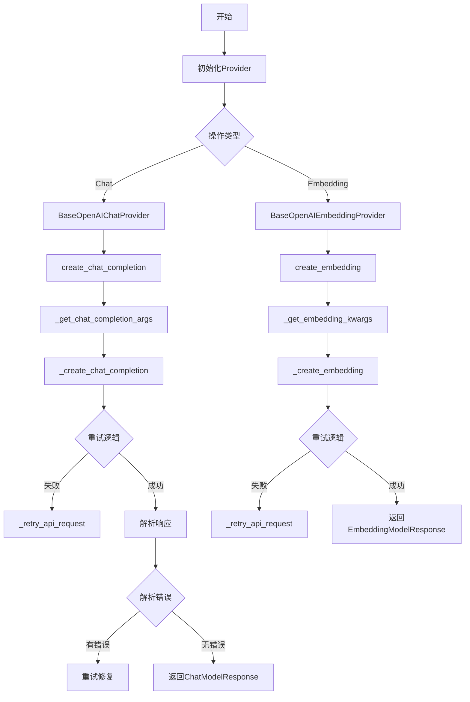

## 类结构

```
BaseModelProvider (抽象基类)
├── _BaseOpenAIProvider
│   ├── BaseOpenAIChatProvider
│   └── BaseOpenAIEmbeddingProvider
BaseChatModelProvider (抽象基类)
BaseEmbeddingModelProvider (抽象基类)
```

## 全局变量及字段


### `_T`
    
泛型类型变量，用于表示函数的返回类型

类型：`TypeVar`
    


### `_P`
    
参数规格变量，用于表示可调用对象的参数类型

类型：`ParamSpec`
    


### `_BaseOpenAIProvider.MODELS`
    
模型信息映射表，包含模型名称到模型信息的映射

类型：`ClassVar[Mapping[_ModelName, ChatModelInfo[_ModelName] | EmbeddingModelInfo[_ModelName]]]`
    


### `_BaseOpenAIProvider._client`
    
OpenAI异步客户端实例，用于发起API请求

类型：`AsyncOpenAI`
    


### `_BaseOpenAIProvider._configuration`
    
配置对象，包含请求重试次数、额外请求头等配置

类型：`_ModelProviderSettings`
    


### `_BaseOpenAIProvider._credentials`
    
凭证对象，包含API密钥等认证信息

类型：`Credentials`
    


### `_BaseOpenAIProvider._logger`
    
日志记录器，用于记录Provider运行过程中的日志

类型：`logging.Logger`
    


### `_BaseOpenAIProvider._budget`
    
预算控制对象，用于跟踪和控制API调用成本

类型：`Budget`
    


### `BaseOpenAIChatProvider.CHAT_MODELS`
    
聊天模型映射表，包含聊天模型名称到模型信息的映射

类型：`ClassVar[dict[_ModelName, ChatModelInfo[_ModelName]]]`
    


### `BaseOpenAIEmbeddingProvider.EMBEDDING_MODELS`
    
嵌入模型映射表，包含嵌入模型名称到模型信息的映射

类型：`ClassVar[dict[_ModelName, EmbeddingModelInfo[_ModelName]]]`
    
    

## 全局函数及方法


### `format_function_def_for_openai`

该函数将 `CompletionModelFunction` 对象转换为 OpenAI API 兼容的函数定义格式，用于 LLM 函数调用功能。

参数：

- `self`：`CompletionModelFunction`，表示要格式化的函数定义对象，包含函数的名称、描述和参数信息

返回值：`FunctionDefinition`，返回符合 OpenAI API 要求的函数定义字典，包含名称、描述和参数模式

#### 流程图

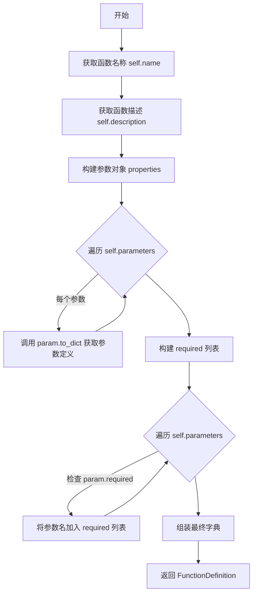

#### 带注释源码

```python
def format_function_def_for_openai(self: CompletionModelFunction) -> FunctionDefinition:
    """Returns an OpenAI-consumable function definition"""
    # 初始化返回字典，包含 OpenAI 所需的 name 和 description 字段
    return {
        "name": self.name,                          # 函数名称，用于 OpenAI 调用时标识
        "description": self.description,            # 函数描述，帮助 LLM 理解函数用途
        "parameters": {                              # 参数模式定义
            "type": "object",                       # OpenAI 要求参数必须是 object 类型
            "properties": {                         # 参数属性字典
                # 遍历所有参数，将每个参数转换为字典格式
                # param.to_dict() 返回参数的类型、描述等信息
                name: param.to_dict() for name, param in self.parameters.items()
            },
            "required": [                           # 必填参数列表
                # 筛选出 required=True 的参数名
                name for name, param in self.parameters.items() if param.required
            ],
        },
    }
```


### `_BaseOpenAIProvider.__init__`

该方法是 `_BaseOpenAIProvider` 类的构造函数，负责初始化 OpenAI 兼容的模型提供者。它验证类属性、设置默认配置和凭据、调用父类初始化，并创建异步 OpenAI 客户端。

参数：

- `settings`：`_ModelProviderSettings | None`，可选的模型提供者配置对象，若为 `None` 则使用 `default_settings` 的深拷贝
- `logger`：`logging.Logger | None`，可选的日志记录器实例，若为 `None` 则由父类创建

返回值：`None`，构造函数无显式返回值

#### 流程图

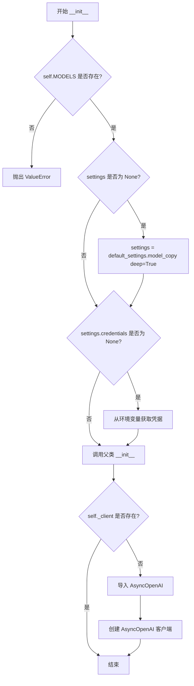

#### 带注释源码

```python
def __init__(
    self,
    settings: Optional[_ModelProviderSettings] = None,
    logger: Optional[logging.Logger] = None,
):
    # 验证子类是否定义了 MODELS 类属性
    if not getattr(self, "MODELS", None):
        raise ValueError(f"{self.__class__.__name__}.MODELS is not set")

    # 若未提供 settings，则使用默认设置的深拷贝
    if not settings:
        settings = self.default_settings.model_copy(deep=True)
    
    # 若未提供凭据，从环境变量中加载默认凭据
    if not settings.credentials:
        settings.credentials = get_args(  # Union[Credentials, None] -> Credentials
            self.default_settings.model_fields["credentials"].annotation
        )[0].from_env()

    # 调用父类 BaseModelProvider 的初始化方法
    super(_BaseOpenAIProvider, self).__init__(settings=settings, logger=logger)

    # 初始化异步 OpenAI 客户端（若尚未存在）
    if not getattr(self, "_client", None):
        from openai import AsyncOpenAI

        self._client = AsyncOpenAI(
            **self._credentials.get_api_access_kwargs()  # type: ignore
        )
```


### `_BaseOpenAIProvider.get_available_models`

获取当前 AI 提供商可用的模型列表，通过调用底层 OpenAI 客户端的模型列表接口，并过滤出在本地 MODELS 映射中注册过的模型。

参数：

- `self`：`_BaseOpenAIProvider[_ModelName, _ModelProviderSettings]`（隐式参数），提供类实例的上下文和 `_client`、`MODELS` 等属性

返回值：`Sequence[ChatModelInfo[_ModelName] | EmbeddingModelInfo[_ModelName]]`，返回当前提供商可用的模型信息序列，类型为聊天模型或嵌入模型

#### 流程图

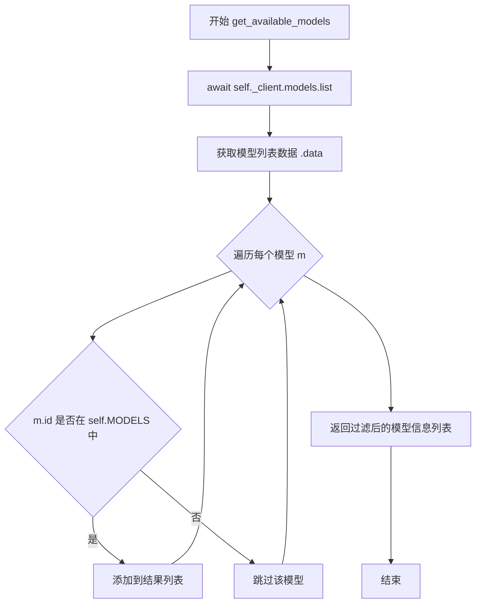

#### 带注释源码

```python
async def get_available_models(
    self,
) -> Sequence[ChatModelInfo[_ModelName] | EmbeddingModelInfo[_ModelName]]:
    """获取当前 AI 提供商可用的模型列表
    
    通过调用 OpenAI 兼容 API 的 models.list 接口获取服务器端模型列表，
    然后与本地 MODELS 映射进行对比，只返回已在本地注册过的模型信息。
    这样可以确保返回的模型都是系统配置中支持的模型。
    
    Returns:
        Sequence[ChatModelInfo[_ModelName] | EmbeddingModelInfo[_ModelName]]: 
            可用的模型信息列表，包含聊天模型和嵌入模型
    """
    # 调用异步客户端的模型列表接口，获取服务器上所有可用的模型
    _models = (await self._client.models.list()).data
    
    # 使用列表推导式过滤模型：
    # - 只保留 id 在 self.MODELS 映射中存在的模型
    # - 将服务器返回的模型 ID 转换为本地定义的 ChatModelInfo 或 EmbeddingModelInfo
    return [
        self.MODELS[cast(_ModelName, m.id)] for m in _models if m.id in self.MODELS
    ]
```


### `_BaseOpenAIProvider.get_token_limit`

获取指定模型的最大输入 token 数量，用于确定模型能够处理的最大上下文长度。

参数：

- `model_name`：`_ModelName`，需要查询的模型标识符

返回值：`int`，模型支持的最大输入 token 数量

#### 流程图

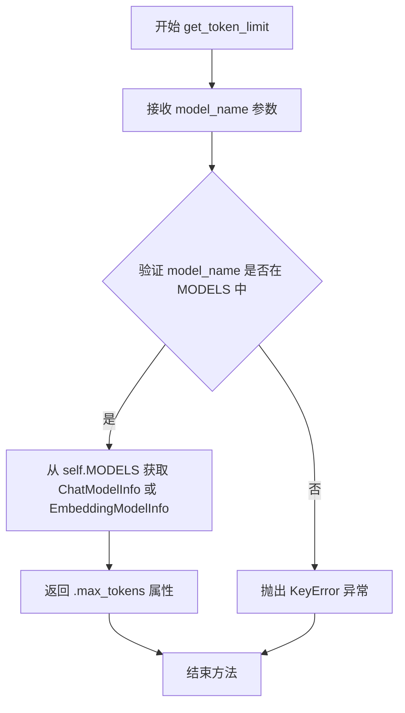

#### 带注释源码

```python
def get_token_limit(self, model_name: _ModelName) -> int:
    """Get the maximum number of input tokens for a given model"""
    # 从类属性 MODELS 字典中查找指定模型的信息
    # MODELS 是类变量，映射模型名称到模型信息对象
    return self.MODELS[model_name].max_tokens
    # 返回模型的 max_tokens 属性，表示该模型支持的最大输入 token 数
```


### `_BaseOpenAIProvider.count_tokens`

计算给定文本的token数量，通过调用对应模型的tokenizer对文本进行编码并返回编码后的token列表长度。

参数：

- `text`：`str`，需要计算token数的文本内容
- `model_name`：`_ModelName`，模型名称，用于获取该模型对应的tokenizer

返回值：`int`，文本被tokenizer编码后生成的token数量

#### 流程图

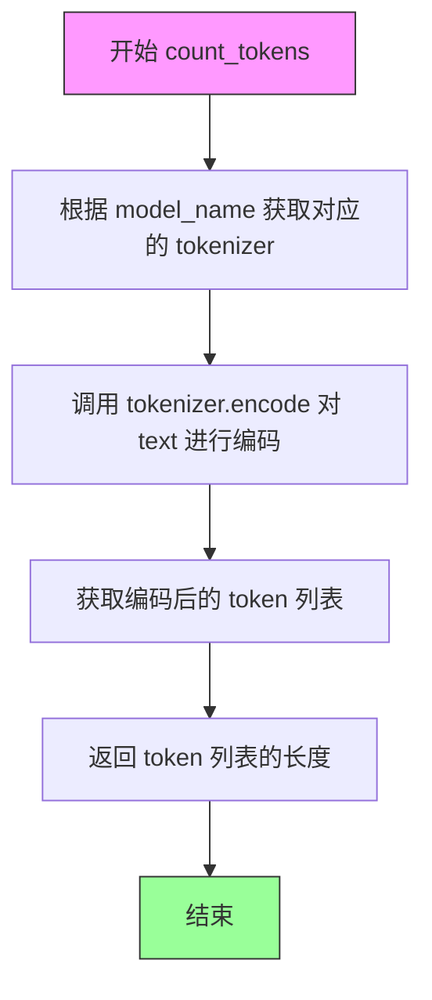

#### 带注释源码

```python
def count_tokens(self, text: str, model_name: _ModelName) -> int:
    """
    计算给定文本的token数量
    
    该方法首先根据传入的 model_name 获取对应的 tokenizer 实例，
    然后使用该 tokenizer 对文本进行编码，最后返回编码后 token 列表的长度。
    
    Args:
        text: str，需要计算token数的文本内容
        model_name: _ModelName，模型名称，用于从 MODELS 映射中获取对应模型的tokenizer
    
    Returns:
        int，文本被tokenizer编码后生成的token数量
    """
    # 步骤1：获取指定模型对应的tokenizer
    # get_tokenizer 方法会根据 model_name 从模型配置中获取对应的tokenizer实例
    tokenizer = self.get_tokenizer(model_name)
    
    # 步骤2：使用tokenizer对文本进行编码
    # encode 方法会将文本字符串转换为token ID列表
    encoded = tokenizer.encode(text)
    
    # 步骤3：返回编码后token列表的长度
    # 这个长度即为文本的token数量
    return len(encoded)
```


### `_BaseOpenAIProvider._retry_api_request`

这是一个 API 请求重试装饰器方法，用于为传入的函数添加自动重试逻辑。该方法使用 `tenacity` 库实现重试机制，特别针对 API 连接错误和服务器端错误（5xx 状态码）进行重试，并采用指数退避策略控制重试间隔。

参数：

- `func`：`Callable[_P, _T]`，需要添加重试机制的异步函数

返回值：`Callable[_P, _T]`，返回包装了重试逻辑的函数

#### 流程图

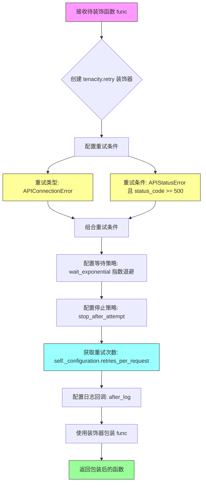

#### 带注释源码

```python
def _retry_api_request(self, func: Callable[_P, _T]) -> Callable[_P, _T]:
    """
    创建一个 API 请求重试装饰器
    
    该方法使用 tenacity 库为传入的函数添加自动重试逻辑，
    专门处理 OpenAI API 可能出现的连接错误和服务器错误。
    
    参数:
        func: 需要添加重试机制的异步函数
        
    返回:
        包装了重试逻辑的函数
    """
    return tenacity.retry(
        # 定义重试条件：重试 API 连接错误 或 服务器错误(5xx)
        retry=(
            # 条件1: 重试 APIConnectionError（网络连接问题）
            tenacity.retry_if_exception_type(APIConnectionError)
            # 条件2: 重试 APIStatusError 且状态码 >= 500（服务器内部错误）
            | tenacity.retry_if_exception(
                lambda e: isinstance(e, APIStatusError) and e.status_code >= 500
            )
        ),
        # 等待策略：指数退避，重试间隔时间逐渐增加
        wait=tenacity.wait_exponential(),
        # 停止策略：最多重试配置的次数
        stop=tenacity.stop_after_attempt(self._configuration.retries_per_request),
        # 在每次重试后记录日志（DEBUG级别）
        after=tenacity.after_log(self._logger, logging.DEBUG),
    )(func)
```


### `_BaseOpenAIProvider.__repr__`

该方法是一个Python魔术方法（dunder method），用于返回对象的字符串表示形式。它获取当前类的名称并拼接空括号，生成类似 `ClassName()` 格式的字符串，供调试和日志输出使用。

参数：
- 无显式参数（隐式参数 `self` 代表实例本身）

返回值：`str`，返回类的字符串表示，格式为 `{类名}()`

#### 流程图

```mermaid
flowchart TD
    A[开始 __repr__] --> B[获取 self.__class__.__name__]
    B --> C[拼接字符串: {类名}()]
    C --> D[返回字符串]
    D --> E[结束]
```

#### 带注释源码

```python
def __repr__(self):
    """
    返回对象的字符串表示形式
    
    Returns:
        str: 类的名称加上空括号，例如 'SomeProvider()'
    """
    # 获取当前类的名称（例如 'OpenAIProvider' 或其子类名称）
    # self.__class__.__name__ 会返回实际实例化的类名
    return f"{self.__class__.__name__}()"
```


### `BaseOpenAIChatProvider.__init__`

该方法用于初始化聊天模型提供者，验证类属性配置，调用父类初始化逻辑，并创建异步OpenAI客户端实例。

参数：

- `settings`：`Optional[_ModelProviderSettings]`，可选的模型提供者设置，包含API凭证、配置等信息，若未提供则使用默认设置的深拷贝
- `logger`：`Optional[logging.Logger]`，可选的日志记录器实例，用于输出运行日志，若未提供则使用父类默认的日志记录器

返回值：无（`None`），该方法为构造函数，仅执行初始化逻辑不返回值

#### 流程图

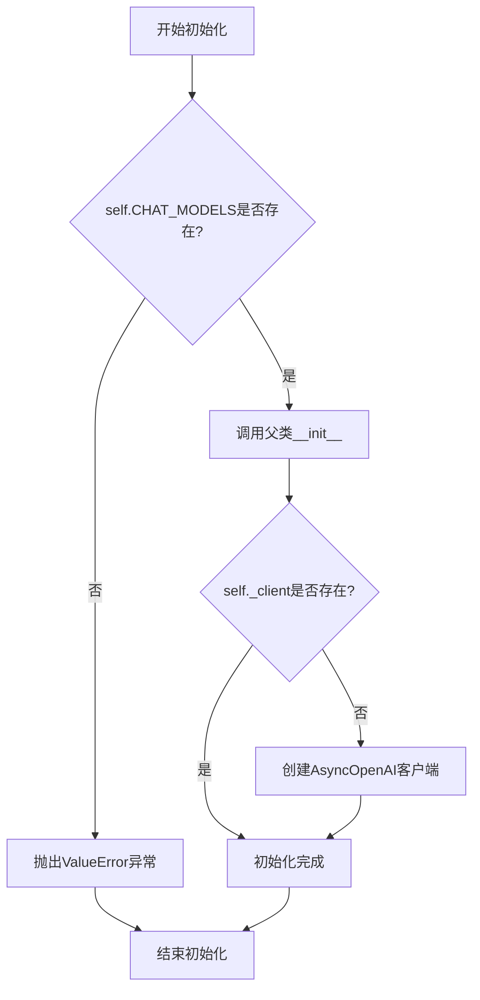

#### 带注释源码

```python
def __init__(
    self,
    settings: Optional[_ModelProviderSettings] = None,
    logger: Optional[logging.Logger] = None,
):
    """
    初始化聊天模型提供者
    
    参数:
        settings: 模型提供者设置，包含API密钥、配置等，若为None则使用默认设置
        logger: 日志记录器实例，若为None则使用父类默认的日志记录器
    """
    # 检查子类是否定义了CHAT_MODELS类属性
    # CHAT_MODELS是必须的配置，用于映射模型名称到模型信息
    if not getattr(self, "CHAT_MODELS", None):
        raise ValueError(f"{self.__class__.__name__}.CHAT_MODELS is not set")

    # 调用父类BaseModelProvider的初始化方法
    # 父类会处理settings的合并、凭据的加载等逻辑
    super(BaseOpenAIChatProvider, self).__init__(settings=settings, logger=logger)
    
    # 注意：_client的创建实际上在父类_BaseOpenAIProvider.__init__中完成
    # 此处仅作流程说明，实际的AsyncOpenAI客户端创建发生在父类初始化过程中
```


### `BaseOpenAIChatProvider.get_available_chat_models`

获取当前模型供应商提供的所有可用聊天模型。该方法是一个异步方法，首先调用父类 `_BaseOpenAIProvider` 的 `get_available_models()` 方法获取完整的模型列表（包含聊天和嵌入模型），然后通过比较 `ModelProviderService.CHAT` 筛选出仅适用于聊天功能的模型信息，并返回一个有序序列。

参数：

- `self`：`BaseOpenAIChatProvider`，隐式参数，代表当前聊天模型供应者实例。

返回值：`Sequence[ChatModelInfo[_ModelName]]`，返回符合条件的聊天模型信息对象组成的序列。如果模型列表为空或没有匹配的聊天模型，则返回空序列。

#### 流程图

```mermaid
flowchart TD
    A([开始获取聊天模型]) --> B{调用父类方法}
    B --> C[await self.get_available_models]
    C --> D[获取到混合模型列表\nChatModelInfo | EmbeddingModelInfo]
    D --> E{遍历模型列表}
    E -->|每个模型| F{检查服务类型}
    F -->|model.service == \nModelProviderService.CHAT| G[加入结果列表]
    F -->|不是聊天服务| H[跳过]
    G --> E
    H --> E
    E --> I([返回筛选后的\nSequence[ChatModelInfo]])
```

#### 带注释源码

```python
async def get_available_chat_models(self) -> Sequence[ChatModelInfo[_ModelName]]:
    """
    获取可用的聊天模型列表。

    实现步骤：
    1. 调用父类方法获取所有支持的服务（包括聊天和嵌入）。
    2. 使用列表推导式过滤出服务类型为 CHAT 的模型。

    返回:
        符合聊天服务类型的模型信息序列。
    """
    # 调用父类 _BaseOpenAIProvider 的方法获取所有模型
    # 返回类型为 Sequence[ChatModelInfo | EmbeddingModelInfo]
    all_available_models = await self.get_available_models()
    
    # 筛选条件：只保留 service 字段等于 ModelProviderService.CHAT 的模型
    # 由于返回类型被声明为 Sequence[ChatModelInfo]，类型推导会自动将结果 narrow 为 ChatModelInfo
    return [
        model
        for model in all_available_models
        if model.service == ModelProviderService.CHAT
    ]
```


### `BaseOpenAIChatProvider.count_message_tokens`

该方法用于计算聊天消息列表的token数量，通过将消息格式化为特定字符串后调用tokenizer进行编码计数，支持单个消息或消息列表的统一处理。

参数：

- `self`：实例本身，隐式传递
- `messages`：`ChatMessage | list[ChatMessage]`，待计算token的聊天消息，可以是单个消息对象或消息列表
- `model_name`：`_ModelName`，模型名称，用于选择对应的tokenizer

返回值：`int`，返回计算得到的token总数

#### 流程图

```mermaid
flowchart TD
    A[开始 count_message_tokens] --> B{判断 messages 类型}
    B -->|ChatMessage 单条| C[将单条消息转换为列表]
    B -->|list[ChatMessage]| D[直接使用列表]
    C --> E[格式化消息字符串]
    D --> E
    E --> F[拼接: 角色1.upper(): 内容1\n\n角色2.upper(): 内容2...]
    F --> G[调用 self.count_tokens]
    G --> H[返回 token 总数]
    
    style A fill:#f9f,color:#333
    style H fill:#9f9,color:#333
```

#### 带注释源码

```python
def count_message_tokens(
    self,
    messages: ChatMessage | list[ChatMessage],
    model_name: _ModelName,
) -> int:
    """
    计算聊天消息列表的token数量
    
    参数:
        messages: 单个ChatMessage对象或ChatMessage列表
        model_name: 模型名称，用于选择合适的tokenizer
    
    返回:
        int: 消息列表的总token数
    """
    # 如果传入的是单个ChatMessage对象，转换为列表统一处理
    if isinstance(messages, ChatMessage):
        messages = [messages]
    
    # 将每条消息格式化为 "角色: 内容" 的格式
    # 使用双换行符 "\n\n" 作为分隔符，符合OpenAI的消息格式约定
    # role.upper() 确保角色名称大写（如 "user" -> "USER"）
    formatted_text = "\n\n".join(
        f"{m.role.upper()}: {m.content}" for m in messages
    )
    
    # 调用父类的 count_tokens 方法计算token数量
    # 该方法内部会获取对应模型的tokenizer并编码文本
    return self.count_tokens(formatted_text, model_name)
```


### `BaseOpenAIChatProvider.create_chat_completion`

创建聊天补全的异步方法，通过 OpenAI 兼容 API 实现对话生成，支持函数调用、重试机制、解析错误自动修复和成本跟踪。

#### 参数

- `model_prompt`：`list[ChatMessage]`，聊天消息列表，作为模型输入的对话历史
- `model_name`：`_ModelName`，要使用的模型标识符
- `completion_parser`：`Callable[[AssistantChatMessage], _T] = lambda _: None`，用于解析助手消息的回调函数，默认返回 None
- `functions`：`Optional[list[CompletionModelFunction]] = None`，可选的函数定义列表，供模型调用
- `max_output_tokens`：`Optional[int] = None`，生成内容的最大 token 数量限制
- `prefill_response`：`str = ""`，预填充的响应内容
- `**kwargs`：其他关键字参数，会传递给底层 API 调用

#### 返回值

`ChatModelResponse[_T]`，包含以下字段：
- `response`：助手消息的原始内容
- `parsed_result`：经过 completion_parser 解析后的结果
- `llm_info`：使用的模型信息
- `prompt_tokens_used`：消耗的输入 token 数量
- `completion_tokens_used`：消耗的输出 token 数量

#### 流程图

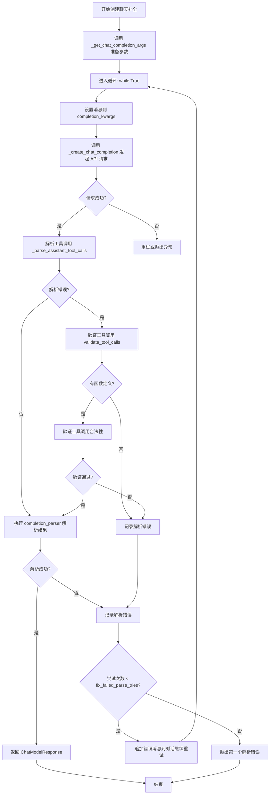

#### 带注释源码

```python
async def create_chat_completion(
    self,
    model_prompt: list[ChatMessage],
    model_name: _ModelName,
    completion_parser: Callable[[AssistantChatMessage], _T] = lambda _: None,
    functions: Optional[list[CompletionModelFunction]] = None,
    max_output_tokens: Optional[int] = None,
    prefill_response: str = "",
    **kwargs,
) -> ChatModelResponse[_T]:
    """Create a chat completion using the API."""

    # 第一步：准备 API 调用所需的参数
    # 将高级的 ChatMessage 转换为 OpenAI 格式的消息
    (
        openai_messages,
        completion_kwargs,
        parse_kwargs,
    ) = self._get_chat_completion_args(
        prompt_messages=model_prompt,
        model=model_name,
        functions=functions,
        max_output_tokens=max_output_tokens,
        **kwargs,
    )

    total_cost = 0.0  # 累计 API 调用成本
    attempts = 0      # 当前尝试次数

    # 进入主循环：支持解析失败后自动修复
    while True:
        # 将消息设置到请求参数中（每次循环可能添加新的错误修正消息）
        completion_kwargs["messages"] = openai_messages
        
        # 发起实际的 API 调用，获取响应和 token 使用情况
        _response, _cost, t_input, t_output = await self._create_chat_completion(
            model=model_name,
            completion_kwargs=completion_kwargs,
        )
        total_cost += _cost  # 累加成本

        attempts += 1  # 尝试次数加一
        parse_errors: list[Exception] = []  # 重置解析错误列表

        # 获取助手消息
        _assistant_msg = _response.choices[0].message

        # 解析工具调用（如果有）
        tool_calls, _errors = self._parse_assistant_tool_calls(
            _assistant_msg, **parse_kwargs
        )
        parse_errors += _errors

        # 验证工具调用（如果有函数定义）
        if not parse_errors and tool_calls and functions:
            parse_errors += validate_tool_calls(tool_calls, functions)

        # 构建助手消息对象
        assistant_msg = AssistantChatMessage(
            content=_assistant_msg.content or "",
            tool_calls=tool_calls or None,
        )

        # 尝试解析结果
        parsed_result: _T = None  # type: ignore
        if not parse_errors:
            try:
                # 调用用户提供的解析器
                parsed_result = completion_parser(assistant_msg)
            except Exception as e:
                parse_errors.append(e)

        # 如果没有解析错误，成功返回结果
        if not parse_errors:
            if attempts > 1:
                self._logger.debug(
                    f"Total cost for {attempts} attempts: ${round(total_cost, 5)}"
                )

            return ChatModelResponse(
                response=AssistantChatMessage(
                    content=_assistant_msg.content or "",
                    tool_calls=tool_calls or None,
                ),
                parsed_result=parsed_result,
                llm_info=self.CHAT_MODELS[model_name],
                prompt_tokens_used=t_input,
                completion_tokens_used=t_output,
            )

        # 如果有解析错误，进行错误处理
        else:
            self._logger.debug(
                f"Parsing failed on response: '''{_assistant_msg}'''"
            )
            # 格式化错误信息
            parse_errors_fmt = "\n\n".join(
                f"{e.__class__.__name__}: {e}" for e in parse_errors
            )
            self._logger.warning(
                f"Parsing attempt #{attempts} failed: {parse_errors_fmt}"
            )
            # 上报错误到 Sentry
            for e in parse_errors:
                sentry_sdk.capture_exception(
                    error=e,
                    extras={"assistant_msg": _assistant_msg, "i_attempt": attempts},
                )

            # 检查是否还有重试机会
            if attempts < self._configuration.fix_failed_parse_tries:
                # 将助手回复和错误信息添加到对话中，让 LLM 自我修正
                openai_messages.append(
                    cast(
                        ChatCompletionAssistantMessageParam,
                        _assistant_msg.model_dump(exclude_none=True),
                    )
                )
                openai_messages.append(
                    {
                        "role": "system",
                        "content": (
                            f"ERROR PARSING YOUR RESPONSE:\n\n{parse_errors_fmt}"
                        ),
                    }
                )
                continue  # 继续下一次循环
            else:
                # 重试次数用尽，抛出第一个错误
                raise parse_errors[0]
```


### `BaseOpenAIChatProvider._get_chat_completion_args`

准备API调用参数，将内部消息格式转换为OpenAI API兼容格式，并处理函数定义、最大令牌数等可选参数。

参数：

- `self`：`BaseOpenAIChatProvider`实例，上下文对象
- `prompt_messages`：`list[ChatMessage]`，待处理的聊天消息列表
- `model`：`_ModelName`，要使用的模型标识符
- `functions`：`Optional[list[CompletionModelFunction]]`，可选的函数定义列表，供LLM调用
- `max_output_tokens`：`Optional[int]`，可选的最大输出令牌数限制
- `**kwargs`：`dict`，其他传递给API的额外参数

返回值：`tuple[list[ChatCompletionMessageParam], CompletionCreateParams, dict[str, Any]]`，包含三个元素：
- `list[ChatCompletionMessageParam]`：经转换后符合OpenAI API要求的prompt消息列表
- `CompletionCreateParams`：包含模型、工具配置、额外请求头等API调用参数的字典
- `dict[str, Any]`：传递给completion parser的额外关键字参数（本函数始终返回空字典）

#### 流程图

```mermaid
flowchart TD
    A[开始 _get_chat_completion_args] --> B{检查 max_output_tokens}
    B -->|有值| C[设置 kwargs['max_tokens']]
    B -->|无值| D{检查 functions}
    
    D -->|有functions| E[格式化函数定义并设置 kwargs['tools']]
    D -->|无functions| F{检查 extra_headers}
    
    E --> G{functions 长度是否为1}
    G -->|是| H[强制设置 tool_choice 调用唯一函数]
    G -->|否| F
    
    F -->|存在| I[合并 extra_headers 到 kwargs]
    F -->|不存在| J[遍历 prompt_messages]
    
    I --> J
    
    J --> K[将每条消息 model_dump 为 OpenAI 格式]
    K --> L{检查 kwargs 中是否存在 'messages'}
    
    L -->|存在| M[将额外消息合并到 prepped_messages 并删除原 kwargs['messages']]
    L -->|不存在| N[返回三元组]
    
    M --> N
    
    N[结束并返回 tuple]
```

#### 带注释源码

```python
def _get_chat_completion_args(
    self,
    prompt_messages: list[ChatMessage],
    model: _ModelName,
    functions: Optional[list[CompletionModelFunction]] = None,
    max_output_tokens: Optional[int] = None,
    **kwargs,
) -> tuple[
    list[ChatCompletionMessageParam], CompletionCreateParams, dict[str, Any]
]:
    """Prepare keyword arguments for a chat completion API call

    Args:
        prompt_messages: List of ChatMessages
        model: The model to use
        functions (optional): List of functions available to the LLM
        max_output_tokens (optional): Maximum number of tokens to generate

    Returns:
        list[ChatCompletionMessageParam]: Prompt messages for the API call
        CompletionCreateParams: Mapping of other kwargs for the API call
        Mapping[str, Any]: Any keyword arguments to pass on to the completion parser
    """
    # 将 kwargs 强制转换为 CompletionCreateParams 类型，确保类型安全
    kwargs = cast(CompletionCreateParams, kwargs)

    # 如果提供了最大输出令牌数限制，将其添加到 API 参数中
    if max_output_tokens:
        kwargs["max_output_tokens"] = max_output_tokens

    # 如果提供了函数定义，将函数格式化为 OpenAI 兼容格式并设置为工具
    if functions:
        # 遍历所有函数，将每个函数转换为 OpenAI 格式的函数定义
        kwargs["tools"] = [  # pyright: ignore - it fails to infer the dict type
            {"type": "function", "function": format_function_def_for_openai(f)}
            for f in functions
        ]
        # 如果只有一个函数，强制模型调用该函数（通过 tool_choice）
        if len(functions) == 1:
            # force the model to call the only specified function
            kwargs["tool_choice"] = {  # pyright: ignore - type inference failure
                "type": "function",
                "function": {"name": functions[0].name},
            }

    # 检查配置中是否有额外的请求头需要添加到 API 请求中
    # 注意：extra_headers 不在 CompletionCreateParams 定义中，但 chat.create() 支持
    if extra_headers := self._configuration.extra_request_headers:
        # 初始化 extra_headers 字典（如果不存在）
        kwargs["extra_headers"] = kwargs.get("extra_headers", {})  # type: ignore
        # 将配置的额外请求头复制并合并到现有 headers 中
        kwargs["extra_headers"].update(extra_headers.copy())  # type: ignore

    # 将内部的 ChatMessage 对象列表转换为 OpenAI API 兼容的消息格式
    # 只保留特定字段：role, content, tool_calls, tool_call_id, name
    # 排除 None 值以保持消息简洁
    prepped_messages: list[ChatCompletionMessageParam] = [
        message.model_dump(  # type: ignore
            include={"role", "content", "tool_calls", "tool_call_id", "name"},
            exclude_none=True,
        )
        for message in prompt_messages
    ]

    # 检查 kwargs 中是否包含额外的 'messages' 参数（如系统消息等）
    if "messages" in kwargs:
        # 将额外消息追加到已准备好的消息列表中
        prepped_messages += kwargs["messages"]
        # 从 kwargs 中删除 messages，避免重复传递
        del kwargs["messages"]  # type: ignore - messages are added back later

    # 返回三元组：
    # 1. 准备好的消息列表
    # 2. 包含其他 API 调用参数的字典（模型、工具等）
    # 3. 传递给解析器的额外参数（本函数始终返回空字典）
    return prepped_messages, kwargs, {}
```


### `BaseOpenAIChatProvider._create_chat_completion`

该方法负责执行实际的 OpenAI 兼容 Chat Completion API 调用，通过重试装饰器处理临时性故障，并返回原始响应对象、计算成本及 token 使用统计。

**参数：**

- `self`：BaseOpenAIChatProvider 实例的引用
- `model`：`_ModelName`，指定用于完成生成的模型标识符
- `completion_kwargs`：`CompletionCreateParams`，包含除模型名称外的所有 API 调用参数（如消息、温度、工具等）

**返回值：**
- `tuple[ChatCompletion, float, int, int]`，包含四个元素：
  1. `ChatCompletion`：API 返回的原始聊天完成响应对象
  2. `float`：本次调用的美元成本
  3. `int`：输入（prompt）使用的 token 数量
  4. `int`：输出（completion）使用的 token 数量

#### 流程图

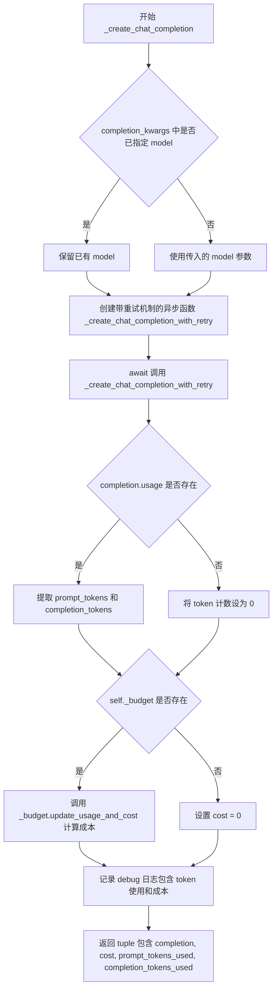

#### 带注释源码

```python
async def _create_chat_completion(
    self,
    model: _ModelName,
    completion_kwargs: CompletionCreateParams,
) -> tuple[ChatCompletion, float, int, int]:
    """
    Create a chat completion using an OpenAI-like API with retry handling

    Params:
        model: The model to use for the completion
        completion_kwargs: All other arguments for the completion call

    Returns:
        ChatCompletion: The chat completion response object
        float: The cost ($) of this completion
        int: Number of prompt tokens used
        int: Number of completion tokens used
    """
    # 确保 completion_kwargs 中包含 model 字段，优先使用 kwargs 中已有的值
    completion_kwargs["model"] = completion_kwargs.get("model") or model

    # 定义内部重试函数，使用 _retry_api_request 装饰器处理临时性 API 错误
    # 该装饰器会自动处理 APIConnectionError 和 5xx 状态码错误
    @self._retry_api_request
    async def _create_chat_completion_with_retry() -> ChatCompletion:
        return await self._client.chat.completions.create(
            **completion_kwargs,  # type: ignore
        )

    # 执行实际的 API 调用
    completion = await _create_chat_completion_with_retry()

    # 从响应中提取 token 使用情况
    if completion.usage:
        prompt_tokens_used = completion.usage.prompt_tokens
        completion_tokens_used = completion.usage.completion_tokens
    else:
        # 某些 API 提供商可能不返回 usage 信息，此时设为 0
        prompt_tokens_used = completion_tokens_used = 0

    # 如果配置了预算管理器，则计算本次调用的成本
    if self._budget:
        cost = self._budget.update_usage_and_cost(
            model_info=self.CHAT_MODELS[model],
            input_tokens_used=prompt_tokens_used,
            output_tokens_used=completion_tokens_used,
        )
    else:
        # 未配置预算管理器时，成本为 0
        cost = 0

    # 记录详细的调试日志，包含模型名称、token 消耗和预估成本
    self._logger.debug(
        f"{model} completion usage: {prompt_tokens_used} input, "
        f"{completion_tokens_used} output - ${round(cost, 5)}"
    )
    # 返回完整的响应对象、成本及 token 使用统计
    return completion, cost, prompt_tokens_used, completion_tokens_used
```


### `BaseOpenAIChatProvider._parse_assistant_tool_calls`

该方法负责将 OpenAI API 返回的助手消息中的工具调用（tool_calls）解析为应用程序内部的 `AssistantToolCall` 对象列表，同时收集解析过程中可能出现的错误。

参数：

- `self`：`BaseOpenAIChatProvider`，当前类的实例，隐式参数
- `assistant_message`：`ChatCompletionMessage`，来自 OpenAI API 的助手消息对象，包含可能存在的工具调用信息
- `**kwargs`：可选关键字参数，用于扩展或传递额外的解析配置（当前代码中未使用）

返回值：`tuple[list[AssistantToolCall], list[Exception]]`，第一个元素是成功解析的 `AssistantToolCall` 对象列表，第二个元素是在解析过程中收集到的异常列表

#### 流程图

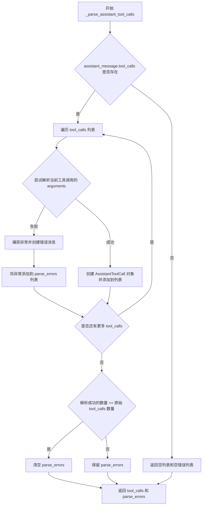

#### 带注释源码

```python
def _parse_assistant_tool_calls(
    self, assistant_message: ChatCompletionMessage, **kwargs
) -> tuple[list[AssistantToolCall], list[Exception]]:
    """
    解析助手消息中的工具调用
    
    将 OpenAI API 返回的原始工具调用数据转换为应用程序内部使用的
    AssistantToolCall 对象，并收集解析过程中的错误
    """
    # 初始化结果列表和错误列表
    tool_calls: list[AssistantToolCall] = []
    parse_errors: list[Exception] = []

    # 检查助手消息是否包含工具调用
    if assistant_message.tool_calls:
        # 遍历每个工具调用
        for _tc in assistant_message.tool_calls:
            try:
                # 使用 json_loads 解析函数参数（JSON 字符串）
                parsed_arguments = json_loads(_tc.function.arguments)
            except Exception as e:
                # 解析失败时，记录详细的错误信息
                err_message = (
                    f"Decoding arguments for {_tc.function.name} failed: "
                    + str(e.args[0])
                )
                # 保留原始异常的 traceback 信息
                parse_errors.append(
                    type(e)(err_message, *e.args[1:]).with_traceback(
                        e.__traceback__
                    )
                )
                # 跳到下一个工具调用，继续处理
                continue

            # 解析成功，创建 AssistantToolCall 对象
            tool_calls.append(
                AssistantToolCall(
                    id=_tc.id,
                    type=_tc.type,
                    function=AssistantFunctionCall(
                        name=_tc.function.name,
                        arguments=parsed_arguments,
                    ),
                )
            )

        # 如果所有工具调用都解析成功，清空错误列表
        # 只有当解析成功的数量等于原始数量时才清空
        if len(tool_calls) == len(assistant_message.tool_calls):
            parse_errors = []

    # 返回解析结果和可能的错误
    return tool_calls, parse_errors
```


### `BaseOpenAIEmbeddingProvider.__init__`

初始化嵌入模型提供者，检查类属性配置，调用父类构造函数并初始化 OpenAI 异步客户端。

参数：

-  `settings`：`_ModelProviderSettings | None`，可选的模型提供者配置对象，包含 API 凭证、端点、重试策略等设置
-  `logger`：`logging.Logger | None`，可选的日志记录器，用于输出调试和信息日志

返回值：`None`，该方法为构造函数，不返回任何值

#### 流程图

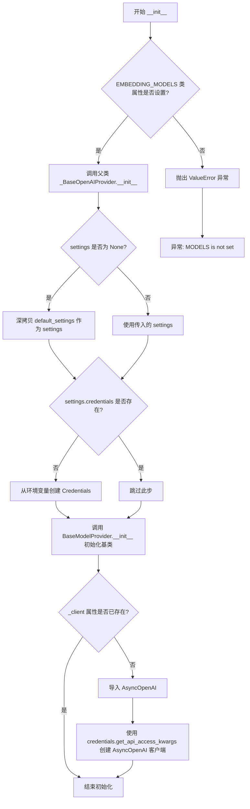

#### 带注释源码

```python
def __init__(
    self,
    settings: Optional[_ModelProviderSettings] = None,
    logger: Optional[logging.Logger] = None,
):
    """初始化嵌入模型提供者
    
    Args:
        settings: 可选的模型提供者配置，包含 API 凭证、端点配置等
        logger: 可选的日志记录器
        
    Raises:
        ValueError: 当 EMBEDDING_MODELS 类属性未设置时抛出
    """
    # 检查子类是否定义了 EMBEDDING_MODELS 类变量
    # 这是嵌入模型提供者的必要配置，必须在子类中声明
    if not getattr(self, "EMBEDDING_MODELS", None):
        raise ValueError(f"{self.__class__.__name__}.EMBEDDING_MODELS is not set")

    # 调用父类 _BaseOpenAIProvider 的初始化方法
    # 父类会完成以下操作：
    # 1. 验证 MODELS 类属性是否存在
    # 2. 如果 settings 为 None，则使用 default_settings 的深拷贝
    # 3. 如果 credentials 不存在，从环境变量加载
    # 4. 调用 BaseModelProvider 初始化基础配置
    # 5. 创建 AsyncOpenAI 客户端实例
    super(BaseOpenAIEmbeddingProvider, self).__init__(
        settings=settings, logger=logger
    )
```


### `BaseOpenAIEmbeddingProvider.get_available_embedding_models`

获取该Provider支持的嵌入模型列表。该方法首先调用父类的 `get_available_models()` 方法获取所有可用模型（包括聊天模型和嵌入模型），然后过滤出服务类型为 `EMBEDDING` 的模型并返回。

参数：

- `self`：隐式参数，类型为 `BaseOpenAIEmbeddingProvider[_ModelName, _ModelProviderSettings]`。代表当前Provider实例本身。

返回值：`Sequence[EmbeddingModelInfo[_ModelName]]`，返回当前Provider可用的嵌入模型信息序列。每个元素包含模型ID、名称、最大Token数、费用等信息。

#### 流程图

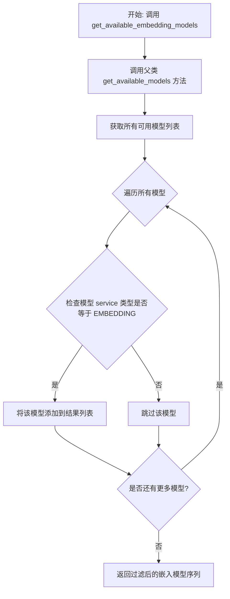

#### 带注释源码

```python
async def get_available_embedding_models(
    self,
) -> Sequence[EmbeddingModelInfo[_ModelName]]:
    """
    获取当前Provider支持的嵌入模型列表
    
    该方法通过以下步骤实现：
    1. 调用父类的 get_available_models() 方法获取所有可用模型
    2. 过滤出 service 类型为 ModelProviderService.EMBEDDING 的模型
    3. 返回符合条件的嵌入模型信息序列
    
    Returns:
        Sequence[EmbeddingModelInfo[_ModelName]]: 可用的嵌入模型信息列表
    """
    # 调用父类方法获取所有可用模型（聊天模型 + 嵌入模型）
    # 父类 _BaseOpenAIProvider.get_available_models() 是异步方法
    # 返回类型为 Sequence[ChatModelInfo[_ModelName] | EmbeddingModelInfo[_ModelName]]
    all_available_models = await self.get_available_models()
    
    # 使用列表推导式过滤出嵌入模型
    # 仅保留 service 字段等于 ModelProviderService.EMBEDDING 的模型
    return [
        model
        for model in all_available_models
        if model.service == ModelProviderService.EMBEDDING
    ]
```


### `BaseOpenAIEmbeddingProvider.create_embedding`

该方法是一个异步函数，用于调用 OpenAI 兼容的嵌入模型 API 生成文本的嵌入向量（Embedding）。它首先构建 API 请求参数，随后执行带重试机制的网络请求，对返回的原始向量应用自定义解析器（如归一化），最终封装成包含向量数据、模型元信息和 token 使用量的标准响应对象。

参数：

- `self`：类的实例本身。
- `text`：`str`，需要生成嵌入向量的输入文本。
- `model_name`：`_ModelName`，指定使用的嵌入模型名称。
- `embedding_parser`：`Callable[[Embedding], Embedding]`，一个回调函数，用于对模型返回的原始嵌入向量进行处理（例如归一化或类型转换）。
- `**kwargs`：可变关键字参数，会传递给底层 API 调用。

返回值：`EmbeddingModelResponse`，包含处理后的嵌入向量对象、模型信息以及本次请求消耗的 prompt tokens 数量。

#### 流程图

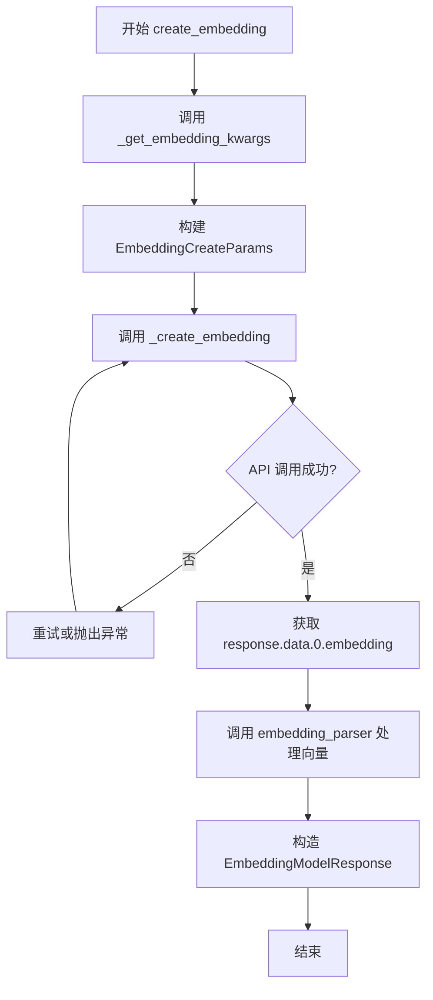

#### 带注释源码

```python
async def create_embedding(
    self,
    text: str,
    model_name: _ModelName,
    embedding_parser: Callable[[Embedding], Embedding],
    **kwargs,
) -> EmbeddingModelResponse:
    """Create an embedding using an OpenAI-like API"""
    # 1. 准备参数：将输入文本、模型名称以及额外的关键字参数封装成
    #    OpenAI SDK 所需的 EmbeddingCreateParams 格式
    embedding_kwargs = self._get_embedding_kwargs(
        input=text, model=model_name, **kwargs
    )
    
    # 2. 执行请求：调用内部方法 _create_embedding，该方法内部实现了
    #    重试逻辑（处理网络错误或 5xx 错误），并等待 API 返回结果
    response = await self._create_embedding(embedding_kwargs)

    # 3. 处理结果：使用传入的 embedding_parser 对原始向量进行后处理
    #    （例如向量归一化），并构造包含元数据的响应对象返回给调用者
    return EmbeddingModelResponse(
        embedding=embedding_parser(response.data[0].embedding),
        llm_info=self.EMBEDDING_MODELS[model_name],
        prompt_tokens_used=response.usage.prompt_tokens,
    )

def _get_embedding_kwargs(
    self, input: str | list[str], model: _ModelName, **kwargs
) -> EmbeddingCreateParams:
    """Get kwargs for an embedding API call

    Params:
        input: Text body or list of text bodies to create embedding(s) from
        model: Embedding model to use

    Returns:
        The kwargs for the embedding API call
    """
    # 类型强制转换，确保 kwargs 符合 EmbeddingCreateParams 类型定义
    kwargs = cast(EmbeddingCreateParams, kwargs)

    kwargs["input"] = input
    kwargs["model"] = model

    # 处理额外的请求头配置（如授权信息或自定义元数据）
    if extra_headers := self._configuration.extra_request_headers:
        # 'extra_headers' is not on CompletionCreateParams, but is on embedding.create()
        kwargs["extra_headers"] = kwargs.get("extra_headers", {})  # type: ignore
        kwargs["extra_headers"].update(extra_headers.copy())  # type: ignore

    return kwargs

def _create_embedding(
    self, embedding_kwargs: EmbeddingCreateParams
) -> Awaitable[CreateEmbeddingResponse]:
    """Create an embedding using an OpenAI-like API with retry handling."""

    # 定义一个内部协程函数，用于执行具体的 API 调用
    @self._retry_api_request
    async def _create_embedding_with_retry() -> CreateEmbeddingResponse:
        return await self._client.embeddings.create(**embedding_kwargs)

    # 返回异步结果
    return _create_embedding_with_retry()
```


### `BaseOpenAIEmbeddingProvider._get_embedding_kwargs`

准备嵌入参数，构建并返回用于调用嵌入 API 的参数字典。

参数：

- `self`：隐式参数，类方法的标准参数
- `input`：`str | list[str]`，要创建嵌入的文本或文本列表
- `model`：`_ModelName`，嵌入模型标识符
- `**kwargs`：`dict`，额外的关键字参数，将被合并到最终参数中

返回值：`EmbeddingCreateParams`，嵌入 API 调用的完整参数字典

#### 流程图

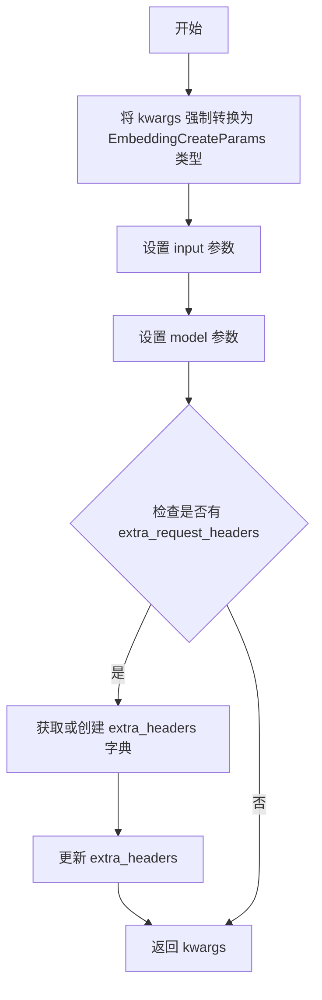

#### 带注释源码

```python
def _get_embedding_kwargs(
    self, input: str | list[str], model: _ModelName, **kwargs
) -> EmbeddingCreateParams:
    """Get kwargs for an embedding API call

    Params:
        input: Text body or list of text bodies to create embedding(s) from
        model: Embedding model to use

    Returns:
        The kwargs for the embedding API call
    """
    # 将 kwargs 强制转换为 EmbeddingCreateParams 类型，确保类型安全
    kwargs = cast(EmbeddingCreateParams, kwargs)

    # 设置输入文本或文本列表
    kwargs["input"] = input
    # 设置要使用的嵌入模型
    kwargs["model"] = model

    # 检查是否配置了额外的请求头
    if extra_headers := self._configuration.extra_request_headers:
        # 注意：extra_headers 不在 CompletionCreateParams 中，但在 embedding.create() 中支持
        # 获取已存在的 extra_headers 或创建新字典
        kwargs["extra_headers"] = kwargs.get("extra_headers", {})  # type: ignore
        # 更新 extra_headers，添加配置中的额外请求头
        kwargs["extra_headers"].update(extra_headers.copy())  # type: ignore

    # 返回构建好的嵌入 API 参数
    return kwargs
```


### `BaseOpenAIEmbeddingProvider._create_embedding`

该方法是嵌入模型提供的核心方法，通过装饰器实现重试机制，异步调用 OpenAI 兼容的嵌入创建 API 并返回嵌入响应。

参数：

- `embedding_kwargs`：`EmbeddingCreateParams`，包含嵌入模型名称、输入文本等API调用所需的参数

返回值：`Awaitable[CreateEmbeddingResponse]` 一个异步可等待对象，最终解析为嵌入创建响应对象

#### 流程图

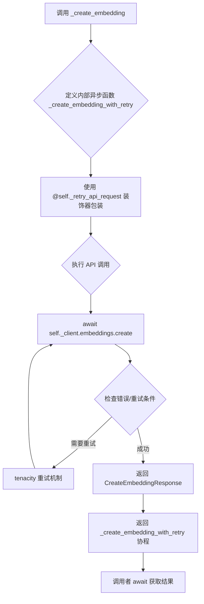

#### 带注释源码

```python
def _create_embedding(
    self, embedding_kwargs: EmbeddingCreateParams
) -> Awaitable[CreateEmbeddingResponse]:
    """Create an embedding using an OpenAI-like API with retry handling.

    该方法使用 tenacity 库提供的重试装饰器来处理可能的网络错误
    和服务端 500 错误，确保嵌入创建的可靠性。

    Args:
        embedding_kwargs: 嵌入API调用的参数，包含model和input等字段

    Returns:
        Awaitable[CreateEmbeddingResponse]: 可等待的嵌入响应对象
    """
    # 定义内部异步函数，用于执行实际的嵌入创建调用
    # 并通过 _retry_api_request 装饰器添加重试逻辑
    @self._retry_api_request
    async def _create_embedding_with_retry() -> CreateEmbeddingResponse:
        # 调用客户端的嵌入创建接口，传入参数
        return await self._client.embeddings.create(**embedding_kwargs)

    # 返回协程对象，调用者需要 await 该对象获取最终结果
    return _create_embedding_with_retry()
```

## 关键组件


### _BaseOpenAIProvider

基础OpenAI API提供商抽象类，提供通用的模型提供商功能，包括OpenAI兼容API的客户端初始化、可用模型获取、token计数和API请求重试机制。

### BaseOpenAIChatProvider

聊天模型提供商类，继承自_BaseOpenAIProvider和BaseChatModelProvider，负责创建聊天补全、处理工具调用、解析响应和管理对话消息。

### BaseOpenAIEmbeddingProvider

嵌入模型提供商类，继承自_BaseOpenAIProvider和BaseEmbeddingModelProvider，负责创建文本嵌入向量，支持单文本和批量文本处理。

### format_function_def_for_openai

全局函数，将CompletionModelFunction对象转换为OpenAI API可识别的函数定义格式，包含函数名称、描述和参数模式。

### API重试机制

使用tenacity库实现的指数退避重试逻辑，针对APIConnectionError和5xx状态码错误进行自动重试，默认重试次数可配置。

### 工具调用解析

_parse_assistant_tool_calls方法负责解析Assistant消息中的工具调用，将JSON格式的函数参数反序列化为Python对象，并进行验证。

### 消息token计数

count_message_tokens方法将聊天消息列表转换为文本格式，然后使用tokenizer编码来计算token数量，用于估算API调用成本和上下文窗口限制。

### 错误修复机制

在create_chat_completion中实现的重试逻辑，当解析失败时会将错误信息追加到对话历史中，让LLM自行修复解析错误。

### 预算管理

与self._budget集成，在每次API调用后更新使用量统计并计算成本，支持追踪多个模型调用的总费用。

### 配置管理

处理extra_headers、max_tokens、tool_choice等配置参数，并将这些参数转换为OpenAI API兼容的格式。


## 问题及建议


### 已知问题

-   **模块级函数命名不当**：`format_function_def_for_openai` 函数使用 `self` 作为参数名称，看起来像是一个方法但实际上是模块级函数，容易造成误解。
-   **类型安全妥协**：代码中存在大量 `cast`、`type: ignore` 和 `getattr` 的使用，表明类型注解与实际实现之间存在不匹配，增加了维护成本和运行时错误风险。
-   **硬编码的重试配置**：重试机制使用固定的指数等待策略 (`wait_exponential()`)，参数不可配置，缺乏灵活性。
-   **无效的解析错误处理**：在 `create_chat_completion` 的重试循环中，当解析失败时将错误追加到提示中继续尝试，但 `fix_failed_parse_tries` 配置值的行为可能不符合预期，且缺少最大token限制保护。
-   **模型过滤静默失败**：`get_available_models` 方法会静默跳过不在 `MODELS` 映射中的模型，没有警告日志，可能导致调试困难。
-   **客户端初始化延迟检查**：使用 `getattr(self, "_client", None)` 检查客户端是否存在，但 `AsyncOpenAI` 是在 `__init__` 中动态导入和创建的，缺少统一的初始化入口。
- **不完整的资源清理**：没有实现 `__aenter__` / `__aexit__` 或上下文管理器协议，无法确保 `AsyncOpenAI` 客户端资源被正确释放。
- **响应使用情况可能为空**：`completion.usage` 可能为 `None`，虽然有fallback处理，但这种设计容易在API返回异常时产生隐蔽的计费问题。

### 优化建议

-   将 `format_function_def_for_openai` 重构为静态方法或工具函数，并修正参数命名为符合其实际用途的名称。
-   重新审视类型注解设计，考虑使用泛型约束或抽象基类来减少类型强制转换的使用。
-   将重试配置参数化，允许通过 settings 或构造函数注入自定义的重试策略（如最大等待时间、最小重试次数等）。
-   在模型过滤时添加 `logger.warning` 日志，记录被跳过的模型 ID，便于排查配置问题。
-   实现异步上下文管理器协议 (`__aenter__`, `__aexit__`)，确保客户端连接资源可以正确释放。
-   为 `completion.usage` 为空的情况添加更明确的错误处理或降级策略，而不是默认返回零 tokens。
-   考虑在重试解析失败循环中添加 token 预算检查，防止无限追加导致上下文溢出。

## 其它


### 设计目标与约束

本模块的设计目标是提供一个通用的、OpenAI兼容的LLM和Embedding模型提供者抽象层，支持多种OpenAI风格的API提供者（如Azure OpenAI、Anthropic等通过兼容模式）。核心约束包括：1）必须继承自BaseModelProvider基类；2）必须实现特定的模型信息映射（MODELS/CHAT_MODELS/EMBEDDING_MODELS）；3）使用异步API调用；4）遵循token预算管理机制；5）支持函数调用（tool calls）功能。

### 错误处理与异常设计

错误处理采用分层设计：1）API连接错误和5xx状态码错误通过tenacity重试机制自动重试；2）解析错误不直接抛出，而是尝试修复（将错误信息反馈给LLM让其修正），最多尝试fix_failed_parse_tries次；3）无法修复的解析错误最终抛出第一个错误；4）所有异常都会通过Sentry SDK上报，包含assistant_msg和attempt次数的上下文信息；5）APIConnectionError和APIStatusError(status_code>=500)为可重试异常，其他异常视为不可重试。

### 数据流与状态机

主数据流：1）create_chat_completion接收模型提示词列表；2）通过_get_chat_completion_args转换为OpenAI格式消息和参数；3）调用_create_chat_completion执行API请求（含重试逻辑）；4）解析响应中的工具调用；5）验证工具调用有效性；6）如果解析失败且还有重试次数，将错误追加到消息列表并循环；7）返回ChatModelResponse。状态转换：初始状态→API调用中→解析中→（解析成功）→完成 或 （解析失败且可重试）→继续循环 或 （解析失败且不可重试）→异常。

### 外部依赖与接口契约

主要外部依赖：1）openai库（AsyncOpenAI客户端）；2）sentry_sdk用于异常监控；3）tenacity用于重试逻辑；4）forge.json.parsing用于JSON解析；5）本地schema模块定义的数据模型。接口契约：1）子类必须定义MODELS（或CHAT_MODELS/EMBEDDING_MODELS）类变量；2）credentials必须通过settings或环境变量获取；3）_client为异步OpenAI客户端实例；4）_budget用于token使用量跟踪（可选）。

### 安全性考虑

1）credentials从环境变量或安全存储获取，不硬编码；2）支持extra_headers配置用于传递认证信息；3）敏感信息（如API密钥）通过get_api_access_kwargs方法获取；4）tool_call验证确保函数调用安全；5）日志中不记录敏感请求内容，仅记录token使用量和成本信息。

### 性能考量

1）完全异步设计，使用async/await；2）API请求使用连接池（AsyncOpenAI内置）；3）token计数使用本地tokenizer而非API调用；4）支持批量embedding创建（input可为list）；5）解析失败时本地重试而非重新调用API，节省成本；6）预算管理在本地计算成本，避免频繁API调用查询用量。

### 配置管理

配置通过_ModelProviderSettings传递，包含：1）credentials认证信息；2）retries_per_request重试次数；3）fix_failed_parse_tries解析修复重试次数；4）extra_request_headers额外请求头；5）budget预算限制。所有配置支持deep copy以避免意外修改默认值。

### 测试策略建议

1）单元测试覆盖各方法的核心逻辑（token计数、消息转换、参数组装）；2）mock OpenAI客户端进行集成测试；3）重试机制需要模拟API失败场景；4）解析错误修复流程需要构造各种异常响应；5）工具调用验证逻辑需要覆盖有效和无效的函数调用场景。

### 监控与日志

1）DEBUG级别记录每次API调用的token使用量和成本；2）WARNING级别记录解析失败及重试信息；3）解析成功且尝试次数>1时记录总成本；4）所有异常通过Sentry上报并附加上下文；5）__repr__提供简洁的实例标识。

    