# `.\AutoGPT\classic\forge\forge\llm\providers\anthropic.py` 详细设计文档

该代码实现了Anthropic Claude模型的聊天完成提供者，支持函数调用、token计数、成本计算、自动重试和错误恢复机制，是与大语言模型交互的核心组件。

## 整体流程

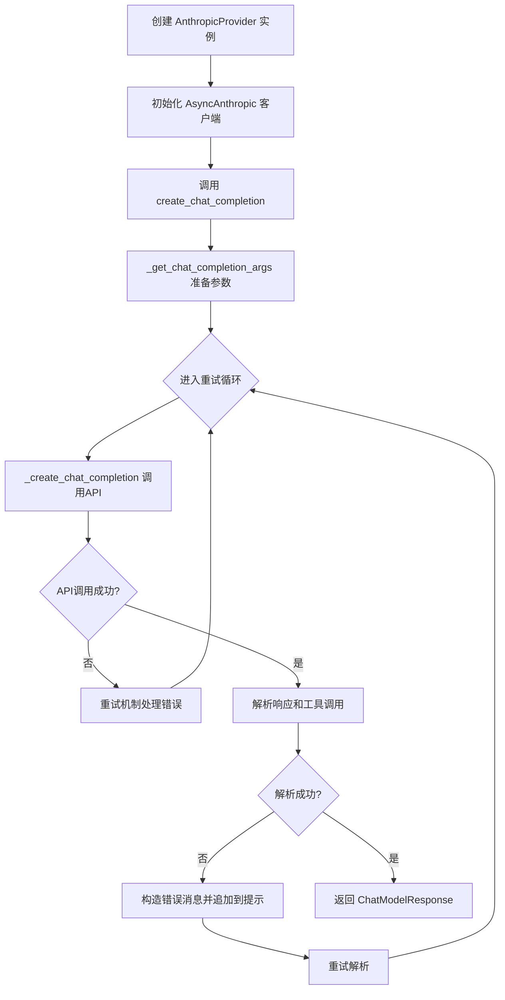

## 类结构

```
BaseChatModelProvider (抽象基类)
└── AnthropicProvider (Anthropic Claude API提供者)
    ├── AnthropicSettings (设置类)
    ├── AnthropicCredentials (凭证类)
    └── AnthropicModelName (枚举类)
```

## 全局变量及字段


### `ANTHROPIC_CHAT_MODELS`
    
包含所有可用 Anthropic 聊天模型信息的字典，以模型名称为键

类型：`dict[str, ChatModelInfo[AnthropicModelName]]`
    


### `_T`
    
泛型类型变量，用于指定函数返回值的类型

类型：`TypeVar`
    


### `_P`
    
参数规格类型变量，用于保留函数参数的类型信息

类型：`ParamSpec`
    


### `AnthropicCredentials.api_key`
    
Anthropic API 密钥，从环境变量 ANTHROPIC_API_KEY 获取

类型：`SecretStr`
    


### `AnthropicCredentials.api_base`
    
Anthropic API 基础 URL，可选配置从环境变量 ANTHROPIC_API_BASE_URL 获取

类型：`Optional[SecretStr]`
    


### `AnthropicSettings.credentials`
    
Anthropic 提供商的凭证配置

类型：`Optional[AnthropicCredentials]`
    


### `AnthropicSettings.budget`
    
模型提供商的预算管理配置

类型：`ModelProviderBudget`
    


### `AnthropicProvider.default_settings`
    
Anthropic 提供商的默认配置设置

类型：`AnthropicSettings`
    


### `AnthropicProvider._settings`
    
当前 Anthropic 提供商的配置设置

类型：`AnthropicSettings`
    


### `AnthropicProvider._credentials`
    
当前 Anthropic 提供商的凭证信息

类型：`AnthropicCredentials`
    


### `AnthropicProvider._budget`
    
当前 Anthropic 提供商的预算管理实例

类型：`ModelProviderBudget`
    


### `AnthropicProvider._client`
    
用于与 Anthropic API 交互的异步客户端实例

类型：`AsyncAnthropic`
    
    

## 全局函数及方法


### `AnthropicCredentials.get_api_access_kwargs`

获取访问 Anthropic API 所需的参数，将敏感凭证（API密钥和基础URL）从 SecretStr 转换为普通字符串，并过滤掉未设置的项。

参数：
- 无参数（仅包含 `self`）

返回值：`dict[str, str]`，返回包含 API 访问参数的字典，键为 `"api_key"` 和 `"base_url"`（如果设置了的话），值为解密后的字符串。

#### 流程图

```mermaid
flowchart TD
    A[开始 get_api_access_kwargs] --> B[创建内部字典<br/>{api_key: self.api_key,<br/>base_url: self.api_base}]
    B --> C[遍历键值对]
    C --> D{值是否为 None?}
    D -->|是| E[跳过该键值对]
    D -->|否| F[调用 v.get_secret_value<br/>解密 SecretStr]
    F --> G[将解密后的值加入结果字典]
    E --> H{还有更多键值对?}
    G --> H
    H -->|是| C
    H -->|否| I[返回结果字典]
```

#### 带注释源码

```python
def get_api_access_kwargs(self) -> dict[str, str]:
    """获取访问 Anthropic API 所需的参数。

    将 SecretStr 类型的凭证转换为普通字符串，
    并过滤掉未设置的配置项（如 api_base 未配置时）。

    Returns:
        dict[str, str]: 包含 API 访问参数的字典，
            可能包含 'api_key' 和 'base_url' 两个键，
            值为解密后的字符串。
    """
    return {
        k: v.get_secret_value()  # 将 SecretStr 解密为普通字符串
        for k, v in {            # 遍历凭证键值对
            "api_key": self.api_key,
            "base_url": self.api_base,
        }.items()
        if v is not None        # 过滤掉未设置的配置项
    }
```


### `AnthropicProvider.__init__`

这是 `AnthropicProvider` 类的构造函数，负责初始化 Anthropic API 提供者实例。它接受可选的设置和日志记录器参数，配置凭据，并创建异步客户端实例。

参数：

- `settings`：`Optional[AnthropicSettings]`，可选的模型提供者设置。如果未提供，则使用默认设置的深拷贝
- `logger`：`Optional[logging.Logger]`，可选的日志记录器，用于记录运行过程中的日志信息

返回值：`None`，构造函数不返回任何值

#### 流程图

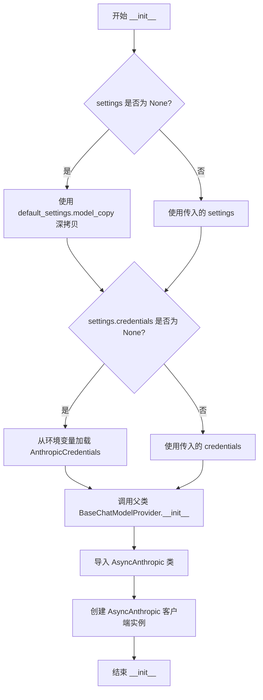

#### 带注释源码

```python
def __init__(
    self,
    settings: Optional[AnthropicSettings] = None,
    logger: Optional[logging.Logger] = None,
):
    """
    初始化 AnthropicProvider 实例。

    Args:
        settings: 可选的 AnthropicSettings 配置对象。
                  如果为 None，则使用默认设置的深拷贝。
        logger: 可选的 logging.Logger 实例，用于日志记录。
    """
    # 如果未提供设置，则复制默认设置的深拷贝
    if not settings:
        settings = self.default_settings.model_copy(deep=True)
    
    # 如果未提供凭据，则从环境变量加载
    if not settings.credentials:
        settings.credentials = AnthropicCredentials.from_env()

    # 调用父类构造函数，初始化基础模型提供者
    super(AnthropicProvider, self).__init__(settings=settings, logger=logger)

    # 动态导入 AsyncAnthropic（避免顶层导入依赖）
    from anthropic import AsyncAnthropic

    # 使用凭据创建异步 API 客户端
    self._client = AsyncAnthropic(
        **self._credentials.get_api_access_kwargs()  # type: ignore
    )
```


### `AnthropicProvider.get_available_models`

获取当前提供商可用的所有 Anthropic 聊天模型列表。

参数：
- 无

返回值：`Sequence[ChatModelInfo[AnthropicModelName]]`，返回一系列聊天模型信息对象，包含模型名称、提供商、令牌费用、上下文长度和函数调用支持等属性。

#### 流程图

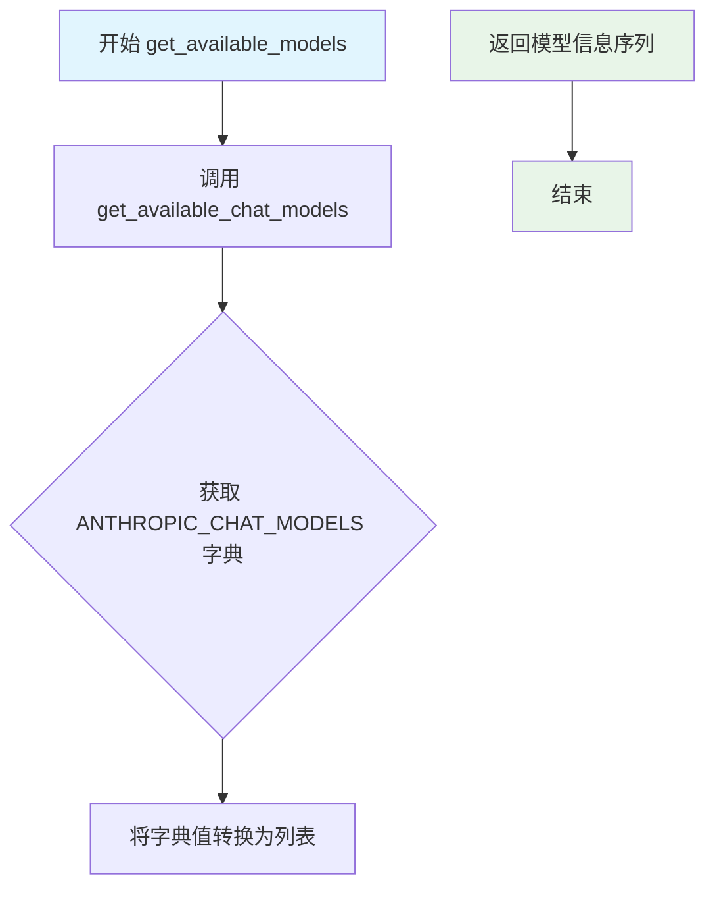

#### 带注释源码

```python
async def get_available_models(self) -> Sequence[ChatModelInfo[AnthropicModelName]]:
    """获取可用的 Anthropic 聊天模型列表。
    
    Returns:
        Sequence[ChatModelInfo[AnthropicModelName]]: 包含所有可用模型信息的序列
    """
    # 委托给 get_available_chat_models 方法执行实际逻辑
    return await self.get_available_chat_models()
```


### `AnthropicProvider.get_available_chat_models`

获取当前 Anthropic 提供商支持的聊天模型列表。

参数： 无

返回值：`Sequence[ChatModelInfo[AnthropicModelName]]`，返回所有可用的 Anthropic 聊天模型信息序列，包含模型名称、提供商、令牌成本和最大令牌数等详细信息。

#### 流程图

```mermaid
flowchart TD
    A[开始: get_available_chat_models] --> B[获取全局变量 ANTHROPIC_CHAT_MODELS 的所有值]
    B --> C[将字典值转换为列表 list]
    C --> D[返回 Sequence[ChatModelInfo] 列表]
    D --> E[结束]
```

#### 带注释源码

```python
async def get_available_chat_models(
    self,
) -> Sequence[ChatModelInfo[AnthropicModelName]]:
    """获取可用的 Anthropic 聊天模型列表。
    
    该方法是一个异步方法，返回预定义的 Anthropic 模型信息字典中的所有值。
    定义的模型包括 Claude 3 Opus、Claude 3 Sonnet、Claude 3.5 Sonnet 和 Claude 3 Haiku。
    
    Returns:
        Sequence[ChatModelInfo[AnthropicModelName]]: 包含所有可用模型信息的序列
    """
    # 从全局字典 ANTHROPIC_CHAT_MODELS 中获取所有值（ChatModelInfo 对象）
    # 并将其转换为列表返回
    return list(ANTHROPIC_CHAT_MODELS.values())
```


### `AnthropicProvider.get_token_limit`

获取指定 Anthropic 模型的最大 token 限制。

参数：

- `model_name`：`AnthropicModelName`，需要查询 token 限制的模型名称

返回值：`int`，该模型支持的最大 token 数量

#### 流程图

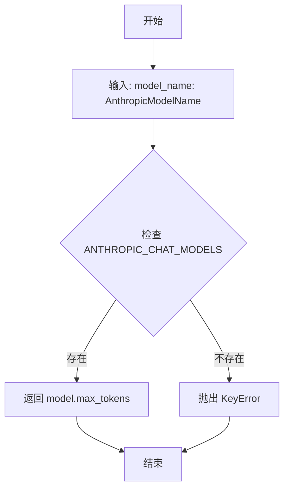

#### 带注释源码

```python
def get_token_limit(self, model_name: AnthropicModelName) -> int:
    """Get the token limit for a given model."""
    # 从预定义的模型字典 ANTHROPIC_CHAT_MODELS 中查找对应模型的配置信息
    # 并返回该模型的 max_tokens 字段（最大 token 数量）
    return ANTHROPIC_CHAT_MODELS[model_name].max_tokens
```


### `AnthropicProvider.get_tokenizer`

获取指定 Anthropic 模型的 tokenizer。由于 Anthropic Claude 3 系列没有官方 tokenizer，该方法使用 tiktoken 库作为替代方案实现。

参数：

- `model_name`：`AnthropicModelName`，要获取 tokenizer 的目标模型名称

返回值：`ModelTokenizer[Any]`，返回对应的 tiktoken 编码器实例，用于文本分词

#### 流程图

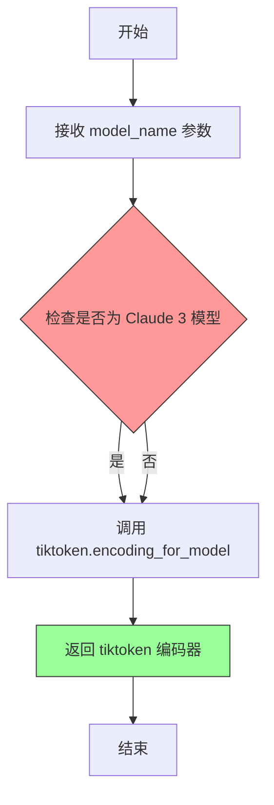

#### 带注释源码

```python
def get_tokenizer(self, model_name: AnthropicModelName) -> ModelTokenizer[Any]:
    """获取指定模型的 tokenizer。
    
    注意：Anthropic 官方没有提供 Claude 3 系列的 tokenizer，
    因此使用 tiktoken 库作为替代方案。这是一个临时的 hack 实现，
    可能在未来官方提供 tokenizer 后需要更新。
    
    Args:
        model_name: AnthropicModelName 枚举值，指定要获取 tokenizer 的模型
        
    Returns:
        ModelTokenizer[Any]: tiktoken 编码器实例，可用于对文本进行分词计数
    """
    # HACK: No official tokenizer is available for Claude 3
    # 由于 Claude 3 没有官方 tokenizer，使用 tiktoken 库作为替代
    return tiktoken.encoding_for_model(model_name)
```


### `AnthropicProvider.count_tokens`

该方法用于计算给定文本的 token 数量，但由于 Claude 3 暂无官方 tokenizer，当前实现直接返回 0 作为占位符。

参数：

- `text`：`str`，需要计算 token 数量的输入文本
- `model_name`：`AnthropicModelName`，指定的 Anthropic 模型名称，用于确定使用哪个模型的 tokenizer

返回值：`int`，返回文本的 token 数量（当前始终返回 0）

#### 流程图

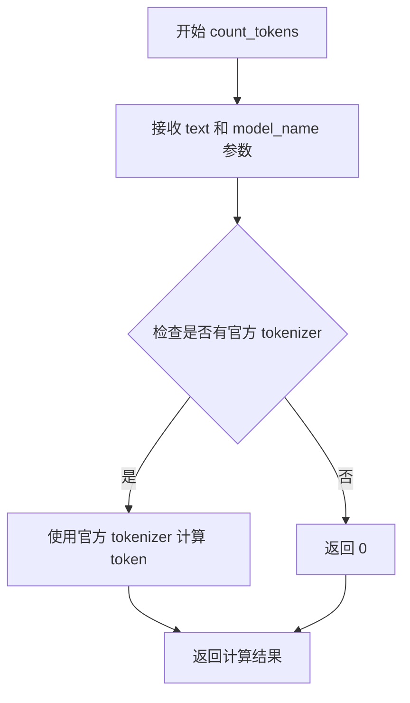

#### 带注释源码

```python
def count_tokens(self, text: str, model_name: AnthropicModelName) -> int:
    """Count the number of tokens in a given text for a specific model.
    
    Note: This is a HACK implementation because no official tokenizer
    is available for Claude 3 models. The method currently returns 0
    as a placeholder until an official tokenizer is released.
    
    Args:
        text: The input text to tokenize.
        model_name: The Anthropic model name to use for tokenization.
        
    Returns:
        int: The number of tokens in the text (currently always 0).
    """
    return 0  # HACK: No official tokenizer is available for Claude 3
```


### `AnthropicProvider.count_message_tokens`

该方法用于计算聊天消息的 token 数量，但由于 Anthropic 官方未提供 Claude 3 的 tokenizer，目前直接返回 0（Hack 实现）。

参数：

- `messages`：`ChatMessage | list[ChatMessage]`，需要计算 token 数量的单条聊天消息或消息列表
- `model_name`：`AnthropicModelName`，用于指定计算 token 的模型名称

返回值：`int`，返回消息的 token 数量（当前版本固定返回 0）

#### 流程图

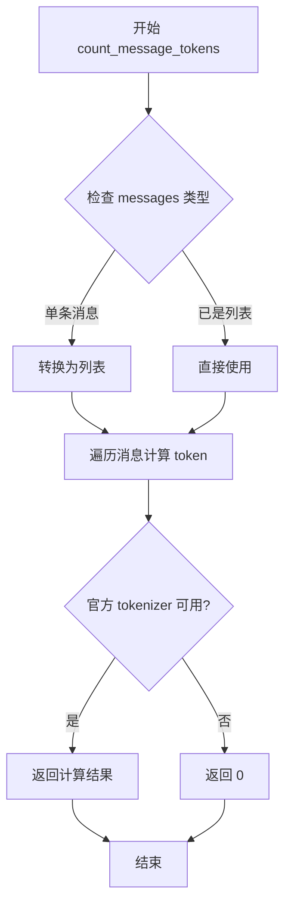

#### 带注释源码

```python
def count_message_tokens(
    self,
    messages: ChatMessage | list[ChatMessage],
    model_name: AnthropicModelName,
) -> int:
    """Count the number of tokens in a list of chat messages.

    Note:
        This is currently a HACK implementation because there is no official
        tokenizer available for Claude 3 models from Anthropic.

    Args:
        messages: A single ChatMessage or a list of ChatMessage objects to count
                  tokens for.
        model_name: The Anthropic model name (currently unused due to missing
                    tokenizer).

    Returns:
        int: The total number of tokens in the messages. Currently returns 0
             as a placeholder until an official tokenizer is available.
    """
    return 0  # HACK: No official tokenizer is available for Claude 3
```


### `AnthropicProvider.create_chat_completion`

创建聊天补全，通过 Anthropic API 生成模型响应。函数首先准备 API 调用参数，然后在循环中发送请求并处理响应，包括工具调用验证、错误修复重试机制，最终返回结构化的聊天模型响应。

参数：

- `self`：`AnthropicProvider`，Anthropic 提供者实例，包含配置、凭据和客户端
- `model_prompt`：`list[ChatMessage]`，聊天消息列表，作为模型输入的提示
- `model_name`：`AnthropicModelName`，要使用的 Anthropic 模型名称（如 claude-3-opus）
- `completion_parser`：`Callable[[AssistantChatMessage], _T]`，可选的响应解析回调函数，用于将 AssistantChatMessage 转换为目标类型 `_T`，默认为空函数
- `functions`：`Optional[list[CompletionModelFunction]]`，可选的可用函数列表，供模型调用
- `max_output_tokens`：`Optional[int]`，生成内容的最大 token 数量，默认为 4096
- `prefill_response`：`str`，预填充的响应内容，用于引导模型输出格式，默认为空字符串
- `**kwargs`：任意额外的关键字参数，会传递给底层 API 调用

返回值：`ChatModelResponse[_T]`：包含模型响应、解析结果、模型信息、输入/输出 token 使用量的结构化响应对象

#### 流程图

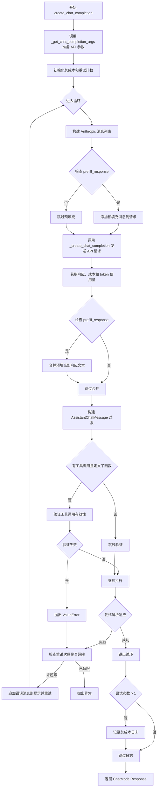

#### 带注释源码

```python
async def create_chat_completion(
    self,
    model_prompt: list[ChatMessage],
    model_name: AnthropicModelName,
    completion_parser: Callable[[AssistantChatMessage], _T] = lambda _: None,
    functions: Optional[list[CompletionModelFunction]] = None,
    max_output_tokens: Optional[int] = None,
    prefill_response: str = "",
    **kwargs,
) -> ChatModelResponse[_T]:
    """Create a completion using the Anthropic API."""
    # Step 1: 准备 API 调用参数，包括消息格式转换、系统消息处理、函数定义等
    anthropic_messages, completion_kwargs = self._get_chat_completion_args(
        prompt_messages=model_prompt,
        functions=functions,
        max_output_tokens=max_output_tokens,
        **kwargs,
    )

    # Step 2: 初始化累积成本和重试计数器
    total_cost = 0.0
    attempts = 0

    # Step 3: 进入主循环，处理响应解析和可能的错误修复
    while True:
        # 将处理后的消息添加到请求参数中
        completion_kwargs["messages"] = anthropic_messages.copy()

        # Step 4: 如果有预填充响应，添加到消息中以引导模型输出格式
        if prefill_response:
            completion_kwargs["messages"].append(
                {"role": "assistant", "content": prefill_response}
            )

        # Step 5: 调用底层方法发送 API 请求（包含重试机制）
        (
            _assistant_msg,
            cost,
            t_input,
            t_output,
        ) = await self._create_chat_completion(model_name, completion_kwargs)

        # Step 6: 累积计算成本
        total_cost += cost
        self._logger.debug(
            f"Completion usage: {t_input} input, {t_output} output "
            f"- ${round(cost, 5)}"
        )

        # Step 7: 如果有预填充，将预填充内容合并到生成的响应文本开头
        if prefill_response:
            first_text_block = next(
                b for b in _assistant_msg.content if b.type == "text"
            )
            first_text_block.text = prefill_response + first_text_block.text

        # Step 8: 将原始响应转换为应用层的数据结构
        assistant_msg = AssistantChatMessage(
            content="\n\n".join(
                b.text for b in _assistant_msg.content if b.type == "text"
            ),
            tool_calls=self._parse_assistant_tool_calls(_assistant_msg),
        )

        # Step 9: 初始化工具调用错误列表，用于错误修复流程
        attempts += 1
        tool_call_errors = []

        try:
            # Step 10: 如果有函数定义，验证模型调用的工具是否有效
            if assistant_msg.tool_calls and functions:
                tool_call_errors = validate_tool_calls(
                    assistant_msg.tool_calls, functions
                )
                if tool_call_errors:
                    raise ValueError(
                        "Invalid tool use(s):\n"
                        + "\n".join(str(e) for e in tool_call_errors)
                    )

            # Step 11: 使用解析器处理响应，转换为目标类型
            parsed_result = completion_parser(assistant_msg)
            # Step 12: 解析成功，跳出循环
            break
        except Exception as e:
            # Step 13: 解析失败，记录调试信息
            self._logger.debug(
                f"Parsing failed on response: '''{_assistant_msg}'''"
            )
            self._logger.warning(f"Parsing attempt #{attempts} failed: {e}")
            # Step 14: 上报异常到 Sentry 用于监控
            sentry_sdk.capture_exception(
                error=e,
                extras={"assistant_msg": _assistant_msg, "i_attempt": attempts},
            )

            # Step 15: 检查是否还有重试机会（配置允许的最大修复尝试次数）
            if attempts < self._configuration.fix_failed_parse_tries:
                # Step 16: 将失败的响应追加到消息历史
                anthropic_messages.append(
                    _assistant_msg.model_dump(include={"role", "content"})
                )

                # Step 17: 构建错误反馈消息，告诉模型解析失败的原因
                anthropic_messages.append(
                    {
                        "role": "user",
                        "content": [
                            *(
                                # 如果上一条助手消息包含工具调用，需要返回工具结果
                                {
                                    "type": "tool_result",
                                    "tool_use_id": tc.id,
                                    "is_error": True,
                                    "content": [
                                        {
                                            "type": "text",
                                            "text": "Not executed because parsing "
                                            "of your last message failed"
                                            if not tool_call_errors
                                            else str(e)
                                            if (
                                                e := next(
                                                    (
                                                        tce
                                                        for tce in tool_call_errors
                                                        if tce.name
                                                        == tc.function.name
                                                    ),
                                                    None,
                                                )
                                            )
                                            else "Not executed because validation "
                                            "of tool input failed",
                                        }
                                    ],
                                }
                                for tc in assistant_msg.tool_calls or []
                            ),
                            {
                                "type": "text",
                                "text": (
                                    "ERROR PARSING YOUR RESPONSE:\n\n"
                                    f"{e.__class__.__name__}: {e}"
                                ),
                            },
                        ],
                    }
                )
            else:
                # Step 18: 重试次数用尽，抛出异常
                raise

    # Step 19: 如果经过多次尝试，记录总的消耗成本
    if attempts > 1:
        self._logger.debug(
            f"Total cost for {attempts} attempts: ${round(total_cost, 5)}"
        )

    # Step 20: 返回结构化的响应对象，包含响应、解析结果、模型信息和 token 使用量
    return ChatModelResponse(
        response=assistant_msg,
        parsed_result=parsed_result,
        llm_info=ANTHROPIC_CHAT_MODELS[model_name],
        prompt_tokens_used=t_input,
        completion_tokens_used=t_output,
    )
```


### `AnthropicProvider._get_chat_completion_args`

该方法负责将通用的聊天消息格式转换为 Anthropic API 所需的格式，并准备相关的 API 调用参数（如系统消息、工具定义、最大令牌数等）。

参数：

- `self`：隐式参数，`AnthropicProvider` 实例，当前 provider 对象
- `prompt_messages`：`list[ChatMessage]`，聊天消息列表，包含系统、用户、助手和工具结果消息
- `functions`：`Optional[list[CompletionModelFunction]]`，可选的函数列表，描述模型可调用的工具
- `max_output_tokens`：`Optional[int]`，可选的最大输出令牌数，默认 4096
- `**kwargs`：任意关键字参数，会透传给 Anthropic API（如 temperature、extra_headers 等）

返回值：`tuple[list[MessageParam], MessageCreateParams]`，返回两个元素：第一个是转换后的消息参数列表，第二个是包含其他 API 调用参数的字典

#### 流程图

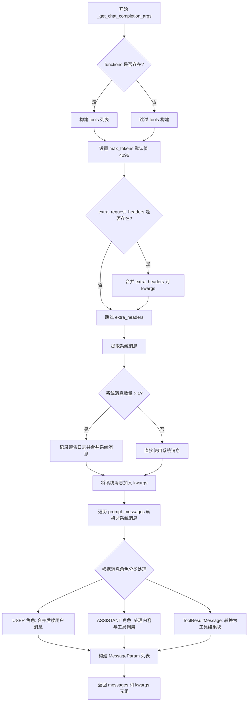

#### 带注释源码

```python
def _get_chat_completion_args(
    self,
    prompt_messages: list[ChatMessage],
    functions: Optional[list[CompletionModelFunction]] = None,
    max_output_tokens: Optional[int] = None,
    **kwargs,
) -> tuple[list[MessageParam], MessageCreateParams]:
    """Prepare arguments for message completion API call.

    Args:
        prompt_messages: List of ChatMessages.
        functions: Optional list of functions available to the LLM.
        kwargs: Additional keyword arguments.

    Returns:
        list[MessageParam]: Prompt messages for the Anthropic call
        dict[str, Any]: Any other kwargs for the Anthropic call
    """
    # 如果提供了 functions，将其转换为 Anthropic 工具格式
    if functions:
        kwargs["tools"] = [
            {
                "name": f.name,                              # 工具名称
                "description": f.description,                # 工具描述
                "input_schema": {                             # 输入参数模式
                    "type": "object",
                    "properties": {
                        name: param.to_dict()                # 将每个参数转为字典
                        for name, param in f.parameters.items()
                    },
                    "required": [                             # 必需参数列表
                        name
                        for name, param in f.parameters.items()
                        if param.required
                    ],
                },
            }
            for f in functions
        ]

    # 设置最大输出 token 数，默认 4096
    kwargs["max_tokens"] = max_output_tokens or 4096

    # 处理额外的请求头配置
    if extra_headers := self._configuration.extra_request_headers:
        kwargs["extra_headers"] = kwargs.get("extra_headers", {})
        kwargs["extra_headers"].update(extra_headers.copy())

    # 提取所有系统消息
    system_messages = [
        m for m in prompt_messages if m.role == ChatMessage.Role.SYSTEM
    ]
    # Anthropic 只支持单个系统消息，如有多个则合并
    if (_n := len(system_messages)) > 1:
        self._logger.warning(
            f"Prompt has {_n} system messages; Anthropic supports only 1. "
            "They will be merged, and removed from the rest of the prompt."
        )
    # 将系统消息内容用双换行符合并
    kwargs["system"] = "\n\n".join(sm.content for sm in system_messages)

    # 初始化消息列表，用于构建 Anthropic 格式的消息
    messages: list[MessageParam] = []
    # 遍历原始消息，转换为 Anthropic 消息格式
    for message in prompt_messages:
        if message.role == ChatMessage.Role.SYSTEM:
            continue  # 系统消息已处理，跳过
        elif message.role == ChatMessage.Role.USER:
            # 合并相邻的用户消息
            if messages and (prev_msg := messages[-1])["role"] == "user":
                if isinstance(prev_msg["content"], str):
                    prev_msg["content"] += f"\n\n{message.content}"
                else:
                    assert isinstance(prev_msg["content"], list)
                    prev_msg["content"].append(
                        {"type": "text", "text": message.content}
                    )
            else:
                messages.append({"role": "user", "content": message.content})
            # TODO: add support for image blocks
        elif message.role == ChatMessage.Role.ASSISTANT:
            # 处理助手消息，包含工具调用
            if isinstance(message, AssistantChatMessage) and message.tool_calls:
                messages.append(
                    {
                        "role": "assistant",
                        "content": [
                            # 如果有文本内容，添加文本块
                            *(
                                [{"type": "text", "text": message.content}]
                                if message.content
                                else []
                            ),
                            # 添加工具调用块
                            *(
                                {
                                    "type": "tool_use",
                                    "id": tc.id,
                                    "name": tc.function.name,
                                    "input": tc.function.arguments,
                                }
                                for tc in message.tool_calls
                            ),
                        ],
                    }
                )
            elif message.content:
                # 普通助手消息（无工具调用）
                messages.append(
                    {
                        "role": "assistant",
                        "content": message.content,
                    }
                )
        elif isinstance(message, ToolResultMessage):
            # 处理工具结果消息
            messages.append(
                {
                    "role": "user",  # 工具结果作为用户消息发送
                    "content": [
                        {
                            "type": "tool_result",
                            "tool_use_id": message.tool_call_id,
                            "content": [{"type": "text", "text": message.content}],
                            "is_error": message.is_error,
                        }
                    ],
                }
            )

    # 返回转换后的消息列表和 API 参数
    return messages, kwargs  # type: ignore
```


### `AnthropicProvider._create_chat_completion`

该方法负责调用 Anthropic 的 Messages API 创建聊天补全请求，并包含重试机制处理临时性错误，同时跟踪 API 使用成本和 token 消耗。

参数：

- `model`：`AnthropicModelName`，用于指定要使用的 Anthropic 模型（如 Claude 3 Opus、Sonnet、Haiku 等）
- `completion_kwargs`：`MessageCreateParams`，传递给 Anthropic Messages API 的关键字参数，包含消息列表、工具定义等

返回值：`tuple[Message, float, int, int]`，返回一个元组，包含：
- `Message`：Anthropic API 返回的消息补全对象
- `float`：本次请求的成本（美元）
- `int`：消耗的输入 token 数量
- `int`：消耗的输出 token 数量

#### 流程图

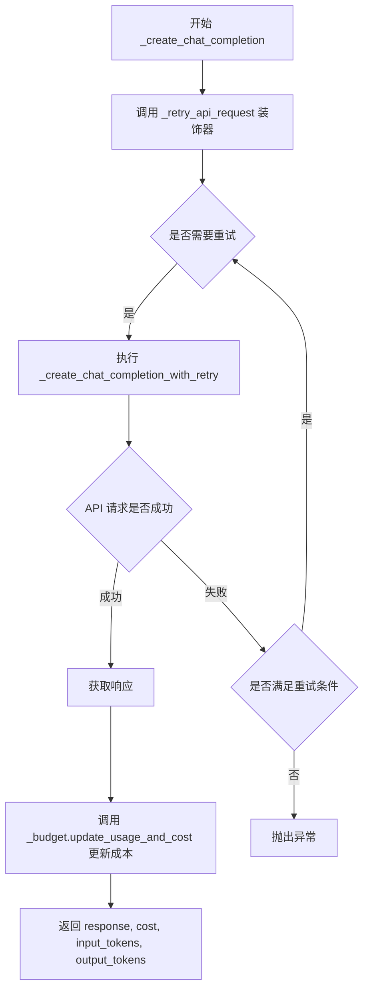

#### 带注释源码

```python
async def _create_chat_completion(
    self, model: AnthropicModelName, completion_kwargs: MessageCreateParams
) -> tuple[Message, float, int, int]:
    """
    Create a chat completion using the Anthropic API with retry handling.

    Params:
        completion_kwargs: Keyword arguments for an Anthropic Messages API call

    Returns:
        Message: The message completion object
        float: The cost ($) of this completion
        int: Number of input tokens used
        int: Number of output tokens used
    """

    # 使用装饰器包装异步函数，实现自动重试逻辑
    # 装饰器内部处理连接错误和 5xx 状态码错误
    @self._retry_api_request
    async def _create_chat_completion_with_retry() -> Message:
        # 调用 Anthropic Beta Tools Messages API 创建补全
        # 使用 beta 版本以支持工具调用功能
        return await self._client.beta.tools.messages.create(
            model=model, **completion_kwargs  # type: ignore
        )

    # 执行带重试的 API 请求
    response = await _create_chat_completion_with_retry()

    # 根据模型信息和实际使用的 token 数量更新预算成本
    # 计算方式：prompt_token_cost * input_tokens + completion_token_cost * output_tokens
    cost = self._budget.update_usage_and_cost(
        model_info=ANTHROPIC_CHAT_MODELS[model],
        input_tokens_used=response.usage.input_tokens,
        output_tokens_used=response.usage.output_tokens,
    )
    
    # 返回完整的结果元组：响应对象、成本、输入/输出 token 数
    return response, cost, response.usage.input_tokens, response.usage.output_tokens
```


### `AnthropicProvider._parse_assistant_tool_calls`

该方法负责将 Anthropic API 返回的原始消息内容转换为统一的工具调用格式，提取所有类型为 `tool_use` 的内容块并转换为 `AssistantToolCall` 对象列表，供上游处理。

参数：

- `self`：`AnthropicProvider`，隐式参数，指向当前 provider 实例
- `assistant_message`：`Message`（`anthropic.types.beta.tools.ToolsBetaMessage`），Anthropic API 返回的完整消息对象，包含 `content` 属性

返回值：`list[AssistantToolCall]`，解析后的工具调用列表，每个元素包含工具调用的 ID、类型和函数信息

#### 流程图

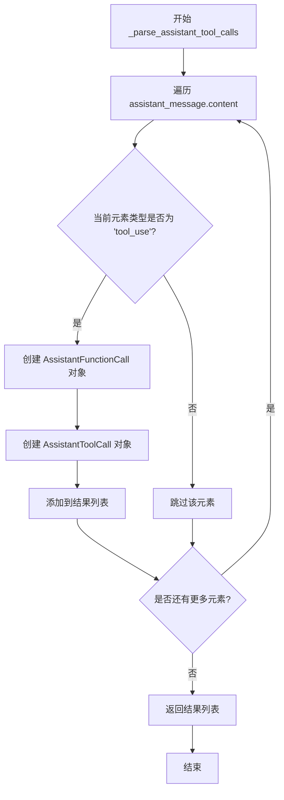

#### 带注释源码

```python
def _parse_assistant_tool_calls(
    self, assistant_message: Message
) -> list[AssistantToolCall]:
    """
    将 Anthropic API 返回的原始消息转换为统一的 AssistantToolCall 格式。

    Args:
        assistant_message: Anthropic API 返回的 ToolsBetaMessage 对象

    Returns:
        list[AssistantToolCall]: 解析后的工具调用列表
    """
    # 列表推导式：遍历消息内容，筛选出类型为 tool_use 的元素
    # 将每个 tool_use 块转换为 AssistantToolCall 对象
    return [
        AssistantToolCall(
            id=c.id,                      # 工具调用的唯一标识符
            type="function",              # 固定类型为 function
            function=AssistantFunctionCall(
                name=c.name,              # 被调用的函数名称
                arguments=c.input,        # 函数输入参数（字典形式）
                                    # type: ignore - Anthropic SDK 类型标注问题
            ),
        )
        # 遍历消息的所有内容块
        for c in assistant_message.content
        # 仅处理 tool_use 类型的块，跳过 text 等其他类型
        if c.type == "tool_use"
    ]
```


### `AnthropicProvider._retry_api_request`

该方法是一个装饰器工厂，用于为异步 API 请求添加重试逻辑。它使用 tenacity 库实现指数退避重试机制，主要捕获 API 连接错误和 5xx 状态码的服务器错误，并在超过最大重试次数后停止重试。

参数：

- `func`：`Callable[_P, _T]`，需要添加重试逻辑的异步函数

返回值：`Callable[_P, _T]`：装饰后的函数，封装了重试逻辑

#### 流程图

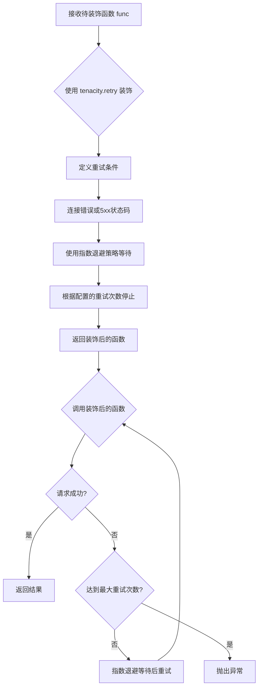

#### 带注释源码

```python
def _retry_api_request(self, func: Callable[_P, _T]) -> Callable[_P, _T]:
    """装饰器工厂：为异步API请求添加重试逻辑
    
    使用 tenacity 库实现指数退避重试机制，主要处理两类错误：
    1. APIConnectionError - 网络连接错误
    2. APIStatusError 且 status_code >= 500 - 服务器内部错误
    
    Args:
        func: 需要添加重试逻辑的异步函数
        
    Returns:
        装饰后的函数，已封装重试逻辑
    """
    return tenacity.retry(
        # 定义重试条件：连接错误 或 5xx 服务器错误
        retry=(
            tenacity.retry_if_exception_type(APIConnectionError)  # 重试连接错误
            | tenacity.retry_if_exception(
                lambda e: isinstance(e, APIStatusError) and e.status_code >= 500
            )
        ),
        # 使用指数退避策略，等待时间随重试次数指数增长
        wait=tenacity.wait_exponential(),
        # 最多重试次数由配置决定
        stop=tenacity.stop_after_attempt(self._configuration.retries_per_request),
        # 每次重试后记录日志
        after=tenacity.after_log(self._logger, logging.DEBUG),
    )(func)
```


### `AnthropicProvider.__repr__`

该方法为 `AnthropicProvider` 类提供标准的 Python 对象字符串表示形式，用于调试和日志输出。

参数：

- `self`：`AnthropicProvider`，隐式参数，代表当前 `AnthropicProvider` 实例本身

返回值：`str`，返回该对象的简洁字符串表示形式 `"AnthropicProvider()"`

#### 流程图

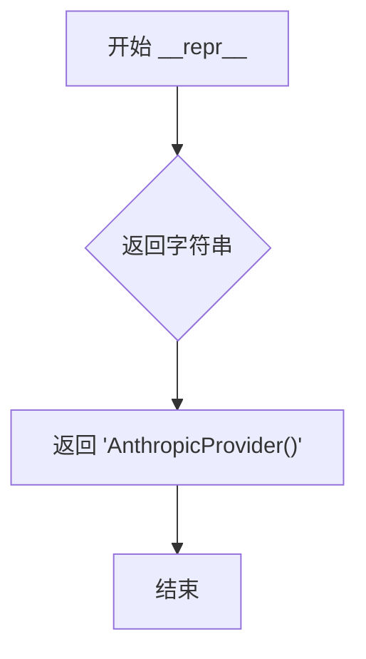

#### 带注释源码

```python
def __repr__(self):
    """返回对象的标准字符串表示形式。
    
    该方法重写了基类的 __repr__，提供简洁的类名表示。
    主要用于日志记录、调试输出和开发时快速识别对象类型。
    
    Returns:
        str: 固定格式的字符串 'AnthropicProvider()'，表示这是 AnthropicProvider 类的实例
    """
    return "AnthropicProvider()"
```

## 关键组件


### AnthropicModelName 枚举

定义了支持的 Claude 3 系列模型版本，包括 Claude 3 Opus、Claude 3 Sonnet、Claude 3.5 Sonnet 和 Claude 3 Haiku 四个版本。

### ANTHROPIC_CHAT_MODELS 字典

存储每个模型的元信息，包括名称、提供商、输入/输出 token 费用、最大 token 数量和函数调用支持状态，采用字典推导式从模型名称快速获取模型信息。

### AnthropicCredentials 凭证类

继承自 ModelProviderCredentials，管理 Anthropic API 的认证凭证，包含 api_key 和可选的 api_base，支持从环境变量加载配置，提供 get_api_access_kwargs 方法构建 API 调用参数。

### AnthropicSettings 设置类

继承自 ModelProviderSettings，管理 Anthropic 提供者的配置，包含凭证和预算信息，用于配置提供者的运行时行为。

### AnthropicProvider 主提供者类

核心类，继承自 BaseChatModelProvider，实现与 Anthropic Messages API 的完整交互流程，包括模型列表获取、token 计数、聊天完成创建、工具调用验证和错误重试机制。

### tiktoken Tokenizer 惰性加载

在 get_tokenizer 方法中使用 tiktoken.encoding_for_model(model_name) 动态加载对应模型的编码器，实现了按需加载的惰性初始化模式。

### Tokenizer 计数占位实现

count_tokens 和 count_message_tokens 方法当前返回 0 作为占位实现，注释标明因 Claude 3 无官方 tokenizer 而采用 HACK 方式处理。

### create_chat_completion 完整交互流程

处理聊天完成的完整生命周期，包括参数准备、API 调用、响应解析、工具调用验证、解析失败自动重试和成本追踪，使用 sentry_sdk 上报异常并支持最多 N 次重试修复。

### 工具调用验证与解析

_parse_assistant_tool_calls 方法将 Anthropic 返回的 tool_use 块转换为内部 AssistantToolCall 格式，validate_tool_calls 函数在创建完成前验证工具调用的有效性。

### tenacity 重试装饰器

_retry_api_request 方法使用 tenacity 库实现指数退避重试，针对 APIConnectionError 和 5xx 状态码错误进行自动重试，停止条件为配置的重试次数。

### 消息格式转换

_get_chat_completion_args 方法将内部 ChatMessage 格式转换为 Anthropic 的 MessageParam 格式，处理系统消息合并、用户消息串联、助手消息工具调用块和工具结果消息的转换。

### 预算成本追踪

_create_chat_completion 方法调用 _budget.update_usage_and_cost 更新 token 使用量并计算本次调用的成本，用于追踪和控制 API 调用费用。


## 问题及建议


### 已知问题

-   **Tokenization 实现不完整**：`count_tokens()` 和 `count_message_tokens()` 方法直接返回 0，未实现实际的 token 计数功能；`get_tokenizer()` 使用了 OpenAI 的 tiktoken 库而非 Anthropic 官方 tokenizer，代码中存在多处 HACK 注释标注此问题
-   **类型安全问题**：代码中散布大量 `type: ignore` 注释（如第 147、175、183、268 行等），表明类型推断存在隐患，`_credentials` 和 `_budget` 属性的初始化依赖父类逻辑，容易引发运行时错误
-   **错误处理不全面**：重试机制仅覆盖 `APIConnectionError` 和 5xx 状态码，缺少对 429 限流错误和其他可恢复错误（如超时）的处理
-   **消息处理逻辑复杂且脆弱**：`_get_chat_completion_args` 方法包含大量消息转换逻辑，对消息类型的判断和转换存在多个条件分支，容易引入边界情况 bug
-   **预填充响应修改响应对象**：在 `create_chat_completion` 中直接修改 `_assistant_msg.content` 的文本内容，这种原地修改可能带来副作用
-   **TODO 遗留项**：代码中存在 TODO 注释表明尚未支持 image blocks 功能

### 优化建议

-   **实现完整的 Token 计数**：集成 Anthropic 官方提供的 token 计数 API 或使用社区维护的 Claude token 计数库，移除 HACK 注释
-   **完善类型标注**：重新设计类结构以支持泛型，正确初始化 `_credentials` 和 `_budget` 属性，使用 Pydantic 的 `model_validator` 或 `__init__` 验证依赖
-   **增强错误恢复能力**：扩展 `tenacity.retry` 条件以包含 429 限流错误和超时异常，考虑添加指数退避的更多策略
-   **简化消息处理逻辑**：将 `_get_chat_completion_args` 拆分为更小的、单一职责的转换方法（如 `convert_user_message`、`convert_assistant_message` 等），提高可测试性
-   **消除副作用**：在处理 prefill_response 时创建新的消息对象而非修改原对象
-   **补充功能实现**：根据 TODO 注释规划并实现 image blocks 支持功能

## 其它


### 设计目标与约束

本模块旨在为应用程序提供统一的接口来访问Anthropic Claude模型的聊天完成功能，支持函数调用、令牌计数、成本追踪和自动重试等核心能力。设计约束包括：仅支持Anthropic官方API，不支持同步调用，必须使用异步模式；系统消息仅支持一条，多余系统消息会被合并；不支持图片等多模态输入；依赖tiktoken进行令牌计数（非官方，存在精度限制）。

### 错误处理与异常设计

代码采用分层错误处理策略：1) API连接层通过tenacity实现自动重试，仅针对连接错误和5xx状态码进行重试；2) 响应解析层捕获解析失败异常，并将错误信息反馈给LLM进行自我修复；3) 工具调用验证层在执行前检查参数有效性，无效时抛出ValueError；4) 关键错误通过Sentry SDK上报监控。异常类型包括APIConnectionError、APIStatusError、ValueError及通用Exception。

### 数据流与状态机

核心数据流如下：1) 输入阶段接收ChatMessage列表、模型名称、解析器和函数定义；2) 消息预处理阶段将ChatMessage转换为Anthropic格式，处理系统消息合并和用户消息连接；3) API调用阶段通过_create_chat_completion发送请求，包含重试逻辑和成本计算；4) 响应解析阶段提取文本内容和工具调用，验证工具参数；5) 错误修复阶段若解析失败，将错误追加到提示中重试；6) 最终返回ChatModelResponse包含原始响应、解析结果、模型信息和token使用量。

### 外部依赖与接口契约

主要外部依赖包括：anthropic SDK用于API调用，tiktoken用于令牌计数，tenacity用于重试机制，sentry_sdk用于错误监控，pydantic用于配置建模。接口契约方面：get_available_chat_models返回支持的模型列表，get_tokenizer返回编码器实例，create_chat_completion是主入口方法接受ChatMessage列表并返回ChatModelResponse，_retry_api_request装饰器为API调用提供重试能力。

### 安全性考虑

凭证管理通过SecretStr类型存储API密钥和基础URL，防止敏感信息泄露；get_api_access_kwargs方法仅在需要时解密凭证；支持从环境变量加载配置。请求层面支持配置extra_headers用于自定义请求头。

### 性能考虑与优化空间

当前实现存在以下性能瓶颈：1) 令牌计数返回0是已知HACK，使用tiktoken替代官方 tokenizer存在精度问题；2) 每次调用都创建新的AsyncAnthropic客户端实例，未实现连接池复用；3) 消息预处理中字符串拼接效率较低，可考虑使用列表缓存；4) 解析失败重试时未限制最大迭代次数，仅依赖配置参数。优化方向包括：实现客户端单例或连接池、改进令牌计数精度、添加消息合并缓存机制。

### 兼容性说明

支持的模型版本：Claude 3 Opus、Claude 3 Sonnet、Claude 3.5 Sonnet、Claude 3 Haiku。API版本使用beta.tools接口以支持工具调用功能。Python版本要求支持typing.ParamSpec（Python 3.10+）。与pydantic v2集成使用model_copy和model_dump方法。

    