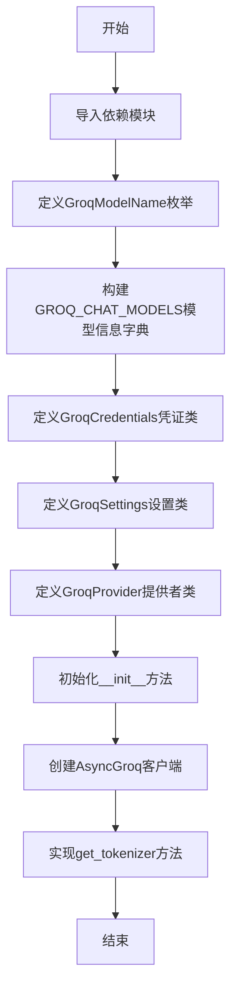
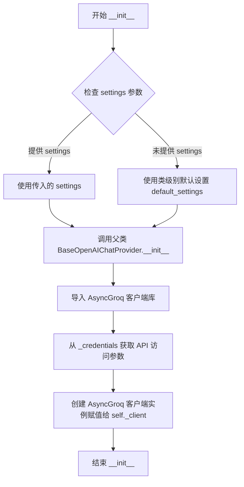
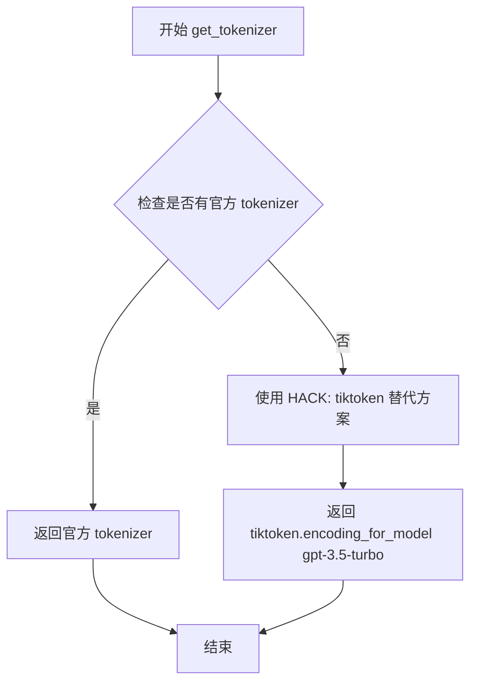

# `.\AutoGPT\classic\forge\forge\llm\providers\groq.py` 详细设计文档

该文件实现了Groq模型提供者的配置和集成功能，通过继承BaseOpenAIChatProvider类，提供了对Groq API的访问支持，包括Mixtral-8x7b和Gemma-7b两种聊天模型的配置、凭证管理、tokenizer获取等核心功能。

## 整体流程



## 类结构

```
ModelProviderCredentials (基类)
├── GroqCredentials
ModelProviderSettings (基类)
└── GroqSettings
BaseOpenAIChatProvider (基类)
└── GroqProvider
```

## 全局变量及字段


### `GROQ_CHAT_MODELS`
    
Dictionary mapping Groq model names to their ChatModelInfo configurations including pricing and capabilities

类型：`dict[GroqModelName, ChatModelInfo]`
    


### `GroqModelName.MIXTRAL_8X7B`
    
Enum member representing the Mixtral 8x7b model with 32k context window

类型：`GroqModelName`
    


### `GroqModelName.GEMMA_7B`
    
Enum member representing the Gemma 7b instruction-tuned model

类型：`GroqModelName`
    


### `GroqCredentials.api_key`
    
API key for authenticating with Groq API, configurable via GROQ_API_KEY environment variable

类型：`SecretStr`
    


### `GroqCredentials.api_base`
    
Optional base URL for Groq API endpoint, configurable via GROQ_API_BASE_URL environment variable

类型：`Optional[SecretStr]`
    


### `GroqSettings.credentials`
    
Groq-specific credentials containing API key and optional base URL

类型：`Optional[GroqCredentials]`
    


### `GroqSettings.budget`
    
Budget settings for the Groq provider controlling token usage and costs

类型：`ModelProviderBudget`
    


### `GroqProvider.CHAT_MODELS`
    
Class attribute mapping available Groq chat models to their configuration info

类型：`dict[GroqModelName, ChatModelInfo]`
    


### `GroqProvider.MODELS`
    
Class attribute alias for CHAT_MODELS providing access to model definitions

类型：`dict[GroqModelName, ChatModelInfo]`
    


### `GroqProvider.default_settings`
    
Default provider settings with empty credentials and budget configuration

类型：`GroqSettings`
    


### `GroqProvider._settings`
    
Instance-level settings for the Groq provider containing configuration and credentials

类型：`GroqSettings`
    


### `GroqProvider._configuration`
    
Configuration settings for the model provider including retry policies and timeouts

类型：`ModelProviderConfiguration`
    


### `GroqProvider._credentials`
    
Instance credentials extracted from settings for API authentication

类型：`GroqCredentials`
    


### `GroqProvider._budget`
    
Budget constraints for the provider controlling API usage and cost limits

类型：`ModelProviderBudget`
    


### `GroqProvider._client`
    
Async client instance for making requests to the Groq API

类型：`AsyncGroq`
    
    

## 全局函数及方法


### `GroqCredentials.get_api_access_kwargs`

该方法用于获取 Groq API 的访问参数，将敏感的 `SecretStr` 类型凭证转换为普通字符串字典，供 `AsyncGroq` 客户端初始化使用。

参数：

- `self`：`GroqCredentials`，隐式参数，当前凭证实例

返回值：`dict[str, str]`，返回包含 API 访问参数的字典，其中键为 `"api_key"` 和 `"base_url"`（可选），值为解密后的字符串。如果 `api_base` 未设置，则不会包含在返回字典中。

#### 流程图

```mermaid
flowchart TD
    A[开始] --> B[创建临时字典<br/>{api_key: self.api_key,<br/>base_url: self.api_base}]
    B --> C{遍历字典项}
    C -->|k=api_key, v=self.api_key| D{v is not None?}
    C -->|k=base_url, v=self.api_base| D
    D -->|是| E[调用 v.get_secret_value<br/>获取解密后的值]
    D -->|否| F[跳过该项]
    E --> G[将 k: 解密值加入结果字典]
    G --> C
    F --> C
    C -->|遍历结束| H[返回结果字典]
```

#### 带注释源码

```python
def get_api_access_kwargs(self) -> dict[str, str]:
    """
    获取 API 访问所需的参数字典。
    
    将 SecretStr 类型的凭证转换为普通字符串，
    仅包含非 None 的值。
    
    返回值:
        包含 api_key 和可选 base_url 的字典，
        供 AsyncGroq 客户端初始化使用。
    """
    # 创建一个临时字典，包含 api_key 和可选的 base_url
    # 使用字典推导式过滤掉值为 None 的项，并解密 SecretStr
    return {
        k: v.get_secret_value()  # 调用 get_secret_value() 解密 SecretStr
        for k, v in {            # 遍历临时字典的键值对
            "api_key": self.api_key,    # 必需的 API 密钥
            "base_url": self.api_base, # 可选的 base URL
        }.items()
        if v is not None  # 仅包含非 None 的值（base_url 可选）
    }
```


### `GroqProvider.__init__`

这是 `GroqProvider` 类的构造函数，负责初始化 Groq 模型提供商实例。它接受可选的设置和日志记录器，调用父类初始化方法，并创建异步 Groq 客户端连接。

参数：

- `settings`：`Optional[GroqSettings]` ，可选的 Groq 提供商配置设置，如果未提供则使用类级别的默认设置
- `logger`：`Optional[logging.Logger]` ，可选的日志记录器实例，用于记录提供商运行过程中的日志信息

返回值：`None` ，该方法不返回任何值，仅执行初始化逻辑

#### 流程图



#### 带注释源码

```python
def __init__(
    self,
    settings: Optional[GroqSettings] = None,
    logger: Optional[logging.Logger] = None,
):
    """
    初始化 GroqProvider 实例。
    
    参数:
        settings: 可选的 Groq 提供商设置，包含凭据、预算等信息
        logger: 可选的日志记录器
    """
    # 调用父类 BaseOpenAIChatProvider 的初始化方法
    # 父类会处理设置验证、配置加载等基础初始化工作
    super(GroqProvider, self).__init__(settings=settings, logger=logger)

    # 动态导入 Groq 的异步客户端库
    # 使用延迟导入避免在模块加载时产生不必要的依赖
    from groq import AsyncGroq

    # 从凭据对象获取 API 访问所需的参数（api_key 和 base_url）
    # get_api_access_kwargs 会过滤掉 None 值
    # 然后创建 AsyncGroq 客户端实例并存储在 self._client
    self._client = AsyncGroq(
        **self._credentials.get_api_access_kwargs()  # type: ignore
    )
```


### `GroqProvider.get_tokenizer`

获取指定模型的 tokenizer。由于 Groq 没有官方 tokenizer，本方法使用 tiktoken 库以 "gpt-3.5-turbo" 模型作为替代方案返回编码器。

参数：

- `model_name`：`GroqModelName`，要获取 tokenizer 的模型名称

返回值：`ModelTokenizer[Any]`，返回 tiktoken 编码器对象，用于对文本进行分词

#### 流程图



#### 带注释源码

```python
def get_tokenizer(self, model_name: GroqModelName) -> ModelTokenizer[Any]:
    # HACK: No official tokenizer is available for Groq
    # 由于 Groq 没有官方 tokenizer，使用 tiktoken 库
    # 使用 gpt-3.5-turbo 的编码器作为替代方案
    return tiktoken.encoding_for_model("gpt-3.5-turbo")
```

## 关键组件


### GroqModelName

Groq模型名称的枚举类，定义了Groq API支持的模型标识符，包括MIXTRAL_8X7B和GEMMA_7B两个模型。

### GROQ_CHAT_MODELS

模型信息字典，以模型名称为键存储ChatModelInfo对象，包含每个模型的提供商、token成本、最大token数、函数调用支持等元数据。

### GroqCredentials

凭证管理类，继承自ModelProviderCredentials，用于存储和管理Groq API的访问凭证，包括api_key和api_base两个SecretStr类型的字段，并提供get_api_access_kwargs方法用于提取凭证信息。

### GroqSettings

提供商设置类，继承自ModelProviderSettings，用于配置Groq提供商的行为，包含credentials、budget等配置属性。

### GroqProvider

核心的模型提供商类，继承自BaseOpenAIChatProvider，负责与Groq API的交互。该类封装了模型列表、客户端初始化、tokenizer获取等功能，是与Groq服务交互的主要入口点。

### get_tokenizer方法

由于Groq没有官方tokenizer实现，该方法作为HACK使用tiktoken的gpt-3.5-turbo编码作为后备方案，返回ModelTokenizer对象用于文本分词。

## 问题及建议


### 已知问题

-   **Tokenizer 不准确**：使用 `tiktoken.encoding_for_model("gpt-3.5-turbo")` 作为 Groq 模型的 tokenizer，注释明确标记为 HACK，可能导致 token 计数不准确，影响计费和请求处理
-   **过多的类型忽略注释**：代码中多处使用 `# type: ignore`，表明类型定义可能不够精确或存在类型定义冲突
-   **过时的 super() 调用**：`super(GroqProvider, self).__init__()` 使用了 Python 2 风格的旧式调用，应使用现代的 `super().__init__()`
-   **内部导入**：在 `__init__` 方法内部导入 `AsyncGroq`，影响代码可读性和性能，应在模块顶部导入
-   **硬编码模型配置**：模型信息（价格、max_tokens 等）硬编码在代码中，缺乏动态配置能力，添加新模型需要修改源码
-   **缺少错误处理**：`get_api_access_kwargs` 方法没有错误处理机制，当环境变量未设置时行为不明确
-   **默认 credentials 为 None**：`default_settings` 中 credentials 默认为 None，可能导致运行时错误
-   **魔法数字**：价格计算中的 `1e6` 应提取为常量，避免重复和潜在的计算错误

### 优化建议

-   考虑实现自定义的 Groq tokenizer 或使用社区提供的 tokenizer，并在无法获取时提供更安全的 fallback 机制
-   清理类型注解，使用泛型或 Protocol 正确定义类型，减少 `# type: ignore` 的使用
-   将 super() 调用改为现代风格：`super().__init__(settings=settings, logger=logger)`
-   将 `from groq import AsyncGroq` 移至模块顶部导入
-   将模型配置外部化，可考虑从配置文件或远程服务加载模型元数据
-   在 `get_api_access_kwargs` 中添加验证逻辑，当必需的环境变量缺失时抛出明确的错误
-   在 `GroqSettings` 中为 credentials 提供更安全的默认处理或添加 required 验证
-   提取价格计算公式中的常量为模块级常量，如 `TOKENS_PER_MILLION = 1e6`

## 其它


### 设计目标与约束

本模块的设计目标是提供对Groq云API的统一访问接口，遵循Model Provider架构模式，支持多模型切换、凭证安全管理和预算控制。核心约束包括：必须继承BaseOpenAIChatProvider以保持接口一致性；凭证必须通过SecretStr进行安全存储；tokenizer使用tiktoken作为HACK方案（因为Groq无官方tokenizer）；仅支持异步客户端AsyncGroq。

### 错误处理与异常设计

本模块继承父类BaseOpenAIChatProvider的异常处理机制，主要依赖groq库自身的异常抛出。关键异常场景包括：API密钥缺失或无效时抛出认证异常；网络请求超时或中断时抛出连接异常；模型超出配额时抛出预算超限异常。凭证验证在get_api_access_kwargs方法中通过过滤None值实现，确保不会传递空值到客户端。

### 数据流与状态机

数据流遵循以下路径：外部调用方传入GroqModelName和消息列表 → GroqProvider.__init__初始化AsyncGroq客户端 → 通过父类方法发送聊天请求 → Groq API返回响应 → 响应结果返回给调用方。状态机主要由父类管理，本模块负责模型映射和凭证配置。模型选择通过GROQ_CHAT_MODELS字典进行静态映射，不涉及运行时状态变更。

### 外部依赖与接口契约

本模块依赖以下外部包：groq（AsyncGroq客户端）、tiktoken（tokenizer替代方案）、pydantic（配置模型）、typing（类型注解）。接口契约方面：get_tokenizer方法返回ModelTokenizer[Any]类型；get_api_access_kwargs返回dict[str, str]；构造函数接受Optional[GroqSettings]和Optional[logging.Logger]参数。所有公开接口需与BaseOpenAIChatProvider基类保持兼容。

### 安全性考虑

API密钥和基础URL通过SecretStr类型存储，防止在日志和错误信息中泄露；从环境变量GROQ_API_KEY和GROQ_API_BASE_URL读取敏感信息；get_api_access_kwargs方法在传递凭证前调用get_secret_value()进行解密，仅在确认值不为None时添加到参数字典。

### 性能考虑

使用AsyncGroq异步客户端以支持高并发请求；tokenizer采用缓存机制（tiktoken.encoding_for_model）避免重复加载；模型信息在模块级别定义（GROQ_CHAT_MODELS）为类属性，避免重复创建。潜在性能瓶颈：tiktoken的gpt-3.5-turbo编码器作为Groq模型的替代方案可能存在轻微偏差。

### 兼容性考虑

Python版本兼容性由父类BaseOpenAIChatProvider决定；模型列表仅包含有限数量的Groq模型（mixtral-8x7b-32768、gemma-7b-it），需随着Groq官方支持更新；has_function_call_api标记为True，但实际兼容性需依赖Groq API版本。

### 配置管理

配置通过GroqSettings统一管理，包含credentials（可选GroqCredentials）、budget（预算控制）、configuration（提供商配置）。凭证支持从环境变量动态加载，默认值为None允许延迟初始化。default_settings提供静态默认配置。

### 日志与监控

日志通过传入的logger参数或父类初始化配置，支持集成项目统一的日志系统。未在模块级别定义专用logger，依赖父类实现。监控指标通过budget（ModelProviderBudget）进行token使用量追踪。

### 测试策略建议

应覆盖的场景：凭证正确初始化并传递到AsyncGroq客户端；get_api_access_kwargs正确过滤None值；get_tokenizer返回有效的tokenizer实例；模型信息正确映射到GROQ_CHAT_MODELS字典；环境变量缺失时的默认行为。

### 版本兼容性

代码使用from __future__ import annotations实现延迟类型注解，支持Python 3.7+；pydantic版本需支持SecretStr和UserConfigurable；tiktoken需支持encoding_for_model方法。

### 部署与运维注意事项

部署时需确保GROQ_API_KEY环境变量已配置；可选配置GROQ_API_BASE_URL用于自定义端点；预算监控需定期检查ModelProviderBudget使用情况；由于使用tiktoken作为HACK方案，生产环境需评估token计费准确性。


    