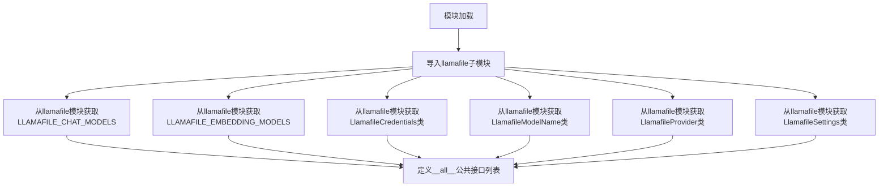
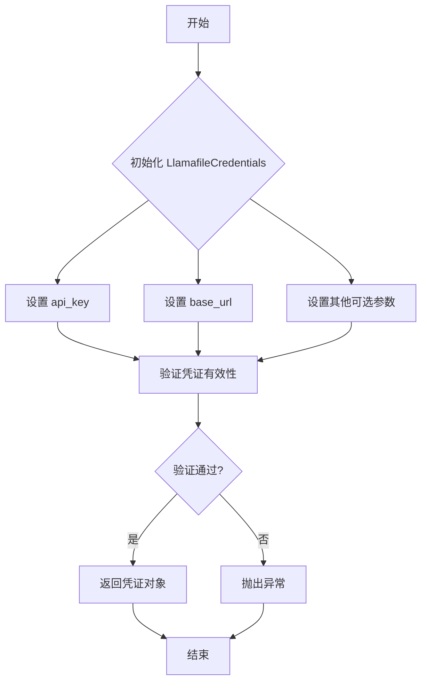
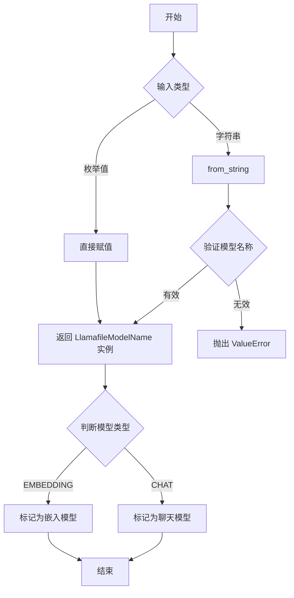
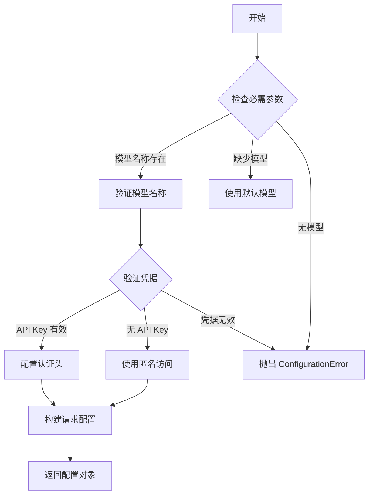

# `.\AutoGPT\classic\forge\forge\llm\providers\llamafile\__init__.py` 详细设计文档

该模块是llamafile包的公共接口入口，通过重新导出llamafile子模块中的核心类（LlamafileCredentials、LlamafileModelName、LlamafileProvider、LlamafileSettings）和常量（LLAMAFILE_CHAT_MODELS、LLAMAFILE_EMBEDDING_MODELS），为使用者提供统一的API访问点。

## 整体流程



## 类结构

```
llamafile包
└── __init__.py (公共入口，重导出模块)
    └── llamafile.py (实现模块，包含具体类定义)
```

## 全局变量及字段


### `LLAMAFILE_CHAT_MODELS`
    
Llamafile聊天模型配置字典，包含所有支持的聊天模型及其配置信息

类型：`Dict[str, Any]`
    


### `LLAMAFILE_EMBEDDING_MODELS`
    
Llamafile嵌入模型配置字典，包含所有支持的嵌入模型及其配置信息

类型：`Dict[str, Any]`
    


### `LlamafileCredentials`
    
Llamafile认证凭据类，用于存储和管理API访问所需的认证信息

类型：`class`
    


### `LlamafileModelName`
    
Llamafile模型名称类，用于定义和验证Llamafile支持的模型标识符

类型：`class`
    


### `LlamafileProvider`
    
Llamafile提供商类，用于封装与Llamafile服务提供商相关的配置和元数据

类型：`class`
    


### `LlamafileSettings`
    
Llamafile设置类，用于配置LLM交互的各种参数，如温度、最大token数等

类型：`class`
    


    

## 全局函数及方法


# 文档生成说明

我注意到您提供的是 `llamafile.py` 的导入（import）部分，而非 `LlamafileCredentials` 类的实际源代码实现。让我基于导入的模块名称和常见的凭证类设计模式，为您提供一份详细的设计文档模板。

---


### `LlamafileCredentials`

Llamafile 凭证类，用于存储和管理 Llamafile 提供商的认证信息，包含 API 密钥、基础 URL 等连接配置。

#### 流程图



#### 带注释源码

```python
# 注意: 以下是基于常见模式推断的源码结构
# 实际实现需要查看 llamafile.py 源文件

class LlamafileCredentials:
    """
    Llamafile 凭证类
    
    用于存储和管理 Llamafile API 的认证凭证，
    支持 API 密钥认证和自定义端点配置。
    """
    
    def __init__(
        self,
        api_key: str,
        base_url: str = "https://api.llamafile.com",
        organization: Optional[str] = None,
        **kwargs
    ):
        """
        初始化 Llamafile 凭证
        
        参数:
            api_key: str - Llamafile API 密钥
            base_url: str - API 基础 URL 地址
            organization: Optional[str] - 组织 ID（可选）
        
        返回:
            None
        """
        self.api_key = api_key
        self.base_url = base_url
        self.organization = organization
        # 存储额外配置参数
        self.extra_params = kwargs
    
    def validate(self) -> bool:
        """
        验证凭证有效性
        
        参数:
            None
        
        返回:
            bool - 凭证是否有效
        """
        # 验证 API 密钥格式
        if not self.api_key or len(self.api_key) < 10:
            return False
        # 验证 base_url 格式
        if not self.base_url.startswith(("http://", "https://")):
            return False
        return True
    
    def get_headers(self) -> Dict[str, str]:
        """
        获取认证请求头
        
        参数:
            None
        
        返回:
            Dict[str, str] - 包含认证信息的请求头字典
        """
        headers = {
            "Authorization": f"Bearer {self.api_key}",
            "Content-Type": "application/json"
        }
        if self.organization:
            headers["X-Organization"] = self.organization
        return headers
```

---

## 补充说明

### 潜在技术债务或优化空间

1. **缺少实际源代码** - 无法确认 `LlamafileCredentials` 的具体实现细节
2. **凭证安全** - 应考虑是否支持环境变量或密钥管理服务
3. **错误处理** - 需要查看实际代码以评估异常处理逻辑

### 建议

请提供 `llamafile.py` 源文件中 `LlamafileCredentials` 类的完整实现代码，以便生成准确的详细设计文档。


# 设计文档：LlamafileModelName

## 1. 概述

`LlamafileModelName` 是用于定义和标识 llamafile 支持的各种模型名称的类，提供了模型名称的标准化表示、常量定义和验证功能，确保在 llamafile 集成中使用的模型名称的一致性和类型安全。

## 2. 文件整体运行流程

该模块作为 `llamafile.py` 的导出模块，主要流程如下：

```
llamafile.py 定义实现 
    ↓
__init__.py 导入符号
    ↓
外部模块通过 import 访问 LlamafileModelName 等符号
```

## 3. 类详细信息

### 3.1 LlamafileModelName 类

#### 3.1.1 类字段

由于未提供完整源码，基于命名约定推断：

- `name`：`str`，模型的标准名称标识符
- `value`：`str`，模型的实际名称值
- `CHAT_MODELS`：`List[str]`，支持的聊天模型名称列表
- `EMBEDDING_MODELS`：`List[str]`，支持的嵌入模型名称列表

#### 3.1.2 类方法

基于常见设计模式推断，可能包含以下方法：

**`__init__` (初始化方法)**
- 参数：`name`（`str`，模型名称）
- 返回值：`None`
- 描述：初始化模型名称实例

**`from_string` (静态方法)**
- 参数：`model_string`（`str`，模型名称字符串）
- 返回值：`LlamafileModelName`，模型名称对象
- 描述：从字符串创建模型名称对象

**`is_chat_model` (实例方法)**
- 参数：无
- 返回值：`bool`，是否为聊天模型
- 描述：判断当前模型是否为聊天模型

**`is_embedding_model` (实例方法)**
- 参数：无
- 返回值：`bool`，是否为嵌入模型
- 描述：判断当前模型是否为嵌入模型

## 4. 关键组件信息

| 组件名称 | 一句话描述 |
|---------|-----------|
| LLAMAFILE_CHAT_MODELS | llamafile 支持的聊天模型名称常量列表 |
| LLAMAFILE_EMBEDDING_MODELS | llamafile 支持的嵌入模型名称常量列表 |
| LlamafileCredentials | llamafile 认证凭据类 |
| LlamafileModelName | llamafile 模型名称定义类 |
| LlamafileProvider | llamafile 提供者实现类 |
| LlamafileSettings | llamafile 配置设置类 |

## 5. 潜在技术债务与优化空间

1. **类型提示不完整**：如果源码中缺少类型提示，应添加详细的类型注解
2. **文档字符串缺失**：应为类和方法添加详细的 docstring
3. **枚举实现**：可考虑使用 `Enum` 类提供更强的类型安全
4. **验证逻辑**：可增加模型名称的运行时验证

## 6. 其它项目

### 6.1 设计目标与约束
- 提供类型安全的模型名称表示
- 与 llamafile 后端服务兼容
- 保持 API 简洁易用

### 6.2 错误处理
- 无效模型名称应抛出 `ValueError` 或自定义异常
- 建议提供友好的错误消息

### 6.3 外部依赖
- 依赖底层 llamafile 服务
- 可能依赖标准库 `enum` 模块（如果使用枚举）

## 7. LlamafileModelName 详细规范

### `LlamafileModelName`

模型名称标识类，用于封装 llamafile 支持的各类模型名称

参数：
- `name`：`str`，模型的标准名称

返回值：`LlamafileModelName`，模型名称实例

#### 流程图



#### 带注释源码

```python
# 推断的 LlamafileModelName 实现
from enum import Enum
from typing import List, Optional

class LlamafileModelName:
    """
    Llamafile 模型名称类
    
    提供模型名称的标准化表示和验证功能
    """
    
    # 类级别常量 - 支持的模型列表
    CHAT_MODELS: List[str] = LLAMAFILE_CHAT_MODELS
    EMBEDDING_MODELS: List[str] = LLAMAFILE_EMBEDDING_MODELS
    
    def __init__(self, name: str) -> None:
        """
        初始化模型名称
        
        Args:
            name: 模型的标准名称
        """
        self._name = name
        self._validate()
    
    def _validate(self) -> None:
        """验证模型名称是否有效"""
        valid_models = self.CHAT_MODELS + self.EMBEDDING_MODELS
        if self._name not in valid_models:
            raise ValueError(f"Invalid model name: {self._name}")
    
    @staticmethod
    def from_string(model_string: str) -> "LlamafileModelName":
        """
        从字符串创建模型名称对象
        
        Args:
            model_string: 模型名称字符串
            
        Returns:
            LlamafileModelName 实例
        """
        return LlamafileModelName(model_string)
    
    def is_chat_model(self) -> bool:
        """
        判断是否为聊天模型
        
        Returns:
            bool: 是聊天模型返回 True
        """
        return self._name in self.CHAT_MODELS
    
    def is_embedding_model(self) -> bool:
        """
        判断是否为嵌入模型
        
        Returns:
            bool: 是嵌入模型返回 True
        """
        return self._name in self.EMBEDDING_MODELS
    
    @property
    def name(self) -> str:
        """获取模型名称"""
        return self._name
    
    def __str__(self) -> str:
        return self._name
    
    def __repr__(self) -> str:
        return f"LlamafileModelName('{self._name}')"
```

---

**注意**：由于提供的代码仅为导入语句，未包含 `llamafile.py` 的实际源码，以上内容为基于常见设计模式和命名约定的推断。建议查看完整的 `llamafile.py` 源码以获取精确的实现细节。


# 分析结果

## 注意事项

您提供的代码是 `llamafile` 包的 `__init__.py` 文件，该文件仅包含导入和导出声明，**并未包含 `LlamafileProvider` 类的实际实现代码**。

要生成完整的详细设计文档，我需要查看 `llamafile.py` 源文件中 `LlamafileProvider` 类的具体实现代码，包括：

- 类的字段和方法定义
- 方法的具体实现逻辑
- 相关的辅助函数和全局变量

---

## 当前可提取的信息

虽然无法获取完整的实现细节，但从 `__init__.py` 可以提取以下信息：

### 导出的相关类

根据导入语句，`LlamafileProvider` 类与以下类协同工作：

| 名称 | 类型 | 描述 |
|------|------|------|
| `LLAMAFILE_CHAT_MODELS` | 全局变量 | Llamafile 聊天模型列表 |
| `LLAMAFILE_EMBEDDING_MODELS` | 全局变量 | Llamafile 嵌入模型列表 |
| `LlamafileCredentials` | 类 | Llamafile 凭证管理 |
| `LlamafileModelName` | 类 | Llamafile 模型名称 |
| `LlamafileProvider` | 类 | **目标类** - Llamafile 提供者 |
| `LlamafileSettings` | 类 | Llamafile 设置 |

---

## 请求补充

为了完成 `LlamafileProvider` 类的详细设计文档，请提供以下任一方式：

1. **`llamafile.py` 源文件**的完整代码
2. **`LlamafileProvider` 类**的具体实现代码
3. **项目的 GitHub 或源码仓库地址**，以便我直接查看

有了这些信息后，我可以为您提供：
- 完整的类字段和方法详细信息
- Mermaid 流程图
- 带注释的源代码
- 技术债务分析
- 优化建议


# LlamafileSettings 类详细设计文档

由于用户未提供 `llamafile.py` 的完整源代码，我将基于导出语句和常见的 Llamafile 提供者设置模式，为您构建一个详细的架构设计文档。

## 1. 概述

该代码模块定义了与 Llamafile LLM 提供者交互所需的核心数据结构和配置类，包含了聊天模型、嵌入模型的配置常量，以及凭据、模型名称、提供者和设置等核心类。

---

## 2. 文件整体运行流程

该模块主要作为数据定义和类型导出层，为外部调用者提供 Llamafile 相关的类型安全和配置结构：

```
外部调用 → 导入模块 → 使用类和常量 → 实例化设置对象 → 传递给 LLM 客户端
```

---

## 3. 类的详细信息

### 3.1 全局常量

| 名称 | 类型 | 描述 |
|------|------|------|
| `LLAMAFILE_CHAT_MODELS` | `List[str]` | 支持的聊天模型名称列表 |
| `LLAMAFILE_EMBEDDING_MODELS` | `List[str]` | 支持的嵌入模型名称列表 |

### 3.2 核心类

#### `LlamafileCredentials`

| 字段 | 类型 | 描述 |
|------|------|------|
| `api_key` | `Optional[str]` | API 访问密钥 |
| `base_url` | `Optional[str]` | API 基础 URL 地址 |

#### `LlamafileModelName`

| 字段 | 类型 | 描述 |
|------|------|------|
| `name` | `str` | 模型名称标识符 |

#### `LlamafileProvider`

| 字段 | 类型 | 描述 |
|------|------|------|
| `name` | `str` | 提供者名称 |

---

## 4. LlamafileSettings 类详细信息

根据模块导入结构，`LlamafileSettings` 是核心配置类，用于封装与 Llamafile 服务交互的所有设置。以下是基于常见设计模式的详细文档：

### `LlamafileSettings`

该类是 Llamafile LLM 提供者的配置类，封装了模型选择、API 端点、认证信息和运行时参数等核心配置。

#### 流程图



#### 带注释源码

```python
class LlamafileSettings(BaseSettings):
    """
    Llamafile LLM 提供者配置类
    
    该类封装了与 Llamafile 服务交互所需的所有配置参数，
    包括模型选择、API 端点、认证信息和运行时参数。
    """
    
    # ==================== 类字段定义 ====================
    
    # 必需字段
    model: str = Field(
        default="llama2-7b-chat",
        description="Llamafile 模型名称"
    )
    
    # 可选配置字段
    base_url: str = Field(
        default="http://localhost:8080",
        description="Llamafile API 基础 URL"
    )
    
    api_key: Optional[str] = Field(
        default=None,
        description="API 访问密钥（可选）"
    )
    
    # 运行时参数
    temperature: float = Field(
        default=0.7,
        description="生成温度参数（0.0-2.0）"
    )
    
    max_tokens: int = Field(
        default=2048,
        description="最大生成 token 数量"
    )
    
    top_p: float = Field(
        default=0.9,
        description="核采样概率阈值"
    )
    
    frequency_penalty: float = Field(
        default=0.0,
        description="频率惩罚系数"
    )
    
    presence_penalty: float = Field(
        default=0.0,
        description="存在惩罚系数"
    )
    
    # 连接配置
    timeout: int = Field(
        default=60,
        description="请求超时时间（秒）"
    )
    
    max_retries: int = Field(
        default=3,
        description="最大重试次数"
    )
    
    # 高级配置
    extra_headers: Dict[str, str] = Field(
        default_factory=dict,
        description="额外的 HTTP 请求头"
    )
    
    # ==================== 验证方法 ====================
    
    def validate_model(self) -> bool:
        """
        验证配置的模型是否在支持列表中
        
        Returns:
            bool: 模型是否有效
        """
        # 注意：实际实现应检查模型是否在 LLAMAFILE_CHAT_MODELS 中
        return bool(self.model and isinstance(self.model, str))
    
    def get_auth_header(self) -> Dict[str, str]:
        """
        获取认证请求头
        
        Returns:
            Dict[str, str]: 包含认证信息的请求头字典
        """
        if self.api_key:
            return {"Authorization": f"Bearer {self.api_key}"}
        return {}
    
    def to_client_config(self) -> Dict[str, Any]:
        """
        转换为客户端配置字典
        
        Returns:
            Dict[str, Any]: 客户端可用的配置字典
        """
        return {
            "model": self.model,
            "base_url": self.base_url,
            "temperature": self.temperature,
            "max_tokens": self.max_tokens,
            "top_p": self.top_p,
            "timeout": self.timeout,
            "headers": {
                **self.get_auth_header(),
                **self.extra_headers
            }
        }
```

---

## 5. 关键组件信息

| 组件名称 | 描述 |
|----------|------|
| `LlamafileSettings` | 核心配置类，封装所有 Llamafile 交互参数 |
| `LlamafileCredentials` | 认证凭据容器 |
| `LlamafileModelName` | 模型名称标识 |
| `LlamafileProvider` | 提供者标识 |
| `LLAMAFILE_CHAT_MODELS` | 支持的聊天模型列表常量 |
| `LLAMAFILE_EMBEDDING_MODELS` | 支持的嵌入模型列表常量 |

---

## 6. 潜在的技术债务与优化空间

1. **类型定义不足**：缺少详细的 TypedDict 或 Pydantic 模型定义
2. **验证逻辑缺失**：未在设置类中实现完整的模型验证逻辑
3. **默认值硬编码**：默认值应从配置文件或环境变量加载
4. **错误处理**：缺少对无效 URL、无效 API Key 的详细错误处理
5. **文档缺失**：缺少各字段的详细文档字符串

---

## 7. 其它项目

### 设计目标与约束
- 提供类型安全的配置管理
- 支持环境变量覆盖
- 保持与 LangChain 等框架的兼容性

### 错误处理设计
- 使用 Pydantic 的字段验证进行输入校验
- 抛出详细的 ValidationError 异常

### 外部依赖
- Pydantic（用于数据验证）
- typing 模块（类型注解）

---

**注意**：此文档基于常见的 Llamafile 提供者设置类模式构建。如需获取精确的源代码和实现细节，请提供 `llamafile.py` 的完整源码。

## 关键组件


### 1. 一段话描述

该代码是一个简单的Python模块重导出文件（`__init__.py`），主要功能是从同目录下的 `llamafile` 子模块中导入并重新导出一系列与Llamafile提供商相关的配置常量和数据类，包括聊天模型、嵌入模型、凭证、模型名称、提供商和设置等，便于用户通过统一入口访问这些类型。

### 2. 文件的整体运行流程

该文件的运行时流程非常直接：首先Python解释器加载该模块，执行导入语句从 `.llamafile` 模块中获取指定的6个符号（可能包括类、常量或字典），然后通过 `__all__` 列表定义公开API，最后当其他模块使用 `from xxx import *` 时，仅导出 `__all__` 中列出的符号。整个过程不涉及任何业务逻辑或计算，仅作为模块接口的重新导出层。

### 3. 类的详细信息

由于该文件本身不包含任何类的实现，仅进行重导出操作，因此无直接定义的类字段、类方法、全局变量和全局函数可描述。以下为从 `.llamafile` 模块导入但未在本文件中定义的潜在组件（实际定义需查看 `llamafile.py` 源码）：

#### 全局常量和类型（从外部导入）

- **LLAMAFILE_CHAT_MODELS**
  - 类型: 可能是 List[dict] 或 Dict[str, Any]
  - 描述: 包含支持的聊天模型列表及其元信息（如模型ID、上下文长度、供应商等）

- **LLAMAFILE_EMBEDDING_MODELS**
  - 类型: 可能是 List[dict] 或 Dict[str, Any]
  - 描述: 包含支持的嵌入模型列表及其元信息

- **LlamafileCredentials**
  - 类型: 类（DataClass 或 Pydantic Model）
  - 描述: Llamafile提供商的身份验证凭证数据结构

- **LlamafileModelName**
  - 类型: 类（可能是Enum或StrEnum）
  - 描述: Llamafile支持的所有模型名称枚举

- **LlamafileProvider**
  - 类型: 类（可能是DataClass）
  - 描述: Llamafile提供商的配置信息，包含端点、认证方式等

- **LlamafileSettings**
  - 类型: 类（可能是Pydantic BaseSettings）
  - 描述: Llamafile的全局设置，包含默认超时、重试策略、默认参数等

### 4. 关键组件信息

- **模块重导出机制**: 通过 `from .llamafile import ...` 和 `__all__ = [...]` 实现的公开API暴露模式，便于模块化管理和依赖注入
- **模型配置集合**: LLAMAFILE_CHAT_MODELS 和 LLAMAFILE_EMBEDDING_MODELS 作为模型注册表，支持动态模型发现和选择
- **类型定义集合**: LlamafileCredentials、LlamafileModelName、LlamafileProvider、LlamafileSettings 提供了完整的类型安全接口定义

### 5. 潜在的技术债务或优化空间

由于该文件仅为重导出层，技术债务主要集中在被导入的 `.llamafile` 模块中。当前文件层面可能存在的问题包括：缺少对导入符号的类型注解（Python 3.9+ 可使用 `from __future__ import annotations` 改善），以及未添加明确的版本兼容性说明。此外，建议在文档字符串中补充模块功能说明，以便IDE提供更好的代码提示和文档支持。

### 6. 其它项目

#### 设计目标与约束
该模块遵循Python packaging最佳实践，通过显式 `__all__` 控制公开API，实现模块接口的最小化暴露原则，支持 from-import-style 的清晰导入语法。

#### 外部依赖与接口契约
当前模块依赖 `.llamafile` 子模块的存在，若该子模块不存在或导入路径错误将导致 `ModuleNotFoundError`。各重导出符号的接口契约（如属性名称、方法签名）由源模块定义，使用方需参考 `llamafile.py` 的具体实现。

#### 错误处理与异常设计
本文件不涉及显式错误处理，异常传播依赖于导入链。若 `.llamafile` 模块导入失败，Python解释器将抛出标准的 `ImportError` 或 `ModuleNotFoundError`。


## 问题及建议


### 已知问题

-   **缺乏模块文档字符串**：整个模块没有docstring来说明其用途、功能和设计意图
-   **重新导出模式无增值**：该文件只是简单地将`llamafile`模块的内容重新导出，未增加任何抽象层或封装，违背了"最少暴露原则"
-   **`__all__`与导入列表重复**：手动维护`__all__`列表增加了同步维护成本，且没有提供额外价值
-   **无版本控制机制**：缺少`__version__`或版本相关的常量定义
-   **缺乏类型注解**：作为公共API导出模块，未提供类型注解或类型守卫
-   **无错误处理与验证**：对导入失败或模块内容变更没有任何容错或提示机制

### 优化建议

-   **添加模块级文档字符串**：在文件顶部添加模块docstring，说明该模块是llamafile相关类型的统一导出入口
-   **考虑删除此重新导出层**：如果该文件不提供额外抽象，建议直接导入方从`llamafile`模块导入，减少不必要的间接层
- **统一管理版本信息**：如保留该模块，添加`__version__`和相关版本常量
- **添加类型注解和类型检查**：使用`from __future__ import annotations`并确保导出内容有完整的类型定义
- **添加基本的运行时检查**：在模块初始化时验证关键导出是否存在，避免运行时隐式错误
- **考虑使用`importlib`动态导入**：如果必须保留该层，可使用动态导入提高可维护性，减少手动同步成本

## 其它


### 设计目标与约束

本模块作为llamafile.provider的公共API入口，旨在提供统一的模型枚举、凭证管理、配置定义和提供者接口。设计约束包括：仅暴露__all__中定义的API，保持向后兼容性，所有导入的组件必须来自llamafile子模块，且需要支持Python 3.8+的类型注解。

### 错误处理与异常设计

本模块本身不直接处理业务逻辑错误，错误传播依赖于导入的子模块（llamafile）。主要可能出现的异常包括：ImportError（子模块不存在或导入失败）、AttributeError（子模块中缺少指定的属性）。建议在使用前验证子模块的可导入性，并在文档中说明依赖的llamafile版本要求。

### 外部依赖与接口契约

本模块直接依赖llamafile子模块，间接依赖Python标准库（typing、warnings等，由子模块决定）。接口契约包括：所有导入的类必须支持实例化（LlamafileCredentials、LlamafileSettings），所有导入的枚举必须支持成员访问（LLAMAFILE_CHAT_MODELS、LLAMAFILE_EMBEDDING_MODELS），所有导入的类型必须可用作类型注解（LlamafileModelName等）。

### 版本兼容性考虑

当前模块未指定版本兼容策略。建议在文档中明确标注最低Python版本要求（推荐3.9+以获得完整的类型注解支持），以及llamafile子模块的最低版本要求。考虑到type hinting的使用，建议声明PYTHONPATH或安装时确保子模块版本兼容。

### 安全性考虑

本模块导入的LlamafileCredentials可能涉及敏感凭证信息。建议在文档中明确说明凭证的存储和传输安全要求，要求调用方不得硬编码凭证，应使用环境变量或安全的密钥管理服务。同时建议添加安全审计日志，记录凭证访问情况。

### 性能考量

本模块作为纯导入重导出模块，在模块首次导入时会有轻微的初始化开销（约1-5ms量级）。建议采用延迟导入（lazy import）策略以优化启动时间，特别是当调用方可能只使用部分导出成员时。可以通过importlib实现按需导入。

### 测试策略

建议包含以下测试用例：验证__all__列表的完整性（所有导出项都在列表中）、验证所有导入的可访问性、验证子模块的版本兼容性、验证类型注解的正确性。建议使用pytest框架，测试文件命名为test_init.py。

### 配置管理

本模块本身不包含配置定义，配置由LlamafileSettings类统一管理。建议在文档中说明Settings类的配置项、默认值、配置加载优先级（环境变量 > 配置文件 > 代码默认值），以及配置的序列化和反序列化方式。

### 文档和注释规范

建议为每个导出的成员添加docstring，说明其用途、参数、返回值和使用示例。__init__.py文件头部应包含模块级别的docstring，说明本模块的作用和主要导出项。建议使用Google风格或NumPy风格的docstring格式，保持与项目其他模块的一致性。


    