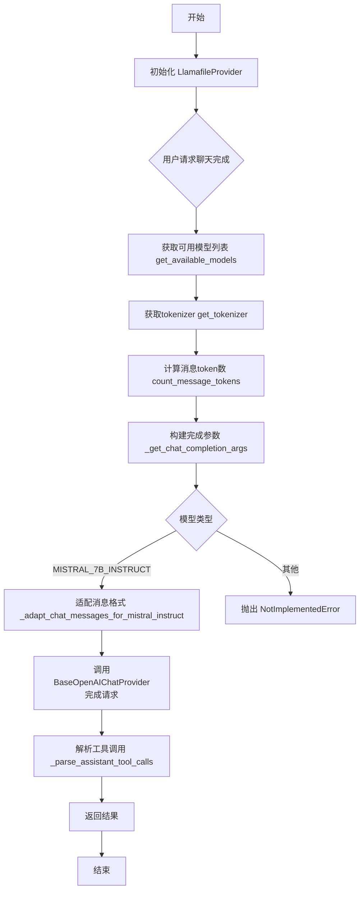
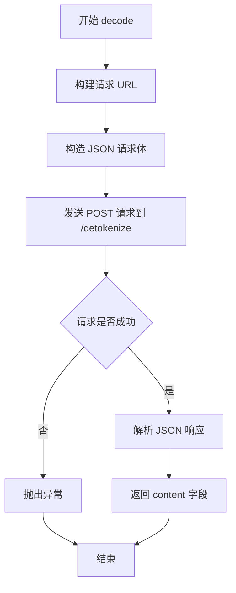
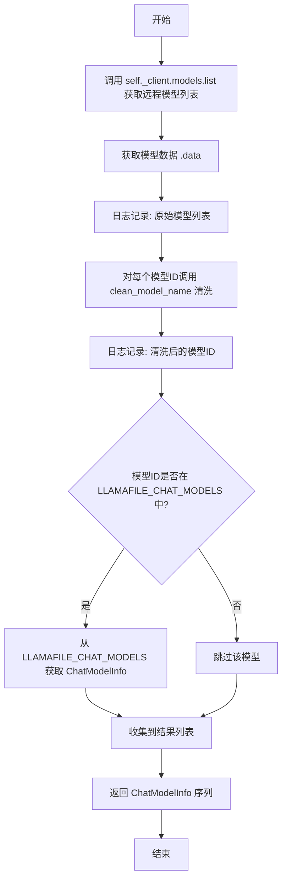
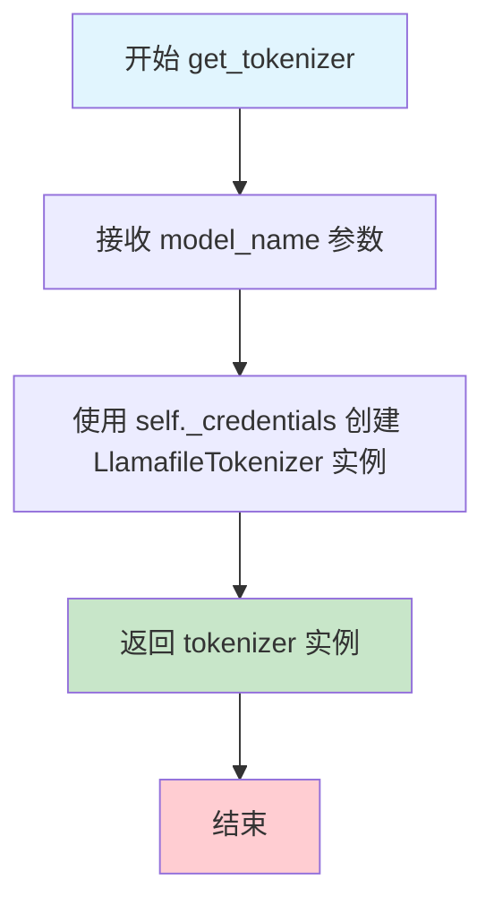
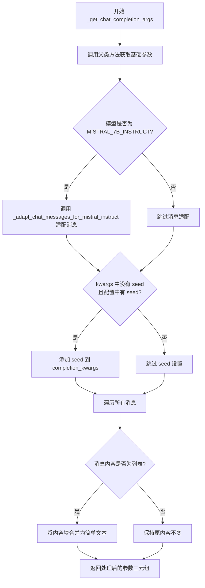
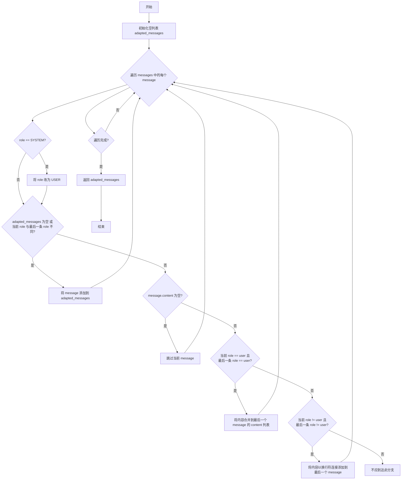
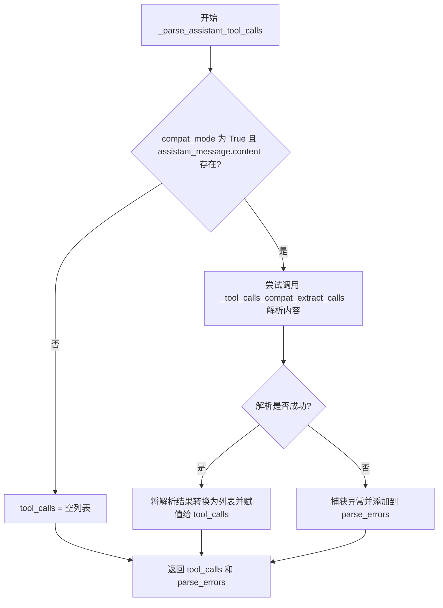

# `.\AutoGPT\classic\forge\forge\llm\providers\llamafile\llamafile.py` 详细设计文档

Llamafile模型提供者实现，通过OpenAI兼容API与本地llamafile实例交互，提供聊天完成服务（主要是Mistral-7B-Instruct模型），同时包含tokenization、消息格式适配和工具调用解析功能。

## 整体流程



## 类结构

```
ModelProviderConfiguration (基类)
├── LlamafileConfiguration
ModelProviderCredentials (基类)
├── LlamafileCredentials
ModelProviderSettings (基类)
├── LlamafileSettings
ModelTokenizer (基类)
├── LlamafileTokenizer
BaseOpenAIChatProvider (基类)
└── LlamafileProvider
```

## 全局变量及字段


### `MISTRAL_7B_INSTRUCT`
    
枚举成员，表示Mistral 7B指令微调模型

类型：`LlamafileModelName`
    


### `LLAMAFILE_CHAT_MODELS`
    
聊天模型信息字典，键为模型名称，值为模型信息

类型：`dict[str, ChatModelInfo]`
    


### `LLAMAFILE_EMBEDDING_MODELS`
    
嵌入模型信息字典，当前版本为空

类型：`dict`
    


### `LlamafileConfiguration.seed`
    
可选的随机种子参数，用于生成可重现的输出

类型：`Optional[int]`
    


### `LlamafileCredentials.api_key`
    
API密钥，可选，默认值为'sk-no-key-required'

类型：`Optional[SecretStr]`
    


### `LlamafileCredentials.api_base`
    
API基础URL，默认值为'http://localhost:8080/v1'，可从环境变量LLAMAFILE_API_BASE获取

类型：`SecretStr`
    


### `LlamafileSettings.configuration`
    
配置对象，包含模型提供商的配置

类型：`LlamafileConfiguration`
    


### `LlamafileSettings.credentials`
    
凭证对象，包含API密钥和基础URL等认证信息

类型：`Optional[LlamafileCredentials]`
    


### `LlamafileTokenizer._credentials`
    
内部凭证对象，用于API调用认证

类型：`LlamafileCredentials`
    


### `LlamafileTokenizer._tokenizer_base_url`
    
分词器基础URL，从凭证的api_base派生而去掉'/v1'后缀

类型：`str`
    


### `LlamafileProvider.EMBEDDING_MODELS`
    
可用的嵌入模型字典

类型：`dict`
    


### `LlamafileProvider.CHAT_MODELS`
    
可用的聊天模型字典

类型：`dict`
    


### `LlamafileProvider.MODELS`
    
所有模型的字典，合并了聊天模型和嵌入模型

类型：`dict`
    


### `LlamafileProvider.default_settings`
    
默认的提供商设置

类型：`LlamafileSettings`
    


### `LlamafileProvider._settings`
    
当前实例的设置对象

类型：`LlamafileSettings`
    


### `LlamafileProvider._credentials`
    
当前实例的凭证对象

类型：`LlamafileCredentials`
    


### `LlamafileProvider._configuration`
    
当前实例的配置对象

类型：`LlamafileConfiguration`
    
    

## 全局函数及方法


### `clean_model_name`

清理模型名称，去除文件扩展名和量化信息（如 Q4_K_M、q4 等），提取纯净的模型名称。

参数：

- `model_file`：`str`，待清理的模型文件名或完整路径

返回值：`str`，清理后的模型名称

#### 流程图

```mermaid
flowchart TD
    A[开始] --> B[提取文件名<br/>Path(model_file).name]
    B --> C[移除文件扩展名<br/>rsplit('.', 1)[0]]
    D --> E{正则匹配成功?}
    C --> D[使用正则表达式移除量化信息<br/>匹配模式: 字母数字 + 可选的非量化后缀部分}
    E -->|是| F[返回匹配组<br/>name_without_Q.group()]
    E -->|否| G[返回无扩展名的名称<br/>name_without_ext]
    F --> H[结束]
    G --> H
```

#### 带注释源码

```python
def clean_model_name(model_file: str) -> str:
    """
    Clean up model names:
    1. Remove file extension
    2. Remove quantization info

    Examples:
    ```
    raw:   'mistral-7b-instruct-v0.2.Q5_K_M.gguf'
    clean: 'mistral-7b-instruct-v0.2'

    raw: '/Users/kate/models/mistral-7b-instruct-v0.2.Q5_K_M.gguf'
    clean:                  'mistral-7b-instruct-v0.2'

    raw:   'llava-v1.5-7b-q4.gguf'
    clean: 'llava-v1.5-7b'
    ```
    """
    # 步骤1: 提取文件名（去除目录路径）并移除最后一个扩展名
    # 例如: '/path/to/model.Q5_K_M.gguf' -> 'model.Q5_K_M'
    name_without_ext = Path(model_file).name.rsplit(".", 1)[0]
    
    # 步骤2: 使用正则表达式移除量化信息
    # 正则解释:
    #   ^[a-zA-Z0-9]+           - 匹配模型基础名称（字母数字开头）
    #   ([.\-](?!([qQ]|B?F)\d{1,2})[a-zA-Z0-9]+)* 
    #                          - 匹配可选的后缀部分，忽略量化后缀
    #                          - (qQ|BF)\d{1,2} 匹配 q4, Q5, bf8, f16 等量化标识
    name_without_Q = re.match(
        r"^[a-zA-Z0-9]+([.\-](?!([qQ]|B?F)\d{1,2})[a-zA-Z0-9]+)*",
        name_without_ext,
    )
    
    # 如果正则匹配成功，返回清理后的名称；否则返回仅移除扩展名的名称
    return name_without_Q.group() if name_without_Q else name_without_ext
```


### `_tool_calls_compat_extract_calls`

该函数用于从大语言模型返回的文本响应中提取工具调用（Tool Calls）。它支持两种格式：直接以JSON数组形式返回，或以Markdown代码块形式返回（如 "```tool_calls\n...\n```"）。函数会解析这些格式并将结果转换为 `AssistantToolCall` 对象生成器，同时为每个工具调用生成唯一的ID。

参数：

- `response`：`str`，大语言模型返回的响应文本，可能包含JSON数组格式的工具调用或Markdown代码块包裹的工具调用

返回值：`Iterator[AssistantToolCall]`，一个生成器，逐个 yield 解析后的 AssistantToolCall 对象

#### 流程图

```mermaid
flowchart TD
    A[开始: 接收 response 字符串] --> B[去除首尾空白]
    B --> C{response 是否以 ``` 开头?}
    C -->|是| D[去除 ``` 标记]
    D --> E{是否以 json 开头?}
    E -->|是| F[去除 json 标记]
    E -->|否| G[保持原样]
    F --> H[去除剩余空白]
    G --> H
    C -->|否| I{response[0] 是否为 [?}
    I -->|是| J[直接用 json_loads 解析]
    I -->|否| K[使用正则匹配 ``` 块]
    K --> L{是否匹配到 block?}
    L -->|是| M[提取 block.group(1) 内容]
    L -->|否| N[抛出 ValueError]
    M --> J
    H --> I
    J --> O[遍历 tool_calls 列表]
    O --> P[为每个 tool_call 生成 uuid]
    P --> Q[解析为 AssistantToolCall 对象]
    Q --> R[yield AssistantToolCall]
    R --> O
    O --> S[结束]
    N --> T[返回错误]
```

#### 带注释源码

```python
def _tool_calls_compat_extract_calls(response: str) -> Iterator[AssistantToolCall]:
    """
    从LLM响应中提取工具调用的兼容模式提取器
    """
    import re
    import uuid

    # 记录调试日志，输出原始响应内容
    logging.debug(f"Trying to extract tool calls from response:\n{response}")

    # Step 1: 去除首尾空白
    response = response.strip()
    
    # Step 2: 处理Markdown代码块格式 (如 ```json ... ```)
    if response.startswith("```"):
        # 尝试移除多余的markdown标记如 "```json"
        response = response.strip("```")
        if response.startswith("json"):
            response = response.strip("json")
        response = response.strip()  # 移除剩余空白

    # Step 3: 判断格式并解析
    if response[0] == "[":
        # 格式A: 直接返回JSON数组 "[...]"
        tool_calls: list[AssistantToolCallDict] = json_loads(response)
    else:
        # 格式B: Markdown代码块包裹 "```tool_calls\n...\n```"
        block = re.search(r"```(?:tool_calls)?\n(.*)\n```\s*$", response, re.DOTALL)
        if not block:
            # 未找到工具调用代码块，抛出异常
            raise ValueError("Could not find tool_calls block in response")
        tool_calls: list[AssistantToolCallDict] = json_loads(block.group(1))

    # Step 4: 遍历每个工具调用，生成UUID并转换为AssistantToolCall对象
    for t in tool_calls:
        # 为每个工具调用生成唯一的ID
        t["id"] = str(uuid.uuid4())
        # 注意: 原始代码中有一行被注释的 HACK: t["function"]["arguments"] = str(t["function"]["arguments"])

        # 解析为 AssistantToolCall 对象并 yield
        yield AssistantToolCall.parse_obj(t)
```


### `LlamafileCredentials.get_api_access_kwargs`

该方法用于获取 Llamafile 提供商的身份验证参数，将类中存储的 `api_key` 和 `api_base` 从 `SecretStr` 类型转换为普通字符串，并过滤掉值为 `None` 的字段后返回给调用者。

参数：
- 该方法无显式参数（`self` 为实例引用）

返回值：`dict[str, str]`，返回包含 `api_key` 和 `base_url` 的字典，其中值为 `SecretStr` 的已解密，若原始值为 `None` 则该键值对会被过滤掉

#### 流程图

```mermaid
flowchart TD
    A[开始 get_api_access_kwargs] --> B[创建内部字典<br/>{api_key: self.api_key,<br/>base_url: self.api_base}]
    B --> C{遍历字典项}
    C -->|每个键值对| D{值 v 是否为 None}
    D -->|是| E[跳过该键值对]
    D -->|否| F[调用 v.get_secret_value<br/>解密 SecretStr]
    E --> C
    F --> G[将解密后的值加入结果字典]
    G --> C
    C -->|遍历完成| H[返回结果字典]
```

#### 带注释源码

```python
def get_api_access_kwargs(self) -> dict[str, str]:
    """
    获取 API 访问所需的认证参数。
    
    该方法将存储为 SecretStr 的敏感信息（api_key 和 api_base）
    转换为普通字符串，并过滤掉未设置的参数。
    
    返回值:
        包含 'api_key' 和 'base_url' 的字典，值为解密后的字符串。
        如果某项为 None，则不会出现在返回字典中。
    """
    # 使用字典推导式构建参数字典
    # 遍历内部字典 {"api_key": self.api_key, "base_url": self.api_base}
    # 只有当值不为 None 时才进行处理
    return {
        k: v.get_secret_value()  # 调用 SecretStr 的 get_secret_value() 方法解密
        for k, v in {            # 遍历键值对
            "api_key": self.api_key,
            "base_url": self.api_base,
        }.items()
        if v is not None         # 过滤条件：仅保留非 None 的值
    }
```


### `LlamafileTokenizer.encode`

该方法负责将输入文本转换为对应的token IDs列表。它通过HTTP POST请求调用llamafile实例的tokenize端点，发送待编码的文本内容，并从响应中提取并返回token数组。

参数：

- `text`：`str`，需要被编码为token的文本内容

返回值：`list[int]`，由token ID组成的列表

#### 流程图

```mermaid
flowchart TD
    A[开始 encode] --> B[构建请求URL<br/>{tokenizer_base_url}/tokenize]
    B --> C[构造请求JSON<br/>{"content": text}]
    C --> D[发送POST请求]
    D --> E{请求是否成功}
    E -->|否| F[抛出HTTP错误异常]
    E -->|是| G[解析响应JSON]
    G --> H[提取tokens数组]
    H --> I[返回token列表]
    
    F --> J[结束]
    I --> J
```

#### 带注释源码

```python
def encode(self, text: str) -> list[int]:
    """
    将输入文本编码为token ID列表
    
    参数:
        text: str - 需要编码的原始文本字符串
    
    返回:
        list[int] - token ID数组
    """
    # 动态构建tokenize端点URL，基于credentials中的api_base
    # 例如: http://localhost:8080/tokenize (移除默认的/v1后缀)
    response = requests.post(
        url=f"{self._tokenizer_base_url}/tokenize",  # 拼接tokenize端点
        json={"content": text}                        # 请求体：待编码的文本内容
    )
    
    # 检查HTTP响应状态码，若出错则抛出requests.HTTPError异常
    response.raise_for_status()
    
    # 从响应JSON中提取"tokens"字段并返回
    # 响应格式: {"tokens": [1, 234, 567, ...]}
    return response.json()["tokens"]
```


### `LlamafileTokenizer.decode`

将给定的令牌ID列表解码为文本字符串。通过向llamafile实例的detokenize端点发送POST请求来执行解码操作。

参数：

- `tokens`：`list[int]`，要解码的令牌ID列表

返回值：`str`，解码后的文本内容

#### 流程图



#### 带注释源码

```python
def decode(self, tokens: list[int]) -> str:
    """
    将令牌ID列表解码为文本字符串。

    参数:
        tokens: 要解码的令牌ID列表

    返回:
        解码后的文本字符串
    """
    # 向 llamafile 实例的 detokenize 端点发送 POST 请求
    # 请求体格式为 JSON，包含 tokens 字段
    response = requests.post(
        url=f"{self._tokenizer_base_url}/detokenize",
        json={"tokens": tokens}
    )
    
    # 检查 HTTP 响应状态，如果出错则抛出异常
    response.raise_for_status()
    
    # 解析 JSON 响应，提取 content 字段作为返回结果
    return response.json()["content"]
```


### `LlamafileProvider.get_available_models`

该方法是一个异步函数，用于从 llamafile 实例中获取当前可用的模型列表。它通过调用底层 OpenAI 客户端的模型列表接口获取远程模型，然后对模型 ID 进行清洗（移除文件扩展名和量化信息），最终与本地预定义的聊天模型进行匹配，返回符合条件的 `ChatModelInfo` 序列。

参数：

- 该函数无显式参数（仅隐式接收 `self`）

返回值：`Sequence[ChatModelInfo[LlamafileModelName]]`，返回与本地预定义模型匹配的 `ChatModelInfo` 对象序列

#### 流程图



#### 带注释源码

```python
async def get_available_models(
    self,
) -> Sequence[ChatModelInfo[LlamafileModelName]]:
    """
    获取当前 llamafile 实例中可用的模型列表。

    该方法通过 OpenAI 兼容的客户端接口获取远程模型，
    并与本地定义的聊天模型进行匹配过滤。

    Returns:
        Sequence[ChatModelInfo[LlamafileModelName]]: 
            与本地预定义模型匹配的 ChatModelInfo 对象序列
    """
    # 调用底层 OpenAI 客户端的模型列表接口
    # 这是一个异步调用，返回包含模型信息的响应对象
    _models = (await self._client.models.list()).data
    
    # 注意：目前 llamafile 每次只提供一个模型（因此列表只有一个值）
    # 但将来可能会支持多模型，所以保留当前实现方式
    self._logger.debug(f"Retrieved llamafile models: {_models}")

    # 对每个远程模型的 ID 进行清洗处理
    # 清洗操作包括：移除文件扩展名、移除量化信息（如 Q5_K_M）
    clean_model_ids = [clean_model_name(m.id) for m in _models]
    self._logger.debug(f"Cleaned llamafile model IDs: {clean_model_ids}")

    # 过滤并返回与本地预定义聊天模型匹配的模型信息
    # 只有在 LLAMAFILE_CHAT_MODELS 中定义的模型才会被返回
    return [
        LLAMAFILE_CHAT_MODELS[id]
        for id in clean_model_ids
        if id in LLAMAFILE_CHAT_MODELS
    ]
```


### `LlamafileProvider.get_tokenizer`

该方法根据提供的模型名称返回一个配置好的 `LlamafileTokenizer` 实例，用于对文本进行分词和编码解码操作。

参数：

- `model_name`：`LlamafileModelName`，指定的模型名称（用于标识返回哪个模型的 tokenizer，但在当前实现中未实际使用）

返回值：`LlamafileTokenizer`，返回配置了凭证的 tokenizer 实例，可用于对文本进行 token 化或对 token 进行解码

#### 流程图



#### 带注释源码

```python
def get_tokenizer(self, model_name: LlamafileModelName) -> LlamafileTokenizer:
    """
    根据模型名称获取对应的 tokenizer 实例。
    
    注意：当前实现中 model_name 参数未被使用，tokenizer 的配置仅依赖于
    self._credentials（API 凭证）。这是因为 llamafile 实例在同一时间
    通常只运行一个模型，因此凭证中包含的 API base URL 已经足以定位
    正确的 tokenizer 端点。
    
    参数:
        model_name: LlamafileModelName - 模型枚举值，标识要获取 tokenizer 的模型
        
    返回值:
        LlamafileTokenizer - 配置好的 tokenizer 实例，可用于文本编码/解码
    """
    # 使用当前 provider 的凭证创建一个新的 LlamafileTokenizer 实例
    # LlamafileTokenizer 会从 credentials 中提取 api_base 并构造
    # tokenizer 端点的基础 URL（去除 /v1 后缀）
    return LlamafileTokenizer(self._credentials)
```


### `LlamafileProvider.count_message_tokens`

该方法用于计算给定聊天消息列表在特定Llamafile模型下的token数量。它针对Mistral-7B-Instruct模型特殊处理了聊天模板所需的额外token（如`<s>`、`[INST]`、`[/INST]`、`</s>`等特殊标记），并累加每条消息内容的token数。

参数：

- `self`：`LlamafileProvider`，Provider实例本身
- `messages`：`ChatMessage | list[ChatMessage]`，单个聊天消息或消息列表
- `model_name`：`LlamafileModelName`，模型名称枚举

返回值：`int`，计算得到的总token数量

#### 流程图

```mermaid
flowchart TD
    A[开始 count_message_tokens] --> B{判断 messages 类型}
    B -->|ChatMessage| C[转换为列表: messages = [messages]]
    B -->|list| D[直接使用]
    C --> E{判断 model_name}
    D --> E
    E -->|MISTRAL_7B_INSTRUCT| F[初始化计数变量]
    E -->|其他模型| G[抛出 NotImplementedError]
    F --> H{遍历 messages}
    H -->|还有消息| I{判断消息角色}
    I -->|USER 或 SYSTEM| J[prompt_added += 5]
    I -->|ASSISTANT| K[assistant_num_added += 1]
    I -->|其他角色| L[抛出 ValueError]
    J --> M[ntokens += count_tokens]
    K --> M
    L --> M
    M --> H
    H -->|遍历完成| N[total = prompt_added + assistant_num_added + ntokens]
    N --> O[返回 total_token_count]
    G --> P[结束]
    O --> P
```

#### 带注释源码

```python
def count_message_tokens(
    self,
    messages: ChatMessage | list[ChatMessage],
    model_name: LlamafileModelName,
) -> int:
    """
    计算给定聊天消息列表在特定模型下的token数量
    
    针对Mistral-7B-Instruct模型，需要考虑聊天模板引入的特殊标记：
    - 用户/系统消息：添加[s]、[INST]、[/INST]标记（共计5个token）
    - 助手消息：添加[/s]结束标记（1个token）
    """
    # 如果是单个消息，转换为列表统一处理
    if isinstance(messages, ChatMessage):
        messages = [messages]

    # 目前仅支持Mistral-7B-Instruct模型
    if model_name == LlamafileModelName.MISTRAL_7B_INSTRUCT:
        # 初始化计数变量
        # prompt_added: 起始的<s> token（1个）
        prompt_added = 1  # one for '<s>' token
        # assistant_num_added: 助手消息的</s> token计数
        assistant_num_added = 0
        # ntokens: 消息内容的token数
        ntokens = 0
        
        # 遍历每条消息
        for message in messages:
            # 用户消息和系统消息都需要添加[INST][/INST]标记
            if (
                message.role == ChatMessage.Role.USER
                # note that 'system' messages will get converted
                # to 'user' messages before being sent to the model
                or message.role == ChatMessage.Role.SYSTEM
            ):
                # 5 tokens for [INST], [/INST], which actually get
                # tokenized into "[, INST, ]" and "[, /, INST, ]"
                # by the mistral tokenizer
                prompt_added += 5
            # 助手消息添加</s>结束标记
            elif message.role == ChatMessage.Role.ASSISTANT:
                assistant_num_added += 1  # for </s>
            # 不支持其他角色（如function角色）
            else:
                raise ValueError(
                    f"{model_name} does not support role: {message.role}"
                )

            # 累加每条消息内容的token数
            ntokens += self.count_tokens(message.content, model_name)

        # 计算总token数
        total_token_count = prompt_added + assistant_num_added + ntokens
        return total_token_count

    else:
        # 其他模型尚未实现
        raise NotImplementedError(
            f"count_message_tokens not implemented for model {model_name}"
        )
```


### `LlamafileProvider._get_chat_completion_args`

该方法用于获取聊天补全参数，调用父类方法获取基础参数后，针对 Mistral 模型适配聊天消息内容，并处理配置中的 seed 参数，同时将复杂的内容块转换为简单的文本格式。

参数：

- `prompt_messages`：`list[ChatMessage]`，聊天消息列表，包含角色和内容
- `model`：`LlamafileModelName`，使用的模型名称
- `functions`：`list[CompletionModelFunction] | None`，可选的函数定义列表
- `max_output_tokens`：`int | None`，最大输出 token 数量限制
- `**kwargs`：其他关键字参数

返回值：`tuple[list[ChatCompletionMessageParam], CompletionCreateParams, dict[str, Any]]`，返回一个三元组，包含处理后的消息列表、创建补全所需的参数字典、以及解析参数字典

#### 流程图



#### 带注释源码

```python
def _get_chat_completion_args(
    self,
    prompt_messages: list[ChatMessage],
    model: LlamafileModelName,
    functions: list[CompletionModelFunction] | None = None,
    max_output_tokens: int | None = None,
    **kwargs,
) -> tuple[
    list[ChatCompletionMessageParam], CompletionCreateParams, dict[str, Any]
]:
    """
    获取聊天补全参数的方法。
    
    该方法首先调用父类方法获取基础参数，然后针对特定模型
    （如 Mistral）进行消息适配，并处理配置中的 seed 参数。
    """
    # 调用父类方法获取基础参数：消息列表、补全参数和解析参数
    messages, completion_kwargs, parse_kwargs = super()._get_chat_completion_args(
        prompt_messages, model, functions, max_output_tokens, **kwargs
    )

    # 如果是 Mistral 7B Instruct 模型，需要适配聊天消息格式
    # 以符合 mistral-7b-instruct 的聊天模板要求
    if model == LlamafileModelName.MISTRAL_7B_INSTRUCT:
        messages = self._adapt_chat_messages_for_mistral_instruct(messages)

    # 如果 kwargs 中没有指定 seed 且配置中有 seed 值，则添加到 completion_kwargs
    # 用于控制生成的可重复性
    if "seed" not in kwargs and self._configuration.seed is not None:
        completion_kwargs["seed"] = self._configuration.seed

    # 遍历所有消息，将包含内容块（content blocks）的消息转换为简单文本消息
    # 例如：将 [{'type': 'text', 'text': '...'}, {'type': 'image', ...}] 
    # 转换为 "..." 的格式
    for message in messages:
        if isinstance(content := message.get("content"), list):
            # 使用两个换行符连接所有文本块
            message["content"] = "\n\n".join(
                b["text"]
                for b in content
                if b["type"] == "text"
                # FIXME: add support for images through image_data completion kwarg
                # 注意：当前不支持图片内容，未来可能通过 image_data 参数支持
            )

    # 返回处理后的消息、补全参数和解析参数
    return messages, completion_kwargs, parse_kwargs
```


### `LlamafileProvider._adapt_chat_messages_for_mistral_instruct`

该方法用于将聊天消息适配为 Mistral-7B-Instruct 模型兼容的格式，主要处理角色转换（将 system 角色转为 user 角色）和连续相同角色消息的内容合并，以满足 Mistral instruct 模型只支持 user 和 assistant 角色且要求角色交替的约束。

参数：

- `messages`：`list[ChatCompletionMessageParam]`，输入的聊天消息列表

返回值：`list[ChatCompletionMessageParam]`，适配后的聊天消息列表

#### 流程图



#### 带注释源码

```python
def _adapt_chat_messages_for_mistral_instruct(
    self, messages: list[ChatCompletionMessageParam]
) -> list[ChatCompletionMessageParam]:
    """
    Munge the messages to be compatible with the mistral-7b-instruct chat
    template, which:
    - only supports 'user' and 'assistant' roles.
    - expects messages to alternate between user/assistant roles.

    See details here:
    https://huggingface.co/mistralai/Mistral-7B-Instruct-v0.2#instruction-format
    """
    # 初始化适配后的消息列表
    adapted_messages: list[ChatCompletionMessageParam] = []
    
    # 遍历每一条消息
    for message in messages:
        # 步骤1: 角色转换
        # 将 'system' 角色转换为 'user' 角色，因为 mistral-7b-instruct
        # 不支持 'system' 角色
        if message["role"] == ChatMessage.Role.SYSTEM:
            message["role"] = ChatMessage.Role.USER

        # 步骤2: 判断是否需要添加新消息或合并内容
        # 如果适配列表为空，或者当前消息角色与最后一条消息角色不同，
        # 则直接添加为新消息
        if (
            len(adapted_messages) == 0
            or message["role"] != (last_message := adapted_messages[-1])["role"]
        ):
            adapted_messages.append(message)
        else:
            # 步骤3: 处理相同角色的连续消息
            # 如果当前消息内容为空，则跳过
            if not message.get("content"):
                continue

            # 情况A: 当前角色和最后一条都是 user
            # user 消息可能包含多种内容块类型（如文本、图片等）
            if message["role"] == "user" and last_message["role"] == "user":
                # 如果上一条消息内容不是列表，转换为列表格式
                if not isinstance(last_message["content"], list):
                    last_message["content"] = [
                        {"type": "text", "text": last_message["content"]}
                    ]

                # 将当前消息内容扩展到上一条消息的内容列表中
                last_message["content"].extend(
                    message["content"]
                    if isinstance(message["content"], list)
                    else [{"type": "text", "text": message["content"]}]
                )
            # 情况B: 当前角色和最后一条都是 assistant（非 user）
            # 将两条消息内容以双换行符连接
            elif message["role"] != "user" and last_message["role"] != "user":
                last_message["content"] = (
                    (last_message.get("content") or "")
                    + "\n\n"
                    + (message.get("content") or "")
                ).strip()

    # 返回适配后的消息列表
    return adapted_messages
```


### `LlamafileProvider._parse_assistant_tool_calls`

该方法用于解析 LlamafileProvider 中的助手消息工具调用。当启用兼容模式时，它尝试从助手消息内容中提取工具调用，并将解析过程中可能出现的错误收集到错误列表中，最终返回提取的工具调用列表和解析错误列表。

参数：

- `self`：`LlamafileProvider`， LlamafileProvider 实例本身
- `assistant_message`：`ChatCompletionMessage`，来自 OpenAI 的聊天完成消息，包含助手回复内容
- `compat_mode`：`bool`，可选参数，默认值为 `False`，是否启用兼容模式以从消息内容中提取工具调用
- `**kwargs`：可选的关键字参数，用于扩展额外参数

返回值：返回类型为 `tuple[list[AssistantToolCall], list[Exception]]`，其中第一个元素是解析出的工具调用列表，第二个元素是解析过程中产生的异常列表

#### 流程图



#### 带注释源码

```python
def _parse_assistant_tool_calls(
    self,
    assistant_message: ChatCompletionMessage,
    compat_mode: bool = False,
    **kwargs,
):
    """
    解析助手消息中的工具调用
    
    参数:
        assistant_message: 来自 OpenAI 的聊天完成消息
        compat_mode: 是否启用兼容模式，用于从消息内容中提取工具调用
        **kwargs: 额外的关键字参数
    
    返回:
        tuple: (tool_calls, parse_errors) 工具调用列表和解析错误列表
    """
    # 初始化空的工具调用列表和错误列表
    tool_calls: list[AssistantToolCall] = []
    parse_errors: list[Exception] = []

    # 仅在兼容模式且消息有内容时进行解析
    if compat_mode and assistant_message.content:
        try:
            # 调用兼容模式提取函数从消息内容中解析工具调用
            tool_calls = list(
                _tool_calls_compat_extract_calls(assistant_message.content)
            )
        except Exception as e:
            # 捕获解析过程中的异常并添加到错误列表
            parse_errors.append(e)

    # 返回工具调用列表和解析错误列表
    return tool_calls, parse_errors
```

## 关键组件


### LlamafileModelName

模型名称枚举，定义了Llamafile支持的聊天模型，当前仅包含Mistral 7B Instruct v0.2，用于标识具体的模型类型并在代码中进行模型特定逻辑处理。

### LLAMAFILE_CHAT_MODELS

聊天模型信息字典，以模型名称为键存储ChatModelInfo对象，包含模型的provider_name、prompt_token_cost、completion_token_cost、max_tokens、has_function_call_api等元数据，用于模型注册和可用模型查询。

### LlamafileConfiguration

Llamafile提供商配置类，继承自ModelProviderConfiguration，目前包含可选的seed参数用于设置随机种子（待实现），用于配置模型的运行时行为。

### LlamafileCredentials

Llamafile提供商凭证类，继承自ModelProviderCredentials，管理API访问所需的api_key和api_base，其中api_base支持从环境变量LLAMAFILE_API_BASE读取或使用默认值http://localhost:8080/v1，提供get_api_access_kwargs方法返回认证参数字典。

### LlamafileTokenizer

分词器实现类，继承自ModelTokenizer[int]，通过HTTP请求调用llamafile实例的tokenize和detokenize端点实现文本与token序列的相互转换，其中_tokenizer_base_url属性通过去除/api_base中的/v1后缀得到tokenizer服务地址。

### LlamafileProvider

主要的聊天完成提供商类，继承自BaseOpenAIChatProvider，实现与OpenAI API兼容的聊天接口，核心方法包括：get_available_models异步获取可用模型列表，get_tokenizer返回对应模型的分词器，count_message_tokens针对Mistral模型计算消息token数量，_get_chat_completion_args处理聊天完成参数并对Mistral模型进行消息适配，_adapt_chat_messages_for_mistral_instruct将消息转换为Mistral聊天模板格式（仅支持user和assistant角色并要求交替），_parse_assistant_tool_calls从响应中解析工具调用。

### clean_model_name

模型名称清理函数，通过正则表达式移除文件扩展名和量化信息（如Q5_K_M），支持处理完整路径和仅文件名的输入，返回清理后的模型ID，是实现反量化支持的关键组件。

### _tool_calls_compat_extract_calls

工具调用兼容性提取函数，从模型响应中解析tool_calls块，支持JSON数组格式和markdown代码块格式，生成AssistantToolCall对象，用于处理非标准格式的模型工具调用响应。

### Mistral消息模板适配逻辑

包含在_count_message_tokens和_adapt_chat_messages_for_mistral_instruct方法中的特定逻辑，处理Mistral-7b-Instruct模型的特殊token添加规则（prompt添加1个<s> token和5个[INST][/INST] token，assistant消息添加</s> token）以及聊天消息的角色转换和内容拼接。


## 问题及建议


### 已知问题

- **TODO 标记未实现**: 代码中存在多处 TODO 注释，表明功能未完成，包括 `seed` 参数的跨框架实现、嵌入模型支持、以及图像数据处理的 FIXME 标记
- **同步阻塞 HTTP 请求**: `LlamafileTokenizer` 的 `encode()` 和 `decode()` 方法使用同步的 `requests.post`，在异步上下文中会阻塞事件循环，应使用 `httpx` 或 `aiohttp` 等异步 HTTP 客户端
- **网络请求无超时配置**: `encode()`、`decode()` 和 `get_available_models()` 中的 HTTP 请求均未设置超时时间，可能导致请求无限期挂起
- **硬编码默认值风险**: `api_key` 默认值为 `"sk-no-key-required"`，`api_base` 默认指向本地 `localhost:8080`，生产环境中容易被误用
- **不支持多模型动态发现**: `get_available_models()` 虽有动态获取模型的逻辑，但硬编码的 `LLAMAFILE_CHAT_MODELS` 仅包含一个模型，动态发现的模型若不在映射中会被忽略
- **工具调用解析不完整**: `_parse_assistant_tool_calls()` 方法在 `compat_mode=False` 时直接返回空列表，且内部导入 `re` 和 `uuid` 模块不符合最佳实践
- **Token 计算仅支持单一模型**: `count_message_tokens()` 方法仅实现了 `MISTRAL_7B_INSTRUCT` 模型的 token 计算逻辑，其他模型会抛出 `NotImplementedError`
- **系统消息处理逻辑简单**: 系统消息被简单转换为用户消息，未考虑系统提示词的特殊处理可能影响模型输出质量

### 优化建议

- **异步化 HTTP 请求**: 将 `LlamafileTokenizer` 改为使用 `httpx.AsyncClient` 或 `aiohttp` 实现异步请求，并添加超时配置
- **完善配置校验**: 在 `LlamafileCredentials` 中添加 `api_base` 的 URL 格式校验，对 `api_key` 提供更明确的配置指引
- **扩展 token 计算支持**: 为其他可能的模型实现通用的 token 计数逻辑，或至少提供基于字符数的估算方法
- **改进模型发现机制**: 增强 `get_available_models()` 的健壮性，对未在预定义映射中的模型提供回退处理或动态注册
- **统一模块导入位置**: 将 `_tool_calls_compat_extract_calls` 中的内部导入移至文件顶部
- **完善工具调用解析**: 扩展 `_parse_assistant_tool_calls()` 以支持更多场景，添加详细日志记录解析失败的原因
- **添加健康检查机制**: 在 `LlamafileProvider` 初始化或首次使用时添加连接性检查，及时发现服务不可用的情况

## 其它


### 设计目标与约束

该模块旨在为llamafile实例提供一个统一的模型提供者接口，封装与本地运行的llamafile服务器的通信细节，使得上层应用能够以标准化的方式调用聊天补全功能。主要设计约束包括：仅支持Mistral 7B Instruct模型作为聊天模型，不支持函数调用( function_call)API，tokenizer依赖远程HTTP端点而非本地计算，需保持与OpenAI API的兼容性以利用现有基础设施。

### 错误处理与异常设计

该模块涉及两类错误处理场景。HTTP请求错误通过`requests.post`调用后的`response.raise_for_status()`自动抛出requests库的HTTPError异常；JSON解析错误由`json_loads`函数在处理工具调用时抛出。`count_message_tokens`方法对不支持的模型角色抛出`ValueError`，对未实现的模型抛出`NotImplementedError`。`_tool_calls_compat_extract_calls`函数在无法提取工具调用时抛出`ValueError`。建议增加重试机制以处理临时性网络故障，并统一错误日志记录格式。

### 数据流与状态机

数据流从用户输入开始，依次经过：ChatMessage构建 → LlamafileProvider.get_chat_completion() → _get_chat_completion_args()进行消息适配与参数组装 → 调用OpenAI兼容API → 响应解析。无复杂状态机，主要状态转换在消息预处理阶段：SYSTEM角色转换为USER角色，相邻同角色消息进行内容合并，Mistral模板所需的特殊token([INST][/INST])在token计数时添加。

### 外部依赖与接口契约

核心依赖包括：requests库用于HTTP通信，pydantic用于配置模型，openai库的类型定义用于消息参数，forge内部模块(_openai_base、schema、models.config、json.parsing)提供基础能力。接口契约方面：tokenizer的encode/decode方法需返回符合ModelTokenizer[int]约定的列表，get_available_models返回Sequence[ChatModelInfo]，get_tokenizer返回LlamafileTokenizer实例。所有配置通过LlamafileSettings注入，支持从环境变量LLAMAFILE_API_BASE读取api_base默认值。

### 安全性考虑

Credentials中的api_key和api_base均使用SecretStr类型保护敏感信息，get_api_access_kwargs方法通过get_secret_value()安全访问。当前实现默认使用"sk-no-key-required"API密钥，适用于本地llamafile实例。API端点默认为localhost:8080，建议在生产环境中添加HTTPS支持验证和更严格的访问控制。

### 版本兼容性与升级路径

当前版本仅支持LLAMAFILE_CHAT_MODELS中定义的模型，embedding功能标注为TODO待实现。tokenizer依赖远程/v1端点而非标准tokenize端点的实现方式可能导致与某些llamafile版本不兼容。建议记录支持的llamafile服务器版本范围，并考虑添加版本协商机制。

### 性能优化建议

count_message_tokens方法中对每条消息调用count_tokens可能导致重复HTTP请求，建议缓存tokenizer实例。_adapt_chat_messages_for_mistral_instruct方法中频繁的列表操作可优化为更高效的字符串拼接。get_available_models的日志记录每次都创建新的列表推导，可考虑批量日志格式优化。

    