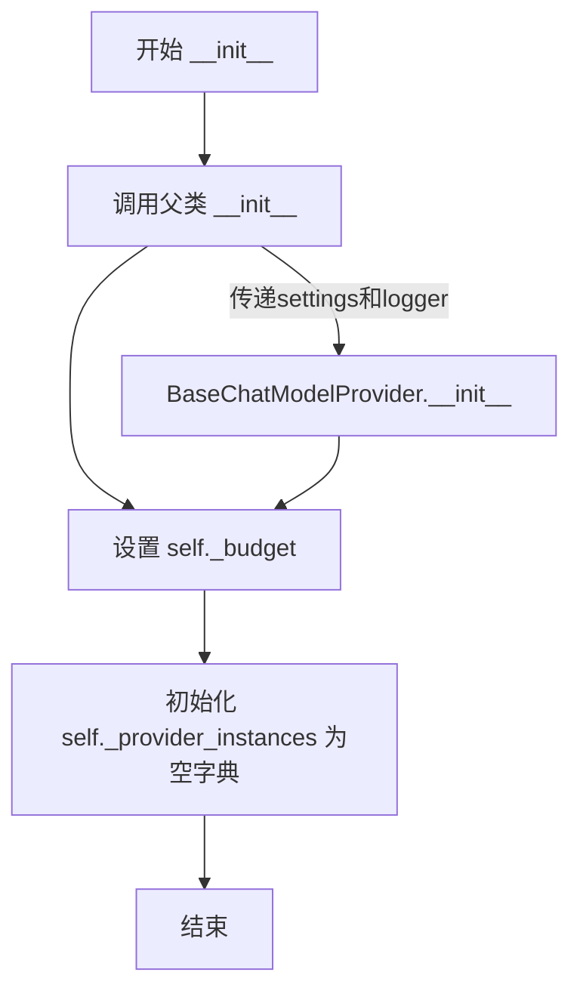
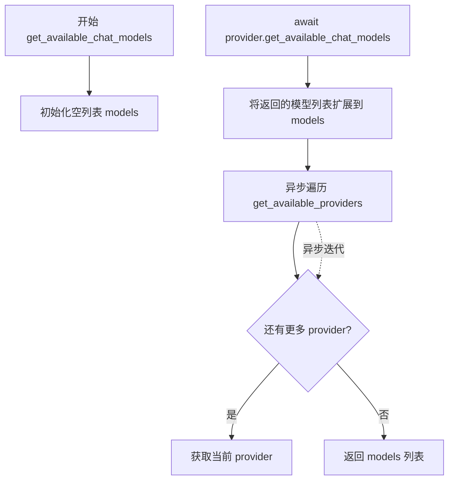
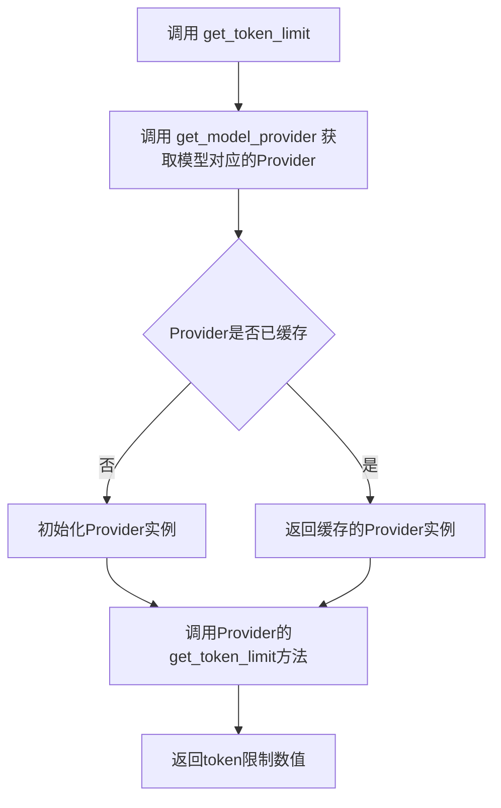
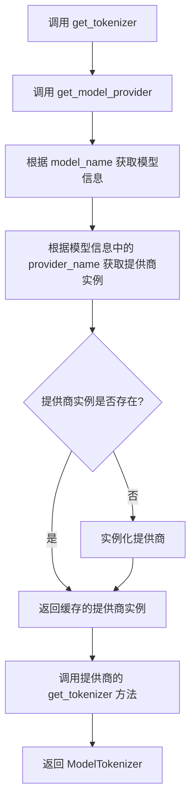
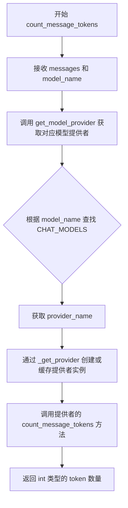
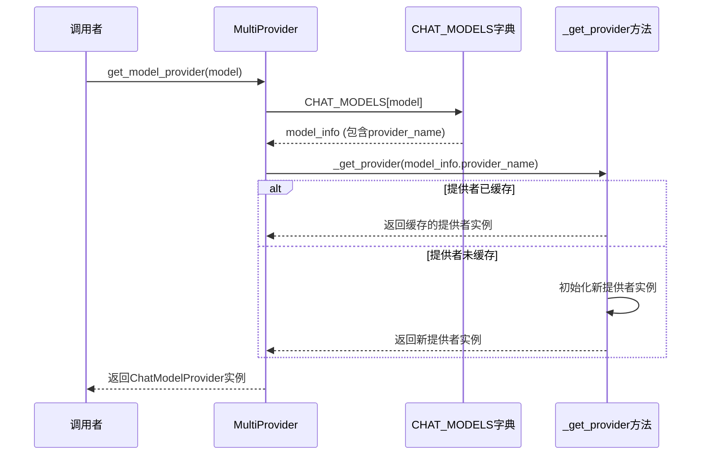
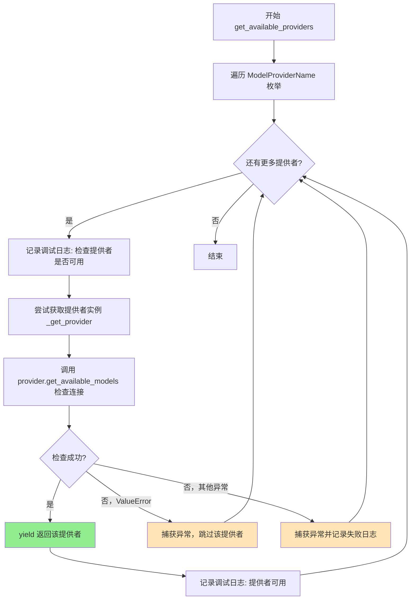
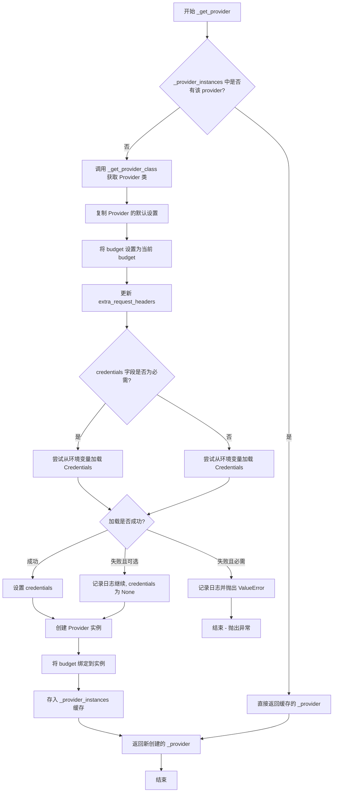
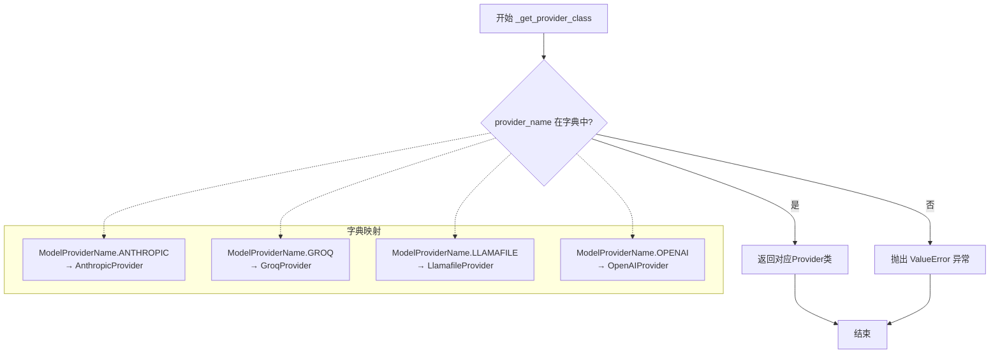

# `.\AutoGPT\classic\forge\forge\llm\providers\multi.py` 详细设计文档

这是一个多提供商聊天模型管理系统，整合了Anthropic、Groq、Llamafile和OpenAI等多家AI模型提供商，通过MultiProvider类提供统一的接口来访问不同提供商的聊天模型，支持模型查询、token计算和聊天补全等功能。

## 整体流程

```mermaid
graph TD
    A[开始] --> B[用户调用get_available_models]
B --> C[调用get_available_chat_models]
C --> D[遍历所有ModelProviderName]
D --> E{检查Provider是否可用}
E -- 可用 --> F[获取Provider实例]
F --> G[调用Provider的get_available_chat_models]
G --> H[聚合所有模型信息]
E -- 不可用 --> I[记录日志并跳过]
H --> J[返回模型列表]

graph TD
    K[用户调用create_chat_completion] --> L[根据model_name获取Provider]
L --> M[调用get_model_provider获取具体Provider]
M --> N[调用对应Provider的create_chat_completion]
N --> O[返回ChatModelResponse]
```

## 类结构

```
BaseChatModelProvider (抽象基类)
└── MultiProvider (多提供商实现)
    ├── AnthropicProvider
    ├── GroqProvider
    ├── LlamafileProvider
    └── OpenAIProvider
```

## 全局变量及字段


### `_T`
    
泛型类型变量，用于ChatModelResponse的响应类型参数化

类型：`TypeVar`
    


### `ModelName`
    
所有支持的聊天模型名称的联合类型别名

类型：`AnthropicModelName | GroqModelName | LlamafileModelName | OpenAIModelName`
    


### `EmbeddingModelProvider`
    
嵌入模型提供者类型别名，当前指向OpenAI提供商

类型：`OpenAIProvider`
    


### `CHAT_MODELS`
    
包含所有可用聊天模型的字典，通过provider分类合并ANTHROPIC、GROQ、LLAMAFILE、OPENAI的模型

类型：`dict`
    


### `ChatModelProvider`
    
聊天模型提供商的联合类型，包含所有支持的provider实现

类型：`AnthropicProvider | GroqProvider | LlamafileProvider | OpenAIProvider | MultiProvider`
    


### `MultiProvider.default_settings`
    
类属性，定义MultiProvider的默认配置，包括名称、描述、重试次数和预算设置

类型：`ModelProviderSettings`
    


### `MultiProvider._budget`
    
实例属性，存储当前provider的预算信息，用于控制API调用成本

类型：`ModelProviderBudget`
    


### `MultiProvider._provider_instances`
    
实例属性，缓存已初始化的provider实例，避免重复创建，提高性能

类型：`dict[ModelProviderName, ChatModelProvider]`
    
    

## 全局函数及方法


### `MultiProvider.__init__`

初始化 `MultiProvider` 实例，配置设置和日志记录器，并初始化预算和提供者实例缓存。

参数：

- `settings`：`Optional[ModelProviderSettings]` 可选的模型提供者设置配置
- `logger`：`Optional[logging.Logger]` 可选的日志记录器实例

返回值：`None`，该方法仅执行初始化操作，不返回任何值

#### 流程图



#### 带注释源码

```python
def __init__(
    self,
    settings: Optional[ModelProviderSettings] = None,
    logger: Optional[logging.Logger] = None,
):
    # 调用父类 BaseChatModelProvider 的初始化方法
    # 传递 settings 和 logger 参数
    super(MultiProvider, self).__init__(settings=settings, logger=logger)
    
    # 从设置中获取预算，如果未设置则创建新的默认预算实例
    # ModelProviderBudget() 提供默认的预算配置
    self._budget = self._settings.budget or ModelProviderBudget()

    # 初始化提供者实例缓存字典
    # 用于存储已创建的各个模型提供者（Anthropic、Groq、Llamafile、OpenAI）的单例实例
    # 键为 ModelProviderName，值为对应的 ChatModelProvider 实例
    self._provider_instances = {}
```


### `MultiProvider.get_available_models`

获取当前多提供商实例所有可用的模型列表，将模型查询操作委托给 `get_available_chat_models` 方法执行。

参数：

- （无显式参数，隐式接收 `self` 实例）

返回值：`Sequence[ChatModelInfo[ModelName]]`，返回所有可用的聊天模型信息序列，每个元素包含模型的元数据（如名称、上下文长度、供应商信息等）。

#### 流程图

```mermaid
flowchart TD
    A[开始 get_available_models] --> B{是否需要支持 Embeddings?}
    B -- TODO 标记 --> C[调用 get_available_chat_models]
    C --> D[返回 Sequence[ChatModelInfo[ModelName]]]
    D --> E[结束]
    
    style B fill:#ffcccc,stroke:#333,stroke-width:2px
    style C fill:#e1f5fe,stroke:#333,stroke-width:2px
```

#### 带注释源码

```python
async def get_available_models(self) -> Sequence[ChatModelInfo[ModelName]]:
    """获取所有可用的模型列表。
    
    注意：当前实现仅支持聊天模型，Embedding 模型的支持仍在计划中(TODO)。
    
    Returns:
        Sequence[ChatModelInfo[ModelName]]: 所有可用的聊天模型信息序列，
        包含来自各个提供商（Anthropic、Groq、Llamafile、OpenAI）的模型。
    """
    # TODO: support embeddings
    # 标记：未来需要扩展此方法以支持 Embedding 模型的查询
    # 当前将请求委托给 get_available_chat_models 方法
    return await self.get_available_chat_models()
```


### `MultiProvider.get_available_chat_models`

该方法是一个异步方法，用于获取所有可用的聊天模型。它通过异步遍历所有可用的模型提供者，从每个提供者处获取其支持的聊天模型列表，最后将所有模型合并成一个序列返回。

参数：

- `self`：`MultiProvider` 实例，隐式参数，无需显式传递

返回值：`Sequence[ChatModelInfo[ModelName]]`，返回一个包含所有可用聊天模型的序列，其中每个元素都是 `ChatModelInfo` 对象，泛型类型参数为 `ModelName`（即 `AnthropicModelName | GroqModelName | LlamafileModelName | OpenAIModelName` 的联合类型）

#### 流程图



#### 带注释源码

```python
async def get_available_chat_models(
    self,
) -> Sequence[ChatModelInfo[ModelName]]:
    """获取所有可用的聊天模型。
    
    该方法通过遍历所有可用的模型提供者，从每个提供者处
    获取其支持的聊天模型列表，并将所有模型合并返回。
    
    Returns:
        Sequence[ChatModelInfo[ModelName]]: 所有可用的聊天模型序列
    """
    # 初始化一个空列表用于存储所有聊天模型
    models = []
    
    # 异步遍历所有可用的模型提供者
    async for provider in self.get_available_providers():
        # 从当前提供者获取其支持的聊天模型列表
        # 并将结果扩展到 models 列表中
        models.extend(await provider.get_available_chat_models())
    
    # 返回合并后的所有聊天模型
    return models
```


### `MultiProvider.get_token_limit`

获取给定模型的token数量限制。该方法通过获取模型对应的提供者（provider），然后调用该提供者的 `get_token_limit` 方法来获取指定模型的token上限。

参数：

- `model_name`：`ModelName`，要查询token限制的模型名称

返回值：`int`，指定模型支持的最大token数量

#### 流程图



#### 带注释源码

```python
def get_token_limit(self, model_name: ModelName) -> int:
    """Get the token limit for a given model."""
    # 通过model_name获取对应的模型提供者（Provider）
    # 例如：如果model_name是OpenAI模型，则返回OpenAIProvider实例
    # 如果Provider尚未初始化，会自动创建并缓存
    provider = self.get_model_provider(model_name)
    
    # 调用具体Provider的get_token_limit方法获取token限制
    # type: ignore 用于跳过mypy对model_name类型兼容性的检查
    return provider.get_token_limit(model_name)  # type: ignore
```


### `MultiProvider.get_tokenizer`

获取指定模型的 tokenizer，用于对文本进行分词处理。该方法通过模型名称查找对应的模型提供商，并调用其 `get_tokenizer` 方法返回相应的 tokenizer 实例。

参数：

- `model_name`：`ModelName`，要获取 tokenizer 的模型名称，用于定位对应的模型提供商

返回值：`ModelTokenizer[Any]`，返回与指定模型关联的 tokenizer 实例，可用于对文本进行分词和 token 计数

#### 流程图



#### 带注释源码

```python
def get_tokenizer(self, model_name: ModelName) -> ModelTokenizer[Any]:
    """获取指定模型的 tokenizer。
    
    参数:
        model_name: ModelName, 模型名称，用于定位对应的模型提供商
        
    返回:
        ModelTokenizer[Any]: 对应模型的 tokenizer 实例，可用于文本分词
    """
    # 通过模型名称获取对应的模型提供商，然后调用其 get_tokenizer 方法
    # 1. 调用 get_model_provider(model_name) 获取正确的模型提供商实例
    # 2. 调用该提供商的 get_tokenizer 方法，传入模型名称
    # 3. 返回该模型对应的 tokenizer
    return self.get_model_provider(model_name).get_tokenizer(
        model_name  # type: ignore
    )
```


### `MultiProvider.count_tokens`

该方法是一个委托方法，它将 token 计数的请求转发给对应的模型提供者（Provider），通过调用 `get_model_provider` 获取实际处理该模型的提供者实例，然后由该提供者执行具体的 token 计数逻辑。

参数：

- `text`：`str`，需要计算 token 数量的文本内容
- `model_name`：`ModelName`，要使用的模型名称（可以是 AnthropicModelName、GroqModelName、LlamafileModelName 或 OpenAIModelName）

返回值：`int`，返回给定文本的 token 数量

#### 流程图

```mermaid
flowchart TD
    A[开始 count_tokens] --> B[调用 get_model_provider(model_name)]
    B --> C{获取对应的 Provider 实例}
    C -->|Provider 已缓存| D[直接返回缓存的 Provider]
    C -->|Provider 未缓存| E[创建并缓存新的 Provider 实例]
    D --> F[调用 Provider.count_tokens]
    E --> F
    F --> G[返回 token 数量]
```

#### 带注释源码

```python
def count_tokens(self, text: str, model_name: ModelName) -> int:
    """
    Count the number of tokens in the given text for a specific model.
    
    This method delegates the token counting to the appropriate model provider
    based on the model_name parameter.
    
    Args:
        text: The text content to count tokens for.
        model_name: The model name to use for tokenization.
        
    Returns:
        The number of tokens in the text.
    """
    # 获取给定模型对应的 Provider 实例，并调用其 count_tokens 方法
    # get_model_provider 会根据 model 查找对应的 provider 实现
    return self.get_model_provider(model_name).count_tokens(
        text=text, model_name=model_name  # type: ignore
    )
```


### `MultiProvider.count_message_tokens`

该方法是一个委托方法，用于计算给定消息列表的 token 数量。它通过 `get_model_provider` 根据模型名称获取对应的模型提供者，然后调用该提供者的 `count_message_tokens` 方法来执行实际的 token 计算逻辑。

参数：

- `messages`：`ChatMessage | list[ChatMessage]`，需要计算 token 数量的单条聊天消息或消息列表
- `model_name`：`ModelName`，模型名称，类型为 `AnthropicModelName | GroqModelName | LlamafileModelName | OpenAIModelName` 的联合类型

返回值：`int`，返回计算后的消息 token 总数

#### 流程图



#### 带注释源码

```python
def count_message_tokens(
    self, messages: ChatMessage | list[ChatMessage], model_name: ModelName
) -> int:
    """
    Count the number of tokens in a chat message or list of messages.
    
    Args:
        messages: A single ChatMessage or a list of ChatMessage objects
        model_name: The model name to use for tokenization
        
    Returns:
        The total number of tokens in the messages
    """
    # Delegate to the underlying model provider to perform the actual token counting
    # 获取对应模型的提供者实例，并调用其 count_message_tokens 方法
    return self.get_model_provider(model_name).count_message_tokens(
        messages=messages, model_name=model_name  # type: ignore
    )
```


### MultiProvider.create_chat_completion

该方法是一个异步方法，负责根据提供的模型名称获取对应的模型提供者，并委托其创建聊天完成请求。它充当了多提供者系统的统一入口点，将请求路由到具体的模型提供者（如Anthropic、Groq、OpenAI等）执行实际的语言模型调用。

参数：

- `model_prompt`：`list[ChatMessage]`，用户提供的聊天消息列表，作为模型输入
- `model_name`：`ModelName`，要使用的模型标识符（AnthropicModelName | GroqModelName | LlamafileModelName | OpenAIModelName）
- `completion_parser`：`Callable[[AssistantChatMessage], _T]`，用于解析模型响应的回调函数，默认为空函数
- `functions`：`Optional[list[CompletionModelFunction]]`，可选的函数定义列表，用于函数调用功能
- `max_output_tokens`：`Optional[int]`，生成响应的最大令牌数限制
- `prefill_response`：`str`，预填充的响应内容，用于引导模型输出格式
- `**kwargs`：可变关键字参数，传递给底层提供者的额外参数

返回值：`ChatModelResponse[_T]`，包含模型响应内容和解析后的结果的泛型对象

#### 流程图

```mermaid
flowchart TD
    A[开始 create_chat_completion] --> B[调用 get_model_provider model_name]
    B --> C{provider 是否已缓存?}
    C -->|否| D[实例化新的 Provider]
    C -->|是| E[从缓存获取 Provider]
    D --> F[调用 provider.create_chat_completion]
    E --> F
    F --> G[传递 model_prompt, model_name, completion_parser, functions, max_output_tokens, prefill_response, **kwargs]
    G --> H[返回 ChatModelResponse[_T]]
```

#### 带注释源码

```python
async def create_chat_completion(
    self,
    model_prompt: list[ChatMessage],
    model_name: ModelName,
    completion_parser: Callable[[AssistantChatMessage], _T] = lambda _: None,
    functions: Optional[list[CompletionModelFunction]] = None,
    max_output_tokens: Optional[int] = None,
    prefill_response: str = "",
    **kwargs,
) -> ChatModelResponse[_T]:
    """Create a completion using the Anthropic API."""
    # 通过模型名称获取对应的模型提供者实例
    # get_model_provider 会根据 model_info.provider_name 获取相应的 Provider 类
    # 并进行缓存管理，避免重复创建实例
    return await self.get_model_provider(model_name).create_chat_completion(
        model_prompt=model_prompt,
        model_name=model_name,  # type: ignore
        completion_parser=completion_parser,
        functions=functions,
        max_output_tokens=max_output_tokens,
        prefill_response=prefill_response,
        **kwargs,
    )
```


### `MultiProvider.get_model_provider`

获取指定模型对应的模型提供者实例。该方法根据模型名称从模型注册表中获取模型信息，然后返回对应的模型提供者。

参数：

- `model`：`ModelName`，要获取提供者的模型名称，类型为 `AnthropicModelName | GroqModelName | LlamafileModelName | OpenAIModelName` 的联合类型

返回值：`ChatModelProvider`，返回对应的模型提供者实例，类型为 `AnthropicProvider | GroqProvider | LlamafileProvider | OpenAIProvider | MultiProvider` 的联合类型

#### 流程图



#### 带注释源码

```python
def get_model_provider(self, model: ModelName) -> ChatModelProvider:
    """
    获取指定模型对应的模型提供者实例。
    
    该方法首先从CHAT_MODELS字典中查找模型信息，然后根据
    模型信息中的provider_name调用_get_provider方法获取
    对应的模型提供者实例。
    
    参数:
        model: ModelName - 模型名称，类型为AnthropicModelName | GroqModelName 
               | LlamafileModelName | OpenAIModelName的联合类型
        
    返回:
        ChatModelProvider - 对应的模型提供者实例，类型为AnthropicProvider 
               | GroqProvider | LlamafileProvider | OpenAIProvider | MultiProvider
               的联合类型
    """
    # 从CHAT_MODELS字典中获取模型信息
    # CHAT_MODELS是一个包含所有可用模型信息的字典，键为ModelName，值为ChatModelInfo
    model_info = CHAT_MODELS[model]
    
    # 调用_get_provider方法，根据model_info中的provider_name获取提供者实例
    # _get_provider方法会检查提供者是否已缓存，如果没有则创建新实例
    return self._get_provider(model_info.provider_name)
```


### `MultiProvider.get_available_providers`

该方法是一个异步生成器方法，用于遍历并返回所有可用的模型提供者。它通过检查每个提供者的连接状态来筛选出可用的提供者，并yield返回它们。

参数：
- （无显式参数，隐含 `self` 实例参数）

返回值：`AsyncIterator[ChatModelProvider]`，返回一个异步迭代器，包含所有当前可用的模型提供者实例

#### 流程图



#### 带注释源码

```python
async def get_available_providers(self) -> AsyncIterator[ChatModelProvider]:
    """获取所有可用的模型提供者迭代器。
    
    该方法遍历所有已注册的模型提供者，尝试初始化并检查其连接状态，
    只返回当前可用的提供者实例。
    
    Yields:
        ChatModelProvider: 当前可用的模型提供者实例
        
    Note:
        - 使用调试日志记录每个提供者的检查状态
        - 连接检查通过调用 provider.get_available_models() 实现
        - ValueError 表示提供者完全不可用，会被静默跳过
        - 其他异常会被记录但不会中断遍历过程
    """
    # 遍历 ModelProviderName 枚举中的所有提供者名称
    for provider_name in ModelProviderName:
        # 记录当前正在检查的提供者
        self._logger.debug(f"Checking if provider {provider_name} is available...")
        try:
            # 获取或初始化提供者实例
            provider = self._get_provider(provider_name)
            # 通过尝试获取模型列表来检查连接是否可用
            await provider.get_available_models()  # check connection
            # 连接成功，yield 返回该提供者
            yield provider
            # 记录提供者可用成功的调试日志
            self._logger.debug(f"Provider '{provider_name}' is available!")
        except ValueError:
            # 捕获 ValueError（如凭据加载失败），静默跳过该提供者
            pass
        except Exception as e:
            # 捕获其他异常（如网络错误），记录失败日志并继续检查下一个提供者
            self._logger.debug(f"Provider '{provider_name}' is failing: {e}")
```


### `MultiProvider._get_provider`

获取或创建指定名称的聊天模型提供商实例，如果缓存中已存在则直接返回，否则创建新实例并缓存。

参数：

- `provider_name`：`ModelProviderName`，要获取的提供商名称

返回值：`ChatModelProvider`，返回对应的聊天模型提供商实例

#### 流程图



#### 带注释源码

```python
def _get_provider(self, provider_name: ModelProviderName) -> ChatModelProvider:
    """
    获取或创建指定名称的聊天模型提供商实例。
    使用缓存机制避免重复创建相同的提供商实例。
    """
    # 1. 先从缓存中查找是否已有该提供商的实例
    _provider = self._provider_instances.get(provider_name)
    
    # 2. 如果缓存中没有，则需要创建新实例
    if not _provider:
        # 根据 provider_name 获取对应的 Provider 类（如 AnthropicProvider, OpenAIProvider 等）
        Provider = self._get_provider_class(provider_name)
        self._logger.debug(
            f"{Provider.__name__} not yet in cache, trying to init..."
        )

        # 3. 深拷贝默认设置，避免修改类级别的默认配置
        settings = Provider.default_settings.model_copy(deep=True)
        
        # 4. 将 MultiProvider 的 budget 传递给子 Provider
        settings.budget = self._budget
        
        # 5. 合并额外的请求头配置
        settings.configuration.extra_request_headers.update(
            self._settings.configuration.extra_request_headers
        )
        
        # 6. 处理凭证加载逻辑
        if settings.credentials is None:
            # 获取凭证的类型注解（Union[Credentials, None] -> Credentials）
            credentials_field = settings.model_fields["credentials"]
            Credentials = get_args(credentials_field.annotation)[0]
            self._logger.debug(f"Loading {Credentials.__name__}...")
            
            try:
                # 尝试从环境变量加载凭证
                settings.credentials = Credentials.from_env()
            except ValidationError as e:
                # 如果凭证是必需的字段，加载失败则抛出异常
                if credentials_field.is_required():
                    self._logger.debug(
                        f"Could not load (required) {Credentials.__name__}"
                    )
                    raise ValueError(
                        f"{Provider.__name__} is unavailable: "
                        "can't load credentials"
                    ) from e
                # 如果凭证不是必需的，记录日志继续（credentials 保持 None）
                self._logger.debug(
                    f"Could not load {Credentials.__name__}, continuing without..."
                )

        # 7. 创建 Provider 实例
        self._provider_instances[provider_name] = _provider = Provider(
            settings=settings, logger=self._logger  # type: ignore
        )
        
        # 8. Pydantic 模型复制不会保留对象引用，需要手动绑定 budget
        _provider._budget = self._budget
        self._logger.debug(f"Initialized {Provider.__name__}!")
    
    # 9. 返回提供商实例（无论是缓存的还是新创建的）
    return _provider
```


### `MultiProvider._get_provider_class`

根据提供的模型提供者名称，返回对应的Provider类。该方法是MultiProvider类的类方法，通过字典映射关系将`ModelProviderName`枚举值转换为具体的Provider类实现，支持动态加载Anthropic、Groq、Llamafile和OpenAI四家AI服务商的Provider类。

参数：

- `cls`：`class`，类方法隐含的第一个参数，表示当前类本身（MultiProvider类）
- `provider_name`：`ModelProviderName`，模型提供者的名称枚举值，用于指定需要获取的Provider类型

返回值：`type[AnthropicProvider | GroqProvider | LlamafileProvider | OpenAIProvider]`，返回对应的Provider类类型，如果provider_name不是已知的服务商则抛出ValueError异常

#### 流程图



#### 带注释源码

```python
@classmethod
def _get_provider_class(
    cls, provider_name: ModelProviderName
) -> type[AnthropicProvider | GroqProvider | OpenAIProvider]:
    """
    根据提供者名称获取对应的Provider类。
    
    这是一个类方法，用于将ModelProviderName枚举值映射到具体的
    Provider实现类。采用了字典映射的方式来实现快速查找。
    
    Args:
        cls: 类方法隐含参数，指向MultiProvider类本身
        provider_name: ModelProviderName枚举值，指定要获取的Provider类型
        
    Returns:
        返回对应的Provider类类型（AnthropicProvider、GroqProvider、
        LlamafileProvider或OpenAIProvider）
        
    Raises:
        ValueError: 当provider_name不是已知的服务商名称时抛出
    """
    try:
        # 使用字典映射将枚举值转换为对应的Provider类
        # 字典键为ModelProviderName枚举，值为对应的Provider类
        return {
            ModelProviderName.ANTHROPIC: AnthropicProvider,    # Anthropic AI服务
            ModelProviderName.GROQ: GroqProvider,              # Groq云端推理服务
            ModelProviderName.LLAMAFILE: LlamafileProvider,    # Llamafile本地运行
            ModelProviderName.OPENAI: OpenAIProvider,          # OpenAI服务
        }[provider_name]  # 通过provider_name查找对应的Provider类
    except KeyError:
        # 当provider_name不在字典中时，抛出ValueError异常
        # 使用from None抑制异常链，避免不必要的上下文泄露
        raise ValueError(f"{provider_name} is not a known provider") from None
```


### `MultiProvider.__repr__`

返回对象的字符串表示，用于调试和日志输出。当打印对象或使用 `repr()` 时会自动调用。

参数：

- `self`：`MultiProvider`，隐式参数，表示当前 MultiProvider 实例

返回值：`str`，返回类的名称加上空括号，例如 `MultiProvider()`

#### 流程图

```mermaid
graph LR
    A[__repr__ 调用] --> B[获取 self.__class__.__name__]
    B --> C[拼接字符串: {类名}()]
    C --> D[返回字符串]
```

#### 带注释源码

```python
def __repr__(self):
    """返回该对象的字符串表示。
    
    这是一个特殊方法（magic method），在以下情况会被自动调用：
    - 使用 print() 打印对象时
    - 在交互式解释器中直接输出对象时
    - 用于调试和日志记录
    
    Returns:
        str: 格式为 'MultiProvider()' 的字符串
    """
    return f"{self.__class__.__name__}()"
```

---

**文档补充说明**：

| 项目 | 说明 |
|------|------|
| **设计目标** | 提供一个简洁的对象标识，便于调试和日志输出 |
| **约束** | 返回格式固定为 `{类名}()`，不包含实例状态信息 |
| **与其他组件的关系** | 继承自 `BaseChatModelProvider`，`__repr__` 方法覆盖了基类实现 |
| **潜在优化空间** | 当前实现过于简单，未包含有意义的实例信息（如已加载的 provider 数量、budget 状态等），建议增强以提供更多调试价值 |

## 关键组件


### MultiProvider 类

核心聚合提供者类，封装多个模型提供者（Anthropic、Groq、Llamafile、OpenAI），统一管理聊天模型访问，支持动态发现可用提供者、延迟初始化和共享预算配置。

### CHAT_MODELS 字典

合并四个提供者的聊天模型元信息，提供模型名称到模型信息的映射，支持快速查找模型所属提供者和规格参数。

### ModelName 联合类型

整合所有支持模型的名称类型（AnthropicModelName | GroqModelName | LlamafileModelName | OpenAIModelName），用于统一类型注解和跨提供者模型引用。

### get_model_provider 方法

根据模型名称动态路由到对应提供者实例，触发提供者延迟初始化流程，是连接模型名称与具体提供者的核心枢纽。

### _get_provider 方法

实现惰性加载模式的提供者实例管理，包含凭证动态加载、预算绑定、深度复制设置等逻辑，支持按需初始化和缓存复用。

### get_available_providers 方法

异步迭代可用提供者列表，通过尝试调用提供者连接检查过滤不可用provider，实现动态服务发现机制。

### create_chat_completion 方法

统一入口方法，委托给实际提供者执行聊天完成，支持completion_parser、functions、max_output_tokens等参数透传。

### _get_provider_class 类方法

根据ModelProviderName枚举值映射到具体提供者类（AnthropicProvider、GroqProvider、LlamafileProvider、OpenAIProvider），构建提供者实例的工厂方法。

### 预算共享机制

通过将MultiProvider的_budget绑定到各提供者实例，实现跨提供者的使用量配额统一管理，解决Pydantic模型深拷贝后对象引用丢失问题。

### 动态凭证加载

支持从环境变量按需加载各provider专属凭证类，捕获ValidationError处理可选凭证场景，提供灵活的认证配置方式。


## 问题及建议


### 已知问题

-   **类型注解不一致**：在 `_get_provider` 方法中返回类型标注为 `ChatModelProvider`，但该类型定义在文件末尾，是一个包含 `MultiProvider` 自身的联合类型，这种自引用类型定义可能导致类型检查器无法正确推断类型，迫使代码中多处使用 `# type: ignore`
-   **Budget 对象绑定问题**：代码注释明确指出 "Object binding not preserved by Pydantic"，`_provider._budget = self._budget` 这种手动赋值方式容易遗漏，在复制 `settings` 时可能丢失对象引用关系
-   **异常处理过于宽泛**：`get_available_providers` 中捕获通用 `Exception` 但仅记录日志后继续，可能隐藏潜在的配置错误或网络问题，导致服务不可用时无法及时感知
-   **Provider 初始化开销**：每次调用 `_get_provider` 都会执行 `model_copy(deep=True)` 和 `update` 操作，即使 Provider 已缓存，这些复制操作仍会造成不必要的性能开销
-   **缺少并发控制**：多个异步请求同时调用 `get_available_providers` 时，可能导致 Provider 实例被重复初始化，缺乏线程安全或异步并发保护
-   **硬编码的 Provider 映射**：`_get_provider_class` 使用字典硬编码 Provider 类映射，新增 Provider 需要修改代码，不符合开闭原则

### 优化建议

-   **重构类型定义**：将 `ChatModelProvider` 改为抽象基类或 Protocol，定义统一的接口规范，避免自引用联合类型导致的类型推断问题
-   **改进 Budget 管理**：在 `ModelProviderSettings` 中使用 `before_validator` 确保 Budget 对象引用一致性，或提供专门的 Budget 绑定方法
-   **增强错误处理**：为 `get_available_providers` 添加配置选项控制失败 Provider 的处理策略，可选择快速失败或容忍部分失败；区分可恢复错误和配置错误
-   **优化 Provider 缓存**：在 `settings` 未变化时跳过深度复制，或引入更高效的缓存机制减少初始化开销
-   **添加并发保护**：使用 `asyncio.Lock` 或类似机制保护 Provider 实例的初始化过程，确保线程安全
-   **实现 Provider 注册机制**：通过插件模式或配置驱动的方式动态注册 Provider 类，提高扩展性

## 其它


### 设计目标与约束

设计目标：提供一个统一的多模型提供商抽象层，使得调用方可以通过一致的接口访问 Anthropic、Groq、Llamafile、OpenAI 等多种聊天模型，无需关心底层实现细节。

设计约束：
- 依赖 Pydantic v2 进行数据验证和设置管理
- 仅支持异步调用模式
- 模型名称必须来自预定义的模型列表（CHAT_MODELS）
- 每个模型必须映射到支持的提供商之一

### 错误处理与异常设计

异常处理策略采用分层设计：

1. **提供商可用性检查**：在 `get_available_providers` 中，捕获 ValueError（未知提供商）和通用 Exception（连接失败），仅记录日志并跳过不可用的提供商

2. **凭证加载失败**：
   - 如果凭证字段为必填（is_required），抛出 ValueError 并携带 "is unavailable: can't load credentials" 消息
   - 如果为可选字段，仅记录调试日志并继续执行

3. **未知提供商**：`_get_provider_class` 方法在 provider_name 不在映射字典中时抛出 ValueError

关键异常类型：
- `ValueError`：无效的模型名或提供商名
- `ValidationError`：Pydantic 验证失败（凭证加载时）
- `Exception`：提供商连接失败

### 数据流与状态机

数据流：

1. **模型查询流程**：ModelName → CHAT_MODELS 查找 → model_info.provider_name → _get_provider() 获取或创建提供商实例

2. **聊天完成流程**：model_prompt + model_name → get_model_provider() → 委托给具体提供商的 create_chat_completion()

3. **提供商实例化流程**：检查缓存 → 不存在则从环境变量加载凭证 → 创建实例 → 绑定共享预算 → 存入缓存

状态管理：
- `_provider_instances`：提供商实例缓存（字典）
- `_budget`：ModelProviderBudget 对象，在多提供商间共享
- 每个提供商实例的 _budget 属性指向同一个 budget 对象（虽然 Pydantic 模型复制不会保留对象引用）

### 外部依赖与接口契约

外部依赖：
- `pydantic>=2.0`：数据验证和设置管理
- `anthropic`：Anthropic API 客户端
- `groq`：Groq API 客户端
- `openai`：OpenAI API 客户端
- `llamafile`：Llamafile 本地模型支持

接口契约：
- 所有提供商必须继承 `BaseChatModelProvider` 抽象基类
- 必须实现 `get_available_chat_models()`、`create_chat_completion()`、`get_token_limit()`、`get_tokenizer()`、`count_tokens()` 等核心方法
- 返回值必须符合 `ChatModelInfo`、`ChatModelResponse` 等 Pydantic 模型定义

### 安全性考虑

1. **凭证管理**：凭证通过 `Credentials.from_env()` 从环境变量加载，避免硬编码

2. **凭证传递**：额外请求头（extra_request_headers）从父设置继承到子提供商设置

3. **可选凭证**：当凭证为可选时，允许部分提供商不可用而不影响整体功能

4. **日志脱敏**：调试日志中未对敏感信息进行脱敏处理，可能泄露 provider 名称等信息

### 性能考量

1. **提供商实例缓存**：`_provider_instances` 字典缓存已创建的提供商实例，避免重复初始化

2. **延迟加载**：提供商仅在首次使用时初始化（懒加载）

3. **连接检查开销**：`get_available_providers` 会为每个提供商调用 `get_available_models()` 检查连接，可能导致启动延迟

4. **预算对象绑定问题**：代码中注释指出 "Object binding not preserved by Pydantic"，需要手动重新赋值 `_provider._budget = self._budget`

### 配置与扩展性

配置方式：
- 通过 `ModelProviderSettings` 进行配置
- 支持自定义重试次数（retries_per_request）
- 支持额外请求头（extra_request_headers）
- 支持自定义预算限制（budget）

扩展性设计：
- 新增提供商只需在 `_get_provider_class` 映射中添加对应关系
- 提供商类必须继承 `BaseChatModelProvider` 并实现所需抽象方法
- `CHAT_MODELS` 字典可通过合并其他模型映射扩展

### 版本兼容性

1. **Python 版本**：代码使用 `from __future__ import annotations`，需要 Python 3.9+

2. **Pydantic 版本**：依赖 Pydantic v2（使用 `model_copy`、`model_fields` 等 v2 API）

3. **类型注解**：大量使用 Python 3.10+ 的并集类型语法（|），但通过 `from __future__ import annotations` 实现向后兼容

### 并发与线程安全性

1. **异步支持**：核心方法如 `get_available_models()`、`create_chat_completion()` 等均为 async 方法

2. **AsyncIterator**：`get_available_providers` 使用 AsyncIterator 模式逐个 yield 可用提供商

3. **线程安全**：`_provider_instances` 字典的读写操作在单线程异步上下文中执行，无显式锁机制，多并发场景下可能存在竞态条件
    