# `.\AutoGPT\classic\forge\forge\llm\providers\openai.py` 详细设计文档

该模块实现了OpenAI的模型提供者,支持GPT-3.5/GPT-4系列聊天模型和Embedding模型的接入,包含凭证管理、模型配置、API调用封装、Token计算、重试机制等功能,并提供了Azure OpenAI的兼容支持。

## 整体流程

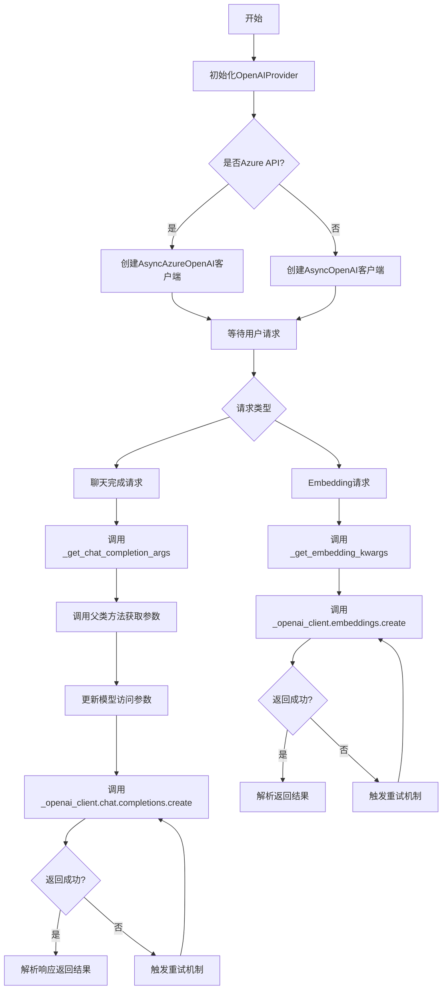

## 类结构

```
ModelProviderCredentials (基类)
└── OpenAICredentials
ModelProviderSettings (基类)
└── OpenAISettings
BaseOpenAIChatProvider[泛型基类]
BaseOpenAIEmbeddingProvider[泛型基类]
└── OpenAIProvider (多继承)
    ├── BaseOpenAIChatProvider
    └── BaseOpenAIEmbeddingProvider
```

## 全局变量及字段


### `OPEN_AI_EMBEDDING_MODELS`
    
存储OpenAI嵌入模型元信息的字典，包含v2和v3系列模型

类型：`dict[str, EmbeddingModelInfo]`
    


### `OPEN_AI_CHAT_MODELS`
    
存储OpenAI聊天模型元信息的字典，包含GPT-3.5和GPT-4系列

类型：`dict[str, ChatModelInfo]`
    


### `chat_model_mapping`
    
模型别名映射表，用于关联同一规格的不同模型版本

类型：`dict[OpenAIModelName, list[OpenAIModelName]]`
    


### `OPEN_AI_MODELS`
    
合并聊天和嵌入模型的完整模型映射

类型：`Mapping[OpenAIModelName, ChatModelInfo | EmbeddingModelInfo]`
    


### `OpenAIModelName.EMBEDDING_v2`
    
text-embedding-ada-002模型枚举值

类型：`OpenAIModelName`
    


### `OpenAIModelName.EMBEDDING_v3_S`
    
text-embedding-3-small模型枚举值

类型：`OpenAIModelName`
    


### `OpenAIModelName.EMBEDDING_v3_L`
    
text-embedding-3-large模型枚举值

类型：`OpenAIModelName`
    


### `OpenAIModelName.GPT3_v1`
    
gpt-3.5-turbo-0301模型枚举值

类型：`OpenAIModelName`
    


### `OpenAIModelName.GPT3_v2`
    
gpt-3.5-turbo-0613模型枚举值

类型：`OpenAIModelName`
    


### `OpenAIModelName.GPT3_v2_16k`
    
gpt-3.5-turbo-16k-0613模型枚举值

类型：`OpenAIModelName`
    


### `OpenAIModelName.GPT3_v3`
    
gpt-3.5-turbo-1106模型枚举值

类型：`OpenAIModelName`
    


### `OpenAIModelName.GPT3_v4`
    
gpt-3.5-turbo-0125模型枚举值

类型：`OpenAIModelName`
    


### `OpenAIModelName.GPT3_ROLLING`
    
gpt-3.5-turbo最新滚动版本枚举值

类型：`OpenAIModelName`
    


### `OpenAIModelName.GPT3_16k`
    
gpt-3.5-turbo-16k最新滚动版本枚举值

类型：`OpenAIModelName`
    


### `OpenAIModelName.GPT4_v1`
    
gpt-4-0314模型枚举值

类型：`OpenAIModelName`
    


### `OpenAIModelName.GPT4_v1_32k`
    
gpt-4-32k-0314模型枚举值

类型：`OpenAIModelName`
    


### `OpenAIModelName.GPT4_v2`
    
gpt-4-0613模型枚举值

类型：`OpenAIModelName`
    


### `OpenAIModelName.GPT4_v2_32k`
    
gpt-4-32k-0613模型枚举值

类型：`OpenAIModelName`
    


### `OpenAIModelName.GPT4_v3`
    
gpt-4-1106-preview模型枚举值

类型：`OpenAIModelName`
    


### `OpenAIModelName.GPT4_v3_VISION`
    
gpt-4-1106-vision-preview模型枚举值

类型：`OpenAIModelName`
    


### `OpenAIModelName.GPT4_v4`
    
gpt-4-0125-preview模型枚举值

类型：`OpenAIModelName`
    


### `OpenAIModelName.GPT4_v5`
    
gpt-4-turbo-2024-04-09模型枚举值

类型：`OpenAIModelName`
    


### `OpenAIModelName.GPT4_ROLLING`
    
gpt-4最新滚动版本枚举值

类型：`OpenAIModelName`
    


### `OpenAIModelName.GPT4_32k`
    
gpt-4-32k最新滚动版本枚举值

类型：`OpenAIModelName`
    


### `OpenAIModelName.GPT4_TURBO`
    
gpt-4-turbo模型枚举值

类型：`OpenAIModelName`
    


### `OpenAIModelName.GPT4_TURBO_PREVIEW`
    
gpt-4-turbo-preview模型枚举值

类型：`OpenAIModelName`
    


### `OpenAIModelName.GPT4_VISION`
    
gpt-4-vision-preview模型枚举值

类型：`OpenAIModelName`
    


### `OpenAIModelName.GPT4_O_v1`
    
gpt-4o-2024-05-13模型枚举值

类型：`OpenAIModelName`
    


### `OpenAIModelName.GPT4_O_ROLLING`
    
gpt-4o最新滚动版本枚举值

类型：`OpenAIModelName`
    


### `OpenAICredentials.api_key`
    
OpenAI API密钥，用于认证API请求

类型：`SecretStr`
    


### `OpenAICredentials.api_base`
    
API基础URL，可自定义端点地址

类型：`Optional[SecretStr]`
    


### `OpenAICredentials.organization`
    
OpenAI组织ID，用于多组织账户

类型：`Optional[SecretStr]`
    


### `OpenAICredentials.api_type`
    
API类型，区分azure或openai

类型：`Optional[SecretStr]`
    


### `OpenAICredentials.api_version`
    
Azure API版本号

类型：`Optional[SecretStr]`
    


### `OpenAICredentials.azure_endpoint`
    
Azure端点URL地址

类型：`Optional[SecretStr]`
    


### `OpenAICredentials.azure_model_to_deploy_id_map`
    
模型名到Azure部署ID的映射字典

类型：`Optional[dict[str, str]]`
    


### `OpenAISettings.credentials`
    
OpenAI凭证配置对象

类型：`Optional[OpenAICredentials]`
    


### `OpenAISettings.budget`
    
模型提供商预算限制

类型：`ModelProviderBudget`
    


### `OpenAIProvider.MODELS`
    
所有可用模型的只读映射

类型：`Mapping[OpenAIModelName, ChatModelInfo | EmbeddingModelInfo]`
    


### `OpenAIProvider.CHAT_MODELS`
    
聊天模型的字典引用

类型：`dict[str, ChatModelInfo]`
    


### `OpenAIProvider.EMBEDDING_MODELS`
    
嵌入模型的字典引用

类型：`dict[str, EmbeddingModelInfo]`
    


### `OpenAIProvider.default_settings`
    
默认提供商设置

类型：`OpenAISettings`
    


### `OpenAIProvider._settings`
    
当前运行时设置实例

类型：`OpenAISettings`
    


### `OpenAIProvider._configuration`
    
提供商配置对象

类型：`ModelProviderConfiguration`
    


### `OpenAIProvider._credentials`
    
提供商凭证对象

类型：`OpenAICredentials`
    


### `OpenAIProvider._budget`
    
提供商预算对象

类型：`ModelProviderBudget`
    


### `OpenAIProvider._client`
    
OpenAI异步API客户端实例

类型：`AsyncOpenAI | AsyncAzureOpenAI`
    
    

## 全局函数及方法


### `format_function_specs_as_typescript_ns`

将函数规范列表格式化为 TypeScript 命名空间格式，用于计算 OpenAI 函数调用的 token 使用量。

参数：

- `functions`：`list[CompletionModelFunction]`，要格式化的函数规范列表

返回值：`str`，TypeScript 命名空间格式的函数签名块

#### 流程图

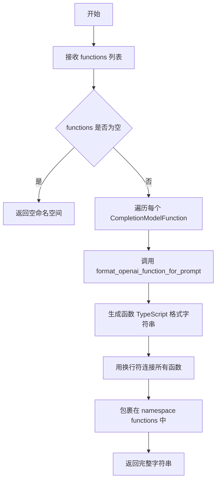

#### 带注释源码

```python
def format_function_specs_as_typescript_ns(
    functions: list[CompletionModelFunction],
) -> str:
    """Returns a function signature block in the format used by OpenAI internally:
    https://community.openai.com/t/how-to-calculate-the-tokens-when-using-function-call/266573/18

    For use with `count_tokens` to determine token usage of provided functions.

    Example:
    ```ts
    namespace functions {

    // Get the current weather in a given location
    type get_current_weather = (_: {
    // The city and state, e.g. San Francisco, CA
    location: string,
    unit?: "celsius" | "fahrenheit",
    }) => any;

    } // namespace functions
    ```
    """
    # 1. 构建命名空间开头
    # 2. 遍历 functions 列表，对每个函数调用 format_openai_function_for_prompt 进行格式化
    # 3. 用 "\n\n" 连接所有格式化后的函数定义
    # 4. 添加命名空间结尾
    return (
        "namespace functions {\n\n"
        + "\n\n".join(format_openai_function_for_prompt(f) for f in functions)
        + "\n\n} // namespace functions"
    )
```


### `format_openai_function_for_prompt`

该函数将 `CompletionModelFunction` 对象格式化为 TypeScript 风格的函数签名字符串，用于计算 OpenAI 函数调用所需的 token 数量。

参数：

- `func`：`CompletionModelFunction`，需要格式化的函数模型对象，包含函数名称、描述和参数信息

返回值：`str`，返回格式化后的 TypeScript 类型定义字符串

#### 流程图

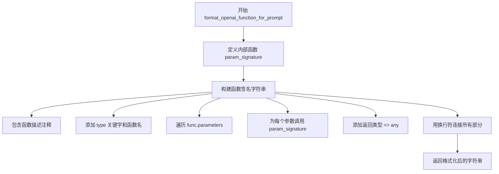

#### 带注释源码

```python
def format_openai_function_for_prompt(func: CompletionModelFunction) -> str:
    """Returns the function formatted similarly to the way OpenAI does it internally:
    https://community.openai.com/t/how-to-calculate-the-tokens-when-using-function-call/266573/18

    Example:
    ```ts
    // Get the current weather in a given location
    type get_current_weather = (_: {
    // The city and state, e.g. San Francisco, CA
    location: string,
    unit?: "celsius" | "fahrenheit",
    }) => any;
    ```
    """
    # 定义内部函数，用于生成参数的 TypeScript 类型签名
    def param_signature(name: str, spec: JSONSchema) -> str:
        # 如果参数有描述，则添加 TypeScript 注释
        return (
            f"// {spec.description}\n" if spec.description else ""
        ) + f"{name}{'' if spec.required else '?'}: {spec.typescript_type},"
        # 参数格式: name?: type, (可选参数) 或 name: type, (必选参数)

    # 使用换行符连接各个部分构建最终的 TypeScript 类型定义
    return "\n".join(
        [
            f"// {func.description}",  # 函数描述作为注释
            f"type {func.name} = (_ :{{",  # TypeScript 类型声明开始
            *[param_signature(name, p) for name, p in func.parameters.items()],  # 展开所有参数签名
            "}) => any;",  # 函数返回类型为 any
        ]
    )
```


### `count_openai_functions_tokens`

该函数用于计算一组函数定义（Function Definitions）所占用的 token 数量。它通过将函数列表格式化为 TypeScript 命名空间格式，然后调用传入的 token 计数回调函数来获取总 token 数。

参数：

- `functions`：`list[CompletionModelFunction]`，要计算 token 数量的函数定义列表
- `count_tokens`：`Callable[[str], int]`，用于计算字符串 token 数量的回调函数

返回值：`int`，函数定义所占用的总 token 数量

#### 流程图

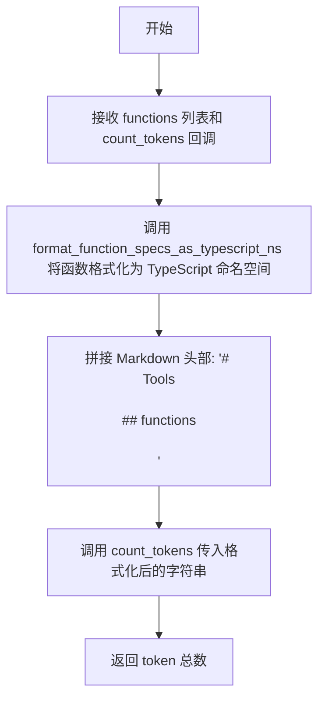

#### 带注释源码

```python
def count_openai_functions_tokens(
    functions: list[CompletionModelFunction],  # 函数定义列表
    count_tokens: Callable[[str], int]           # token计数回调函数
) -> int:
    """Returns the number of tokens taken up by a set of function definitions

    Reference: https://community.openai.com/t/how-to-calculate-the-tokens-when-using-function-call/266573/18  # noqa: E501
    """
    # 格式化函数定义为 TypeScript 命名空间格式，并拼接 Markdown 头部
    # 形成类似: "# Tools\n\n## functions\n\nnamespace functions {...}"
    return count_tokens(
        "# Tools\n\n"
        "## functions\n\n"
        f"{format_function_specs_as_typescript_ns(functions)}"
    )
```


### `_functions_compat_fix_kwargs`

该函数用于在不支持 function_call API 的旧版 OpenAI 模型上启用函数调用功能，通过将函数定义转换为 TypeScript 格式的提示文本，并构建相应的 JSON Schema 说明，然后将这些信息作为系统消息追加到对话列表中，从而实现向后兼容。

参数：

- `functions`：`list[CompletionModelFunction]`，要暴露给模型的函数定义列表
- `prompt_messages`：`list[ChatMessage]`，对话消息列表，函数调用说明会被追加到此列表末尾

返回值：`None`，该函数直接修改 `prompt_messages` 列表，无返回值

#### 流程图

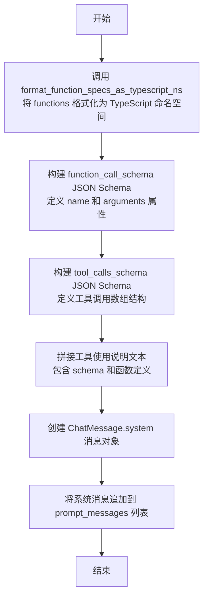

#### 带注释源码

```python
def _functions_compat_fix_kwargs(
    functions: list[CompletionModelFunction],
    prompt_messages: list[ChatMessage],
):
    """在旧版 OpenAI 模型上启用函数调用兼容性处理.

    此函数用于处理不支持 function_call API 的旧版模型（如 gpt-3.5-turbo-0301），
    通过将函数定义转换为提示文本并添加到消息列表中，引导模型通过文本响应
    方式返回结构化的工具调用信息。

    Args:
        functions: 函数定义列表，每个元素包含函数名称、描述和参数规范
        prompt_messages: 对话消息列表，函数调用说明会被追加到此列表末尾

    Returns:
        None: 直接修改 prompt_messages 列表，无返回值
    """
    # Step 1: 将函数列表格式化为 TypeScript 命名空间格式字符串
    # 用于向模型说明可用的函数及其参数结构
    function_definitions = format_function_specs_as_typescript_ns(functions)

    # Step 2: 构建 function_call_schema JSON Schema
    # 定义函数调用的结构，包含函数名和参数
    function_call_schema = JSONSchema(
        type=JSONSchema.Type.OBJECT,
        properties={
            "name": JSONSchema(
                description="The name of the function to call",
                enum=[f.name for f in functions],  # 枚举所有可用函数名
                required=True,
            ),
            "arguments": JSONSchema(
                description="The arguments for the function call",
                type=JSONSchema.Type.OBJECT,
                required=True,
            ),
        },
    )

    # Step 3: 构建 tool_calls_schema JSON Schema
    # 定义工具调用数组的外层结构
    tool_calls_schema = JSONSchema(
        type=JSONSchema.Type.ARRAY,
        items=JSONSchema(
            type=JSONSchema.Type.OBJECT,
            properties={
                "type": JSONSchema(
                    type=JSONSchema.Type.STRING,
                    enum=["function"],
                ),
                "function": function_call_schema,  # 嵌套函数调用结构
            },
        ),
    )

    # Step 4: 将工具使用说明作为系统消息追加到 prompt_messages
    # 告诉模型如何通过文本块格式返回工具调用
    prompt_messages.append(
        ChatMessage.system(
            "# tool usage instructions\n\n"
            "Specify a '```tool_calls' block in your response,"
            " with a valid JSON object that adheres to the following schema:\n\n"
            f"{tool_calls_schema.to_dict()}\n\n"
            "Specify any tools that you need to use through this JSON object.\n\n"
            "Put the tool_calls block at the end of your response"
            " and include its fences if it is not the only content.\n\n"
            "## functions\n\n"
            "For the function call itself, use one of the following"
            f" functions:\n\n{function_definitions}"
        ),
    )
```


### `_tool_calls_compat_extract_calls`

从 OpenAI 响应内容中提取工具调用，支持两种格式：JSON 数组格式和 Markdown 代码块格式（`tool_calls`）。

参数：

-  `response`：`str`，OpenAI 聊天补全响应内容，可能包含 JSON 数组或 Markdown 代码块封装的工具调用

返回值：`Iterator[AssistantToolCall]`，生成提取后的 AssistantToolCall 对象迭代器

#### 流程图

```mermaid
flowchart TD
    A[接收 response 字符串] --> B{response[0] == '['?}
    B -->|Yes| C[直接使用 json_loads 解析 response]
    B -->|No| D[使用正则表达式搜索 ```tool_calls 代码块]
    D --> E{找到代码块?}
    E -->|No| F[抛出 ValueError: 无法找到 tool_calls 块]
    E -->|Yes| G[提取代码块内容并使用 json_loads 解析]
    C --> H[遍历 tool_calls 列表]
    G --> H
    H --> I[为每个工具调用生成 UUID]
    I --> J[使用 model_validate 验证并转换为 AssistantToolCall]
    J --> K[yield 返回 AssistantToolCall]
    K --> H
```

#### 带注释源码

```python
def _tool_calls_compat_extract_calls(response: str) -> Iterator[AssistantToolCall]:
    """从 OpenAI 响应中提取工具调用
    
    支持两种格式:
    1. JSON 数组格式: '[{"name": "func", "arguments": {...}}, ...]'
    2. Markdown 代码块格式: '```tool_calls\n[...]\n```'
    
    Args:
        response: OpenAI 聊天补全响应内容
        
    Returns:
        Iterator[AssistantToolCall]: 提取的工具调用迭代器
        
    Raises:
        ValueError: 无法在响应中找到 tool_calls 块
    """
    import re
    import uuid

    # 记录调试日志
    logging.debug(f"Trying to extract tool calls from response:\n{response}")

    # 方式一：响应本身就是 JSON 数组格式
    if response[0] == "[":
        tool_calls: list[AssistantToolCallDict] = json_loads(response)
    else:
        # 方式二：从 Markdown 代码块中提取
        # 支持 ```tool_calls 和 ``` 两种写法
        block = re.search(r"```(?:tool_calls)?\n(.*)\n```\s*$", response, re.DOTALL)
        if not block:
            raise ValueError("Could not find tool_calls block in response")
        tool_calls: list[AssistantToolCallDict] = json_loads(block.group(1))

    # 遍历解析出的工具调用字典列表
    for t in tool_calls:
        # 为每个工具调用生成唯一 ID
        t["id"] = str(uuid.uuid4())
        # 使用 Pydantic 模型验证并转换为 AssistantToolCall 对象
        yield AssistantToolCall.model_validate(t)
```


### `OpenAICredentials.get_api_access_kwargs`

该方法用于获取 OpenAI API 访问所需的参数，构建一个包含 API 密钥、基础 URL、组织 ID、API 版本等认证信息的字典，并在使用 Azure API 时额外添加 Azure 端点信息。

参数：该方法无显式参数（仅包含隐式的 `self` 参数）

返回值：`dict[str, str]`，返回包含 OpenAI API 访问所需的关键字参数字典，用于初始化 OpenAI 客户端

#### 流程图

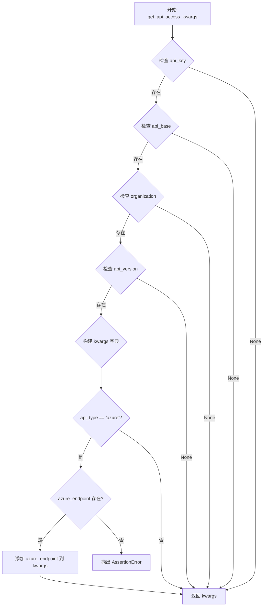

#### 带注释源码

```python
def get_api_access_kwargs(self) -> dict[str, str]:
    """获取 OpenAI API 访问所需的关键字参数
    
    Returns:
        dict[str, str]: 包含 API 访问参数的字典，可直接用于初始化 OpenAI 客户端
    """
    # 构建基础参数字典，使用字典推导式过滤掉 None 值
    # 将 SecretStr 转换为普通字符串
    kwargs = {
        k: v.get_secret_value()  # SecretStr 的 get_secret_value() 方法用于获取明文
        for k, v in {
            "api_key": self.api_key,           # API 密钥（必填）
            "base_url": self.api_base,         # API 基础 URL（可选）
            "organization": self.organization, # 组织 ID（可选）
            "api_version": self.api_version,  # API 版本（可选）
        }.items()
        if v is not None  # 只包含非 None 的值
    }
    
    # 如果使用 Azure API，额外添加 Azure 端点
    if self.api_type == SecretStr("azure"):
        # 断言 azure_endpoint 已配置，否则抛出 AssertionError
        assert self.azure_endpoint, "Azure endpoint not configured"
        kwargs["azure_endpoint"] = self.azure_endpoint.get_secret_value()
    
    return kwargs
```

#### 关键字段信息

| 字段名 | 类型 | 描述 |
|--------|------|------|
| `api_key` | `SecretStr` | OpenAI API 密钥，从环境变量 `OPENAI_API_KEY` 获取 |
| `api_base` | `Optional[SecretStr]` | API 基础 URL，从环境变量 `OPENAI_API_BASE_URL` 获取 |
| `organization` | `Optional[SecretStr]` | 组织 ID，从环境变量 `OPENAI_ORGANIZATION` 获取 |
| `api_type` | `Optional[SecretStr]` | API 类型（azure 或 openai），从环境变量 `OPENAI_API_TYPE` 或 `USE_AZURE` 获取 |
| `api_version` | `Optional[SecretStr]` | API 版本，从环境变量 `OPENAI_API_VERSION` 获取 |
| `azure_endpoint` | `Optional[SecretStr]` | Azure 端点 URL |
| `azure_model_to_deploy_id_map` | `Optional[dict[str, str]]` | Azure 模型到部署 ID 的映射字典 |

#### 潜在技术债务与优化空间

1. **硬编码的 Azure 标识比较**：使用 `SecretStr("azure")` 进行比较不够优雅，应考虑使用枚举或常量
2. **断言用于业务逻辑**：使用 `assert` 处理配置缺失不够合适，应改为显式的参数验证并抛出自定义异常
3. **魔法字符串**：Azure 相关字符串散布在代码中，应提取为常量
4. **类型提示可以更精确**：返回值类型 `dict[str, str]` 可以使用 TypedDict 提供更精确的类型定义


### `OpenAICredentials.get_model_access_kwargs`

该方法用于获取调用 OpenAI API 所需的模型访问参数。它接收一个模型名称作为输入，返回一个包含模型参数的字典。如果配置为 Azure 模式，还会将模型名称映射到 Azure 部署 ID。

参数：

- `model`：`str`，要访问的模型名称

返回值：`dict[str, str]`，包含模型访问参数的字典

#### 流程图

```mermaid
flowchart TD
    A[开始 get_model_access_kwargs] --> B[创建 kwargs 字典<br/>kwargs = {'model': model}]
    B --> C{api_type 是否为<br/>'azure' 且 model 存在?}
    C -->|是| D[调用 _get_azure_access_kwargs<br/>获取 Azure 特定参数]
    C -->|否| F[返回 kwargs]
    D --> E[将 Azure 参数更新到 kwargs]
    E --> F
    F[结束]
    
    style D fill:#f9f,stroke:#333
    style E fill:#f9f,stroke:#333
```

#### 带注释源码

```python
def get_model_access_kwargs(self, model: str) -> dict[str, str]:
    """获取模型访问所需的 kwargs 参数
    
    该方法构建调用 OpenAI API 所需的基础参数。对于 Azure 部署，
    会将模型名称映射到对应的部署 ID。
    
    参数:
        model: 模型名称，如 'gpt-4' 或 'gpt-4-turbo'
        
    返回:
        包含 'model' 键的字典，如果是 Azure 部署则包含部署 ID
    """
    # 初始化 kwargs，包含基础模型参数
    kwargs = {"model": model}
    
    # 检查是否为 Azure 模式且模型名称有效
    if self.api_type == SecretStr("azure") and model:
        # 获取 Azure 特定的访问参数（包括部署 ID 映射）
        azure_kwargs = self._get_azure_access_kwargs(model)
        # 将 Azure 参数合并到主 kwargs 中
        kwargs.update(azure_kwargs)
    
    # 返回最终参数字典
    return kwargs


def _get_azure_access_kwargs(self, model: str) -> dict[str, str]:
    """获取 Azure API 的访问参数
    
    将模型名称映射到 Azure 部署 ID。
    
    参数:
        model: 模型名称
        
    返回:
        包含 Azure 部署 ID 的字典
        
    异常:
        ValueError: 当 Azure 部署映射未配置或模型不存在于映射中时
    """
    # 验证 Azure 模型部署映射已配置
    if not self.azure_model_to_deploy_id_map:
        raise ValueError("Azure model deployment map not configured")

    # 验证请求的模型是否有对应的部署 ID
    if model not in self.azure_model_to_deploy_id_map:
        raise ValueError(f"No Azure deployment ID configured for model '{model}'")
    
    # 获取模型的部署 ID
    deployment_id = self.azure_model_to_deploy_id_map[model]

    # 返回包含部署 ID 的字典（覆盖原模型名称）
    return {"model": deployment_id}
```


### `OpenAICredentials.load_azure_config`

从 YAML 配置文件加载 Azure OpenAI 相关的配置信息，包括 API 类型、版本、端点以及模型到部署 ID 的映射关系，并将其存储到实例属性中。

参数：

- `config_file`：`Path`，YAML 配置文件的路径

返回值：`None`，无返回值，该方法直接修改实例的内部属性

#### 流程图

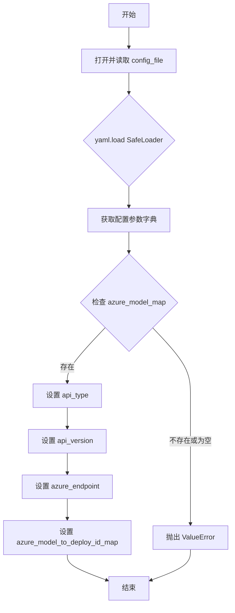

#### 带注释源码

```python
def load_azure_config(self, config_file: Path) -> None:
    """从 YAML 文件加载 Azure 配置并设置到当前实例属性
    
    Args:
        config_file: 指向包含 Azure 配置的 YAML 文件路径
                    应包含 azure_model_map 等关键配置项
        
    Raises:
        ValueError: 当 azure_model_map 为空或不存在时抛出
        
    Returns:
        None: 直接修改实例属性，无返回值
    """
    # 使用 SafeLoader 安全加载 YAML 配置文件
    with open(config_file) as file:
        config_params = yaml.load(file, Loader=yaml.SafeLoader) or {}

    try:
        # 确保 azure_model_map 存在且不为空，这是必需的映射配置
        assert config_params.get(
            "azure_model_map", {}
        ), "Azure model->deployment_id map is empty"
    except AssertionError as e:
        # 将断言错误转换为更明确的 ValueError
        raise ValueError(*e.args)

    # 从配置中提取并设置各项 Azure 相关配置
    self.api_type = config_params.get("azure_api_type", "azure")  # 默认为 "azure"
    self.api_version = config_params.get("azure_api_version", None)  # 可选的 API 版本
    self.azure_endpoint = config_params.get("azure_endpoint")  # Azure 端点 URL
    self.azure_model_to_deploy_id_map = config_params.get("azure_model_map")  # 模型到部署ID的映射
```


### `OpenAICredentials._get_azure_access_kwargs`

该方法用于获取 Azure API 调用所需的 kwargs 参数，主要是将模型名称映射到 Azure 部署 ID。当使用 Azure OpenAI API 时，需要将请求的模型名称转换为对应的 Azure 部署标识。

参数：

- `model`：`str`，需要获取 Azure 部署 ID 的模型名称

返回值：`dict[str, str]`，包含 Azure API 调用所需的 model 参数（值为部署 ID）

#### 流程图

```mermaid
flowchart TD
    A[开始 _get_azure_access_kwargs] --> B{self.azure_model_to_deploy_id_map 是否存在}
    B -- 否 --> C[抛出 ValueError: Azure model deployment map not configured]
    B -- 是 --> D{model 是否在 azure_model_to_deploy_id_map 中}
    D -- 否 --> E[抛出 ValueError: No Azure deployment ID configured for model]
    D -- 是 --> F[从映射中获取 deployment_id]
    F --> G[返回 {'model': deployment_id}]
    C --> H[结束]
    E --> H
    G --> H
```

#### 带注释源码

```python
def _get_azure_access_kwargs(self, model: str) -> dict[str, str]:
    """Get the kwargs for the Azure API."""

    # 检查 azure_model_to_deploy_id_map 是否已配置
    if not self.azure_model_to_deploy_id_map:
        raise ValueError("Azure model deployment map not configured")

    # 检查请求的模型是否在部署映射中
    if model not in self.azure_model_to_deploy_id_map:
        raise ValueError(f"No Azure deployment ID configured for model '{model}'")
    
    # 获取模型对应的 Azure 部署 ID
    deployment_id = self.azure_model_to_deploy_id_map[model]

    # 返回包含部署 ID 的字典，用于 API 调用
    return {"model": deployment_id}
```


### `OpenAIProvider.__init__`

该方法是 `OpenAIProvider` 类的构造函数，负责初始化 OpenAI 提供商实例。它首先调用父类构造函数，然后根据凭证中的 API 类型（Azure 或标准 OpenAI）创建相应的异步客户端。

参数：

-  `settings`：`Optional[OpenAISettings]` 可选的设置参数，用于配置 OpenAI 提供商的行为。如果为 `None`，则使用默认设置。
-  `logger`：`Optional[logging.Logger]` 可选的日志记录器，用于输出日志信息。如果为 `None`，则使用默认日志记录器。

返回值：`None`，该方法没有返回值，仅用于初始化对象状态。

#### 流程图

```mermaid
flowchart TD
    A[开始 __init__] --> B[调用父类构造函数 super().__init__]
    B --> C{检查 _credentials.api_type == 'azure'}
    C -->|是| D[导入 AsyncAzureOpenAI]
    C -->|否| E[导入 AsyncOpenAI]
    D --> F[使用 get_api_access_kwargs 创建 AsyncAzureOpenAI 客户端]
    E --> G[使用 get_api_access_kwargs 创建 AsyncOpenAI 客户端]
    F --> H[赋值 self._client]
    G --> H
    H --> I[结束 __init__]
```

#### 带注释源码

```python
def __init__(
    self,
    settings: Optional[OpenAISettings] = None,
    logger: Optional[logging.Logger] = None,
):
    """初始化 OpenAIProvider 实例
    
    Args:
        settings: OpenAI 提供商的配置设置，包含凭证、预算等信息
        logger: 日志记录器，用于输出调试和运行时日志
    """
    # 调用父类 BaseOpenAIChatProvider 和 BaseOpenAIEmbeddingProvider 的初始化方法
    # 设置 settings、logger 以及初始化 _settings、_configuration、_credentials、_budget 等属性
    super(OpenAIProvider, self).__init__(settings=settings, logger=logger)

    # 检查凭证中的 API 类型是否为 Azure
    if self._credentials.api_type == SecretStr("azure"):
        # 如果是 Azure API，则导入 Azure 专用的异步客户端
        from openai import AsyncAzureOpenAI

        # API key 和 organization（如果已配置）会被传递，
        # 其他必需的凭据由 AzureOpenAI 客户端从环境变量加载
        # 使用凭据的 get_api_access_kwargs 方法获取访问参数并创建客户端
        self._client = AsyncAzureOpenAI(
            **self._credentials.get_api_access_kwargs()  # type: ignore
        )
    else:
        # 如果是标准 OpenAI API，则导入普通的异步客户端
        from openai import AsyncOpenAI

        # 使用凭据的 get_api_access_kwargs 方法获取访问参数并创建客户端
        self._client = AsyncOpenAI(
            **self._credentials.get_api_access_kwargs()  # type: ignore
        )
```


### `OpenAIProvider.get_tokenizer`

该方法根据传入的 OpenAI 模型名称返回对应的 tiktoken 编码器，用于对文本进行 token 化处理，是文本分词和 token 计数功能的基础。

参数：

- `model_name`：`OpenAIModelName`，OpenAI 模型的枚举值，指定要获取 tokenizer 的目标模型

返回值：`ModelTokenizer[int]`，返回对应模型的 tiktoken 编码器实例，可用于文本编码和解码操作

#### 流程图

```mermaid
flowchart TD
    A[开始: get_tokenizer] --> B[输入: model_name OpenAIModelName]
    B --> C{调用 tiktoken.encoding_for_model}
    C --> D[返回 ModelTokenizer[int]]
    D --> E[结束]
    
    style A fill:#e1f5fe
    style C fill:#fff3e0
    style D fill:#e8f5e9
```

#### 带注释源码

```python
def get_tokenizer(self, model_name: OpenAIModelName) -> ModelTokenizer[int]:
    """获取指定模型的 tiktoken 编码器
    
    Args:
        model_name: OpenAI 模型名称枚举值，如 gpt-4, gpt-3.5-turbo 等
        
    Returns:
        ModelTokenizer[int]: 对应模型的 tiktoken 编码器，可用于 encode/decode 操作
    """
    # 使用 tiktoken 库根据模型名称获取对应的编码器
    # tiktoken 是 OpenAI 官方推荐的 BPE 分词器
    return tiktoken.encoding_for_model(model_name)
```

#### 补充说明

- **依赖**: 该方法依赖 `tiktoken` 库，这是 OpenAI 官方提供的 Python 分词器库
- **异常**: 如果传入的 `model_name` 不被 tiktoken 支持，可能会抛出异常
- **用途**: 主要被 `count_message_tokens` 等方法调用，用于计算消息的 token 数量
- **设计考量**: 该方法是一个同步包装器，直接调用 `tiktoken.encoding_for_model`，每次调用都会创建新的编码器实例，如果需要频繁调用，可以考虑缓存编码器实例以提升性能


### `OpenAIProvider.count_message_tokens`

该方法用于计算给定消息列表在特定 OpenAI 模型下的 token 数量，基于 OpenAI 官方的 token 计算规则对聊天消息进行 token 计数。

参数：

- `messages`：`ChatMessage | list[ChatMessage]`，要计算 token 的单条消息或消息列表
- `model_name`：`OpenAIModelName`，OpenAI 模型名称，用于确定 token 计算规则和选择 tokenizer

返回值：`int`，消息列表的总 token 数量

#### 流程图

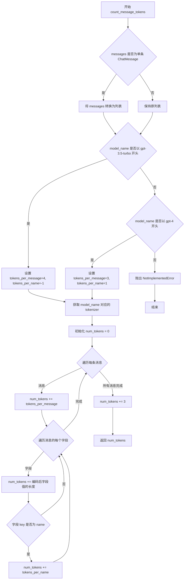

#### 带注释源码

```python
def count_message_tokens(
    self,
    messages: ChatMessage | list[ChatMessage],
    model_name: OpenAIModelName,
) -> int:
    """Calculate the number of tokens for a list of chat messages.
    
    Args:
        messages: A single ChatMessage or a list of ChatMessages to count tokens for.
        model_name: The OpenAI model name to use for token counting.
        
    Returns:
        int: The total number of tokens for the messages.
    """
    # 如果是单条消息，转换为列表以便统一处理
    if isinstance(messages, ChatMessage):
        messages = [messages]

    # 根据模型类型确定每条消息的基础 token 数和名称 token 数
    # GPT-3.5 Turbo 使用不同的 token 计算规则
    if model_name.startswith("gpt-3.5-turbo"):
        tokens_per_message = (
            4  # 每条消息遵循 <|start|>{role/name}\n{content}<|end|>\n 格式
        )
        tokens_per_name = -1  # 如果存在 name 字段，则省略 role
    # TODO: 检查 gpt-4o 是否仍然适用此规则
    elif model_name.startswith("gpt-4"):
        tokens_per_message = 3
        tokens_per_name = 1
    else:
        # 不支持的模型抛出异常
        raise NotImplementedError(
            f"count_message_tokens() is not implemented for model {model_name}.\n"
            "See https://github.com/openai/openai-python/blob/120d225b91a8453e15240a49fb1c6794d8119326/chatml.md "  # noqa
            "for information on how messages are converted to tokens."
        )
    
    # 获取对应模型的 tiktoken tokenizer
    tokenizer = self.get_tokenizer(model_name)

    num_tokens = 0
    # 遍历每条消息计算 token
    for message in messages:
        # 每条消息的基础 token 数
        num_tokens += tokens_per_message
        # 遍历消息的所有字段（role, content, name 等）
        for key, value in message.model_dump().items():
            # 将字段值编码为 token 并累加
            num_tokens += len(tokenizer.encode(value))
            # 如果字段名为 name，需要额外加上 tokens_per_name
            if key == "name":
                num_tokens += tokens_per_name
    
    # 每条回复都以 <|start|>assistant<|message|> 结尾，需要额外 3 个 token
    num_tokens += 3
    return num_tokens
```


### `OpenAIProvider._get_chat_completion_args`

该方法负责准备 OpenAI 聊天补全 API 调用的参数，包括处理消息、模型参数、函数调用兼容性问题以及凭证配置。它首先检查是否需要对旧模型进行函数调用兼容性处理，然后调用父类方法获取基础参数，最后合并模型访问凭证并返回完整的参数元组。

**参数：**

- `prompt_messages`：`list[ChatMessage]`，聊天消息列表，作为提示输入
- `model`：`OpenAIModelName`，要使用的 OpenAI 模型名称
- `functions`：`Optional[list[CompletionModelFunction]]`，可供 LLM 调用的函数列表
- `max_output_tokens`：`Optional[int]`，生成的最大令牌数限制
- `**kwargs`：`dict[str, Any]`，其他可选关键字参数

**返回值：** `tuple[list[ChatCompletionMessageParam], CompletionCreateParams, dict[str, Any]]`

- `list[ChatCompletionMessageParam]`：用于 OpenAI API 调用的提示消息
- `CompletionCreateParams`：用于 OpenAI 调用的其他参数映射
- `dict[str, Any]`：传递给补全解析器的关键字参数

#### 流程图

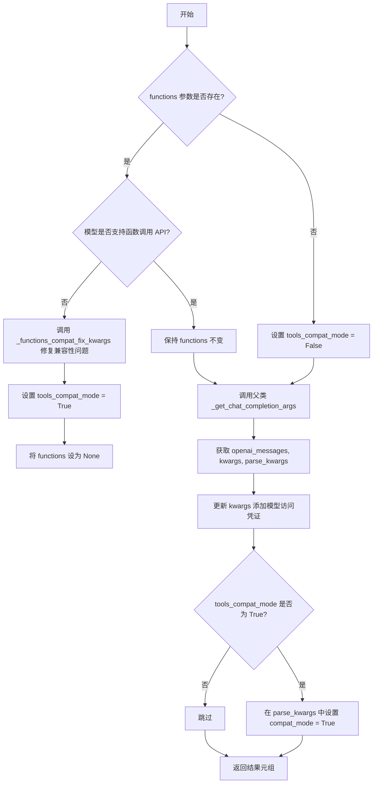

#### 带注释源码

```python
def _get_chat_completion_args(
    self,
    prompt_messages: list[ChatMessage],
    model: OpenAIModelName,
    functions: Optional[list[CompletionModelFunction]] = None,
    max_output_tokens: Optional[int] = None,
    **kwargs,
) -> tuple[
    list[ChatCompletionMessageParam], CompletionCreateParams, dict[str, Any]
]:
    """Prepare keyword arguments for an OpenAI chat completion call

    Args:
        prompt_messages: List of ChatMessages
        model: The model to use
        functions (optional): List of functions available to the LLM
        max_output_tokens (optional): Maximum number of tokens to generate

    Returns:
        list[ChatCompletionMessageParam]: Prompt messages for the OpenAI call
        CompletionCreateParams: Mapping of other kwargs for the OpenAI call
        Mapping[str, Any]: Any keyword arguments to pass on to the completion parser
    """
    # 初始化兼容模式标志为 False
    tools_compat_mode = False
    
    # 如果提供了函数定义，则检查模型是否支持函数调用 API
    if functions:
        # 检查当前模型是否具有函数调用 API 支持
        if not OPEN_AI_CHAT_MODELS[model].has_function_call_api:
            # 对于不支持函数调用的旧模型，提供兼容性处理
            # 将函数定义格式化为提示消息追加到 prompt_messages 中
            _functions_compat_fix_kwargs(functions, prompt_messages)
            # 启用兼容模式，标记需要特殊处理
            tools_compat_mode = True
            # 在兼容模式下，将 functions 设为 None，因为已转换为提示文本
            functions = None

    # 调用父类方法获取基础的聊天补全参数
    # 返回：(消息列表, kwargs 参数字典, 解析器参数字典)
    openai_messages, kwargs, parse_kwargs = super()._get_chat_completion_args(
        prompt_messages=prompt_messages,
        model=model,
        functions=functions,
        max_output_tokens=max_output_tokens,
        **kwargs,
    )
    
    # 使用凭证对象获取模型特定的访问参数（如 Azure 部署 ID）
    # 并将其合并到 kwargs 中
    kwargs.update(self._credentials.get_model_access_kwargs(model))  # type: ignore

    # 如果启用了工具兼容模式，在解析器参数中标记 compat_mode
    # 以便后续解析工具调用时使用兼容模式处理
    if tools_compat_mode:
        parse_kwargs["compat_mode"] = True

    # 返回三个元素：消息列表、API 参数、解析器参数
    return openai_messages, kwargs, parse_kwargs
```


### `OpenAIProvider._parse_assistant_tool_calls`

解析助手消息中的工具调用，支持普通模式和兼容模式两种处理方式。当启用兼容模式时，该方法会尝试从消息内容中提取工具调用块；当禁用兼容模式时，则委托给父类方法处理。

参数：

- `self`：隐式参数，`OpenAIProvider` 实例本身
- `assistant_message`：`ChatCompletionMessage`，来自 OpenAI 的聊天完成消息对象，可能包含工具调用信息
- `compat_mode`：`bool`，默认为 `False`，是否启用兼容模式以支持旧版模型
- `**kwargs`：可变关键字参数，用于传递给父类方法或兼容模式提取器

返回值：`tuple[list[AssistantToolCall], list[Exception]]`，返回元组包含解析出的工具调用列表和解析过程中产生的异常列表

#### 流程图

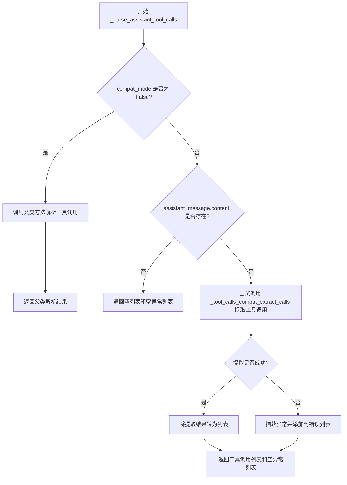

#### 带注释源码

```python
def _parse_assistant_tool_calls(
    self,
    assistant_message: ChatCompletionMessage,
    compat_mode: bool = False,
    **kwargs,
) -> tuple[list[AssistantToolCall], list[Exception]]:
    """解析助手消息中的工具调用
    
    Args:
        assistant_message: OpenAI 返回的聊天完成消息
        compat_mode: 兼容模式标志，用于处理不支持 function_call API 的旧模型
        **kwargs: 传递给父类方法的额外参数
    
    Returns:
        tuple: (工具调用列表, 解析错误列表)
    """
    # 初始化返回值容器
    tool_calls: list[AssistantToolCall] = []
    parse_errors: list[Exception] = []

    # 判断处理模式：标准模式或兼容模式
    if not compat_mode:
        # 标准模式：委托给父类方法处理
        return super()._parse_assistant_tool_calls(
            assistant_message=assistant_message, compat_mode=compat_mode, **kwargs
        )
    elif assistant_message.content:
        # 兼容模式：从消息内容中提取工具调用
        try:
            # 调用兼容提取器从响应内容中解析工具调用
            tool_calls = list(
                _tool_calls_compat_extract_calls(assistant_message.content)
            )
        except Exception as e:
            # 捕获解析过程中的异常并记录
            parse_errors.append(e)

    # 返回解析结果：工具调用列表和错误列表
    return tool_calls, parse_errors
```


### `OpenAIProvider._get_embedding_kwargs`

该方法用于获取 OpenAI Embedding API 调用所需的关键字参数。它首先调用父类方法获取基础参数，然后使用凭证信息更新模型访问参数（如 API 部署 ID 等）。

参数：

- `input`：`str | list[str]`，待嵌入的输入文本或文本列表
- `model`：`OpenAIModelName`，使用的 OpenAI Embedding 模型名称
- `**kwargs`：`Any`，其他可选的关键字参数

返回值：`EmbeddingCreateParams`，包含完整的 Embedding API 请求参数

#### 流程图

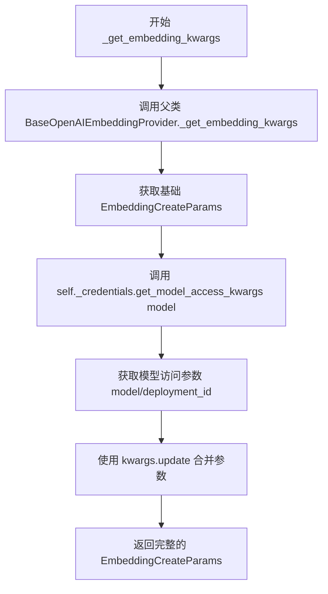

#### 带注释源码

```python
def _get_embedding_kwargs(
    self, input: str | list[str], model: OpenAIModelName, **kwargs
) -> EmbeddingCreateParams:
    """获取 OpenAI Embedding API 调用参数
    
    Args:
        input: 待嵌入的文本或文本列表
        model: OpenAI Embedding 模型名称
        **kwargs: 其他可选参数
    
    Returns:
        EmbeddingCreateParams: 完整的 API 请求参数
    """
    # 第一步：调用父类方法获取基础参数
    kwargs = super()._get_embedding_kwargs(input=input, model=model, **kwargs)
    
    # 第二步：获取模型访问相关参数（处理 Azure 部署等）
    # 例如：Azure 会返回 deployment_id 替代 model 名称
    kwargs.update(self._credentials.get_model_access_kwargs(model))  # type: ignore
    
    # 返回合并后的完整参数
    return kwargs
```


### `OpenAIProvider._retry_api_request`

该方法是一个装饰器工厂函数，用于为 API 请求添加重试逻辑。它接受一个可调用对象（函数）作为输入，通过 `tenacity` 库为其添加自动重试能力，专门处理速率限制错误（RateLimitError）和 502 错误，并支持可配置的重试次数和指数退避策略。

参数：

- `func`：`Callable[_P, _T]`，需要添加重试逻辑的目标函数

返回值：`Callable[_P, _T]`，包装了重试逻辑的函数

#### 流程图

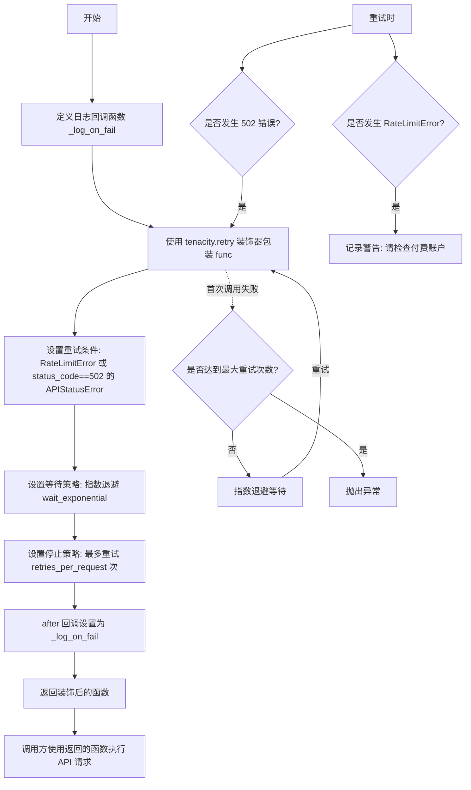

#### 带注释源码

```python
def _retry_api_request(self, func: Callable[_P, _T]) -> Callable[_P, _T]:
    """为 API 请求添加重试逻辑的装饰器工厂方法
    
    使用 tenacity 库实现重试机制，专门处理以下情况：
    1. RateLimitError (速率限制错误)
    2. APIStatusError 且状态码为 502 (Bad Gateway)
    
    Args:
        func: 需要添加重试逻辑的可调用对象（通常是异步 API 调用函数）
    
    Returns:
        包装了重试逻辑的函数，保留原函数的参数签名
    """
    # 创建日志回调函数，在每次重试后记录日志
    _log_retry_debug_message = tenacity.after_log(self._logger, logging.DEBUG)

    def _log_on_fail(retry_state: tenacity.RetryCallState) -> None:
        """重试失败时的回调函数
        
        Args:
            retry_state: tenacity 的重试状态对象，包含尝试次数、异常等信息
        """
        # 首先记录重试调试信息
        _log_retry_debug_message(retry_state)

        # 如果是第一次尝试且遇到速率限制错误，发出警告提示用户检查账户
        if (
            retry_state.attempt_number == 0
            and retry_state.outcome
            and isinstance(retry_state.outcome.exception(), RateLimitError)
        ):
            self._logger.warning(
                "Please double check that you have setup a PAID OpenAI API Account."
                " You can read more here: "
                "https://docs.agpt.co/setup/#getting-an-openai-api-key"
            )

    # 使用 tenacity.retry 装饰器包装目标函数
    return tenacity.retry(
        # 重试条件：RateLimitError 或 status_code==502 的 APIStatusError
        retry=(
            tenacity.retry_if_exception_type(RateLimitError)
            | tenacity.retry_if_exception(
                lambda e: isinstance(e, APIStatusError) and e.status_code == 502
            )
        ),
        # 等待策略：指数退避（每次重试等待时间翻倍）
        wait=tenacity.wait_exponential(),
        # 停止策略：根据配置的最大重试次数停止
        stop=tenacity.stop_after_attempt(self._configuration.retries_per_request),
        # 每次重试后执行的回调函数
        after=_log_on_fail,
    )(func)
```


### `OpenAIProvider.__repr__`

返回该对象的字符串表示形式，用于调试和日志输出。

参数： 无

返回值：`str`，返回该对象的字符串表示形式，格式为 "OpenAIProvider()"

#### 流程图

```mermaid
flowchart TD
    A[开始 __repr__] --> B[返回字符串 "OpenAIProvider()"]
    B --> C[结束]
```

#### 带注释源码

```python
def __repr__(self):
    """返回该对象的字符串表示形式
    
    Returns:
        str: 返回该对象的简洁字符串表示，用于调试和日志输出
    """
    return "OpenAIProvider()"
```

## 关键组件


### OpenAIModelName 枚举

定义所有支持的 OpenAI 模型名称，包括 GPT-3.5、GPT-4 系列以及 embedding 模型

### OPEN_AI_CHAT_MODELS / OPEN_AI_EMBEDDING_MODELS

存储模型元信息（名称、提供商、token费用、上下文长度、功能支持等）的字典

### OpenAICredentials

管理 OpenAI API 凭证的类，支持从环境变量加载，封装 API 密钥、组织、Azure 配置等访问参数

### OpenAIProvider

核心 Provider 类，继承自 BaseOpenAIChatProvider 和 BaseOpenAIEmbeddingProvider，实现模型访问、token 计数、API 调用、工具调用解析等功能

### count_message_tokens

根据不同模型架构计算聊天消息的 token 数量，考虑消息格式差异（gpt-3.5-turbo vs gpt-4）

### format_function_specs_as_typescript_ns

将函数定义格式化为 OpenAI 内部使用的 TypeScript 命名空间格式，用于 token 计数

### _functions_compat_fix_kwargs

为不支持函数调用 API 的旧模型提供兼容性处理，将函数定义转换为提示词中的工具调用指令

### _tool_calls_compat_extract_calls

从模型响应中提取兼容模式的工具调用，支持 JSON 数组和 markdown 代码块格式

### Azure 支持模块

通过 load_azure_config 和 _get_azure_access_kwargs 方法实现 Azure OpenAI 服务的配置和部署映射

### 重试机制

使用 tenacity 库实现指数退避的重试逻辑，处理速率限制和 502 错误


## 问题及建议


### 已知问题

- **硬编码的模型元数据**：模型价格、最大token数等功能信息硬编码在代码中，OpenAI API更新时需要手动同步更新
- **过时的模型版本**：枚举类 `OpenAIModelName` 包含大量已废弃的版本号模型（如 `-0301`、`-0314` 后缀），增加维护负担
- **兼容性技术债务**：存在大量旧模型兼容处理逻辑（`_functions_compat_fix_kwargs`、`_tool_calls_compat_extract_calls`、`tools_compat_mode`），这些代码可能已不再需要但仍被保留
- **类型安全问题**：多处使用 `cast` 和 `# type: ignore` 掩盖潜在的类型错误，缺乏严格的类型检查
- **不当的错误验证方式**：`load_azure_config` 方法中使用 `assert` 进行配置验证，生产环境中可能被优化掉
- **重复的模型映射逻辑**：`chat_model_mapping` 字典与 `OPEN_AI_CHAT_MODELS` 的构建逻辑存在重复，且复制逻辑较为复杂

### 优化建议

- 将模型元数据外部化到配置文件或从API动态获取，减少硬编码
- 定期清理废弃的模型版本，移除不再使用的兼容代码
- 使用 `pydantic` 验证器替代 `assert` 进行配置校验
- 引入 `mypy` 严格模式，逐步消除 `cast` 和类型注解警告
- 提取 `chat_model_mapping` 的构建逻辑为独立函数或使用数据驱动方式简化
- 考虑缓存 `tiktoken` tokenizer 实例以提升性能
- 添加更完善的日志记录，特别是在关键决策点和错误处理路径

## 其它


### 设计目标与约束

本模块旨在为OpenAI API提供统一的抽象层，支持多种OpenAI模型（GPT-3.5、GPT-4等）以及Azure OpenAI服务的集成。核心约束包括：1）必须支持同步/异步API调用；2）需兼容OpenAI官方SDK；3）需支持function calling功能；4）需支持token计数和成本计算。

### 错误处理与异常设计

错误处理采用重试机制与异常分类相结合的方式。主要异常类型包括：`RateLimitError`（速率限制）和`APIStatusError`（API状态错误，特定场景下处理502错误）。重试策略使用指数退避算法（`wait_exponential`），最大重试次数由`configuration.retries_per_request`控制。对于特定错误（如Azure部署ID未配置），抛出`ValueError`并携带明确的错误信息。

### 数据流与状态机

数据流主要分为两类：1）聊天完成流程：用户输入 → 构建消息列表 → 调用`_get_chat_completion_args`准备参数 → 调用OpenAI API → 解析响应 → 返回结果；2）嵌入向量流程：文本输入 → 调用`_get_embedding_kwargs`准备参数 → 调用OpenAI API → 返回嵌入向量。状态机相对简单，主要涉及API客户端初始化（普通模式/Azure模式）和模型配置映射。

### 外部依赖与接口契约

核心外部依赖包括：1）`openai`包（官方SDK）；2）`tiktoken`（token编码）；3）`tenacity`（重试机制）；4）`pydantic`（配置模型）；5）`yaml`（Azure配置加载）。接口契约方面：本模块实现了`BaseOpenAIChatProvider`和`BaseOpenAIEmbeddingProvider`抽象类，必须实现`get_tokenizer`、`count_message_tokens`、`_get_chat_completion_args`、`_parse_assistant_tool_calls`、`_get_embedding_kwargs`等方法。

### 安全性考虑

敏感信息管理：API密钥、API Base、Organization ID等通过`SecretStr`类型存储，防止在日志中泄露。Azure配置加载使用`yaml.SafeLoader`防止任意代码执行。环境变量读取遵循最小权限原则，仅读取必要的环境变量。

### 性能考虑

性能优化点：1）模型信息缓存：使用字典（`OPEN_AI_CHAT_MODELS`、`OPEN_AI_EMBEDDING_MODELS`）存储模型元数据，避免重复查询；2）tokenizer缓存：`get_tokenizer`方法返回的tokenizer可被缓存复用；3）连接池：使用官方SDK的异步客户端，自动管理连接池。

### 配置管理

配置分为三个层次：1）环境变量层：`OPENAI_API_KEY`、`OPENAI_API_BASE_URL`、`OPENAI_ORGANIZATION`、`OPENAI_API_TYPE`、`OPENAI_API_VERSION`、`USE_AZURE`；2）YAML配置文件：Azure部署映射通过YAML文件加载；3）代码默认层：`default_settings`提供基础配置。配置优先级：显式传入设置 > 环境变量 > 默认值。

### 版本兼容性

模型版本映射：通过`chat_model_mapping`字典处理模型版本兼容性问题，某些旧版本（如`-0301`、`-0314`后缀）被标记为不支持function calling API。Azure与OpenAI API兼容性：通过`api_type`字段区分，Azure模式下使用`AsyncAzureOpenAI`客户端并应用特殊的模型映射逻辑。

### 监控与日志

日志策略：1）重试调试信息：使用`tenacity.after_log`记录重试详情；2）速率限制警告：当遇到`RateLimitError`时，输出提示信息建议检查付费账户；3）工具调用提取调试：`_tool_calls_compat_extract_calls`函数记录响应内容以便调试。

### 测试策略建议

建议测试覆盖：1）单元测试：各方法参数解析、返回值格式化；2）集成测试：与OpenAI API的实际交互（需mock或使用测试密钥）；3）兼容性测试：不同模型版本、Azure配置的组合测试；4）重试机制测试：模拟各种错误场景验证重试逻辑。

    