# `.\AutoGPT\classic\forge\forge\llm\providers\schema.py` 详细设计文档

该代码定义了一套模型提供者（Model Provider）的抽象框架，用于支持多种LLM提供者（如OpenAI、Anthropic、GROQ、Llamafile等），提供了聊天（Chat）、文本补全（Text Completion）和嵌入（Embedding）模型的支持，包含消息格式定义、函数调用规范、令牌计数、预算管理和配置管理等功能。

## 整体流程

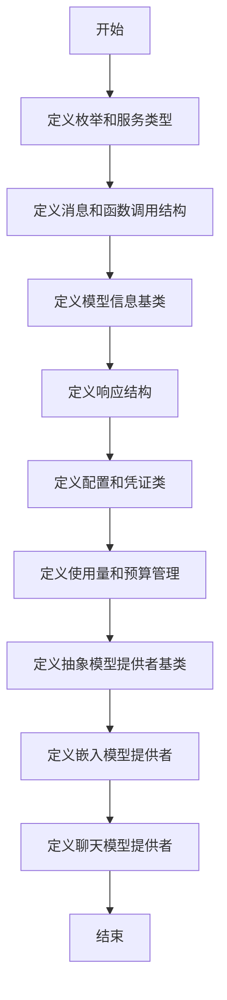

## 类结构

```
ModelProviderService (枚举)
ModelProviderName (枚举)
ChatMessage (BaseModel)
├── AssistantChatMessage (ChatMessage)
└── ToolResultMessage (ChatMessage)
AssistantFunctionCall (BaseModel)
AssistantToolCall (BaseModel)
CompletionModelFunction (BaseModel)
ModelInfo (BaseModel, Generic)
├── EmbeddingModelInfo (ModelInfo)
└── ChatModelInfo (ModelInfo)
ModelResponse (BaseModel)
├── EmbeddingModelResponse (ModelResponse)
└── ChatModelResponse (ModelResponse)
ModelProviderConfiguration (SystemConfiguration)
ModelProviderCredentials (ProviderCredentials)
ModelProviderUsage (BaseModel)
ModelProviderBudget (ProviderBudget)
ModelProviderSettings (SystemSettings)
BaseModelProvider (abc.ABC, Generic, Configurable)
├── BaseEmbeddingModelProvider (BaseModelProvider)
└── BaseChatModelProvider (BaseModelProvider)
ModelTokenizer (Protocol, Generic)
```

## 全局变量及字段


### `_T`
    
Generic type variable for unspecified type parameter

类型：`TypeVar`
    


### `_ModelName`
    
Type variable bounded to str for model name representation

类型：`TypeVar`
    


### `_ModelProviderSettings`
    
Type variable bounded to ModelProviderSettings for provider settings

类型：`TypeVar`
    


### `ChatMessageDict`
    
Type dictionary for chat message structure with role and content

类型：`TypedDict`
    


### `AssistantFunctionCallDict`
    
Type dictionary for assistant function call structure

类型：`TypedDict`
    


### `AssistantToolCallDict`
    
Type dictionary for assistant tool call structure

类型：`TypedDict`
    


### `AssistantChatMessageDict`
    
Type dictionary for assistant chat message structure with optional tool calls

类型：`TypedDict`
    


### `ChatMessage.role`
    
The role of the message sender (user, system, assistant, tool, or function)

类型：`Role`
    


### `ChatMessage.content`
    
The text content of the chat message

类型：`str`
    


### `AssistantFunctionCall.name`
    
The name of the function being called

类型：`str`
    


### `AssistantFunctionCall.arguments`
    
The arguments passed to the function call

类型：`dict[str, Any]`
    


### `AssistantToolCall.id`
    
Unique identifier for the tool call

类型：`str`
    


### `AssistantToolCall.type`
    
The type of tool call, currently only function is supported

类型：`Literal["function"]`
    


### `AssistantToolCall.function`
    
The function call details containing name and arguments

类型：`AssistantFunctionCall`
    


### `AssistantChatMessage.role`
    
Fixed role indicating this is an assistant message

类型：`Literal[ChatMessage.Role.ASSISTANT]`
    


### `AssistantChatMessage.content`
    
The text content of the assistant message

类型：`str`
    


### `AssistantChatMessage.tool_calls`
    
Optional list of tool calls made by the assistant

类型：`Optional[list[AssistantToolCall]]`
    


### `ToolResultMessage.role`
    
Fixed role indicating this is a tool result message

类型：`Literal[ChatMessage.Role.TOOL]`
    


### `ToolResultMessage.is_error`
    
Flag indicating whether the tool execution resulted in an error

类型：`bool`
    


### `ToolResultMessage.tool_call_id`
    
The identifier of the tool call this result corresponds to

类型：`str`
    


### `CompletionModelFunction.name`
    
The name of the callable function model

类型：`str`
    


### `CompletionModelFunction.description`
    
Human-readable description of what the function does

类型：`str`
    


### `CompletionModelFunction.parameters`
    
Schema definitions for the function parameters

类型：`dict[str, JSONSchema]`
    


### `ModelInfo.name`
    
The name identifier of the model

类型：`_ModelName`
    


### `ModelProviderService.service`
    
Class variable defining the type of service (embedding, chat, or text)

类型：`ClassVar[ModelProviderService]`
    


### `ModelInfo.provider_name`
    
The name of the model provider (e.g., openai, anthropic)

类型：`ModelProviderName`
    


### `ModelInfo.prompt_token_cost`
    
Cost per prompt token in the model pricing

类型：`float`
    


### `ModelInfo.completion_token_cost`
    
Cost per completion token in the model pricing

类型：`float`
    


### `ModelResponse.prompt_tokens_used`
    
Number of tokens used in the prompt/request

类型：`int`
    


### `ModelResponse.completion_tokens_used`
    
Number of tokens generated in the completion/response

类型：`int`
    


### `ModelResponse.llm_info`
    
Information about the model that generated the response

类型：`ModelInfo`
    


### `EmbeddingModelInfo.service`
    
Fixed service type indicating this is an embedding model

类型：`Literal[ModelProviderService.EMBEDDING]`
    


### `EmbeddingModelInfo.max_tokens`
    
Maximum number of tokens the model can process

类型：`int`
    


### `EmbeddingModelInfo.embedding_dimensions`
    
The dimensionality of the embedding vector output

类型：`int`
    


### `EmbeddingModelResponse.embedding`
    
The vector representation of the input text

类型：`Embedding`
    


### `EmbeddingModelResponse.completion_tokens_used`
    
Number of tokens in the response (typically 0 for embeddings)

类型：`int`
    


### `ChatModelInfo.service`
    
Fixed service type indicating this is a chat model

类型：`Literal[ModelProviderService.CHAT]`
    


### `ChatModelInfo.max_tokens`
    
Maximum number of tokens the model can generate

类型：`int`
    


### `ChatModelInfo.has_function_call_api`
    
Whether the model supports function calling API

类型：`bool`
    


### `ChatModelResponse.response`
    
The raw assistant message response

类型：`AssistantChatMessage`
    


### `ChatModelResponse.parsed_result`
    
The parsed result from the response (generic type)

类型：`_T`
    


### `ModelProviderConfiguration.retries_per_request`
    
Number of retry attempts for failed requests

类型：`int`
    


### `ModelProviderConfiguration.fix_failed_parse_tries`
    
Number of attempts to fix failed response parsing

类型：`int`
    


### `ModelProviderConfiguration.extra_request_headers`
    
Additional HTTP headers to include in requests

类型：`dict[str, str]`
    


### `ModelProviderCredentials.api_key`
    
API key for authentication with the provider

类型：`SecretStr | None`
    


### `ModelProviderCredentials.api_type`
    
Type of API (e.g., openai, azure)

类型：`SecretStr | None`
    


### `ModelProviderCredentials.api_base`
    
Base URL for the API endpoint

类型：`SecretStr | None`
    


### `ModelProviderCredentials.api_version`
    
Version of the API to use

类型：`SecretStr | None`
    


### `ModelProviderCredentials.deployment_id`
    
Deployment identifier for Azure or similar providers

类型：`SecretStr | None`
    


### `ModelProviderUsage.usage_per_model`
    
Dictionary tracking token usage per model

类型：`dict[str, ModelUsage]`
    


### `ModelProviderBudget.usage`
    
Usage tracking for the provider budget

类型：`ModelProviderUsage`
    


### `ModelProviderBudget.total_cost`
    
Accumulated total cost of all API calls

类型：`float`
    


### `ModelProviderBudget.remaining_budget`
    
Remaining budget available for API calls

类型：`float`
    


### `ModelProviderSettings.resource_type`
    
Class variable identifying this as a MODEL resource type

类型：`ClassVar[ResourceType]`
    


### `ModelProviderSettings.configuration`
    
Configuration settings for the model provider

类型：`ModelProviderConfiguration`
    


### `ModelProviderSettings.credentials`
    
Authentication credentials for the provider

类型：`Optional[ModelProviderCredentials]`
    


### `ModelProviderSettings.budget`
    
Budget tracking and limits for the provider

类型：`Optional[ModelProviderBudget]`
    


### `BaseModelProvider._settings`
    
Internal storage for provider settings

类型：`_ModelProviderSettings`
    


### `BaseModelProvider._logger`
    
Logger instance for the model provider

类型：`logging.Logger`
    
    

## 全局函数及方法


### `ChatMessage.user`

这是一个静态工厂方法，用于快速创建角色为"user"的聊天消息实例。通过提供简洁的接口，调用者无需显式指定角色即可创建用户消息，提升了代码的可读性和易用性。

参数：

- `content`：`str`，用户消息的内容文本

返回值：`ChatMessage`，返回新创建的用户角色聊天消息对象

#### 流程图

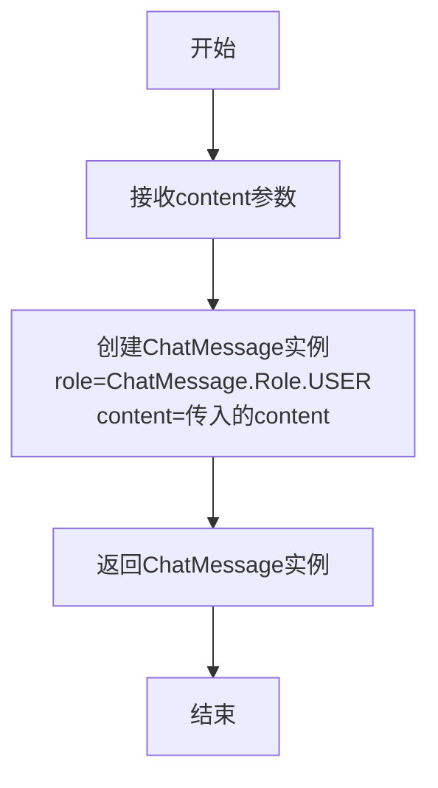

#### 带注释源码

```python
@staticmethod
def user(content: str) -> "ChatMessage":
    """
    创建角色为USER的ChatMessage实例的静态工厂方法
    
    参数:
        content: str - 用户消息的内容文本
    
    返回:
        ChatMessage - 新创建的用户角色聊天消息对象
    """
    return ChatMessage(role=ChatMessage.Role.USER, content=content)
```


### `ChatMessage.system`

创建一个角色为 SYSTEM 的聊天消息对象，用于向模型传递系统级别的指令或上下文信息。

参数：

- `content`：`str`，系统消息的文本内容

返回值：`ChatMessage`，返回一个 `role` 属性设置为 `ChatMessage.Role.SYSTEM` 的新实例

#### 流程图

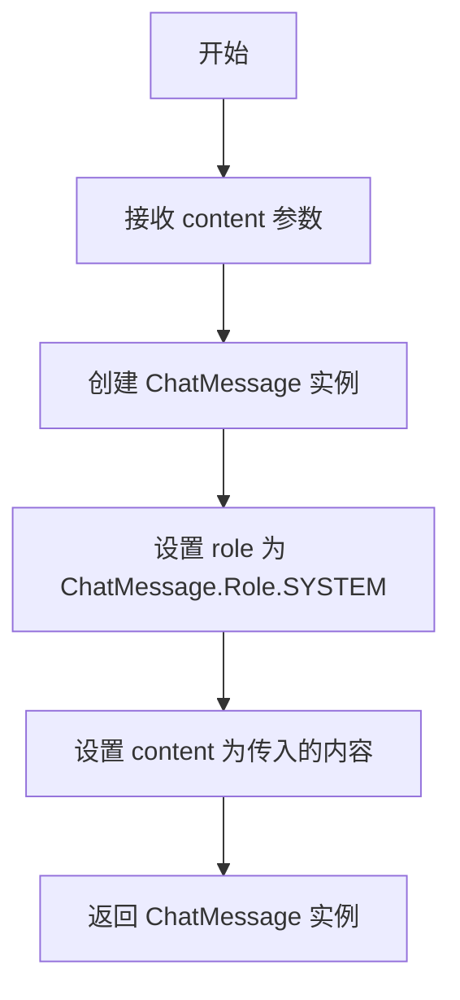

#### 带注释源码

```python
@staticmethod
def system(content: str) -> "ChatMessage":
    """创建系统角色的聊天消息的静态工厂方法
    
    Args:
        content: 系统消息的内容，用于向模型传递系统指令或上下文
        
    Returns:
        ChatMessage: 一个 role 设置为 SYSTEM 的新 ChatMessage 实例
    """
    return ChatMessage(role=ChatMessage.Role.SYSTEM, content=content)
```


### `AssistantFunctionCall.__str__`

该方法将AssistantFunctionCall对象转换为字符串格式，返回函数名称及其参数的字符串表示，格式为"函数名(参数1=值1, 参数2=值2, ...)"。

参数：
- （无额外参数，隐含self参数）

返回值：`str`，返回函数调用的字符串表示，格式为"函数名(格式化后的参数字典)"

#### 流程图

```mermaid
flowchart TD
    A[开始 __str__] --> B[获取self.name]
    B --> C[获取self.arguments]
    C --> D{self.arguments是否为空}
    D -->|是| E[返回 '函数名()']
    D -->|否| F[调用fmt_kwargs格式化参数]
    F --> G[返回 '函数名(格式化参数)']
    E --> G
```

#### 带注释源码

```python
class AssistantFunctionCall(BaseModel):
    """表示助手函数调用的数据模型"""
    
    name: str  # 被调用的函数名称
    arguments: dict[str, Any]  # 函数调用时传递的参数字典

    def __str__(self) -> str:
        """
        将函数调用对象转换为字符串表示
        
        返回格式: "函数名(参数1=值1, 参数2=值2, ...)"
        使用fmt_kwargs工具函数格式化参数字典为可读字符串
        
        Returns:
            str: 函数名称及其参数的字符串表示
        """
        return f"{self.name}({fmt_kwargs(self.arguments)})"
```

#### 补充说明

- **方法类型**：Python特殊方法（dunder method），用于定义对象的字符串表示
- **依赖函数**：`fmt_kwargs` 来自 `forge.logging.utils` 模块，用于将参数字典格式化为人类可读的字符串
- **使用场景**：当需要将AssistantFunctionCall对象打印日志、调试或作为字符串使用时，会自动调用此方法
- **与`__repr__`的区别**：`__str__`提供人类可读的表示，而`__repr__`提供开发者可读的表示（通常用于调试）


### `CompletionModelFunction.fmt_line`

格式化函数签名行，将函数名称、描述和参数规范转换为可读的字符串表示。

参数：
- 无（仅包含 `self` 参数）

返回值：`str`，格式化后的函数签名行，格式为 `{函数名}: {描述}. Params: ({参数列表})`

#### 流程图

```mermaid
flowchart TD
    A[开始 fmt_line] --> B[遍历 self.parameters 字典]
    B --> C{遍历每个 name, p}
    C --> D[检查 p.required]
    D -->|required 为 False| E[添加 '?' 到参数名]
    D -->|required 为 True| F[不添加 '?']
    E --> G[添加类型: p.typescript_type]
    F --> G
    G --> H[格式化为 'name?: type' 或 'name: type']
    H --> I[用 ', ' 连接所有参数]
    J[返回格式化字符串: f"{self.name}: {self.description}. Params: ({params})"]
    C -->|遍历完成| J
```

#### 带注释源码

```python
def fmt_line(self) -> str:
    """
    将函数签名格式化为可读的字符串表示。
    
    格式: {函数名}: {描述}. Params: ({参数列表})
    其中参数列表格式为: name?: type 或 name: type
    (带 ? 表示参数可选)
    """
    # 遍历参数字典，格式化每个参数
    params = ", ".join(
        f"{name}{'?' if not p.required else ''}: " f"{p.typescript_type}"
        # 解析 parameters 字典中的每个参数
        # - name: 参数名称
        # - p: JSONSchema 对象，包含 required 和 typescript_type 属性
        for name, p in self.parameters.items()
    )
    # 组装最终格式: 函数名: 描述. Params: (参数列表)
    return f"{self.name}: {self.description}. Params: ({params})"
```


### `CompletionModelFunction.validate_call`

该方法用于验证 AssistantFunctionCall 是否符合函数定义的参数规范，通过构建 JSON Schema 并调用 validate_object 进行参数校验，确保函数调用的参数类型和必需性与定义一致。

参数：

- `function_call`：`AssistantFunctionCall`，待验证的函数调用对象，包含函数名称和参数字典

返回值：`tuple[bool, list["ValidationError"]]`，第一个元素表示参数是否有效，第二个元素包含验证错误列表（如果存在）

#### 流程图

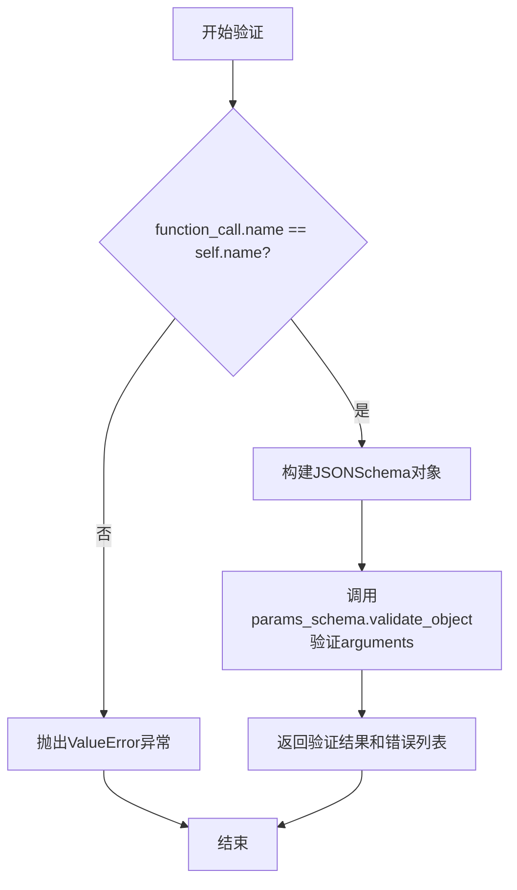

#### 带注释源码

```python
def validate_call(
    self, function_call: AssistantFunctionCall
) -> tuple[bool, list["ValidationError"]]:
    """
    Validates the given function call against the function's parameter specs

    Returns:
        bool: Whether the given set of arguments is valid for this command
        list[ValidationError]: Issues with the set of arguments (if any)

    Raises:
        ValueError: If the function_call doesn't call this function
    """
    # 首先检查function_call调用的函数名是否与当前函数定义匹配
    if function_call.name != self.name:
        raise ValueError(
            f"Can't validate {function_call.name} call using {self.name} spec"
        )

    # 根据当前函数定义的parameters构建JSON Schema对象
    # 将parameters字典转换为JSONSchema的属性定义
    params_schema = JSONSchema(
        type=JSONSchema.Type.OBJECT,
        properties={name: spec for name, spec in self.parameters.items()},
    )
    
    # 使用JSON Schema验证function_call中提供的arguments参数
    # 返回验证结果（是否有效）和验证错误列表
    return params_schema.validate_object(function_call.arguments)
```


### `ModelProviderUsage.completion_tokens`

这是一个计算属性方法，用于返回所有模型使用的完成令牌（completion tokens）的总和。

参数：无（这是一个 `@property` 装饰器方法，隐含参数为 `self`）

返回值：`int`，返回所有模型完成令牌的总和

#### 流程图

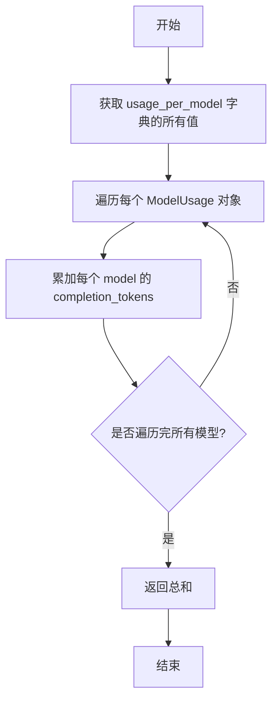

#### 带注释源码

```python
@property
def completion_tokens(self) -> int:
    """返回所有模型使用的完成令牌总数。
    
    该属性遍历 usage_per_model 字典中的每个 ModelUsage 对象，
    将其 completion_tokens 字段值累加后返回。
    
    Returns:
        int: 所有模型的 completion_tokens 之和
    """
    return sum(model.completion_tokens for model in self.usage_per_model.values())
```


### `ModelProviderUsage.prompt_tokens`

该属性用于获取所有模型累计使用的 prompt tokens 总数，通过遍历 `usage_per_model` 字典并对每个模型的 `prompt_tokens` 进行求和得到。

参数： 无

返回值：`int`，返回所有模型使用的 prompt tokens 的总和

#### 流程图

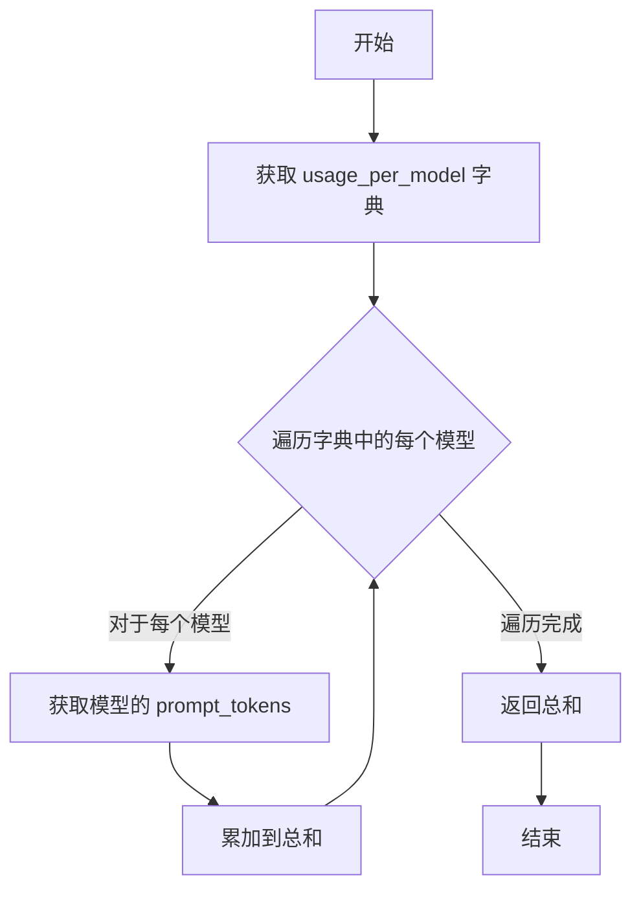

#### 带注释源码

```python
@property
def prompt_tokens(self) -> int:
    """计算所有模型累计使用的 prompt tokens 总数。
    
    Returns:
        int: 所有模型使用的 prompt tokens 总和
    """
    return sum(model.prompt_tokens for model in self.usage_per_model.values())
```


### `ModelProviderUsage.update_usage`

该方法用于更新特定模型的 usage 统计信息，累加输入令牌（prompt tokens）和输出令牌（completion tokens）的使用量。

参数：

- `model`：`str`，模型的名称/标识符
- `input_tokens_used`：`int`，输入/提示令牌使用数量
- `output_tokens_used`：`int`，输出/补全令牌使用数量，默认为 0

返回值：`None`，该方法直接修改对象状态，无返回值

#### 流程图

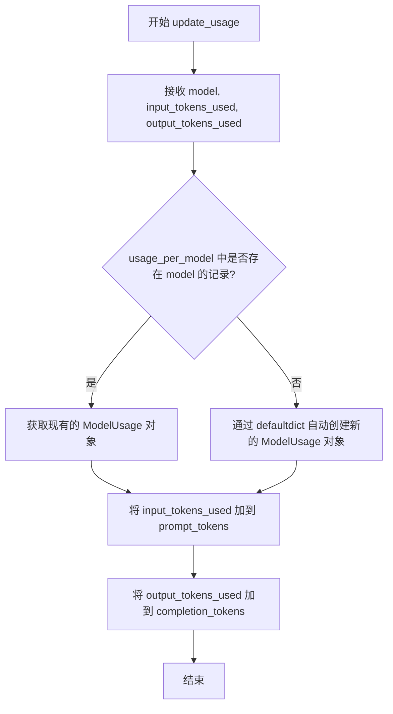

#### 带注释源码

```python
def update_usage(
    self,
    model: str,
    input_tokens_used: int,
    output_tokens_used: int = 0,
) -> None:
    """更新特定模型的令牌使用统计。
    
    参数:
        model: 模型名称/标识符
        input_tokens_used: 输入/提示令牌使用数量
        output_tokens_used: 输出/补全令牌使用数量，默认为 0
    """
    # 通过 defaultdict(ModelUsage) 自动创建或获取该模型的 ModelUsage 对象
    # 并将其 prompt_tokens 累加 input_tokens_used
    self.usage_per_model[model].prompt_tokens += input_tokens_used
    
    # 将 output_tokens_used 累加到该模型的 completion_tokens
    self.usage_per_model[model].completion_tokens += output_tokens_used
```


### `ModelProviderBudget.update_usage_and_cost`

该方法用于更新模型提供商的使用量和成本计算，根据输入和输出的 token 数量以及模型的单价计算费用，并从剩余预算中扣除相应金额。

参数：

- `model_info`：`ModelInfo`，包含模型的定价信息（prompt_token_cost 和 completion_token_cost）
- `input_tokens_used`：`int`，输入（prompt）使用的 token 数量
- `output_tokens_used`：`int`（默认值为 0），输出（completion）使用的 token 数量

返回值：`float`，本次请求产生的实际费用

#### 流程图

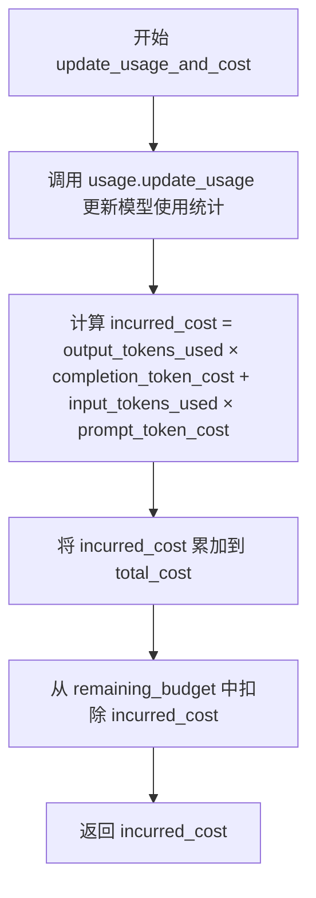

#### 带注释源码

```python
def update_usage_and_cost(
    self,
    model_info: ModelInfo,
    input_tokens_used: int,
    output_tokens_used: int = 0,
) -> float:
    """Update the usage and cost of the provider.

    Returns:
        float: The (calculated) cost of the given model response.
    """
    # 更新 ModelProviderUsage 中每个模型的使用统计
    # 累加该模型已消耗的 prompt 和 completion tokens
    self.usage.update_usage(model_info.name, input_tokens_used, output_tokens_used)
    
    # 根据 token 数量和模型单价计算本次请求的费用
    # 费用 = 输出token数 × 输出单价 + 输入token数 × 输入单价
    incurred_cost = (
        output_tokens_used * model_info.completion_token_cost
        + input_tokens_used * model_info.prompt_token_cost
    )
    
    # 将本次费用累加到总成本
    self.total_cost += incurred_cost
    
    # 从剩余预算中扣除本次费用
    self.remaining_budget -= incurred_cost
    
    # 返回本次请求产生的费用，供调用方参考或记录
    return incurred_cost
```


### `BaseModelProvider.get_available_models`

获取该模型提供者所有可用的模型列表，包括聊天模型和嵌入模型。

参数：

- 无参数（仅包含 `self`）

返回值：`Sequence[ChatModelInfo[_ModelName] | EmbeddingModelInfo[_ModelName]]`，返回该提供者所有可用的模型信息序列，包含聊天模型和嵌入模型。

#### 流程图

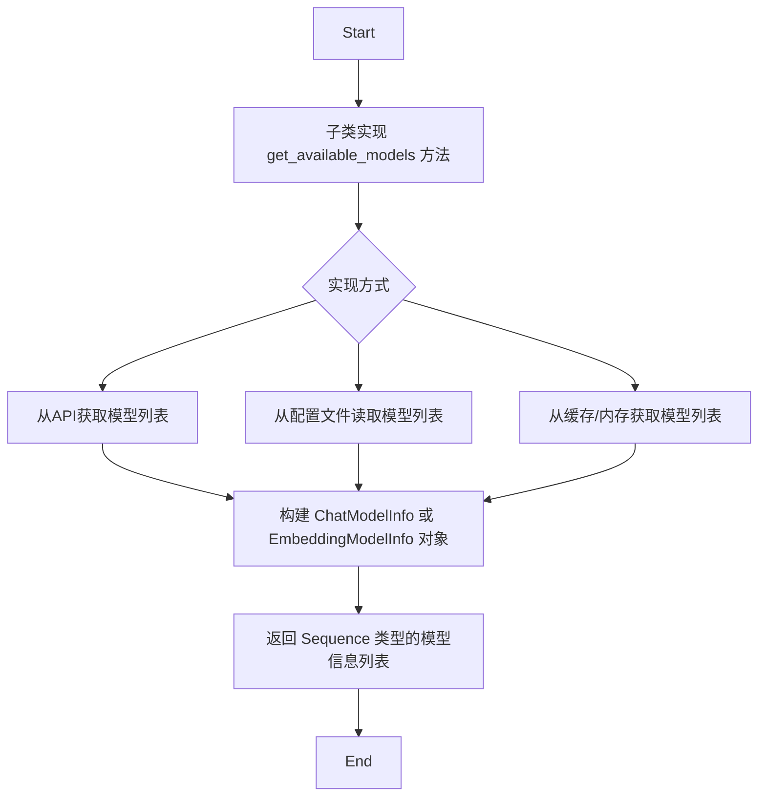

#### 带注释源码

```python
@abc.abstractmethod
async def get_available_models(
    self,
) -> Sequence["ChatModelInfo[_ModelName] | EmbeddingModelInfo[_ModelName]"]:
    """获取该模型提供者所有可用的模型列表。
    
    这是一个抽象方法，必须由子类实现。子类需要实现具体的逻辑来
    获取可用的模型信息，并返回包含 ChatModelInfo 和 EmbeddingModelInfo
    的序列。
    
    Returns:
        Sequence: 包含所有可用模型信息的序列，每个元素可以是
                  ChatModelInfo（聊天模型）或 EmbeddingModelInfo（嵌入模型）
    
    Example:
        >>> # 子类实现示例
        >>> async def get_available_models(self):
        ...     return [
        ...         ChatModelInfo(
        ...             name="gpt-4",
        ...             provider_name=ModelProviderName.OPENAI,
        ...             max_tokens=8192,
        ...             has_function_call_api=True
        ...         ),
        ...         EmbeddingModelInfo(
        ...             name="text-embedding-3-small",
        ...             provider_name=ModelProviderName.OPENAI,
        ...             max_tokens=8192,
        ...             embedding_dimensions=1536
        ...         )
        ...     ]
    """
    ...  # 抽象方法，由子类实现
```


### `BaseModelProvider.count_tokens`

计算给定文本在指定模型上的token数量。

参数：

- `text`：`str`，要计算token数的文本
- `model_name`：`_ModelName`，模型名称（一个绑定到`str`的类型变量）

返回值：`int`，文本的token数量

#### 流程图

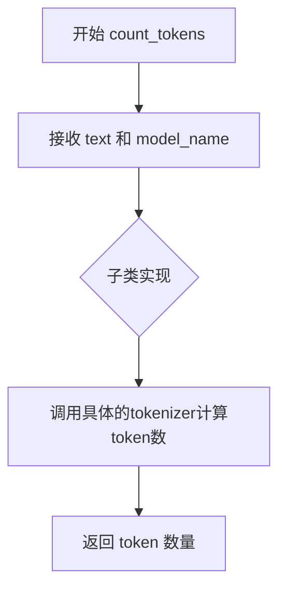

#### 带注释源码

```python
@abc.abstractmethod
def count_tokens(self, text: str, model_name: _ModelName) -> int:
    """计算给定文本在指定模型上的token数量。
    
    这是一个抽象方法，由具体的模型提供者实现。
    不同的模型使用不同的tokenization方案，因此token计数逻辑
    需要由子类根据具体模型提供。
    
    参数:
        text: str, 要计算token数的输入文本
        model_name: _ModelName, 目标模型的名称，用于确定使用哪个tokenizer
        
    返回:
        int: 文本对应的token数量
        
    异常:
        NotImplementedError: 如果子类未实现此方法
    """
    ...
```


### `BaseModelProvider.get_tokenizer`

获取指定模型的 Tokenizer 实例，用于对文本进行编码和解码操作。

参数：

- `model_name`：`_ModelName`（`TypeVar`，bound 为 `str`），需要获取 Tokenizer 的模型名称

返回值：`ModelTokenizer[Any]`，返回与指定模型关联的 Tokenizer 实例，支持 `encode`（文本转 token）和 `decode`（token 转文本）操作

#### 流程图

```mermaid
flowchart TD
    A[调用 get_tokenizer] --> B{model_name 是否有效}
    B -->|有效| C[返回对应的 ModelTokenizer 实例]
    B -->|无效| D[抛出异常或返回默认 Tokenizer]
    
    C --> E[调用 encode 方法: text → list[tokens]]
    C --> F[调用 decode 方法: list[tokens] → text]
    
    style A fill:#f9f,stroke:#333
    style C fill:#9f9,stroke:#333
    style E fill:#ff9,stroke:#333
    style F fill:#ff9,stroke:#333
```

#### 带注释源码

```python
@abc.abstractmethod
def get_tokenizer(self, model_name: _ModelName) -> "ModelTokenizer[Any]":
    """获取指定模型的 Tokenizer 实例。
    
    这是一个抽象方法，由子类实现具体逻辑。
    返回的 Tokenizer 必须遵循 ModelTokenizer Protocol，
    即实现 encode 和 decode 方法。
    
    参数:
        model_name: 模型名称，用于获取对应的 Tokenizer
        
    返回:
        ModelTokenizer[Any]: 与模型关联的 Tokenizer 实例
        
    Protocol 定义 (ModelTokenizer):
        - encode(text: str) -> list[_T]: 将文本编码为 token 列表
        - decode(tokens: list[_T]) -> str: 将 token 列表解码为文本
    """
    ...
```


### `BaseModelProvider.get_token_limit`

获取指定模型的最大token限制。该方法是一个抽象方法，需要子类实现具体的逻辑来返回特定模型支持的最大token数量。

参数：

- `model_name`：`_ModelName`，需要获取token限制的模型名称

返回值：`int`，模型支持的最大token数量

#### 流程图

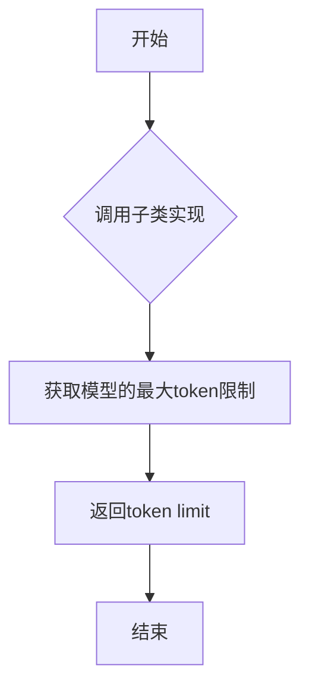

#### 带注释源码

```python
@abc.abstractmethod
def get_token_limit(self, model_name: _ModelName) -> int:
    """获取指定模型的最大token限制。

    这是一个抽象方法，必须由子类实现具体的逻辑。
    子类应根据不同模型的规格，返回该模型支持的最大token数量。

    Args:
        model_name: _ModelName，需要获取token限制的模型名称

    Returns:
        int：模型支持的最大token数量

    Note:
        该方法与 count_tokens 方法配合使用，用于：
        1. 确定模型能够处理的最大输入长度
        2. 在创建聊天补全时计算可用的输出token空间
        3. 验证输入是否超出模型的处理能力
    """
    ...
```


### `BaseModelProvider.get_incurred_cost`

获取模型提供者已产生的累计成本

参数：

- （无参数，只含隐式 `self`）

返回值：`float`，返回当前会话已产生的总成本，若未设置预算则返回 0

#### 流程图

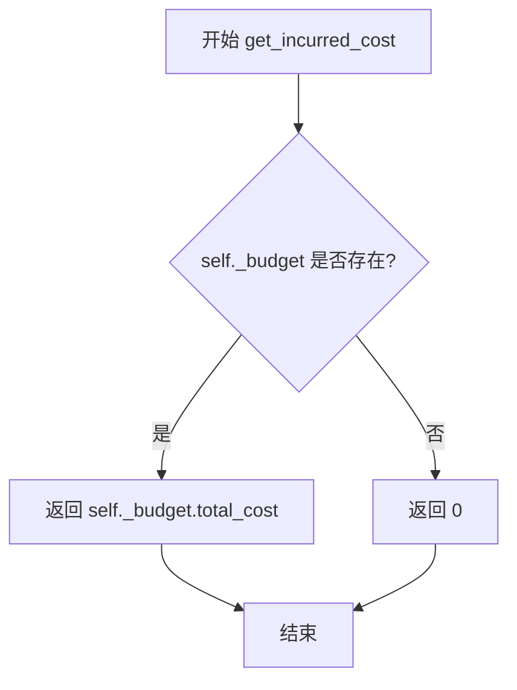

#### 带注释源码

```python
def get_incurred_cost(self) -> float:
    """获取模型调用产生的累计成本。

    如果预算对象存在，则返回预算中记录的总成本；
    否则返回 0，表示无成本记录。

    Returns:
        float: 累计产生的成本（单位与 ProviderBudget.total_cost 一致）
    """
    # 检查是否存在预算对象
    if self._budget:
        # 返回预算中累计的总成本
        return self._budget.total_cost
    # 无预算对象时，返回 0 表示无成本产生
    return 0
```


### `BaseModelProvider.get_remaining_budget`

获取当前模型提供商的剩余预算金额。如果配置了预算对象，则返回预算对象的剩余预算属性值；否则返回正无穷大，表示没有预算限制。

参数：

- `self`：实例本身（隐式参数），`BaseModelProvider`，调用该方法的对象实例

返回值：`float`，返回剩余的预算金额，若未配置预算则返回 `math.inf`（正无穷大）

#### 流程图

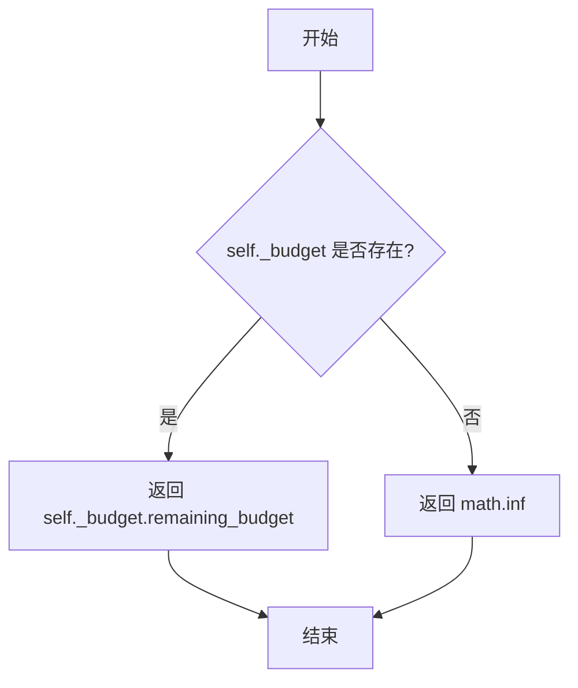

#### 带注释源码

```python
def get_remaining_budget(self) -> float:
    """获取模型提供商的剩余预算金额。
    
    Returns:
        float: 如果配置了预算，返回剩余预算金额；否则返回正无穷大（表示无预算限制）。
    """
    # 检查是否存在预算配置
    if self._budget:
        # 返回预算对象中记录的剩余预算金额
        return self._budget.remaining_budget
    # 未配置预算时，返回正无穷大表示无限制
    return math.inf
```


### `BaseEmbeddingModelProvider.get_available_embedding_models`

获取当前模型提供者所有可用的嵌入模型列表。

参数：

- `self`：`<class>`，调用该方法的模型提供者实例本身

返回值：`Sequence[EmbeddingModelInfo[_ModelName]]`，包含所有可用嵌入模型信息的序列对象

#### 流程图

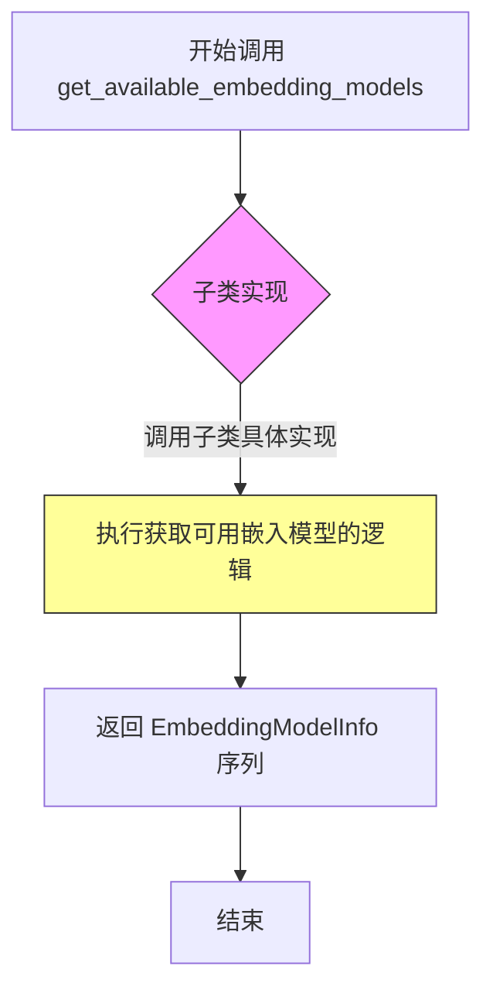

#### 带注释源码

```python
@abc.abstractmethod
async def get_available_embedding_models(
    self,
) -> Sequence[EmbeddingModelInfo[_ModelName]]:
    """获取当前模型提供者支持的嵌入模型列表。
    
    这是一个抽象方法，由具体的模型提供者子类实现。
    子类需要实现具体的逻辑来获取并返回可用的嵌入模型信息。
    
    Returns:
        Sequence[EmbeddingModelInfo[_ModelName]]: 
            一个模型信息序列，每个元素包含嵌入模型的名称、提供商、
            上下文窗口大小、嵌入维度等配置信息。
            
    Note:
        该方法为异步方法，由具体实现类重写以提供实际功能。
        调用者可以通过此方法获取当前 provider 支持的所有嵌入模型，
        用于模型选择或展示可用模型列表等场景。
    """
    ...
```


### `BaseEmbeddingModelProvider.create_embedding`

创建嵌入向量，将文本转换为模型特定的嵌入表示。

参数：

- `self`：实例本身
- `text`：`str`，需要转换为嵌入向量的输入文本
- `model_name`：`_ModelName`，用于生成嵌入的模型标识符
- `embedding_parser`：`Callable[[Embedding], Embedding]`，用于解析和转换嵌入结果的回调函数
- `**kwargs`：可变关键字参数，传递额外的模型特定参数

返回值：`EmbeddingModelResponse`，包含生成的嵌入向量及相关元数据（如使用的 token 数量）

#### 流程图

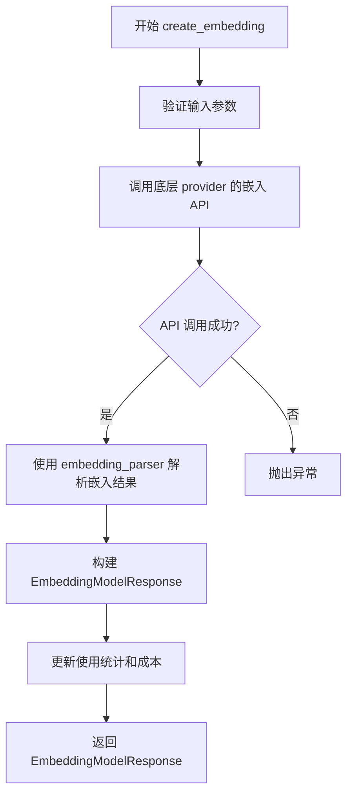

#### 带注释源码

```python
@abc.abstractmethod
async def create_embedding(
    self,
    text: str,                                    # 输入文本
    model_name: _ModelName,                       # 嵌入模型名称
    embedding_parser: Callable[[Embedding], Embedding],  # 嵌入结果解析器
    **kwargs,                                     # 额外参数（如 batch_size, dimensions 等）
) -> EmbeddingModelResponse:
    """创建嵌入向量，将文本转换为嵌入表示。
    
    这是一个抽象方法，由具体的嵌入模型提供者（如 OpenAI、Anthropic 等）实现。
    方法异步调用底层 API，将文本转换为向量嵌入。
    
    Args:
        text: 要嵌入的输入文本
        model_name: 目标嵌入模型的名称
        embedding_parser: 回调函数，用于解析 API 返回的嵌入结果
        **kwargs: 提供商特定的额外参数
    
    Returns:
        EmbeddingModelResponse: 包含嵌入向量、token 使用量等信息的响应对象
        
    Note:
        - 具体实现需处理 API 错误、超重试等逻辑
        - 嵌入向量通常为浮点数列表，维度和范围因模型而异
    """
    ...
```


### `BaseChatModelProvider.get_available_chat_models`

获取该模型提供者支持的所有可用聊天模型列表。

参数：

- `self`：`BaseChatModelProvider`，隐式的 self 参数，表示当前模型提供者实例

返回值：`Sequence[ChatModelInfo[_ModelName]]`，返回该 provider 支持的聊天模型信息列表，每个元素包含模型名称、服务类型、最大 token 数和函数调用 API 支持情况

#### 流程图

```mermaid
flowchart TD
    A[调用 get_available_chat_models] --> B{子类实现?}
    B -->|是| C[执行子类具体实现]
    B -->|否| D[抛出 NotImplementedError]
    C --> E[返回 Sequence[ChatModelInfo]]
    D --> E
```

#### 带注释源码

```python
@abc.abstractmethod
async def get_available_chat_models(self) -> Sequence[ChatModelInfo[_ModelName]]:
    """
    获取该模型提供者支持的所有可用聊天模型列表。
    
    这是一个抽象方法，由具体的模型提供者类（如 OpenAI、Anthropic 等）实现。
    返回的序列包含该提供者所有的聊天模型信息，每个模型信息包括：
    - name: 模型名称
    - provider_name: 提供者名称
    - prompt_token_cost: 输入 token 费用
    - completion_token_cost: 输出 token 费用
    - max_tokens: 模型支持的最大 token 数
    - has_function_call_api: 是否支持函数调用 API
    
    Returns:
        Sequence[ChatModelInfo[_ModelName]]: 可用的聊天模型信息序列
        
    Note:
        该方法为异步方法，调用者需要使用 await 来获取结果
    """
    ...
```


### `BaseChatModelProvider.count_message_tokens`

该方法是一个抽象方法，用于计算给定聊天消息列表的 token 数量。它接受聊天消息和模型名称作为输入，并返回整数值表示消息所需的 token 总数。

参数：

- `messages`：`ChatMessage | list[ChatMessage]`，需要计算 token 数量的单条消息或消息列表
- `model_name`：`_ModelName`，用于确定使用哪个模型的 tokenizer 进行 token 计算

返回值：`int`，返回消息列表消耗的 token 总数

#### 流程图

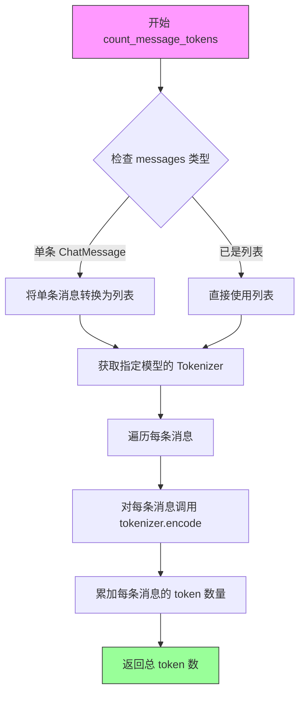

#### 带注释源码

```python
@abc.abstractmethod
def count_message_tokens(
    self,
    messages: ChatMessage | list[ChatMessage],
    model_name: _ModelName,
) -> int:
    """Calculate the total number of tokens for the given chat messages.

    This is an abstract method that must be implemented by subclasses
    to provide model-specific token counting logic.

    Args:
        messages: A single ChatMessage or a list of ChatMessage objects
                  to calculate tokens for.
        model_name: The name of the model, used to select the appropriate
                    tokenizer for token counting.

    Returns:
        int: The total number of tokens consumed by the messages.

    Note:
        Different models may have different tokenization schemes,
        so the implementation is delegated to concrete provider classes.
    """
    ...
```


### `BaseChatModelProvider.create_chat_completion`

创建聊天完成（Chat Completion），调用聊天模型生成Assistant响应，是聊天模型提供者（Chat Model Provider）的核心抽象方法。

参数：

- `model_prompt`：`list[ChatMessage]`，聊天消息列表，作为模型的输入提示
- `model_name`：`_ModelName`，要使用的模型名称（绑定于str的泛型类型）
- `completion_parser`：`Callable[[AssistantChatMessage], _T]`，用于解析模型响应的回调函数，默认为 `lambda _: None`
- `functions`：`Optional[list[CompletionModelFunction]]`，可选的函数列表，用于函数调用（Function Calling）功能
- `max_output_tokens`：`Optional[int]`，生成响应的最大token数量限制
- `prefill_response`：`str`，预填充的响应内容，用于引导模型输出
- `**kwargs`：额外的关键字参数，传递给底层模型API

返回值：`ChatModelResponse[_T]`，包含模型响应、解析结果及token使用情况的泛型响应对象

#### 流程图

```mermaid
flowchart TD
    A[开始 create_chat_completion] --> B[接收 model_prompt, model_name 等参数]
    B --> C{子类实现}
    C --> D[调用底层模型API]
    D --> E[获取 AssistantChatMessage 响应]
    E --> F[调用 completion_parser 解析响应]
    F --> G[构造 ChatModelResponse]
    G --> H[返回 ChatModelResponse[_T]]
    
    style C fill:#f9f,stroke:#333,stroke-width:2px
    style D fill:#ff9,stroke:#333,stroke-width:2px
```

#### 带注释源码

```python
@abc.abstractmethod
async def create_chat_completion(
    self,
    model_prompt: list[ChatMessage],
    model_name: _ModelName,
    completion_parser: Callable[[AssistantChatMessage], _T] = lambda _: None,
    functions: Optional[list[CompletionModelFunction]] = None,
    max_output_tokens: Optional[int] = None,
    prefill_response: str = "",
    **kwargs,
) -> ChatModelResponse[_T]:
    """
    创建聊天完成（Chat Completion），调用聊天模型生成Assistant响应。
    
    这是一个抽象方法，由具体的模型提供者（如OpenAI、Anthropic等）实现。
    
    参数:
        model_prompt: 聊天消息列表，作为模型的输入提示
        model_name: 要使用的模型名称
        completion_parser: 用于解析模型响应的回调函数，默认为返回None
        functions: 可选的函数列表，用于函数调用功能
        max_output_tokens: 生成响应的最大token数量限制
        prefill_response: 预填充的响应内容，用于引导模型输出
        **kwargs: 额外的关键字参数，传递给底层模型API
        
    返回:
        ChatModelResponse[_T]: 包含模型响应、解析结果及token使用情况的泛型响应对象
        
    注意:
        - 该方法是异步的，需要使用 await 调用
        - 具体实现需要处理重试逻辑、错误处理、预算管理等
        - _T 是泛型类型，由 completion_parser 的返回类型决定
    """
    ...
```


### `ModelTokenizer.encode`

该方法为特定模型提供文本tokenization（分词）功能，将输入的文本字符串编码为模型对应的token列表。

参数：

- `text`：`str`，需要被编码的文本字符串

返回值：`list[_T]`，编码后的token列表，类型由泛型参数 `_T` 决定（例如可能是 `int` 类型的token ID列表）

#### 流程图

```mermaid
flowchart TD
    A[开始 encode] --> B{输入验证}
    B -->|文本有效| C[调用模型特定的编码逻辑]
    B -->|文本无效| D[抛出异常]
    C --> E[返回 token 列表]
    E --> F[结束 encode]
    
    style D fill:#ffcccc
```

#### 带注释源码

```python
class ModelTokenizer(Protocol, Generic[_T]):
    """A ModelTokenizer provides tokenization specific to a model."""

    @abc.abstractmethod
    def encode(self, text: str) -> list[_T]:
        """将文本编码为模型特定的token列表。
        
        参数:
            text: 需要编码的输入文本字符串
            
        返回:
            编码后的token列表，类型由实现类的泛型参数决定
        """
        ...

    @abc.abstractmethod
    def decode(self, tokens: list[_T]) -> str:
        """将token列表解码为文本字符串。
        
        参数:
            tokens: 编码后的token列表
            
        返回:
            解码后的文本字符串
        """
        ...
```


### `ModelTokenizer.decode`

该方法定义了模型特定标记器的解码接口，用于将令牌列表转换回文本字符串。

参数：

- `self`：`ModelTokenizer`，隐式的实例对象
- `tokens`：`list[_T]`，要解码的令牌列表，其中 `_T` 是泛型类型参数

返回值：`str`，解码后的文本字符串

#### 流程图

```mermaid
flowchart TD
    A["开始 decode"] --> B{"输入验证"}
    B -->|tokens 为空| C["返回空字符串 ''"]
    B -->|tokens 非空| D["执行解码逻辑"]
    D --> E["返回解码后的文本 str"]
    C --> E
    E --> F["结束 decode"]
```

#### 带注释源码

```python
@abc.abstractmethod
def decode(self, tokens: list[_T]) -> str:
    """将令牌列表解码为文本字符串。

    这是一个抽象方法，由具体的模型提供者实现。
    不同的模型可能使用不同的分词器，因此解码逻辑也不同。

    Args:
        tokens: 要解码的令牌列表，每个令牌的类型由泛型参数 _T 决定，
                例如对于某些模型可能是 int，对于其他模型可能是 str

    Returns:
        str: 解码后的文本字符串

    Example:
        >>> tokenizer = OpenAITokenizer()
        >>> tokens = [1234, 5678, 9012]
        >>> text = tokenizer.decode(tokens)
        >>> print(text)
        "Hello world"
    """
    ...
```

## 关键组件


### ModelProviderService

定义模型提供的服务类型枚举，包括 EMBEDDING（嵌入）、CHAT（聊天完成）和 TEXT（文本完成）三种服务类型。

### ModelProviderName

定义模型提供商名称枚举，支持 OPENAI、ANTHROPIC、GROQ 和 LLAMAFILE 四个提供商。

### ChatMessage

聊天消息的基本结构，包含 role（角色）和 content（内容）字段，提供静态工厂方法 user() 和 system() 用于创建用户和系统消息。

### AssistantChatMessage

继承自 ChatMessage，表示助手消息，包含可选的 tool_calls（工具调用）字段，用于处理函数调用场景。

### ToolResultMessage

继承自 ChatMessage，表示工具执行结果消息，包含 is_error 标志和 tool_call_id，用于返回工具调用结果。

### CompletionModelFunction

通用 LLM 可调用函数表示对象，包含 name、description 和 parameters 字段，提供 validate_call() 方法验证函数调用的参数是否符合规范。

### ModelInfo

泛型模型信息结构体，包含模型名称、服务类型、提供商名称、提示词和补全令牌成本字段，用于存储模型元数据。

### ModelResponse

模型响应的标准结构，包含 prompt_tokens_used、completion_tokens_used 和 llm_info 字段。

### ModelProviderCredentials

模型提供商凭据类，继承自 ProviderCredentials，包含 api_key、api_type、api_base、api_version 和 deployment_id 等敏感配置字段。

### ModelProviderUsage

模型提供商使用量跟踪类，通过 usage_per_model 字典维护每个模型的使用统计，提供 update_usage() 方法更新使用量。

### ModelProviderBudget

模型提供商预算管理类，继承自 ProviderBudget，包含 update_usage_and_cost() 方法用于更新使用量并计算成本。

### BaseModelProvider

抽象基类，定义模型提供商的通用接口，包括 get_available_models()、count_tokens()、get_tokenizer()、get_token_limit() 等抽象方法，以及 get_incurred_cost() 和 get_remaining_budget() 预算相关方法。

### ModelTokenizer

协议接口，定义模型特定的分词器接口，包括 encode() 和 decode() 抽象方法。

### EmbeddingModelInfo

嵌入模型信息结构体，继承自 ModelInfo，包含 max_tokens 和 embedding_dimensions 字段，服务类型固定为 EMBEDDING。

### EmbeddingModelResponse

嵌入模型响应结构体，继承自 ModelResponse，包含 embedding 字段用于返回嵌入向量。

### BaseEmbeddingModelProvider

嵌入模型提供商的抽象基类，继承自 BaseModelProvider，定义 get_available_embedding_models() 和 create_embedding() 抽象方法。

### ChatModelInfo

聊天模型信息结构体，继承自 ModelInfo，包含 max_tokens 和 has_function_call_api 字段，服务类型固定为 CHAT。

### ChatModelResponse

聊天模型响应结构体，继承自 ModelResponse，泛型类，包含 response 和 parsed_result 字段用于返回解析后的结果。

### BaseChatModelProvider

聊天模型提供商的抽象基类，继承自 BaseModelProvider，定义 get_available_chat_models() 和 count_message_tokens() 抽象方法，以及 create_chat_completion() 抽象方法用于创建聊天完成请求。


## 问题及建议


### 已知问题

-   **泛型类型检查困难**：TODO注释指出`_ModelName`类型变量与`str`类型难以进行类型检查，需决定使用`MultiProvider`还是直接使用`str`
-   **Optional字段未空值检查**：在`BaseModelProvider.__init__`中，`settings.credentials`和`settings.budget`被直接赋值给`self._credentials`和`self._budget`，但这两个字段在`ModelProviderSettings`中定义为`Optional`，若为`None`后续访问可能导致`AttributeError`
-   **字段默认值不一致**：`AssistantChatMessage`的`content`字段默认为空字符串`""`，而基类`ChatMessage`的`content`字段无默认值；`ToolResultMessage`继承自`ChatMessage`但未定义`content`默认值，可能导致初始化行为不一致
-   **Field工厂函数使用不当**：`ModelProviderUsage.usage_per_model`使用`defaultdict(ModelUsage)`作为默认工厂，但`ModelProviderBudget.usage`字段使用了`Field(default_factory=ModelProviderUsage)`，这里`ModelProviderUsage`本身已是类，应直接实例化或使用lambda
-   **抽象类标记缺失**：`BaseChatModelProvider`和`BaseEmbeddingModelProvider`虽包含抽象方法但未使用`@abc.abstractmethod`装饰器，无法在实例化时获得完整的抽象类保护
-   **类型注解冗余**：`AssistantChatMessage`和`ToolResultMessage`中使用了`Literal[...]`进行类型注解（如`role: Literal[ChatMessage.Role.ASSISTANT] = ...`），同时使用了`# type: ignore`注释，说明类型定义可能存在设计问题
-   **枚举值未充分利用**：`ChatMessage.Role`定义了`TOOL`和`FUNCTION`角色，但在`ChatMessage`基类中未使用这些角色

### 优化建议

-   **修复空值安全**：在`BaseModelProvider.__init__`中添加空值检查，或使用`Optional`类型的属性并提供默认值处理逻辑
-   **统一字段默认值**：为`ChatMessage`及其子类统一`content`字段的默认值策略，避免继承时的行为不一致
-   **修正Field工厂**：将`Field(default_factory=ModelProviderUsage)`改为`Field(default_factory=lambda: ModelProviderUsage())`或使用`Field(default=ModelProviderUsage())`
-   **添加抽象类装饰器**：为`BaseChatModelProvider`和`BaseEmbeddingModelProvider`的抽象方法添加`@abc.abstractmethod`装饰器，或将其标记为抽象类
-   **移除类型检查忽略**：重新设计`Literal`类型注解以消除`# type: ignore`注释的需求，提升类型安全性
-   **重构泛型设计**：根据TODO注释考虑将`_ModelName`替换为`str`以简化类型检查，或统一使用`MultiProvider`类型
-   **提取魔法数字**：将`retries_per_request=7`和`fix_failed_parse_tries=3`等配置值提取为常量或配置项，提升可维护性

## 其它


### 设计目标与约束

本模块的设计目标是为多种大语言模型（LLM）提供商（如OpenAI、Anthropic、Groq、LlamaFile等）提供统一的抽象接口，支持聊天完成（Chat Completion）、文本补全（Text Completion）和嵌入（Embedding）三种核心服务类型。约束条件包括：必须继承Pydantic BaseModel以支持配置管理；必须实现异步接口以支持非阻塞IO；Token计数和tokenization必须与特定模型绑定；预算管理采用悲观扣减策略（先扣预算再调用API）。

### 错误处理与异常设计

代码中通过`validate_call`方法进行参数验证，返回`tuple[bool, list[ValidationError]]`而非直接抛出异常。预算不足时通过`remaining_budget`属性返回`math.inf`表示无限制。API重试机制通过`retries_per_request`和`fix_failed_parse_tries`配置控制。未实现自定义异常类，依赖Pydantic的验证异常和Python内置异常。潜在改进点：应定义`ModelProviderException`基类及子类（`ConfigurationError`、`CredentialsError`、`BudgetExceededError`、`RateLimitError`等）；应使用`Result`模式替代直接返回异常；应实现指数退避重试策略。

### 数据流与状态机

数据流主要分为三类：配置流（SystemConfiguration→ModelProviderConfiguration→ModelProviderSettings）、调用流（ChatMessage[]→create_chat_completion→ChatModelResponse）、预算流（API响应→update_usage_and_cost→remaining_budget）。状态机方面，ModelProvider具有三种状态：初始化（使用默认配置或自定义配置）、运行中（调用API）、已耗尽（预算为0或负数）。ProviderBudget的状态转换：从初始化→使用中→耗尽（remaining_budget <= 0）。

### 外部依赖与接口契约

核心依赖包括：pydantic（配置管理）、jsonschema（参数验证）、forge.logging（日志工具）、forge.models（配置模型）。外部API契约未在代码中定义，由具体Provider实现类（如OpenAIProvider）负责。Protocol接口定义：ModelTokenizer（encode/decode）、BaseModelProvider（抽象方法）、BaseEmbeddingModelProvider、BaseChatModelProvider。版本约束：Python 3.10+（使用Literal、TypedDict、类型注解）。

### 性能考量与优化空间

Token计数采用同步方法`count_tokens`和`count_message_tokens`，无法利用异步IO优化。Budget计算采用同步方法但实际成本需等待API响应返回后才知道，存在并发场景下的竞态条件风险（多个请求同时扣减预算）。Embedding返回`frozen=True`的completion_tokens_used字段，但EmbeddingModelResponse本身非frozen。优化建议：使用`asyncio.Lock`保护预算更新操作；实现流式响应支持；缓存tokenizer实例；考虑使用连接池复用。

### 安全与合规设计

凭证管理使用pydantic的`SecretStr`类型，避免明文日志输出。API密钥通过`UserConfigurable`装饰器支持环境变量注入。`extra_request_headers`允许注入自定义HTTP头（如Azure AD令牌）。当前未实现请求签名、OAuth流程、PKCE支持。合规方面缺少数据保留策略、审计日志、敏感信息过滤机制。

### 测试策略建议

单元测试应覆盖：各枚举值序列化/反序列化、消息类型转换、Budget计算逻辑、Token计数准确性。集成测试应覆盖：多Provider切换、预算耗尽行为、重试机制、网络超时处理。Mock策略：使用`unittest.mock.AsyncMock`模拟API响应；使用`pytest.fixture`注入不同配置的Provider。性能测试：并发请求下的预算一致性、Token计数性能基准。

### 配置管理架构

采用分层配置模型：SystemConfiguration（系统级）→ModelProviderConfiguration（Provider级）→ModelProviderSettings（实例级）。支持配置继承和覆盖：`default_settings`作为类变量提供默认值，`__init__`接受自定义settings。配置验证由Pydantic自动完成。缺陷：`_ModelProviderSettings`为TypeVar但未绑定具体约束；`default_settings`为ClassVar但类型注解为`# type: ignore`。

### 扩展性设计

通过泛型`_ModelName`和`_ModelProviderSettings`支持不同Provider使用不同的模型名称类型和配置类。通过Protocol接口`ModelTokenizer`支持自定义tokenization逻辑。通过`completion_parser`和`embedding_parser`函数参数支持自定义响应解析。扩展点：添加新的Provider只需继承`BaseModelProvider`并实现抽象方法；添加新的服务类型需扩展`ModelProviderService`枚举和对应基类。

### 监控与可观测性

当前仅通过Python标准库`logging.Logger`记录日志，无结构化日志、指标采集、追踪集成。`get_incurred_cost`和`get_remaining_budget`方法可接入监控系统。建议添加：请求成功率/失败率指标、Token使用量时序数据库、API延迟分布直方图、预算告警阈值。

### 版本兼容性说明

代码使用Python 3.10+类型注解特性（Literal、TypedDict、TypeVar绑定）。pydantic版本需2.0+以支持`ConfigDict`、`Field(default_factory=...)`等语法。外部依赖版本约束未在代码中显式声明，应添加到`pyproject.toml`或`requirements.txt`。

### 命名规范与代码风格

遵循PEP 8命名规范：类名使用PascalCase、常量使用UPPER_SNAKE_CASE、私有属性使用单下划线前缀。类型注解完整：参数名称、参数类型、返回值类型均有标注。文档字符串（docstring）仅在关键方法（如`validate_call`、`update_usage_and_cost`）中包含，类级别docstring缺失率较高（如`ModelProviderSettings`、`BaseModelProvider`）。


    