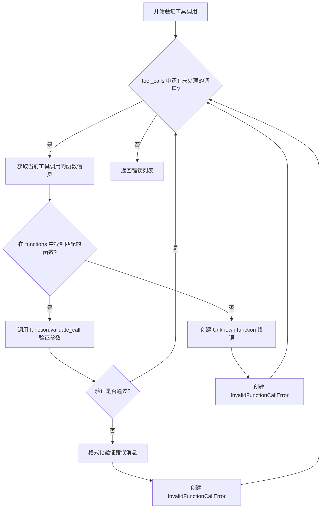
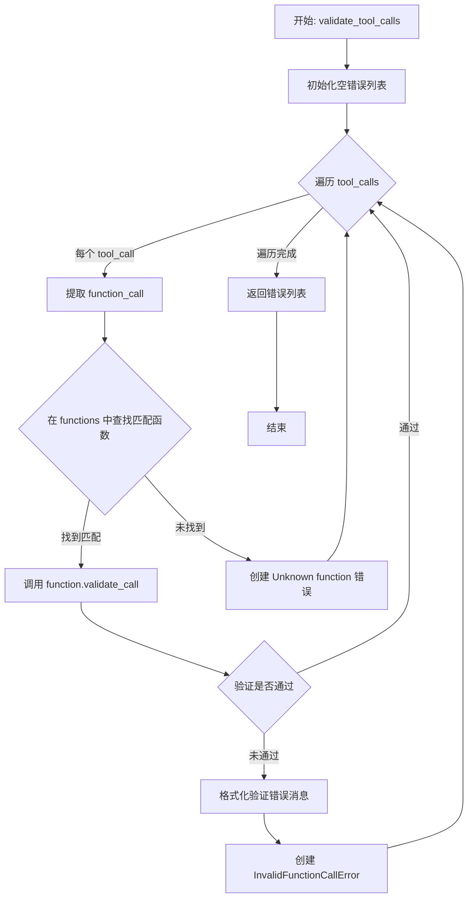

# `.\AutoGPT\classic\forge\forge\llm\providers\utils.py` 详细设计文档

该代码模块提供了AI工具调用验证功能，包括一个自定义异常类用于表示无效的函数调用，一个验证函数用于检查工具调用是否符合可用函数的规范，以及一个转换函数用于将命令对象转换为LLM可消费的函数规格。

## 整体流程

```mermaid
graph TD
    A[开始 validate_tool_calls] --> B[遍历 tool_calls]
    B --> C[获取 function_call]
    C --> D{在 functions 中查找同名函数}
    D -- 找到 --> E[调用 function.validate_call 验证参数]
    D -- 未找到 --> F[创建 InvalidFunctionCallError: Unknown function]
    F --> G[添加到错误列表]
    E --> H{验证结果 is_valid?}
    H -- 是 --> I[继续下一个 tool_call]
    H -- 否 --> J[格式化验证错误消息]
    J --> G
    I --> B
    B --> K[返回错误列表]
    L[开始 function_specs_from_commands] --> M[遍历 commands]
    M --> N[提取 command.names[0] 作为函数名]
    N --> O[构建 CompletionModelFunction 对象]
    O --> P[返回函数规格列表]
```

## 类结构

```
InvalidFunctionCallError (异常类)
├── __init__(self, name, arguments, message)
└── __str__(self)
validate_tool_calls (全局函数)
function_specs_from_commands (全局函数)
```

## 全局变量及字段


### `validate_tool_calls`
    
验证工具调用列表是否符合函数规范的全局函数

类型：`function`
    


### `function_specs_from_commands`
    
从命令集合生成LLM可消费的函数规格列表的全局函数

类型：`function`
    


### `InvalidFunctionCallError.message`
    
错误详情消息

类型：`str`
    


### `InvalidFunctionCallError.name`
    
被调用的函数名称

类型：`str`
    


### `InvalidFunctionCallError.arguments`
    
传递给函数的参数字典

类型：`dict[str, Any]`
    
    

## 全局函数及方法


### `validate_tool_calls`

该函数用于验证工具调用列表是否与函数定义相匹配，通过遍历每个工具调用，查找对应的函数定义，验证参数有效性，并返回所有验证错误。

参数：

- `tool_calls`：`list[AssistantToolCall]`，待验证的工具调用列表
- `functions`：`list[CompletionModelFunction]`，用于验证的函数定义列表

返回值：`list[InvalidFunctionCallError]`：验证过程中遇到的所有错误列表

#### 流程图



#### 带注释源码

```python
def validate_tool_calls(
    tool_calls: list[AssistantToolCall], functions: list[CompletionModelFunction]
) -> list[InvalidFunctionCallError]:
    """
    Validates a list of tool calls against a list of functions.

    1. Tries to find a function matching each tool call
    2. If a matching function is found, validates the tool call's arguments,
    reporting any resulting errors
    2. If no matching function is found, an error "Unknown function X" is reported
    3. A list of all errors encountered during validation is returned

    Params:
        tool_calls: A list of tool calls to validate.
        functions: A list of functions to validate against.

    Returns:
        list[InvalidFunctionCallError]: All errors encountered during validation.
    """
    # 初始化错误列表，用于收集所有验证错误
    errors: list[InvalidFunctionCallError] = []
    
    # 遍历每一个工具调用进行验证
    for tool_call in tool_calls:
        # 获取工具调用中的函数调用信息
        function_call = tool_call.function

        # 尝试在函数列表中查找匹配的函数
        if function := next(
            (f for f in functions if f.name == function_call.name),
            None,
        ):
            # 找到匹配的函数，验证其参数
            is_valid, validation_errors = function.validate_call(function_call)
            
            # 如果验证失败，处理错误信息
            if not is_valid:
                # 格式化每个验证错误，包含路径和消息
                fmt_errors = [
                    f"{'.'.join(str(p) for p in f.path)}: {f.message}"
                    if f.path
                    else f.message
                    for f in validation_errors
                ]
                # 将参数验证错误添加到错误列表
                errors.append(
                    InvalidFunctionCallError(
                        name=function_call.name,
                        arguments=function_call.arguments,
                        message=(
                            "The set of arguments supplied is invalid:\n"
                            + "\n".join(fmt_errors)
                        ),
                    )
                )
        else:
            # 未找到匹配的函数，记录未知函数错误
            errors.append(
                InvalidFunctionCallError(
                    name=function_call.name,
                    arguments=function_call.arguments,
                    message=f"Unknown function {function_call.name}",
                )
            )

    # 返回收集到的所有错误
    return errors
```


### `function_specs_from_commands`

该函数负责将命令迭代器转换为LLM可直接使用的函数规格列表，通过遍历命令集合并为每个命令构造包含名称、描述和参数规范的`CompletionModelFunction`对象，实现Agent命令向大语言模型工具调用的标准化映射。

参数：

- `commands`：`Iterable["Command"]`，命令对象的迭代器，表示需要转换为函数规格的命令集合

返回值：`list[CompletionModelFunction]`，函数规格列表，每个元素包含LLM调用所需的函数名、描述和参数规范

#### 流程图

```mermaid
flowchart TD
    A[开始: function_specs_from_commands] --> B{遍历 commands}
    B -->|对每个 command| C[提取 command.names[0] 作为函数名]
    C --> D[提取 command.description 作为描述]
    D --> E[遍历 command.parameters]
    E -->|对每个 param| F[构建参数规范 param.spec]
    F --> E
    E --> G[构建 CompletionModelFunction 对象]
    G --> B
    B --> H[返回 CompletionModelFunction 列表]
    H --> I[结束]
```

#### 带注释源码

```python
def function_specs_from_commands(
    commands: Iterable["Command"],
) -> list[CompletionModelFunction]:
    """Get LLM-consumable function specs for the agent's available commands."""
    # 遍历输入的命令迭代器，为每个命令生成对应的函数规格对象
    # 使用列表推导式一次性构建所有函数规格
    return [
        CompletionModelFunction(
            name=command.names[0],  # 取命令的第一个名称作为函数名
            description=command.description,  # 直接使用命令的描述
            parameters={param.name: param.spec for param in command.parameters},
            # 将命令参数转换为字典，键为参数名，值为参数规范
        )
        for command in commands  # 迭代处理每个命令对象
    ]
```

---

## 完整文件设计文档

### 一段话描述

该模块主要负责将Agent系统的命令（Command）转换为大语言模型可理解的函数规格（CompletionModelFunction），同时提供工具调用验证功能，确保LLM生成的函数调用符合预定义的函数签名规范。

### 文件整体运行流程

```
┌─────────────────────────────────────────────────────────────┐
│                      module import                           │
│  - TYPE_CHECKING (类型检查)                                  │
│  - Command (命令类型)                                        │
│  - AssistantToolCall, CompletionModelFunction (schema)     │
└─────────────────────────────────────────────────────────────┘
                            │
                            ▼
┌─────────────────────────────────────────────────────────────┐
│                   InvalidFunctionCallError                   │
│              (异常类定义，验证错误时抛出)                       │
└─────────────────────────────────────────────────────────────┘
                            │
                            ▼
┌─────────────────────────────────────────────────────────────┐
│                   validate_tool_calls                         │
│         (验证LLM生成的工具调用是否符合函数规格)                 │
└─────────────────────────────────────────────────────────────┘
                            │
                            ▼
┌─────────────────────────────────────────────────────────────┐
│              function_specs_from_commands                     │
│        (将命令转换为LLM可用的函数规格列表)                      │
└─────────────────────────────────────────────────────────────┘
```

### 类详细信息

#### `InvalidFunctionCallError` 类

继承自 `Exception`，用于表示函数调用验证失败时的错误。

**类字段：**

| 字段名称 | 类型 | 描述 |
|---------|------|------|
| `message` | `str` | 错误描述信息 |
| `name` | `str` | 引发错误的函数名称 |
| `arguments` | `dict[str, Any]` | 引发错误的函数参数 |

**类方法：**

| 方法名称 | 参数 | 返回值 | 描述 |
|---------|------|--------|------|
| `__init__` | `name: str, arguments: dict[str, Any], message: str` | `None` | 初始化异常对象 |
| `__str__` | 无 | `str` | 返回格式化的错误字符串表示 |

### 全局函数详细信息

#### `validate_tool_calls`

验证工具调用列表是否符合函数规格列表。

**参数：**

- `tool_calls`：`list[AssistantToolCall]`，待验证的工具调用列表
- `functions`：`list[CompletionModelFunction]`，函数规格列表

**返回值：** `list[InvalidFunctionCallError]`，验证过程中发现的所有错误

**mermaid流程图：**



**带注释源码：**

```python
def validate_tool_calls(
    tool_calls: list[AssistantToolCall], functions: list[CompletionModelFunction]
) -> list[InvalidFunctionCallError]:
    """
    Validates a list of tool calls against a list of functions.

    1. Tries to find a function matching each tool call
    2. If a matching function is found, validates the tool call's arguments,
    reporting any resulting errors
    2. If no matching function is found, an error "Unknown function X" is reported
    3. A list of all errors encountered during validation is returned

    Params:
        tool_calls: A list of tool calls to validate.
        functions: A list of functions to validate against.

    Returns:
        list[InvalidFunctionCallError]: All errors encountered during validation.
    """
    errors: list[InvalidFunctionCallError] = []  # 存储所有验证错误
    for tool_call in tool_calls:  # 遍历每个工具调用
        function_call = tool_call.function  # 提取函数调用信息
        
        # 尝试在函数列表中找到匹配的函数
        if function := next(
            (f for f in functions if f.name == function_call.name),
            None,
        ):
            # 找到匹配的函数，验证参数
            is_valid, validation_errors = function.validate_call(function_call)
            if not is_valid:  # 验证失败
                # 格式化错误消息，包含路径和信息
                fmt_errors = [
                    f"{'.'.join(str(p) for p in f.path)}: {f.message}"
                    if f.path
                    else f.message
                    for f in validation_errors
                ]
                # 创建参数无效的错误对象
                errors.append(
                    InvalidFunctionCallError(
                        name=function_call.name,
                        arguments=function_call.arguments,
                        message=(
                            "The set of arguments supplied is invalid:\n"
                            + "\n".join(fmt_errors)
                        ),
                    )
                )
        else:
            # 未找到匹配的函数，创建未知函数错误
            errors.append(
                InvalidFunctionCallError(
                    name=function_call.name,
                    arguments=function_call.arguments,
                    message=f"Unknown function {function_call.name}",
                )
            )

    return errors  # 返回所有错误
```

### 关键组件信息

| 组件名称 | 描述 |
|---------|------|
| `Command` | 命令类型，来自 `forge.command.command` 模块，定义Agent可执行的命令 |
| `CompletionModelFunction` | 函数规格模型，包含名称、描述和参数规范，供LLM使用 |
| `AssistantToolCall` | 助手工具调用结构，表示LLM生成的一次工具调用请求 |
| `InvalidFunctionCallError` | 验证失败时的异常类型，携带错误函数名、参数和错误消息 |

### 潜在的技术债务或优化空间

1. **函数名提取逻辑**：当前使用 `command.names[0]` 取第一个名称，如果命令没有名称或名称列表为空可能导致索引错误，应增加默认值或异常处理

2. **参数验证**：虽然存在 `validate_tool_calls` 函数验证工具调用，但当前代码中未展示其与 `function_specs_from_commands` 的联动使用，建议确保验证流程完整

3. **类型提示依赖**：使用了 `TYPE_CHECKING` 进行延迟导入，虽然避免了循环依赖，但可能影响运行时类型检查的完整性

4. **错误信息格式化**：验证错误的消息格式化逻辑可以抽取为独立函数，提高可维护性

### 其它项目

#### 设计目标与约束

- **目标**：实现Agent命令系统与LLM工具调用机制的桥接，支持动态命令注册和LLM调用验证
- **约束**：依赖 `forge.command.command` 模块的 `Command` 类型和 schema 模块的数据模型

#### 错误处理与异常设计

- `InvalidFunctionCallError` 异常类封装了函数调用错误的所有相关信息（函数名、参数、错误消息）
- 验证函数返回错误列表而非立即抛出异常，便于调用方批量处理所有错误

#### 数据流与状态机

- **数据流**：`Command` → `function_specs_from_commands` → `CompletionModelFunction` → LLM调用
- **验证流程**：`AssistantToolCall` → `validate_tool_calls` → `InvalidFunctionCallError` 列表

#### 外部依赖与接口契约

- **输入依赖**：`Command` 类型需具备 `names`、`description`、`parameters` 属性
- **输出接口**：`CompletionModelFunction` 需支持 `name`、`description`、`parameters`、`validate_call` 方法
- **模块耦合**：与 `forge.command.command` 模块存在类型依赖，通过 `TYPE_CHECKING` 延迟导入降低耦合


### `InvalidFunctionCallError.__init__`

初始化 InvalidFunctionCallError 异常实例，用于表示函数调用无效的错误。该方法接收函数名、调用参数和错误消息，将它们存储为实例属性，并调用父类 Exception 的初始化方法。

参数：

- `name`：`str`，被调用的函数名称
- `arguments`：`dict[str, Any]`，调用函数时提供的参数字典
- `message`：`str`，描述错误详情的消息

返回值：`None`，该方法为初始化方法，不返回任何值（Python 中 `__init__` 方法返回 None）

#### 流程图

```mermaid
graph TD
    A([开始]) --> B{接收参数: name, arguments, message}
    B --> C[设置实例属性: self.message = message]
    C --> D[设置实例属性: self.name = name]
    D --> E[设置实例属性: self.arguments = arguments]
    E --> F[调用父类初始化: super().__init__(message)]
    F --> G([结束])
```

#### 带注释源码

```python
def __init__(self, name: str, arguments: dict[str, Any], message: str):
    """
    初始化 InvalidFunctionCallError 异常实例。
    
    参数:
        name: 被调用的函数名称。
        arguments: 调用函数时提供的参数字典。
        message: 描述错误详情的消息。
    """
    # 将错误消息存储在实例属性中
    self.message = message
    
    # 将函数名称存储在实例属性中
    self.name = name
    
    # 将函数参数存储在实例属性中
    self.arguments = arguments
    
    # 调用父类 Exception 的初始化方法，设置异常消息
    super().__init__(message)
```


### `InvalidFunctionCallError.__str__`

该方法是 `InvalidFunctionCallError` 异常类的字符串表示方法，用于将异常对象格式化为人类可读的描述字符串，包含函数名称和错误消息信息。

参数：

- `self`：`InvalidFunctionCallError`，当前异常实例，隐式参数，代表调用该方法的对象本身

返回值：`str`，返回格式化的异常描述字符串，格式为 `"Invalid function call for {self.name}: {self.message}"`，其中 `{self.name}` 是函数名称，`{self.message}` 是错误详情

#### 流程图

```mermaid
flowchart TD
    A[开始 __str__ 方法] --> B{方法调用}
    B --> C[获取 self.name 和 self.message]
    C --> D[格式化字符串: 'Invalid function call for {name}: {message}']
    D --> E[返回格式化后的字符串]
    E --> F[结束]
```

#### 带注释源码

```python
def __str__(self) -> str:
    """
    返回异常对象的字符串表示形式。
    
    该方法重写了 Exception 基类的 __str__ 特殊方法，
    提供更友好的错误描述信息，便于调试和日志记录。
    
    Returns:
        str: 格式化的异常描述字符串，格式为
             'Invalid function call for {函数名}: {错误消息}'
    """
    # 使用 f-string 格式化字符串，将函数名和错误消息组合成可读的错误描述
    return f"Invalid function call for {self.name}: {self.message}"
```

## 关键组件


### InvalidFunctionCallError

自定义异常类，用于表示无效的函数调用错误。包含错误消息、函数名称和参数信息，并提供格式化的字符串表示。

### validate_tool_calls

核心验证函数，接收工具调用列表和函数列表，遍历每个工具调用查找匹配的函数，验证参数有效性，返回所有验证错误的列表。

### function_specs_from_commands

从命令集合转换为LLM可消费的函数规范列表的转换函数，将命令名称、描述和参数规范映射为CompletionModelFunction对象。

### AssistantToolCall (外部依赖)

来自schema模块的工具调用数据结构，包含函数调用信息。

### CompletionModelFunction (外部依赖)

来自schema模块的函数定义数据结构，包含函数名称、描述和参数规范。

### 错误收集与报告机制

代码使用列表收集所有验证错误而非短路返回，支持同时报告多个工具调用的错误，并通过路径和消息格式化提供详细的验证错误信息。


## 问题及建议


### 已知问题

- **性能问题**：`validate_tool_calls` 函数中使用线性搜索 `next((f for f in functions if f.name == function_call.name), None)` 查找匹配函数，时间复杂度为 O(n*m)，其中 n 为工具调用数，m 为函数列表长度
- **异常设计缺陷**：`InvalidFunctionCallError` 类存储完整的 `arguments` 字典，可能包含敏感信息，在日志记录或序列化时存在安全隐患
- **边界条件处理缺失**：`function_specs_from_commands` 假设 `command.names` 至少有一个元素，若为空列表会抛出 `IndexError`
- **类型注解不完整**：`function_specs_from_commands` 函数缺少返回类型注解
- **可读性问题**：`validate_tool_calls` 中的错误消息格式化逻辑（`fmt_errors` 的列表推导式）嵌套较深，影响代码可读性
- **无空值保护**：当 `tool_calls` 或 `functions` 为空列表时，函数正常工作但缺少明确的边界条件验证

### 优化建议

- **使用字典优化查找**：将 `functions` 列表转换为以 `name` 为键的字典，可将查找时间从 O(n*m) 降至 O(n)
- **异常类重构**：考虑不直接在异常中存储完整 `arguments`，或提供脱敏方法；添加 `__repr__` 方法便于调试
- **添加边界检查**：在 `function_specs_from_commands` 中添加对 `command.names` 空列表的检查或使用默认值
- **提取错误格式化逻辑**：将错误消息格式化逻辑提取为独立函数，提升可读性和可测试性
- **完善类型注解**：为 `function_specs_from_commands` 添加返回类型 `-> list[CompletionModelFunction]`
- **添加输入验证**：在函数入口添加参数空值检查，提升函数健壮性

## 其它


### 设计目标与约束

本模块的设计目标是提供一个轻量级的工具调用验证框架，确保AI代理在执行工具/函数调用前能够验证参数的正确性。主要约束包括：1) 仅支持同步验证，不处理实际函数执行；2) 依赖外部定义的函数模式（CompletionModelFunction）进行验证；3) 假设输入的tool_calls和functions列表已从JSON/字典格式正确解析。

### 错误处理与异常设计

InvalidFunctionCallError异常类封装了三种错误场景：1) 参数验证失败，包含具体错误路径和消息；2) 未知函数被调用；3) 函数名称不匹配。所有验证错误被收集后以列表形式返回，支持批量错误报告而非立即抛出异常，这种设计允许调用方一次性获取所有错误并统一处理。

### 数据流与状态机

验证流程包含以下状态转换：初始状态 -> 遍历tool_calls -> 查找匹配函数 -> [找到匹配]执行参数验证 -> 收集错误或继续；[未找到匹配]记录未知函数错误 -> 返回最终错误列表。该过程为单向线性流程，不涉及复杂状态机。

### 外部依赖与接口契约

本模块依赖两个核心外部接口：1) AssistantToolCall结构，需包含function字段且function需有name、arguments属性；2) CompletionModelFunction接口，需提供name、description、parameters属性及validate_call方法。Command接口需提供names列表、description字符串和parameters可迭代对象。

### 性能考虑与优化空间

当前实现使用线性搜索查找匹配函数（O(n*m)复杂度），当函数列表庞大时性能堪忧。建议：1) 预先构建name到function的映射字典；2) 对于批量验证场景，考虑添加缓存机制；3) validate_call返回的validation_errors被重新格式化为字符串，可考虑优化字符串拼接方式。

### 安全性考虑

代码处理来自LLM的函数调用名称和参数，存在潜在的注入风险。当前通过精确匹配函数名进行验证，但建议：1) 对function_call.name进行额外的白名单校验；2) 对arguments中的值进行类型和范围检查；3) 考虑添加调用频率限制防止滥用。

### 测试策略建议

应覆盖以下测试场景：1) 有效工具调用通过验证；2) 参数类型错误被正确捕获；3) 未知函数被正确识别；4) 多个错误被同时收集；5) 空列表输入的边界情况；6) 函数名大小写敏感性测试。

### 配置与扩展性

当前设计支持通过CompletionModelFunction接口扩展新的验证规则。function_specs_from_commands函数体现了从Command到Function的适配器模式，便于接入不同来源的工具定义。建议将验证规则配置外部化，支持JSON Schema或自定义规则引擎。

### 版本兼容性说明

代码使用Python 3.9+的类型提示（dict[str, Any）语法，依赖于typing.TYPE_CHECKING进行循环导入避免。仅在运行时类型检查期间导入forge.command.command模块，确保了类型安全和运行时的解耦。

    