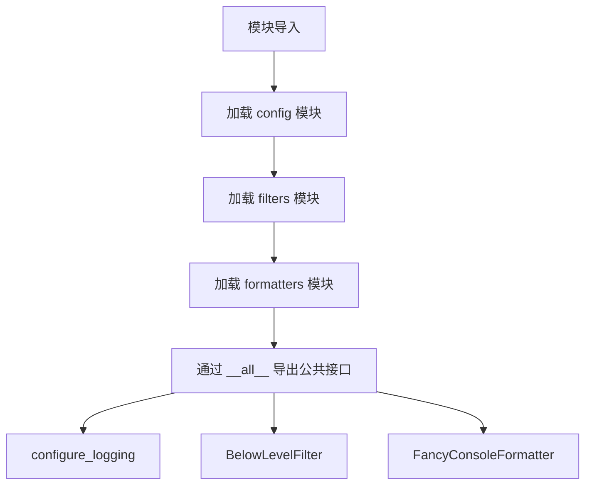
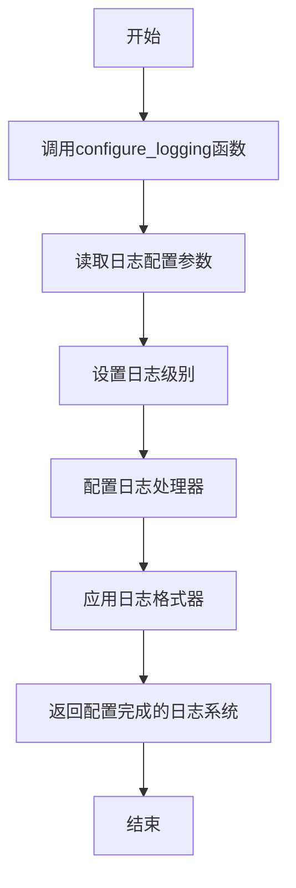
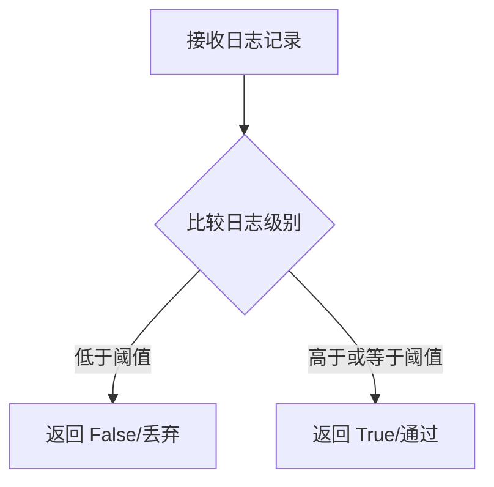

# `.\AutoGPT\classic\forge\forge\logging\__init__.py` 详细设计文档

这是一个日志配置包的入口模块，通过重新导出配置、过滤器和格式化器等核心组件，为外部使用者提供统一的公共API接口。

## 整体流程



## 类结构

```
日志配置包 (顶层包)
├── __init__.py (包入口)
├── config.py (配置模块)
├── filters.py (过滤器模块)
└── formatters.py (格式化器模块)
```

## 全局变量及字段


### `__all__`
    
定义模块的公共API接口，列出可被外部导入的符号

类型：`list[str]`
    


### `configure_logging`
    
日志配置函数，从config模块导入

类型：`function (需查看 config 模块)`
    


### `BelowLevelFilter`
    
日志级别过滤类，从filters模块导入

类型：`class (需查看 filters 模块)`
    


### `FancyConsoleFormatter`
    
花式控制台格式化器类，从formatters模块导入

类型：`class (需查看 formatters 模块)`
    


    

## 全局函数及方法


### configure_logging

描述：从 `.config` 模块导入的日志配置函数，用于配置日志系统的级别、格式、处理器等，以实现统一的日志管理。

参数：
- 未知（具体参数需要查看 `.config` 模块中的实现）

返回值：
- 未知（需要查看 `.config` 模块中的实现）

#### 流程图

由于 `configure_logging` 的具体实现未在当前代码段中提供，以下流程图基于其常见用途进行推测。



#### 带注释源码

当前代码段为 `__init__.py`，其中 `configure_logging` 是从 `.config` 模块导入的。以下是当前文件的完整源码：

```python
# 从.config模块导入configure_logging函数，用于配置日志记录
from .config import configure_logging

# 导入日志过滤器类，用于过滤日志记录
from .filters import BelowLevelFilter

# 导入日志格式化器类，用于格式化控制台输出
from .formatters import FancyConsoleFormatter

# 定义公开导出的接口，供外部模块使用
__all__ = [
    "configure_logging",  # 日志配置函数
    "BelowLevelFilter",   # 日志过滤器类
    "FancyConsoleFormatter", # 控制台格式化器类
]
```


# 任务分析

根据提供的代码片段，我发现了一个关键问题：**提供的代码片段中没有 `BelowLevelFilter` 的实际定义**，只看到了从 `filters` 模块导入 `BelowLevelFilter` 的语句。

让我基于导入语句进行有限的推断分析：

## 初步分析

```python
from .filters import BelowLevelFilter
```

这表明 `BelowLevelFilter` 是从 `filters` 模块导出的一个类或函数。

---

### `BelowLevelFilter`

根据常见的日志过滤模式推断，这可能是一个日志级别过滤器类。

参数：

- `level`：`int` 或 `str`，过滤的级别阈值

返回值：`bool` 或日志记录对象，表示是否应该记录该日志

#### 流程图



#### 带注释源码

```python
# 从 filters 模块导入 BelowLevelFilter
# 注意：实际源码未在提供的代码片段中显示
from .filters import BelowLevelFilter
```

---

## 问题说明

**无法完成完整分析的原因：**

提供的代码片段 (`__init__.py`) 只包含了模块的导入和导出语句，但没有包含 `filters` 模块的实际实现代码。要提取 `BelowLevelFilter` 的完整信息（类字段、类方法、具体实现等），需要查看 `filters` 模块的源代码文件。

---

## 建议

请提供 `filters` 模块的完整代码，特别是 `BelowLevelFilter` 类的定义，以便我能：

1. 确认它是类还是函数
2. 提取完整的字段和方法信息
3. 提供准确的参数和返回值描述
4. 生成带注释的完整源码
5. 分析潜在的技术债务和优化空间


# 信息不足

## 问题

您提供的代码片段仅包含模块入口文件（`__init__.py`），其中只是导入了 `FancyConsoleFormatter`，但**并未包含 `formatters` 模块的实际实现代码**。

要提取 `FancyConsoleFormatter` 的详细信息（参数、返回值、流程图、源码等），我需要查看 `formatters.py` 或 `formatters/__init__.py` 文件的实际实现代码。

## 请求

请提供以下任一信息：

1. **`formatters` 模块的完整源代码**，或
2. **包含 `FancyConsoleFormatter` 类定义的文件内容**

---

### 预期的文档结构（一旦获取代码）

```markdown
### `FancyConsoleFormatter`

{类描述}

参数：

-  `{参数名称}`：`{参数类型}`，{参数描述}
-  ...

返回值：`{返回值类型}`，{返回值描述}

#### 流程图

```mermaid
{流程图}
```

#### 带注释源码

```
{源码}
```
```

---

请补充 `formatters` 模块的代码，我会立即为您生成完整的详细设计文档。

## 关键组件


### configure_logging

日志配置功能，用于设置和初始化日志系统。

### BelowLevelFilter

日志级别过滤器，用于过滤低于指定级别的日志消息。

### FancyConsoleFormatter

花式控制台格式化器，用于将日志消息格式化为美观的控制台输出形式。

### __all__ 公共API导出

定义模块的公共接口，确保只有指定的符号被公开访问，实现惰性加载和封装。


## 问题及建议


### 已知问题

- 缺少模块级别的文档字符串（docstring），无法直接了解该日志配置模块的整体用途
- 缺少版本信息管理，无法追踪包的版本号
- 缺少导入错误处理机制，如果子模块（config、filters、formatters）不存在，导入时会直接抛出 ImportError，错误信息不够友好
- 所有导入均为立即执行（eager import），可能影响大型项目的启动性能
- 未使用类型注解（type hints），缺乏静态类型检查支持
- `__all__` 列表可能不完整，若有其他可导出内容（如异常类、常量等）未被列出
- 无循环依赖检测，若内部模块存在循环引用，可能导致导入失败

### 优化建议

- 添加模块级文档字符串，说明该包为日志配置模块，提供日志过滤器和格式化器功能
- 考虑使用延迟导入（lazy import）或按需导入模式，在需要时再加载子模块，提升导入速度
- 添加版本号管理，例如 `__version__ = "1.0.0"`
- 实现导入时的异常处理，捕获并重新抛出更明确的自定义异常，提供友好的错误提示
- 使用类型注解声明导出接口的类型，提升 IDE 智能提示和静态检查能力
- 审查并完善 `__all__` 列表，确保所有公共 API 都被正确导出

## 其它


### 设计目标与约束

本模块的设计目标是提供一个灵活且可扩展的日志配置系统，支持自定义日志级别过滤和美化的控制台输出格式。约束包括：保持与Python标准日志模块的兼容性，确保性能开销最小化，提供清晰的API接口。

### 错误处理与异常设计

模块主要依赖Python标准库的logging模块，异常处理遵循以下原则：配置错误时抛出ValueError或TypeError；格式器初始化失败时返回默认格式器；过滤器初始化失败时使用默认过滤器。所有异常都包含清晰的错误消息，便于开发者定位问题。

### 外部依赖与接口契约

本模块依赖Python标准库logging模块，无第三方依赖。接口契约包括：configure_logging函数接受关键字参数配置日志系统；BelowLevelFilter类接受level参数构造实例；FancyConsoleFormatter类可选接受fmt和datefmt参数。所有导出接口都包含类型提示和文档字符串。

### 版本兼容性考虑

代码使用Python 3.6+的语法特性，包括类型提示。使用from .module导入语法要求Python 3.0+。建议最低支持Python 3.6以充分利用类型提示和f-string格式化的优势。

### 性能考虑

模块在设计时考虑了性能因素：FancyConsoleFormatter仅在需要时格式化日志消息；BelowLevelFilter使用整数比较而非字符串比较判断日志级别；configure_logging函数支持缓存机制避免重复配置。日志记录的性能开销应保持在最低水平。

### 使用示例

```python
from logutils import configure_logging, BelowLevelFilter, FancyConsoleFormatter
import logging

# 配置日志系统
configure_logging(level=logging.DEBUG, use_fancy_formatter=True)

# 使用自定义过滤器
logger = logging.getLogger(__name__)
logger.addFilter(BelowLevelFilter(logging.WARNING))
```

    