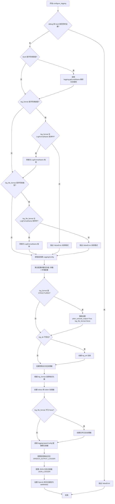

# `.\AutoGPT\classic\forge\forge\logging\config.py` 详细设计文档

Auto-GPT项目的日志模块，负责配置和管理应用的日志系统，支持多种日志格式（simple、debug、structured）、控制台和文件输出、语音输出（TTS）以及结构化日志功能。

## 整体流程

```mermaid
graph TD
    A[开始] --> B[导入依赖模块]
B --> C[定义全局常量和枚举]
C --> D[定义LoggingConfig类]
D --> E{调用configure_logging}
E --> F[解析参数: debug, level, log_format等]
F --> G{参数类型检查}
G --> H[合并环境配置与传入参数]
H --> I{log_format是否为STRUCTURED?}
I -- 是 --> J[强制设置plain_console_output=True, log_file_format=None]
I -- 否 --> K[继续处理]
J --> L[创建日志目录]
K --> L
L --> M{选择格式化器}
M --> N[创建console_handler (stdout/stderr)]
M --> O[创建file_handler (activity/error)]
N --> P[配置根日志记录器]
O --> P
P --> Q[设置语音输出logger]
Q --> R[设置JSON logger]
R --> S[禁用OpenAI调试日志]
S --> T[结束]
```

## 类结构

```
SystemConfiguration (基类)
└── LoggingConfig
```

## 全局变量及字段


### `LOG_DIR`
    
日志文件存储的根目录路径

类型：`Path`
    


### `LOG_FILE`
    
普通活动日志文件名

类型：`str`
    


### `DEBUG_LOG_FILE`
    
调试日志文件名

类型：`str`
    


### `ERROR_LOG_FILE`
    
错误日志文件名

类型：`str`
    


### `SIMPLE_LOG_FORMAT`
    
简单日志输出格式模板

类型：`str`
    


### `DEBUG_LOG_FORMAT`
    
调试日志输出格式模板，包含文件名和行号信息

类型：`str`
    


### `SPEECH_OUTPUT_LOGGER`
    
语音输出专用日志记录器名称

类型：`str`
    


### `USER_FRIENDLY_OUTPUT_LOGGER`
    
用户友好输出专用日志记录器名称

类型：`str`
    


### `LogFormatName`
    
日志格式名称枚举类，支持SIMPLE、DEBUG、STRUCTURED三种格式

类型：`enum.Enum`
    


### `TEXT_LOG_FORMAT_MAP`
    
日志格式名称到具体格式字符串的映射字典

类型：`dict`
    


### `LoggingConfig.level`
    
日志记录级别，控制日志输出的详细程度

类型：`int`
    


### `LoggingConfig.log_format`
    
控制台日志输出格式

类型：`LogFormatName`
    


### `LoggingConfig.plain_console_output`
    
是否禁用控制台输出的颜色和格式化

类型：`bool`
    


### `LoggingConfig.log_dir`
    
日志文件存储的目录路径

类型：`Path`
    


### `LoggingConfig.log_file_format`
    
日志文件输出格式，可为None表示不输出到文件

类型：`Optional[LogFormatName]`
    
    

## 全局函数及方法


### `configure_logging`

该函数用于配置 Python 原生 logging 模块，基于环境配置和指定的参数覆盖。它支持控制台输出、文件输出、结构化日志以及文本转语音(TTS)日志的处理程序设置。

参数：

- `debug`：`bool`，是否启用调试模式，若为 True 则强制设置日志级别为 DEBUG
- `level`：`Optional[int | str]`，日志级别，可接受整数值或字符串形式（如 "INFO"）
- `log_dir`：`Optional[Path]`，日志文件存储目录路径
- `log_format`：`Optional[LogFormatName | str]`，控制台日志格式，指定为简单格式、调试格式或结构化格式
- `log_file_format`：`Optional[LogFormatName | str]`，文件日志格式，与 log_format 类似
- `plain_console_output`：`Optional[bool]`，是否禁用控制台输出的彩色格式
- `config`：`Optional[LoggingConfig]`， LoggingConfig 配置对象，若未提供则从环境变量加载
- `tts_config`：`Optional[TTSConfig]`，文本转语音配置，用于语音输出日志处理器

返回值：`None`，该函数直接操作全局 logging 状态，不返回任何值

#### 流程图



#### 带注释源码

```python
def configure_logging(
    debug: bool = False,
    level: Optional[int | str] = None,
    log_dir: Optional[Path] = None,
    log_format: Optional[LogFormatName | str] = None,
    log_file_format: Optional[LogFormatName | str] = None,
    plain_console_output: Optional[bool] = None,
    config: Optional[LoggingConfig] = None,
    tts_config: Optional[TTSConfig] = None,
) -> None:
    """Configure the native logging module, based on the environment config and any
    specified overrides.

    Arguments override values specified in the environment.
    Overrides are also applied to `config`, if passed.

    Should be usable as `configure_logging(**config.logging.dict())`, where
    `config.logging` is a `LoggingConfig` object.
    """
    # 验证参数互斥：debug 和 level 不能同时设置
    if debug and level:
        raise ValueError("Only one of either 'debug' and 'level' arguments may be set")

    # 解析 level 参数：将字符串转换为整数日志级别
    if isinstance(level, str):
        if type(_level := logging.getLevelName(level.upper())) is int:
            level = _level
        else:
            raise ValueError(f"Unknown log level '{level}'")
    
    # 解析 log_format 参数：支持字符串或枚举值
    if isinstance(log_format, str):
        if log_format in LogFormatName._value2member_map_:
            log_format = LogFormatName(log_format)
        elif not isinstance(log_format, LogFormatName):
            raise ValueError(f"Unknown log format '{log_format}'")
    
    # 解析 log_file_format 参数：支持字符串或枚举值
    if isinstance(log_file_format, str):
        if log_file_format in LogFormatName._value2member_map_:
            log_file_format = LogFormatName(log_file_format)
        elif not isinstance(log_file_format, LogFormatName):
            raise ValueError(f"Unknown log format '{log_format}'")

    # 获取或创建 LoggingConfig：优先使用传入的 config，否则从环境变量加载
    config = config or LoggingConfig.from_env()

    # 聚合环境配置与显式参数：参数优先级高于配置对象属性
    config.level = logging.DEBUG if debug else level or config.level
    config.log_dir = log_dir or config.log_dir
    config.log_format = log_format or (
        LogFormatName.DEBUG if debug else config.log_format
    )
    config.log_file_format = log_file_format or log_format or config.log_file_format
    config.plain_console_output = (
        plain_console_output
        if plain_console_output is not None
        else config.plain_console_output
    )

    # 结构化日志模式：用于云环境，此时禁用文件输出
    if config.log_format == LogFormatName.STRUCTURED:
        config.plain_console_output = True
        config.log_file_format = None

    # 创建日志目录（若不存在）
    if not config.log_dir.exists():
        config.log_dir.mkdir()

    log_handlers: list[logging.Handler] = []

    # 根据日志格式选择控制台格式化器
    if config.log_format in (LogFormatName.DEBUG, LogFormatName.SIMPLE):
        console_format_template = TEXT_LOG_FORMAT_MAP[config.log_format]
        console_formatter = ForgeFormatter(console_format_template)
    else:
        console_formatter = StructuredLoggingFormatter()
        console_format_template = SIMPLE_LOG_FORMAT

    # 创建控制台输出处理器：stdout 处理 WARNING 以下级别，stderr 处理 WARNING 及以上
    stdout = logging.StreamHandler(stream=sys.stdout)
    stdout.setLevel(config.level)
    stdout.addFilter(BelowLevelFilter(logging.WARNING))
    stdout.setFormatter(console_formatter)
    stderr = logging.StreamHandler()
    stderr.setLevel(logging.WARNING)
    stderr.setFormatter(console_formatter)
    log_handlers += [stdout, stderr]

    # 创建文件输出处理器：活动日志和错误日志
    if config.log_file_format is not None:
        if config.level < logging.ERROR:
            file_output_format_template = TEXT_LOG_FORMAT_MAP[config.log_file_format]
            file_output_formatter = ForgeFormatter(
                file_output_format_template, no_color=True
            )

            # INFO 级别活动日志处理器
            activity_log_handler = logging.FileHandler(
                config.log_dir / LOG_FILE, "a", "utf-8"
            )
            activity_log_handler.setLevel(config.level)
            activity_log_handler.setFormatter(file_output_formatter)
            log_handlers += [activity_log_handler]

        # ERROR 级别错误日志处理器
        error_log_handler = logging.FileHandler(
            config.log_dir / ERROR_LOG_FILE, "a", "utf-8"
        )
        error_log_handler.setLevel(logging.ERROR)
        error_log_handler.setFormatter(ForgeFormatter(DEBUG_LOG_FORMAT, no_color=True))
        log_handlers += [error_log_handler]

    # 配置根记录器：设置全局日志级别和处理器
    logging.basicConfig(
        format=console_format_template,
        level=config.level,
        handlers=log_handlers,
    )

    # 配置语音输出日志：可选的文本转语音功能
    speech_output_logger = logging.getLogger(SPEECH_OUTPUT_LOGGER)
    speech_output_logger.setLevel(logging.INFO)
    if tts_config:
        speech_output_logger.addHandler(TTSHandler(tts_config))
    speech_output_logger.propagate = False

    # 配置 JSON 格式日志记录器
    json_logger = logging.getLogger("JSON_LOGGER")
    json_logger.setLevel(logging.DEBUG)
    json_logger.propagate = False

    # 禁用 OpenAI 库的调试日志，避免刷屏
    openai_logger.setLevel(logging.WARNING)
```

## 关键组件


### LoggingConfig

日志配置类，继承自SystemConfiguration，用于存储和管理日志系统的配置参数，包括日志级别、输出格式、控制台输出设置、文件输出路径等，并支持从环境变量读取配置。

### configure_logging

核心日志配置函数，负责初始化和配置Python内置logging模块。该函数解析传入的参数和环境变量，设置控制台和文件日志处理器，支持多种日志格式（simple、debug、structured），并为语音输出和JSON日志创建专用logger。

### LogFormatName

日志格式名称枚举类，定义了三种日志格式：SIMPLE（简单格式）、DEBUG（调试格式，包含文件名和行号）、STRUCTURED（结构化格式，用于云环境）。

### ForgeFormatter

自定义日志格式化器，继承自logging.Formatter，用于将日志记录格式化为可读的文本形式，支持有颜色和无颜色输出。

### StructuredLoggingFormatter

结构化日志格式化器，用于生成符合云环境要求的JSON格式日志，支持结构化数据输出。

### BelowLevelFilter

日志过滤器，用于过滤低于特定级别的日志记录，常用于将WARNING及以上级别的日志输出到stderr，低于WARNING级别的日志输出到stdout。

### TTSHandler

语音输出日志处理器，继承自logging.Handler，用于将日志消息通过TTS（文本转语音）系统输出，用于语音播报场景。

### 日志输出通道

定义了多个专用日志记录器：SPEECH_OUTPUT_LOGGER用于语音输出，USER_FRIENDLY_OUTPUT_LOGGER用于用户友好输出，json_logger用于JSON格式日志。

### 配置常量

包括日志目录(LOG_DIR)、日志文件名(LOG_FILE、DEBUG_LOG_FILE、ERROR_LOG_FILE)、日志格式模板(SIMPLE_LOG_FORMAT、DEBUG_LOG_FORMAT)等，用于定义日志输出的路径和格式规范。


## 问题及建议


### 已知问题

-   **路径硬编码与相对路径问题**：LOG_DIR 使用 `__file__` 相对路径，在不同工作目录或打包环境下可能导致日志目录定位错误
-   **类型检查导入泄漏**：TTSConfig 在 TYPE_CHECKING 块中定义但实际在运行时被使用（第11行导入，第73行使用），可能导致运行时错误
-   **日志配置函数职责过重**：`configure_logging` 函数超过120行，混合了参数解析、配置聚合、目录创建、处理器创建等多个职责
-   **重复代码**：文件输出处理部分存在重复的格式化器创建逻辑（第133-150行）
-   **Python版本兼容性问题**：使用 `int | str` 联合类型语法（Python 3.10+），降低了对旧版本Python的兼容性
-   **资源未显式管理**：创建了多个 FileHandler 但没有提供显式的关闭或刷新机制
-   **配置解析冗余**：log_file_format 的 from_env 重复读取 LOG_FORMAT 环境变量（第53-55行）
-   **异常处理不完善**：配置文件创建目录失败时没有异常捕获和处理

### 优化建议

-   **重构日志配置函数**：将 configure_logging 拆分为多个更小的函数，如 create_console_handlers()、create_file_handlers()、parse_level() 等
-   **统一路径处理**：使用绝对路径或提供配置选项，避免硬编码的相对路径
-   **添加资源管理**：使用上下文管理器或提供 teardown 函数确保文件句柄正确关闭
-   **提取配置解析逻辑**：将环境变量解析逻辑移至 LoggingConfig 类或独立配置类中
-   **增强错误处理**：为目录创建、文件操作添加 try-except 块和适当的错误信息
-   **类型注解兼容性**：考虑使用 Optional[X] 替代 X | None 以支持更低版本的 Python
-   **消除重复代码**：提取公共的 ForgeFormatter 创建逻辑为独立函数
-   **添加类型提示文件**：将 TTSConfig 移出 TYPE_CHECKING 块或使用延迟导入
-   **日志配置验证**：在 configure_logging 开始时添加参数验证，确保配置一致性
-   **添加日志轮转**：考虑使用 RotatingFileHandler 替代 FileHandler，避免日志文件无限增长


## 其它


### 设计目标与约束

本日志模块的设计目标是提供灵活、可配置的日志系统，支持控制台输出、文件输出、结构化日志和语音输出等多种日志方式。约束包括：必须兼容Python标准logging模块、支持环境变量配置、支持DEBUG/INFO/WARNING/ERROR级别日志、结构化日志仅用于云环境且禁用文件输出。

### 错误处理与异常设计

主要异常场景包括：1) `debug`和`level`参数互斥，传入两者时抛出`ValueError`；2) 未知的日志级别名称抛出`ValueError`；3) 未知的日志格式名称抛出`ValueError`；4) 日志目录创建失败时由`mkdir()`抛出`OSError`。异常处理策略采用快速失败（fail-fast）模式，在配置阶段验证参数有效性。

### 数据流与状态机

日志配置流程状态机包含以下状态：1) 初始状态（默认配置）；2) 参数解析状态（解析level、format等字符串值）；3) 配置合并状态（环境配置与传入参数合并）；4) 结构化日志检测状态（判断是否启用结构化日志）；5) 处理器创建状态（创建console和file handlers）；6) 最终配置状态（配置root logger和专用logger）。状态转换由`configure_logging`函数顺序执行。

### 外部依赖与接口契约

核心依赖包括：1) `openai._base_client.log` - 用于控制OpenAI库的日志级别；2) `forge.models.config.SystemConfiguration` - 配置基类；3) `forge.speech.TTSConfig` - 语音输出配置（可选）；4) 本地模块`.filters.BelowLevelFilter`、`.formatters.ForgeFormatter`和`.handlers.TTSHandler`。接口契约：`configure_logging`接受可选参数覆盖环境配置，返回None，参数类型必须符合类型注解。

### 配置管理策略

采用分层配置策略，优先级从低到高为：1) 代码默认值；2) 环境变量（通过`from_env`参数）；3) 函数调用参数。`LoggingConfig`类继承`SystemConfiguration`，支持配置序列化（dict）和反序列化。配置变更通过重新调用`configure_logging`实现，不支持运行时动态更新。

### 日志级别策略

采用分级日志策略：1) DEBUG级别 - 写入debug.log和activity.log；2) INFO级别 - 仅写入activity.log；3) WARNING级别 - 输出到控制台stderr；4) ERROR级别 - 写入error.log。控制台输出通过`BelowLevelFilter`过滤，WARNING及以上级别输出到stderr，低于WARNING输出到stdout。语音输出（TTS）固定使用INFO级别。

### 线程安全性考虑

本模块本身是线程安全的，因为`logging.basicConfig`在Python 3.8+对root logger的配置是线程安全的。但需要注意：1) 多次调用`configure_logging`可能产生意外行为（handlers累积）；2) 专用logger（SPEECH_OUTPUT_LOGGER、JSON_LOGGER）的配置不是线程安全的，建议在主线程初始化阶段调用；3) 文件写入操作由`logging.FileHandler`内部同步。

### 性能考虑

性能优化点：1) 结构化日志格式下跳过文件handler创建，减少I/O；2) 使用`no_color=True`参数避免ANSI转义序列处理开销；3) OpenAI库日志级别设置为WARNING，减少不必要的日志处理开销。潜在性能问题：1) 频繁创建Path对象（`config.log_dir / LOG_FILE`）；2) 字符串格式化模板在每次日志输出时解析，可考虑预编译。

### 安全性考虑

安全相关设计：1) `BelowLevelFilter`防止低于WARNING的消息输出到stderr；2) 日志文件路径通过配置控制，防止路径遍历攻击；3) 支持结构化日志（JSON格式）避免日志注入攻击。但缺少：1) 敏感信息过滤机制（需配合filters模块）；2) 日志文件权限控制；3) 日志内容脱敏处理。

### 兼容性考虑

Python版本兼容性：通过`from __future__ import annotations`支持类型注解的延迟求值（Python 3.7+）。日志格式兼容性：`DEBUG_LOG_FORMAT`包含文件名和行号，生产环境可使用`SIMPLE_LOG_FORMAT`减少信息泄露。日志文件格式：使用UTF-8编码和追加模式（"a"），确保多进程写入安全。

### 扩展性设计

扩展点包括：1) `LogFormatName`枚举可添加新的日志格式（如JSON、XML）；2) 可通过添加新的Handler实现不同的输出目标（如syslog、数据库）；3) `TEXT_LOG_FORMAT_MAP`可扩展支持更多格式模板；4) 专用logger（SPEECH_OUTPUT_LOGGER、JSON_LOGGER）可扩展支持新的日志用途。模块化设计将filters、formatters、handlers分离到子模块，便于单独扩展。

### 测试策略建议

测试应覆盖：1) 参数验证测试（debug+level互斥、未知level/format报错）；2) 配置合并测试（环境变量与参数优先级）；3) 结构化日志检测逻辑测试；4) Handler创建测试（console和file handlers数量和类型）；5) 日志输出格式测试（不同format的输出内容）；6) 多线程并发调用测试；7) 异常场景测试（目录创建失败、权限问题）。


    