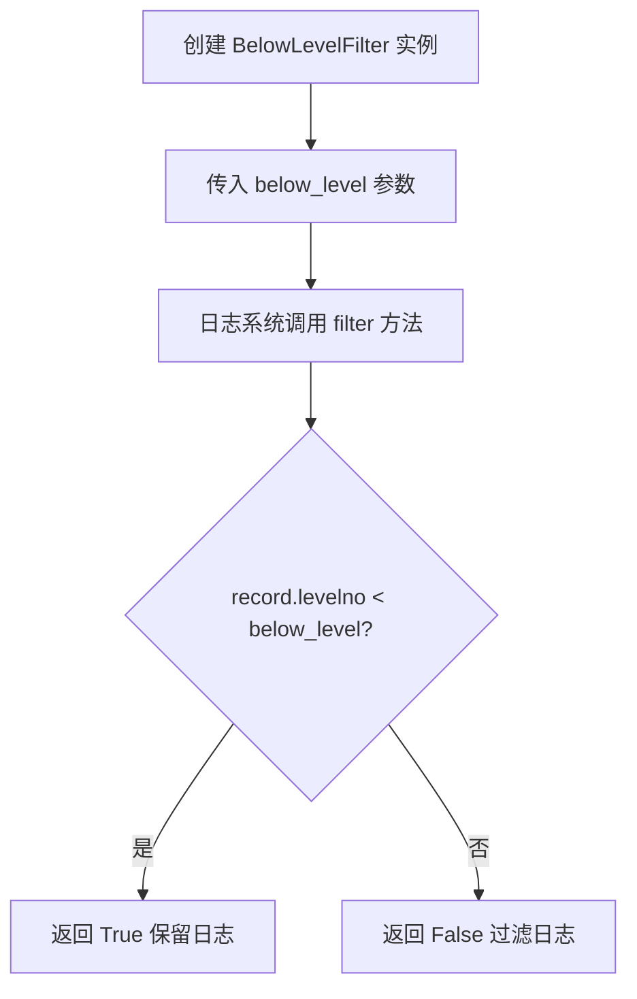
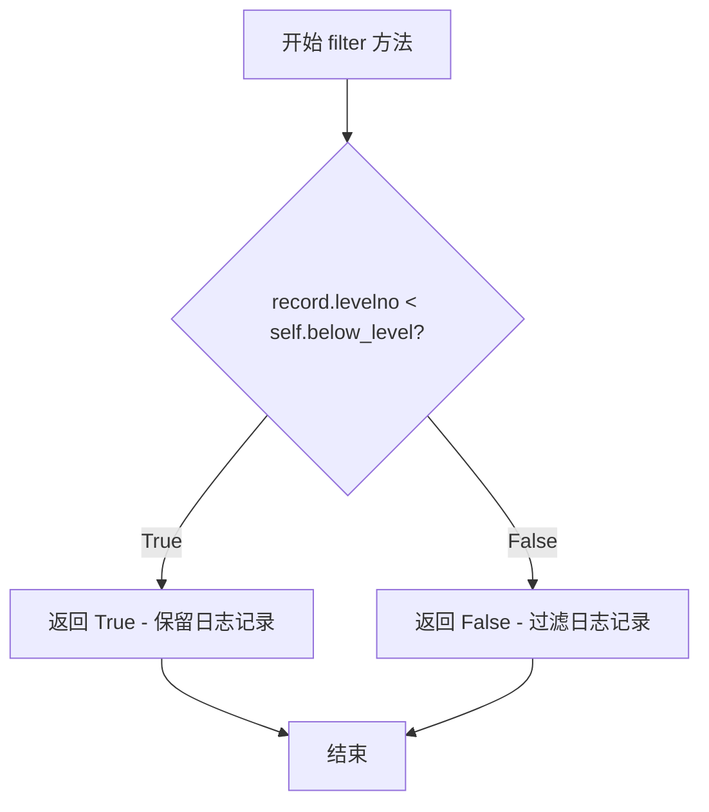

# `.\AutoGPT\classic\forge\forge\logging\filters.py` 详细设计文档

这是一个日志级别过滤组件，用于过滤掉日志级别低于指定阈值的日志记录，确保只有特定级别以上的日志被记录。

## 整体流程



## 类结构

```
logging.Filter (Python内置基类)
└── BelowLevelFilter (自定义过滤类)
```

## 全局变量及字段


### `BelowLevelFilter.below_level`
    
日志级别阈值，低于此级别的日志将被过滤

类型：`int`
    
    

## 全局函数及方法


### `BelowLevelFilter.__init__`

初始化过滤器的级别阈值，用于设置日志过滤的级别下限。

参数：

- `below_level`：`int`，日志级别阈值，指定低于该级别的日志会被过滤掉

返回值：`None`，初始化方法无返回值

#### 流程图

```mermaid
flowchart TD
    A[开始 __init__] --> B[调用 super().__init__ 初始化父类]
    B --> C[将 below_level 参数赋值给实例属性 self.below_level]
    C --> D[结束 __init__，返回 None]
```

#### 带注释源码

```python
def __init__(self, below_level: int):
    """
    初始化过滤器的级别阈值。
    
    参数:
        below_level: int, 日志级别阈值，低于该级别的日志将被过滤掉
    返回值:
        None
    """
    super().__init__()  # 调用父类 logging.Filter 的初始化方法
    self.below_level = below_level  # 存储日志级别阈值到实例属性
```


### `BelowLevelFilter.filter`

判断日志记录是否应被保留，返回True表示保留，False表示过滤

参数：

- `record`：`logging.LogRecord`，日志记录对象

返回值：`bool`，判断日志记录是否应被保留，返回True表示保留，False表示过滤

#### 流程图



#### 带注释源码

```python
def filter(self, record: logging.LogRecord):
    """
    过滤日志记录，判断是否应保留该日志。
    
    参数:
        record: logging.LogRecord - 日志记录对象，包含日志级别等信息
    
    返回:
        bool - True表示保留该日志记录，False表示过滤掉
    """
    # 比较日志记录的级别数值与阈值的大小
    # 如果日志级别低于设定阈值，返回True（保留该日志）
    # 如果日志级别大于等于设定阈值，返回False（过滤掉该日志）
    return record.levelno < self.below_level
```

## 关键组件


### BelowLevelFilter 类

日志级别过滤器类，用于过滤低于指定级别的日志记录。

### below_level 字段

整数类型，存储日志级别阈值，用于判断哪些日志记录需要被过滤。

### __init__ 方法

构造函数，初始化 BelowLevelFilter 类的实例，设置过滤的日志级别阈值。

### filter 方法

过滤方法，判断日志记录级别是否低于阈值，返回布尔值决定是否记录该日志。


## 问题及建议


### 已知问题

-   缺少方法文档字符串：`__init__` 和 `filter` 方法没有详细的参数和返回值说明
-   参数类型不够精确：`below_level` 使用 `int` 类型而非 `logging.Level`（虽然实际值是整数，但使用类型别名更具语义性）
-   缺少参数验证：未对 `below_level` 参数进行有效性校验，未检查是否在合法的日志级别范围内（0-50）
-   `filter` 方法返回类型未标注：应显式声明返回类型为 `bool`
-   可变成员变量无保护：`below_level` 在初始化后可被修改，可能导致不一致状态
-   内存优化缺失：未使用 `__slots__` 减少内存开销

### 优化建议

-   为 `__init__` 和 `filter` 方法添加完整的文档字符串，说明参数和返回值含义
-   使用类型提示 `below_level: logging.Level` 或定义类型别名增强可读性
-   在 `__init__` 中添加参数验证：`if not isinstance(below_level, int) or not (0 <= below_level <= 50): raise ValueError(...)`
-   为 `filter` 方法添加返回类型注解：`def filter(self, record: logging.LogRecord) -> bool:`
-   考虑使用 `__slots__` 优化内存：`__slots__ = ('below_level',)`
-   考虑使用 `logging.DEBUG` 等常量替代裸数字，提高代码可维护性
-   可考虑将类设计为不可变对象，使用私有属性并提供只读访问器


## 其它


### 设计目标与约束

本类的设计目标是提供一个轻量级的日志过滤机制，用于在日志处理器层面过滤掉低于指定级别的日志记录。设计约束包括：1）必须继承自logging.Filter以符合Python日志框架的插件体系；2）过滤逻辑应保持简洁高效，避免复杂的计算；3）below_level参数应为整数类型，对应logging模块的级别常量（DEBUG=10, INFO=20, WARNING=30, ERROR=40, CRITICAL=50）。

### 错误处理与异常设计

本类的设计遵循"快速失败"原则，在初始化时直接接受整数类型的level参数，不进行额外的类型校验或异常捕获。调用方应在传入参数前确保类型正确。如果传入非整数类型，将在上层logging模块处理时抛出TypeError。这种设计保持了代码的简洁性，将错误处理责任交给调用者。

### 数据流与状态机

数据流遵循以下路径：日志记录（LogRecord）→ 日志处理器（Handler）→ 过滤器链（FilterChain）→ BelowLevelFilter.filter() → 决定是否放行。本类作为过滤器链中的一个节点，不改变日志记录本身，仅通过返回布尔值决定是否放行。状态机简单明确：filter方法接收LogRecord，根据record.levelno < self.below_level的比较结果返回True（放行）或False（拦截）。

### 外部依赖与接口契约

本类依赖Python标准库中的logging模块。具体依赖包括：1）logging.Filter作为基类；2）logging.LogRecord作为filter方法的参数类型。接口契约方面，filter方法必须接受一个logging.LogRecord参数并返回布尔值，返回True表示日志记录应被处理，返回False表示应被过滤。

### 性能考虑与优化空间

当前实现性能开销极低，仅包含一次整数比较操作。潜在的优化空间包括：1）如果需要支持动态调整过滤级别，可考虑添加set_below_level方法；2）对于极端高频日志场景，可将below_level声明为__slots__以减少内存开销；3）当前实现对每次日志都会创建新的filter调用，可考虑添加缓存机制（但当前场景下必要性不大）。

### 使用示例与集成方式

```python
import logging
import sys

# 创建logger
logger = logging.getLogger(__name__)
logger.setLevel(logging.DEBUG)

# 创建handler并设置级别
handler = logging.StreamHandler(sys.stdout)
handler.setLevel(logging.DEBUG)

# 添加BelowLevelFilter，过滤INFO级别以下的日志（即只显示INFO及以上）
filter_obj = BelowLevelFilter(logging.INFO)
handler.addFilter(filter_obj)

# 绑定handler到logger
logger.addHandler(handler)

# 测试输出
logger.debug("Debug message")    # 被过滤
logger.info("Info message")      # 被过滤
logger.warning("Warning message") # 显示
logger.error("Error message")    # 显示
```

### 线程安全性分析

本类的实例状态仅包含一个整数属性below_level，该属性在初始化后只读，不涉及线程间共享状态的修改操作。因此，本类是线程安全的，可以在多线程环境中放心使用，无需额外的同步机制。

### 扩展性与未来考虑

未来可能的扩展方向包括：1）支持多级别范围的过滤（如同时过滤多个级别区间）；2）支持基于日志消息内容的过滤；3）支持动态调整过滤规则而无需重建Filter实例；4）添加日志级别名称的解析支持（接受字符串如"INFO"并自动转换为整数）。当前设计为单一职责原则的体现，保持了良好的可扩展性基础。


    