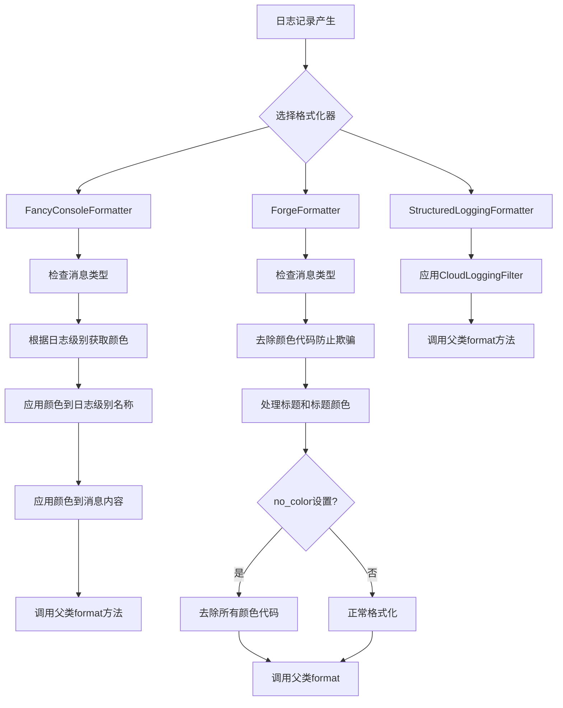
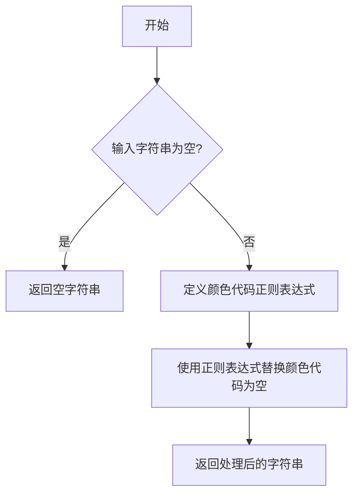
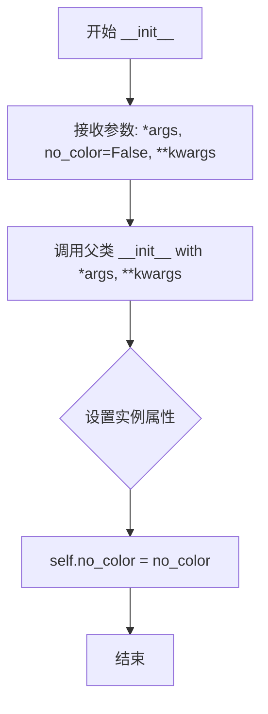
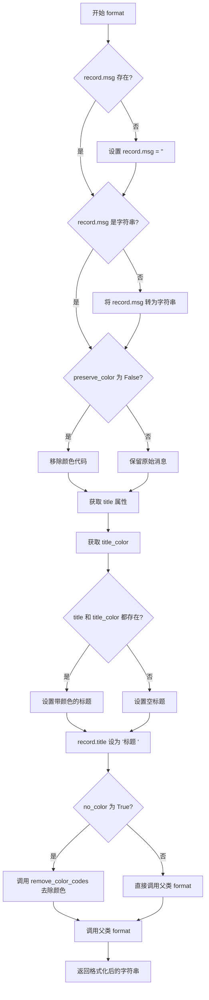
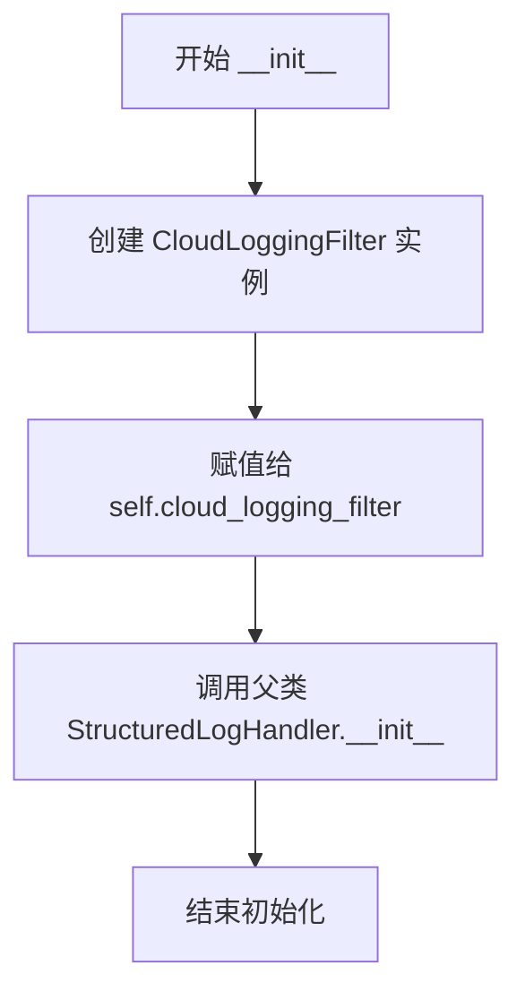

# `.\AutoGPT\classic\forge\forge\logging\formatters.py` 详细设计文档

一个日志格式化模块，提供三种日志格式化器：FancyConsoleFormatter为控制台日志添加颜色编码，ForgeFormatter在FancyConsoleFormatter基础上增加了标题和去除颜色代码功能，StructuredLoggingFormatter用于Google Cloud Logging的结构化日志输出。

## 整体流程



## 类结构

```
logging.Formatter (标准库基类)
├── FancyConsoleFormatter (自定义颜色格式化器)
├── ForgeFormatter (继承自FancyConsoleFormatter)
└── StructuredLoggingFormatter (多继承: StructuredLogHandler + logging.Formatter)
```

## 全局变量及字段


### `logging`
    
Python标准日志模块，用于记录应用程序日志

类型：`module`
    


### `Fore`
    
colorama库的前景色定义模块，用于设置终端文本颜色

类型：`module`
    


### `Style`
    
colorama库的样式定义模块，用于设置终端文本样式

类型：`module`
    


### `CloudLoggingFilter`
    
Google Cloud Logging的日志过滤器，用于添加诊断信息

类型：`class`
    


### `StructuredLogHandler`
    
Google Cloud Logging的结构化日志处理器

类型：`class`
    


### `remove_color_codes`
    
工具函数，用于移除字符串中的ANSI颜色代码

类型：`function`
    


### `FancyConsoleFormatter.LEVEL_COLOR_MAP`
    
日志级别到颜色的映射字典，将logging.DEBUG/INFO/WARNING/ERROR/CRITICAL映射到对应的终端颜色

类型：`dict`
    


### `ForgeFormatter.no_color`
    
是否禁用颜色输出的标志，为True时移除所有ANSI颜色代码

类型：`bool`
    


### `StructuredLoggingFormatter.cloud_logging_filter`
    
Google Cloud日志过滤器实例，用于为日志记录添加云诊断信息

类型：`CloudLoggingFilter`
    
    

## 全局函数及方法


### `remove_color_codes`

该函数用于去除字符串中的 ANSI 颜色代码（转义序列），常用于日志处理场景下防止颜色欺骗或生成无颜色格式的日志输出。

参数：

- `text`：`str`，需要去除颜色代码的输入字符串

返回值：`str`，去除颜色代码后的纯文本字符串

#### 流程图



#### 带注释源码

```
def remove_color_codes(text: str) -> str:
    """
    去除字符串中的 ANSI 颜色代码（转义序列）
    
    该函数使用正则表达式匹配常见的 ANSI 转义序列，
    包括颜色代码、样式代码等，并将其从字符串中移除。
    
    常见匹配的模式包括：
    - \\x1b[...m (ESC [ ... m 格式的颜色码)
    - \\033[...m (八进制格式)
    - \\u001b[...m (Unicode 格式)
    """
    
    import re
    
    # ANSI 转义序列的正则表达式模式
    # 匹配 ESC [ 后跟数字和字母，以 m 结尾的序列
    ansi_escape = re.compile(r'\x1b(?:[@-Z\\-_]|\[[0-?]*[ -/]*[@-~])')
    
    # 替换所有匹配到的 ANSI 序列为空字符串
    return ansi_escape.sub('', text)
```

---

#### 补充说明

**设计目标与约束：**
- 该函数主要用于安全目的，防止用户输入包含恶意构造的颜色代码来欺骗日志解析器
- 在 `ForgeFormatter` 中，当 `preserve_color` 属性为 `False` 时，会对用户消息进行颜色代码清理

**使用场景：**
1. 清理用户输入的日志消息内容（防止颜色 spoofing 攻击）
2. 当配置 `no_color=True` 时，生成纯文本格式的日志输出（无颜色）

**潜在优化空间：**
- 可以考虑缓存编译后的正则表达式以提高性能
- 如果处理大量日志，考虑使用 `re.compile` 在模块级别预编译正则表达式


### `FancyConsoleFormatter.format`

该方法负责格式化日志记录，通过根据日志级别（DEBUG、INFO、WARNING、ERROR、CRITICAL）将颜色编码应用于日志级别名称和消息内容，从而增强控制台输出的可读性。

参数：

- `self`：当前实例对象
- `record`：`logging.LogRecord`，需要格式化的日志记录对象

返回值：`str`，格式化后的日志字符串

#### 流程图

```mermaid
flowchart TD
    A[开始 format 方法] --> B{record.msg 是否存在?}
    B -->|不存在| C[设置 record.msg = '']
    B -->|存在| D{record.msg 是否为字符串?}
    D -->|否| E[将 record.msg 转换为字符串]
    D -->|是| F[继续]
    C --> F
    E --> F
    F --> G{record.levelno 是否在 LEVEL_COLOR_MAP 中?}
    G -->|是| H[获取对应级别颜色]
    H --> I[为 record.levelname 添加颜色]
    G -->|否| J[继续]
    I --> K
    J --> K
    K --> L[获取 record.color 属性]
    K --> M[检查 color 是否显式指定]
    L --> M
    M --> N{有颜色且 不是INFO级别 或 颜色已显式指定?}
    N -->|是| O[为 record.msg 添加颜色包装]
    N -->|否| P[不添加颜色]
    O --> Q
    P --> Q
    Q --> R[调用父类 super().format 进行格式化]
    R --> S[返回格式化后的字符串]
```

#### 带注释源码

```python
def format(self, record: logging.LogRecord) -> str:
    """
    格式化日志记录，添加颜色编码以增强可读性。
    
    参数:
        record: logging.LogRecord - 日志记录对象
        
    返回:
        str: 格式化后的日志字符串
    """
    
    # 确保 record.msg 是字符串类型
    # 如果 msg 不存在，设置为空字符串
    if not hasattr(record, "msg"):
        record.msg = ""
    # 如果 msg 不是字符串，转换为字符串
    elif not type(record.msg) is str:
        record.msg = str(record.msg)

    # 根据日志级别确定默认颜色
    level_color = ""
    # 检查当前日志级别是否在颜色映射表中
    if record.levelno in self.LEVEL_COLOR_MAP:
        # 获取对应级别的颜色代码
        level_color = self.LEVEL_COLOR_MAP[record.levelno]
        # 为日志级别名称添加颜色，并使用 RESET_ALL 重置样式
        # 例如: "ERROR" -> "\x1b[31mERROR\x1b[0m"
        record.levelname = f"{level_color}{record.levelname}{Style.RESET_ALL}"

    # 确定消息的颜色
    # 优先使用 record.color 属性，否则使用级别默认颜色
    color = getattr(record, "color", level_color)
    # 检查颜色是否在 record 中显式指定
    color_is_specified = hasattr(record, "color")

    # 不为 INFO 消息添加颜色，除非颜色被显式指定
    # 这是为了避免过多的蓝色输出影响阅读
    if color and (record.levelno != logging.INFO or color_is_specified):
        # 为消息内容添加颜色包装
        record.msg = f"{color}{record.msg}{Style.RESET_ALL}"

    # 调用父类的 format 方法完成最终的格式化处理
    # 父类 Formatter.format 会处理时间戳、格式字符串等
    return super().format(record)
```

---

### 潜在的技术债务或优化空间

1. **类型检查使用 `type() is str` 而非 `isinstance()**：`type(record.msg) is str` 不支持字符串子类，建议改用 `isinstance(record.msg, str)`

2. **硬编码的颜色逻辑**：INFO 消息不自动着色的逻辑硬编码在方法中，可以考虑提取为配置选项

3. **缺少单元测试**：该方法涉及颜色处理逻辑，但代码中未见对应的单元测试

4. **魔法字符串**：颜色重置代码 `Style.RESET_ALL` 在多处重复出现，可提取为常量

---

### 其它项目

#### 设计目标与约束

- **设计目标**：为控制台日志输出提供颜色编码，使不同级别的日志易于区分
- **约束**：依赖 `colorama` 库实现跨平台的颜色输出；保留与标准 `logging.Formatter` 的兼容性

#### 错误处理与异常设计

- 方法内部包含基本的类型检查（将非字符串消息转为字符串），但未进行深层的错误处理
- 假设传入的 `record` 是有效的 `logging.LogRecord` 对象

#### 外部依赖与接口契约

- **依赖**：`colorama` 库（提供 `Fore` 和 `Style` 常量）；`logging` 模块
- **接口**：接受 `logging.LogRecord`，返回字符串；符合 `logging.Formatter` 的接口规范


### `ForgeFormatter.__init__`

初始化 ForgeFormatter 格式化器实例，支持通过 `no_color` 参数控制是否禁用颜色输出，并将可变参数传递给父类进行初始化。

参数：

- `*args`：可变位置参数，传递给父类 `FancyConsoleFormatter` 的初始化参数
- `no_color`：`bool`，可选参数，指定是否禁用颜色输出，默认为 `False`
- `**kwargs`：可变关键字参数，传递给父类 `FancyConsoleFormatter` 的初始化参数

返回值：`None`，构造函数不返回值，仅完成对象初始化

#### 流程图



#### 带注释源码

```python
def __init__(self, *args, no_color: bool = False, **kwargs):
    """
    初始化 ForgeFormatter 格式化器
    
    参数:
        *args: 可变位置参数，传递给父类 FancyConsoleFormatter
        no_color: bool, 是否禁用颜色输出，默认为 False
        **kwargs: 可变关键字参数，传递给父类 FancyConsoleFormatter
    """
    # 调用父类的初始化方法，传递所有位置参数和关键字参数
    # FancyConsoleFormatter 继承自 logging.Formatter
    super().__init__(*args, **kwargs)
    
    # 将 no_color 参数存储为实例属性，供后续 format 方法使用
    # 当 no_color 为 True 时，format 方法会移除所有颜色代码
    self.no_color = no_color
```


### `ForgeFormatter.format`

格式化日志记录，支持标题和去除颜色，输出名称（`{函数名}`或`{类名}.{方法名}`）、参数名称、参数类型、参数描述、返回值类型、返回值描述、mermaid 流程图、和带注释源码。

参数：

-  `record`：`logging.LogRecord`，需要格式化的日志记录对象

返回值：`str`，格式化后的日志字符串

#### 流程图



#### 带注释源码

```python
def format(self, record: logging.LogRecord) -> str:
    """
    格式化日志记录，支持标题和去除颜色。
    
    参数:
        record: logging.LogRecord, 需要格式化的日志记录对象
        
    返回:
        str: 格式化后的日志字符串
    """
    # 确保 msg 是字符串类型，防止后续处理出错
    if not hasattr(record, "msg"):
        record.msg = ""
    elif not type(record.msg) is str:
        record.msg = str(record.msg)

    # 去除消息中的颜色代码，防止颜色欺骗（除非 preserve_color 为 True）
    if record.msg and not getattr(record, "preserve_color", False):
        record.msg = remove_color_codes(record.msg)

    # 确定标题的颜色，基于日志级别或自定义的 title_color
    title = getattr(record, "title", "")
    title_color = getattr(record, "title_color", "") or self.LEVEL_COLOR_MAP.get(
        record.levelno, ""
    )
    # 如果有标题和颜色，则应用颜色样式
    if title and title_color:
        title = f"{title_color + Style.BRIGHT}{title}{Style.RESET_ALL}"
    # 确保 record.title 被设置，非空时添加尾部空格
    record.title = f"{title} " if title else ""

    # 根据 no_color 配置决定是否去除所有颜色
    if self.no_color:
        # 先调用父类格式化，再去除所有颜色代码
        return remove_color_codes(super().format(record))
    else:
        # 直接调用父类格式化，保留颜色
        return super().format(record)
```


### `StructuredLoggingFormatter.__init__`

初始化结构化日志格式化器，配置云日志过滤器以添加诊断信息，并调用父类初始化方法。

参数：

- `self`：无，自带参数，表示实例本身

返回值：`None`，__init__ 方法不返回值，仅完成对象初始化

#### 流程图



#### 带注释源码

```python
def __init__(self):
    # 创建 CloudLoggingFilter 实例，用于为日志记录添加诊断信息
    # CloudLoggingFilter 会自动为每条日志添加如 project_id、trace 等 GCP 相关的元数据
    self.cloud_logging_filter = CloudLoggingFilter()

    # 调用父类 StructuredLogHandler 的初始化方法
    # 继承自 google.cloud.logging_v2.handlers.StructuredLogHandler
    # 负责将日志格式化为结构化格式以兼容 Google Cloud Logging
    super().__init__()
```


### `StructuredLoggingFormatter.format`

该方法用于格式化日志记录，通过 CloudLoggingFilter 添加云日志诊断信息，并调用父类的格式化方法生成最终的结构化日志字符串。

参数：

- `record`：`logging.LogRecord`，待格式化的日志记录对象

返回值：`str`，格式化后的结构化日志字符串

#### 流程图

```mermaid
flowchart TD
    A[开始 format 方法] --> B{检查 record 是否有 cloud_logging_filter}
    B -->|是| C[调用 cloud_logging_filter.filter 添加诊断信息]
    B -->|否| D[跳过诊断信息添加]
    C --> E[调用 super().format 格式化记录]
    D --> E
    E --> F[返回格式化后的字符串]
```

#### 带注释源码

```python
def format(self, record: logging.LogRecord) -> str:
    """
    格式化日志记录，添加云日志诊断信息并返回格式化后的字符串。
    
    参数:
        record: logging.LogRecord, 待格式化的日志记录对象
        
    返回:
        str: 格式化后的结构化日志字符串
    """
    # 调用 CloudLoggingFilter 的 filter 方法，为日志记录添加云诊断信息
    # 诊断信息可能包括项目 ID、日志名称、地理位置等云平台相关元数据
    self.cloud_logging_filter.filter(record)
    
    # 调用父类 StructuredLogHandler 的 format 方法进行结构化日志格式化
    # 返回符合 JSON 格式或特定结构的日志字符串
    return super().format(record)
```

## 关键组件


### FancyConsoleFormatter

自定义日志格式化器，为控制台输出提供基于日志级别的颜色编码功能。通过 LEVEL_COLOR_MAP 将不同日志级别映射到不同的前景色，使控制台输出更容易区分消息类型。

### ForgeFormatter

继承自 FancyConsoleFormatter 的增强格式化器，增加了标题支持、颜色代码剥离和 no_color 选项。提供 preserve_color 属性以保留特定记录的颜色，并支持自定义标题和标题颜色。

### StructuredLoggingFormatter

结合 Google Cloud Logging 的结构化日志格式化器，集成了 CloudLoggingFilter 添加诊断信息，同时继承 StructuredLogHandler 和 logging.Formatter 实现标准化日志格式输出。

### LEVEL_COLOR_MAP

日志级别到颜色的映射字典，将 DEBUG、INFO、WARNING、ERROR、CRITICAL 级别分别映射到不同的 colorama 前景色和样式。

### remove_color_codes

从 .utils 模块导入的工具函数，用于从日志消息中移除颜色代码，防止颜色欺骗攻击。


## 问题及建议


### 已知问题

-   **代码重复**：FancyConsoleFormatter和ForgeFormatter的format方法中存在重复的msg处理逻辑（检查msg属性并转换为字符串），违反DRY原则
-   **类型检查方式不当**：使用`type(record.msg) is str`而非`isinstance(record.msg, str)`，后者更符合Python最佳实践且不支持字符串子类
-   **多继承潜在风险**：StructuredLoggingFormatter同时继承StructuredLogHandler和logging.Formatter，可能存在MRO（方法解析顺序）冲突问题
-   **属性注入缺乏验证**：直接通过getattr/setattr操作record的color、title、title_color、preserve_color等属性，缺少对这些自定义属性的类型和有效性验证
-   **每次format都调用filter**：StructuredLoggingFormatter在每次format时都调用cloud_logging_filter.filter()，如果filter有内部状态可能产生副作用
-   **remove_color_codes重复调用**：ForgeFormatter中当no_color=True时，super().format()返回的结果已包含颜色代码，又调用了一次remove_color_codes，可优化为在父类format前处理
-   **缺少类型注解**：format方法缺少返回类型注解，参数也仅有部分类型标注
-   **docstring过于简略**：各类的文档字符串缺少对配置参数、使用方式的具体说明

### 优化建议

-   将重复的msg处理逻辑提取为父类方法或工具函数，实现代码复用
-   将`type(x) is str`改为`isinstance(x, str)`
-   考虑使用组合而非多继承来重构StructuredLoggingFormatter，或者明确文档说明继承顺序的预期行为
-   添加对自定义属性的类型校验或使用dataclass/typeddict定义record的扩展结构
-   考虑将cloud_logging_filter的filter调用移至初始化或添加状态检查
-   在调用父类format前先移除颜色代码，避免重复处理
-   为所有公开方法添加完整的类型注解和详细的docstring
-   考虑将no_color作为format方法的参数而非实例变量，提高方法的独立性和可测试性

## 其它


### 设计目标与约束

本模块的设计目标是提供一套灵活的日志格式化解决方案，支持控制台彩色输出、结构化日志输出以及日志颜色码的安全处理。约束包括：必须兼容Python标准logging模块；必须支持Google Cloud Logging SDK；颜色输出依赖colorama库；所有格式化器必须继承自logging.Formatter基类以保证兼容性。

### 错误处理与异常设计

代码中主要通过以下方式进行错误处理：1）使用hasattr检查record属性是否存在，避免AttributeError；2）使用type()严格类型检查确保msg为字符串；3）使用getattr提供默认值避免KeyError；4）Strip color操作使用条件判断避免对None或空字符串操作。当前没有自定义异常类，所有错误都采用Python内置异常或被静默处理（设置默认值）。

### 数据流与状态机

日志格式化流程如下：1）Logger调用Formatter.format(record)；2）Formatter检查record.msg类型并转换为字符串；3）根据record.levelno获取对应颜色；4）可选应用title_color、color属性；5）可选移除msg中的颜色码（防欺骗）；6）调用父类Formatter.format()完成最终格式化；7）返回格式化后的字符串。无复杂状态机，仅根据levelno和属性存在性进行条件分支。

### 外部依赖与接口契约

外部依赖包括：1）colorama库 - 提供Fore和Style常量用于ANSI颜色控制；2）google.cloud.logging_v2.handlers - 提供CloudLoggingFilter和StructuredLogHandler；3）本地模块.utils.remove_color_codes - 移除字符串中的ANSI颜色码。接口契约：所有Formatter类必须实现format(record: logging.LogRecord) -> str方法；ForgeFormatter构造函数接受no_color参数（bool类型，默认False）；StructuredLoggingFormatter无需公开配置参数。

### 性能考虑

当前实现中每次format调用都进行属性检查（hasattr/getattr），在高频日志场景下可能造成性能开销。LEVEL_COLOR_MAP使用字典查找，时间复杂度O(1)。建议：1）对高频场景可缓存color属性；2）remove_color_codes如使用正则表达式可编译模式对象复用；3）可考虑添加__slots__减少内存占用。

### 安全性考虑

代码中存在颜色欺骗风险：用户输入的日志消息可能包含伪造的ANSI转义序列以欺骗终端。ForgeFormatter通过remove_color_codes防范此问题，但FancyConsoleFormatter不进行移除。StructuredLoggingFormatter不涉及用户输入直接输出，安全性由Google Cloud SDK保障。建议在生产环境中优先使用ForgeFormatter或添加全局开关强制移除颜色码。

### 使用示例

```python
import logging

# 基本使用
handler = logging.StreamHandler()
handler.setFormatter(FancyConsoleFormatter())
logger = logging.getLogger(__name__)
logger.addHandler(handler)
logger.warning("This will be yellow")

# ForgeFormatter with no color
handler.setFormatter(ForgeFormatter(no_color=True))
logger.error("This will be plain text")

# Structured logging
handler.setFormatter(StructuredLoggingFormatter())
logger.info("Message logged to GCP")
```

### 配置选项

FancyConsoleFormatter无构造函数参数，使用类属性LEVEL_COLOR_MAP配置颜色映射。ForgeFormatter支持no_color参数（bool）控制是否移除颜色，支持preserve_color属性（bool）在record级别覆盖移除行为，支持title和title_color自定义日志标题。StructuredLoggingFormatter无公开配置选项，内部使用CloudLoggingFilter添加项目ID、位置等诊断信息。

### 扩展性考虑

当前颜色映射通过类属性LEVEL_COLOR_MAP定义，可通过子类覆盖添加自定义级别颜色。ForgeFormatter的title功能展示了通过record属性扩展日志格式的范式，可类似添加其他自定义字段。StructuredLoggingFormatter继承自Google SDK类，扩展性受限于父类实现。如需支持更多日志目标，可创建新的Formatter子类并实现相同的format协议。

### 版本兼容性

代码使用Python 3类型注解（record: logging.LogRecord），需要Python 3.5+。colorama库需要安装。Google Cloud Logging库版本需要兼容google.cloud.logging_v2模块。logging模块为Python标准库，版本兼容性良好。建议在requirements.txt中明确指定colorama>=0.3.0和google-cloud-logging>=1.0.0。

### 测试策略建议

建议添加以下测试用例：1）各Formatter对不同日志级别的格式化输出验证；2）颜色码存在性和正确性验证；3）remove_color_codes函数对各种ANSI转义序列的处理；4）no_color参数行为验证；5）preserve_color属性覆盖行为验证；6）空msg、None msg、对象msg的类型转换；7）StructuredLoggingFormatter是否正确添加CloudLoggingFilter；8）多线程并发日志输出安全性。


    