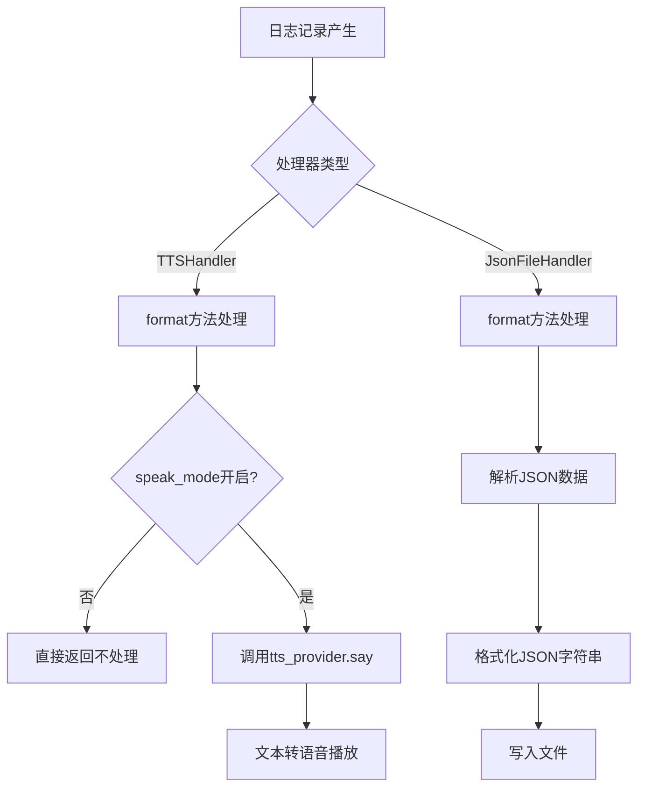
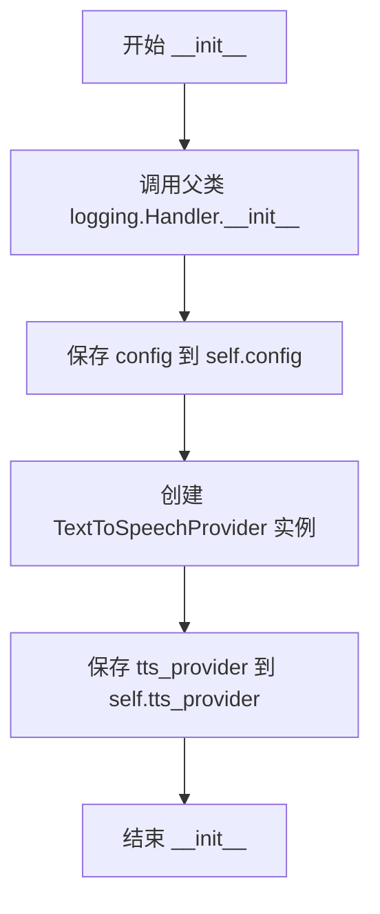
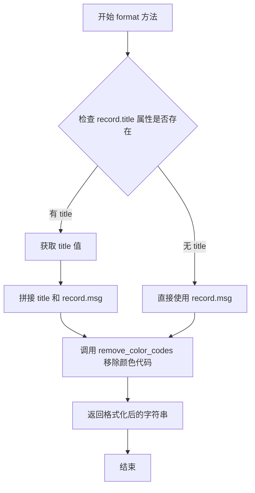
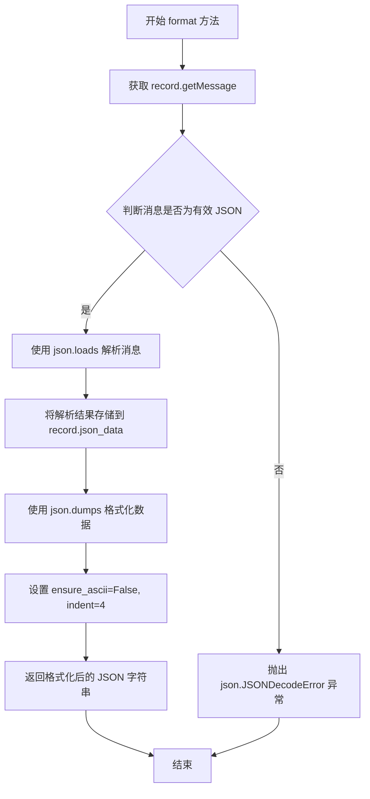
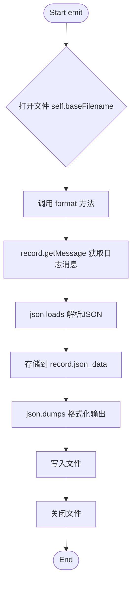

# `.\AutoGPT\classic\forge\forge\logging\handlers.py` 详细设计文档

该模块实现了两个自定义的日志处理器：TTSHandler用于将日志消息通过文本转语音引擎朗读，JsonFileHandler用于将日志消息以格式化的JSON形式写入文件，两者均可集成到Python的logging模块中以扩展日志输出能力。

## 整体流程



## 类结构

```
logging.Handler (内置基类)
└── TTSHandler (自定义TTS日志处理器)
    └── TextToSpeechProvider (依赖注入)
logging.FileHandler (内置基类)
└── JsonFileHandler (自定义JSON文件日志处理器)
```

## 全局变量及字段


### `TTSHandler.config`
    
文本转语音配置对象，包含speak_mode等配置项

类型：`TTSConfig`
    


### `TTSHandler.tts_provider`
    
实际执行文本转语音的提供者实例

类型：`TextToSpeechProvider`
    
    

## 全局函数及方法


### `TTSHandler.__init__`

初始化 TTSHandler 实例，设置日志处理器配置并创建 TTS 提供者实例，用于将日志消息通过语音输出。

参数：

- `config`：`TTSConfig`，TTS 配置对象，包含语音合成引擎的设置参数

返回值：`None`，无返回值

#### 流程图



#### 带注释源码

```python
def __init__(self, config: TTSConfig):
    """
    初始化 TTSHandler
    
    Args:
        config: TTS 配置对象，包含语音合成引擎的设置参数
    """
    # 调用父类 logging.Handler 的初始化方法
    # 设置日志处理器的基础功能
    super().__init__()
    
    # 将传入的 TTS 配置对象保存为实例属性
    # 后续的 emit 方法会使用此配置来判断是否启用语音模式
    self.config = config
    
    # 创建 TTS 提供者实例并保存
    # TextToSpeechProvider 负责实际的语音合成逻辑
    # 接收 config 参数以初始化语音引擎
    self.tts_provider = TextToSpeechProvider(config)
```


### `TTSHandler.format`

格式化日志记录，移除颜色代码，若有title属性则拼接标题和消息内容

参数：

-  `record`：`logging.LogRecord`，日志记录对象

返回值：`str`，移除颜色代码后的格式化日志消息字符串

#### 流程图



#### 带注释源码

```python
def format(self, record: logging.LogRecord) -> str:
    # 检查日志记录是否包含 title 属性
    if getattr(record, "title", ""):
        # 如果存在 title，格式化为 "title 消息内容"
        msg = f"{getattr(record, 'title')} {record.msg}"
    else:
        # 如果不存在 title，仅使用消息内容
        msg = f"{record.msg}"

    # 移除字符串中的终端颜色代码（如 ANSI 转义序列）
    return remove_color_codes(msg)
```


### `TTSHandler.emit`

发送日志消息到TTS引擎朗读，仅在speak_mode开启时执行

参数：

- `record`：`logging.LogRecord`，日志记录对象

返回值：`None`，不返回任何值

#### 流程图

```mermaid
flowchart TD
    A([开始 emit]) --> B{self.config.speak_mode 是否开启?}
    B -->|否| C[直接返回]
    B -->|是| D[调用 self.format(record) 格式化日志消息]
    D --> E[调用 self.tts_provider.say(message) 朗读消息]
    E --> F([结束])
```

#### 带注释源码

```python
def emit(self, record: logging.LogRecord) -> None:
    """
    发送日志消息到TTS引擎朗读，仅在speak_mode开启时执行
    
    参数:
        record: logging.LogRecord, 日志记录对象
    
    返回:
        None
    """
    # 检查是否开启了语音模式，若未开启则直接返回，不进行TTS处理
    if not self.config.speak_mode:
        return

    # 调用format方法对日志记录进行格式化，去除颜色代码并添加标题
    message = self.format(record)
    
    # 使用TTSProvider的say方法将格式化后的消息朗读出来
    self.tts_provider.say(message)
```


### `JsonFileHandler.format`

将日志记录对象中的消息解析为JSON数据，并格式化为带有缩进的易读JSON字符串返回。

参数：

- `record`：`logging.LogRecord`，日志记录对象

返回值：`str`，格式化后的JSON字符串

#### 流程图



#### 带注释源码

```python
def format(self, record: logging.LogRecord) -> str:
    """
    将日志消息解析为JSON并格式化为可读的JSON字符串
    
    参数:
        record: logging.LogRecord, 日志记录对象
        
    返回:
        str, 格式化后的JSON字符串
    """
    # 使用 record.getMessage() 获取日志消息内容
    # 然后使用 json.loads 将消息字符串解析为 Python 对象
    record.json_data = json.loads(record.getMessage())
    
    # 使用 json.dumps 将解析后的数据转换回 JSON 字符串
    # ensure_ascii=False: 允许非ASCII字符（如中文）正常显示
    # indent=4: 使用4个空格缩进，使输出更加易读
    return json.dumps(getattr(record, "json_data"), ensure_ascii=False, indent=4)
```


### `JsonFileHandler.emit`

将格式化后的JSON内容写入到指定的日志文件中。

参数：

- `record`：`logging.LogRecord`，日志记录对象

返回值：`None`，无返回值描述

#### 流程图



#### 带注释源码

```python
def emit(self, record: logging.LogRecord) -> None:
    """
    将格式化后的JSON内容写入到指定的日志文件中。
    
    该方法继承自 logging.FileHandler，
    通过覆写来实现自定义的JSON格式写入功能。
    """
    # 使用 with 语句确保文件正确关闭
    # self.baseFilename 继承自 logging.FileHandler，表示日志文件路径
    # 使用 'w' 模式以写入方式打开，会覆盖原有内容
    # 指定 utf-8 编码以支持多语言字符
    with open(self.baseFilename, "w", encoding="utf-8") as f:
        # 调用 format 方法将 record 转换为格式化的 JSON 字符串
        # 然后写入文件
        f.write(self.format(record))
```

## 关键组件


### TTSHandler (文本转语音日志处理器)

该类是logging.Handler的子类，负责将日志消息通过配置的TTS引擎朗读出来，支持带标题的消息格式化和颜色代码移除。

### JsonFileHandler (JSON文件日志处理器)

该类是logging.FileHandler的子类，负责将日志消息解析为JSON格式并写入文件，支持Unicode字符和格式化输出。

### TextToSpeechProvider (文本转语音提供者)

外部依赖模块，提供say()方法用于将文本转换为语音输出。

### remove_color_codes (颜色代码移除工具)

日志工具模块中的函数，用于移除日志消息中的ANSI颜色代码字符。

### speak_mode (TTS模式开关)

配置属性，控制是否启用语音朗读功能，为False时emit方法直接返回。


## 问题及建议


### 已知问题

-   **异常处理缺失**：TTSHandler.emit()中调用self.tts_provider.say()没有try-except包裹，若TTS引擎抛出异常会导致日志记录中断；JsonFileHandler.format()中json.loads()没有异常处理，当日志消息不是有效JSON时会抛出json.JSONDecodeError导致日志记录失败
-   **JsonFileHandler文件覆盖问题**：emit()方法使用"w"模式打开文件，每次写入都会覆盖之前的内容，导致文件中只保留最后一条日志记录，而非追加写入
-   **JSON解析失败风险**：JsonFileHandler依赖record.getMessage()返回有效的JSON字符串，但如果日志消息使用了格式化参数（如logger.info("User %s logged in", username)），getMessage()可能返回未格式化的模板字符串，导致json.loads()解析失败
-   **资源效率问题**：JsonFileHandler在每次emit()时都打开、写入、关闭文件，没有利用父类FileHandler的文件句柄管理机制，造成频繁的I/O操作
-   **类型检查不完整**：代码中import了TTSConfig用于类型提示，但self.config参数声明使用了运行时类型而非TYPE_CHECKING导入的类型，可能导致类型检查不一致

### 优化建议

-   **添加异常处理**：为TTSHandler.emit()添加try-except捕获TTS相关异常；为JsonFileHandler.format()添加try-except处理JSON解析异常，并设置fallback返回原始消息
-   **修改文件写入模式**：将JsonFileHandler.emit()中的open(self.baseFilename, "w", encoding="utf-8")改为追加模式"a"，或在类初始化时正确使用父类的文件句柄管理
-   **改进JSON提取逻辑**：在format()中检查record.args是否存在且非空，若存在则先将record.msg与args组合后再尝试解析为JSON
-   **优化资源管理**：移除JsonFileHandler.emit()中重复的文件打开操作，利用父类FileHandler已经打开的文件流self.stream进行写入
-   **完善类型注解**：在TTSHandler.__init__参数处使用from __future__ import annotations配合TTSConfig类型提示，确保类型检查的准确性


## 其它


### 设计目标与约束

本模块的设计目标是为日志系统提供两类扩展功能：一是将重要日志通过文本转语音方式输出，实现日志的语音播报；二是将日志以结构化JSON格式持久化到文件，便于后续分析和处理。约束方面，TTSHandler依赖外部TTS引擎配置，JsonFileHandler仅支持单文件写入模式（每次写入覆盖而非追加），两者均继承自Python标准logging模块的Handler基类。

### 错误处理与异常设计

TTSHandler在emit方法中首先检查speak_mode配置标志，若未启用则直接返回，不执行任何操作。JsonFileHandler的emit方法使用with语句确保文件正确关闭，若JSON解析失败（record.getMessage()非JSON格式），json.loads将抛出JSONDecodeError异常，该异常会向上传播导致日志记录失败。此外，TTSProvider的say方法调用可能抛出异常，当前代码未进行try-except包装。

### 数据流与状态机

TTSHandler的数据流：LogRecord → format()处理 → remove_color_codes()去除颜色代码 → tts_provider.say()语音输出。JsonFileHandler的数据流：LogRecord → format()解析JSON → json_data属性赋值 → json.dumps序列化 → 写入文件。两Handler均工作在日志Handler状态机中的"输出"阶段，状态转换由logging模块的Filter→Formatter→Handler流程控制。

### 外部依赖与接口契约

本模块依赖三个外部模块：1) forge.logging.utils.remove_color_codes 函数，用于去除日志中的ANSI颜色转义码；2) forge.speech.TextToSpeechProvider 类，提供say()方法接受字符串参数并返回None；3) forge.speech.TTSConfig 配置类，需包含speak_mode布尔属性。Json模块为Python标准库，无需额外依赖。接口契约方面，TTSHandler要求TTSConfig对象具有speak_mode属性，TextToSpeechProvider需实现say(message: str) -> None方法签名。

### 并发与线程安全性

JsonFileHandler使用文件写入模式"w"（覆盖写），在多线程环境下可能导致日志数据竞争和内容丢失，当前未实现文件锁机制。TTSHandler的tts_provider.say()调用为同步阻塞操作，在高频日志场景下可能造成日志线程阻塞，建议考虑异步队列或后台线程处理。

### 配置管理

TTSHandler的配置通过构造函数注入TTSConfig对象，实现依赖注入便于单元测试。配置内容包括speak_mode开关（控制是否启用语音输出）以及TTS引擎的具体参数。JsonFileHandler继承自logging.FileHandler，使用标准logging的baseFilename和encoding配置机制。

### 扩展性考虑

当前设计支持扩展：1) 可通过继承logging.Handler基类添加新的日志输出方式；2) TTSProvider可通过实现不同后端（如gTTS、pyttsx3）扩展语音能力；3) JsonFileHandler可改造为追加模式或滚动日志模式。当前未提供Filter或Formatter的插件机制，扩展性有限。

    