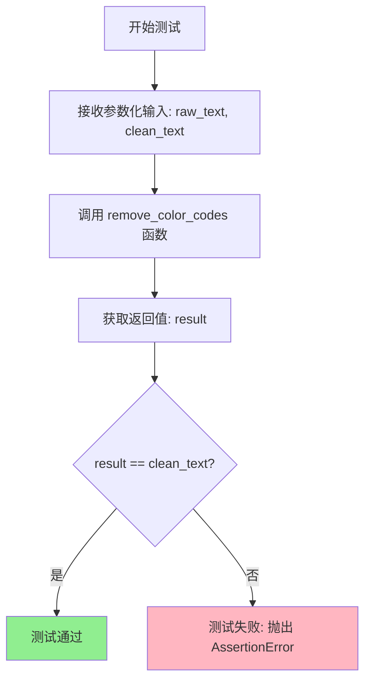

# `.\AutoGPT\classic\forge\forge\logging\test_utils.py` 详细设计文档

这是一个pytest测试文件，通过参数化测试验证remove_color_codes函数移除ANSI转义序列（颜色代码）的功能，测试用例覆盖了多种颜色代码格式、嵌套颜色代码以及普通文本的场景。

## 整体流程

```mermaid
graph TD
    A[开始测试] --> B[参数化测试: 获取测试数据对]
    B --> C{遍历所有测试用例}
    C --> D[调用 remove_color_codes(raw_text)]
    D --> E{返回值 == clean_text?}
    E -- 是 --> F[测试通过]
    E -- 否 --> G[测试失败]
    F --> C
    G --> H[抛出 AssertionError]
    C --> I[所有测试用例完成]
```

## 类结构

```
测试文件 (无类定义)
└── test_remove_color_codes (参数化测试函数)
```

## 全局变量及字段


### `raw_text`
    
测试输入参数，包含ANSI转义序列的原始文本

类型：`str`
    


### `clean_text`
    
期望输出参数，清理颜色代码后的文本

类型：`str`
    


    

## 全局函数及方法


### `test_remove_color_codes`

这是pytest参数化测试函数，用于验证`remove_color_codes`函数能否正确移除ANSI转义序列（颜色代码）。

参数：

- `raw_text`：`str`，包含ANSI颜色代码的原始输入文本
- `clean_text`：`str`，期望清理后的文本（不含ANSI颜色代码）

返回值：`None`，pytest测试函数无返回值，通过断言验证功能正确性

#### 流程图



#### 带注释源码

```python
import pytest
# 导入被测试的工具函数
from .utils import remove_color_codes


# 使用pytest参数化装饰器，定义多组测试用例
# 每组包含：原始文本 raw_text 和期望的干净文本 clean_text
@pytest.mark.parametrize(
    "raw_text, clean_text",
    [
        # 测试用例1: 包含颜色代码的命令和参数
        (
            "COMMAND = \x1b[36mbrowse_website\x1b[0m  "  # \x1b[36m=青色, \x1b[0m=重置
            "ARGUMENTS = \x1b[36m{'url': 'https://www.google.com',"  # 字典参数也带颜色
            " 'question': 'What is the capital of France?'}\x1b[0m",
            "COMMAND = browse_website  "  # 期望移除所有ANSI代码
            "ARGUMENTS = {'url': 'https://www.google.com',"
            " 'question': 'What is the capital of France?'}",
        ),
        # 测试用例2: 包含URL的德语文本，无颜色代码（应保持不变）
        (
            "{'Schaue dir meine Projekte auf github () an, als auch meine Webseiten': "
            "'https://github.com/Significant-Gravitas/AutoGPT,"
            " https://discord.gg/autogpt und https://twitter.com/Auto_GPT'}",
            "{'Schaue dir meine Projekte auf github () an, als auch meine Webseiten': "
            "'https://github.com/Significant-Gravitas/AutoGPT,"
            " https://discord.gg/autogpt und https://twitter.com/Auto_GPT'}",
        ),
        # 测试用例3: 空字符串
        ("", ""),
        # 测试用例4: 普通文本，无颜色代码
        ("hello", "hello"),
        # 测试用例5: 部分颜色代码（红色\x1B[31m）
        ("hello\x1B[31m world", "hello world"),
        # 测试用例6: 多种颜色代码混用（青色\x1B[36m，绿色\x1B[32m）
        ("\x1B[36mHello,\x1B[32m World!", "Hello, World!"),
        # 测试用例7: 嵌套颜色代码和加粗\x1B[1m
        (
            "\x1B[1m\x1B[31mError:\x1B[0m\x1B[31m file not found",
            "Error: file not found",
        ),
    ],
)
# 测试函数：验证remove_color_codes正确移除ANSI转义序列
def test_remove_color_codes(raw_text, clean_text):
    # 断言：调用函数后的结果应等于期望的干净文本
    assert remove_color_codes(raw_text) == clean_text
```

## 关键组件


### remove_color_codes 函数

从 `.utils` 模块导入的核心工具函数，用于移除 ANSI 转义序列（颜色代码），将带颜色的原始文本转换为纯文本。

### pytest 参数化测试

使用 `@pytest.mark.parametrize` 装饰器定义的多场景测试用例，覆盖了多种 ANSI 颜色代码场景，包括基本颜色代码、组合颜色代码、重置代码等。

### 测试用例集

包含 8 个测试场景的测试数据，涵盖单色代码、多色组合、重置代码、嵌套代码、空字符串等边界情况。

### ANSI 颜色代码模式

代码处理的特定文本模式，包括 `\x1b[` 开头的转义序列和 `\x1b[0m` 重置序列，这是需要被识别和移除的目标模式。

### 断言验证逻辑

使用 `assert` 语句验证 `remove_color_codes` 函数输出与预期纯文本的一致性，确保功能正确性。


## 问题及建议


### 已知问题

-   **测试覆盖不足**：测试用例仅覆盖了部分ANSI转义序列（如`\x1b[36m`、`\x1b[31m`、`\x1b[1m`、`\x1b[0m`），未覆盖其他常见的颜色代码（如`\x1b[32m`绿色、`\x1b[33m`黄色、`\x1b[34m`蓝色等）以及256色和TrueColor格式
-   **边界情况测试缺失**：缺少对`None`输入、非字符串类型输入、空格混合颜色代码等边界情况的测试
-   **无错误处理验证**：未测试函数对异常输入的容错能力
-   **性能测试缺失**：未包含对大段文本或大量颜色代码的处理性能测试
-   **断言信息不够详细**：测试失败时仅显示简单的断言错误，缺少自定义错误消息辅助调试
-   **测试数据重复**：第二个测试用例的输入输出完全相同，未实际验证任何功能

### 优化建议

-   **扩展参数化测试用例**：添加更多ANSI代码变体，包括256色模式（`\x1b[38;5;Nm`）和RGB颜色模式（`\x1b[38;2;R;G;Bm`）
-   **增加边界测试**：添加`None`、整数、列表、字典等非字符串类型的测试用例，验证函数是否正确处理或抛出合理异常
-   **添加自定义断言消息**：使用`assert actual == expected, f"Failed for input {raw_text!r}"`提供更友好的错误信息
-   **移除冗余测试**：删除输入输出完全相同的第二个测试用例，或将其改为有效的测试场景
-   **添加性能基准测试**：使用`pytest-benchmark`对大文本处理进行性能测试，确保算法效率
-   **增加组合颜色代码测试**：添加更复杂的嵌套颜色代码测试用例，如`\x1b[1m\x1b[4m\x1b[31m`等组合场景
-   **考虑添加模糊测试**：使用` hypothesis`库进行基于属性的测试，发现更多边缘情况


## 其它


### 设计目标与约束

该代码的核心目标是为 `remove_color_codes` 函数提供全面的单元测试，验证其正确移除 ANSI 转义序列（颜色代码）的能力。设计约束包括：测试需覆盖多种颜色代码场景（包括单色、多色嵌套、重置码等）、空字符串输入、纯文本无颜色代码等情况，确保函数的鲁棒性和正确性。

### 错误处理与异常设计

测试代码本身不涉及显式的异常处理，因为该测试函数主要验证函数的正确输出。对于 `remove_color_codes` 函数，预期在接收 None 或非字符串类型输入时可能抛出 TypeError，测试数据中未包含此类边界情况，建议补充测试。

### 数据流与状态机

测试数据流如下：测试参数化数据（raw_text, clean_text）→ 测试函数执行 → 调用 remove_color_codes(raw_text) → 比对返回值与预期 clean_text → 断言结果。状态机转换：输入原始文本（含/不含颜色代码）→ 处理后输出纯文本。

### 外部依赖与接口契约

外部依赖：pytest 框架（用于参数化测试和断言）、.utils 模块中的 remove_color_codes 函数。接口契约：remove_color_codes 函数接收一个字符串参数，返回移除 ANSI 转义序列后的字符串。

### 性能考虑

当前测试采用参数化方式，8 组测试数据规模较小，执行速度快。性能优化空间：如有大规模测试需求，可考虑使用 pytest 的 fixtures 共享测试数据，或使用 pytest-xdist 进行并行测试。

### 安全考虑

测试代码本身不涉及敏感数据处理，测试数据为公开的 ANSI 转义序列示例。安全建议：确保 remove_color_codes 函数在处理恶意构造的特殊字符序列时不会导致缓冲区溢出或正则表达式拒绝服务（ReDoS）。

### 测试覆盖率

当前测试覆盖了以下场景：单色颜色代码、多色嵌套、重置码、混合颜色与文本、空字符串、纯文本无颜色代码、复杂嵌套颜色代码。覆盖盲点：超长字符串输入、连续多次调用性能、特殊 Unicode 字符与颜色代码组合。

### 可维护性与扩展性

测试代码结构清晰，使用参数化装饰器便于扩展新测试用例。建议：将测试数据外部化到独立的 JSON/YAML 文件；为每个测试用例添加明确的文档字符串说明测试意图；考虑添加性能基准测试。


    