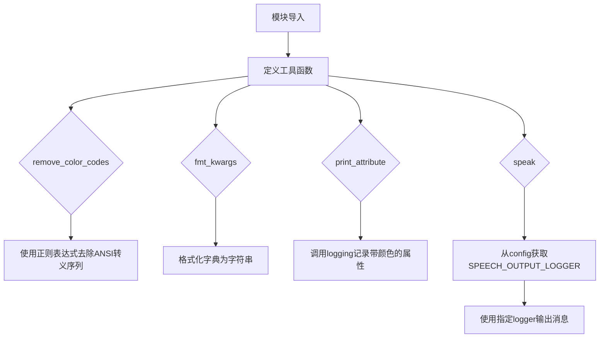
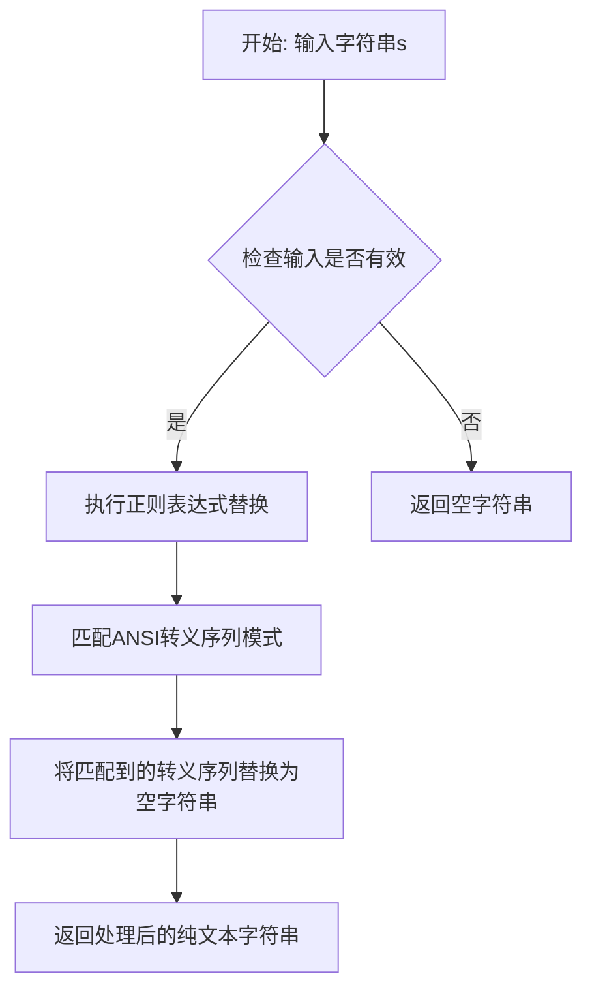
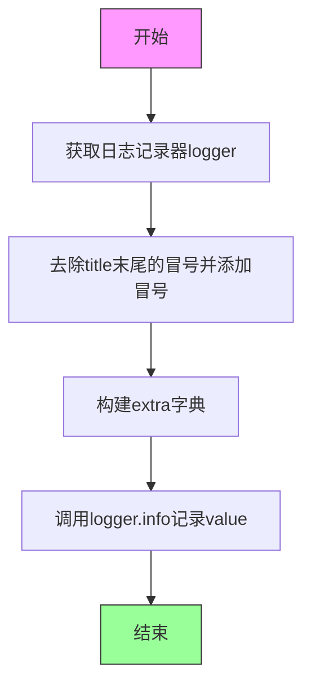
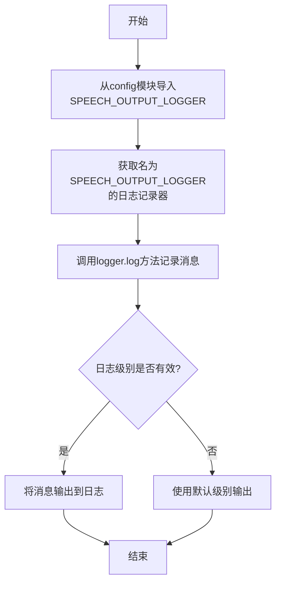

# `.\AutoGPT\classic\forge\forge\logging\utils.py` 详细设计文档

该模块提供日志输出相关的工具函数，包括去除ANSI颜色码、格式化关键字参数、打印属性以及语音日志输出等功能，主要用于统一和美化日志信息的显示。

## 整体流程



## 类结构

```
该文件无类定义，仅包含模块级函数
```

## 全局变量及字段


### `SPEECH_OUTPUT_LOGGER`
    
从config模块导入的全局变量，用于语音输出日志记录器名称

类型：`str`
    


    

## 全局函数及方法


### `remove_color_codes`

该函数用于移除字符串中的ANSI颜色转义码（也称为ANSI转义序列），这些转义码常用于终端输出的彩色文本。函数接收一个包含颜色代码的字符串，通过正则表达式匹配并移除所有ANSI转义序列，最后返回干净的纯文本字符串。

参数：

- `s`：`str`，需要移除颜色代码的原始字符串

返回值：`str`，移除所有ANSI转义序列后的纯文本字符串

#### 流程图



#### 带注释源码

```python
import logging
import re
from typing import Any

from colorama import Fore


def remove_color_codes(s: str) -> str:
    """
    移除字符串中的ANSI颜色转义码
    
    参数:
        s: 包含ANSI转义序列的输入字符串
    
    返回:
        移除了所有ANSI转义序列后的纯文本字符串
    """
    # 正则表达式解析:
    # \x1B          - 匹配ESC字符（ASCII 27，ANSI转义序列的开始）
    # (?:...)       - 非捕获组，用于分组两种可能的转义序列格式
    # [@-Z\\-_]     - 简单转义序列：ESC后跟@到Z、\、-或_字符
    # |             - 或者
    # \[            - CSI（控制序列导入器）序列开始
    # [0-?]*        - 零个或多个参数字节（字符范围0x30-0x3F）
    # [ -/]*        - 零个或多个中间字节（字符范围0x20-0x2F）
    # [@-~]         - 终止字节（字符范围0x40-0x7E）
    return re.sub(r"\x1B(?:[@-Z\\-_]|\[[0-?]*[ -/]*[@-~])", "", s)
```


### `fmt_kwargs`

将关键字参数字典格式化为可读的键值对字符串表示形式，用于日志输出或调试信息展示。

参数：

- `kwargs`：`dict`，需要格式化的关键字参数字典

返回值：`str`，格式化的字符串，格式为 `key1=value1, key2=value2, ...`

#### 流程图

```mermaid
flowchart TD
    A[开始] --> B[接收 kwargs 字典]
    B --> C[遍历字典的 items]
    C --> D[对每个键值对格式化: key=repr(value)]
    D --> E[用逗号连接所有格式化后的字符串]
    E --> F[返回结果字符串]
```

#### 带注释源码

```python
def fmt_kwargs(kwargs: dict) -> str:
    """
    将关键字参数字典格式化为字符串
    
    参数:
        kwargs: 要格式化的关键字参数字典
    
    返回:
        格式化的字符串，格式为 'key1=value1, key2=value2, ...'
    """
    # 使用生成器表达式遍历字典的键值对
    # repr(v) 将值转换为字符串表示形式（带引号）
    # f-string 格式化每个键值对为 "key=value" 形式
    # ", ".join 将所有键值对用逗号和空格连接
    return ", ".join(f"{n}={repr(v)}" for n, v in kwargs.items())
```


### `print_attribute`

该函数用于格式化并记录带有颜色信息的属性信息，通过日志系统输出标题和对应的值，支持自定义标题和值的颜色。

参数：

- `title`：`str`，属性标题文本
- `value`：`Any`，要打印的属性值，支持任意类型
- `title_color`：`str = Fore.GREEN`，标题的颜色，默认为绿色
- `value_color`：`str = ""`，值的颜色，默认为空（无颜色）

返回值：`None`，该函数无返回值，仅通过日志系统输出信息

#### 流程图



#### 带注释源码

```python
def print_attribute(
    title: str, value: Any, title_color: str = Fore.GREEN, value_color: str = ""
) -> None:
    """
    打印带有颜色属性的日志信息
    
    参数:
        title: 属性标题
        value: 属性值
        title_color: 标题颜色代码
        value_color: 值颜色代码
    """
    # 获取根日志记录器实例
    logger = logging.getLogger()
    
    # 使用日志记录值，extra参数传递格式化所需的信息
    # title经过处理：移除末尾冒号再添加，确保格式统一
    logger.info(
        str(value),  # 将value转换为字符串进行记录
        extra={
            # 格式化标题：去除末尾冒号后重新添加
            "title": f"{title.rstrip(':')}:",
            # 标题颜色属性
            "title_color": title_color,
            # 值颜色属性
            "color": value_color,
        },
    )
```


### `speak`

该函数是一个日志输出封装，用于将消息通过指定的日志级别记录到特定的语言输出日志器中，支持自定义日志级别并从配置模块获取专用日志记录器。

参数：

- `message`：`str`，要输出的消息内容
- `level`：`int`，日志级别，默认为 `logging.INFO`（20）

返回值：`None`，该函数仅执行日志记录，不返回任何值

#### 流程图



#### 带注释源码

```python
def speak(message: str, level: int = logging.INFO) -> None:
    """
    使用指定的日志级别将消息记录到语音输出日志器中
    
    参数:
        message: str - 要输出的消息内容
        level: int - 日志级别，默认为 logging.INFO (20)
    返回:
        None - 该函数仅执行日志记录操作
    """
    # 从当前包的 config 模块导入语音输出日志器名称常量
    from .config import SPEECH_OUTPUT_LOGGER

    # 获取指定名称的日志记录器实例
    # SPEECH_OUTPUT_LOGGER 是配置中定义的专用日志器名称
    logger = logging.getLogger(SPEECH_OUTPUT_LOGGER)

    # 使用指定的日志级别记录消息
    # level 参数允许调用者控制日志的重要程度
    # 默认为 logging.INFO (20)，可传递其他级别如 DEBUG, WARNING, ERROR 等
    logger.log(level, message)
```

## 关键组件


### 核心功能概述

该模块提供了一套日志输出辅助工具，包括移除终端颜色代码、格式化参数、打印带颜色的日志属性以及语音播报日志消息等功能，主要用于美化和控制日志输出格式。

---

### 关键组件

#### 1. remove_color_codes 函数

用于移除字符串中的ANSI转义序列（终端颜色代码），确保日志输出到文件或不支持颜色的环境时保持纯文本格式。

#### 2. fmt_kwargs 函数

将字典参数格式化为可读的字符串表示，常用于日志记录中展示函数调用参数。

#### 3. print_attribute 函数

以结构化、带颜色标记的方式输出日志属性，标题使用指定颜色，值使用可选颜色，适用于日志可视化展示。

#### 4. speak 函数

通过专用日志记录器输出消息，支持日志级别控制，用于语音播报或独立日志通道的日志输出。

#### 5. SPEECH_OUTPUT_LOGGER 配置

从配置模块导入的日志记录器名称常量，用于区分语音输出与普通日志的记录通道。

---

### 潜在技术债务与优化空间

1. **缺少类型注解完整性**: remove_color_codes函数的返回类型可标注为str
2. **硬编码依赖**: SPEECH_OUTPUT_LOGGER在函数内部导入，违反即时导入原则，建议移至模块顶部
3. **日志配置依赖**: print_attribute依赖外部日志配置（extra字段），缺少时的行为不明确
4. **正则表达式性能**: remove_color_codes每次调用都编译正则表达式，建议预编译
5. **缺少单元测试**: 无测试用例覆盖

---

### 其它项目

#### 设计目标与约束

- 目标：提供统一的日志输出格式化能力，支持彩色终端输出和纯文本输出
- 约束：依赖colorama库进行颜色控制，依赖外部config模块的SPEECH_OUTPUT_LOGGER配置

#### 错误处理与异常设计

- 当前实现无显式异常处理
- 正则替换操作稳定，异常风险低
- 日志记录失败时依赖Python日志模块的默认行为

#### 外部依赖与接口契约

- **colorama.Fore**: 提供终端颜色常量（GREEN等）
- **logging模块**: 标准库，提供日志记录功能
- **re模块**: 标准库，提供正则表达式支持
- **config.SPEECH_OUTPUT_LOGGER**: 外部配置，需确保该配置存在


## 问题及建议


### 已知问题

-   **正则表达式未预编译**：`remove_color_codes` 函数每次调用都重新编译正则表达式，性能开销较大，应使用 `re.compile` 预编译
-   **import 顺序不规范**：标准库和第三方库的导入未分开，违反 PEP8 规范
-   **缺少模块级文档**：整个模块没有模块文档字符串（docstring）
-   **硬编码日志级别**：`print_attribute` 函数固定使用 `logger.info`，无法根据场景选择不同日志级别
-   **类型注解不完整**：`remove_color_codes` 和 `fmt_kwargs` 缺少返回类型注解
-   **日志消息冗余**：`print_attribute` 中同时传递了日志消息 `str(value)` 和 `extra` 中的 `title`，存在数据冗余
-   **缺少错误处理**：函数没有对异常情况进行处理，如 `remove_color_codes` 传入非字符串类型
-   **依赖隐式假设**：`speak` 函数依赖 `config` 模块中的 `SPEACH_OUTPUT_LOGGER`，但未做导入失败或配置缺失的处理

### 优化建议

-   将正则表达式 `r"\x1B(?:[@-Z\\-_]|\[[0-?]*[ -/]*[@-~])"` 预编译为模块级常量 `re.compile(...)`
-   调整 import 顺序：标准库 → 第三方库 → 本地模块
-   为模块添加文档字符串，说明模块用途
-   为 `print_attribute` 添加 `level` 参数，允许调用方指定日志级别
-   完善类型注解：`remove_color_codes` 返回 `str` 类型，`fmt_kwargs` 返回 `str` 类型
-   添加类型检查或异常捕获，处理非字符串输入
-   在 `speak` 函数中添加异常处理，确保配置不存在时提供回退方案
-   考虑将 `title_color` 的默认值也设为 `Fore.GREEN`，保持一致性


## 其它


### 设计目标与约束

本模块旨在提供统一的日志输出能力，支持带颜色的日志格式、参数化日志记录、ANSI颜色代码移除以及语音播报功能。约束包括：依赖colorama库实现跨平台颜色支持，使用Python标准logging模块，确保与现有日志系统兼容。

### 错误处理与异常设计

模块本身较为简单，主要依赖Python内置异常机制。若传入无效参数（如title或value类型不匹配），Python类型检查会在运行时抛出TypeError。日志记录失败时，logging模块会自动传播异常，不做额外捕获。remove_color_codes函数在输入为None时会导致TypeError，需确保调用方传入字符串类型。

### 外部依赖与接口契约

本模块依赖以下外部包：colorama（提供Fore常量用于颜色定义）、logging（标准库）、re（标准库）、typing（标准库）。对外接口包括：remove_color_codes(s: str) -> str，接受字符串返回移除颜色代码后的字符串；fmt_kwargs(kwargs: dict) -> str，接受字典返回格式化字符串；print_attribute(title: str, value: Any, title_color: str, value_color: str) -> None，执行带颜色的属性打印；speak(message: str, level: int) -> None，执行语音日志输出。

### 性能考虑

remove_color_codes使用正则表达式匹配ANSI转义序列，正则表达式已编译为常量可被复用，建议使用re.compile预编译以提升性能。fmt_kwargs使用列表推导式，复杂度为O(n)，n为kwargs数量。print_attribute和speak每次调用都会获取Logger实例，存在轻微开销，可考虑缓存Logger实例。

### 安全性考虑

remove_color_codes用于清理可能包含恶意ANSI序列的输入，防止终端注入攻击。fmt_kwargs使用repr()处理参数值，可安全处理包含特殊字符的字符串。日志输出需注意敏感信息泄露风险，调用方应避免传入密码、密钥等敏感数据。

### 使用示例

```python
# 移除颜色代码
clean_text = remove_color_codes("\033[31m红色文本\033[0m")

# 格式化kwargs
formatted = fmt_kwargs({"name": "test", "value": 123})

# 打印属性
print_attribute("用户名", "admin", Fore.GREEN)

# 语音播报
speak("任务已完成", logging.INFO)
```

### 配置说明

speak函数依赖config模块中的SPEECH_OUTPUT_LOGGER配置项，该配置指定语音日志输出的logger名称。调用方需确保config模块已正确配置SPEECH_OUTPUT_LOGGER常量，否则会引发ImportError。

    